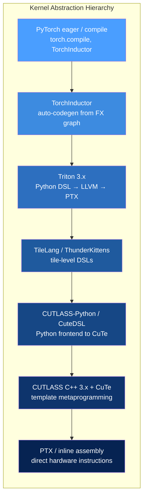
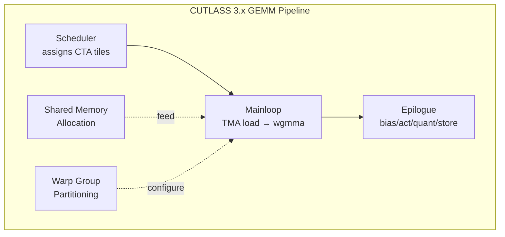
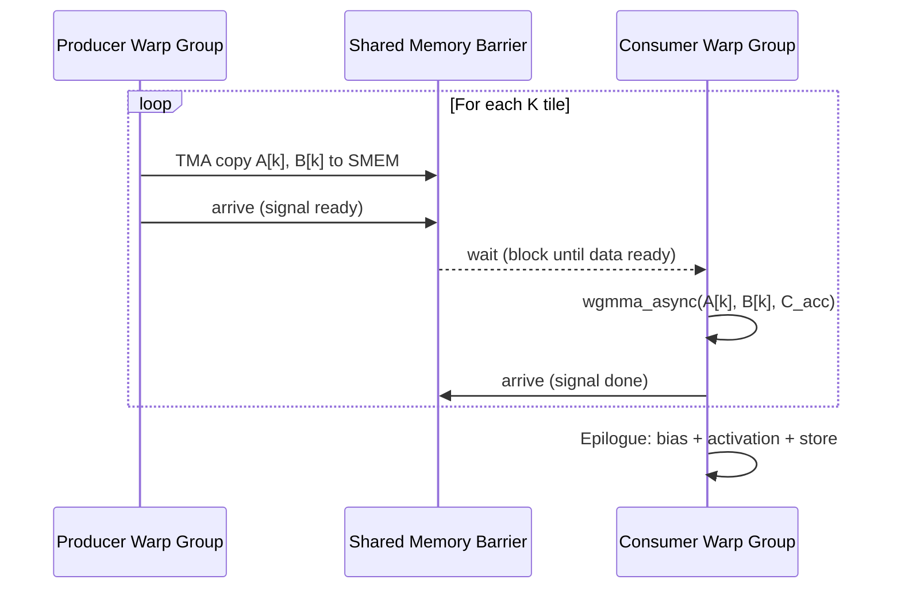
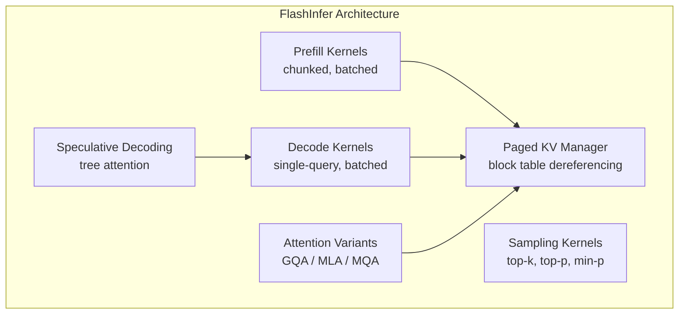
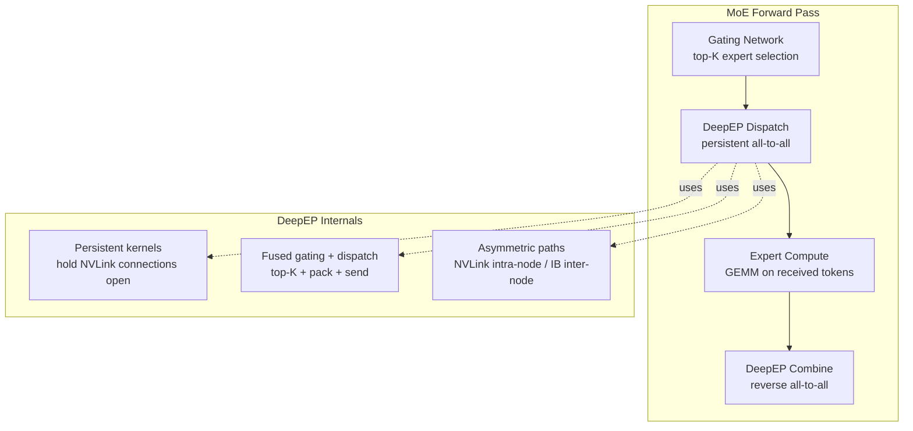
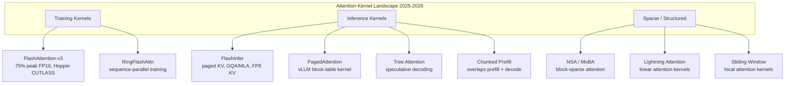
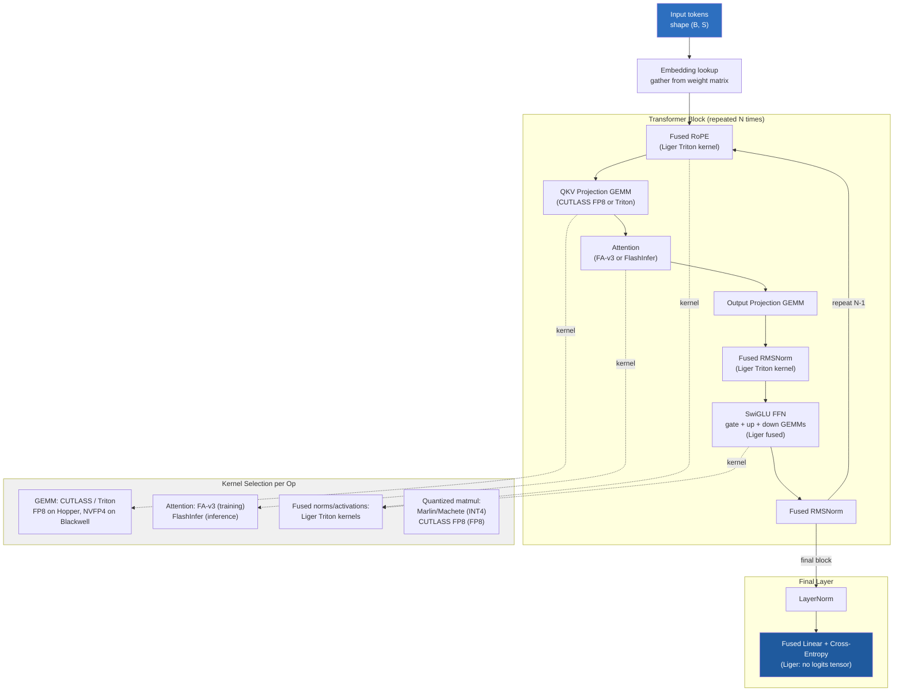

# Cutting-Edge Kernels — The 2025-2026 Kernel Programming Frontier

> **Layer:** L5.
> **Prerequisites:** [Triton_and_Kernels](Triton_and_Kernels.md), [CUDA_Optimization](CUDA_Optimization.md), [Blackwell_Architecture](../L3_Microarchitecture/Blackwell_Architecture.md).
> **Hands off to:** [Modern_Quantization_Frontier](../L6_Algorithms_and_Models/Modern_Quantization_Frontier.md), [vLLM_Internals](../L8_Inference_and_Serving/vLLM_Internals.md), [Inference_Frameworks](../L8_Inference_and_Serving/Inference_Frameworks.md).

---

## 0. The kernel frontier in 2025-2026

The gap between "what the hardware can do" and "what software extracts" has narrowed dramatically on NVIDIA Hopper and Blackwell, but only for engineers who can navigate the modern kernel stack: Triton for productivity, CUTLASS 3.x with CuTe for peak hardware utilization, and a growing ecosystem of specialized libraries (FlashInfer, DeepEP, TileLang, ThunderKittens, Liger Kernel) that encode domain-specific expertise into reusable, high-performance primitives. This page maps the entire hierarchy, explains the key technologies, and provides the mental models needed to choose the right tool and approach for any kernel-level problem.

---

## 1. The Modern Kernel-Author Stack

Every GPU kernel written in 2025-2026 lives somewhere on the abstraction hierarchy below. The choice determines development time, portability, and how close the result gets to theoretical peak.



### 1.1 When to use each level

| Level | Lines of code (matmul) | Typical perf vs peak | Development time | Use when |
|---|---|---|---|---|
| PyTorch ops | 5-10 | cuBLAS/cuDNN speed | Minutes | Standard ops, no custom kernels |
| TorchInductor | 0 (auto) | 85-95% | Zero (auto) | `torch.compile` covers it |
| Triton | 50-100 | 85-95% | Hours-days | Custom ops, autotuning, moderate complexity |
| TileLang | 40-80 | 90-98% | Hours-days | Hopper/Blackwell tile pipelines |
| CUTLASS-Python | 60-120 | 95-100% | Days | CuTe expressiveness without C++ |
| CUTLASS C++ | 200-600 | 98-100% | Days-weeks | Absolute peak, production GEMM kernels |
| PTX inline asm | 500+ | 100% | Weeks | Instructions not exposed by compilers |

### 1.2 Decision flow

The practical rule: start at the highest level that could work. Escalate only when measurement shows a gap. A Triton kernel at 90% of peak that ships in a day beats a CUTLASS kernel at 98% that takes two weeks, unless the kernel is on the training or inference critical path for a multi-million-dollar cluster.

---

## 2. Triton 3.x — Updated Capabilities

Triton has evolved substantially since its initial release. The 3.x line (2024-2026) adds Hopper/Blackwell-native features that narrow the gap with CUTLASS.

### 2.1 New features in Triton 3.x

| Feature | Status | Impact |
|---|---|---|
| Hopper TMA support | Stable | Bulk tile loads without register pressure |
| `wgmma` async tensor-core dispatch | Stable | Asynchronous warpgroup MMA |
| Block pointers (`tl.make_block_ptr`) | Stable | Ergonomic multi-dimensional tile addressing |
| `tl.async_copy` / `tl.barrier` | Experimental | Producer-consumer async pipelines |
| FP8 (E4M3, E5M2) | Stable | Native FP8 matmul on Hopper |
| FP4 (NVFP4) | Experimental | Blackwell FP4 tensor cores |
| `num_stages` software pipelining | Stable | Multi-stage prefetch overlap |

### 2.2 Block pointers

Block pointers simplify the pointer-arithmetic-heavy code that dominates Triton kernels:

```python
@triton.jit
def matmul_tiled(A, B, C, M, N, K,
                 BLOCK_M: tl.constexpr, BLOCK_N: tl.constexpr,
                 BLOCK_K: tl.constexpr):
    pid_m = tl.program_id(0)
    pid_n = tl.program_id(1)

    a_block_ptr = tl.make_block_ptr(
        base=A, shape=(M, K), strides=(K, 1),
        offsets=(pid_m * BLOCK_M, 0),
        block_shape=(BLOCK_M, BLOCK_K), order=(1, 0)
    )
    b_block_ptr = tl.make_block_ptr(
        base=B, shape=(K, N), strides=(N, 1),
        offsets=(0, pid_n * BLOCK_N),
        block_shape=(BLOCK_K, BLOCK_N), order=(1, 0)
    )

    acc = tl.zeros((BLOCK_M, BLOCK_N), dtype=tl.float32)
    for k in range(0, K, BLOCK_K):
        a = tl.load(a_block_ptr)              # TMA-backed on Hopper
        b = tl.load(b_block_ptr)
        acc = tl.dot(a, b, acc)
        a_block_ptr = tl.advance(a_block_ptr, (0, BLOCK_K))
        b_block_ptr = tl.advance(b_block_ptr, (BLOCK_K, 0))

    # Store output tile
    c_block_ptr = tl.make_block_ptr(
        base=C, shape=(M, N), strides=(N, 1),
        offsets=(pid_m * BLOCK_M, pid_n * BLOCK_N),
        block_shape=(BLOCK_M, BLOCK_N), order=(1, 0)
    )
    tl.store(c_block_ptr, acc.to(tl.float16))
```

Block pointers abstract away stride arithmetic, boundary masking, and on Hopper can lower directly to TMA descriptors, eliminating the need for manual pointer computation per thread.

### 2.3 Triton limits in 2025-2026

Triton still does not expose:

- **Warp specialization** (dedicating warps to producer vs consumer roles). Growing support via `tl.async_copy` but not production-ready.
- **Threadblock clusters** (Hopper feature: multiple blocks sharing distributed shared memory). Not surfaced.
- **TMEM** (Blackwell tensor memory). Not yet exposed.
- **Custom mbarrier patterns** for complex synchronization.

When these are needed, escalate to CUTLASS, TileLang, or ThunderKittens.

---

## 3. CUTLASS 3.x and CuTe

NVIDIA's CUTLASS (CUDA Templates for Linear Algebra Subroutines) is the de facto standard for production GEMM, attention, and quantized-matmul kernels. CUTLASS 3.x (2023-2026) is a ground-up redesign built on **CuTe** (CUTLASS Tensor Expressions).

### 3.1 CuTe layout algebra

CuTe represents every tensor as a pair `(shape, stride)` called a **layout**. Layouts compose: a tile in shared memory is a layout; a warp's slice of that tile is a layout partition; a swizzle is a layout transformation.

```cpp
#include <cute/layout.hpp>
using namespace cute;

// A 128x64 row-major tile in shared memory
auto smem_layout = make_layout(make_shape(Int<128>{}, Int<64>{}),
                               make_stride(Int<64>{}, Int<1>{}));

// A swizzled layout to avoid bank conflicts
auto swizzled = composition(Swizzle<3,3,3>{}, smem_layout);

// Partition the tile for warp 0 out of 4 warps
auto warps = make_layout(make_shape(Int<4>{}));
auto warp_tile = logical_divide(smem_layout, warps);
// warp_tile is the slice that warp_idx owns
```

Key CuTe operations:

| Operation | Meaning |
|---|---|
| `make_layout(shape, stride)` | Define a tensor layout |
| `composition(A, B)` | Compose two layouts (nested tiling) |
| `logical_divide(L, divider)` | Partition layout into groups |
| `zipped_divide(L, tile)` | Separate into inner-tile and outer-tile |
| `coalesce(L)` | Merge dimensions with stride-1 |
| `composition(Swizzle{}, L)` | Apply XOR swizzle to shared memory |

The CuTe type system is entirely compile-time (C++ template metaprogramming). The layout algebra runs at compile time, producing zero-overhead runtime indexing. Steep learning curve, but once internalized, any Hopper/Blackwell tile layout can be expressed in under 20 lines.

### 3.2 Templated GEMM structure

A CUTLASS 3.x GEMM kernel assembles from five templated components:



The kernel template signature (simplified):

```cpp
template <
    class ProblemShape,           // (M, N, K)
    class CollectiveMainloop,     // TMA + wgmma schedule
    class CollectiveEpilogue,     // output transformation
    class TileScheduler           // CTA-to-tile mapping
>
class Sm90GemmKernel;
```

Each template parameter is itself assembled from CuTe layout primitives. The mainloop encapsulates the entire producer-consumer pipeline: TMA descriptors for A and B tiles, shared memory staging, wgmma issue, and barrier synchronization.

### 3.3 TMA-aware mainloop

On Hopper, the mainloop uses TMA (Tensor Memory Accelerator) for asynchronous bulk tile transfers from HBM to shared memory:

```cpp
// Simplified Sm90 TMA mainloop pseudocode
template <class... Args>
struct Sm90TmaGemmMainloop {
    static __device__ void run(
        Params const& params,
        Tensor const& tCrA, Tensor const& tCrB,   // register fragments
        Tensor const& tCsA, Tensor const& tCsB,    // shared memory tiles
        TmaDescriptor const& tma_a, TmaDescriptor const& tma_b
    ) {
        // Producer warpgroup: issue TMA prefetch
        if (elect_one_sync()) {
            copy(tma_a, tCsA(_, _, k_block_next));  // async TMA copy
            copy(tma_b, tCsB(_, _, k_block_next));
        }

        // Consumer warpgroups: wgmma on current stage
        warpgroup_fence();
        gemm(tCrA, tCrB, tCc);                     // wgmma_async
        warpgroup_arrive();

        // Barrier: wait for next stage load to complete
        barrier_wait(shared_barrier, k_stage_next);
    }
};
```

The pipeline has 2-4 stages. Stage $k+1$ loads while stage $k$ computes. With TMA, only 1-2 threads issue the load (the TMA hardware does the heavy lifting), freeing the remaining threads for compute.

### 3.4 Warp specialization

CUTLASS 3.x on Hopper uses warp specialization: within a threadblock, one warp group (4 warps, 128 threads) acts as the **producer** (issues TMA loads), and one or more warp groups act as **consumers** (issue wgmma, accumulate, run epilogue).



This decouples load latency from compute throughput. The producer can prefetch stages ahead while the consumer saturates the tensor cores. FlashAttention v3 uses an identical pattern.

### 3.5 Epilogue fusion

The epilogue is where post-matmul operations get fused into the kernel, avoiding extra HBM round-trips:

```cpp
// Built-in epilogue operations in CUTLASS 3.x
using Epilogue = cutlass::epilogue::collective::Sm90TmaWarpSpecialized<
    // Output tile: accumulate then apply
    cutlass::epilogue::threadblock::EpilogueWithBroadcast<
        float,                              // accumulator type
        half_t,                             // output type
        BiasOp,                             // bias addition
        cutlass::epilogue::thread::ReLU,    // activation
        cutlass::epilogue::thread::ScaleOp  // per-channel quant scale
    >
>;
```

Common fused epilogues: bias + activation (ReLU, GELU, SwiGLU), per-row/per-column scaling (for quantization), dequantization, and direct TMA store back to HBM.

---

## 4. CUTLASS-Python / CuteDSL

NVIDIA has released a Python frontend for CUTLASS that compiles CuTe primitives into kernels without manual C++ template programming.

### 4.1 CuteDSL kernel example

```python
import cutlass
from cutlass import *

# Define a GEMM with FP16 inputs, FP32 accumulation
plan = cutlass.op.Gemm(
    element=cutlass.float16,
    layout=cutlass.LayoutType.RowMajor,
    element_accumulator=cutlass.float32,
    arch=90,  # Hopper SM90
)

# Configure the mainloop with TMA + wgmma
plan.mainloop = cutlass.gemm.collective.MainloopSm90(
    tile_shape=(128, 256, 64),
    stage_count=3,
    scheduler=cutlass.gemm.kernel.TileScheduler.StreamK,
)

# Fuse bias + activation into epilogue
plan.epilogue = cutlass.epilogue.collective.EpilogueSm90(
    bias=True,
    activation=cutlass.epilogue.thread.ReLU,
)

# Compile and run
plan.compile()
plan.run(A, B, C, bias=bias_tensor)
```

CuteDSL provides Python-level ergonomics while generating CUTLASS-quality PTX. Adoption is growing in teams that need CUTLASS performance without C++ template expertise.

### 4.2 CUTLASS-Python vs Triton

| Dimension | CUTLASS-Python | Triton |
|---|---|---|
| Backend | CUTLASS C++ templates | LLVM → PTX |
| TMA / wgmma control | Full | Partial |
| Epilogue fusion | Built-in | Manual |
| Autotuning | Manual or external | Built-in |
| Learning curve | Medium (need CuTe mental model) | Low |
| Typical perf | 95-100% peak | 85-95% peak |

CUTLASS-Python excels when the kernel structure is GEMM-like (tile load, matmul, epilogue). Triton excels for non-GEMM patterns (reductions, sorting, element-wise operations with complex control flow).

---

## 5. FlashInfer — Attention Kernels for Inference

FlashInfer (Yu et al., 2024-2025, CMU) is the dominant attention-kernel library for LLM inference. It complements FlashAttention (training-focused) with serving-specific features that no other library provides in a unified interface.

### 5.1 Architecture



### 5.2 Key features

| Feature | Description | Why it matters |
|---|---|---|
| Paged KV cache | Takes block tables directly; no contiguous KV needed | vLLM/SGLang paged memory model |
| Variable (ragged) batch | Different sequence lengths in one batch | Avoids padding waste in serving |
| GQA / MLA / MQA | Specialized kernels for grouped/multi-head/compressed attention | Llama-3, DeepSeek-V3, Mixtral |
| FP8 KV cache | FP8 (E4M3) key-value storage | 2x KV cache capacity |
| Chunked prefill | Splits long prefill into chunks to overlap with decode | Hybrid prefill-decode serving |
| Tree attention | Verifies multiple speculative tokens in one pass | Speculative decoding backends |
| Custom attention mask | Supports block-sparse, sliding window, hybrid masks | DeepSeek-NSA, MiniMax-MoBA |

### 5.3 Usage pattern

```python
import flashinfer

# Decode: single-token attention against paged KV cache
wrapper = flashinfer.BatchDecodeWithPagedKVCacheWrapper(
    workspace_buffer,
    kv_layout="NHD",  # [num_pages, page_size, num_heads, head_dim]
)
wrapper.plan(
    qo_indptr,         # query offsets
    kv_indptr,         # KV page offsets
    kv_last_page_len,  # valid length in last page
    num_qo_heads=32,
    num_kv_heads=8,    # GQA: 32/8 = 4 query heads per KV head
    head_dim=128,
    causal=True,
)
output = wrapper.run(q, paged_kv_cache)
```

### 5.4 FlashInfer vs FlashAttention

FlashAttention (Tri Dao lab) is the canonical training implementation. FA-v3 (Hopper) reaches ~75% of FP16 peak for bulk prefill. FlashInfer is specialized for the serving regime: paged KV access, variable batch sizes, GQA/MLA decoding, and speculative verification. Production stacks ship both: FA for training/bulk prefill, FlashInfer for the decode path and batched inference.

| Dimension | FlashAttention | FlashInfer |
|---|---|---|
| Primary use case | Training, bulk prefill | Inference decode, paged KV |
| Peak perf (training) | ~75% FP16 peak on Hopper | ~65-70% (paged overhead) |
| Paged KV | No | Yes |
| Variable batch | Limited | Native |
| Spec decoding | No | Tree attention |
| FP8 KV | Partial | Native |

---

## 6. DeepEP — MoE All-to-All

DeepSeek's open-source Expert Parallelism communication library (2025). DeepEP provides hand-tuned Hopper/Blackwell kernels for the all-to-all dispatch and combine operations fundamental to Mixture-of-Experts models.

### 6.1 Why not NCCL

Standard NCCL all-to-all is optimized for uniform message sizes. MoE routing produces **non-uniform, small messages** to many peers: each token goes to 1-8 of 256+ experts. This pattern underperforms on NCCL by 5-10x due to:

- Per-message startup overhead dominating transfer time.
- Suboptimal NVLink/IB path selection for small payloads.
- Lack of fusion between gating computation and dispatch.

### 6.2 DeepEP design



Key techniques:

- **Persistent kernels**: a long-running kernel maintains NVLink connections across dispatch calls, eliminating per-call setup overhead.
- **Fused gating + dispatch**: the top-K expert selection and token packing happen in the same kernel that initiates the all-to-all, avoiding intermediate materialization.
- **Asymmetric paths**: intra-node uses direct NVLink memcpy (bypassing NCCL); inter-node uses IB with pre-posted receives.

### 6.3 Performance

DeepSeek reports 5-10x speedup over NCCL all-to-all for typical MoE shapes (e.g., DeepSeek-V3 with 256 experts, top-8 routing, 7K tokens per microbatch). This makes MoE communication no longer the bottleneck; expert compute GEMM dominates.

### 6.4 Integration

DeepEP plugs into Megatron-LM, vLLM, and SGLang as a selectable all-to-all backend:

```python
# vLLM config
moe_all_to_all_backend: deepep   # or nccl, mscclpp
```

Alternatives: MSCCL++ (Microsoft, collective algorithm synthesis), NVSHMEM (GPU-native shared-memory primitives), and NCCL native all-to-all (still the default fallback).

---

## 7. TileLang — Tile-Level DSL

TileLang (BitMagic / OSU collaboration, 2024-2025) is a Python-embedded DSL that targets Hopper/Blackwell tile-level programming. Its abstraction is fundamentally different from Triton: instead of "a block of threads doing per-element work over tiles," TileLang models "tiles flowing through producers and consumers."

### 7.1 Programming model

```python
import tilelang as TL

@TL.prim_func
def matmul_kernel(
    A: TL.Buffer((M, K), "float16"),
    B: TL.Buffer((K, N), "float16"),
    C: TL.Buffer((M, N), "float16"),
):
    with TL.Kernel(M_BLOCKS, N_BLOCKS, threads=128) as (bx, by):
        # Allocate shared memory tiles
        A_shared = TL.alloc_shared((BM, BK), "float16")
        B_shared = TL.alloc_shared((BK, BN), "float16")
        # Allocate register accumulator
        C_reg = TL.alloc_fragment((BM, BN), "float32")

        TL.clear(C_reg)

        # Software-pipelined K loop
        for k in TL.Pipelined(K_BLOCKS, num_stages=3):
            # TMA-backed async copies (producer)
            TL.copy(A[by*BM:(by+1)*BM, k*BK:(k+1)*BK], A_shared)
            TL.copy(B[k*BK:(k+1)*BK, bx*BN:(bx+1)*BN], B_shared)
            # wgmma matmul on shared memory (consumer)
            TL.gemm(A_shared, B_shared, C_reg)

        # Store result
        TL.copy(C_reg, C[by*BM:(by+1)*BM, bx*BN:(bx+1)*BN])
```

TileLang compiles this directly to PTX with TMA loads and wgmma operations. The `TL.Pipelined` construct generates multi-stage software pipelines automatically.

### 7.2 Producer-consumer semantics

TileLang explicitly models the Hopper pipeline:

| Construct | Hopper mapping |
|---|---|
| `TL.alloc_shared()` | Shared memory with swizzle layout |
| `TL.alloc_fragment()` | Register tile for accumulators |
| `TL.copy()` (global → shared) | TMA async bulk copy |
| `TL.gemm()` | wgmma async warpgroup MMA |
| `TL.Pipelined()` | Multi-stage software pipeline with barriers |
| `TL.copy()` (fragment → global) | TMA store or STG |

### 7.3 Performance and adoption

TileLang generates PTX competitive with CUTLASS for common GEMM shapes (within 2-5% of peak on H100). Adoption is concentrated in research kernel labs (Tsinghua, OSU, BitMagic) but growing in production settings. The key advantage over Triton: native producer-consumer modeling means zero abstraction-layer mismatch with Hopper hardware.

---

## 8. ThunderKittens — Stanford Tile Library

ThunderKittens (Hazy Research, Stanford, 2024) is a header-only C++ library of Hopper tile primitives. It aims for CUTLASS-class performance with Triton-class code complexity.

### 8.1 Core abstractions

```cpp
#include "kittens.cuh"
using namespace kittens;

__global__ void flash_attention_kernel(
    const half* Q, const half* K, const half* V, half* O,
    int seq_len, int dim
) {
    // Shared memory tiles with built-in swizzle
    auto q_smem = SharedTile<half, 64, 64>::create();
    auto k_smem = SharedTile<half, 64, 64>::create();
    auto v_smem = SharedTile<half, 64, 64>::create();

    // Register accumulator
    auto o_reg = RegTile<float, 64, 64>::create();
    clear(o_reg);

    // Running softmax state
    auto m_i = RegTile<float, 64, 1>::create();
    auto l_i = RegTile<float, 64, 1>::create();
    fill(m_i, -INFINITY);
    clear(l_i);

    for (int kv_block = 0; kv_block < seq_len; kv_block += 64) {
        load_async(k_smem, K + kv_block * dim);   // TMA
        load_async(v_smem, V + kv_block * dim);   // TMA
        barrier();

        // QK^T in registers
        auto scores = RegTile<float, 64, 64>::create();
        mma_AB(scores, q_smem, k_smem);           // wgmma

        // Online softmax update
        auto m_new = max_each_row(scores, m_i);
        auto alpha = exp(m_i - m_new);
        mul(o_reg, o_reg, alpha);

        auto p = exp(scores - m_new);
        auto l_new = l_i * alpha + sum_each_row(p);

        // PV accumulation
        mma_AB(o_reg, p, v_smem);                  // wgmma

        copy(m_i, m_new);
        copy(l_i, l_new);
    }

    // Normalize and store
    div(o_reg, o_reg, l_i);
    store(O, o_reg);
}
```

ThunderKittens handles swizzle layouts, bank-conflict avoidance, TMA descriptor setup, and wgmma dispatch internally. The resulting FlashAttention kernel is reportedly under 200 lines and achieves >90% of Hopper peak FP16.

### 8.2 Comparison

| Dimension | ThunderKittens | CUTLASS 3.x | Triton |
|---|---|---|---|
| Language | C++ (header-only) | C++ templates | Python |
| Learning curve | Low-medium | Very steep | Low |
| Tile abstraction | First-class | Via CuTe | Via blocks |
| Code size (FA) | ~180 lines | ~500-1000 lines | ~200 lines |
| Peak perf | >90% | 98-100% | 75-85% (attention) |
| Warp specialization | Built-in | Explicit | Not supported |

Adoption is primarily educational and research-focused, with gradual production uptake.

---

## 9. Liger Kernel — Production Training Kernels

Liger Kernel (LinkedIn, 2024+) is an open-source library of fused Triton kernels targeting the LLM training critical path. It provides drop-in replacements for standard transformer operations.

### 9.1 Kernels and impact

| Kernel | Fused operations | Memory saved | Speedup |
|---|---|---|---|
| Fused RMSNorm | norm + scale + shift | 1 HBM round-trip | 5-10% |
| Fused RoPE | cos/sin + complex multiply | 2 intermediate tensors | 5-10% |
| Fused SwiGLU / GeGLU | gate + activation + multiply | 1 intermediate tensor | 10-15% |
| Fused Linear + Cross-Entropy | matmul + log-softmax + NLL loss | **entire (B,S,V) logits tensor** | 10-20% |
| Fused JSD / KL | log-softmax + divergence | intermediate tensors | 5-10% |

### 9.2 The linear + cross-entropy fusion

This is the highest-impact kernel. The standard path materializes a $(B, S, V)$ logits tensor in HBM before computing loss:

$$\text{Standard: } X \in \mathbb{R}^{B \times S \times H} \xrightarrow{\text{matmul}} \text{logits} \in \mathbb{R}^{B \times S \times V} \xrightarrow{\text{cross-entropy}} \text{loss} \in \mathbb{R}$$

At $B=4, S=8192, V=128256$ (Llama-3-70B), the logits tensor is $4 \times 8192 \times 128256 \times 2 \text{ bytes} \approx 8.4 \text{ GB}$ in FP16, or $\approx 16.8 \text{ GB}$ in FP32. This is materialized and immediately consumed by the loss function.

Liger's fused kernel streams over the vocabulary dimension in shared memory, computing the matmul tile, log-softmax, and NLL loss in a single kernel pass. The $(B, S, V)$ tensor is never allocated:

$$\text{Fused: } X \in \mathbb{R}^{B \times S \times H} \xrightarrow{\text{fused kernel}} \text{loss} \in \mathbb{R}, \quad \nabla X \in \mathbb{R}^{B \times S \times H}$$

The backward pass similarly avoids materializing logits. Combined with fused RMSNorm, RoPE, and SwiGLU, Liger achieves 50% memory reduction and 10-20% training throughput improvement on large-vocabulary models.

### 9.3 Integration

```python
from liger_kernel.transformers import apply_liger_kernel_to_llama

# One-line integration into HuggingFace trainer
apply_liger_kernel_to_llama(model)
```

Liger is de facto required in production pretraining stacks for models with vocabulary >64K. It supports Llama, Mistral, Mixtral, Qwen, and Gemma architectures.

---

## 10. Quantized Matmul Kernels

Quantized inference depends on hand-tuned kernels that decompress low-precision weights and compute in higher-precision activations. The kernel landscape in 2025-2026:

| Kernel | Weight format | Activation format | Hardware | Key technique |
|---|---|---|---|---|
| **Marlin** | INT4 (packed) | FP16 | Ampere+ | Tile-wide dequant, register tiling |
| **Machete** | INT4, INT8 | FP16, BF16 | Hopper | TMA + wgmma, updated Marlin |
| **CUTLASS FP8 GEMM** | FP8 E4M3 / E5M2 | FP8 / FP16 | Hopper+ | Native FP8 tensor cores |
| **CUTLASS NVFP4 GEMM** | NVFP4 (block-FP4) | FP16 / BF16 | Blackwell | 5th-gen tensor cores, TMEM |
| **GPTQ-Triton** | INT4 | FP16 | Various | Triton dequant + matmul |
| **AWQ kernels** | INT4 (activation-aware) | FP16 | Various | Per-group scaling |
| **TransformerEngine FP8** | FP8 | FP8 / BF16 / FP16 | Hopper+ | Delayed scaling, 2-queue approach |
| **BitBLAS** | Mixed (1-8 bit) | FP16 / BF16 | Various | Auto-tuned low-bit kernels |

Each format requires a custom kernel because the dequantization schedule differs: INT4 needs bitwise unpacking, FP8 uses direct tensor-core dispatch, NVFP4 requires block-level shared-exponent handling. Production inference engines (vLLM, TRT-LLM, SGLang) maintain kernel tables and select per-layer based on profiling.

### 10.1 Marlin internals

Marlin (2024) achieves near-FP16 matmul throughput with INT4 weights on Ampere/Hopper:

1. Weights stored as packed INT4 (2 values per byte).
2. Kernel unpacks 4-bit values into FP16 in registers.
3. Per-group scale applied during unpack (dequant).
4. FP16 tensor-core matmul on dequantized values.
5. Output accumulated in FP32, stored as FP16.

The dequant overhead is hidden by overlapping unpack with matmul in a software pipeline. Effective throughput is 80-90% of an equivalent FP16 GEMM while using 4x less weight memory bandwidth.

---

## 11. Attention Kernel Variants in 2025-2026

The attention kernel landscape has fragmented into specialized variants for different model architectures and serving scenarios:



| Kernel variant | Architecture | Producer | Notes |
|---|---|---|---|
| FlashAttention-v3 | Hopper CUTLASS/CuTe | Tri Dao | ~75% FP16 peak, FP8 mode |
| FlashInfer batched attn | All inference GPU | CMU team | Paged KV, ragged batch, GQA |
| PagedAttention (vLLM) | CUDA (not Triton) | vLLM team | Block-table indirect addressing |
| RingFlashAttn | NCCL + FA | Multiple | Ulysses + ring for long context |
| Tree attention | CUDA/CUTLASS | Multiple | Medusa/EAGLE speculative decoding |
| NSA kernels | CUTLASS custom | DeepSeek | Native sparse attention blocks |
| MoBA kernels | Triton custom | Moonshot | Mixture-of-block attention |
| Lightning Attention | Triton | MiniMax | Linear attention with cumulative sum |
| Sliding window attn | Triton/CUTLASS | Multiple | Local window, ignore distant tokens |
| MLA attention | CUTLASS custom | DeepSeek | Compressed KV with low-rank projection |
| FlexAttention | PyTorch native | Meta | Flexible score-mod/mask-mod, compile-based |

The key trend: attention kernels are no longer one-size-fits-all. Each model architecture and serving scenario demands a kernel tuned for its specific access pattern (paged, sparse, compressed, linear, tree-structured).

---

## 12. End-to-End: From Model Forward Pass to Hardware



The data flows through GEMM kernels (CUTLASS or Triton), attention kernels (FA-v3 or FlashInfer), and fused element-wise kernels (Liger). At each stage, the kernel selection determines the precision format, memory traffic, and achieved throughput. A production training stack for Llama-3-70B uses all three kernel categories simultaneously across the 80 transformer blocks.

---

## 13. Numbers to Memorize

| Quantity | Value | Context |
|---|---|---|
| H100 FP16 tensor-core peak | 990 TFLOPS (dense) | SM90, with wgmma |
| H100 FP8 tensor-core peak | 1,979 TFLOPS | FP8 E4M3 |
| B200 FP4 tensor-core peak | ~4,500 TFLOPS (projected) | NVFP4 on 5th-gen cores |
| H100 HBM bandwidth | 3.35 TB/s | HBM3, 80 GB |
| B200 HBM bandwidth | 8 TB/s | HBM3e, 192 GB |
| Triton matmul vs cuBLAS | 85-95% of peak | Autotuned |
| CUTLASS GEMM vs peak | 95-100% | Hand-tuned, TMA + wgmma |
| FA-v3 on H100 | ~75% of FP16 peak | Training attention |
| FlashInfer decode throughput | ~65-70% of peak | Paged KV overhead |
| DeepEP vs NCCL all-to-all | 5-10x faster | MoE dispatch shapes |
| Liger memory savings (linear+CE) | 50% at V=128K | Eliminates logits tensor |
| Marlin INT4 vs FP16 matmul | 80-90% throughput | 4x less weight BW |
| ThunderKittens FA lines of code | <200 lines | >90% peak |
| TMA vs cp.async bandwidth | ~20-30% higher on Hopper | Bulk tile transfer |
| wgmma vs mma.sync throughput | ~2x per instruction | 128 threads vs 32 |
| Shared memory per SM (Hopper) | 228 KB | Limits tile sizing |
| Registers per SM (Hopper) | 64K (256 KB) | Limits occupancy |
| L2 cache (Hopper) | 50 MB | Tile reuse |
| NVLink 4 bandwidth | 900 GB/s per direction | Intra-node MoE dispatch |
| NCCL all-to-all efficiency | 10-20% of NVLink BW | For small MoE messages |

---

## 14. Worked Interview Problems

### Problem 1: Arithmetic Intensity and Kernel Choice

**Question:** An attention kernel has sequence length $S = 8192$, head dimension $D = 128$, batch $B = 1$, $H = 32$. The attention score matrix is $B \times H \times S \times S$. What is the arithmetic intensity of this attention layer, and is it compute-bound or memory-bound on H100?

**Solution:**

FLOPs for attention (QK + softmax + PV):

$$\text{FLOPs} = 2 \cdot B \cdot H \cdot S^2 \cdot D + 3 \cdot B \cdot H \cdot S^2 = 2 \cdot 1 \cdot 32 \cdot 8192^2 \cdot 128 + 3 \cdot 1 \cdot 32 \cdot 8192^2$$

$$= 2 \cdot 32 \cdot 67108864 \cdot 128 + 3 \cdot 32 \cdot 67108864 \approx 549.8 \times 10^9 + 6.4 \times 10^9 \approx 556 \text{ GFLOPS}$$

Bytes transferred (read Q, K, V + write O):

$$\text{Bytes} = 4 \cdot B \cdot H \cdot S \cdot D \cdot 2 + B \cdot H \cdot S \cdot D \cdot 2 = 10 \cdot B \cdot H \cdot S \cdot D \cdot 2$$

$$= 10 \cdot 1 \cdot 32 \cdot 8192 \cdot 128 \cdot 2 = 671 \text{ MB}$$

Arithmetic intensity:

$$\text{AI} = \frac{556 \times 10^9}{671 \times 10^6} \approx 829 \text{ FLOPS/byte}$$

H100 ridge point (FP16): $\frac{990 \text{ TFLOPS}}{3.35 \text{ TB/s}} \approx 295 \text{ FLOPS/byte}$

Since $829 > 295$, this attention layer is **compute-bound**. FlashAttention tiling is the correct approach (online softmax avoids materializing the $S \times S$ matrix). On H100 with FA-v3, expect ~75% of 990 TFLOPS = ~742 TFLOPS.

---

### Problem 2: Shared Memory Budget for a GEMM Tile

**Question:** A GEMM kernel on Hopper uses BM = BN = 128, BK = 64 with FP16 data. The kernel double-buffers A and B tiles. How much shared memory does each threadblock use? Can 3 threadblocks coexist on one SM?

**Solution:**

Each A tile: $BM \times BK \times 2 \text{ bytes} = 128 \times 64 \times 2 = 16{,}384 \text{ bytes} = 16 \text{ KB}$

Each B tile: $BK \times BN \times 2 \text{ bytes} = 64 \times 128 \times 2 = 16{,}384 \text{ bytes} = 16 \text{ KB}$

Double-buffered: $2 \times (16 + 16) = 64 \text{ KB}$ per threadblock for data tiles.

Add overhead: mbarrier state (~256 bytes), accumulator spill area (~4 KB), miscellaneous (~2 KB). Total per block: $\approx 70 \text{ KB}$.

Hopper shared memory per SM: 228 KB (configurable, max shared).

$$\text{Blocks per SM} = \left\lfloor \frac{228}{70} \right\rfloor = 3$$

Three threadblocks fit in 210 KB, leaving 18 KB for the rest. This is tight but feasible. With 132 SMs on H100, that gives $3 \times 132 = 396$ concurrent threadblocks, sufficient for large matrices. Register pressure from wgmma (64 accumulator registers per warpgroup) is the other constraint; verify with `--ptxas-options=-v`.

---

### Problem 3: Fused Linear + Cross-Entropy Memory Savings

**Question:** A Llama-3-70B training run uses batch size $B = 4$, sequence length $S = 8192$, vocabulary $V = 128256$. Compute the memory saved by Liger's fused linear + cross-entropy kernel vs the standard unfused path.

**Solution:**

Standard path materializes the logits tensor in FP32 (needed for stable softmax):

$$\text{Logits size} = B \times S \times V \times 4 \text{ bytes} = 4 \times 8192 \times 128256 \times 4$$

$$= 4 \times 8192 \times 128256 \times 4 = 16{,}826{,}705{,}920 \text{ bytes} \approx 15.7 \text{ GB}$$

The backward pass additionally materializes the log-probabilities tensor:

$$\text{Log-probs size} = B \times S \times V \times 4 \text{ bytes} \approx 15.7 \text{ GB}$$

Total peak: $\approx 31.4 \text{ GB}$ of intermediate tensors that exist simultaneously during the backward pass.

Fused path: the kernel streams over the vocabulary dimension in shared memory tiles. Peak intermediate storage is one tile of size $(B \times S \times \text{BLOCK\_V})$ where $\text{BLOCK\_V} \approx 128$. This is:

$$\text{Tile size} = 4 \times 8192 \times 128 \times 4 = 16{,}777{,}216 \text{ bytes} \approx 16 \text{ MB}$$

Memory saved: $31.4 \text{ GB} - 16 \text{ MB} \approx 31.4 \text{ GB}$.

This is the difference between fitting and not fitting on a single H100 (80 GB) at these batch sizes, especially when combined with model weights, gradients, and optimizer states.

---

### Problem 4: Choosing Between Kernel Abstraction Levels

**Question:** A team needs a fused kernel that computes: (1) a GEMM with FP8 inputs and FP32 accumulation, (2) applies RMSNorm to the output rows, (3) quantizes the result back to FP8 with per-row scaling. This runs on Hopper in the training critical path. Which kernel authoring tool should they use and why?

**Solution:**

Analysis of each level:

**Triton**: Can express all three operations but has limited FP8 support (matmul works, but fine-grained FP8 scaling control is incomplete). Cannot fuse the epilogue (RMSNorm + quant) into the GEMM mainloop efficiently. Would require 2-3 separate kernel launches or a complex custom implementation. Estimated 80-85% of peak.

**CUTLASS-Python / CuteDSL**: Provides CUTLASS epilogue fusion with custom operations. FP8 GEMM with per-row scaling is a built-in epilogue variant. RMSNorm can be added as a custom epilogue functor. The entire operation fuses into a single kernel: TMA load → FP8 wgmma → RMSNorm epilogue → FP8 quant + store. Estimated 95-98% of peak.

**CUTLASS C++ + CuTe**: Same as CUTLASS-Python but with full control over every detail. Only needed if CuteDSL cannot express the specific epilogue. Same estimated performance but 3-5x more development time.

**TileLang**: Could express this with TMA + wgmma + custom post-processing, but the library is newer and has fewer pre-built epilogue templates for FP8 quant.

**Recommendation**: CUTLASS-Python (CuteDSL). It provides the FP8 GEMM with custom epilogue fusion needed, avoids the complexity of C++ template metaprogramming, and targets 95%+ of peak. Triton would work but leaves 10-15% on the table due to incomplete FP8 epilogue fusion.

---

### Problem 5: DeepEP vs NCCL All-to-All Analysis

**Question:** An MoE model with 64 experts uses expert parallelism across 8 GPUs on a single H100 node (NVLink 4, 900 GB/s per direction). Each GPU sends approximately 2 MB of tokens to each of the other 7 GPUs (after top-2 routing). Compare NCCL all-to-all vs DeepEP.

**Solution:**

**Total data movement per GPU:** $7 \times 2 \text{ MB} = 14 \text{ MB}$ in, $14 \text{ MB}$ out.

**NCCL all-to-all**: Per-message overhead dominates. NCCL launches a channel-based algorithm with multiple steps per peer. For 7 peers x 2 MB each, the startup overhead per message (~5-10 $\mu$s on NVLink) is significant relative to transfer time:

$$\text{Transfer time per message} = \frac{2 \text{ MB}}{900 \text{ GB/s}} \approx 2.2 \mu s$$

$$\text{Startup overhead} \approx 8 \mu s$$

Total: $7 \times (2.2 + 8) \approx 71 \mu s$ per all-to-all. Effective bandwidth: $\frac{14 \text{ MB}}{71 \mu s} \approx 197 \text{ GB/s}$, which is $\frac{197}{900} \approx 22\%$ of NVLink capacity.

**DeepEP**: Persistent kernel eliminates per-message startup. Fused gating + dispatch packs and sends in one operation. Direct NVLink memcpy bypasses NCCL protocol overhead.

$$\text{Transfer time} = \frac{14 \text{ MB}}{900 \text{ GB/s}} \approx 15.6 \mu s$$

$$\text{Overhead} \approx 3-5 \mu s \text{ (persistent kernel dispatch)}$$

Total: $\approx 20 \mu s$. Effective bandwidth: $\frac{14 \text{ MB}}{20 \mu s} \approx 700 \text{ GB/s}$, which is $\approx 78\%$ of NVLink capacity.

**Speedup**: $\frac{71}{20} \approx 3.5\times$. For larger expert counts (256 experts, more peers), the speedup grows to 5-10x because NCCL overhead scales with peer count while DeepEP overhead is nearly constant.

---

## 15. Reference Code Sources

| Source | URL / Location | Best for |
|---|---|---|
| FlashAttention (Tri Dao) | `github.com/Dao-AILab/flash-attention` | Reference FA-v1/v2/v3, training-grade attention |
| FlashInfer | `github.com/flashinfer-ai/flashinfer` | Inference attention: paged KV, GQA, spec decode |
| CUTLASS (NVIDIA) | `github.com/NVIDIA/cutlass` | Reference GEMM, CuTe layout, all variants |
| Triton (OpenAI) | `github.com/openai/triton` | Triton compiler + reference kernels |
| vLLM kernel source | `github.com/vllm-project/vllm/csrc/` | Paged attention, sampling, fused ops |
| Liger Kernel (LinkedIn) | `github.com/linkedin/Liger-Kernel` | Fused training kernels (RMSNorm, RoPE, CE) |
| ThunderKittens (Hazy) | `github.com/HazyResearch/ThunderKittens` | Educational tile DSL kernels |
| TileLang | `github.com/tile-ai/tilelang` | Tile DSL examples and compiler |
| DeepEP (DeepSeek) | `github.com/deepseek-ai/DeepEP` | MoE all-to-all kernels |
| Marlin | `github.com/IST-DASLab/marlin` | INT4 quantized matmul |
| TransformerEngine (NVIDIA) | `github.com/NVIDIA/TransformerEngine` | FP8 training, delayed scaling |
| BitBLAS | `github.com/microsoft/BitBLAS` | Auto-tuned low-bit kernels |

For interview preparation: read FlashAttention-v3 source (CUTLASS/CuTe patterns), one CUTLASS GEMM example (mainloop + epilogue structure), and Liger Kernel's fused linear-CE (training optimization).

---

## 16. Common Pitfalls

- **Reaching for CUTLASS prematurely**: the complexity tax is real. Start with Triton; escalate only with measured evidence of a gap.
- **Re-implementing what FlashInfer ships**: before writing a new attention kernel, check FlashInfer's growing API.
- **NVCC version mismatch**: CUTLASS 3.x requires CUDA 12.4+. Older toolchains produce compile errors or silent miscompilation.
- **Using FA-v2 on Hopper instead of FA-v3**: leaves 30%+ performance on the table. FA-v3's warp-specialized pipeline is essential.
- **Skipping TMA on Hopper**: porting Ampere-style kernels without TMA wastes register slots and instruction bandwidth on address computation.
- **Ignoring NCCL fallback**: DeepEP wins for MoE shapes but is not universal. Always have NCCL as a correct fallback path.
- **Benchmarking without a reference**: assuming a kernel is fast without comparing to cuBLAS/CUTLASS. Always benchmark against the reference implementation.
- **Custom kernels without numerical tests**: silent correctness regressions in production are catastrophic. PyTorch reference + numerical tolerance check ($\text{atol} = 10^{-3}$ for FP16, $10^{-2}$ for FP8) is mandatory.
- **Underestimating register pressure**: wgmma accumulators consume 64 registers per warpgroup. Combined with shared-memory pointers and loop variables, this can push past the 255-register-per-thread limit, causing spills.

---

## 17. References

1. NVIDIA, "CUTLASS 3.x Documentation and Examples," 2024-2026.
2. NVIDIA, "CuTe Layout Algebra," included in CUTLASS repository.
3. NVIDIA, "CUTLASS-Python / CuteDSL," 2025 release.
4. Tri Dao et al., "FlashAttention-3: Fast and Accurate Attention with Asynchrony and Hardware-Awareness," 2024.
5. FlashInfer team (Yu et al.), "FlashInfer: Efficient and Customizable Attention for Inference," 2024-2025.
6. DeepSeek-AI, "DeepEP: Efficient Expert Parallelism for Mixture-of-Experts," 2025.
7. TileLang team (BitMagic / OSU), "TileLang: A Tile-Level DSL for Hopper/Blackwell," 2024-2025.
8. Hazy Research (Stanford), "ThunderKittens: Header-Only Hopper Tile Library," 2024.
9. LinkedIn, "Liger Kernel: Fused Triton Kernels for LLM Training," 2024-2025.
10. IST-DASLab, "Marlin: Fast INT4 GEMM for LLM Inference," 2024.
11. OpenAI, "Triton: A Language and Compiler for Efficient Deep Learning," 2022-2026.
12. NVIDIA, "Hopper Tuning Guide: wgmma, TMA, Warp Specialization," 2024.
13. NVIDIA, "Blackwell Tuning Guide: NVFP4, TMEM, 5th-Gen Tensor Cores," 2025.
14. NVIDIA, "PTX ISA Reference," version 8.5+, 2024-2026.

---

**Up:** [Index](Index.md) | [Triton_and_Kernels](Triton_and_Kernels.md) | [CUDA_Optimization](CUDA_Optimization.md) | [FlashAttention_Deep_Dive](FlashAttention_Deep_Dive.md)

**Down:** [Modern_Quantization_Frontier](../L6_Algorithms_and_Models/Modern_Quantization_Frontier.md) | [vLLM_Internals](../L8_Inference_and_Serving/vLLM_Internals.md) | [Inference_Frameworks](../L8_Inference_and_Serving/Inference_Frameworks.md)

**Cross:** [Blackwell_Architecture](../L3_Microarchitecture/Blackwell_Architecture.md) | [GPU_Architecture](../L3_Microarchitecture/GPU_Architecture.md) | [Memory_Hierarchy_and_Roofline](../L3_Microarchitecture/Memory_Hierarchy_and_Roofline.md)
