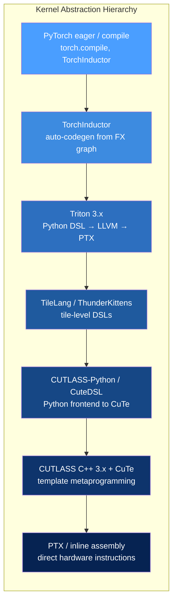
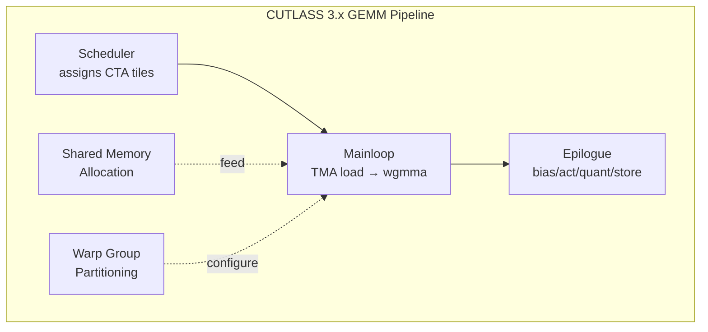
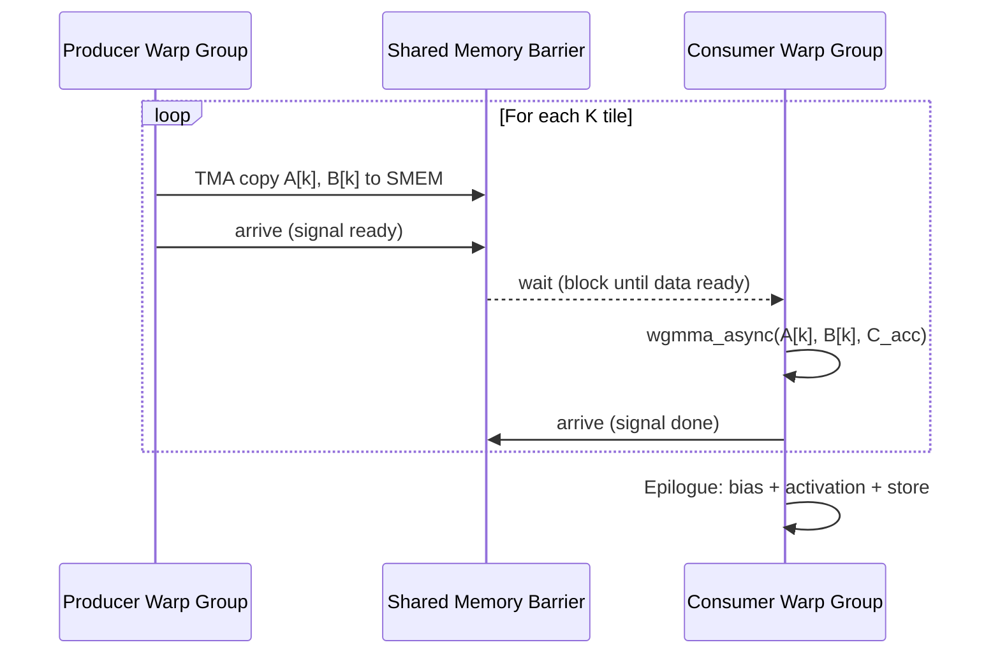
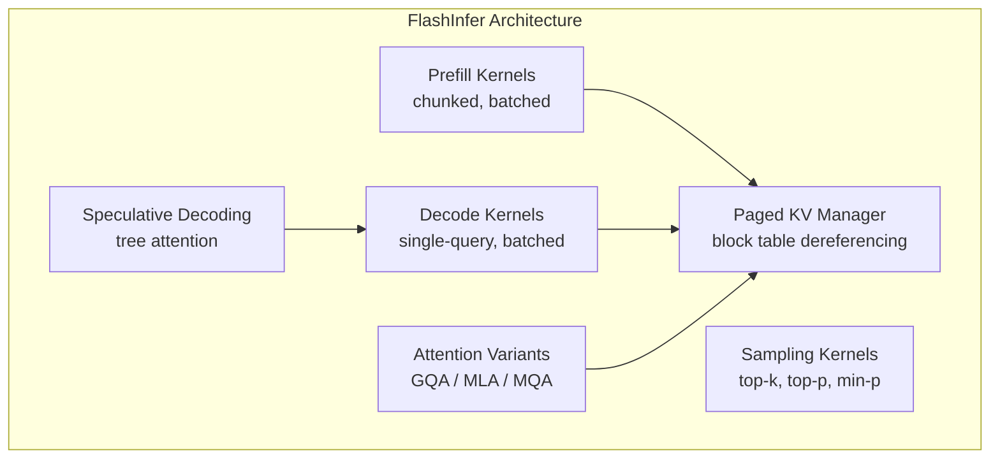
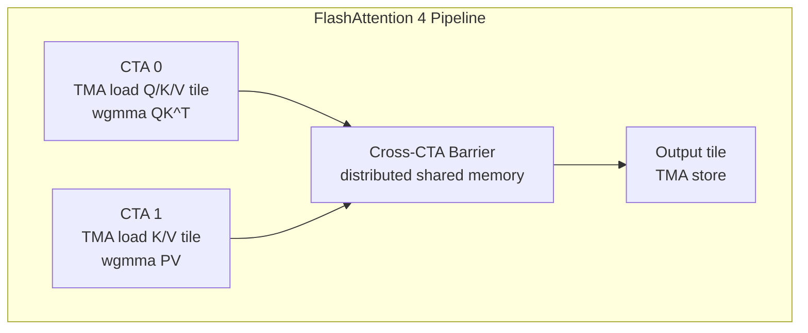
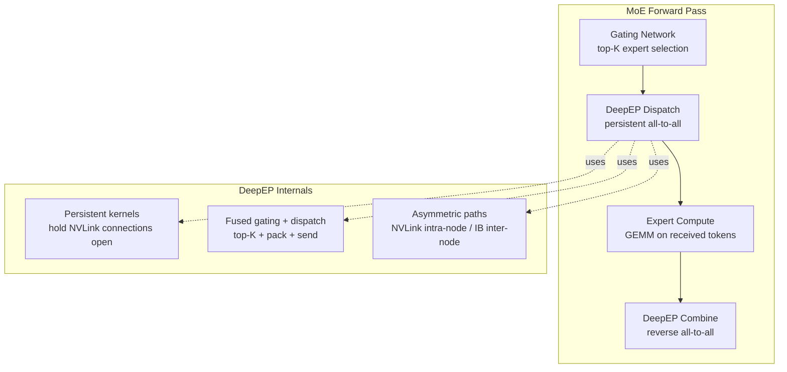
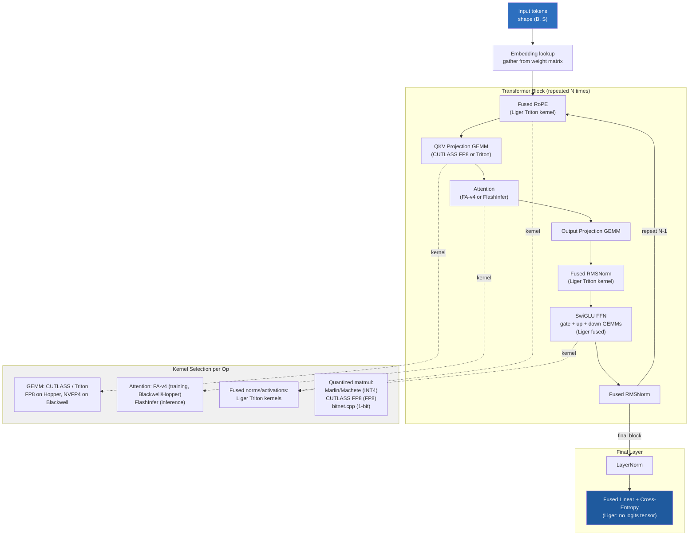

# Cutting-Edge Kernels — The 2025-2026 Kernel Programming Frontier

> **Layer:** L5.
> **Prerequisites:** [Triton_and_Kernels](Triton_and_Kernels.md), [CUDA_Optimization](CUDA_Optimization.md), [Blackwell_Architecture](../L3_Microarchitecture/Blackwell_Architecture.md).
> **Hands off to:** [Modern_Quantization_Frontier](../L6_Algorithms_and_Models/Modern_Quantization_Frontier.md), [vLLM_Internals](../L8_Inference_and_Serving/vLLM_Internals.md), [Inference_Frameworks](../L8_Inference_and_Serving/Inference_Frameworks.md).

---

## 0. The kernel frontier in 2025-2026

The gap between "what the hardware can do" and "what software extracts" has narrowed dramatically on NVIDIA Hopper and Blackwell, but only for engineers who can navigate the modern kernel stack: Triton for productivity, CUTLASS 3.x with CuTe for peak hardware utilization, and a growing ecosystem of specialized libraries (FlashInfer, DeepEP, TileLang, ThunderKittens, Liger Kernel) that encode domain-specific expertise into reusable, high-performance primitives. This page maps the entire hierarchy, explains the key technologies, and provides the mental models needed to choose the right tool and approach for any kernel-level problem.

---

## 1. The Modern Kernel-Author Stack

Every GPU kernel written in 2025-2026 lives somewhere on the abstraction hierarchy below. The choice determines development time, portability, and how close the result gets to theoretical peak.



### 1.1 When to use each level

| Level | Lines of code (matmul) | Typical perf vs peak | Development time | Use when |
|---|---|---|---|---|
| PyTorch ops | 5-10 | cuBLAS/cuDNN speed | Minutes | Standard ops, no custom kernels |
| TorchInductor | 0 (auto) | 85-95% | Zero (auto) | `torch.compile` covers it |
| Triton | 50-100 | 85-95% | Hours-days | Custom ops, autotuning, moderate complexity |
| TileLang | 40-80 | 90-98% | Hours-days | Hopper/Blackwell tile pipelines |
| CUTLASS-Python | 60-120 | 95-100% | Days | CuTe expressiveness without C++ |
| CUTLASS C++ | 200-600 | 98-100% | Days-weeks | Absolute peak, production GEMM kernels |
| PTX inline asm | 500+ | 100% | Weeks | Instructions not exposed by compilers |

### 1.2 Decision flow

The practical rule: start at the highest level that could work. Escalate only when measurement shows a gap. A Triton kernel at 90% of peak that ships in a day beats a CUTLASS kernel at 98% that takes two weeks, unless the kernel is on the training or inference critical path for a multi-million-dollar cluster.

---

## 2. Triton 3.x — Updated Capabilities

Triton has evolved substantially since its initial release. The 3.x line (2024-2026) adds Hopper/Blackwell-native features that narrow the gap with CUTLASS. The latest release, **Triton 3.6.0** (2026), brings Blackwell-first features that make Triton a viable primary kernel tool even for next-generation hardware.

### 2.1 New features in Triton 3.x

| Feature | Status | Impact |
|---|---|---|
| Hopper TMA support | Stable | Bulk tile loads without register pressure |
| `wgmma` async tensor-core dispatch | Stable | Asynchronous warpgroup MMA |
| Block pointers (`tl.make_block_ptr`) | Stable | Ergonomic multi-dimensional tile addressing |
| `tl.async_copy` / `tl.barrier` | Experimental | Producer-consumer async pipelines |
| FP8 (E4M3, E5M2) | Stable | Native FP8 matmul on Hopper |
| FP4 (NVFP4) | Experimental | Blackwell FP4 tensor cores |
| `num_stages` software pipelining | Stable | Multi-stage prefetch overlap |
| Multidimensional batch support | **3.6.0** | Native multi-dim batch dimensions in kernels |
| Ragged TMA for Blackwell | **3.6.0** | Variable-length TMA descriptors for Blackwell tensor memory accelerator |
| TMEM support for Blackwell | **3.6.0** | Direct access to Blackwell tensor memory |
| GFX950 (MI350) AMD support | **3.6.0** | AMD Instinct MI350 GPU backend |
| GFX1250 (RDNA4) support | **3.6.0** | Consumer AMD GPU backend |
| Warp specialization (production) | **3.6.0** | Production-ready producer-consumer warp roles |
| Gluon framework | **3.6.0** | New IR and analysis framework for Triton optimization |
| BF16x3 trick | **3.6.0** | 3-way BF16 packing for higher throughput |
| MXFP scaled dot decomposition | **3.6.0** | Microscaling FP format support in dot operations |

### 2.2 Block pointers

Block pointers simplify the pointer-arithmetic-heavy code that dominates Triton kernels:

```python
@triton.jit
def matmul_tiled(A, B, C, M, N, K,
                 BLOCK_M: tl.constexpr, BLOCK_N: tl.constexpr,
                 BLOCK_K: tl.constexpr):
    pid_m = tl.program_id(0)
    pid_n = tl.program_id(1)

    a_block_ptr = tl.make_block_ptr(
        base=A, shape=(M, K), strides=(K, 1),
        offsets=(pid_m * BLOCK_M, 0),
        block_shape=(BLOCK_M, BLOCK_K), order=(1, 0)
    )
    b_block_ptr = tl.make_block_ptr(
        base=B, shape=(K, N), strides=(N, 1),
        offsets=(0, pid_n * BLOCK_N),
        block_shape=(BLOCK_K, BLOCK_N), order=(1, 0)
    )

    acc = tl.zeros((BLOCK_M, BLOCK_N), dtype=tl.float32)
    for k in range(0, K, BLOCK_K):
        a = tl.load(a_block_ptr)              # TMA-backed on Hopper
        b = tl.load(b_block_ptr)
        acc = tl.dot(a, b, acc)
        a_block_ptr = tl.advance(a_block_ptr, (0, BLOCK_K))
        b_block_ptr = tl.advance(b_block_ptr, (BLOCK_K, 0))

    # Store output tile
    c_block_ptr = tl.make_block_ptr(
        base=C, shape=(M, N), strides=(N, 1),
        offsets=(pid_m * BLOCK_M, pid_n * BLOCK_N),
        block_shape=(BLOCK_M, BLOCK_N), order=(1, 0)
    )
    tl.store(c_block_ptr, acc.to(tl.float16))
```

Block pointers abstract away stride arithmetic, boundary masking, and on Hopper can lower directly to TMA descriptors, eliminating the need for manual pointer computation per thread.

### 2.3 Triton limits in 2025-2026

Triton 3.6.0 has closed several major gaps:

- **Warp specialization**: Now production-ready in 3.6.0, enabling dedicated producer vs consumer warp roles within a kernel.
- **TMEM (Blackwell tensor memory)**: Exposed in 3.6.0 for Blackwell GPUs.
- **Threadblock clusters** (Hopper feature: multiple blocks sharing distributed shared memory). Partially surfaced; complex patterns still require CUTLASS.
- **Ragged TMA**: Variable-length TMA descriptors now available for Blackwell.

Remaining gaps where CUTLASS/TileLang/ThunderKittens are still preferable:

- **Custom mbarrier patterns** for complex multi-stage synchronization beyond standard producer-consumer.
- **Fine-grained CuTe layout control** for non-standard swizzle patterns or shared-memory bank-conflict avoidance.
- **Full NVFP4 epilogue fusion** with custom quantization schedules (CUTLASS-Python is stronger here).

---

## 3. CUTLASS 3.x and CuTe

NVIDIA's CUTLASS (CUDA Templates for Linear Algebra Subroutines) is the de facto standard for production GEMM, attention, and quantized-matmul kernels. CUTLASS 3.x (2023-2026) is a ground-up redesign built on **CuTe** (CUTLASS Tensor Expressions).

### 3.1 CuTe layout algebra

CuTe represents every tensor as a pair `(shape, stride)` called a **layout**. Layouts compose: a tile in shared memory is a layout; a warp's slice of that tile is a layout partition; a swizzle is a layout transformation.

```cpp
#include <cute/layout.hpp>
using namespace cute;

// A 128x64 row-major tile in shared memory
auto smem_layout = make_layout(make_shape(Int<128>{}, Int<64>{}),
                               make_stride(Int<64>{}, Int<1>{}));

// A swizzled layout to avoid bank conflicts
auto swizzled = composition(Swizzle<3,3,3>{}, smem_layout);

// Partition the tile for warp 0 out of 4 warps
auto warps = make_layout(make_shape(Int<4>{}));
auto warp_tile = logical_divide(smem_layout, warps);
// warp_tile is the slice that warp_idx owns
```

Key CuTe operations:

| Operation | Meaning |
|---|---|
| `make_layout(shape, stride)` | Define a tensor layout |
| `composition(A, B)` | Compose two layouts (nested tiling) |
| `logical_divide(L, divider)` | Partition layout into groups |
| `zipped_divide(L, tile)` | Separate into inner-tile and outer-tile |
| `coalesce(L)` | Merge dimensions with stride-1 |
| `composition(Swizzle{}, L)` | Apply XOR swizzle to shared memory |

The CuTe type system is entirely compile-time (C++ template metaprogramming). The layout algebra runs at compile time, producing zero-overhead runtime indexing. Steep learning curve, but once internalized, any Hopper/Blackwell tile layout can be expressed in under 20 lines.

### 3.2 Templated GEMM structure

A CUTLASS 3.x GEMM kernel assembles from five templated components:



The kernel template signature (simplified):

```cpp
template <
    class ProblemShape,           // (M, N, K)
    class CollectiveMainloop,     // TMA + wgmma schedule
    class CollectiveEpilogue,     // output transformation
    class TileScheduler           // CTA-to-tile mapping
>
class Sm90GemmKernel;
```

Each template parameter is itself assembled from CuTe layout primitives. The mainloop encapsulates the entire producer-consumer pipeline: TMA descriptors for A and B tiles, shared memory staging, wgmma issue, and barrier synchronization.

### 3.3 TMA-aware mainloop

On Hopper, the mainloop uses TMA (Tensor Memory Accelerator) for asynchronous bulk tile transfers from HBM to shared memory:

```cpp
// Simplified Sm90 TMA mainloop pseudocode
template <class... Args>
struct Sm90TmaGemmMainloop {
    static __device__ void run(
        Params const& params,
        Tensor const& tCrA, Tensor const& tCrB,   // register fragments
        Tensor const& tCsA, Tensor const& tCsB,    // shared memory tiles
        TmaDescriptor const& tma_a, TmaDescriptor const& tma_b
    ) {
        // Producer warpgroup: issue TMA prefetch
        if (elect_one_sync()) {
            copy(tma_a, tCsA(_, _, k_block_next));  // async TMA copy
            copy(tma_b, tCsB(_, _, k_block_next));
        }

        // Consumer warpgroups: wgmma on current stage
        warpgroup_fence();
        gemm(tCrA, tCrB, tCc);                     // wgmma_async
        warpgroup_arrive();

        // Barrier: wait for next stage load to complete
        barrier_wait(shared_barrier, k_stage_next);
    }
};
```

The pipeline has 2-4 stages. Stage $k+1$ loads while stage $k$ computes. With TMA, only 1-2 threads issue the load (the TMA hardware does the heavy lifting), freeing the remaining threads for compute.

### 3.4 Warp specialization

CUTLASS 3.x on Hopper uses warp specialization: within a threadblock, one warp group (4 warps, 128 threads) acts as the **producer** (issues TMA loads), and one or more warp groups act as **consumers** (issue wgmma, accumulate, run epilogue).



This decouples load latency from compute throughput. The producer can prefetch stages ahead while the consumer saturates the tensor cores. FlashAttention v3 uses an identical pattern.

### 3.5 Epilogue fusion

The epilogue is where post-matmul operations get fused into the kernel, avoiding extra HBM round-trips:

```cpp
// Built-in epilogue operations in CUTLASS 3.x
using Epilogue = cutlass::epilogue::collective::Sm90TmaWarpSpecialized<
    // Output tile: accumulate then apply
    cutlass::epilogue::threadblock::EpilogueWithBroadcast<
        float,                              // accumulator type
        half_t,                             // output type
        BiasOp,                             // bias addition
        cutlass::epilogue::thread::ReLU,    // activation
        cutlass::epilogue::thread::ScaleOp  // per-channel quant scale
    >
>;
```

Common fused epilogues: bias + activation (ReLU, GELU, SwiGLU), per-row/per-column scaling (for quantization), dequantization, and direct TMA store back to HBM.

---

## 4. CUTLASS-Python / CuteDSL

NVIDIA has released a Python frontend for CUTLASS that compiles CuTe primitives into kernels without manual C++ template programming.

### 4.1 CuteDSL kernel example

```python
import cutlass
from cutlass import *

# Define a GEMM with FP16 inputs, FP32 accumulation
plan = cutlass.op.Gemm(
    element=cutlass.float16,
    layout=cutlass.LayoutType.RowMajor,
    element_accumulator=cutlass.float32,
    arch=90,  # Hopper SM90
)

# Configure the mainloop with TMA + wgmma
plan.mainloop = cutlass.gemm.collective.MainloopSm90(
    tile_shape=(128, 256, 64),
    stage_count=3,
    scheduler=cutlass.gemm.kernel.TileScheduler.StreamK,
)

# Fuse bias + activation into epilogue
plan.epilogue = cutlass.epilogue.collective.EpilogueSm90(
    bias=True,
    activation=cutlass.epilogue.thread.ReLU,
)

# Compile and run
plan.compile()
plan.run(A, B, C, bias=bias_tensor)
```

CuteDSL provides Python-level ergonomics while generating CUTLASS-quality PTX. Adoption is growing in teams that need CUTLASS performance without C++ template expertise.

### 4.2 CUTLASS-Python vs Triton

| Dimension | CUTLASS-Python | Triton |
|---|---|---|
| Backend | CUTLASS C++ templates | LLVM → PTX |
| TMA / wgmma control | Full | Partial |
| Epilogue fusion | Built-in | Manual |
| Autotuning | Manual or external | Built-in |
| Learning curve | Medium (need CuTe mental model) | Low |
| Typical perf | 95-100% peak | 85-95% peak |

CUTLASS-Python excels when the kernel structure is GEMM-like (tile load, matmul, epilogue). Triton excels for non-GEMM patterns (reductions, sorting, element-wise operations with complex control flow).

---

## 5. FlashInfer — Attention Kernels for Inference

FlashInfer (Yu et al., 2024-2025, CMU) is the dominant attention-kernel library for LLM inference. It complements FlashAttention (training-focused) with serving-specific features that no other library provides in a unified interface.

### 5.1 Architecture



### 5.2 Key features

| Feature | Description | Why it matters |
|---|---|---|
| Paged KV cache | Takes block tables directly; no contiguous KV needed | vLLM/SGLang paged memory model |
| Variable (ragged) batch | Different sequence lengths in one batch | Avoids padding waste in serving |
| GQA / MLA / MQA | Specialized kernels for grouped/multi-head/compressed attention | Llama-3, DeepSeek-V3, Mixtral |
| FP8 KV cache | FP8 (E4M3) key-value storage | 2x KV cache capacity |
| Chunked prefill | Splits long prefill into chunks to overlap with decode | Hybrid prefill-decode serving |
| Tree attention | Verifies multiple speculative tokens in one pass | Speculative decoding backends |
| Custom attention mask | Supports block-sparse, sliding window, hybrid masks | DeepSeek-NSA, MiniMax-MoBA |

### 5.3 Usage pattern

```python
import flashinfer

# Decode: single-token attention against paged KV cache
wrapper = flashinfer.BatchDecodeWithPagedKVCacheWrapper(
    workspace_buffer,
    kv_layout="NHD",  # [num_pages, page_size, num_heads, head_dim]
)
wrapper.plan(
    qo_indptr,         # query offsets
    kv_indptr,         # KV page offsets
    kv_last_page_len,  # valid length in last page
    num_qo_heads=32,
    num_kv_heads=8,    # GQA: 32/8 = 4 query heads per KV head
    head_dim=128,
    causal=True,
)
output = wrapper.run(q, paged_kv_cache)
```

### 5.4 FlashInfer vs FlashAttention

FlashAttention (Tri Dao lab) is the canonical training implementation. FA-v3 (Hopper) reaches ~75% of FP16 peak for bulk prefill; FA-v4 (beta, 2026) adds Blackwell support, paged KV, MLA, and ROCm. FlashInfer remains specialized for the serving regime: variable batch sizes, complex GQA/MLA decoding, and speculative verification trees. Production stacks increasingly use FA-v4 for both training and bulk prefill (now that it supports paged KV), while FlashInfer remains the choice for the decode path with complex batching and speculative verification.

| Dimension | FlashAttention (FA-v3/v4) | FlashInfer |
|---|---|---|
| Primary use case | Training, bulk prefill | Inference decode, paged KV |
| Peak perf (training) | ~75% FP16 peak on Hopper | ~65-70% (paged overhead) |
| Paged KV | No (FA3) / Yes (FA4) | Yes |
| Variable batch | Limited | Native |
| Spec decoding | No | Tree attention |
| FP8 KV | Partial (FA3) / Full (FA4) | Native |
| MLA support | Yes (FA4) | Yes |
| ROCm / AMD | Yes (FA4) | Limited |

---

## 6. FlashAttention 4 (Beta) — Blackwell and Beyond

FlashAttention 4 (Tri Dao lab, 2026) is the next major version of the canonical training attention kernel, currently in beta (fa4-v4.0.0.beta13, released May 13, 2026). FA4 extends support to NVIDIA Blackwell (SM100/SM120) and AMD GPUs via ROCm, while adding several features previously only available in inference-oriented libraries like FlashInfer.

### 6.1 Key new features vs FA3

| Feature | FA3 | FA4 | Impact |
|---|---|---|---|
| Architecture support | Hopper (SM90) | Hopper + **Blackwell SM100/SM120** | Next-gen GPU support |
| ROCm (AMD GPU) support | No | **Yes** | Multi-vendor GPU training |
| head_dim=256 | Limited/special handling | **Native** | Required for large-head models (e.g., Gemma) |
| FP8 attention | Partial | **Full** | 2x throughput on Blackwell FP8 tensor cores |
| Paged KV cache | No | **Yes** | Unified training + inference kernel |
| MLA (Multi-head Latent Attention) | No | **Yes** | DeepSeek-V3/R1 compressed attention |
| CuTe DSL integration | CUTLASS C++ only | **CuTe DSL** | Cleaner kernel codebase, easier maintenance |
| Block sparsity | No | **Yes** | Sparse attention patterns for long context |
| 2CTA optimization | No | **Yes** | Cross-CTA cooperation for larger tiles |
| Throughput (Hopper) | ~75% FP16 peak | **Improved** | Better utilization on existing hardware |
| Throughput (Blackwell) | N/A | **Higher** | Leverages 5th-gen tensor cores and TMEM |

### 6.2 Architecture: 2CTA and block sparsity

FA4 introduces a **2CTA (2 Cooperative Thread Array)** optimization where two CTAs collaborate on a single attention tile, effectively doubling the per-tile compute budget. This is critical on Blackwell where TMEM and larger shared memory allow bigger working sets:



Block sparsity allows the attention kernel to skip entire blocks of the QK matrix based on a sparsity mask, reducing compute from $O(S^2)$ to $O(S \cdot \text{active\_blocks})$ for sparse patterns.

### 6.3 MLA support

Multi-head Latent Attention (MLA), introduced by DeepSeek-V3, compresses the KV cache into a low-rank latent representation. FA4 integrates MLA directly into the attention kernel:

$$\text{MLA: } Q \in \mathbb{R}^{B \times H \times S \times D}, \quad K_c, V_c \in \mathbb{R}^{B \times 1 \times S \times D_c}$$

where $D_c \ll D \times H$ is the compressed latent dimension. FA4 fuses the latent-to-full projection with the attention computation, avoiding materialization of the full KV cache.

### 6.4 FA4 in the ecosystem

FA4's paged KV support blurs the traditional training/inference split: the same kernel can serve both bulk prefill (training-style) and paged decode (inference-style), simplifying deployment in frameworks that previously needed both FA and FlashInfer. However, FlashInfer remains superior for pure decode serving with complex batching and speculative verification trees.

---

## 7. DeepEP — MoE All-to-All

DeepSeek's open-source Expert Parallelism communication library (2025). DeepEP provides hand-tuned Hopper/Blackwell kernels for the all-to-all dispatch and combine operations fundamental to Mixture-of-Experts models.

### 7.1 Why not NCCL

Standard NCCL all-to-all is optimized for uniform message sizes. MoE routing produces **non-uniform, small messages** to many peers: each token goes to 1-8 of 256+ experts. This pattern underperforms on NCCL by 5-10x due to:

- Per-message startup overhead dominating transfer time.
- Suboptimal NVLink/IB path selection for small payloads.
- Lack of fusion between gating computation and dispatch.

### 7.2 DeepEP design



Key techniques:

- **Persistent kernels**: a long-running kernel maintains NVLink connections across dispatch calls, eliminating per-call setup overhead.
- **Fused gating + dispatch**: the top-K expert selection and token packing happen in the same kernel that initiates the all-to-all, avoiding intermediate materialization.
- **Asymmetric paths**: intra-node uses direct NVLink memcpy (bypassing NCCL); inter-node uses IB with pre-posted receives.

### 7.3 Performance

DeepSeek reports 5-10x speedup over NCCL all-to-all for typical MoE shapes (e.g., DeepSeek-V3 with 256 experts, top-8 routing, 7K tokens per microbatch). This makes MoE communication no longer the bottleneck; expert compute GEMM dominates.

### 7.4 Integration

DeepEP plugs into Megatron-LM, vLLM, and SGLang as a selectable all-to-all backend:

```python
# vLLM config
moe_all_to_all_backend: deepep   # or nccl, mscclpp
```

Alternatives: MSCCL++ (Microsoft, collective algorithm synthesis), NVSHMEM (GPU-native shared-memory primitives), and NCCL native all-to-all (still the default fallback).

---

## 8. TileLang — Tile-Level DSL

TileLang (BitMagic / OSU collaboration, 2024-2025) is a Python-embedded DSL that targets Hopper/Blackwell tile-level programming. Its abstraction is fundamentally different from Triton: instead of "a block of threads doing per-element work over tiles," TileLang models "tiles flowing through producers and consumers."

### 8.1 Programming model

```python
import tilelang as TL

@TL.prim_func
def matmul_kernel(
    A: TL.Buffer((M, K), "float16"),
    B: TL.Buffer((K, N), "float16"),
    C: TL.Buffer((M, N), "float16"),
):
    with TL.Kernel(M_BLOCKS, N_BLOCKS, threads=128) as (bx, by):
        # Allocate shared memory tiles
        A_shared = TL.alloc_shared((BM, BK), "float16")
        B_shared = TL.alloc_shared((BK, BN), "float16")
        # Allocate register accumulator
        C_reg = TL.alloc_fragment((BM, BN), "float32")

        TL.clear(C_reg)

        # Software-pipelined K loop
        for k in TL.Pipelined(K_BLOCKS, num_stages=3):
            # TMA-backed async copies (producer)
            TL.copy(A[by*BM:(by+1)*BM, k*BK:(k+1)*BK], A_shared)
            TL.copy(B[k*BK:(k+1)*BK, bx*BN:(bx+1)*BN], B_shared)
            # wgmma matmul on shared memory (consumer)
            TL.gemm(A_shared, B_shared, C_reg)

        # Store result
        TL.copy(C_reg, C[by*BM:(by+1)*BM, bx*BN:(bx+1)*BN])
```

TileLang compiles this directly to PTX with TMA loads and wgmma operations. The `TL.Pipelined` construct generates multi-stage software pipelines automatically.

### 8.2 Producer-consumer semantics

TileLang explicitly models the Hopper pipeline:

| Construct | Hopper mapping |
|---|---|
| `TL.alloc_shared()` | Shared memory with swizzle layout |
| `TL.alloc_fragment()` | Register tile for accumulators |
| `TL.copy()` (global → shared) | TMA async bulk copy |
| `TL.gemm()` | wgmma async warpgroup MMA |
| `TL.Pipelined()` | Multi-stage software pipeline with barriers |
| `TL.copy()` (fragment → global) | TMA store or STG |

### 8.3 Performance and adoption

TileLang generates PTX competitive with CUTLASS for common GEMM shapes (within 2-5% of peak on H100). Adoption is concentrated in research kernel labs (Tsinghua, OSU, BitMagic) but growing in production settings. The key advantage over Triton: native producer-consumer modeling means zero abstraction-layer mismatch with Hopper hardware.

---

## 9. ThunderKittens — Stanford Tile Library

ThunderKittens (Hazy Research, Stanford, 2024) is a header-only C++ library of Hopper tile primitives. It aims for CUTLASS-class performance with Triton-class code complexity.

### 9.1 Core abstractions

```cpp
#include "kittens.cuh"
using namespace kittens;

__global__ void flash_attention_kernel(
    const half* Q, const half* K, const half* V, half* O,
    int seq_len, int dim
) {
    // Shared memory tiles with built-in swizzle
    auto q_smem = SharedTile<half, 64, 64>::create();
    auto k_smem = SharedTile<half, 64, 64>::create();
    auto v_smem = SharedTile<half, 64, 64>::create();

    // Register accumulator
    auto o_reg = RegTile<float, 64, 64>::create();
    clear(o_reg);

    // Running softmax state
    auto m_i = RegTile<float, 64, 1>::create();
    auto l_i = RegTile<float, 64, 1>::create();
    fill(m_i, -INFINITY);
    clear(l_i);

    for (int kv_block = 0; kv_block < seq_len; kv_block += 64) {
        load_async(k_smem, K + kv_block * dim);   // TMA
        load_async(v_smem, V + kv_block * dim);   // TMA
        barrier();

        // QK^T in registers
        auto scores = RegTile<float, 64, 64>::create();
        mma_AB(scores, q_smem, k_smem);           // wgmma

        // Online softmax update
        auto m_new = max_each_row(scores, m_i);
        auto alpha = exp(m_i - m_new);
        mul(o_reg, o_reg, alpha);

        auto p = exp(scores - m_new);
        auto l_new = l_i * alpha + sum_each_row(p);

        // PV accumulation
        mma_AB(o_reg, p, v_smem);                  // wgmma

        copy(m_i, m_new);
        copy(l_i, l_new);
    }

    // Normalize and store
    div(o_reg, o_reg, l_i);
    store(O, o_reg);
}
```

ThunderKittens handles swizzle layouts, bank-conflict avoidance, TMA descriptor setup, and wgmma dispatch internally. The resulting FlashAttention kernel is reportedly under 200 lines and achieves >90% of Hopper peak FP16.

### 9.2 Comparison

| Dimension | ThunderKittens | CUTLASS 3.x | Triton |
|---|---|---|---|
| Language | C++ (header-only) | C++ templates | Python |
| Learning curve | Low-medium | Very steep | Low |
| Tile abstraction | First-class | Via CuTe | Via blocks |
| Code size (FA) | ~180 lines | ~500-1000 lines | ~200 lines |
| Peak perf | >90% | 98-100% | 75-85% (attention) |
| Warp specialization | Built-in | Explicit | Not supported |

Adoption is primarily educational and research-focused, with gradual production uptake.

---

## 9b. NKI (Neuron Kernel Interface) — AWS Trainium

### 9b.1 Overview

**NKI (Neuron Kernel Interface)** is Amazon's Python-based kernel DSL for programming AWS Trainium's NeuronCores. It is the only publicly available kernel DSL for a non-NVIDIA AI accelerator, making it significant both practically (for teams using Trainium instances) and as a reference point for cross-vendor kernel programming models.

### 9b.2 Programming model

NKI exposes Trainium's NeuronCore architecture through Python, providing explicit control over the accelerator's memory hierarchy and compute units:

```python
import neuronxcc.nki as nki
import neuronxcc.nki.language as nk

@nki.kernel
def matmul_kernel(
    A: nki.ndarray,  # shape (M, K), in HBM
    B: nki.ndarray,  # shape (K, N), in HBM
    C: nki.ndarray,  # shape (M, N), in HBM
):
    # Tile over output blocks
    for m_block in nki.range(0, M, tile_M):
        for n_block in nki.range(0, N, tile_N):
            # Allocate on-chip buffers
            a_sbuf = nki.dram_to_sbuf(A[m_block:m_block+tile_M, :])  # SBUF tile
            c_psum = nki.zeros((tile_M, tile_N), dtype=nki.float32)   # PSUM accumulator

            for k_block in nki.range(0, K, tile_K):
                b_sbuf = nki.dram_to_sbuf(B[k_block:k_block+tile_K, n_block:n_block+tile_N])
                a_tile = a_sbuf[:, k_block:k_block+tile_K]
                # Matrix multiply on NeuronCore's tensor engine
                c_psum += nki.matmul(a_tile, b_sbuf)

            # Write result back to HBM
            nki.sbuf_to_dram(c_psum, C[m_block:m_block+tile_M, n_block:n_block+tile_N])
```

### 9b.3 NeuronCore memory hierarchy

NKI provides explicit access to Trainium's memory tiers:

| Memory tier | API name | Description |
|---|---|---|
| **HBM** | `dram` | High Bandwidth Memory, ~1.6 TB/s per NeuronCore |
| **SBUF** (Shared Buffer) | `sbuf` | On-chip SRAM for staging tiles, similar to GPU SMEM |
| **PSUM** (Partial Sum) | `psum` | Accumulator buffer for matmul results, attached to tensor engine |

The explicit SBUF/PSUM management is similar to GPU kernel tiling, but the programmer has direct control over which buffer class each tile resides in, rather than relying on compiler heuristics for SMEM vs. register allocation.

### 9b.4 Relevance

NKI is relevant to the broader AI kernel ecosystem for several reasons:

1. **Cross-vendor perspective**: studying NKI alongside Triton and CUTLASS reveals which kernel programming concepts are hardware-specific and which are universal (tiling, double buffering, producer-consumer pipelines).
2. **AWS Trainium adoption**: teams running on Trn1/Trn2 instances use NKI to write custom operators not covered by the Neuron compiler's graph-level optimizations.
3. **NeuronCore ISA**: NKI compiles to the NeuronCore instruction set architecture, providing the same level of hardware access that PTX provides for NVIDIA GPUs.

NKI is limited to AWS Trainium hardware and does not port to NVIDIA or AMD GPUs. Its API surface is smaller than Triton's but sufficient for the matmul, attention, and element-wise kernels that dominate LLM workloads.

---

## 9c. Pallas — Google JAX Kernel DSL for TPU

### 9c.1 Overview

**Pallas** is Google's JAX-native kernel programming framework for TPU (and experimentally GPU). It extends JAX with `jax.pallas_call`, allowing developers to write custom TPU kernels that have direct access to the TPU's memory hierarchy and compute units. Pallas is the TPU counterpart to Triton for GPU — a high-level DSL that compiles down to hardware-specific instructions.

### 9c.2 Programming model

Pallas kernels are written as JAX functions with explicit memory management:

```python
import jax
import jax.numpy as jnp
from jax.experimental import pallas as pl

def matmul_kernel(
    x_ref,     # Ref to input tile in VMEM
    y_ref,     # Ref to input tile in VMEM
    o_ref,     # Ref to output tile in VMEM
    acc_ref,   # Ref to accumulator in registers
):
    @pl.when(pl.program_id(2) == 0)
    def _():
        acc_ref[:] = jnp.zeros_like(acc_ref)

    # Load tiles from VMEM, compute partial matmul
    acc_ref[:] += jnp.dot(x_ref[...], y_ref[...])

    @pl.when(pl.program_id(2) == pl.num_programs(2) - 1)
    def _():
        o_ref[:] = acc_ref[:]

# Launch kernel via pallas_call
result = pl.pallas_call(
    matmul_kernel,
    out_shape=jax.ShapeDtypeStruct((M, N), jnp.float32),
    in_specs=[
        pl.BlockSpec((BM, BK), lambda i, j, k: (i, k)),   # A tile
        pl.BlockSpec((BK, BN), lambda i, j, k: (k, j)),   # B tile
    ],
    out_specs=pl.BlockSpec((BM, BN), lambda i, j, k: (i, j)),
    grid=(M // BM, N // BN, K // BK),
)(A, B)
```

### 9c.3 TPU memory hierarchy access

Pallas provides access to the TPU's distinct memory tiers:

| TPU memory | Pallas access | Description |
|---|---|---|
| **HBM** | Implicit (via `BlockSpec`) | High-bandwidth memory, ~2.7 TB/s on TPU v5p |
| **VMEM** | `Ref` objects in kernel | Vector memory, on-chip SRAM for tile staging (~128 MB per core) |
| **CMEM** | `Ref` with CMEM annotation | Circular memory for streaming data, smaller than VMEM |
| **MXU** | `jnp.dot` | Matrix Multiply Unit — the TPU's systolic array, analogous to tensor cores |

The VMEM-to-MXU pipeline is analogous to the SMEM-to-tensor-core pipeline on NVIDIA GPUs. Pallas gives the programmer explicit control over tile residency in VMEM, similar to how CUTLASS manages SMEM tiles.

### 9c.4 Comparison with GPU kernel DSLs

| Dimension | Pallas (TPU) | Triton (GPU) | NKI (Trainium) |
|---|---|---|---|
| Language | Python (JAX) | Python | Python |
| Host framework | JAX | PyTorch / standalone | Neuron SDK |
| Tile abstraction | `BlockSpec` + `Ref` | `tl.load` / `tl.store` | `nki.dram_to_sbuf` |
| Matmul primitive | `jnp.dot` | `tl.dot` | `nki.matmul` |
| Memory model | VMEM / CMEM / MXU | SMEM / RF / TC | SBUF / PSUM / TE |
| Hardware target | Google TPU | NVIDIA GPU | AWS Trainium |
| Maturity | Experimental (JAX) | Stable, production | Stable |

Pallas is the only kernel DSL that integrates natively with a host ML framework (JAX) rather than being a standalone compilation target. This means Pallas kernels compose seamlessly with JAX's autodiff, `jax.jit`, and `jax.vmap` transformations — a significant ergonomic advantage for research use cases. However, it is currently limited to TPU and is experimental for GPU backends.

---

## 10. Liger Kernel — Production Training Kernels

Liger Kernel (LinkedIn, 2024+) is an open-source library of fused Triton kernels targeting the LLM training critical path. It provides drop-in replacements for standard transformer operations. The latest release, **v0.7.0** (2026), expands hardware support and adds new loss types and attention kernels.

### 10.1 Kernels and impact

| Kernel | Fused operations | Memory saved | Speedup |
|---|---|---|---|
| Fused RMSNorm | norm + scale + shift | 1 HBM round-trip | 5-10% |
| Fused RoPE | cos/sin + complex multiply | 2 intermediate tensors | 5-10% |
| Fused SwiGLU / GeGLU | gate + activation + multiply | 1 intermediate tensor | 10-15% |
| Fused Linear + Cross-Entropy | matmul + log-softmax + NLL loss | **entire (B,S,V) logits tensor** | 10-20% |
| Fused JSD / KL | log-softmax + divergence | intermediate tensors | 5-10% |
| CISPO / SAPO loss | truncated loss variants for RLHF | intermediate tensors | 5-10% |
| GRPO loss (Triton) | group relative policy optimization | intermediate tensors | 10-15% |
| Fused Neighborhood Attention | local window attention in Triton | KV intermediates | 5-10% |
| Sparsemax | sparse attention activation | intermediate tensors | 5-10% |

### 10.2 New in v0.7.0

| Feature | Description |
|---|---|
| Transformers v5 support | Compatible with HuggingFace Transformers v5 API |
| CISPO / SAPO loss types | Clipped importance sampling and self-adaptive policy optimization losses for RLHF/PPO training |
| GRPO loss in Triton | Group Relative Policy Optimization loss implemented as a fused Triton kernel |
| NPU (Huawei Ascend) support | Runs on Huawei Ascend NPUs via TorchNPU backend |
| XPU (Intel) support | Runs on Intel GPUs via Intel Extension for PyTorch |
| Fused Neighborhood Attention | Triton kernel for local/sliding-window attention patterns |
| Sparsemax kernel | Differentiable sparse alternative to softmax for attention sparsification |

### 10.3 The linear + cross-entropy fusion

This is the highest-impact kernel. The standard path materializes a $(B, S, V)$ logits tensor in HBM before computing loss:

$$\text{Standard: } X \in \mathbb{R}^{B \times S \times H} \xrightarrow{\text{matmul}} \text{logits} \in \mathbb{R}^{B \times S \times V} \xrightarrow{\text{cross-entropy}} \text{loss} \in \mathbb{R}$$

At $B=4, S=8192, V=128256$ (Llama-3-70B), the logits tensor is $4 \times 8192 \times 128256 \times 2 \text{ bytes} \approx 8.4 \text{ GB}$ in FP16, or $\approx 16.8 \text{ GB}$ in FP32. This is materialized and immediately consumed by the loss function.

Liger's fused kernel streams over the vocabulary dimension in shared memory, computing the matmul tile, log-softmax, and NLL loss in a single kernel pass. The $(B, S, V)$ tensor is never allocated:

$$\text{Fused: } X \in \mathbb{R}^{B \times S \times H} \xrightarrow{\text{fused kernel}} \text{loss} \in \mathbb{R}, \quad \nabla X \in \mathbb{R}^{B \times S \times H}$$

The backward pass similarly avoids materializing logits. Combined with fused RMSNorm, RoPE, and SwiGLU, Liger achieves 50% memory reduction and 10-20% training throughput improvement on large-vocabulary models.

### 10.4 Integration

```python
from liger_kernel.transformers import apply_liger_kernel_to_model

# One-line integration into HuggingFace trainer (v5 compatible)
apply_liger_kernel_to_model(model)

# RLHF training with GRPO loss
from liger_kernel.ops.grpo_loss import LigerGRPOLoss
grpo_loss = LigerGRPOLoss()
```

Liger is de facto required in production pretraining stacks for models with vocabulary >64K. It supports Llama, Mistral, Mixtral, Qwen, and Gemma architectures. As of v0.7.0, it runs on NVIDIA GPUs, Huawei Ascend NPUs, and Intel XPUs, making it the only fused-kernel library with cross-vendor GPU/NPU coverage.

---

## 11. Quantized Matmul Kernels

Quantized inference depends on hand-tuned kernels that decompress low-precision weights and compute in higher-precision activations. The kernel landscape in 2025-2026:

| Kernel | Weight format | Activation format | Hardware | Key technique |
|---|---|---|---|---|
| **Marlin** | INT4 (packed) | FP16 | Ampere+ | Tile-wide dequant, register tiling |
| **Machete** | INT4, INT8 | FP16, BF16 | Hopper | TMA + wgmma, updated Marlin |
| **CUTLASS FP8 GEMM** | FP8 E4M3 / E5M2 | FP8 / FP16 | Hopper+ | Native FP8 tensor cores |
| **CUTLASS NVFP4 GEMM** | NVFP4 (block-FP4) | FP16 / BF16 | Blackwell | 5th-gen tensor cores, TMEM |
| **GPTQ-Triton** | INT4 | FP16 | Various | Triton dequant + matmul |
| **AWQ kernels** | INT4 (activation-aware) | FP16 | Various | Per-group scaling |
| **TransformerEngine FP8** | FP8 | FP8 / BF16 / FP16 | Hopper+ | Delayed scaling, 2-queue approach |
| **BitBLAS** | Mixed (1-8 bit) | FP16 / BF16 | Various | Auto-tuned low-bit kernels |

Each format requires a custom kernel because the dequantization schedule differs: INT4 needs bitwise unpacking, FP8 uses direct tensor-core dispatch, NVFP4 requires block-level shared-exponent handling. Production inference engines (vLLM, TRT-LLM, SGLang) maintain kernel tables and select per-layer based on profiling.

### 11.1 Marlin internals

Marlin (2024) achieves near-FP16 matmul throughput with INT4 weights on Ampere/Hopper:

1. Weights stored as packed INT4 (2 values per byte).
2. Kernel unpacks 4-bit values into FP16 in registers.
3. Per-group scale applied during unpack (dequant).
4. FP16 tensor-core matmul on dequantized values.
5. Output accumulated in FP32, stored as FP16.

The dequant overhead is hidden by overlapping unpack with matmul in a software pipeline. Effective throughput is 80-90% of an equivalent FP16 GEMM while using 4x less weight memory bandwidth.

---

## 12. BitNet / 1-bit LLM Kernels

BitNet (Microsoft, 2024-2025) represents the extreme end of quantization: weights compressed to ternary (-1, 0, +1) or binary representations. Running these models efficiently requires entirely new kernel designs that replace multiplication with addition or lookup tables.

### 12.1 bitnet.cpp — Official Inference Framework

Microsoft's **bitnet.cpp** is the reference inference framework for 1-bit LLMs (BitNet b1.58 and BitNet b1.0). It provides optimized CPU and GPU kernels that exploit the extreme weight sparsity to achieve throughput gains over conventional FP16 inference.

**Kernel types across architectures:**

| Kernel type | Weight format | Compute method | Target hardware |
|---|---|---|---|
| **I2_S** | 1.58-bit ternary (2-bit packed) | Integer addition (no multiplication) | x86 (AVX2/AVX-512), ARM (NEON/SVE) |
| **TL1** | Ternary lookup (1-bit) | Lookup table-based dot product | x86, ARM |
| **TL2** | Ternary lookup (2-bit) | Lookup table with 2-bit packing | x86, ARM |

### 12.2 T-MAC lookup table methodology

The core insight of bitnet.cpp is the **T-MAC (Ternary Multiply-Accumulate via lookup)** approach: since weights are ternary (-1, 0, +1), the matrix multiply reduces to addition/subtraction. For packed representations, T-MAC uses precomputed lookup tables that map packed weight nibbles to partial sums, replacing the multiply-accumulate entirely:

$$\text{Standard: } y_i = \sum_j W_{ij} \cdot x_j \quad \text{(multiplication)}$$
$$\text{BitNet: } y_i = \sum_j \text{sign}(W_{ij}) \cdot x_j \quad \text{(addition only, where } W_{ij} \in \{-1, 0, +1\}\text{)}$$

This eliminates all weight-related multiplications, reducing the arithmetic intensity profile from compute-bound to memory-bandwidth-bound at a much lower bandwidth requirement (weights are 1-2 bits vs 16 bits).

### 12.3 GPU inference kernels

GPU kernels for BitNet were released in May 2025, extending the lookup-table approach to CUDA. The GPU kernels pack ternary weights into 2-bit containers and use warp-level shuffle instructions for efficient reduction, achieving high throughput on tensor cores by unpacking into FP16/BF16 for the activation-weighted accumulation.

### 12.4 Performance

| Metric | ARM (NEON/SVE) | x86 (AVX2/AVX-512) | GPU (CUDA) |
|---|---|---|---|
| Speedup vs FP16 | 1.37x - 5.07x | 2.37x - 6.17x | Comparable or faster than FP16 |
| Energy reduction vs FP16 | 55-82% | 55-82% | Significant (fewer ALU operations) |
| 100B model on single CPU | 5-7 tokens/sec | 5-7 tokens/sec | N/A |

The headline result: a **100B-parameter BitNet model can run on a single CPU at 5-7 tokens/sec**, making models that previously required multi-GPU clusters runnable on commodity hardware. Energy consumption drops by 55-82% compared to FP16, making 1-bit models attractive for edge and data-center inference where power is a constraint.

### 12.5 Comparison with other quantized kernels

| Dimension | BitNet / bitnet.cpp | Marlin (INT4) | FP8 GEMM |
|---|---|---|---|
| Weight bits | 1-2 bit (ternary) | 4 bit | 8 bit |
| Core operation | Addition / lookup table | Dequant + FP16 matmul | FP8 tensor core matmul |
| Hardware requirement | Any CPU or GPU | Ampere+ GPU | Hopper+ GPU |
| Quality retention | Requires 1-bit-trained model | Good for post-training quant | Good for post-training quant |
| Memory reduction vs FP16 | 8-16x | 4x | 2x |

BitNet kernels are not a drop-in replacement for standard quantized kernels: they require models specifically trained with 1-bit weight constraints. However, for models trained in the BitNet paradigm, these kernels provide an order-of-magnitude efficiency advantage.

---

## 13. Attention Kernel Variants in 2025-2026

The attention kernel landscape has fragmented into specialized variants for different model architectures and serving scenarios:

```mermaid
flowchart TB
    subgraph ATTN["Attention Kernel Landscape 2025-2026"]
        TRAIN["Training Kernels"]
        INFER["Inference Kernels"]
        SPARSE["Sparse / Structured"]
        SPEC["Speculative Decoding"]
    end

    TRAIN --> FA4["FlashAttention-v4<br/>Blackwell + ROCm, paged KV, MLA"]
    TRAIN --> FA3["FlashAttention-v3<br/>75% peak FP16, Hopper CUTLASS"]
    TRAIN --> RING["RingFlashAttn<br/>sequence-parallel training"]

    INFER --> FI["FlashInfer<br/>paged KV, GQA/MLA, FP8 KV"]
    INFER --> PA["PagedAttention<br/>vLLM block-table kernel"]
    INFER --> TREE["Tree Attention<br/>speculative decoding"]
    INFER --> CHUNK["Chunked Prefill<br/>overlaps prefill + decode"]

    SPARSE --> NSA["NSA / MoBA<br/>block-sparse attention"]
    SPARSE --> LIGHT["Lightning Attention<br/>linear attention kernels"]
    SPARSE --> SWA["Sliding Window<br/>local attention kernels"]

    SPEC --> DFLASH["DFLASH<br/>speculative decoding attention"]
    SPEC --> SUFFIX["Suffix Automaton<br/>TRT-LLM speculative"]
    SPEC --> EAGLE3["EAGLE-3 Dynamic Tree<br/>vLLM/SGLang/TRT-LLM"]
```



| Kernel variant | Architecture | Producer | Notes |
|---|---|---|---|
| FlashAttention-v4 | Blackwell SM100/SM120, Hopper, ROCm | Tri Dao | Paged KV, MLA, FP8, block sparsity, 2CTA |
| FlashAttention-v3 | Hopper CUTLASS/CuTe | Tri Dao | ~75% FP16 peak, FP8 mode |
| FlashInfer batched attn | All inference GPU | CMU team | Paged KV, ragged batch, GQA |
| PagedAttention (vLLM) | CUDA (not Triton) | vLLM team | Block-table indirect addressing |
| RingFlashAttn | NCCL + FA | Multiple | Ulysses + ring for long context |
| Tree attention | CUDA/CUTLASS | Multiple | Medusa/EAGLE speculative decoding |
| NSA kernels | CUTLASS custom | DeepSeek | Native sparse attention blocks |
| MoBA kernels | Triton custom | Moonshot | Mixture-of-block attention |
| Lightning Attention | Triton | MiniMax | Linear attention with cumulative sum |
| Sliding window attn | Triton/CUTLASS | Multiple | Local window, ignore distant tokens |
| MLA attention | CUTLASS custom | DeepSeek | Compressed KV with low-rank projection |
| FlexAttention | PyTorch native | Meta | Flexible score-mod/mask-mod, compile-based |
| DFLASH | CUDA | Research | Speculative decoding with draft-then-verify |
| Suffix automaton spec | CUDA | TRT-LLM | Suffix-automaton-based draft token generation |
| EAGLE-3 dynamic tree | CUDA/Triton | EAGLE team | Dynamic tree speculative decoding, production in vLLM/SGLang/TRT-LLM |

### 13.1 Speculative decoding kernels

Speculative decoding has emerged as a critical inference acceleration technique, and the kernel landscape has specialized accordingly:

| Technique | Mechanism | Production status | Speedup |
|---|---|---|---|
| **DFLASH** | Speculative decoding with draft-then-verify attention; verifies multiple draft tokens in a single merged attention pass | Research / early adoption | 1.5-2.5x latency reduction |
| **Suffix automaton (TRT-LLM)** | Builds a suffix automaton from the prompt to generate high-quality draft tokens without a separate draft model | Production in TensorRT-LLM | 1.3-2.0x latency reduction |
| **EAGLE-3 dynamic tree** | Learns a dynamic tree structure for draft tokens, verifying multiple tree paths in one attention pass | Production in vLLM, SGLang, TRT-LLM | 2.0-3.5x latency reduction |

The key kernel challenge in speculative decoding is **tree attention**: verifying a tree-structured batch of draft tokens against the KV cache in a single kernel launch, rather than verifying each token sequentially. FlashInfer's tree attention API and FA4's paged KV support both address this, but EAGLE-3's dynamic trees require even more flexible tree-topology handling within the attention kernel.

The key trend: attention kernels are no longer one-size-fits-all. Each model architecture and serving scenario demands a kernel tuned for its specific access pattern (paged, sparse, compressed, linear, tree-structured, speculative).

---

## 14. End-to-End: From Model Forward Pass to Hardware



The data flows through GEMM kernels (CUTLASS or Triton), attention kernels (FA-v4 or FlashInfer), and fused element-wise kernels (Liger). At each stage, the kernel selection determines the precision format, memory traffic, and achieved throughput. A production training stack for Llama-3-70B uses all three kernel categories simultaneously across the 80 transformer blocks. For 1-bit models (BitNet), the GEMM path is replaced by bitnet.cpp's lookup-table kernels, and for inference serving, EAGLE-3 speculative decoding adds a draft-then-verify attention pass using tree attention kernels.

---

## 15. Numbers to Memorize

| Quantity | Value | Context |
|---|---|---|
| H100 FP16 tensor-core peak | 990 TFLOPS (dense) | SM90, with wgmma |
| H100 FP8 tensor-core peak | 1,979 TFLOPS | FP8 E4M3 |
| B200 FP4 tensor-core peak | ~9,000 TFLOPS (dense) | NVFP4 on 5th-gen cores; ~4,500 is FP8 peak |
| H100 HBM bandwidth | 3.35 TB/s | HBM3, 80 GB |
| B200 HBM bandwidth | 8 TB/s | HBM3e, 192 GB |
| Triton matmul vs cuBLAS | 85-95% of peak | Autotuned |
| CUTLASS GEMM vs peak | 95-100% | Hand-tuned, TMA + wgmma |
| FA-v3 on H100 | ~75% of FP16 peak | Training attention |
| FA-v4 on Hopper/Blackwell | Improved over FA-v3 | 2CTA, paged KV, MLA |
| FlashInfer decode throughput | ~65-70% of peak | Paged KV overhead |
| DeepEP vs NCCL all-to-all | 5-10x faster | MoE dispatch shapes |
| Liger memory savings (linear+CE) | 50% at V=128K | Eliminates logits tensor |
| Marlin INT4 vs FP16 matmul | 80-90% throughput | 4x less weight BW |
| ThunderKittens FA lines of code | <200 lines | >90% peak |
| BitNet CPU speedup vs FP16 | 1.37-6.17x | ARM/x86, 1-bit weights |
| BitNet 100B model on single CPU | 5-7 tokens/sec | Ternary weight model |
| BitNet energy reduction vs FP16 | 55-82% | Addition replaces multiplication |
| EAGLE-3 speculative decoding | 2.0-3.5x latency reduction | Production in vLLM/SGLang/TRT-LLM |
| TMA vs cp.async bandwidth | ~20-30% higher on Hopper | Bulk tile transfer |
| wgmma vs mma.sync throughput | ~2x per instruction | 128 threads vs 32 |
| Shared memory per SM (Hopper) | 228 KB | Limits tile sizing |
| Registers per SM (Hopper) | 64K (256 KB) | Limits occupancy |
| L2 cache (Hopper) | 50 MB | Tile reuse |
| NVLink 4 bandwidth | 900 GB/s bidirectional (450 GB/s per direction) | Intra-node MoE dispatch |
| NCCL all-to-all efficiency | 10-20% of NVLink BW | For small MoE messages |

---

## 16. Worked Interview Problems

### Problem 1: Arithmetic Intensity and Kernel Choice

**Question:** An attention kernel has sequence length $S = 8192$, head dimension $D = 128$, batch $B = 1$, $H = 32$. The attention score matrix is $B \times H \times S \times S$. What is the arithmetic intensity of this attention layer, and is it compute-bound or memory-bound on H100?

**Solution:**

FLOPs for attention (QK + softmax + PV):

$$\text{FLOPs} = 2 \cdot B \cdot H \cdot S^2 \cdot D + 3 \cdot B \cdot H \cdot S^2 = 2 \cdot 1 \cdot 32 \cdot 8192^2 \cdot 128 + 3 \cdot 1 \cdot 32 \cdot 8192^2$$

$$= 2 \cdot 32 \cdot 67108864 \cdot 128 + 3 \cdot 32 \cdot 67108864 \approx 549.8 \times 10^9 + 6.4 \times 10^9 \approx 556 \text{ GFLOPS}$$

Bytes transferred (read Q, K, V + write O):

$$\text{Bytes} = 4 \cdot B \cdot H \cdot S \cdot D \cdot 2 + B \cdot H \cdot S \cdot D \cdot 2 = 10 \cdot B \cdot H \cdot S \cdot D \cdot 2$$

$$= 10 \cdot 1 \cdot 32 \cdot 8192 \cdot 128 \cdot 2 = 671 \text{ MB}$$

Arithmetic intensity:

$$\text{AI} = \frac{556 \times 10^9}{671 \times 10^6} \approx 829 \text{ FLOPS/byte}$$

H100 ridge point (FP16): $\frac{990 \text{ TFLOPS}}{3.35 \text{ TB/s}} \approx 295 \text{ FLOPS/byte}$

Since $829 > 295$, this attention layer is **compute-bound**. FlashAttention tiling is the correct approach (online softmax avoids materializing the $S \times S$ matrix). On H100 with FA-v3, expect ~75% of 990 TFLOPS = ~742 TFLOPS.

---

### Problem 2: Shared Memory Budget for a GEMM Tile

**Question:** A GEMM kernel on Hopper uses BM = BN = 128, BK = 64 with FP16 data. The kernel double-buffers A and B tiles. How much shared memory does each threadblock use? Can 3 threadblocks coexist on one SM?

**Solution:**

Each A tile: $BM \times BK \times 2 \text{ bytes} = 128 \times 64 \times 2 = 16{,}384 \text{ bytes} = 16 \text{ KB}$

Each B tile: $BK \times BN \times 2 \text{ bytes} = 64 \times 128 \times 2 = 16{,}384 \text{ bytes} = 16 \text{ KB}$

Double-buffered: $2 \times (16 + 16) = 64 \text{ KB}$ per threadblock for data tiles.

Add overhead: mbarrier state (~256 bytes), accumulator spill area (~4 KB), miscellaneous (~2 KB). Total per block: $\approx 70 \text{ KB}$.

Hopper shared memory per SM: 228 KB (configurable, max shared).

$$\text{Blocks per SM} = \left\lfloor \frac{228}{70} \right\rfloor = 3$$

Three threadblocks fit in 210 KB, leaving 18 KB for the rest. This is tight but feasible. With 132 SMs on H100, that gives $3 \times 132 = 396$ concurrent threadblocks, sufficient for large matrices. Register pressure from wgmma (64 accumulator registers per warpgroup) is the other constraint; verify with `--ptxas-options=-v`.

---

### Problem 3: Fused Linear + Cross-Entropy Memory Savings

**Question:** A Llama-3-70B training run uses batch size $B = 4$, sequence length $S = 8192$, vocabulary $V = 128256$. Compute the memory saved by Liger's fused linear + cross-entropy kernel vs the standard unfused path.

**Solution:**

Standard path materializes the logits tensor in FP32 (needed for stable softmax):

$$\text{Logits size} = B \times S \times V \times 4 \text{ bytes} = 4 \times 8192 \times 128256 \times 4$$

$$= 4 \times 8192 \times 128256 \times 4 = 16{,}826{,}705{,}920 \text{ bytes} \approx 15.7 \text{ GB}$$

The backward pass additionally materializes the log-probabilities tensor:

$$\text{Log-probs size} = B \times S \times V \times 4 \text{ bytes} \approx 15.7 \text{ GB}$$

Total peak: $\approx 31.4 \text{ GB}$ of intermediate tensors that exist simultaneously during the backward pass.

Fused path: the kernel streams over the vocabulary dimension in shared memory tiles. Peak intermediate storage is one tile of size $(B \times S \times \text{BLOCK\_V})$ where $\text{BLOCK\_V} \approx 128$. This is:

$$\text{Tile size} = 4 \times 8192 \times 128 \times 4 = 16{,}777{,}216 \text{ bytes} \approx 16 \text{ MB}$$

Memory saved: $31.4 \text{ GB} - 16 \text{ MB} \approx 31.4 \text{ GB}$.

This is the difference between fitting and not fitting on a single H100 (80 GB) at these batch sizes, especially when combined with model weights, gradients, and optimizer states.

---

### Problem 4: Choosing Between Kernel Abstraction Levels

**Question:** A team needs a fused kernel that computes: (1) a GEMM with FP8 inputs and FP32 accumulation, (2) applies RMSNorm to the output rows, (3) quantizes the result back to FP8 with per-row scaling. This runs on Hopper in the training critical path. Which kernel authoring tool should they use and why?

**Solution:**

Analysis of each level:

**Triton**: Can express all three operations but has limited FP8 support (matmul works, but fine-grained FP8 scaling control is incomplete). Cannot fuse the epilogue (RMSNorm + quant) into the GEMM mainloop efficiently. Would require 2-3 separate kernel launches or a complex custom implementation. Estimated 80-85% of peak.

**CUTLASS-Python / CuteDSL**: Provides CUTLASS epilogue fusion with custom operations. FP8 GEMM with per-row scaling is a built-in epilogue variant. RMSNorm can be added as a custom epilogue functor. The entire operation fuses into a single kernel: TMA load → FP8 wgmma → RMSNorm epilogue → FP8 quant + store. Estimated 95-98% of peak.

**CUTLASS C++ + CuTe**: Same as CUTLASS-Python but with full control over every detail. Only needed if CuteDSL cannot express the specific epilogue. Same estimated performance but 3-5x more development time.

**TileLang**: Could express this with TMA + wgmma + custom post-processing, but the library is newer and has fewer pre-built epilogue templates for FP8 quant.

**Recommendation**: CUTLASS-Python (CuteDSL). It provides the FP8 GEMM with custom epilogue fusion needed, avoids the complexity of C++ template metaprogramming, and targets 95%+ of peak. Triton would work but leaves 10-15% on the table due to incomplete FP8 epilogue fusion.

---

### Problem 5: DeepEP vs NCCL All-to-All Analysis

**Question:** An MoE model with 64 experts uses expert parallelism across 8 GPUs on a single H100 node (NVLink 4, 900 GB/s bidirectional). Each GPU sends approximately 2 MB of tokens to each of the other 7 GPUs (after top-2 routing). Compare NCCL all-to-all vs DeepEP.

**Solution:**

**Total data movement per GPU:** $7 \times 2 \text{ MB} = 14 \text{ MB}$ in, $14 \text{ MB}$ out.

**NCCL all-to-all**: Per-message overhead dominates. NCCL launches a channel-based algorithm with multiple steps per peer. For 7 peers x 2 MB each, the startup overhead per message (~5-10 $\mu$s on NVLink) is significant relative to transfer time:

$$\text{Transfer time per message} = \frac{2 \text{ MB}}{900 \text{ GB/s}} \approx 2.2 \mu s$$

$$\text{Startup overhead} \approx 8 \mu s$$

Total: $7 \times (2.2 + 8) \approx 71 \mu s$ per all-to-all. Effective bandwidth: $\frac{14 \text{ MB}}{71 \mu s} \approx 197 \text{ GB/s}$, which is $\frac{197}{900} \approx 22\%$ of NVLink capacity.

**DeepEP**: Persistent kernel eliminates per-message startup. Fused gating + dispatch packs and sends in one operation. Direct NVLink memcpy bypasses NCCL protocol overhead.

$$\text{Transfer time} = \frac{14 \text{ MB}}{900 \text{ GB/s}} \approx 15.6 \mu s$$

$$\text{Overhead} \approx 3-5 \mu s \text{ (persistent kernel dispatch)}$$

Total: $\approx 20 \mu s$. Effective bandwidth: $\frac{14 \text{ MB}}{20 \mu s} \approx 700 \text{ GB/s}$, which is $\approx 78\%$ of NVLink capacity.

**Speedup**: $\frac{71}{20} \approx 3.5\times$. For larger expert counts (256 experts, more peers), the speedup grows to 5-10x because NCCL overhead scales with peer count while DeepEP overhead is nearly constant.

---

## 17. Reference Code Sources

| Source | URL / Location | Best for |
|---|---|---|
| FlashAttention (Tri Dao) | `github.com/Dao-AILab/flash-attention` | Reference FA-v1/v2/v3/v4, training-grade attention |
| FlashInfer | `github.com/flashinfer-ai/flashinfer` | Inference attention: paged KV, GQA, spec decode |
| CUTLASS (NVIDIA) | `github.com/NVIDIA/cutlass` | Reference GEMM, CuTe layout, all variants |
| Triton (OpenAI) | `github.com/openai/triton` | Triton 3.6.0 compiler + reference kernels |
| vLLM kernel source | `github.com/vllm-project/vllm/csrc/` | Paged attention, sampling, fused ops |
| Liger Kernel (LinkedIn) | `github.com/linkedin/Liger-Kernel` | Fused training kernels v0.7.0 (RMSNorm, RoPE, CE, GRPO) |
| ThunderKittens (Hazy) | `github.com/HazyResearch/ThunderKittens` | Educational tile DSL kernels |
| TileLang | `github.com/tile-ai/tilelang` | Tile DSL examples and compiler |
| DeepEP (DeepSeek) | `github.com/deepseek-ai/DeepEP` | MoE all-to-all kernels |
| Marlin | `github.com/IST-DASLab/marlin` | INT4 quantized matmul |
| TransformerEngine (NVIDIA) | `github.com/NVIDIA/TransformerEngine` | FP8 training, delayed scaling |
| BitBLAS | `github.com/microsoft/BitBLAS` | Auto-tuned low-bit kernels |
| bitnet.cpp (Microsoft) | `github.com/microsoft/BitNet` | 1-bit LLM inference, I2_S/TL1/TL2 kernels |
| EAGLE | `github.com/SafeAILab/EAGLE` | Speculative decoding with dynamic tree attention |

For interview preparation: read FlashAttention-v4 source (CuTe DSL patterns, 2CTA), one CUTLASS GEMM example (mainloop + epilogue structure), and Liger Kernel's fused linear-CE (training optimization).

---

## 18. Common Pitfalls

- **Reaching for CUTLASS prematurely**: the complexity tax is real. Start with Triton; escalate only with measured evidence of a gap. Triton 3.6.0's warp specialization and TMEM support cover more ground than before.
- **Re-implementing what FlashInfer ships**: before writing a new attention kernel, check FlashInfer's growing API.
- **NVCC version mismatch**: CUTLASS 3.x requires CUDA 12.4+. Older toolchains produce compile errors or silent miscompilation.
- **Using FA-v2 on Hopper instead of FA-v3/v4**: leaves 30%+ performance on the table. FA-v4's 2CTA optimization and Blackwell support make it the right choice on new hardware.
- **Skipping TMA on Hopper**: porting Ampere-style kernels without TMA wastes register slots and instruction bandwidth on address computation.
- **Ignoring NCCL fallback**: DeepEP wins for MoE shapes but is not universal. Always have NCCL as a correct fallback path.
- **Benchmarking without a reference**: assuming a kernel is fast without comparing to cuBLAS/CUTLASS. Always benchmark against the reference implementation.
- **Custom kernels without numerical tests**: silent correctness regressions in production are catastrophic. PyTorch reference + numerical tolerance check ($\text{atol} = 10^{-3}$ for FP16, $10^{-2}$ for FP8) is mandatory.
- **Underestimating register pressure**: wgmma accumulators consume 64 registers per warpgroup. Combined with shared-memory pointers and loop variables, this can push past the 255-register-per-thread limit, causing spills.
- **Using BitNet kernels on non-1-bit models**: bitnet.cpp only works with models trained from scratch with ternary weight constraints. Post-training quantization to 1-bit does not produce good results.
- **Ignoring speculative decoding kernels**: with EAGLE-3 in production across vLLM/SGLang/TRT-LLM, not using speculative decoding leaves 2-3x latency on the table for autoregressive inference.

---

## 19. References

1. NVIDIA, "CUTLASS 3.x Documentation and Examples," 2024-2026.
2. NVIDIA, "CuTe Layout Algebra," included in CUTLASS repository.
3. NVIDIA, "CUTLASS-Python / CuteDSL," 2025 release.
4. Tri Dao et al., "FlashAttention-3: Fast and Accurate Attention with Asynchrony and Hardware-Awareness," 2024.
5. Tri Dao et al., "FlashAttention-4 (Beta): Blackwell, ROCm, MLA, and Paged KV Support," 2026.
6. FlashInfer team (Yu et al.), "FlashInfer: Efficient and Customizable Attention for Inference," 2024-2025.
7. DeepSeek-AI, "DeepEP: Efficient Expert Parallelism for Mixture-of-Experts," 2025.
8. TileLang team (BitMagic / OSU), "TileLang: A Tile-Level DSL for Hopper/Blackwell," 2024-2025.
9. Hazy Research (Stanford), "ThunderKittens: Header-Only Hopper Tile Library," 2024.
10. LinkedIn, "Liger Kernel v0.7.0: Fused Triton Kernels for LLM Training," 2024-2026.
11. IST-DASLab, "Marlin: Fast INT4 GEMM for LLM Inference," 2024.
12. OpenAI, "Triton 3.6.0: A Language and Compiler for Efficient Deep Learning," 2022-2026.
13. NVIDIA, "Hopper Tuning Guide: wgmma, TMA, Warp Specialization," 2024.
14. NVIDIA, "Blackwell Tuning Guide: NVFP4, TMEM, 5th-Gen Tensor Cores," 2025.
15. NVIDIA, "PTX ISA Reference," version 8.5+, 2024-2026.
16. Microsoft, "bitnet.cpp: Official Inference Framework for 1-bit LLMs," 2024-2025.
17. Microsoft, "T-MAC: Ternary Multiply-Accumulate via Lookup Tables for 1-bit LLMs," 2024.
18. EAGLE team, "EAGLE-3: Dynamic Tree Speculative Decoding for LLM Inference," 2025-2026.
19. NVIDIA, "TensorRT-LLM: Suffix Automaton Speculative Decoding," 2025.

---

**Up:** [Index](Index.md) | [Triton_and_Kernels](Triton_and_Kernels.md) | [CUDA_Optimization](CUDA_Optimization.md) | [FlashAttention_Deep_Dive](FlashAttention_Deep_Dive.md)

**Down:** [Modern_Quantization_Frontier](../L6_Algorithms_and_Models/Modern_Quantization_Frontier.md) | [vLLM_Internals](../L8_Inference_and_Serving/vLLM_Internals.md) | [Inference_Frameworks](../L8_Inference_and_Serving/Inference_Frameworks.md)

**Cross:** [Blackwell_Architecture](../L3_Microarchitecture/Blackwell_Architecture.md) | [GPU_Architecture](../L3_Microarchitecture/GPU_Architecture.md) | [Memory_Hierarchy_and_Roofline](../L3_Microarchitecture/Memory_Hierarchy_and_Roofline.md)
