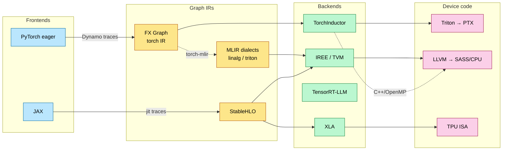
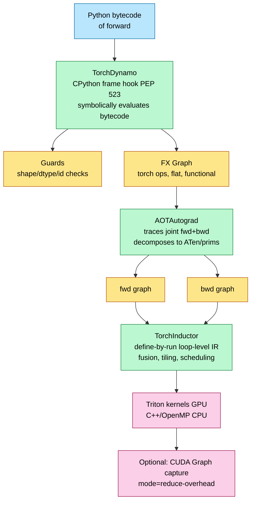

# ML Compilers — torch.compile, XLA, MLIR, and the Codegen Stack

> **Position in the stack:** sits between hand-written kernels ([Triton_and_Kernels](Triton_and_Kernels.md), [CUDA_Optimization](CUDA_Optimization.md)) and the frameworks that run models ([vLLM_Internals](../L8_Inference_and_Serving/vLLM_Internals.md), [Distributed_Training](../L7_Training_Stack/Distributed_Training.md)). Hand-written kernels set the performance ceiling; compilers decide how close the other 95% of the model gets to it.

---

## 0. Why this page exists

Every other L5 page is about writing one kernel well. But a transformer forward pass is thousands of ops, and nobody hand-writes them all. The ML compiler is the machinery that takes framework-level code (PyTorch/JAX) and emits fused, scheduled, autotuned device code — automatically. Interviews for inference and training-systems roles now routinely probe: *What does `torch.compile` actually do? Why do CUDA graphs matter for decode? What's a graph break and why does it kill performance? Why does TPU not need Triton?* This page gives the mechanism: the IR pipeline, the fusion math, the guard system, and where compilers still lose to humans.

---

## 1. Why compile at all — the three overheads

Eager-mode PyTorch pays three taxes that compilation removes:

| Tax | Mechanism | Magnitude |
|---|---|---|
| **Kernel launch overhead** | each op = 1+ CUDA kernel launch; CPU must dispatch | ~2–5 µs per launch; a 7B decode step has ~500+ ops → 1–2.5 ms of pure launch time vs ~10 ms compute |
| **Memory round-trips** | each unfused op reads inputs from HBM and writes outputs back | elementwise chain of $k$ ops moves $(k{+}1)\times$ tensor bytes instead of $2\times$ |
| **Python/dispatcher overhead** | dtype promotion, device dispatch, autograd bookkeeping per op | ~1–3 µs per op on host; stalls GPU when CPU-bound |

The fusion payoff is pure roofline math (see [Memory_Hierarchy_and_Roofline](../L3_Microarchitecture/Memory_Hierarchy_and_Roofline.md)). For a chain of $k$ elementwise ops on a tensor of $N$ bytes:

$$
\text{Traffic}_{\text{unfused}} = 2kN \qquad \text{Traffic}_{\text{fused}} = 2N \qquad \text{Speedup} \approx k
$$

Memory-bound ops are *linear* in traffic, so fusing a `mul + add + gelu + dropout` chain is a ~4× win on those ops. This is why Inductor's #1 job is not clever codegen — it is **fusion grouping**.

**When compilation matters most:** small-batch decode (launch-bound), elementwise-heavy epilogues (norm/activation/residual), and anything CPU-dispatch-bound. When it matters least: large dense GEMMs already running cuBLAS/CUTLASS at 80%+ of peak — the compiler just calls the library.

---

## 2. torch.compile — the three-stage pipeline

`torch.compile(model)` is three separate systems chained together (PyTorch 2.x; current stable 2.12):

### 2.1 TorchDynamo — graph capture without tracing pain

Dynamo hooks CPython frame evaluation (PEP 523) and **symbolically interprets the bytecode** of `forward()`. Tensor ops are recorded into an FX graph; non-tensor Python (ints, control flow on constants) is evaluated normally. This is the key difference from older approaches:

| Approach | Mechanism | Failure mode |
|---|---|---|
| `torch.jit.trace` | run once, record ops | silently bakes in control flow taken on the example input |
| `torch.jit.script` (TorchScript) | parse Python AST into its own language | supports a Python subset; rewrite-your-model hell |
| **Dynamo** | bytecode interception + guards | falls back to eager *per-fragment* (graph break) — never wrong, sometimes slow |
| `jax.jit` | tracing with abstract values | pure-functional requirement; control flow must use `lax.cond/scan` |

**Guards.** Every capture records the assumptions that make the graph valid: input shapes/dtypes/devices, `nn.Module` identity, global flags, closure variables. On every subsequent call the guards are checked (fast C++ checks); if any fails → **recompile** for the new property set. Guard sets are cached per code object (default cache limit 8 entries, then fall back to eager).

**Graph breaks.** When Dynamo hits something it cannot trace (a `print`, `.item()` data-dependent branch, an unsupported C extension, dynamic list mutation), it splits: compiles the fragment before the break, runs the offending op in eager, resumes capture after. Each break costs you fusion opportunities across the boundary and re-entry overhead. Debug with `torch._dynamo.explain(model)(input)` or `TORCH_LOGS=graph_breaks`. `fullgraph=True` turns breaks into hard errors — what vLLM and serious deployments use.

### 2.2 AOTAutograd — getting the backward for free

Inductor optimizes *graphs*, but autograd is define-by-run. AOTAutograd traces the **joint forward+backward** graph ahead of time (using FakeTensors — metadata-only tensors that never allocate), partitions it into separate fwd/bwd graphs, and chooses a **rematerialization split**: which intermediates to save for backward vs recompute (min-cut algorithm balancing memory vs FLOPs — the same activation-checkpointing tradeoff from [Training_Optimization](../L7_Training_Stack/Training_Optimization.md), made automatic). It also decomposes ~2000 ATen ops into a ~250-op core set (`prims`) so backends implement a small surface.

### 2.3 TorchInductor — the actual code generator

Inductor lowers the ATen graph into a **define-by-run loop-level IR** (each op = a Python function describing its loop nest), then:

1. **Buffer/scheduling pass** — builds a DAG of buffers, decides inlining vs materialization.
2. **Fusion** — greedy fusion of (a) pointwise→pointwise, (b) pointwise→reduction epilogues, (c) reduction→pointwise prologues, subject to: same iteration space (after broadcast resolution), no fusion across graph outputs needed elsewhere, register/SMEM budget heuristics.
3. **Tiling + codegen** — emits **Triton** for GPU (one kernel per fused group), C++/OpenMP for CPU. Matmuls/convs: either call cuBLAS/cuDNN, or with `mode="max-autotune"` generate Triton matmul candidates and benchmark against the library, picking the winner (cached on disk; shareable via remote/Mega-cache in large fleets).
4. **Wrapper codegen** — Python (or C++ with `cpp_wrapper`) that allocates buffers and launches kernels in order; memory planning reuses buffers whose lifetimes don't overlap.

**Compile modes:**

| Mode | What it adds | Use |
|---|---|---|
| `default` | fusion + codegen | training steps, big shapes |
| `reduce-overhead` | + CUDA Graph capture of the whole compiled region | small-batch inference/decode |
| `max-autotune` | + Triton GEMM autotuning, coordinate-descent tile search | steady-state serving, long-lived jobs |

### 2.4 Dynamic shapes

First call compiles shape-specialized; if a dimension changes across calls, PyTorch marks it **symbolic** (`s0`) and recompiles once with a symbolic-shape graph guarded by constraints (e.g., `s0 > 1`). `torch._dynamo.mark_dynamic(x, dim)` pre-declares dynamism and skips the specialize-then-generalize dance. The cost of symbolic shapes: some fusions/tilings can't assume divisibility, so peak perf is slightly lower than a static-shape compile — which is exactly why **vLLM compiles a fixed menu of batch sizes** instead (§6.1).

---

## 3. CUDA Graphs — removing the launch tax

A CUDA Graph records a DAG of kernel launches + memcpys once, then replays the whole DAG with **one** host call.

**The math.** Decode step for a 7B model ≈ 300–600 kernel launches. At ~3 µs CPU launch cost each, eager launch overhead ≈ 1–2 ms. Decode compute at batch 1 ≈ 5–10 ms. Graph replay cost ≈ 10–50 µs total. So CUDA graphs recover **10–30% of small-batch decode latency**, and far more when the CPU is also busy with scheduling (the exact situation in an inference server).

**Constraints (and how engines cope):**

- **Static shapes** — a graph bakes in grid dims. → Engines capture one graph per bucketed batch size (vLLM: typically powers of 2 / multiples up to `max_num_seqs`), padding the live batch up to the nearest captured size.
- **Static addresses** — tensors must live at the same pointers across replays. → Persistent buffer pools; KV cache is pre-allocated paged memory anyway ([KV_Cache](../L8_Inference_and_Serving/KV_Cache.md)).
- **No CPU work inside** — no `.item()`, no data-dependent host branching mid-graph.
- **Capture is expensive** (ms–s, plus memory per graph) → done at server warmup, hence vLLM's startup "capturing CUDA graphs" phase.

**Piecewise CUDA graphs (vLLM V1).** Attention with paged KV and variable sequence lengths is hostile to whole-graph capture; V1 compiles the model with `torch.compile`, then captures CUDA graphs **piecewise** — graphing the dense/MLP regions and leaving attention as a dynamic call — getting most of the launch savings without freezing sequence-length-dependent logic.

---

## 4. XLA and the JAX path — the TPU answer

XLA predates torch.compile by years and makes the opposite bet: **whole-program, ahead-of-time, pure-functional compilation**.

- `jax.jit` traces a pure function with abstract values → **StableHLO** (a stable, serializable MLIR-based op set).
- XLA runs aggressive fusion (producer-consumer, multi-output), layout assignment (picks physical tile layouts per op for the MXU's 128×128 systolic array — see [Google_TPU](../L3_Microarchitecture/Google_TPU.md)), and buffer assignment (static memory plan — no allocator at runtime).
- Codegen targets the TPU's VLIW-ish scalar/vector units + MXU directly. **There is no hand-kernel ecosystem on TPU because XLA fusion + layout is "the kernel"** — the escape hatch for the residue is Pallas (Triton-like DSL lowering through Mosaic).

**GSPMD / shard_map.** XLA's partitioner takes per-tensor sharding annotations (`jax.sharding.NamedSharding`) and compiles a **single-device program into an SPMD multi-device program**, inserting all-gathers/reduce-scatters automatically and overlapping them with compute. This is "compiler does your tensor parallelism" — contrast with PyTorch where TP is library code (Megatron/DTensor). The tradeoff: XLA-class compilation gets compile times in minutes for big models, and the pure-functional constraint (donation for in-place, `lax.scan` for loops) is a real programming-model tax.

**GPU XLA** exists (JAX on GPU is production-real, e.g., for diffusion and research stacks) but on NVIDIA the center of gravity stays Triton/CUTLASS because peak GEMM/attention kernels beat XLA codegen.

---

## 5. MLIR, Triton-as-compiler, and the rest of the zoo

- **MLIR** — LLVM's extensible multi-level IR framework: you define *dialects* (linalg, tensor, memref, gpu, …) and progressive lowering passes between them. It is the substrate, not a compiler: StableHLO, IREE, Triton's mid-end, Mosaic/Pallas, and most vendor NPU compilers are MLIR-based.
- **Triton itself is a compiler**: Python AST → Triton IR → TritonGPU IR (MLIR dialects; layout/pipelining/mma passes) → LLVM → PTX. When you tune `num_warps`/`num_stages` you are steering its passes. Inductor emitting Triton means PyTorch's codegen inherits every Triton backend (NVIDIA, AMD ROCm, Intel, and vendor ports like Triton-MTIA) — this is how "PyTorch on new silicon" is bootstrapped now.
- **torch-mlir** — bridges TorchScript/FX to MLIR for non-Inductor backends; **IREE** — MLIR-based compiler+runtime targeting CUDA/Vulkan/Metal/CPU, strong for edge/embedded deployment.
- **TVM** — the pre-MLIR auto-scheduling pioneer (Ansor); production presence now mostly edge/mobile.
- **Mojo (Modular)** — MLIR-native Python-superset language aiming to make kernel + host code one language; the MAX stack ships portable kernels across NVIDIA/AMD from one source. Watch-list item, not yet a default in big-lab serving stacks.
- **TensorRT-LLM** — not a general compiler: an engine builder that pattern-matches a model definition onto NVIDIA's hand-tuned kernel library, with INT8/FP8/FP4 calibration baked in at build time. Maximum peak perf, minimum flexibility (an "engine" is shape-range- and GPU-specific).

---

## 6. Compilers in production inference engines

### 6.1 vLLM V1

- Model runs under `torch.compile` (`fullgraph`-style, custom-op boundaries around attention); Inductor-generated fusions for norms/activations/quant-dequant epilogues.
- **Piecewise CUDA graphs** per batch-size bucket (§3).
- Compilation artifacts cached on disk keyed by model/config; warmup pays the cost once.

### 6.2 SGLang

- `--enable-torch-compile` for small-batch/low-latency paths (biggest win at batch ≤ 8 where launch overhead dominates).
- Its real "compilation" edge is elsewhere: **compressed-FSM constrained decoding** (grammar compiled to a token-level FSM, mask generation overlapped with the forward pass — ~3× faster structured output) — compilation of the *decoding program*, not the model.

### 6.3 The pattern

Production engines treat the compiler as **a tool applied to regions**, not a whole-program oracle: attention = hand kernels (FlashAttention/FlashInfer), GEMMs = CUTLASS/cuBLAS or autotuned Triton, glue = Inductor fusion, launch overhead = CUDA graphs. Knowing *which region gets which treatment and why* is the interview answer.

---

## 7. What compilers still can't do

1. **Algorithmic rewrites.** No compiler turns naive attention into FlashAttention — that's a *math* transformation (online softmax, see [FlashAttention_Deep_Dive](FlashAttention_Deep_Dive.md)) changing the memory complexity class, not a fusion. Compilers fuse within the algorithm you wrote.
2. **Cross-layer distributed scheduling.** Overlapping TP all-reduce with GEMM tails (async-TP), micro-batched pipeline schedules — partially compiler-assisted (GSPMD, Inductor's collective passes) but frontier systems still hand-schedule.
3. **Peak GEMM/attention on new hardware.** Human + CUTLASS still beats codegen on Hopper/Blackwell tensor-core utilization; compilers catch up per-architecture with ~1-year lag.
4. **LLM-generated kernels** (KernelBench; RL-tuned Triton generation à la "Dr. Kernel", 2026) are closing part of this gap — current state: competitive on memory-bound kernels, still behind on tensor-core-saturating GEMM/attention. Plausible medium-term outcome: autotuners whose search proposals come from models.

---

## 8. Numbers to memorize

| Quantity | Value | Why it matters |
|---|---|---|
| Kernel launch overhead | ~2–5 µs CPU-side | the tax CUDA graphs remove |
| Ops per 7B decode step | ~300–600 kernels | × launch cost = ms-scale eager overhead |
| CUDA graph replay cost | ~10–50 µs whole-DAG | vs 1–2 ms eager launches |
| torch.compile typical training speedup | 1.3–2× (HF benchmark suite) | fusion + overhead removal |
| `reduce-overhead` decode gain | 10–30% at small batch | the vLLM/SGLang small-batch story |
| Fused elementwise chain of k ops | ~k× traffic reduction | roofline arithmetic |
| Dynamo recompile cache limit | 8 (default) | guard-thrash → silent eager fallback |
| ATen → core decomposition | ~2000 → ~250 ops | backend implementation surface |
| Inductor max-autotune compile time | minutes (cached after) | why serving warms up slowly once |
| XLA big-model compile time | minutes–tens of minutes | the AOT tax JAX users pay |

---

## 9. Worked problems

**Problem 1 — CUDA graph payoff.** A 8B model decodes at batch 4 on one H100. Per step: 450 kernels, mean launch cost 3 µs, GPU compute 7.2 ms, and the serving CPU thread is 60% busy with scheduling. Estimate decode-step latency eager vs with CUDA graphs, assuming launches serialize with scheduling on the CPU.

*Solution.* Eager CPU work per step = 450 × 3 µs = 1.35 ms of launch time; with the CPU only 40% available to issue launches, wall-clock contribution ≈ 1.35/0.4 ≈ 3.4 ms, partially overlapped with the 7.2 ms GPU compute. If launch issue can't stay ahead of the GPU, exposed overhead ≈ 3.4 − (7.2 − 1.35) ≈ 0 in steady state *only if* perfectly pipelined; realistically bubbles expose ~1–2 ms → step ≈ 8.2–9.2 ms. With graphs: one ~30 µs replay + 7.2 ms compute ≈ 7.23 ms, and the CPU is freed for scheduling. Gain ≈ 12–21%. This is why every serious engine captures decode graphs.

**Problem 2 — fusion traffic.** `y = dropout(gelu(x @ W + b))` with x: [8192, 4096], W: [4096, 4096], BF16. Compare HBM traffic for the epilogue (bias-add → GeLU → dropout) unfused vs fused into the GEMM, on a 3.35 TB/s H100.

*Solution.* Output tensor = 8192×4096×2 B = 64 MiB. Unfused epilogue: bias-add (R 64 + W 64), GeLU (R 64 + W 64), dropout (R 64 + W 64 + mask W 32 MiB int8... take 8-bit mask = 32 MiB) ≈ 416 MiB ≈ 0.41 GiB → ≈ 130 µs at peak BW. Fused into GEMM epilogue: one write of y (64 MiB) + mask (32 MiB) ≈ 96 MiB → ≈ 30 µs. Saves ~100 µs per layer; × 2 MLP GEMMs × 32 layers ≈ 6.4 ms per forward at batch 8192 tokens — material. (GEMM itself: 2·8192·4096·4096 = 0.55 TFLOP → ~0.6 ms at 900 dense BF16 TFLOPS; the epilogue was ~20% overhead before fusion.)

**Problem 3 — guard thrash.** A retrieval service calls a compiled encoder with batch sizes {1..64} uniformly. Default compile specializes shapes; cache limit 8. What happens, and name two fixes.

*Solution.* >8 distinct batch sizes → cache eviction churn; Dynamo gives up and the function silently runs eager (plus recompile stalls of seconds each along the way). Fixes: (a) `mark_dynamic` on the batch dim (one symbolic-shape graph), (b) bucket-and-pad to a small set of sizes (what inference engines do — pairs naturally with per-bucket CUDA graphs), (c) raise the cache limit only if the size set is truly small.

---

## 10. Interview snap answers

- **"What does torch.compile do?"** → Dynamo captures bytecode into FX graphs with guards; AOTAutograd traces joint fwd/bwd and decomposes to a core op set; Inductor fuses and emits Triton/C++; optional CUDA-graph wrapping. Falls back per-fragment via graph breaks.
- **"Why is XLA fine without hand kernels but PyTorch isn't?"** → TPU: one vendor, regular systolic hardware, whole-program AOT with layout assignment; XLA fusion ≈ the kernel. GPU: irregular SKU zoo + peak tensor-core kernels (attention/GEMM) still human-won; compiler handles the glue.
- **"Compiler vs FlashAttention?"** → fusion can't change memory complexity; online-softmax tiling is an algorithmic identity a compiler won't discover. Compile the glue, hand-write the hot loop.
- **"Why does vLLM pad batches?"** → CUDA graphs need static shapes; padding to captured buckets trades ≤ one bucket of wasted compute for ms-scale launch savings.

---

## Cross-references

- Upstream: [Triton_and_Kernels](Triton_and_Kernels.md) (the codegen target), [CUDA_Optimization](CUDA_Optimization.md) (what good output looks like), [Google_TPU](../L3_Microarchitecture/Google_TPU.md) (XLA's hardware).
- Downstream: [vLLM_Internals](../L8_Inference_and_Serving/vLLM_Internals.md) (piecewise graphs in production), [Batching_and_Scheduling](../L8_Inference_and_Serving/Batching_and_Scheduling.md) (bucketing), [Training_Optimization](../L7_Training_Stack/Training_Optimization.md) (compile in training loops).
