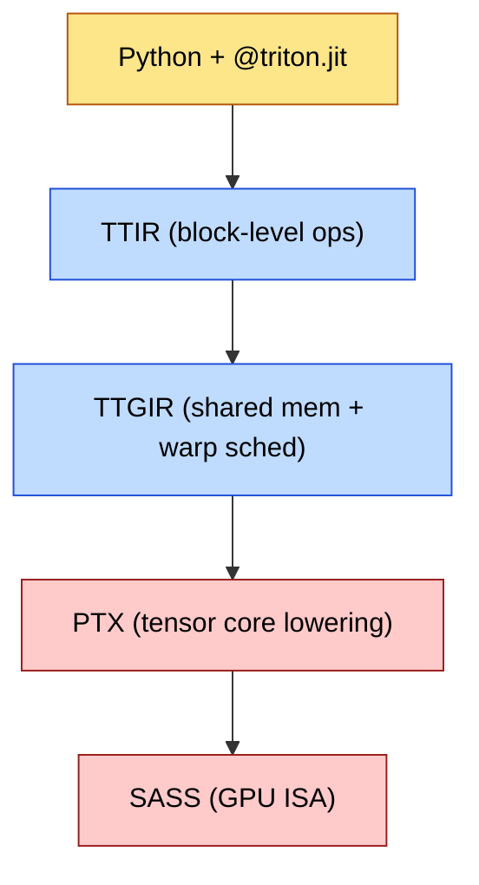
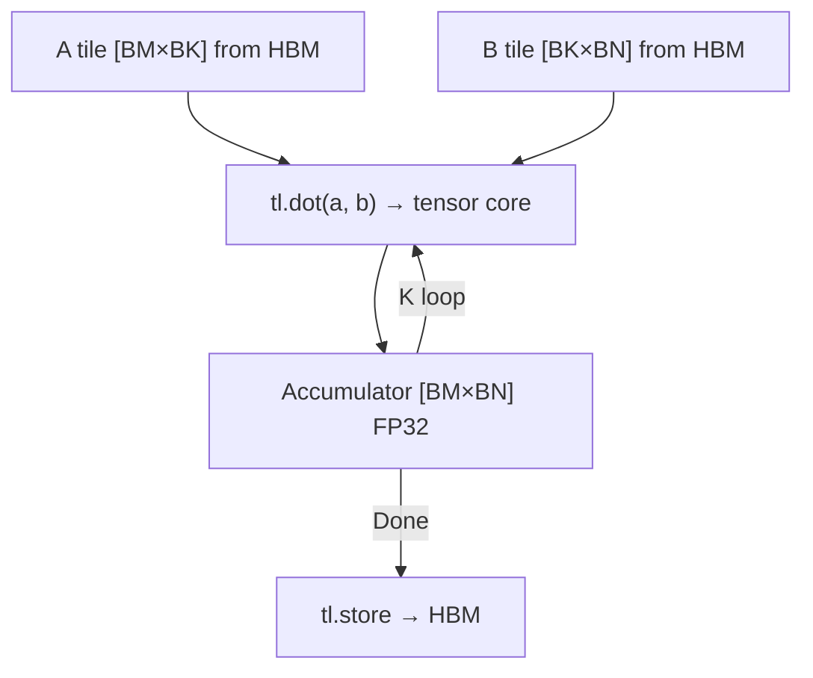
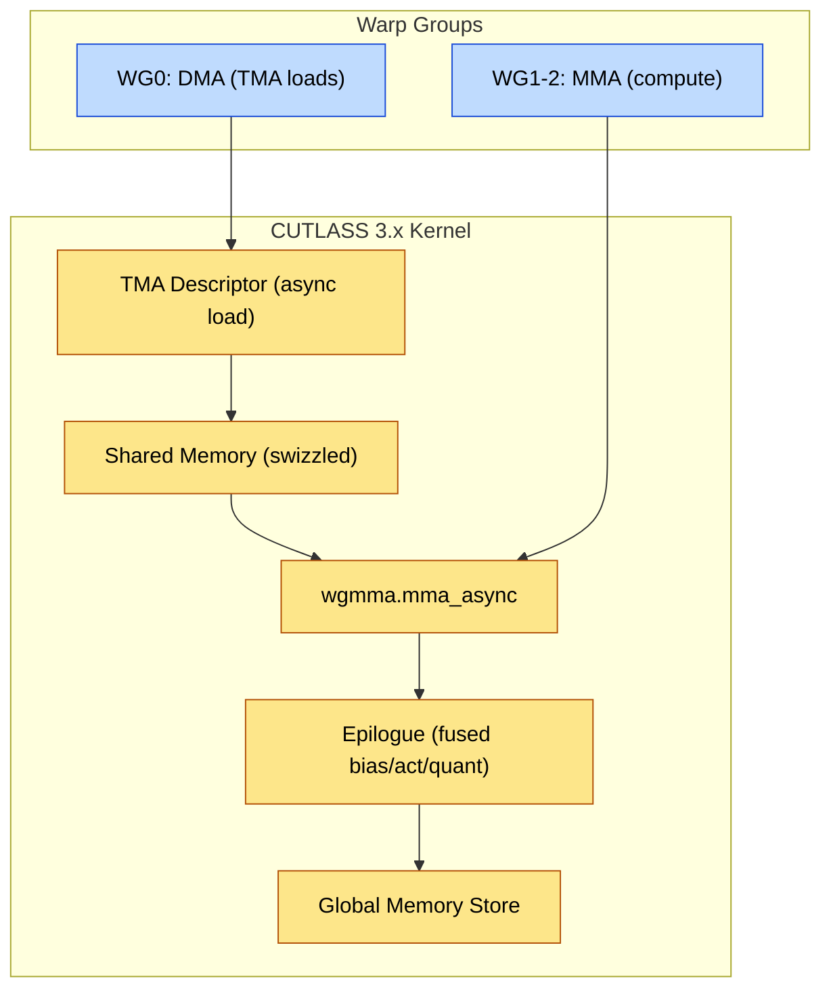
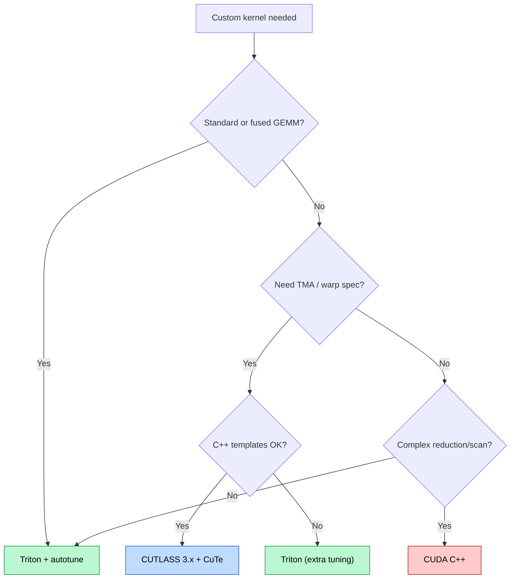
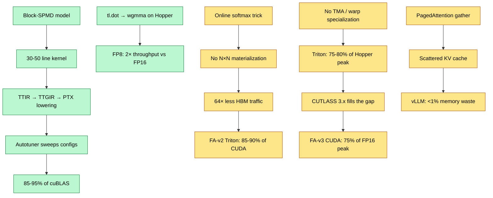

# Triton and Custom Kernels — High-Performance GPU Programming in Python

> **Layer:** L5.
> **Prerequisites:** [CUDA_Programming](CUDA_Programming.md), [CUDA_Optimization](CUDA_Optimization.md), [GPU_Architecture](../L3_Microarchitecture/GPU_Architecture.md).
> **Hands off to:** [FlashAttention_Deep_Dive](FlashAttention_Deep_Dive.md), [Cutting_Edge_Kernels](Cutting_Edge_Kernels.md), [Attention_Mechanisms](../L6_Algorithms_and_Models/Attention_Mechanisms.md).

---

## 0. Why this page exists

Writing production CUDA kernels requires mastering pointer arithmetic, shared memory management, warp-level intrinsics, and register allocation. OpenAI's Triton eliminates most of this complexity with a Python DSL that compiles through MLIR to optimized PTX. The programmer reasons about blocks, not threads; the compiler handles shared memory tiling, coalescing, and tensor core dispatch. This page covers the Triton programming model, compilation pipeline, autotuning, kernel implementations (matmul, softmax, simplified FlashAttention), the CUTLASS/CuTe escape hatch, production case studies, debugging, and limitations.

The five invariants:

1. **Triton programs operate on blocks, not threads** — the compiler maps block-level operations to threads and shared memory.
2. **Compilation: Triton → TTIR → TTGIR → PTX → SASS** — each lowering adds GPU-specific optimization.
3. **Autotuning is not optional** — performance varies 2-5× across configs; the autotuner caches the best.
4. **Triton achieves 85-95% of cuBLAS on matmul** — but hardware-specific features may require CUTLASS.
5. **CUTLASS 3.x + CuTe is the escape hatch** — when Triton cannot express the operation.

---

## 1. What Triton Is

### 1.1 Positioning in the Kernel Stack

Triton sits between framework operations (PyTorch `nn.Linear`) and CUDA C++. The goal: write a custom fused kernel in hours, not weeks.

| Layer | Tool | Abstraction | Peak Performance |
|---|---|---|---|
| High | PyTorch eager | Tensor operations | 30-60% of peak |
| Mid | Triton | Block-level operations | 85-95% of peak |
| Low | CUTLASS / CuTe | Tile + warp + thread | 95-100% of peak |
| Lowest | CUDA C++ | Thread + register | 100% of peak |

Triton's key insight: most GPU kernels are tile-based — load a tile, compute, store. Triton makes this pattern first-class.

### 1.2 Compilation Pipeline



Each stage: **TTIR** — block-level SSA IR from the Python AST, no thread concepts. **TTGIR** — GPU backend adds shared memory allocation, warp scheduling, and coalescing (this is where `tl.load` becomes shared-memory-tiled global loads). **PTX** — NVIDIA portable ISA; tensor core operations (`mma.sync`, `wgmma`) are emitted here with register allocation. **SASS** — GPU-specific machine code, JIT-compiled by the driver at launch time.

### 1.3 The Block-SPMD Programming Model

Triton uses a Single Program, Multiple Data (SPMD) model where each program instance processes a block of data. The key APIs: `tl.program_id(axis)` returns the program instance ID, `tl.load(pointer, mask)` loads a block from global memory (compiler inserts shared memory staging and vectorized loads automatically), `tl.store(pointer, value, mask)` writes back, and `tl.dot(a, b)` dispatches to tensor cores.

The programmer launches a grid of program instances:

$$\text{grid} = \left(\left\lceil \frac{M}{BLOCK_M} \right\rceil,\; \left\lceil \frac{N}{BLOCK_N} \right\rceil \right)$$

Each program instance computes one $BLOCK_M \times BLOCK_N$ output tile by looping over the $K$ dimension in chunks of $BLOCK_K$.

---

## 2. Triton Kernel Structure

### 2.1 Anatomy of a Kernel

```python
import triton
import triton.language as tl

@triton.jit
def vector_add_kernel(
    x_ptr,        # pointer to first input
    y_ptr,        # pointer to second input
    out_ptr,      # pointer to output
    n_elements,   # total number of elements
    BLOCK_SIZE: tl.constexpr,  # compile-time constant
):
    pid = tl.program_id(axis=0)
    block_start = pid * BLOCK_SIZE
    offsets = block_start + tl.arange(0, BLOCK_SIZE)
    mask = offsets < n_elements

    x = tl.load(x_ptr + offsets, mask=mask)
    y = tl.load(y_ptr + offsets, mask=mask)
    out = x + y
    tl.store(out_ptr + offsets, out, mask=mask)
```

Key elements: `@triton.jit` marks the function for JIT compilation (all `tl.constexpr` parameters are folded at compile time). `tl.program_id(axis=0)` identifies which block this instance processes. `tl.arange(0, BLOCK_SIZE)` creates the offset vector — the fundamental addressing primitive. `mask` handles boundary conditions. No explicit shared memory, no thread indexing, no synchronization.

### 2.2 Launching a Kernel

```python
def vector_add(x, y):
    out = torch.empty_like(x)
    grid = lambda meta: (triton.cdiv(x.numel(), meta['BLOCK_SIZE']),)
    vector_add_kernel[grid](x, y, out, x.numel(), BLOCK_SIZE=1024)
    return out
```

The `grid` lambda receives the kernel's `meta` parameters. `triton.cdiv(a, b)` computes $\lceil a/b \rceil$.

---

## 3. Matrix Multiplication in Triton

### 3.1 Tiled Matmul Kernel

A $M \times K$ times $K \times N$ matrix multiplication decomposes into tiles. Each program instance computes one $BLOCK_M \times BLOCK_N$ output tile by iterating over $K$ in steps of $BLOCK_K$.

```python
@triton.jit
def matmul_kernel(a_ptr, b_ptr, c_ptr, M, N, K,
                  stride_am, stride_ak, stride_bk, stride_bn,
                  stride_cm, stride_cn,
                  BLOCK_M: tl.constexpr, BLOCK_N: tl.constexpr,
                  BLOCK_K: tl.constexpr):
    pid_m, pid_n = tl.program_id(0), tl.program_id(1)
    offs_m = pid_m * BLOCK_M + tl.arange(0, BLOCK_M)
    offs_n = pid_n * BLOCK_N + tl.arange(0, BLOCK_N)
    offs_k = tl.arange(0, BLOCK_K)

    # Pointers to first tile of A [BLOCK_M, BLOCK_K] and B [BLOCK_K, BLOCK_N]
    a_ptrs = a_ptr + offs_m[:, None] * stride_am + offs_k[None, :] * stride_ak
    b_ptrs = b_ptr + offs_k[:, None] * stride_bk + offs_n[None, :] * stride_bn
    acc = tl.zeros((BLOCK_M, BLOCK_N), dtype=tl.float32)

    for k in range(0, tl.cdiv(K, BLOCK_K)):
        a = tl.load(a_ptrs, mask=offs_k[None, :] < K - k*BLOCK_K, other=0.0)
        b = tl.load(b_ptrs, mask=offs_k[:, None] < K - k*BLOCK_K, other=0.0)
        acc += tl.dot(a, b)       # tensor core dispatch
        a_ptrs += BLOCK_K * stride_ak
        b_ptrs += BLOCK_K * stride_bk

    c_ptrs = c_ptr + offs_m[:, None]*stride_cm + offs_n[None, :]*stride_cn
    tl.store(c_ptrs, acc, mask=(offs_m[:, None] < M) & (offs_n[None, :] < N))
```

### 3.2 How tl.dot Maps to Tensor Cores

The `tl.dot(a, b)` call lowers to hardware tensor core instructions:

| Architecture | Instruction | Shape (FP16) | Accumulator |
|---|---|---|---|
| Ampere (SM80) | `mma.sync` | 16×8×16 | FP32 |
| Hopper (SM90) | `wgmma.mma_async` | 64×8×256 | FP32 |
| Blackwell (SM100) | `tcgen05.mma` | Variable | FP32 |

The compiler handles register allocation, shared memory swizzling, and async load-compute overlap. On Hopper, `tl.dot` with `num_stages > 1` automatically uses `wgmma.mma_async` with multi-stage prefetching.

### 3.3 Pointer Arithmetic for 2D Tiles

For a row-major $M \times K$ matrix $A$: $\text{ptr}(i, k) = \text{base} + i \cdot \text{stride\_am} + k \cdot \text{stride\_ak}$ where $\text{stride\_am} = K$ and $\text{stride\_ak} = 1$. Triton uses broadcasting: `offs_m[:, None] + offs_k[None, :]` creates a $BLOCK_M \times BLOCK_K$ pointer matrix with a single vector expression.



---

## 4. Autotuning

### 4.1 The Autotuning Problem

Kernel performance depends on three compile-time parameters:

1. **`num_warps`** — the number of warps per program instance. Controls occupancy and shared memory partitioning. Values: 1, 2, 4, 8, 16, 32.
2. **`num_stages`** — the number of pipeline stages for prefetching. Each stage allocates additional shared memory for one input tile. Values: 1-5 (limited by shared memory capacity).
3. **`BLOCK_SIZE` variants** — tile dimensions (BLOCK_M, BLOCK_N, BLOCK_K). Must be multiples of the tensor core tile size.

Performance can vary by 5× across configurations. The autotuner sweeps these at first invocation and caches the best result.

### 4.2 The @triton.autotune Decorator

```python
@triton.autotune(
    configs=[
        triton.Config({'BM': 128, 'BN': 128, 'BK': 32}, num_warps=4, num_stages=3),
        triton.Config({'BM': 128, 'BN': 64,  'BK': 32}, num_warps=4, num_stages=4),
        triton.Config({'BM': 64,  'BN': 128, 'BK': 64}, num_warps=4, num_stages=3),
        triton.Config({'BM': 128, 'BN': 128, 'BK': 64}, num_warps=8, num_stages=3),
    ],
    key=['M', 'N', 'K'],
)
@triton.jit
def tuned_matmul_kernel(...): ...
```

The `key` parameter specifies which runtime arguments trigger re-tuning. When $M, N, K$ change, the autotuner re-runs the sweep; otherwise it uses the cached config.

### 4.3 Pruning and Early Termination

A full sweep of 50+ configurations can take minutes. Two pruning strategies reduce this:

1. **Shared memory budget**: if `num_stages * S_stage` exceeds 227 KB (SM90), the configuration is pruned before execution.
2. **Warmup + timing**: 10 warmup iterations followed by 100 timed iterations. Slow configurations are pruned early.

### 4.4 Autotuning Cost Model

Shared memory per block: $SHMEM = num\_stages \times (BM \cdot BK + BK \cdot BN) \times sizeof(dtype)$. On SM90 with 227 KB limit:

$$num\_stages \le \left\lfloor \frac{232{,}448}{(BM \cdot BK + BK \cdot BN) \times sizeof(dtype)} \right\rfloor$$

For FP16 with $BM=128, BN=128, BK=64$: per-stage = $(128 \times 64 + 64 \times 128) \times 2 = 32{,}768$ bytes. Max stages = $\lfloor 232{,}448 / 32{,}768 \rfloor = 7$. In practice 3-4 stages are optimal; beyond that, register pressure reduces occupancy.

---

## 5. Softmax Kernel

### 5.1 Numerically Stable Softmax

The naive softmax $x_i / \sum_j e^{x_j}$ overflows for large $x_i$. The numerically stable form:

$$\text{softmax}(x_i) = \frac{e^{x_i - \max(x)}}{\sum_j e^{x_j - \max(x)}}$$

requires three passes: (1) find max, (2) compute sum of exponentials, (3) divide. In Triton, `tl.max` and `tl.sum` handle the reductions automatically — the compiler emits warp shuffle reductions.

### 5.2 Triton Softmax Kernel

```python
@triton.jit
def softmax_kernel(
    input_ptr, output_ptr,
    n_cols,
    BLOCK_SIZE: tl.constexpr,
):
    row_idx = tl.program_id(0)
    row_start = row_idx * n_cols
    offsets = tl.arange(0, BLOCK_SIZE)
    mask = offsets < n_cols

    row = tl.load(input_ptr + row_start + offsets, mask=mask, other=float('-inf'))
    row_minus_max = row - tl.max(row, axis=0)
    numerator = tl.exp(row_minus_max)
    denominator = tl.sum(numerator, axis=0)
    output = numerator / denominator

    tl.store(output_ptr + row_start + offsets, output, mask=mask)
```

Each program instance handles one row (grid = `(num_rows,)`). `tl.max(row, axis=0)` emits a warp shuffle reduction, with cross-warp reduction if `BLOCK_SIZE > 32`. For hidden dimension $d = 4096$ and `BLOCK_SIZE = 4096`, the entire row fits in one block. For $d > BLOCK_SIZE$, a cross-block reduction is needed — but this is rare in practice.

---

## 6. Simplified FlashAttention in Triton

### 6.1 The Online Softmax Trick

FlashAttention's core insight: the attention output for a query tile can be computed incrementally over key/value tiles without materializing the full $N \times N$ attention matrix. The online softmax maintains running statistics:

$$m^{(j)} = \max(m^{(j-1)}, \max(\mathbf{q} \mathbf{K}_{j}^T))$$

$$\ell^{(j)} = e^{m^{(j-1)} - m^{(j)}} \cdot \ell^{(j-1)} + \sum_{k} e^{q_k K_{jk}^T - m^{(j)}}$$

$$\mathbf{o}^{(j)} = \frac{e^{m^{(j-1)} - m^{(j)}} \cdot \ell^{(j-1)} \cdot \mathbf{o}^{(j-1)} + \text{rowsum}(e^{S_j - m^{(j)}}) \cdot V_j}{\ell^{(j)}}$$

where $S_j = \mathbf{Q} \cdot K_j^T / \sqrt{d_k}$ is the partial attention score for the $j$-th key/value tile.

### 6.2 Triton Attention Kernel (Simplified)

The structure: a 3D grid over (query_tiles, heads, batches). Each program instance loads one query tile, iterates over key/value tiles, and maintains running statistics.

```python
@triton.jit
def attention_kernel(Q, K, V, Out, seq_len, head_dim, /* strides... */,
                     BLOCK_M: tl.constexpr, BLOCK_N: tl.constexpr):
    pid_q, pid_h, pid_b = tl.program_id(0), tl.program_id(1), tl.program_id(2)
    offs_m = pid_q * BLOCK_M + tl.arange(0, BLOCK_M)
    offs_d = tl.arange(0, BLOCK_D)

    q = tl.load(Q + pid_b*stride_qz + pid_h*stride_qh
                + offs_m[:, None]*stride_qm + offs_d[None, :]*stride_qk,
                mask=offs_m[:, None] < seq_len, other=0.0)

    m_i = tl.zeros([BLOCK_M], dtype=tl.float32) - float('inf')
    l_i = tl.zeros([BLOCK_M], dtype=tl.float32)
    acc = tl.zeros([BLOCK_M, BLOCK_D], dtype=tl.float32)

    for start_n in range(0, seq_len, BLOCK_N):
        offs_n = start_n + tl.arange(0, BLOCK_N)
        k, v = tl.load(K + ...), tl.load(V + ...)
        qk = tl.dot(q, tl.trans(k)) / (head_dim ** 0.5)
        m_new = tl.maximum(m_i, tl.max(qk, axis=1))
        alpha = tl.exp(m_i - m_new)
        l_new = alpha * l_i + tl.sum(tl.exp(qk - m_new[:, None]), axis=1)
        acc = acc * alpha[:, None] + tl.dot(tl.exp(qk - m_new[:, None]), v)
        m_i, l_i = m_new, l_new

    tl.store(Out + ..., acc / l_i[:, None], mask=offs_m[:, None] < seq_len)
```

The production kernel adds causal masking, KV padding, and paged KV. See [FlashAttention_Deep_Dive](FlashAttention_Deep_Dive.md) for the complete algorithm.

### 6.3 IO Complexity

The key result: standard attention materializes the $N \times N$ matrix in HBM ($\Theta(N^2 d)$ memory). FlashAttention reduces HBM IO to $\Theta(N^2 d^2 / M_{SRAM})$ where $M_{SRAM} = 228$ KB on Hopper. For $N = 8192, d = 128$: standard writes $8192^2 \times 4 = 256$ MB per head; FlashAttention writes $8192 \times 128 \times 4 = 4$ MB per head — a 64× reduction.

---

## 7. CUTLASS and CuTe

### 7.1 When to Use CUTLASS

Triton covers 80-90% of custom kernel needs. The remaining cases require CUTLASS:

| Requirement | Triton | CUTLASS |
|---|---|---|
| Standard/fused matmul | First choice | Also works |
| TMA loads | Limited (v3.0+) | Full control |
| Custom wgmma layouts | Not exposed | Direct access |
| Sparse 2:4 GEMM | Not supported | Supported |
| Custom MMA epilogue | Limited | Full flexibility |
| Warp specialization | Not exposed | First-class |

### 7.2 CUTLASS 3.x Architecture

CUTLASS 3.x (targeting Hopper/Blackwell) restructured around three concepts: (1) **Collective operations** — a `CollectiveMma` encapsulates the entire GEMM tiling strategy (TMA loads, MMA scheduling, epilogue). (2) **TMA descriptors** — the Tensor Memory Accelerator on Hopper allows a single thread to describe a tile, which hardware asynchronously loads from global memory. (3) **Warp specialization** — one warp group acts as DMA engine (loads tiles via TMA), others as MMA engines (compute tiles), overlapping load and compute.



### 7.3 CuTe: Layout Algebra

CuTe (ships with CUTLASS) provides a layout algebra for describing how multi-dimensional data maps to memory. Core abstractions: **Layout** — a pair $(shape, stride)$ mapping logical coordinates to offsets. **Tensor** — a Layout plus a pointer; can be sliced, transposed, and composed. **Tile** — a sub-layout extracted via `local_tile(tensor, tile_shape, tile_coord)`. CuTe makes explicit what Triton abstracts away, providing precise control when the autotuner cannot find a good configuration.

### 7.4 CUTLASS vs Triton Decision Flowchart



---

## 8. Comparison: CUDA vs CUTLASS vs Triton

| Metric | CUDA C++ | CUTLASS 3.x | Triton |
|---|---|---|---|
| LOC (matmul) | 300-500 | 50-100 | 30-50 |
| Time to first correct kernel | 2-5 days | 1-2 days | 2-4 hours |
| Peak (matmul / fused) | 95-100% / 95-100% | 95-100% / 90-100% | 85-95% / 80-95% |
| Tensor cores | Manual intrinsics | Automatic | Automatic |
| Shared memory | Manual | CuTe automatic | Automatic |
| TMA / warp specialization | Manual | First-class | Partial / none |
| Autotuning | Manual scripts | Built-in sweep | `@triton.autotune` |
| Portability (AMD, Intel) | None | None | Triton-ROCm, Triton-Intel |
| Launch overhead | ~5 μs | ~5 μs | ~5 μs (cached) / 10-15 μs (JIT) |

The portability row is critical: Triton compiles to PTX (NVIDIA), ROCm (AMD), or SPIR-V (Intel) from the same Python source. CUDA and CUTLASS are NVIDIA-only.

---

## 9. Production Kernel Case Studies

### 9.1 FlashAttention

| Version | Architecture | Peak Utilization | Key Innovation |
|---|---|---|---|
| FA v1 | Ampere (SM80) | ~50% of FP16 peak | Online softmax, IO-aware tiling |
| FA v2 | Ampere/Hopper | ~65% of FP16 peak | Work partitioning along seq dim |
| FA v3 | Hopper (SM90) | ~75% of FP16 peak | FP8 softmax, TMA, warp specialization |

The Triton implementation in the `flash-attn` package (~800 lines) achieves ~85-90% of the CUDA version's performance.

### 9.2 PagedAttention (vLLM)

PagedAttention stores KV blocks in a page table instead of contiguous memory:

$$KV\_cache[page\_table[b][s\_page]] = K\_block \parallel V\_block$$

Each block is a fixed-size page (typically $16 \times head\_dim$). The Triton implementation uses `tl.make_block_ptr` with page-table indirection for ~90% of theoretical bandwidth despite non-coalesced gathers.

### 9.3 FP8 GEMM

FP8 (E4M3 forward, E5M2 backward) doubles tensor core throughput. Production kernels handle: (1) per-tensor or per-channel scaling to manage FP8's limited dynamic range ($\pm 448$ for E4M3), (2) FP32 accumulation for numerical stability, (3) sub-channel scaling with 128-element sub-tiles for large matrices. In Triton, `tl.dot` with FP8 inputs automatically accumulates in FP32:

```python
# Inside the K loop (same structure as FP16 matmul)
acc += tl.dot(a_fp8, b_fp8)  # auto FP8→FP32 tensor core MMA
# After K loop: apply scaling and convert
output = acc * scale_a * scale_b
tl.store(c_ptrs, output.to(tl.float16))
```

### 9.4 MoE Router Kernel

Mixture-of-Experts routing fuses gating ($g = \text{softmax}(W_g \cdot x)$) and top-K selection into one kernel. The fused approach avoids materializing the full $[B, E]$ logits tensor in HBM. For $B = 4096$ tokens and $E = 256$ experts:

$$\text{Memory saved per layer} = B \times E \times 4 = 4\text{ MB}$$

With 58 MoE layers (DeepSeek-V3), this saves ~232 MB of HBM traffic per forward pass.

---

## 10. Debugging Triton Kernels

### 10.1 Common Pitfalls

| Pitfall | Symptom | Fix |
|---|---|---|
| Missing mask on `tl.load` | NaN at boundaries | Always provide `mask=offsets < n` |
| Wrong stride computation | Incorrect results | Verify with `assert stride == expected` |
| `tl.constexpr` missing | Compilation error | All block dimensions must be `tl.constexpr` |
| Integer division in grid | Too few program instances | Use `triton.cdiv(a, b)` not `a // b` |
| Accumulator dtype mismatch | Silent precision loss | Initialize accumulator as `tl.float32` |
| Recomputation inside K loop | 2-3× slower | Hoist invariants outside the loop |

### 10.2 Debugging Tools

1. **Triton interpreter**: `TRITON_INTERPRET=1 python kernel.py` — runs element-by-element on CPU. Catches pointer/mask bugs.
2. **`tl.device_print`**: prints tensor values at kernel execution time (limited to small tensors).
3. **Nsight Compute**: `ncu --set full -k kernel_name python launch.py` — profiles compiled kernel, shows SASS.
4. **TTIR/TTGIR dumps**: `TRITON_PRINT_LLIR=1` — dumps intermediate IR for verifying compiler optimizations.

### 10.3 Performance Debugging Checklist

1. **Roofline**: is the kernel compute-bound or memory-bound? $AI = \text{FLOPs} / \text{bytes\_transferred}$.
2. **Tensor core utilization**: `ncu --metrics sm__pipeline_tensor_op_cycles_active` — should be >50% for GEMM.
3. **Shared memory bank conflicts**: high stall cycles on shared memory loads indicate swizzling issues.
4. **Occupancy**: `ncu --metrics sm__warps_active.avg.pct_of_peak` — below 50% indicates register pressure.
5. **Autotune coverage**: ensure the config space covers the right block sizes for the target architecture.

---

## 11. When Triton Is NOT the Right Tool

### 11.1 Known Limitations

1. **Launch overhead**: JIT-compiled launches take 10-15 μs (first invocation); cached launches ~5 μs. For sub-10 μs kernels, CUDA C++ (~2-5 μs) is better.
2. **Dynamic control flow**: Triton does not support divergent control flow within a block. All threads in a program instance must take the same branch.
3. **Hardware-specific features**: TMA descriptors, warp-group scheduling, and the full `wgmma` API are partially or fully unavailable. CUTLASS provides complete access.
4. **Complex shared memory patterns**: automatic management is a benefit until explicit control is needed (custom swizzling, hand-tuned double-buffering).
5. **Cross-device kernels**: Triton does not support cooperative kernel launches across multiple GPUs.

### 11.2 When to Use CUDA C++ or CUTLASS Instead

| Scenario | Tool | Reason |
|---|---|---|
| TMA + warp specialization | CUTLASS 3.x | Triton lacks full TMA control |
| Sparse 2:4 structured GEMM | CUTLASS | Triton cannot sparse MMA |
| Segmented/hierarchical reduction | CUDA C++ | Block model does not map |
| Sub-5 μs kernel | CUDA C++ | Launch overhead dominates |
| Cross-vendor (AMD + NVIDIA) | Triton | Only cross-vendor option |

---

## 12. End-to-End Cause / Effect



---

## 13. Numbers to Memorize

| Quantity | Value | Why It Matters |
|---|---|---|
| Triton LOC for matmul | 30-50 | vs 300-500 in CUDA C++ |
| Peak utilization (GEMM) | 85-95% of cuBLAS | Sufficient for most use cases |
| Launch overhead (cached / JIT) | ~5 μs / 10-15 μs | 2-3× CUDA C++ overhead |
| Autotune sweep time | 30-120 s | Cached per (M, N, K) triple |
| Autotune performance variance | 2-5× across configs | Autotuning is not optional |
| SM90 shared memory per block | 227 KB | Constrains num_stages × tile_size |
| wgmma FP16 shape | 64×8×256 per MMA | Determines optimal BLOCK_K |
| FP8 tensor core throughput | 2× FP16 | E4M3 forward, E5M2 backward |
| FlashAttention IO reduction | 64× (N=8192, d=128) | Avoids N×N materialization |
| FA-v3 peak utilization | ~75% of Hopper FP16 peak | Memory-bound, not compute-bound |
| FA Triton vs CUDA | 85-90% of CUDA version | Acceptable for most training |
| CUTLASS 3.x kernel LOC | 50-100 | Much less than raw CUDA |
| PagedAttention page size | 16 tokens × head_dim | KV cache allocation granularity |
| Triton-ROCm support | MI250, MI300X | Same Python, AMD backend |
| MoE router memory saving | ~4 MB/layer (B=4K, E=256) | Fused gate+topk |

---

## 14. Worked Interview Problems

**Q1.** *A Triton matmul kernel uses BLOCK_M=128, BLOCK_N=128, BLOCK_K=64, num_stages=3 with FP16 inputs. Calculate the shared memory per block. Is this feasible on SM90 (227 KB)?*

Per stage: $S_{stage} = (128 \times 64 + 64 \times 128) \times 2 = 32{,}768$ bytes. Total: $3 \times 32{,}768 = 98{,}304$ bytes $\approx 96$ KB. The FP32 accumulator ($128 \times 128 \times 4 = 64$ KB) lives in registers, not shared memory. 96 KB is well within 227 KB; remaining budget allows up to $\lfloor 131{,}072 / 32{,}768 \rfloor = 4$ more stages. In practice, 4 stages total is optimal — beyond that, register pressure reduces occupancy.

**Q2.** *A softmax kernel processes rows of length N=4096 with BLOCK_SIZE=4096. How many program instances are needed for a batch of B=128 sequences, each with H=32 attention heads?*

Each row is handled by one program instance (BLOCK_SIZE = N). Total rows: $B \times H = 128 \times 32 = 4096$. Total program instances: 4096. Each instance performs 1 `tl.load` (the row) and 1 `tl.store` (the output), plus internal reductions (`tl.max`, `tl.sum`) that operate in registers/shared memory without additional global memory traffic.

If BLOCK_SIZE = 2048 instead, each row requires $\lceil 4096/2048 \rceil = 2$ blocks with a cross-block reduction, doubling the number of instances to 8192 and requiring additional synchronization — demonstrating why setting BLOCK_SIZE = N is the idiomatic approach.

**Q3.** *A Triton FlashAttention kernel processes Q=[B, H, M, D] and K,V=[B, H, N, D] with BLOCK_M=64, BLOCK_N=64, D=128. For B=1, H=1, M=N=8192, how many tl.dot calls does each program instance make?*

FlashAttention uses a 1D grid over query tiles: grid = $(\lceil 8192 / 64 \rceil,) = (128,)$. Each program instance iterates over $\lceil 8192 / 64 \rceil = 128$ key/value tiles. Per iteration: one `tl.dot(Q, K^T)` for attention scores and one `tl.dot(scores, V)` for value accumulation. Total per instance: $128 \times 2 = 256$ `tl.dot` calls. Total across all instances: $128 \times 256 = 32{,}768$.

Verification: each `tl.dot` performs $2 \times 64 \times 64 \times 128 = 1{,}048{,}576$ FLOPs (multiply-add). Total FLOPs: $32{,}768 \times 1{,}048{,}576 = 34{,}359{,}738{,}368 \approx 34.4$ GFLOPs. Theoretical attention compute: $4 \times N^2 \times D = 4 \times 8192^2 \times 128 = 34.4$ GFLOPs. Matches.

**Q4.** *A 65,536-GPU cluster trains an MoE model with 256 experts and 58 MoE layers. Each router produces a [B, 256] logits tensor. With B=4096 tokens per GPU, compare HBM traffic for: (a) materializing full logits then top-K, vs (b) fused router.*

(a) Full logits: $4096 \times 256 \times 4 = 4$ MB write + 4 MB read = 8 MB/layer. Total: $58 \times 8 = 464$ MB per GPU.

(b) Fused: only top-K=8 indices+weights written: $4096 \times 8 \times 8 = 0.26$ MB/layer. Total: $58 \times 0.26 = 15$ MB per GPU.

Savings: $(464 - 15)/464 = 96.8\%$. Across 65,536 GPUs: $\approx 29.4$ TB per forward pass.

**Q5.** *Design an autotune config space for a Triton FP8 GEMM kernel targeting SM90 (227 KB shared memory). BLOCK_M, BLOCK_N, BLOCK_K must be multiples of 64. Enumerate feasible tuples.*

FP8 is 1 byte per element. $S_{stage} = (BM \times BK + BK \times BN) \times 1$. Constraint: $num\_stages \times S_{stage} \le 232{,}448$.

| BLOCK_M | BLOCK_N | BLOCK_K | S_stage | Max stages | Good configs |
|---|---|---|---|---|---|
| 128 | 128 | 64 | 16,384 | 14 | (w4,s3), (w8,s4) |
| 128 | 128 | 128 | 32,768 | 7 | (w4,s3), (w4,s4) |
| 128 | 64 | 64 | 12,288 | 18 | (w4,s4), (w8,s5) |
| 256 | 128 | 64 | 24,576 | 9 | (w8,s3) |
| 128 | 256 | 64 | 24,576 | 9 | (w8,s3) |

Recommended 8 configs with `num_warps` in {4, 8} cover the most promising combinations. Autotune time: ~10-30 seconds (one-time cost, cached per M/N/K triple).

---

## 15. References

**Foundational**
- P. Tillet et al., "Triton: An Intermediate Language and Compiler for Tiled Neural Network Computations," *MAPL 2019*.
- OpenAI, *Triton documentation*, https://triton-lang.org, 2024.
- T. Dao et al., "FlashAttention: Fast and Memory-Efficient Exact Attention with IO-Awareness," *NeurIPS 2022*.
- T. Dao, "FlashAttention-2," *ICLR 2024*.
- NVIDIA, *CUTLASS 3.x Documentation*, https://github.com/NVIDIA/cutlass, 2024.
- R. Tsai, "CuTe: Layout Algebra for Dense Tensor Operations," NVIDIA GTC 2024.

**Recent**
- vLLM Team, "PagedAttention: Efficient Memory Management for LLM Serving," *OSDI 2024*.
- DeepSeek-AI, "DeepSeek-V3 Technical Report," *arXiv 2024*.
- AMD, "Triton-ROCm: Performance Guide for MI300X," *ROCm documentation*, 2025.
- M. Tong, "FlashAttention-3: Fast and Accurate Attention with Asynchrony and Low-Precision," *arXiv 2024*.

**Cross-references**
- [CUDA_Programming](CUDA_Programming.md) — thread/block/memory foundation.
- [CUDA_Optimization](CUDA_Optimization.md) — coalescing, shared memory, tensor cores: what Triton automates.
- [GPU_Architecture](../L3_Microarchitecture/GPU_Architecture.md) — tensor core microarchitecture.
- [Memory_Hierarchy_and_Roofline](../L3_Microarchitecture/Memory_Hierarchy_and_Roofline.md) — roofline model for kernel bottleneck analysis.
- [FlashAttention_Deep_Dive](FlashAttention_Deep_Dive.md) — complete FA v1→v2→v3 walkthrough.
- [Cutting_Edge_Kernels](Cutting_Edge_Kernels.md) — CUTLASS 3.x internals, FlashInfer, DeepEP, TileLang.

---

**Up the stack:** [FlashAttention_Deep_Dive](FlashAttention_Deep_Dive.md), [Cutting_Edge_Kernels](Cutting_Edge_Kernels.md), [Attention_Mechanisms](../L6_Algorithms_and_Models/Attention_Mechanisms.md).
**Down the stack:** [CUDA_Programming](CUDA_Programming.md), [CUDA_Optimization](CUDA_Optimization.md), [GPU_Architecture](../L3_Microarchitecture/GPU_Architecture.md).
