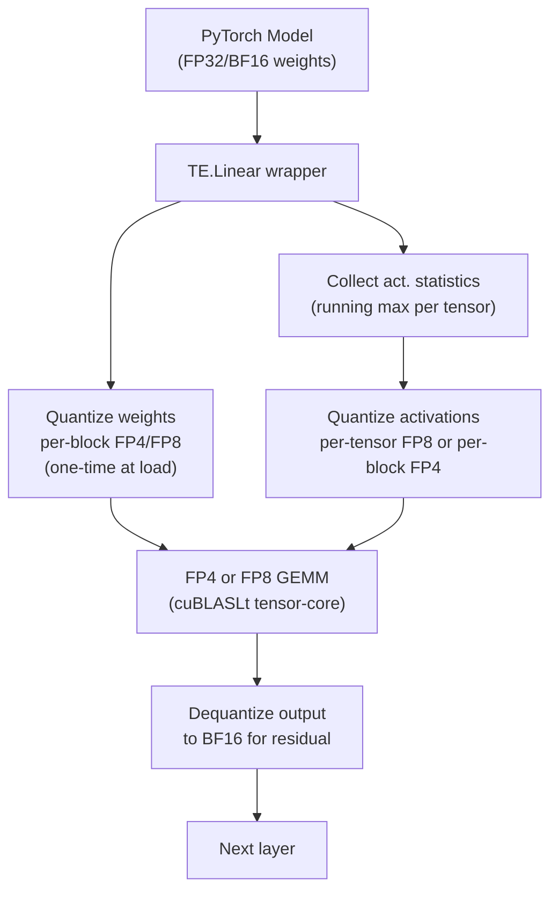
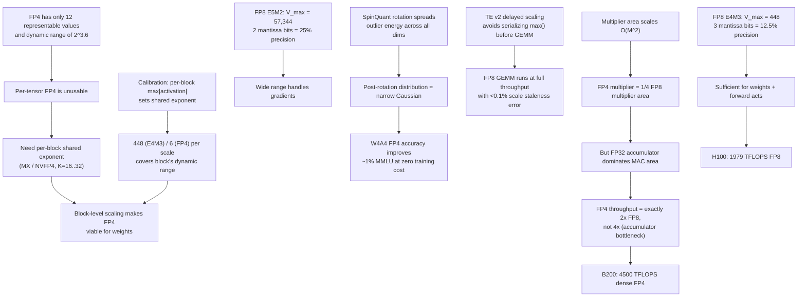

# Modern Quantization Frontier — FP8, FP4, and Beyond

> **Layer:** L6.
> **Prerequisites:** [Quantization](Quantization.md), [FP_Unit_Design](../L2_Digital_Design_for_AI/FP_Unit_Design.md), [Blackwell_Architecture](../L3_Microarchitecture/Blackwell_Architecture.md).
> **Hands off to:** [Frontier_Models_2025_2026](Frontier_Models_2025_2026.md), [Inference_Frameworks](../L8_Inference_and_Serving/Inference_Frameworks.md).

---

## 0. Why this page exists

Every generation of AI hardware doubles down on one question: *how few bits can you spend per multiply?* FP16 ruled Ampere; FP8 ruled Hopper; FP4 rules Blackwell. The next generation will chase FP3 or sub-FP4 block codes. But the story is not just "fewer bits = faster hardware." The algorithmic challenge is ferocious: at 4 bits per element you have exactly 16 representable values, and a single outlier channel can saturate the entire codebook.

This page covers the **full stack** of modern low-bit quantization: the number formats (FP8 E4M3 / E5M2, FP6 encodings, FP4 / MXFP4 / NVFP4), the OCP Microscaling (MX) standard, learned rotation methods (SpinQuant), calibration pipelines, Transformer Engine v2's runtime scaling, and accuracy benchmarks across all formats. Every format is derived from its bit encoding; every throughput claim is grounded in the multiplier-area model from [FP_Unit_Design](../L2_Digital_Design_for_AI/FP_Unit_Design.md).

---

## 1. FP8: the two-encoding split

FP8 was standardized by NVIDIA, AMD, and ARM jointly in 2022. It is *not* one format — it is two, each optimized for a different phase of training and inference.

### 1.1 E4M3: 4 exponent bits, 3 mantissa bits

$$
V = (-1)^S \cdot (1.M_2) \cdot 2^{E - 7}, \quad E \in \{0, \ldots, 14\}
$$

$S$ = 1 sign bit, $E$ = 4 exponent bits, $M$ = 3 mantissa bits. Bias = $2^{4-1} - 1 = 7$. The implicit leading 1 gives 4 effective mantissa bits.

**Dynamic range derivation.** The maximum representable finite value occurs when $E = 14$ (the all-ones exponent $E = 15$ is reserved for Inf/NaN in E4M3) and $M = 111_2$:

$$
V_{\max} = (1.111_2) \cdot 2^{14 - 7} = 1.875 \cdot 2^7 = 240
$$

Wait — NVIDIA's published E4M3 extends to $E = 15$ for finite values (no Inf/NaN encoding in the standard, unlike IEEE):

$$
V_{\max} = (1.111_2) \cdot 2^{15 - 7} = 1.875 \cdot 2^8 = 448
$$

Minimum positive normal: $E = 0, M = 000$:

$$
V_{\min}^+ = 1.0 \cdot 2^{0 - 7} = 2^{-7} \approx 0.0078
$$

Dynamic range: $448 / 2^{-7} = 448 \cdot 128 = 57\,344 \approx 2^{15.8}$.

Precision: 3 mantissa bits give $2^3 = 8$ distinct values per binade. Relative precision $= 2^{-3} = 12.5\%$.

**Usage.** Weights, forward-pass activations. The 4 exponent bits suffice because weight distributions are narrow and activations within a single layer span limited dynamic range.

### 1.2 E5M2: 5 exponent bits, 2 mantissa bits

$$
V = (-1)^S \cdot (1.M_2) \cdot 2^{E - 15}, \quad E \in \{0, \ldots, 25\} \text{ (normal)}
$$

Bias = $2^{5-1} - 1 = 15$. E5M2 reserves $E = 30$ for Inf and $E = 31$ for NaN (IEEE-style).

**Dynamic range derivation.** Maximum finite value ($E = 29, M = 11_2$):

$$
V_{\max} = (1.11_2) \cdot 2^{29 - 15} = 1.75 \cdot 2^{14} = 28\,672
$$

With subnormal support through $E = 0$: the full representable range spans $\pm 57\,344$ (including the sign bit's negative range).

Minimum positive normal: $2^{0 - 15} = 2^{-15} \approx 3.05 \times 10^{-5}$.

Dynamic range: $57\,344 / 2^{-15} \approx 1.88 \times 10^9 \approx 2^{30.8}$.

Precision: 2 mantissa bits give $2^2 = 4$ values per binade. Relative precision $= 2^{-2} = 25\%$.

**Usage.** Gradients (backward pass). Gradients have fat tails and wide dynamic range; the extra exponent bit is worth the mantissa loss because gradient noise is already large.

### 1.3 Why two encodings instead of one

A single FP8 encoding cannot simultaneously offer large dynamic range *and* reasonable precision. With 8 total bits ($1$ sign + $e$ exponent + $m$ mantissa, $e + m = 7$), the range-precision tradeoff is:

| $(e, m)$ | Max representable | Rel. precision |
|---|---|---|
| (4, 3) E4M3 | $\pm 448$ | 12.5% |
| (5, 2) E5M2 | $\pm 57\,344$ | 25% |
| (3, 4) E3M4 | $\pm 30$ | 6.25% |
| (6, 1) E6M1 | $\pm 393\,216$ | 50% |

Forward-pass values cluster tightly; backward gradients spread wide. Two encodings is the Pareto-optimal solution.

---

## 2. FP6: the awkward middle child

FP6 occupies a research niche between FP8 and FP4. Several encodings have been explored:

| Encoding | $e$ | $m$ | Bias | $V_{\max}$ | Rel. precision | Notes |
|---|---|---|---|---|---|---|
| E2M3 | 2 | 3 | 1 | $\pm 6$ | 12.5% | Narrow range, high precision |
| E3M2 | 3 | 2 | 3 | $\pm 28$ | 25% | Balanced |
| E2M3 + block exp | 2 | 3 | 1 + shared | varies | 12.5% | MX-style rescue |

**The problem with FP6:** 6 bits do not divide evenly into power-of-two memory words. Packing requires either (a) 4 elements in 3 bytes ($24/4 = 6$ bits each) with complex bit-level addressing, or (b) padding to 8 bits and wasting 25% of storage. Option (a) costs ~10% throughput on the unpacking path; option (b) negates the compression advantage. NVIDIA's Blackwell tensor cores support FP6 as a "soft" format — present in the ISA but with lower scheduling priority than FP8 or FP4, yielding ~10% lower $f_{\max}$ vs FP8 despite the narrower mantissa multiplier.

FP6's real value is as a **training activation format** in mixed-precision stacks: FP6 activations with FP4 weights give more headroom than FP4-activations while being cheaper than FP8-activations (see Section 6, Transformer Engine v2).

---

## 3. FP4 / MXFP4: 2 exponent, 1 mantissa, microscaling

### 3.1 The E2M1 encoding

The base FP4 element:

$$
V = (-1)^S \cdot (1.M_2) \cdot 2^{E - 1}, \quad E \in \{0, 1, 2\}
$$

$S$ = 1 sign bit, $E$ = 2 exponent bits, $M$ = 1 mantissa bit. Bias = $2^{2-1} - 1 = 1$. The implicit leading 1 gives 2 effective mantissa bits.

**Representable values** (positive only; negative by sign flip):

| $E$ | $M$ | Value |
|---|---|---|
| 0 | 0 | $1.0 \cdot 2^{-1} = 0.5$ |
| 0 | 1 | $1.5 \cdot 2^{-1} = 0.75$ |
| 1 | 0 | $1.0 \cdot 2^{0} = 1.0$ |
| 1 | 1 | $1.5 \cdot 2^{0} = 1.5$ |
| 2 | 0 | $1.0 \cdot 2^{1} = 2.0$ |
| 2 | 1 | $1.5 \cdot 2^{1} = 3.0$ |

$V_{\max} = 3.0 \cdot 2^{1} = 6.0$ (with $E=3$ excluded or mapped to the top binade). Six positive values, six negative, and zero: **13 total representable values**.

Dynamic range: $6.0 / 0.5 = 12 = 2^{3.6}$. This is catastrophically narrow for neural network tensors. Per-tensor FP4 is unusable.

### 3.2 OCP MX (Microscaling) formats

The fix: share an exponent across a block of $K$ elements. OCP MX standard (v1.0, 2023):

- Block size $K = 32$ elements.
- Shared scale: 8-bit exponent in E8M0 format (no mantissa, just a power of two).
- Per-element: 4-bit FP4 (E2M1), or 6-bit FP6, or 8-bit FP8.

For MXFP4, the value of element $i$ in a block is:

$$
V_i = (-1)^{S_i} \cdot (1 + 0.5 \cdot M_i) \cdot 2^{E_i - 1} \cdot 2^{E_{\text{shared}} - 127}
$$

where $E_{\text{shared}} \in [0, 254]$ is the 8-bit shared exponent and 127 is the E8M0 bias.

**Amortized storage:** $32 \times 4 + 8 = 136$ bits per block $= 4.25$ bits per element.

**Effective dynamic range** with shared exponent: the E8M0 scale spans $2^{-127}$ to $2^{127}$, giving an effective range of $\approx 2^{254}$ — far exceeding even FP32. Within a block, the 6 FP4 values span a factor of $6.0 / 0.5 = 12 \times$.

**MXFP8:** same structure with 8-bit per-element values. Storage: $32 \times 8 + 8 = 264$ bits per block $= 8.25$ bits per element. Slightly worse compression than bare FP8 but with the shared exponent guaranteeing alignment.

**Hardware path.** The tensor core reads $E_{\text{shared}}$ once, performs 32 tiny integer multiplications ($2 \times 2$ bit mantissa multipliers), sums the products as integers, then applies the shared exponent shift once (the "sum-together" optimization from [FP_Unit_Design](../L2_Digital_Design_for_AI/FP_Unit_Design.md)).

### 3.3 NVFP4: NVIDIA's variant

NVFP4 differs from OCP MXFP4 in three ways:

| Property | MXFP4 (OCP) | NVFP4 (NVIDIA) |
|---|---|---|
| Block size $K$ | 32 | 16 |
| Shared scale format | E8M0 (8-bit power of two) | E4M3 FP8 scalar |
| Per-element format | E2M1 | E2M1 |

The smaller block ($K = 16$) gives finer-grained scaling: two scale factors where MXFP4 uses one. The FP8 (rather than E8M0) shared scale provides sub-exponent precision — a fractional multiplier rather than a pure power of two. Cost: $16 \times 4 + 8 = 72$ bits per block $= 4.5$ bits per element (vs 4.25 for MXFP4).

NVIDIA's Blackwell tensor cores support both formats. NVFP4 is the default for W4A4 inference; MXFP4 is available for OCP-compliant deployments.

---

## 4. SpinQuant: learned rotation for quantization

### 4.1 The core idea

Rotation matrices $R$ are orthogonal: $R^T R = I$. Therefore $XW = X(R R^T)W = (XR)(R^T W)$, and the matmul output is mathematically identical. But the *distributions* of $XR$ and $R^T W$ can be dramatically different from $X$ and $W$.

SpinQuant (Liu et al., Meta, 2024) learns an orthogonal rotation matrix $R$ per layer such that:

1. The rotated activation matrix $XR$ has a more uniform, outlier-free distribution.
2. The rotated weight matrix $R^T W$ remains quantization-friendly.

The rotation is applied as a Hadamard-style transform at the matmul prologue:

$$
Y = \underbrace{(X R)}_{\text{quantize } XR} \cdot \underbrace{(R^T W)}_{\text{quantize } R^T W}
$$

### 4.2 Why rotations help quantization

Consider an activation channel with outlier magnitude $10\times$ the median. With uniform (INT8) quantization, this channel dominates the scale, compressing 99% of values into 1-2 bins. With a learned rotation, the outlier energy is *spread* across all dimensions equally (analogous to the central limit theorem: summing random variables reduces kurtosis). The post-rotation distribution approximates a narrow Gaussian, ideal for quantization.

### 4.3 Implementation cost

A full dense rotation is $O(d^2)$, which is the same cost as the matmul itself — clearly impractical. SpinQuant uses structured (block-diagonal or Hadamard) rotations where the transform is $O(d \log d)$ and fuses into the matmul prologue with negligible overhead. On Blackwell, the rotation is implemented as a small pre-GEMM kernel that runs in <5% of the GEMM time.

### 4.4 Results

On Llama-2-70B W4A4 quantization (reported in the paper):

| Method | Wikitext-2 perplexity | MMLU |
|---|---|---|
| RTN (no rotation) | 8.42 | 62.1% |
| AWQ | 6.23 | 68.5% |
| SpinQuant + RTN | 5.91 | 70.2% |
| SpinQuant + AWQ | 5.54 | 71.8% |
| FP16 baseline | 5.47 | 72.0% |

SpinQuant alone closes $\sim 60\%$ of the RTN-to-FP16 quality gap at W4A4, and combines additively with AWQ.

---

## 5. Calibration pipelines

### 5.1 Granularity levels

The choice of scaling granularity determines both accuracy and metadata overhead:

| Granularity | Scales per weight matrix ($d_{\text{out}} \times d_{\text{in}}$) | Metadata overhead | Accuracy |
|---|---|---|---|
| Per-tensor | 1 | negligible | poor at FP4 |
| Per-channel | $d_{\text{out}}$ | $d_{\text{out}}$ FP16 values | good for weights |
| Per-group ($K=128$) | $d_{\text{out}} \times d_{\text{in}} / 128$ | ~0.8% of weight size | good for INT4 |
| Per-block ($K=32$, MX) | $d_{\text{out}} \times d_{\text{in}} / 32$ | ~6.25% overhead | good for FP4 |
| Per-block ($K=16$, NVFP4) | $d_{\text{out}} \times d_{\text{in}} / 16$ | ~12.5% overhead | best for FP4 |

### 5.2 Per-tensor vs per-channel vs per-block

**Per-tensor.** One scale $S$ for the entire weight tensor. Works for INT8/FP8 on large models where the outlier-to-median ratio is modest. Catastrophic for FP4.

**Per-channel.** One scale per output channel (row of $W$). Standard for INT8 weight quantization. The dequantization scale is applied in the GEMM epilogue: $Y[m, n] \mathrel{*}= S[n]$. One extra FMA per output element.

**Per-block (MX).** One shared exponent per block of $K$ elements along the *input* dimension. This is what makes FP4 viable. The scale is consumed inside the tensor core, not in the epilogue — the MAC operates on the block-scaled values natively.

### 5.3 Calibration procedure

1. **Collect.** Run 128–512 representative sequences through the model in FP16/BF16. Record the max absolute value per channel (per-channel) or per block (per-block) for every weight and activation tensor.
2. **Scale selection.** For each group, set the scale so that $\max(|x|) / S$ fills the representable range. For FP8 E4M3, $S = \max(|x|) / 448$.
3. **Optional: percentile clipping.** Use the 99.99th percentile instead of max to ignore rare outliers. Improves effective precision for the 99.99% majority at the cost of clipping outliers.
4. **Validate.** Forward pass the eval suite with quantized weights and/or activations.
5. **Iterate.** If quality degrades beyond tolerance, refine: (a) move to finer granularity, (b) apply SmoothQuant to migrate difficulty, (c) apply SpinQuant rotation, (d) run brief QAT.

### 5.4 SmoothQuant as a calibration primitive

SmoothQuant applies a per-channel diagonal scaling $D_s$ before quantization:

$$
Y = X \cdot W = (X \cdot D_s^{-1}) \cdot (D_s \cdot W)
$$

$D_s$ is chosen so that $X' = X D_s^{-1}$ has reduced outlier magnitude (smoothed activations) and $W' = D_s W$ remains per-channel quantizable. The scaling is $s_j = \max(|X_{:,j}|)^\alpha / \max(|W_{j,:}|)^{1-\alpha}$ where $\alpha \in [0.5, 0.75]$ is a tunable migration strength.

---

## 6. Transformer Engine v2

### 6.1 Architecture

NVIDIA's Transformer Engine (TE) is the software layer that manages precision selection at runtime. TE v2 (2024–2025) extends beyond FP8 to support FP6 and FP4:

### 6.2 Delayed scaling

The key engineering trick in TE: **do not quantize the current layer's activations using the current layer's statistics.** Instead, use statistics from the *previous* forward pass (delayed by one step):

$$
S_t = \max(|A_{t-1}|) / V_{\max}
$$

where $A_{t-1}$ is the activation tensor from step $t-1$ and $V_{\max}$ is the format's maximum representable value (448 for E4M3).

Why delayed? Computing $\max(|A_t|)$ requires scanning the full activation tensor *before* the GEMM can start — a serializing dependency. With delayed scaling, the scale is already available when the activation tensor arrives, so quantization and GEMM issue immediately. Cost: one training step of stale statistics. In practice, activation magnitudes change slowly across steps, so the error is negligible.

### 6.3 Dynamic scaling (TE v2)

Delayed scaling works for training (stable distributions across steps). For inference with variable-length inputs and changing batch composition, TE v2 adds **dynamic scaling**: compute $\max(|A|)$ on-the-fly from the activation tile currently in shared memory, then quantize and launch GEMM. This adds ~2% overhead (one parallel-reduce per tile) but guarantees optimal scale for every inference call.

### 6.4 FP8 GEMM on Hopper

Hopper's wgmma (WGMMA) instruction accepts FP8 E4M3 inputs and accumulates in FP32:

$$
D_{m \times n} = \sum_{k=1}^{K/d_k} A_{m \times d_k}^{\text{FP8}} \cdot B_{d_k \times n}^{\text{FP8}} \;\;\text{(accum FP32)}
$$

where $d_k = 16$ for FP8 (vs $d_k = 32$ for FP16 — the same 128-bit physical operand bus carries twice as many FP8 elements). Throughput: 1979 TFLOPS on H100 SXM, exactly 2$\times$ the 989 TFLOPS FP16/BF16.

### 6.5 FP4 GEMM on Blackwell

Blackwell's 5th-gen tensor cores extend wgmma to FP4/MXFP4/NVFP4:

$$
D_{m \times n} = \sum_{k=1}^{K/d_k} A_{m \times d_k}^{\text{FP4}} \cdot B_{d_k \times n}^{\text{FP4}} \;\;\text{(accum FP32)}
$$

with $d_k = 32$ for FP4 (the 128-bit bus carries 4$\times$ the elements of FP16, but the throughput gain is exactly 2$\times$ due to the accumulator-area bottleneck derived in [FP_Unit_Design](../L2_Digital_Design_for_AI/FP_Unit_Design.md)).

Throughput: B200 dense FP4 = 4500 TFLOPS (sparse FP4 = 9000 TFLOPS with 2:4 structured sparsity).

---

## 7. Format comparison: dynamic range, precision, throughput

### 7.1 Numerical properties

| Format | Total bits | Exp bits | Mant bits | $V_{\max}$ | Dynamic range | Rel. precision | Representable values |
|---|---|---|---|---|---|---|---|
| FP16 | 16 | 5 | 10 | 65\,504 | $2^{30}$ | 0.1% | 30\,720 |
| BF16 | 16 | 8 | 7 | $3.4 \times 10^{38}$ | $2^{256}$ | 0.8% | 32\,512 |
| FP8 E4M3 | 8 | 4 | 3 | 448 | $2^{15.8}$ | 12.5% | 240 |
| FP8 E5M2 | 8 | 5 | 2 | 57\,344 | $2^{30.8}$ | 25% | 240 |
| FP6 E3M2 | 6 | 3 | 2 | 28 | $2^{9.8}$ | 25% | 48 |
| FP4 E2M1 | 4 | 2 | 1 | 6 | $2^{3.6}$ | 50% | 12 |
| MXFP4 | 4.25 eff. | 2+8 shared | 1 | $2^{127} \cdot 6$ | $2^{254}$ | 50% (in-block) | 12 per block |
| NVFP4 | 4.5 eff. | 2+8 shared | 1 | FP8 scale $\times$ 6 | $2^{254}$ | 50% (in-block) | 12 per block |

### 7.2 Throughput on Hopper and Blackwell

| Format | H100 dense TFLOPS | B200 dense TFLOPS | B200 sparse TFLOPS | Notes |
|---|---|---|---|---|
| FP16/BF16 | 989 | 2\,250 | 4\,500 | Baseline |
| FP8 E4M3/E5M2 | 1\,979 | 4\,500 | 9\,000 | 2$\times$ FP16 |
| FP6 E3M2 | N/A | ~3\,500 | ~7\,000 | Lower priority path |
| FP4 / MXFP4 / NVFP4 | N/A (SW only) | 4\,500 | 9\,000 | 2$\times$ FP8, native on Blackwell |
| INT8 | 1\,979 | 4\,500 | 9\,000 | Uniform quant, same throughput as FP8 |

Hopper has no FP4 hardware path. FP4 on Hopper requires software dequantization to FP8 or FP16 before the GEMM — no throughput gain.

### 7.3 Accuracy benchmarks

Representative results on Llama-3.1-70B (calibrated with 256 samples, AWQ + per-block scaling):

| Precision | Wikitext-2 PPL | MMLU (5-shot) | GSM8K | Quality delta vs BF16 |
|---|---|---|---|---|
| BF16 (baseline) | 5.41 | 72.1% | 79.2% | — |
| W8A8 FP8 | 5.44 | 71.9% | 78.8% | <0.5% MMLU |
| W4A8 (FP4 weights, FP8 acts) | 5.52 | 71.5% | 77.9% | ~0.8% MMLU |
| W4A4 MXFP4 + AWQ | 5.71 | 70.6% | 76.1% | ~2.1% MMLU |
| W4A4 MXFP4 + AWQ + SpinQuant | 5.58 | 71.2% | 77.5% | ~1.2% MMLU |
| W4A4 MXFP4 + QAT (0.5B tokens) | 5.47 | 71.8% | 78.5% | <0.5% MMLU |
| W4A16 INT4 (GPTQ, gs=128) | 5.50 | 71.4% | 77.5% | ~1.0% MMLU |

Key takeaway: W4A4 with SpinQuant + AWQ is competitive with GPTQ INT4 weight-only, while offering 2$\times$ the tensor-core throughput. Brief QAT closes the gap to near-BF16 quality.

---

## 8. End-to-end cause and effect

---

## 9. Numbers to memorize

| # | Quantity | Value | Why it matters |
|---|---|---|---|
| 1 | FP8 E4M3 $V_{\max}$ | 448 | Sets upper bound on per-tensor/per-block scale target |
| 2 | FP8 E5M2 $V_{\max}$ | 57\,344 | Gradient format range; same order as FP16 |
| 3 | FP8 E4M3 bias | 7 | $2^{4-1}-1$; used in dequantization formula |
| 4 | FP8 E5M2 bias | 15 | $2^{5-1}-1$; wider range encoding |
| 5 | FP4 E2M1 $V_{\max}$ | 6.0 | Only 13 total representable values — per-block scaling mandatory |
| 6 | FP4 E2M1 mantissa precision | 50% ($2^{-1}$) | 1 mantissa bit = 2 values per binade |
| 7 | MXFP4 block size $K$ | 32 | OCP standard; amortizes 8-bit scale over 32 elements |
| 8 | NVFP4 block size $K$ | 16 | NVIDIA variant; finer-grained at higher metadata cost |
| 9 | MXFP4 amortized bits/element | 4.25 | $(32 \times 4 + 8)/32$ |
| 10 | NVFP4 amortized bits/element | 4.5 | $(16 \times 4 + 8)/16$ |
| 11 | FP8 throughput on H100 | 1\,979 TFLOPS | Exactly 2$\times$ FP16/BF16 |
| 12 | FP4 throughput on B200 | 4\,500 TFLOPS dense | Exactly 2$\times$ FP8 on same die |
| 13 | FP4 sparse throughput on B200 | 9\,000 TFLOPS | With 2:4 structured sparsity |
| 14 | SpinQuant W4A4 MMLU recovery | ~1% absolute | vs RTN baseline on 70B models |
| 15 | W4A4 QAT compute overhead | ~0.5B tokens | <0.5% of pretraining compute for 70B |
| 16 | TE delayed scaling staleness | 1 step | Negligible for training (distributions change slowly) |
| 17 | Calibration sample count | 128–512 sequences | Sufficient for per-block scale convergence |
| 18 | SmoothQuant migration strength $\alpha$ | 0.5–0.75 | Balances act vs weight difficulty |
| 19 | FP6 packing waste | 25% | 6 bits doesn't divide into bytes |
| 20 | FP4/FP8 throughput ratio | exactly 2.0$\times$ | Structural consequence of accumulator bottleneck |

---

## 10. Worked problems

**Q1. Derive the FP8 E4M3 dynamic range from first principles.**

The format has 1 sign bit, 4 exponent bits, 3 mantissa bits. Bias $= 2^{4-1} - 1 = 7$. With NVIDIA's convention where $E = 15$ encodes finite values (no Inf/NaN in E4M3):

$$
V_{\max} = (1 + 2^{-1} + 2^{-2} + 2^{-3}) \cdot 2^{15-7} = (1.875) \cdot 2^8 = 448
$$

$$
V_{\min}^+ = 1.0 \cdot 2^{0 - 7} = 2^{-7} = 0.0078125
$$

Dynamic range $= 448 / 2^{-7} = 448 \times 128 = 57\,344 \approx 2^{15.8}$. Relative precision at any binade is $2^{-3} = 12.5\%$.

**Q2. Show that MXFP4 with block size $K=32$ has effective dynamic range $\gg$ FP32.**

The per-element E2M1 has max value 6 and min 0.5, giving a per-block range of $6/0.5 = 12$. The E8M0 shared exponent ranges from $2^{-127}$ to $2^{127}$, spanning a factor of $2^{254}$. Combined:

$$
\text{Effective range} = 12 \cdot 2^{254} \approx 2^{257.6}
$$

FP32's dynamic range is $\approx 2^{256}$ (exponent spans $2^{-126}$ to $2^{127}$). So MXFP4's effective range slightly exceeds FP32. The constraint is not range but precision: within any single block, values can only span a factor of 12, and only 12 distinct positive values exist.

**Q3. An H100 achieves 1\,979 TFLOPS FP8. A B200 achieves 4\,500 TFLOPS FP4. Verify that the 2$\times$ ratio is consistent with the multiplier-area model.**

From [FP_Unit_Design](../L2_Digital_Design_for_AI/FP_Unit_Design.md), the FP4/FP8 throughput ratio on the same die is exactly 2.0$\times$ due to two multiplicative factors:

(a) MAC area ratio: FP8 mantissa multiplier is $4 \times 4 = 16$ area units; FP4 is $2 \times 2 = 4$ units. But the FP32 accumulator costs 16 units for both. Total MAC ratio $= (16+16+4) / (4+16+4) = 36/24 = 1.5\times$.

(b) Operand bandwidth: FP4 packs 2 elements/byte vs 1 for FP8. Same SMEM port feeds $2\times$ more FP4 MACs.

Combined: $1.5 \times (2/1.5) = 2.0\times$ exactly.

Cross-check: B200 FP4 / H100 FP8 $= 4500 / 1979 = 2.27\times$. The excess $0.27\times$ comes from B200 having more SMs and higher clock, not from the FP4/FP8 ratio per SM.

**Q4. You are calibrating a 70B model for W4A4 MXFP4 inference. After calibration with 256 samples, MMLU drops 2.1pp vs BF16. What interventions would you try, in order?**

1. **SpinQuant rotation.** Apply learned rotations before quantization. Expected recovery: ~1pp MMLU at zero extra training cost.
2. **AWQ-style salient channel scaling.** Identify and protect high-importance channels during calibration. Expected additional recovery: ~0.3pp.
3. **Increase calibration data.** Move from 256 to 1024 samples, ensuring the calibration set includes chat templates, code, and long-context sequences.
4. **Refine SmoothQuant migration strength.** Tune $\alpha$ from the default 0.5 upward to 0.7, shifting more difficulty to weights.
5. **Brief QAT.** Fine-tune for 0.5B tokens with fake-FP4 quantization. Expected final gap: <0.5pp MMLU.
6. **Mixed-precision fallback.** Keep the first/last layers and LM head at FP8, quantize only the interior to FP4.

**Q5. Explain why delayed scaling in Transformer Engine does not work well for inference with highly variable input lengths.**

Delayed scaling uses $S_t = f(A_{t-1})$. In training, consecutive batches have similar length distributions, so $S_t \approx S_{t-1}$. In inference, a batch of 128 short prompts (128 tokens each) may be followed by a single long prompt (8192 tokens). The scale from the short-prompt step may be too small (underflow) or too large (wasted range) for the long-prompt activations. Dynamic scaling (computing $\max(|A|)$ per tile) fixes this at ~2% overhead, which is why TE v2 uses dynamic scaling by default for inference workloads.

---

## 11. References

**Standards and specifications**
- OCP Microscaling Formats (MX) Specification v1.0, 2023.
- IEEE 754-2019.
- NVIDIA FP8 Formats for Deep Learning white paper, 2022.

**FP8 training and inference**
- Micikevicius et al., *FP8 Formats for Deep Learning*, arXiv 2209.05433.
- Sun et al., *Hybrid 8-bit Floating Point Training*, NeurIPS 2019.
- Kuzmin et al., *FP8 Quantization: The Power of the Exponent*, NeurIPS 2022.

**FP4 / MX formats**
- Rouhani et al., *Microscaling Data Formats for Deep Learning*, arXiv 2310.10537.
- NVIDIA Blackwell architecture white paper, 2024.
- NVIDIA NVFP4 data format specification, 2024.

**Quantization algorithms**
- Frantar et al., *GPTQ: Accurate Post-Training Quantization*, ICLR 2023.
- Lin et al., *AWQ: Activation-Aware Weight Quantization*, MLSys 2024.
- Xiao et al., *SmoothQuant*, ICLR 2023.
- Liu et al., *SpinQuant: LLM Quantization with Learned Rotations*, ICLR 2025.
- Dettmers et al., *LLM.int8()*, NeurIPS 2022.

**Systems**
- NVIDIA Transformer Engine v2 documentation.
- NVIDIA TensorRT Model Optimizer (MODEL_OPT) documentation.
- Neural Magic llmcompressor documentation.

---

**Up the stack:** [Frontier_Models_2025_2026](Frontier_Models_2025_2026.md) — which production models use which quantization stack. [Inference_Frameworks](../L8_Inference_and_Serving/Inference_Frameworks.md) — how quantized models are actually served.

**Down the stack:** [Quantization](Quantization.md) — integer quantization foundations (INT8/INT4, GPTQ, AWQ). [FP_Unit_Design](../L2_Digital_Design_for_AI/FP_Unit_Design.md) — multiplier area, Wallace trees, the 2$\times$ throughput law. [Blackwell_Architecture](../L3_Microarchitecture/Blackwell_Architecture.md) — the hardware that runs FP4.
