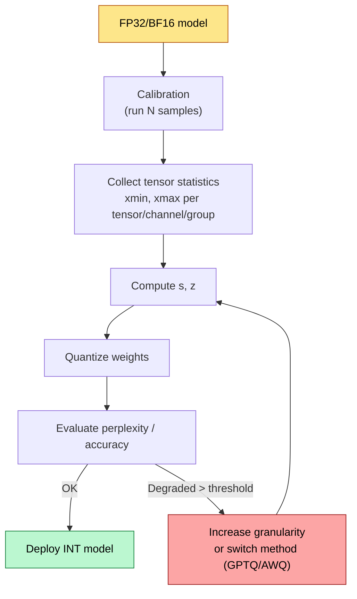
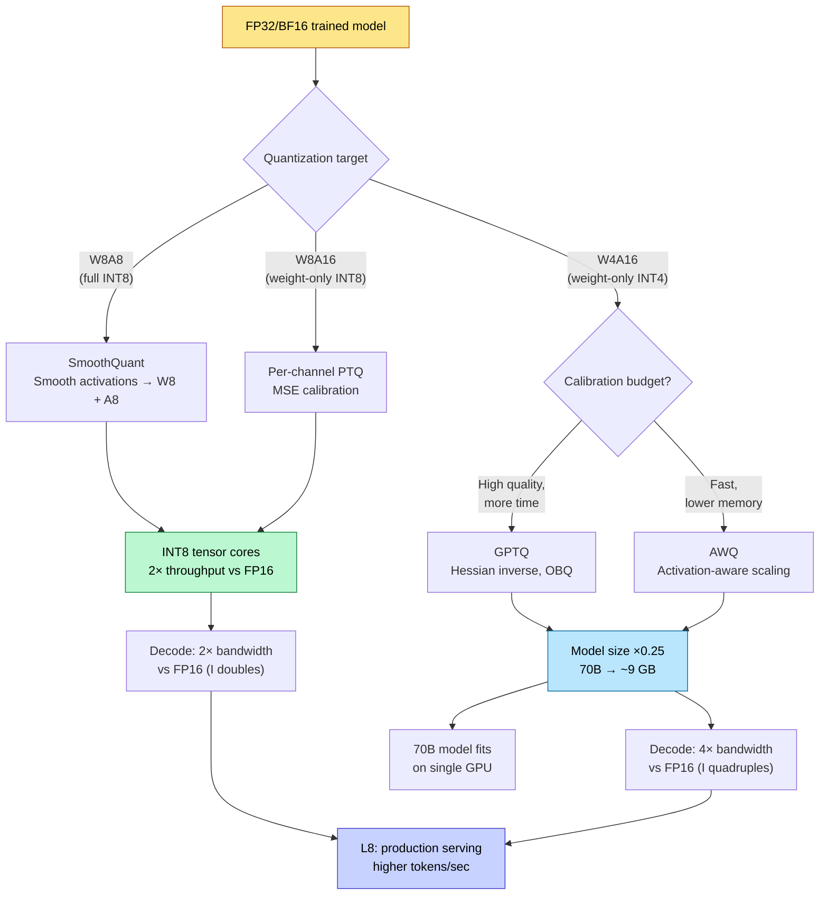

# Quantization — From FP32 to INT4: Theory and Practice

> **Layer:** L6.
> **Prerequisites:** [FP_Unit_Design](../L2_Digital_Design_for_AI/FP_Unit_Design.md), [Transformer_Internals](Transformer_Internals.md).
> **Hands off to:** [Modern_Quantization_Frontier](Modern_Quantization_Frontier.md), [Production_Architecture](../L8_Inference_and_Serving/Production_Architecture.md).

---

## 0. Why this page exists

Every TFLOPS number on a GPU spec sheet assumes operands in the narrowest supported precision. A B200 tensor core delivers 4 500 TFLOPS at FP8 but only 2 250 at BF16 — exactly 2× because the multiplier area halves (see [FP_Unit_Design](../L2_Digital_Design_for_AI/FP_Unit_Design.md)). Yet models are trained and stored in FP32 or BF16. The gap between "what the hardware wants" and "what the model lives in" is bridged by **quantization**: the disciplined mapping of continuous floating-point tensors to discrete, low-bit integer representations.

This page derives the full theory — from the affine quantization equation to Hessian-based optimal rounding — and surveys the four production-grade methods that dominate 2024–2026 deployment: vanilla PTQ, GPTQ, AWQ, and SmoothQuant. Every subsequent page in L6 (Modern_Quantization_Frontier) and L8 (serving systems) assumes this material.

---

## 1. Uniform affine quantization

### 1.1 The quantization equation

Given a real-valued tensor element $x \in [x_{\min},\, x_{\max}]$, uniform affine quantization maps $x$ to an integer $x_q \in [0,\, 2^b - 1]$ for unsigned $b$-bit representation:

$$
x_q \;=\; \mathrm{clamp}\!\Big(\Big\lfloor \frac{x}{s} \Big\rceil + z,\;\; 0,\;\; 2^b - 1\Big)
$$

where the **scale** $s$ and **zero point** $z$ are:

$$
s \;=\; \frac{x_{\max} - x_{\min}}{2^b - 1}, \qquad z \;=\; \mathrm{round}\!\Big(-\,\frac{x_{\min}}{s}\Big)
$$

Dequantization reconstructs an approximation:

$$
\hat{x} \;=\; s \cdot (x_q - z)
$$

The reconstruction error $\hat{x} - x$ has two sources: **rounding** (from $\lfloor \cdot \rceil$) and **clipping** (from the clamp when $x$ falls outside the representable range). The entire art of quantization is choosing $s$, $z$, and the bit-width $b$ to minimize downstream task degradation — not merely the per-element error.

### 1.2 Signed quantization (symmetric)

When the tensor is roughly symmetric around zero (as most weight matrices are after training), we can force $z = 0$ and map to $[-2^{b-1},\, 2^{b-1} - 1]$:

$$
x_q \;=\; \mathrm{clamp}\!\Big(\Big\lfloor \frac{x}{s} \Big\rceil,\;\; -2^{b-1},\;\; 2^{b-1} - 1\Big), \qquad s \;=\; \frac{\max(|x_{\min}|,\, |x_{\max}|)}{2^{b-1} - 1}
$$

Dequantization simplifies to $\hat{x} = s \cdot x_q$. This eliminates one integer addition per element at inference — significant when the operation runs billions of times per token.

**When to use symmetric vs. asymmetric:**

| Condition | Recommendation | Rationale |
|---|---|---|
| Weights (post-training) | Symmetric | Near-zero centered; saves the $z$ offset |
| Activations (ReLU output) | Asymmetric | Strictly non-negative; $z \neq 0$ recovers dynamic range |
| Activations (SiLU / GELU) | Asymmetric | Slightly negative tail |
| Residual-stream values | Asymmetric | Unbounded, can be strongly skewed |

---

## 2. Granularity: per-tensor, per-channel, per-group

The scale $s$ can be shared at different granularities. Finer granularity gives more scale factors — better fidelity at the cost of metadata storage.

### 2.1 Per-tensor

One $(s, z)$ pair for the entire tensor. Metadata: 2 scalars. For a $d_{\mathrm{out}} \times d_{\mathrm{in}}$ weight matrix, the scale must accommodate the largest-magnitude element — often an outlier in a single channel. All other channels are quantized with sub-optimal dynamic range.

**Effective quantization noise per channel $c$:**

$$
\sigma_{q,c}^2 \;=\; \frac{s^2}{12} \;=\; \frac{1}{12}\Big(\frac{x_{\max} - x_{\min}}{2^b - 1}\Big)^2
$$

If channel $c$ spans $[-0.1, 0.1]$ but the global scale accommodates $[-3.0, 3.0]$, the signal-to-quantization-noise ratio (SQNR) for that channel is $30\times$ worse than for the max-magnitude channel.

### 2.2 Per-channel (per-row or per-column)

One $(s_c, z_c)$ per output channel (row of the weight matrix). For a $4096 \times 4096$ weight matrix at INT8: $2 \times 4096 = 8\,192$ scale parameters — negligible overhead ($0.05\%$). This is the default for weight quantization in every production framework (TensorRT, ONNX Runtime, vLLM).

### 2.3 Per-group

One $(s_g, z_g)$ per contiguous group of $G$ elements along the input dimension. Used by GPTQ and AWQ for INT4. For $G = 128$ on a $4096 \times 4096$ matrix: $2 \times 4096 \times (4096/128) = 262\,144$ scale parameters — still only $1.6\%$ overhead at INT4.

**Quantization-error bound as a function of granularity:**

$$
\mathbb{E}\big[\|\hat{W} - W\|_F^2\big] \;=\; \sum_{g=1}^{G} \frac{s_g^2 \cdot n_g}{12}
$$

where $n_g$ is the number of elements in group $g$. Finer groups reduce each $s_g$, and because $s_g \propto \mathrm{range}_g$, the sum of squared errors drops roughly as $\sigma_{\mathrm{range}}^2 / G$ for a tensor whose per-element range varies across groups.

| Granularity | Scales for $4096 \times 4096$ INT4 | Overhead | Typical quality |
|---|---|---|---|
| Per-tensor | 2 | $< 0.01\%$ | Poor (outlier-dominated) |
| Per-channel | $2 \times 4096$ | $0.05\%$ | Good for INT8 |
| Per-group ($G$=128) | $2 \times 4096 \times 32$ | $1.6\%$ | Best for INT4 |

---

## 3. INT8 and INT4 quantization

### 3.1 INT8

At $b = 8$, the representable range for symmetric quantization is $[-128, 127]$. The quantization step size for a tensor spanning $[-\alpha, \alpha]$:

$$
s \;=\; \frac{2\alpha}{255} \approx 0.0078\,\alpha
$$

**Per-element maximum error** is $s/2 \approx 0.0039\,\alpha$. For a typical weight magnitude $\alpha \approx 1.0$: max error $\approx 0.004$, which is below the noise floor of most trained networks. This is why INT8 PTQ is nearly lossless for weights.

**Arithmetic:** INT8 matmul uses integer multiply-accumulate, accumulating in INT32:

$$
y_j \;=\; \sum_{i} x_{q,i}\, w_{q,ij}
$$

The INT32 accumulator must then be rescaled:

$$
\hat{y}_j \;=\; s_x \cdot s_w \cdot (y_j - n \cdot z_w \cdot \bar{x}_q - n \cdot z_x \cdot \bar{w}_q + n \cdot z_x \cdot z_w)
$$

In symmetric mode ($z_x = z_w = 0$) this collapses to $\hat{y} = s_x s_w \cdot y$ — one floating-point multiply per output element.

### 3.2 INT4

At $b = 4$, the symmetric range is $[-8, 7]$ with step size $s = 2\alpha / 15 \approx 0.133\,\alpha$. Per-element maximum error $\approx 0.067\,\alpha$ — 17× worse than INT8 for the same $\alpha$. This is large enough to cause measurable accuracy loss on most models, which is why INT4 always requires:

1. **Per-group granularity** ($G = 32$ to $128$).
2. **Calibration-aware rounding** (not naive round-to-nearest).
3. **Protection for outlier channels** (AWQ) or activation-aware rescaling (SmoothQuant).

The storage advantage is decisive: a 70 B parameter model occupies 35 GB in FP16, 17.5 GB in INT8, and **8.75 GB in INT4** (plus ~0.5 GB in scale metadata). This is the difference between "requires 2×H100" and "fits on a single GPU."

---

## 4. Post-training quantization (PTQ)

PTQ quantizes a *fully trained* model without retraining. The pipeline:



### 4.1 Static vs. dynamic quantization

| Aspect | Static PTQ | Dynamic PTQ |
|---|---|---|
| When scales are computed | Offline, using calibration data | At runtime, per activation tensor |
| Weight quantization | Always offline | Always offline |
| Activation quantization | Offline (requires calibration) | Online (per-batch min/max) |
| Inference overhead | None | Small ($O(n)$ min/max scan per tensor) |
| Accuracy | Calibration-dependent | Usually better (exact per-batch scales) |
| Use case | Latency-critical serving | Flexibility, heterogeneous inputs |

### 4.2 Calibration methods

The scale $s$ depends on $[x_{\min}, x_{\max}]$, and these depend on the calibration data. Three standard methods:

**Min-Max.** $x_{\min} = \min(\mathbf{x})$, $x_{\max} = \max(\mathbf{x})$. Uses the full dynamic range. Optimal for uniform distributions but extremely sensitive to outliers — a single outlier element inflates $s$ and wastes quantization levels.

**Percentile.** Use the $p$-th and $(100 - p)$-th percentile instead of the extremes. Typical $p = 99.9\%$ or $99.99\%$. Clips the worst outliers at the cost of guaranteed clipping error on them.

**MSE-optimal.** Choose $\alpha$ (the clipping threshold in symmetric mode) to minimize:

$$
\alpha^* \;=\; \arg\min_{\alpha} \;\mathbb{E}_{x \sim \mathcal{D}} \big[\,(\hat{x}(x;\alpha) - x)^2\,\big]
$$

Solved by grid search or gradient descent over $\alpha$. Typically yields $\alpha^*$ at the 99.5%–99.99% percentile, automatically pruning outliers. This is the default in TorchQuant, AutoRound, and most modern PTQ pipelines.

---

## 5. Quantization error analysis

### 5.1 Rounding error

For uniform quantization with step size $s$, the rounding error for a single element is $\epsilon_r = \hat{x} - x$, bounded by $|\epsilon_r| \leq s/2$. Assuming $\epsilon_r$ is uniformly distributed on $[-s/2, s/2]$:

$$
\mathbb{E}[\epsilon_r^2] \;=\; \frac{s^2}{12}
$$

This is the well-known result that the variance of rounding noise for a uniform quantizer is $s^2/12$, which equals $\Delta^2/12$ where $\Delta = s$ is the quantization step.

### 5.2 Clipping error

When $|x| > \alpha$ (the clipping threshold), the error is:

$$
\epsilon_c \;=\; \hat{x} - x \;=\; \mathrm{sign}(x)\,\alpha - x
$$

For a Gaussian-distributed tensor $x \sim \mathcal{N}(0, \sigma^2)$:

$$
\mathbb{E}[\epsilon_c^2] \;=\; 2\!\int_\alpha^{\infty} (x - \alpha)^2 \, \frac{1}{\sqrt{2\pi}\,\sigma}\, e^{-x^2/(2\sigma^2)}\, dx
$$

Let $\lambda = \alpha / \sigma$. Using the Gaussian tail integral:

$$
\mathbb{E}[\epsilon_c^2] \;=\; \sigma^2 \big[\,(1 + \lambda^2)\,(1 - \Phi(\lambda)) - \lambda\,\phi(\lambda)\,\big]
$$

where $\Phi(\lambda)$ is the standard-normal CDF and $\phi(\lambda)$ is the PDF.

### 5.3 Total MSE and SQNR

Total quantization MSE is the sum of rounding and clipping contributions:

$$
\mathrm{MSE}_{\mathrm{total}} \;=\; \underbrace{\frac{s^2}{12}\,\Phi(\lambda)}_{\text{rounding}} \;+\; \underbrace{\mathbb{E}[\epsilon_c^2]}_{\text{clipping}}
$$

The **Signal-to-Quantization-Noise Ratio** (SQNR) in dB:

$$
\mathrm{SQNR} \;=\; 10\,\log_{10}\!\frac{\sigma^2}{\mathrm{MSE}_{\mathrm{total}}}
$$

For large $b$ (small $s$, negligible clipping), this simplifies to:

$$
\mathrm{SQNR} \;\approx\; 6.02\,b + 10\,\log_{10}(3) \;\approx\; 6.02\,b + 4.77 \;\text{dB}
$$

This is the classic "6 dB per bit" rule. Worked values:

| $b$ | SQNR (theory, dB) | Notes |
|---|---|---|
| 2 | 16.8 | Barely usable for weights |
| 4 | 28.9 | INT4 with careful calibration |
| 8 | 52.9 | INT8 is nearly lossless |
| 16 | 101.0 | FP16 rounding noise negligible |

### 5.4 Layer-wise error propagation in transformers

For a transformer with $L$ layers, the output perturbation $\delta \mathbf{y}$ due to quantization errors $\{\delta W_\ell\}$ can be bounded. For a single linear layer $y = Wx$:

$$
\|\delta y\| \;\leq\; \|\delta W\| \cdot \|x\| \;+\; \|W\| \cdot \|\delta x\| \;+\; \|\delta W\| \cdot \|\delta x\|
$$

The cross-term $\|\delta W\| \cdot \|\delta x\|$ is second-order and usually dropped. Propagating through $L$ identical layers:

$$
\|\delta y_L\| \;\lesssim\; L \cdot \|\delta W\| \cdot \|x_0\| \cdot \prod_{\ell=1}^{L} \|W_\ell\|
$$

In practice, residual connections and layer normalization bound the intermediate activations, so the growth is closer to $O(\sqrt{L})$ than $O(L)$. But the key engineering insight remains: **earlier layers' quantization errors propagate through all subsequent layers**, which is why GPTQ and AWQ optimize the *output-layer reconstruction error* rather than per-layer weight fidelity.

---

## 6. GPTQ — Hessian-aware post-training quantization

### 6.1 Problem formulation

GPTQ (Frantar et al., 2023) frames weight quantization as a **layer-wise optimization** problem. For a single linear layer with weight $W \in \mathbb{R}^{n \times d}$ and calibration activations $X \in \mathbb{R}^{d \times m}$:

$$
\hat{W}^* \;=\; \arg\min_{\hat{W}} \;\big\|WX - \hat{W}X\big\|_2^2
$$

The objective $\|WX - \hat{W}X\|_F^2 = \mathrm{tr}\!\big((W - \hat{W})\,XX^\top\,(W - \hat{W})^\top\big)$ reveals that the **Hessian** of the layer-wise loss is $H = 2\,XX^\top \in \mathbb{R}^{d \times d}$. This is the Fisher information matrix under a Gaussian model.

### 6.2 Optimal brain quantization (OBQ)

The OBQ algorithm (which GPTQ accelerates) quantizes weights one at a time, greedily:

1. Pick the weight $w_q$ whose quantization incurs the least increase in $\|WX - \hat{W}X\|_F^2$.
2. Quantize $w_q \to \hat{w}_q$.
3. Adjust all remaining unquantized weights to compensate:

$$
w_j \;\leftarrow\; w_j - \frac{w_q - \hat{w}_q}{[H^{-1}]_{qq}} \cdot [H^{-1}]_{qj}
$$

This is the Optimal Brain Surgeon update. Per-step cost: $O(d^2)$ for the row of $H^{-1}$.

### 6.3 GPTQ's $O(d)$-per-column trick

OBQ is $O(d^3)$ total (quantize $d$ columns, each costs $O(d^2)$). GPTQ observes that:

1. Processing columns in **arbitrary order** (e.g., row 0, row 1, ...) rather than greedily, loses negligible quality.
2. Processing a batch of $B = 128$ columns simultaneously allows a single Cholesky decomposition of $H^{-1}$.

Algorithm (simplified):

```
Input: W (n × d), H_inv = Cholesky(2 * X * X^T)^(-1), group_size G
For each block of G columns:
    Quantize the block: w_q = quantize(W[:, block])
    Compute error: δ = (W[:, block] - w_q) / diag(H_inv)[block]
    Update remaining columns: W[:, remaining] -= δ @ H_inv[block, remaining]^T
```

Complexity: $O(d^2 \cdot n / G)$ — linear in $d$ per column, with the Cholesky as a one-time $O(d^3)$ cost amortized over all rows $n$.

### 6.4 Group size and the act-order heuristic

GPTQ supports per-group quantization with group size $G \in \{32, 64, 128, -1\}$, where $G = -1$ means per-column. The **act-order** heuristic sorts columns by the diagonal of $H^{-1}$ (descending), so the "hardest" columns are quantized first and benefit from the most correction budget. This typically saves 0.1–0.3 perplexity points.

### 6.5 Typical GPTQ results

| Model | Precision | GPTQ ($G$=128) perplexity (Wiki2) | FP16 perplexity | Delta |
|---|---|---|---|---|
| LLaMA-2 7B | INT4 | 5.63 | 5.47 | +0.16 |
| LLaMA-2 13B | INT4 | 5.07 | 4.88 | +0.19 |
| LLaMA-2 70B | INT4 | 3.63 | 3.32 | +0.31 |
| LLaMA-2 7B | INT3 | 6.55 | 5.47 | +1.08 |

INT4 GPTQ at $G=128$ typically adds $< 0.5$ perplexity point for 7–70 B models. INT3 is borderline; INT2 requires specialized methods (QuIP, AQLM) not covered here.

---

## 7. AWQ — Activation-aware weight quantization

### 7.1 The key insight

AWQ (Activation-Aware Weight Quantization, Lin et al., 2024) observes that **not all weight channels matter equally**. A weight channel's importance is proportional to the magnitude of the corresponding activation:

$$
\text{importance}(j) \;\propto\; \|X_j\|
$$

where $X_j$ is the $j$-th row of the calibration activation matrix (i.e., the activations that multiply weight column $j$). Channels with large activations are "sensitive" — quantization error in those weights is amplified by the large activation magnitude.

### 7.2 Per-channel scaling

AWQ applies a per-channel scaling factor $\alpha_j$ to weight column $j$ *before* quantization, then divides the scale into the activation:

$$
\hat{W}_{:j} \;=\; \mathrm{quant}\!\big(\alpha_j \cdot W_{:j}\big), \qquad X_j \;\leftarrow\; X_j / \alpha_j
$$

Mathematically, this is an identity ($(\alpha_j W_{:j}) \cdot (X_j / \alpha_j) = W_{:j} X_j$). But the quantization error changes:

$$
\|\delta(\alpha_j W_{:j})\| \cdot \|X_j / \alpha_j\| \;=\; \|\delta W_{:j}\| \cdot \|X_j\| \cdot \underbrace{\frac{\|\delta(\alpha_j W_{:j})\|}{\alpha_j \|\delta W_{:j}\|}}_{\text{scaling's effect on rounding error}}
$$

For uniform quantization, $\|\delta(\alpha_j W_{:j})\| \approx \alpha_j \|\delta W_{:j}\|$ when the scale factor aligns with the quantization grid. But for channels where $|W_{:j}|$ is small (outlier-weight channels), scaling $\alpha_j > 1$ *enlarges* the values into a regime where the quantization step size $s$ is relatively finer.

### 7.3 Efficient search

AWQ searches $\alpha_j$ for each channel by evaluating the quantized-layer output error over a grid:

$$
\alpha_j^* \;=\; \arg\min_{\alpha \in \{2^0, 2^1, \ldots, 2^{k}\}} \;\big\|(W X)_{:j} - \mathrm{quant}(\alpha \cdot W_{:j}) \cdot (X_j / \alpha)\big\|^2
$$

The grid has only $k \approx 5$ to $7$ points; the search cost is negligible. In practice, only $0.1\%$–$1\%$ of channels need $\alpha_j \neq 1$.

### 7.4 AWQ vs. GPTQ

| Aspect | GPTQ | AWQ |
|---|---|---|
| Optimization target | Minimize $\|WX - \hat{W}X\|_F^2$ | Minimize per-channel output error |
| Computation | Hessian inverse, Cholesky | Grid search over scale factors |
| Calibration time | ~2–4× slower | ~2× faster than GPTQ |
| Quantization quality (INT4) | ~0.2 perplexity worse than FP16 | ~0.2 perplexity worse than FP16 |
| Outlier handling | Implicit via Hessian weighting | Explicit via activation-aware scaling |
| Hardware requirement | GPU with sufficient memory for $H^{-1}$ | GPU with normal calibration memory |
| Typical use | vLLM, TensorRT-LLM backend | vLLM, HuggingFace Transformers backend |

Both methods produce nearly equivalent perplexity. AWQ is preferred when calibration speed or memory is constrained; GPTQ when maximum quality per bit is needed.

---

## 8. SmoothQuant — migrating quantization difficulty

### 8.1 The activation-quantization problem

Weight quantization is relatively easy (weights are static, known at calibration time). Activation quantization is hard because:

1. **Outliers are extreme.** A single activation channel can be $100\times$ larger than the median, inflating $s$ and wasting bits.
2. **Dynamic range varies per token.** A calibration set may not cover the full distribution.
3. **Per-token quantization** is expensive (latency) or impossible (streaming).

SmoothQuant (Xiao et al., 2023) addresses this by **redistributing quantization difficulty from activations to weights**.

### 8.2 The math: per-channel smoothing

For a linear layer $Y = XW$ where $X$ has outlier channels, define a per-channel smoothing factor:

$$
s_j \;=\; \frac{\max(|X_{:j}|)^\beta}{\max(|W_{j:}|)^{1-\beta}}
$$

where $\beta \in [0, 1]$ controls the migration strength. Then rewrite:

$$
Y \;=\; \underbrace{(X \cdot \mathrm{diag}(s)^{-1})}_{\tilde{X}} \;\;\underbrace{(\mathrm{diag}(s) \cdot W)}_{\tilde{W}}
$$

- $\tilde{X}$ has reduced outlier magnitudes (divided by $s_j > 1$ for outlier channels).
- $\tilde{W}$ has slightly increased magnitudes in the corresponding rows.

Since weight quantization is robust (per-channel scales), the slight increase in $|\tilde{W}|$ is easily absorbed. The dramatic decrease in $|\tilde{X}|$ outlier magnitude makes activation quantization tractable at INT8.

### 8.3 Choosing $\beta$

$$
\beta = 0.5 \quad\text{(default: equal migration)}
$$

For models with very large activation outliers (OPT-175B, some LLaMA variants), $\beta = 0.85$ (heavier migration to weights) is used. The optimal $\beta$ is found by a one-line sweep over the calibration set.

### 8.4 SmoothQuant enables W8A8

Without SmoothQuant, INT8 activation quantization on models like OPT-175B degrades perplexity by $> 2$ points. With SmoothQuant at $\beta = 0.5$:

| Model | W8A8 (naive) perplexity | W8A8 (SmoothQuant) perplexity | FP16 perplexity |
|---|---|---|---|
| OPT-125M | 8.14 | 7.28 | 7.24 |
| OPT-6.7B | 12.23 | 10.33 | 10.27 |
| OPT-175B | 15.77 | 9.42 | 9.36 |

SmoothQuant makes W8A8 (weight INT8, activation INT8) practical for large models, enabling full-INT8 inference with integer-only tensor-core utilization.

---

## 9. Comparison of quantization methods

| Method | Year | Bits | Granularity | Calibration | Key idea | Best for |
|---|---|---|---|---|---|---|
| Naive PTQ (min-max) | 2018+ | 8 | Per-tensor | Min-max | Simplest possible | Non-critical INT8 |
| Naive PTQ (MSE) | 2019+ | 8 | Per-channel | MSE grid search | Better scales | General INT8 |
| GPTQ | 2022 | 3–4 | Per-group ($G$=32–128) | Hessian (OBQ) | Optimal rounding via inverse Hessian | High-quality INT4 |
| AWQ | 2023 | 4 | Per-group ($G$=128) | Activation-aware scaling | Protect important channels | Fast INT4 calibration |
| SmoothQuant | 2023 | 8 (W+A) | Per-channel | Smoothing factor $\beta$ | Migrate difficulty to weights | W8A8 full-INT8 |
| AQLM | 2024 | 2–4 | Per-group + codebook | Joint codebook learning | Learned quantization codes | Extreme compression |
| QuIP / QuIP# | 2024 | 2–4 | Per-group | Incoherence processing | Randomized Hadamard + lattice | Theoretical optimality |
| HQQ | 2024 | 2–4 | Per-group | No calibration needed | Data-free, half-quadratic | Zero-data scenarios |

The practical deployment stack in 2026: **SmoothQuant for W8A8** (when hardware supports INT8 matmul natively), **AWQ or GPTQ for INT4 weight-only** (when memory is the bottleneck, as in LLM decode).

---

## 10. End-to-end cause and effect



---

## 11. Numbers to memorize

| # | Quantity | Value | Context |
|---|---|---|---|
| 1 | SQNR per bit (uniform quantization) | $\approx 6.02$ dB | The "6 dB/bit" rule |
| 2 | INT8 SQNR (Gaussian input) | $\approx 49.9$ dB | 8-bit SQNR = $6.02 \times 8 - 1.53$ (load-sharing correction) |
| 3 | INT4 SQNR | $\approx 25.9$ dB | 17 dB worse than INT8 |
| 4 | Rounding error variance | $s^2 / 12$ | Uniform quantizer, step $s$ |
| 5 | INT4 step size ($\alpha = 1$) | $2/15 \approx 0.133$ | For symmetric INT4 |
| 6 | INT8 step size ($\alpha = 1$) | $2/255 \approx 0.0078$ | For symmetric INT8 |
| 7 | 70B model FP16 size | 140 GB | 2 bytes × 70B parameters |
| 8 | 70B model INT8 size | 70 GB | 1 byte × 70B |
| 9 | 70B model INT4 size | 35 GB (+ ~0.5 GB scales) | 0.5 bytes × 70B + metadata |
| 10 | GPTQ calibration time (70B) | 1–4 hours on 1× A100 | 128 calibration samples |
| 11 | AWQ calibration time (70B) | 20–60 min on 1× A100 | Faster than GPTQ |
| 12 | GPTQ INT4 perplexity delta (70B) | +0.2–0.5 on Wiki2 | Vs. FP16 baseline |
| 13 | SmoothQuant default $\beta$ | 0.5 | Equal weight/activation migration |
| 14 | Per-group metadata overhead ($G$=128, INT4) | ~1.5% | 2 scales per 128 elements |
| 15 | Decode arithmetic intensity FP16 | 1.0 FLOP/B | $I = 2/\text{bytes}$ |
| 16 | Decode arithmetic intensity INT4 | 4.0 FLOP/B | 4× FP16 |
| 17 | INT4 weight-only effective tokens/sec gain | ~3–4× (memory-bound) | Bandwidth-limited throughput |
| 18 | Outlier channel fraction in LLMs | ~0.1% of channels | These channels dominate error |
| 19 | GPTQ group size (default) | 128 | Best quality-speed tradeoff |
| 20 | AWQ scale search grid size | $2^0$ to $2^6$ (7 values) | Per-channel, very fast |
| 21 | MSE calibration optimal percentile | 99.5%–99.99% | Clips worst outliers |
| 22 | Per-tensor vs per-channel quality gap (INT4) | 1–3 perplexity points | Per-channel is essential for INT4 |

---

## 12. Worked problems

**Q1.** *Compute the SQNR for symmetric INT8 quantization of a weight tensor drawn from $\mathcal{N}(0, 1)$. Use the optimal clipping threshold.*

For symmetric quantization with clipping threshold $\alpha$ and $b = 8$ bits:

$$
s = \frac{2\alpha}{255}
$$

Total MSE = rounding MSE + clipping MSE. For optimal $\alpha$ of a standard Gaussian, the known solution is $\alpha \approx 2.97\sigma = 2.97$ (from solving $d(\mathrm{MSE})/d\alpha = 0$ numerically).

Rounding MSE: $s^2/12 = (2 \times 2.97 / 255)^2 / 12 = 1.505 \times 10^{-5}$.

Clipping MSE: using the formula from Section 5.2 with $\lambda = 2.97$, $\Phi(2.97) \approx 0.9985$, $\phi(2.97) \approx 0.0048$:

$$
\mathbb{E}[\epsilon_c^2] \approx 1^2 \cdot [(1 + 8.82)(0.0015) - 2.97 \cdot 0.0048] \approx 1.43 \times 10^{-4}
$$

Total MSE $\approx 1.58 \times 10^{-4}$.

$$
\mathrm{SQNR} = 10\,\log_{10}(1 / 1.58 \times 10^{-4}) \approx 38.0\;\text{dB}
$$

The "6.02 × 8 = 48.2 dB" theoretical ceiling is not reached because of clipping loss. In practice, for weight tensors that are not perfectly Gaussian, SQNR ranges from 38 to 48 dB depending on distribution.

---

**Q2.** *A 70B-parameter model has FP16 weights occupying 140 GB. The target deployment platform is a single H100 (80 GB HBM). Determine the minimum quantization scheme that fits the model, and compute the resulting decode tokens/sec assuming memory-bound operation.*

Weight memory requirement:

- INT8: 70 GB. Fits in 80 GB HBM (with ~10 GB for KV cache and activations). **Feasible.**
- INT4: 35 GB + ~0.5 GB scales = 35.5 GB. Fits easily, with 44.5 GB free.

Minimum scheme: **INT4 weight-only quantization** (W4A16) using GPTQ or AWQ.

Decode tokens/sec on H100 ($\beta_{\text{HBM}} = 3.35$ TB/s):

$$
\text{tok/s} = \frac{\beta}{N_{\text{bytes}}} = \frac{3.35 \times 10^{12}}{35.5 \times 10^9} \approx 94.4\;\text{tok/s}
$$

Compared to FP16 (which does not fit on one H100; would need TP=2): the FP16 tokens/s on a hypothetical system with enough HBM would be $3.35 \times 10^{12} / 140 \times 10^9 \approx 23.9$ tok/s. INT4 gives $94.4 / 23.9 \approx 4\times$ speedup — consistent with the $4\times$ arithmetic-intensity improvement.

---

**Q3.** *Derive the smoothing factor $s_j$ for SmoothQuant applied to a layer where activation channel $j$ has $\max(|X_{:j}|) = 50$ and the corresponding weight row has $\max(|W_{j:}|) = 0.5$. Use $\beta = 0.5$.*

$$
s_j = \frac{\max(|X_{:j}|)^\beta}{\max(|W_{j:}|)^{1-\beta}} = \frac{50^{0.5}}{0.5^{0.5}} = \frac{\sqrt{50}}{\sqrt{0.5}} = \frac{7.07}{0.707} = 10.0
$$

After smoothing:

- Activation channel $j$: $\tilde{X}_{:j} = X_{:j} / 10$. Max magnitude drops from 50 to 5.
- Weight row $j$: $\tilde{W}_{j:} = 10 \cdot W_{j:}$. Max magnitude rises from 0.5 to 5.0.

The activation outlier is reduced by $10\times$ — a dramatic improvement for INT8 activation quantization. The weight row's increase from 0.5 to 5.0 is easily handled by per-channel weight quantization (the scale adjusts accordingly).

---

**Q4.** *A weight matrix $W \in \mathbb{R}^{4096 \times 4096}$ is quantized to INT4 with per-group granularity ($G = 128$). Compute: (a) the total number of scale parameters, (b) the storage overhead as a fraction of the quantized weight size, and (c) the total model weight memory if this is one of 32 identical layers.*

(a) Number of groups: $(4096 / 128) \times 4096 = 32 \times 4096 = 131\,072$ groups. Each group needs a scale and zero point (2 values, stored in FP16 = 4 bytes total). Total scale parameters: $131\,072 \times 4 = 524\,288$ bytes $\approx 0.5$ MB.

(b) Quantized weight size: $4096 \times 4096 \times 0.5 = 8\,388\,608$ bytes $= 8$ MB. Overhead: $0.5 / 8 = 6.25\%$.

(c) Per layer: $8 + 0.5 = 8.5$ MB. For 32 layers: $32 \times 8.5 = 272$ MB. Compare to FP16: $32 \times 4096 \times 4096 \times 2 = 1\,073\,741\,824$ bytes $= 1024$ MB. Compression ratio: $1024 / 272 = 3.76\times$ (slightly less than the theoretical $4\times$ due to scale metadata).

---

**Q5.** *You are calibrating INT8 quantization for a layer whose activation distribution has a single outlier channel with magnitude 100, while all other channels have magnitude $\leq 1$. Compare min-max vs. percentile ($p = 99.9\%$) vs. MSE calibration in terms of effective SQNR for the non-outlier channels.*

With $n = 4096$ channels and one outlier at magnitude 100:

**Min-max:** $\alpha = 100$. Step size $s = 200 / 255 = 0.784$. For a non-outlier channel with magnitude $\sim 1$: the signal is 1, the quantization noise is $s/\sqrt{12} = 0.226$. SQNR per non-outlier channel: $20\,\log_{10}(1 / 0.226) = 12.9$ dB — terrible.

**Percentile ($p = 99.9\%$):** With 4096 channels, the 99.9th percentile excludes the top 4 channels. If the outlier is among them, $\alpha \approx 1.0$. Step size $s = 2/255 = 0.0078$. SQNR for non-outlier: $20\,\log_{10}(1 / 0.0023) = 52.8$ dB — excellent. But the outlier channels are clipped with error $\approx 99$, causing potential quality loss on those channels.

**MSE-optimal:** The optimizer balances clipping error on the outlier against rounding precision everywhere else. For a distribution that is 99.98% bounded by 1 and 0.02% at 100, the optimal $\alpha$ will be in the range 2–5 (depending on the exact outlier density), yielding $s \approx 0.016$–$0.039$. SQNR for non-outlier channels: $20\,\log_{10}(1 / 0.005) \approx 46$ dB — a good compromise. The outlier is clipped but with moderate error.

This is precisely the motivation for SmoothQuant: instead of choosing between bad SQNR for most channels (min-max) or clipping the outlier (percentile), migrate the outlier to the weight side where per-channel quantization handles it naturally.

---

## 13. References

- Frantar, Ashkboos, et al., *GPTQ: Accurate Post-Training Quantization for Generative Pre-trained Transformers*, ICLR 2023.
- Lin, Ji, et al., *AWQ: Activation-aware Weight Quantization for LLM Compression and Acceleration*, MLSys 2024.
- Xiao, Guangxuan, et al., *SmoothQuant: Accurate and Efficient Post-Training Quantization for Large Language Models*, ICML 2023.
- Nagel, Markus, et al., *A White Paper on Neural Network Quantization*, arXiv:2106.08295, 2021 — comprehensive survey of PTQ fundamentals.
- Gholami, Amir, et al., *A Survey of Quantization Methods for Efficient Neural Network Inference*, arXiv:2103.13630, 2021.
- Egilmez, Hakan, *Quantization Error Analysis* lecture notes, Stanford EE392M, 2022 — SQNR derivation.

---

**Up the stack:** [Modern_Quantization_Frontier](Modern_Quantization_Frontier.md) — FP8, FP4, NVFP4, Transformer Engine, the sub-integer frontier.
**Down the stack:** [FP_Unit_Design](../L2_Digital_Design_for_AI/FP_Unit_Design.md) — why smaller multipliers yield 2× throughput; [Transformer_Internals](Transformer_Internals.md) — the model architecture being quantized.
