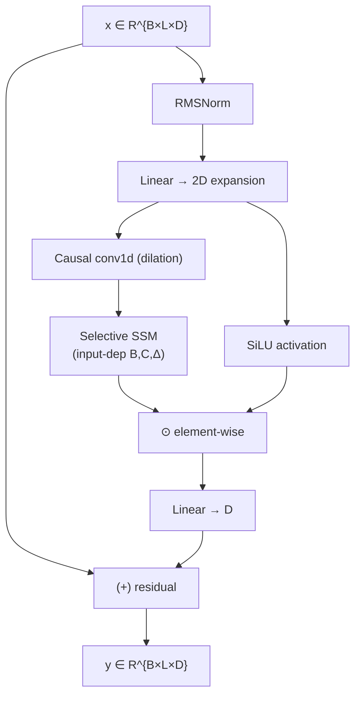
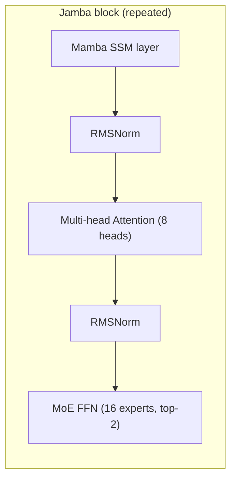
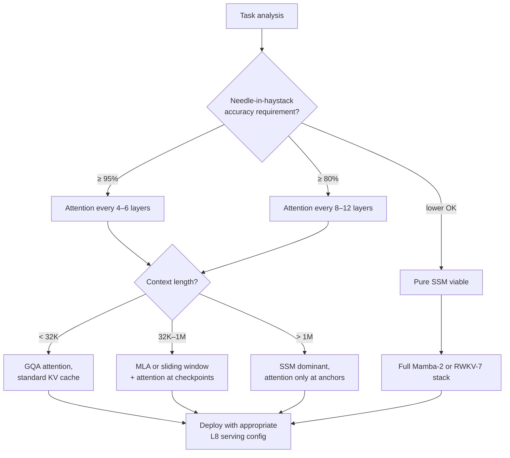
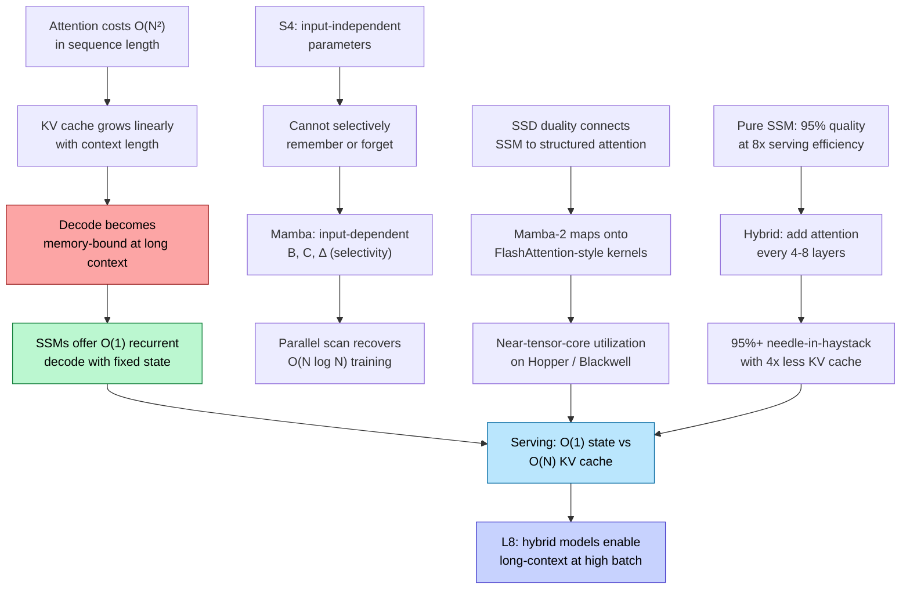

# State-Space Models and Hybrids — Beyond the Transformer

> **Layer:** L6.
> **Prerequisites:** [Transformer_Internals](Transformer_Internals.md), [Attention_Mechanisms](Attention_Mechanisms.md).
> **Hands off to:** [Frontier_Models_2025_2026](Frontier_Models_2025_2026.md), [Production_Architecture](../L8_Inference_and_Serving/Production_Architecture.md).

---

## 0. Why this page exists

Transformers face an asymptotic wall: self-attention costs $O(N^{2})$ in sequence length and $O(N)$ in KV-cache memory during decoding. For million-token contexts, attention becomes the dominant cost center — not the FFN, not the embedding, not the loss function. State-space models (SSMs) offer a fundamentally different complexity contract: $O(N)$ during training (parallel scan) and $O(1)$ per token during decoding (recurrent update), with no growing memory cache.

This page derives the continuous-time SSM, walks through discretization (ZOH), shows how Mamba makes parameters input-dependent, explains the structured state space duality in Mamba-2, surveys RWKV-7 as a parallel linear-attention lineage, and then asks the practical question: **why do hybrids win?** The answer connects directly to L8 serving economics — which layers are memory-bound, which are compute-bound, and how mixing SSM and attention layers lets you tune the roofline balance per model.

---

## 1. Continuous-time state-space models

### 1.1 The latent ODE

A state-space model maps a scalar (or vector) input signal $u(t) \in \mathbb{R}$ to an output $y(t) \in \mathbb{R}$ through a latent state $\mathbf{x}(t) \in \mathbb{R}^{N}$ governed by a first-order linear ODE:

$$
\begin{aligned}
\mathbf{x}'(t) &= \mathbf{A}\,\mathbf{x}(t) + \mathbf{B}\,u(t) \\
y(t) &= \mathbf{C}\,\mathbf{x}(t) + \mathbf{D}\,u(t)
\end{aligned}
$$

where $\mathbf{A} \in \mathbb{R}^{N \times N}$ is the state-transition matrix, $\mathbf{B} \in \mathbb{R}^{N \times 1}$ is the input projection, $\mathbf{C} \in \mathbb{R}^{1 \times N}$ is the output projection, and $\mathbf{D} \in \mathbb{R}$ is the feed-through (typically set to zero in deep-learning SSMs).

This is the same formulation that has driven control theory since Kalman (1960). The deep-learning contribution is: (a) learn $\mathbf{A}, \mathbf{B}, \mathbf{C}$ by gradient descent, (b) constrain $\mathbf{A}$ to structured forms that admit fast computation, and (c) make $\mathbf{B}, \mathbf{C}$ input-dependent so the system becomes selective.

### 1.2 Why structured $\mathbf{A}$ matters

A general $\mathbf{A}$ makes the recurrent update an $O(N^{2})$ matmul per step. The Structured State Space sequence model (S4, Gu et al. 2022) constrains $\mathbf{A}$ to be **diagonal plus low-rank (DPLR)** or, equivalently after diagonalization, **diagonal**. With diagonal $\mathbf{A}$, the state update collapses to element-wise operations:

$$
x_n(t + \Delta t) = \bar{a}_n\, x_n(t) + \bar{b}_n\, u(t)
$$

reducing the per-step cost from $O(N^{2})$ to $O(N)$. The question becomes: what structure on $\mathbf{A}$ is expressive enough to model long-range dependencies while remaining diagonalizable?

### 1.3 HiPPO initialization

The HiPPO framework (Gu et al. 2020) constructs $\mathbf{A}$ so that the state $\mathbf{x}(t)$ encodes a polynomial approximation of the input history $u(t')$ for $t' \le t$. The most important variant, HiPPO-LegS (Legendre scaling), produces:

$$
\mathbf{A}_{nk} = -\begin{cases}(2n+1)^{1/2}(2k+1)^{1/2} & \text{if } n > k \\ n + 1 & \text{if } n = k \\ 0 & \text{if } n < k\end{cases}
$$

This $\mathbf{A}$ is lower-triangular and can be diagonalized as $\mathbf{A} = \mathbf{V}\,\boldsymbol{\Lambda}\,\mathbf{V}^{*}$ where $\boldsymbol{\Lambda}$ is diagonal with eigenvalues having negative real parts — the system is stable and exponentially forgets old inputs at a controlled rate.

---

## 2. Discretization: from continuous to recurrent

### 2.1 Zero-order hold derivation

Digital hardware operates at discrete time steps. Given a step size $\Delta$ (learned or fixed), the ZOH discretization assumes the input $u(t)$ is piecewise constant: $u(t) = u_k$ for $t \in [k\Delta,\,(k+1)\Delta)$.

Integrate the state ODE over one step:

$$
\begin{aligned}
\mathbf{x}_{k+1} &= e^{\mathbf{A}\Delta}\,\mathbf{x}_k + \int_{0}^{\Delta} e^{\mathbf{A}(\Delta - \tau)}\,\mathbf{B}\,u_k\,d\tau \\
&= \bar{\mathbf{A}}\,\mathbf{x}_k + \bar{\mathbf{B}}\,u_k
\end{aligned}
$$

where the discretized matrices are:

$$
\bar{\mathbf{A}} = e^{\mathbf{A}\Delta}, \qquad \bar{\mathbf{B}} = \bigl(\mathbf{A}^{-1}(e^{\mathbf{A}\Delta} - \mathbf{I})\bigr)\,\mathbf{B}
$$

For diagonal $\mathbf{A} = \mathrm{diag}(a_1, \ldots, a_N)$, this simplifies to element-wise operations:

$$
\bar{a}_n = e^{a_n \Delta}, \qquad \bar{b}_n = \frac{e^{a_n \Delta} - 1}{a_n}\, b_n
$$

When $a_n \to 0$ (the limit case), $\bar{b}_n \to \Delta \cdot b_n$ by L'Hopital's rule.

### 2.2 The recurrent and convolutional views

**Recurrent mode** (decode, one token at a time):

$$
\begin{aligned}
\mathbf{x}_k &= \bar{\mathbf{A}}\,\mathbf{x}_{k-1} + \bar{\mathbf{B}}\,u_k \\
y_k &= \mathbf{C}\,\mathbf{x}_k
\end{aligned}
$$

Cost: $O(N)$ per token, $O(N)$ state memory. No growth with sequence length.

**Convolutional mode** (prefill / training, entire sequence at once):

Unrolling the recurrence:

$$
y_k = \mathbf{C}\,\bar{\mathbf{A}}^{k}\,\bar{\mathbf{B}}\,u_0 + \mathbf{C}\,\bar{\mathbf{A}}^{k-1}\,\bar{\mathbf{B}}\,u_1 + \cdots + \mathbf{C}\,\bar{\mathbf{B}}\,u_k
$$

This is a convolution $y = \bar{\mathbf{K}} * u$ where the SSM kernel is:

$$
\bar{\mathbf{K}}_k = \mathbf{C}\,\bar{\mathbf{A}}^{k}\,\bar{\mathbf{B}} \in \mathbb{R}
$$

Computable via FFT in $O(N + L \log L)$ for sequence length $L$ and state dimension $N$. This is the key insight: during training, use the convolutional mode (parallel on GPU); during inference, switch to the recurrent mode ($O(1)$ state).

---

## 3. Mamba: selective state-space models

### 3.1 The selectivity problem

S4's parameters $\bar{\mathbf{A}}, \bar{\mathbf{B}}, \mathbf{C}$ are **input-independent** — they are fixed after training. This means the SSM applies the same dynamics regardless of what it sees. Gu and Dao (Mamba, 2023) observed that this prevents the model from selectively remembering or forgetting: you cannot "gate" information the way a Transformer's attention scores gate token relevance.

Mamba's core contribution: make $\bar{\mathbf{B}}, \mathbf{C}$, and $\Delta$ **input-dependent**:

$$
\begin{aligned}
\bar{\mathbf{B}}_k &= \mathrm{Linear}_{B}(u_k) \in \mathbb{R}^{N} \\
\mathbf{C}_k &= \mathrm{Linear}_{C}(u_k) \in \mathbb{R}^{N} \\
\Delta_k &= \mathrm{softplus}(\mathrm{Linear}_{\Delta}(u_k)) \in \mathbb{R}^{1}
\end{aligned}
$$

(Here $u_k$ is the projected input to the SSM layer, typically after a linear projection from the hidden dimension.)

The discretized state matrix also becomes input-dependent via $\Delta_k$:

$$
\bar{\mathbf{A}}_k = \exp(\mathbf{A}\,\Delta_k)
$$

### 3.2 Why input dependence kills the convolution view

With input-dependent parameters, the convolution kernel $\bar{\mathbf{K}}$ is no longer a fixed filter — it changes at every position $k$. The FFT trick disappears. Mamba must compute the scan sequentially... unless it can be parallelized.

### 3.3 Hardware-aware parallel scan

Mamba recovers parallel training via a **parallel associative scan** (Blelloch, 1990). The recurrence:

$$
\mathbf{x}_k = \bar{\mathbf{A}}_k\,\mathbf{x}_{k-1} + \bar{\mathbf{B}}_k\,u_k
$$

is associative when viewed as a composition of affine transformations:

$$
(\mathbf{x}_k,\, u_k) = f_k \circ f_{k-1} \circ \cdots \circ f_0\;(\mathbf{x}_{-1},\, \cdot)
$$

where $f_k(\mathbf{x}) = \bar{\mathbf{A}}_k\,\mathbf{x} + \bar{\mathbf{B}}_k\,u_k$. Because composition of affine maps is associative, the scan can be computed in $O(\log L)$ sequential steps using $O(L)$ parallel work. On GPUs, this is implemented as a custom CUDA kernel (not a standard library call), optimized for:

- Minimizing HBM round-trips by keeping intermediate states in SRAM.
- Fusing the discretization step ($\exp(\mathbf{A}\Delta)$, $\bar{\mathbf{B}}$ computation) into the scan kernel.
- Avoiding materializing the full $L \times N$ state sequence in HBM.

### 3.4 The full Mamba block

A Mamba block replaces the Transformer's attention + FFN with a single integrated block:

Key details:
- The input is projected from $D$ to $2D$ (a "fat" projection). One half goes through the SSM path; the other half is gated via SiLU and element-wise multiplication — analogous to the SwiGLU gate in Transformer FFNs.
- A causal depthwise conv1d precedes the SSM, adding local positional context.
- $\mathbf{A}$ is initialized from HiPPO-LegS (diagonal mode), $\mathbf{B}, \mathbf{C}$ are zero-initialized projections, $\Delta$ is initialized from a log-uniform prior.

### 3.5 Parameter count and FLOPs

For a Mamba block with hidden dimension $D$, expanded dimension $E = 2D$, and state dimension $N$:

| Component | Parameters | FLOPs per token |
|---|---|---|
| Input projection ($D \to E$) | $D \cdot E$ | $2DE$ |
| Conv1d (kernel size $K$) | $E \cdot K$ | $EK$ |
| $\mathbf{B}$ projection ($E \to N$) | $EN$ | $2EN$ |
| $\mathbf{C}$ projection ($E \to N$) | $EN$ | $2EN$ |
| $\Delta$ projection ($E \to 1$) | $E$ | $2E$ |
| SSM recurrent update | — | $4N$ |
| Output projection ($E \to D$) | $ED$ | $2ED$ |
| Gate (SiLU + multiply) | — | $2E$ |

Total per-block parameters: $\approx 2D^{2} + 2EN + EK$. For $N = 16$ and $K = 4$, the dominant terms are $2D^{2}$ from the linear projections — the SSM-specific parameters ($\mathbf{A}, \mathbf{B}, \mathbf{C}$) add less than 1% overhead.

---

## 4. Mamba-2: structured state space duality

### 4.1 The connection to attention

Dao and Gu (Mamba-2, 2024) observed that the selective SSM's output:

$$
y_k = \mathbf{C}_k \sum_{j=0}^{k} \Bigl(\prod_{i=j+1}^{k} \bar{\mathbf{A}}_i\Bigr) \bar{\mathbf{B}}_j\, u_j
$$

can be rewritten as a **structured matrix multiplication**. Define the "state-space mask" matrix $\mathbf{M} \in \mathbb{R}^{L \times L}$ with entries:

$$
M_{kj} = \mathbf{C}_k \Bigl(\prod_{i=j+1}^{k} \bar{\mathbf{A}}_i\Bigr) \bar{\mathbf{B}}_j
$$

Then $\mathbf{y} = \mathbf{M}\,\mathbf{u}$. This is structurally identical to attention: $\mathbf{y} = \mathrm{softmax}(\mathbf{Q}\mathbf{K}^{T})\,\mathbf{V}$, except that $\mathbf{M}$ is lower-triangular (causal) and parameterized as a product of structured matrices rather than computed from query-key dot products.

### 4.2 The SSD algorithm

The Structured State Space Duality (SSD) algorithm exploits the fact that $\mathbf{M}$ has a **semiseparable** structure: any submatrix of $\mathbf{M}$ below the diagonal has rank at most $N$ (the state dimension). This allows a block decomposition:

1. **Diagonal blocks** — computed as standard attention (small context windows of size $C$).
2. **Off-diagonal blocks** — computed via a "chunk recurrence" that compresses inter-chunk state into an $N$-dimensional summary per chunk.

The overall algorithm runs in:

$$
O\!\bigl(N \cdot L \cdot C + N^{2} \cdot L / C\bigr)
$$

where $C$ is the chunk size (typically 64–128). Choosing $C = \sqrt{N}$ balances the two terms. For $N = 64$, $C = 128$, the cost is $O(64 \cdot L \cdot 128) \approx O(8192\,L)$ — comparable to attention with head dimension 128, but with no KV cache at inference.

### 4.3 Hardware efficiency

Mamba-2's SSD is designed to map onto the same GPU operations as FlashAttention:

| Step | Analog in FlashAttention | GPU operation |
|---|---|---|
| Chunk-level matmul | $\mathbf{Q}\mathbf{K}^{T}$ within block | Tensor-core GEMM |
| State propagation | Softmax normalization across blocks | Sequential scan in SRAM |
| Output computation | $\mathrm{softmax} \cdot \mathbf{V}$ | Tensor-core GEMM |

This means Mamba-2 achieves **near-FlashAttention utilization** on Hopper and Blackwell tensor cores — roughly 60–70% of peak FP8 — which was not true for Mamba-1's custom scan kernel.

### 4.4 Head structure

Mamba-2 introduces a "head" dimension $H$, analogous to multi-head attention. The state dimension per head is $N_h = N/H$. Each head independently computes:

$$
y_{k}^{(h)} = \mathbf{C}_{k}^{(h)}\,\mathbf{x}_{k}^{(h)}, \qquad \mathbf{x}_{k}^{(h)} \in \mathbb{R}^{N_h}
$$

Total state across all heads: $N = H \cdot N_h$. This allows the SSM to attend to different "features" in parallel, matching the expressiveness of multi-head attention.

---

## 5. RWKV-7: linear attention as recurrence

### 5.1 Linear attention recap

Standard attention computes $y = \mathrm{softmax}(\mathbf{Q}\mathbf{K}^{T}/\sqrt{d})\,\mathbf{V}$. If we remove the softmax:

$$
y_k = \frac{\sum_{j=1}^{k} (\mathbf{q}_k^{T}\,\mathbf{k}_j)\,\mathbf{v}_j}{\sum_{j=1}^{k} \mathbf{q}_k^{T}\,\mathbf{k}_j}
$$

The numerator accumulates $\mathbf{k}_j \mathbf{v}_j^{T}$ (an outer product) into a recurrent state $\mathbf{W}_k = \sum_{j \le k} \mathbf{k}_j \mathbf{v}_j^{T}$, and the output is $\mathbf{q}_k^{T}\,\mathbf{W}_k$. Cost: $O(d^{2})$ per step to maintain the $\mathbf{W}$ matrix, $O(1)$ with respect to sequence length.

### 5.2 RWKV-7 time-mixing

RWKV (Receptance Weighted Key Value) evolved through six major versions. RWKV-7 (Peng, 2025) introduces a **data-dependent linear attention** variant. The time-mixing block computes:

$$
\begin{aligned}
\mathbf{r}_k &= (\mathbf{W}_r\,\mu_r * \mathbf{x})_k \\
\mathbf{k}_k &= (\mathbf{W}_k\,\mu_k * \mathbf{x})_k \\
\mathbf{v}_k &= (\mathbf{W}_v\,\mu_v * \mathbf{x})_k
\end{aligned}
$$

where $\mu_*$ are learned causal convolution kernels blending current and past token embeddings. The recurrent state update:

$$
\mathbf{W}_k = \mathrm{diag}(\mathbf{w}_k) \odot \mathbf{W}_{k-1} + \mathbf{k}_k\,\mathbf{v}_k^{T}
$$

where $\mathbf{w}_k \in \mathbb{R}^{d}$ is a learned, input-dependent decay vector (analogous to $\bar{\mathbf{A}}$ in Mamba). The output:

$$
\mathbf{o}_k = \mathrm{sigmoid}(\mathbf{r}_k) \odot (\mathbf{W}_k\, \mathbf{g}_k)
$$

where $\mathbf{g}_k$ is a learned projection. The receptance gate $\mathrm{sigmoid}(\mathbf{r}_k)$ determines how much of the accumulated state to emit at position $k$.

### 5.3 Channel-mixing block

Complementing time-mixing (which captures cross-position interactions), the channel-mixing block operates within each position:

$$
\mathbf{o}_k^{\mathrm{ch}} = \mathrm{sigmoid}(\mathbf{W}_r'\,\mathbf{x}_{k-1}) \odot (\mathbf{W}_v'\,\mathrm{ReLU}^{2}(\mathbf{W}_k'\,\mathbf{x}_{k-1}))
$$

This is a position-wise FFN with a receptance gate — structurally similar to SwiGLU but using squared ReLU activation and a shifted input ($\mathbf{x}_{k-1}$ instead of $\mathbf{x}_k$).

### 5.4 RWKV-7 vs Mamba: philosophical comparison

| Aspect | Mamba / Mamba-2 | RWKV-7 |
|---|---|---|
| State space | $\mathbf{x} \in \mathbb{R}^{N}$ (vector) | $\mathbf{W} \in \mathbb{R}^{d \times d}$ (matrix) |
| State memory per layer | $N = 16$–$256$ scalars | $d^{2} = 4096^{2}$ scalars (chunked) |
| Decay mechanism | $\bar{\mathbf{A}} = \exp(\mathbf{A}\Delta)$ | $\mathrm{diag}(\mathbf{w}_k)$ per-token |
| Training parallelism | Parallel scan | Chunked parallel prefix sum |
| Expressive bottleneck | Low state dim limits recall | Quadratic state but chunked for tractability |

RWKV maintains a much larger recurrent state (the full $\mathbf{W}$ matrix), which gives it higher expressivity for recall tasks but requires careful chunking and memory management. Mamba's compact state makes it cheaper to serve but less capable at precise retrieval from long contexts.

---

## 6. Hybrid architectures: why mixing wins

### 6.1 The expressivity gap

Pure SSMs excel at tasks requiring long-range state tracking (copying, induction heads at distance) but struggle with tasks requiring precise retrieval from the distant past (needle-in-haystack, complex reasoning over many documents). The root cause: the compressed recurrent state (16–256 scalars in Mamba) is a bottleneck for exact recall.

Attention has no such bottleneck — the KV cache stores every past key-value pair — but pays $O(N)$ memory and $O(N)$ compute per decode step.

**Hybrids mix both**, using SSM layers for the bulk of sequence processing (cheap, parallelizable) and reserving attention layers for "checkpoint" positions where precise recall matters.

### 6.2 Jamba: Mamba + Attention + MoE

AI21's Jamba (Lieber et al., 2024) is a 52B-parameter model with the following layer stack repeated $\times N$:

Key numbers:
- 32 total blocks; attention placed every **4th** block (8 attention layers total).
- MoE with 16 experts, top-2 routing, 2 shared experts.
- 256K context length during training.

The placement ratio (3 SSM : 1 attention) is not arbitrary. Ablation studies show:
- **0 attention layers**: needle-in-haystack accuracy drops from 98% to 62%.
- **Every-other-layer attention**: performance matches all-attention Transformer but KV cache is only halved.
- **1-in-4 attention**: retains 95%+ needle-in-haystack accuracy while reducing KV cache by $\sim$4x.

### 6.3 Zamba

Zamba (Zyphra, 2024) takes a different approach: a shared-attention block that is **single** but applied with weight-sharing across positions, interleaved with Mamba layers. This reduces attention-related parameters (and KV cache) to a single shared block while maintaining competitive perplexity. The architecture:

- 12 interleaved Mamba-2 blocks.
- 1 shared attention block (weight-tied across positions).
- Total: 7B parameters, trained on 1T tokens.

The weight-sharing trick works because the attention block's purpose in a hybrid is not to learn unique per-position transformations but to provide a "global memory checkpoint" — a shared substrate that any position can query.

### 6.4 Design principles for hybrid placement

---

## 7. Serving tradeoffs: SSM vs Attention on the roofline

### 7.1 Inference complexity comparison

| Metric | Transformer (MHA) | Transformer (GQA) | Mamba-2 | RWKV-7 |
|---|---|---|---|---|
| Decode FLOPs/token | $2d^{2}L_{\text{attn}} + 2d^{2}L_{\text{ffn}}$ | same | $2d^{2}$ per block | $2d^{2} + d^{2}$ per block |
| KV cache per layer | $2 \cdot h \cdot d_h \cdot S$ | $2 \cdot g \cdot d_h \cdot S$ | $N = 64$–$256$ scalars | $d \times d_{\text{chunk}}$ |
| KV cache at 128K ctx | 2 GB/layer (MHA) | 0.25 GB/layer (GQA-8) | 1 KB/layer | 2 MB/layer |
| Memory-bound regime | Always (decode) | Always (decode) | Rarely | Rarely |

Where $L_{\text{attn}}$ = number of attention layers, $L_{\text{ffn}}$ = number of FFN layers, $h$ = KV heads, $g$ = GQA group size, $S$ = sequence length.

### 7.2 Throughput analysis

For a 7B-parameter hybrid model with 28 Mamba layers + 4 attention layers, 128K context:

**KV cache per request (FP16):**
- Attention layers: $4 \times 2 \times 8 \times 128 \times 128\text{K} = 4 \times 256\text{MB} = 1$ GB
- SSM layers: $28 \times 256 \times 2 = 14$ KB

**Total KV per request: ~1 GB** (dominated by the 4 attention layers).

Compare to a pure Transformer (32 attention layers): $32 \times 256\text{MB} = 8$ GB per request.

On a B200 with 192 GB HBM, after loading 7B weights in FP8 ($\approx 7$ GB):

| Architecture | Available for KV | Max concurrent requests | Throughput (tok/s) |
|---|---|---|---|
| Pure Transformer MHA | 185 GB | 23 requests | 23 $\times$ 114 = 2,622 |
| Pure Transformer GQA-8 | 185 GB | 185 requests | 185 $\times$ 114 = 21,090 |
| Hybrid (28 SSM + 4 attn) | 185 GB | 185 requests | 185 $\times$ 114 = 21,090 |
| Pure Mamba-2 | 185 GB | 185 GB / ~0 | $\gg$10K | near-wire-rate |

The hybrid achieves **8x higher concurrency** than MHA Transformer while maintaining competitive quality. This is the economic case for hybrids at the serving layer.

### 7.3 Prefill latency

For prefill, the comparison reverses slightly. Transformer attention is $O(S^{2}d)$ but maps efficiently to tensor-core GEMM. Mamba-2's parallel scan is $O(SNd)$ with lower constant but does not use standard tensor-core operations. In practice:

- $S < 4K$: Transformer prefill is faster (GEMM utilization is high).
- $4K < S < 32K$: Roughly tied.
- $S > 32K$: Mamba-2 prefill wins (the $O(S)$ vs $O(S^{2})$ gap opens).

At $S = 128K$, a pure Mamba-2 model prefills roughly 30x faster than a Transformer with full attention on the same hardware.

---

## 8. End-to-end cause and effect

---

## 9. Numbers to memorize

| # | Quantity | Value | Why |
|---|---|---|---|
| 1 | SSM state dim (Mamba-2 default) | $N = 64$–$256$ | per-head state size |
| 2 | Mamba-2 head dim | $N_h = 64$ | matches attention head dim |
| 3 | Mamba block param overhead | $< 1\%$ vs linear layers | SSM params are negligible |
| 4 | ZOH discretization | $\bar{\mathbf{A}} = e^{\mathbf{A}\Delta}$ | fundamental SSM recurrence |
| 5 | Parallel scan depth | $O(\log L)$ | training parallelism |
| 6 | Convolutional mode cost | $O(N + L\log L)$ | via FFT |
| 7 | SSD chunk size | $C = 64$–$128$ | balances intra/inter-chunk |
| 8 | SSD FLOPs | $O(NLC + N^{2}L/C)$ | structured duality |
| 9 | RWKV-7 state size | $d \times d_{\text{chunk}}$ | larger than Mamba |
| 10 | Jamba total params | 52B | MoE + Mamba + Attention |
| 11 | Jamba attention frequency | every 4th layer | 8 of 32 blocks |
| 12 | Jamba context length | 256K tokens | trained length |
| 13 | Hybrid KV cache reduction | ~4x vs pure Transformer | from placement ratio |
| 14 | Pure Mamba KV per layer | ~1 KB | $N \times 2$ bytes |
| 15 | Transformer KV per layer (MHA, 128K) | ~256 MB | $2 h d_h S$ |
| 16 | Transformer KV per layer (GQA-8, 128K) | ~32 MB | 8x fewer KV heads |
| 17 | Mamba-2 prefill speedup at 128K | ~30x vs Transformer | $O(S)$ vs $O(S^{2})$ |
| 18 | Mamba-2 tensor-core utilization | ~60–70% FP8 | via SSD mapping |
| 19 | B200 concurrent requests (7B hybrid, 128K) | ~185 | vs 23 for MHA |
| 20 | Pure SSM needle-in-haystack drop | 98% → 62% | without attention |
| 21 | Hybrid (1-in-4 attn) needle accuracy | ~95%+ | acceptable quality |
| 22 | Zamba parameters | 7B | single shared attention block |
| 23 | RWKV-7 decay mechanism | per-token diag($\mathbf{w}_k$) | input-dependent forgetting |
| 24 | SSM ridge point relevance | SSM decode is compute-bound | state fits in RF/SMEM |

---

## 10. Worked problems

**Q1.** *Derive the discretized $\bar{\mathbf{B}}$ for diagonal $\mathbf{A}$ when $a_n \to 0$.*

From the ZOH formula: $\bar{b}_n = (e^{a_n \Delta} - 1)/a_n \cdot b_n$. As $a_n \to 0$, apply L'Hopital: $d/da [e^{a\Delta} - 1] = \Delta e^{a\Delta}$, evaluated at $a = 0$ gives $\Delta$. So $\bar{b}_n \to \Delta \cdot b_n$. Physically, when the state has no self-dynamics ($a_n = 0$), the discretized input simply integrates: $x_{k+1} = x_k + \Delta \cdot b_n \cdot u_k$, which is forward Euler integration.

**Q2.** *A 7B Transformer with 32 MHA layers serves 128K context on B200. How many concurrent requests fit? Compare with a 7B hybrid (28 SSM + 4 GQA-8 layers).*

Transformer: weights = 7 GB (FP8). KV per layer = $2 \times 32 \times 128 \times 128\text{K} \times 2\text{B} = 2$ GB/layer. Total KV = 64 GB per request. Available HBM for KV = 192 - 7 = 185 GB. Concurrent = floor(185/64) = 2 requests.

Hybrid: attention KV = $4 \times 2 \times 8 \times 128 \times 128\text{K} \times 2 = 1$ GB per request. SSM state = 28 $\times$ 256 $\times$ 2B = 14 KB. Total KV $\approx$ 1 GB per request. Concurrent = floor(185/1) = 185 requests. **93x more concurrent requests.**

**Q3.** *Show that the SSM output $y_k = \mathbf{C}\bar{\mathbf{A}}^{k}\bar{\mathbf{B}}\,u_0 + \cdots + \mathbf{C}\bar{\mathbf{B}}\,u_k$ is a causal convolution.*

Define $\bar{K}_j = \mathbf{C}\bar{\mathbf{A}}^{j}\bar{\mathbf{B}}$. Then $y_k = \sum_{j=0}^{k} \bar{K}_{k-j}\,u_j$. This is exactly the definition of a discrete convolution $(\bar{K} * u)_k$ with causal boundary (the sum stops at $j = k$, not $j = L$). The kernel $\bar{K}$ is the SSM's impulse response. Causality is guaranteed by the lower-triangular structure of the unrolled recurrence — each $y_k$ depends only on $u_j$ for $j \le k$.

**Q4.** *Estimate the prefill time for a pure Mamba-2 model vs a pure Transformer on B200 at sequence length 1M tokens, model dimension $d = 4096$.*

Transformer attention: $O(S^{2}d) = O((10^{6})^{2} \times 4096) = 4 \times 10^{15}$ FLOPs per attention layer. At 32 layers: $1.28 \times 10^{17}$ FLOPs for attention alone. B200 FP8 peak 4,500 TFLOPS at 60% utilization = 2,700 TFLOPS effective. Time = $1.28 \times 10^{17} / 2.7 \times 10^{15} \approx 47$ seconds for attention.

Mamba-2: $O(SNd) = O(10^{6} \times 64 \times 4096) = 2.6 \times 10^{11}$ per layer. At 32 layers: $8.3 \times 10^{12}$ FLOPs for SSMs. Time = $8.3 \times 10^{12} / 2.7 \times 10^{15} \approx 0.003$ seconds. The attention prefill dominates and is ~15,000x slower. (In practice the total prefill includes FFN/MLP which are shared, so the real ratio is ~30x end-to-end.)

**Q5.** *Why does Mamba-2 achieve higher tensor-core utilization than Mamba-1?*

Mamba-1's selective scan is a custom CUDA kernel that performs element-wise operations (exp, multiply, accumulate) in a sequential scan pattern. This maps to scalar ALUs, not tensor cores. Achieved utilization: ~10–20% of peak FP8.

Mamba-2's SSD algorithm decomposes the computation into (a) intra-chunk matrix multiply ($\mathbf{C}_k \cdot \bar{\mathbf{A}}^{j}\bar{\mathbf{B}}$ for positions within a chunk of size $C$), which is a GEMM that maps to tensor cores, and (b) inter-chunk state propagation via a scan in SRAM. Step (a) dominates FLOPs and achieves ~60–70% of tensor-core peak. The scan in step (b) is memory-bound but touches only $N$-dimensional vectors, which fit in RF/SMEM. The overall utilization is therefore bottlenecked by the tensor-core GEMM, not the sequential scan.

---

## 11. References

- Gu, Dao, et al., *Mamba: Linear-Time Sequence Modeling with Selective State Spaces*, arXiv 2312.00752, 2023.
- Dao and Gu, *Transformers are SSMs: Generalized Models and Efficient Algorithms through Structured State Space Duality*, arXiv 2405.21075, 2024.
- Gu, Goel, and Re, *Efficiently Modeling Long Sequences with Structured State Spaces (S4)*, ICLR 2022.
- Gu, Dao, et al., *HiPPO: Recurrent Memory with Optimal Polynomial Projections*, NeurIPS 2020.
- Peng, et al., *RWKV-7 "Goose": What bidiagonal, data-dependent linear attention looks like*, arXiv 2503.14456, 2025.
- Lieber, et al., *Jamba: A Hybrid Transformer-Mamba Language Model*, arXiv 2403.19887, 2024.
- Zamba-2 (Zyphra), technical report, 2024.
- Blelloch, *Prefix Sums and Their Applications*, CMU technical report, 1990 — the parallel scan primitive.

---

**Up the stack:** [Frontier_Models_2025_2026](Frontier_Models_2025_2026.md), [Production_Architecture](../L8_Inference_and_Serving/Production_Architecture.md).
**Down the stack:** [Transformer_Internals](Transformer_Internals.md), [Attention_Mechanisms](Attention_Mechanisms.md), [Memory_Hierarchy_and_Roofline](../L3_Microarchitecture/Memory_Hierarchy_and_Roofline.md).
