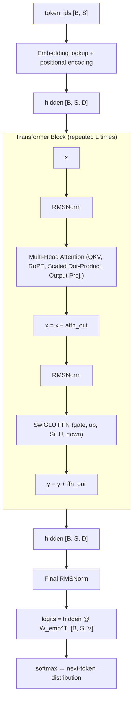
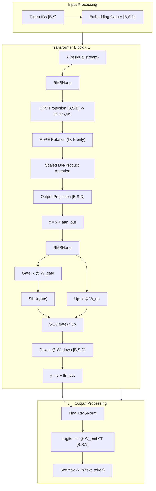

# Transformer Internals — The Complete Forward Pass

> **Layer:** L6.
> **Prerequisites:** [FlashAttention_Deep_Dive](../L5_Kernels_and_Programming/FlashAttention_Deep_Dive.md), [Memory_Hierarchy_and_Roofline](../L3_Microarchitecture/Memory_Hierarchy_and_Roofline.md).
> **Hands off to:** [Attention_Mechanisms](Attention_Mechanisms.md), [Quantization](Quantization.md), [Frontier_Models_2025_2026](Frontier_Models_2025_2026.md).

---

## 0. Why this page exists

Every optimization in the stack above — FlashAttention, GQA, weight quantization, MoE routing, speculative decoding — is a transformation of the transformer forward pass. This page specifies that forward pass completely: every matrix, every dimension, every FLOP, every byte. If you can reconstruct the following from memory on a whiteboard with correct dimensions and derive the FLOP count, you are prepared for any system-design interview question about LLM inference or training.

**Five invariants that hold across all decoder-only transformers (GPT-2 through Llama-4):**

1. **The residual stream has constant width.** Hidden state is always $[B, S, D]$; no layer changes $D$.
2. **Each transformer block is attention + FFN, each wrapped in its own residual.** $\mathbf{y} = \mathbf{x} + \text{Attn}(\text{Norm}(\mathbf{x}))$, then $\mathbf{y} = \mathbf{y} + \text{FFN}(\text{Norm}(\mathbf{y}))$.
3. **Softmax is the only nonlinearity in attention.** The FFN provides the per-token feature transformation; attention provides inter-token communication.
4. **Positional information is injected either into the embedding or into Q/K, never into V.** RoPE and ALiBi modify the attention scores; they never touch the values or the FFN.
5. **FLOPs per token $\approx 2P$** (where $P$ is active parameter count), because each weight participates in exactly one multiply-accumulate.

---

## 1. Top-Level Forward Pass

A decoder-only transformer maps a sequence of integer token IDs to a probability distribution over the vocabulary at each position:

$$\text{logits}[b, s, :] = \text{Unembed}\!\left(\text{TransformerBlocks}\!\left(\text{Embed}(\text{token\_ids}[b, s])\right)\right)$$

### 1.1 Dimension table for reference models

| Model | $L$ | $D$ | $H$ (Q heads) | $K$ (KV heads) | $d_h$ | $d_{\text{ff}}$ | $V$ | Params |
|---|---|---|---|---|---|---|---|---|
| Llama-3-8B | 32 | 4096 | 32 | 8 | 128 | 14336 | 128K | 8.0B |
| Llama-3-70B | 80 | 8192 | 64 | 8 | 128 | 28672 | 128K | 70.6B |
| Llama-3-405B | 126 | 16384 | 128 | 8 | 128 | 53248 | 128K | 405B |
| DeepSeek-V3 | 61 | 7168 | 128 | 128 | 128 | 18432 | 129K | 671B (37B active) |

---

## 2. Embedding

### 2.1 Token embedding

A learnable matrix $E \in \mathbb{R}^{V \times D}$ maps each token ID to a dense vector:

$$\mathbf{x}_0[b,s,:] = E[\,\text{token\_ids}[b,s]\,,:]$$

This is a gather operation, not a matmul. FLOPs are negligible. Memory cost is $B \cdot S \cdot D$ elements read from $E$, but the full $E$ matrix (which is $V \cdot D$ elements) must reside in memory. For Llama-3-70B: $V = 128\text{K}$, $D = 8192$, so $E$ is $128\,000 \times 8192 = 1.05 \times 10^9$ parameters $\approx$ 2 GB in FP16.

### 2.2 Absolute positional embedding (legacy)

GPT-2 and GPT-3 add a learned position vector to each position:

$$\mathbf{x}_0[b,s,:] = E[\text{token\_ids}[b,s],:] + P[s,:]$$

where $P \in \mathbb{R}^{S_{\max} \times D}$. This approach cannot extrapolate beyond $S_{\max}$ and provides no relative-position signal. Modern models discard it in favor of RoPE (Section 7).

---

## 3. Normalization

### 3.1 LayerNorm

Given input $\mathbf{x} \in \mathbb{R}^D$ (one token's hidden vector):

$$\mu = \frac{1}{D}\sum_{i=1}^{D} x_i, \qquad \sigma^2 = \frac{1}{D}\sum_{i=1}^{D}(x_i - \mu)^2$$

$$\hat{x}_i = \frac{x_i - \mu}{\sqrt{\sigma^2 + \varepsilon}}, \qquad y_i = \gamma_i \hat{x}_i + \beta_i$$

where $\gamma, \beta \in \mathbb{R}^D$ are learned gain and bias. The normalization is over the hidden dimension $D$ only (not over batch or sequence). FLOPs: $O(D)$ per token — dominated by the variance reduction. Memory-bound on modern GPUs because arithmetic intensity $\approx 4$ FLOP/byte $\ll I_{\text{ridge}}$.

### 3.2 RMSNorm

Used in Llama, Mistral, Gemma, and nearly all post-2022 LLMs. Removes the mean-centering and bias:

$$\text{RMS}(\mathbf{x}) = \sqrt{\frac{1}{D}\sum_{i=1}^{D} x_i^2 + \varepsilon}$$

$$y_i = \gamma_i \cdot \frac{x_i}{\text{RMS}(\mathbf{x})}$$

The full formula inlined:

$$\boxed{y_i = \frac{x_i}{\sqrt{\frac{1}{D}\sum_{j=1}^{D} x_j^2 + \varepsilon}} \cdot \gamma_i}$$

where $\gamma \in \mathbb{R}^D$ is a learned per-dimension gain, and $\varepsilon = 10^{-6}$ (typical) prevents division by zero.

**Derivation of savings vs LayerNorm.** LayerNorm computes: (1) mean $\mu = \frac{1}{D}\sum x_i$, (2) variance $\sigma^2 = \frac{1}{D}\sum (x_i - \mu)^2$ (requires the mean), (3) normalize $(x_i - \mu)/\sqrt{\sigma^2 + \varepsilon}$, (4) scale and shift $\gamma_i \hat{x}_i + \beta_i$ — four reductions over $D$ plus a bias term. RMSNorm computes: (1) sum of squares $\frac{1}{D}\sum x_i^2$, (2) normalize $x_i / \text{RMS}(\mathbf{x})$, (3) scale $\gamma_i \cdot x_i / \text{RMS}(\mathbf{x})$ — three steps, no mean subtraction, no bias. Empirically $\sim$20% faster with no quality degradation: the mean-centering step contributes negligible information because the residual stream's mean drift is small and learned $\gamma$ absorbs any shift.

**Why RMSNorm works as well as LayerNorm for transformers.** In a pre-norm transformer, the normalization input $\mathbf{x}$ is the residual stream — the sum of all previous layer outputs. LayerNorm centers to zero mean *and* normalizes to unit variance. RMSNorm only normalizes by the root-mean-square, leaving the mean intact. Two reasons this is sufficient:

1. The learned $\gamma$ can absorb any mean offset. LayerNorm's centering + scaling is $\gamma_i \cdot (x_i - \mu) / \sigma + \beta_i$. RMSNorm's $\gamma_i \cdot x_i / \text{RMS}(\mathbf{x})$ is equivalent to LayerNorm with $\beta_i = -\gamma_i \cdot \mu / \text{RMS}(\mathbf{x})$. Since $\mu$ is approximately constant across tokens (the residual stream's mean drifts slowly), $\gamma$ can learn to compensate.

2. The scale invariance property — the critical feature for training stability — is preserved. For any scalar $c > 0$: $\text{RMSNorm}(c \cdot \mathbf{x}) = \text{RMSNorm}(\mathbf{x})$, because both the numerator $x_i$ and denominator $\text{RMS}(\mathbf{x})$ scale by $c$. This prevents activation magnitude explosion across layers, which is the primary purpose of normalization in deep transformers.

**Numerical stability in the $x_i^2$ sum.** For large $D$ (e.g., $D = 8192$ for Llama-3-70B), the sum $\sum_{i=1}^{D} x_i^2$ can overflow FP16 (max $\approx 65{,}504$). If each $x_i \approx 10$ (a moderate activation), the sum is $8192 \times 100 = 819{,}200$, which overflows. Implementation uses one of two strategies:

- **BF16 accumulation:** BF16 has the same dynamic range as FP32 ($\approx 3.4 \times 10^{38}$), so the sum cannot overflow for any reasonable activation magnitude. This is why all post-2022 models train in BF16 rather than FP16.
- **Kahan / pairwise summation:** Sum pairs, then sum pairs of pairs, etc. Each intermediate sum is $O(x_i^2)$ rather than $O(D \cdot x_i^2)$, avoiding overflow. Used in FP16 inference kernels.

The $\varepsilon$ term (typically $10^{-6}$) prevents division by zero but is negligible for numerical stability — it does not meaningfully help with overflow. The real protection comes from the accumulation dtype.

**Worked numerical example.** For $\mathbf{x} = [3.0, 4.0, -2.0, 1.0]$ ($D = 4$, $\varepsilon = 10^{-6}$, $\gamma = \mathbf{1}$):

$$\text{RMS}(\mathbf{x}) = \sqrt{\frac{9 + 16 + 4 + 1}{4} + 10^{-6}} = \sqrt{7.5 + 10^{-6}} \approx 2.739$$

$$\mathbf{y} = [3.0, 4.0, -2.0, 1.0] / 2.739 = [1.095, 1.461, -0.730, 0.365]$$

Compare with LayerNorm: $\mu = 1.5$, $\sigma = \sqrt{(2.25 + 6.25 + 12.25 + 0.25)/4} = \sqrt{5.25} = 2.291$. LayerNorm output: $[(3.0 - 1.5)/2.291, (4.0 - 1.5)/2.291, (-2.0 - 1.5)/2.291, (1.0 - 1.5)/2.291] = [0.655, 1.091, -1.528, -0.218]$. The outputs differ because RMSNorm does not center — but both preserve relative magnitudes and prevent scale explosion, which is the critical function.

### 3.3 Pre-norm vs. post-norm

**Pre-norm** (universal in modern LLMs):

$$\mathbf{y} = \mathbf{x} + \text{SubModule}\!\left(\text{Norm}(\mathbf{x})\right)$$

**Post-norm** (original Vaswani 2017 paper):

$$\mathbf{y} = \text{Norm}\!\left(\mathbf{x} + \text{SubModule}(\mathbf{x})\right)$$

Pre-norm creates a clean residual highway: the gradient flows through $\mathbf{x}$ unimpeded by the normalization, enabling stable training at 100+ layers. Post-norm forces all gradient flow through the normalization, causing exploding/vanishing signals at depth. Every frontier model since PaLM (2022) uses pre-norm.

---

## 4. Self-Attention Block

### 4.1 QKV projection

Given normalized input $\mathbf{X} \in \mathbb{R}^{B \times S \times D}$:

$$Q = \mathbf{X} W_Q \in \mathbb{R}^{B \times S \times H d_h}, \quad K = \mathbf{X} W_K \in \mathbb{R}^{B \times S \times K d_h}, \quad V = \mathbf{X} W_V \in \mathbb{R}^{B \times S \times K d_h}$$

where $W_Q \in \mathbb{R}^{D \times H d_h}$, $W_K \in \mathbb{R}^{D \times K d_h}$, $W_V \in \mathbb{R}^{D \times K d_h}$. Here $H$ is the number of query heads and $K$ is the number of KV heads. In Multi-Head Attention (MHA), $H = K$; in Grouped-Query Attention (GQA), $H > K$; in Multi-Query Attention (MQA), $K = 1$.

Reshape to per-head format:

$$Q \to [B, H, S, d_h], \qquad K \to [B, K, S, d_h], \qquad V \to [B, K, S, d_h]$$

For GQA, each group of $H/K$ query heads shares the same K and V head. This reduces KV cache size by $H/K\times$ with minimal quality impact.

**FLOPs for QKV projection:** $2 \cdot B \cdot S \cdot D \cdot (H + 2K) \cdot d_h$. With $H d_h = D$ (standard): $= 2 B S D^2 (1 + 2K/H)$. For MHA ($K=H$): $6 B S D^2$. For GQA with $K/H = 1/8$ (Llama-3): $2 B S D^2 (1 + 1/4) = 2.5 B S D^2$.

### 4.2 Scaled dot-product attention

After RoPE is applied to $Q$ and $K$ (Section 7), compute:

$$S = \frac{Q K^T}{\sqrt{d_h}} \in \mathbb{R}^{B \times H \times S \times S}$$

$$P = \text{softmax}(S + M_{\text{causal}}) \in \mathbb{R}^{B \times H \times S \times S}$$

$$\mathbf{o} = P \cdot V \in \mathbb{R}^{B \times H \times S \times d_h}$$

where $M_{\text{causal}}[i,j] = 0$ if $j \leq i$, else $-\infty$. The $1/\sqrt{d_h}$ scaling prevents the softmax input from growing with head dimension, which would push the softmax into saturation (gradient $\to 0$). Derivation: each element of $QK^T$ is a sum of $d_h$ products; if $q_i, k_i \sim \mathcal{N}(0,1)$, the dot product has variance $d_h$, and dividing by $\sqrt{d_h}$ restores unit variance.

### 4.3 Output projection

Concatenate heads and project back to $D$:

$$\text{out} = \text{Concat}(\mathbf{o}_1, \ldots, \mathbf{o}_H) \cdot W_O \in \mathbb{R}^{B \times S \times D}$$

where $W_O \in \mathbb{R}^{H d_h \times D}$. With $H d_h = D$, this is a $D \times D$ matmul. FLOPs: $2 B S D^2$.

### 4.4 Attention FLOP summary

For prefill (sequence length $S$, all positions):

$$\text{FLOPs}_{\text{attn}} = \underbrace{2 B S D (H + 2K) d_h}_{\text{QKV proj}} + \underbrace{4 B H S^2 d_h}_{\text{QK}^T\text{ + PV}} + \underbrace{2 B S D^2}_{\text{output proj}}$$

For decode (single new token at position $T$, KV cache has length $T$):

$$\text{FLOPs}_{\text{attn, decode}} = 2 B D (H + 2K) d_h + 4 B H T d_h + 2 B D^2$$

The decode attention is $O(T)$ in FLOPs and $O(T)$ in bytes read (KV cache) — arithmetic intensity $\approx 2$ FLOP/byte, deeply memory-bound.

### 4.5 Sliding Window Attention

Full causal attention computes an $S \times S$ score matrix per head, making attention FLOPs quadratic in sequence length. **Sliding window attention** (SWA) restricts each token to attend only to the most recent $W$ tokens, converting the dense attention mask into a banded matrix of width $W$.

**Mechanism.** Replace the full causal mask $M_{\text{causal}}$ with a sliding window mask:

$$S_{ij} = \begin{cases} \frac{\mathbf{q}_i \cdot \mathbf{k}_j}{\sqrt{d_h}} & \text{if } j \geq i - W + 1 \text{ and } j \leq i \\ -\infty & \text{otherwise} \end{cases}$$

Each query position $i$ attends to at most $W$ key positions: $\{i - W + 1, \ldots, i\}$. The score matrix changes from a full lower-triangular $S \times S$ to a banded lower-triangular matrix with bandwidth $W$. FlashAttention-style kernels can exploit this sparsity by iterating over blocks of $W$ keys per query block rather than all $S$ keys.

**FLOP modification.** The $QK^T$ and $PV$ steps now operate on $W$ keys per query instead of $S$:

$$\text{FLOPs}_{QK^T + PV} = 4 B H S W d_h \quad \text{(was } 4 B H S^2 d_h \text{)}$$

The full prefill attention formula becomes:

$$\text{FLOPs}_{\text{attn}} = \underbrace{2 B S D (H + 2K) d_h}_{\text{QKV proj}} + \underbrace{4 B H S W d_h}_{\text{QK}^T\text{ + PV (windowed)}} + \underbrace{2 B S D^2}_{\text{output proj}}$$

The QKV and output projections are unchanged — only the attention score computation shrinks. The reduction factor is $S/W$: at $S = 128\text{K}$ with $W = 4096$, attention FLOPs drop by $128\text{K}/4096 = 32\times$. At short sequences ($S \leq W$), SWA degenerates to standard causal attention with no savings.

**KV cache implications.** With a fixed window $W$, only the most recent $W$ positions of KV cache are needed per sequence. This makes KV cache $O(W)$ per layer instead of $O(S)$:

$$\text{KV}_{\text{SWA}} = 2 L K d_h W \cdot \text{dtype\_size}$$

For Mistral-7B ($L=32$, $K=32$, $d_h=128$, $W=4096$) in FP16: $2 \times 32 \times 32 \times 128 \times 4096 \times 2 = 68.7$ MB — fixed regardless of context length. Most implementations (Mistral, Gemma) use a **rolling buffer** (circular buffer): the KV cache is allocated with size $W$ and old entries are overwritten by new ones via modular indexing (`position % W`), avoiding explicit eviction logic.

**Prefix + sliding window hybrid.** Production systems do not use pure sliding window attention. Mistral's implementation and Gemma combine a sliding window for the conversation body with **full attention on the system prompt prefix**. The KV cache stores the full prefix (which every token attends to) plus the most recent $W$ tokens of the conversation. This hybrid ensures that system instructions remain visible at all positions while keeping conversation-context compute linear in $W$ rather than $S$. The effective attention pattern is: each query attends to all prefix tokens plus its local window of $W$ conversation tokens.

**Which models use it.**

| Model | Window $W$ | Notes |
|---|---|---|
| Mistral-7B | 4096 | Introduced SWA for efficient long-context inference |
| Gemma-2 (2B, 9B, 27B) | 4096 | Alternates SWA layers with full-attention layers |
| Mistral-Nemo (12B) | 4096 | Prefix + SWA hybrid for extended context |

These models extend effective context length via RoPE scaling (Section 7.2) while keeping per-layer attention compute linear: RoPE allows extrapolation to longer sequences, and SWA ensures that longer sequences do not incur quadratic attention cost. The combination yields $O(SW)$ per-layer attention FLOPs rather than $O(S^2)$.

---

## 5. FFN Block

### 5.1 Classical FFN (GPT-2)

$$\mathbf{h} = \text{GeLU}(\mathbf{x} W_{\text{up}} + \mathbf{b}_{\text{up}}) \in \mathbb{R}^{B \times S \times 4D}$$

$$\text{out} = \mathbf{h} W_{\text{down}} + \mathbf{b}_{\text{down}} \in \mathbb{R}^{B \times S \times D}$$

Two matmuls ($D \to 4D \to D$) with GeLU activation. Parameter count: $2 \times D \times 4D = 8D^2$. FLOPs: $2 \times 2 B S D \times 4D = 16 B S D^2$.

### 5.2 SwiGLU (Llama, PaLM, Mistral, Gemma)

Three projections with a gated activation:

$$\mathbf{g} = \mathbf{x} W_{\text{gate}} \in \mathbb{R}^{B \times S \times d_{\text{ff}}}$$

$$\mathbf{u} = \mathbf{x} W_{\text{up}} \in \mathbb{R}^{B \times S \times d_{\text{ff}}}$$

$$\mathbf{h} = \text{SiLU}(\mathbf{g}) \odot \mathbf{u} \in \mathbb{R}^{B \times S \times d_{\text{ff}}}$$

$$\text{out} = \mathbf{h} W_{\text{down}} \in \mathbb{R}^{B \times S \times D}$$

where $\text{SiLU}(x) = x \cdot \sigma(x)$ (sigmoid linear unit), $\odot$ is element-wise product, and $d_{\text{ff}} = \lfloor 8D/3 \rceil$ (rounded to the nearest multiple of 256 for hardware alignment).

**Why SwiGLU outperforms GeGLU and plain GeLU.** Shazeer (2020) showed that gating improves over non-gated at every parameter budget. SiLU gating ($x \sigma(x)$) slightly outperforms GeLU gating on language modeling perplexity. The three-matrix formulation has more parameters per FLOP than the two-matrix GeLU FFN: with $d_{\text{ff}} = 8D/3$, parameter count is $3 \times D \times 8D/3 = 8D^2$ (same as classical), but the model allocates those parameters differently, giving each expert-like pathway both a gate and a value projection.

### 5.3 GeGLU variant

Replace SiLU with GeLU in the gate:

$$\mathbf{h} = \text{GeLU}(\mathbf{x} W_{\text{gate}}) \odot (\mathbf{x} W_{\text{up}})$$

Used in some PaLM checkpoints. Slightly worse perplexity than SwiGLU in controlled comparisons but the difference is small ($< 0.5\%$).

### 5.4 FFN FLOP accounting

For SwiGLU with $d_{\text{ff}} = 8D/3$:

$$\text{FLOPs}_{\text{FFN}} = 2 \times B S D \cdot d_{\text{ff}} \times 3 = 6 B S D \cdot \frac{8D}{3} = 16 B S D^2$$

Parameter count per layer: $3 D d_{\text{ff}} = 3 D \cdot \frac{8D}{3} = 8D^2$.

The FFN dominates per-layer compute: $16 B S D^2$ vs attention's $\approx 4 B S D^2$ (at typical sequence lengths). The ratio is approximately **4:1 FFN-to-attention** in FLOPs.

---

## 6. Residual Connections

Each transformer block contains two residual skip connections:

$$\mathbf{y}_{\text{attn}} = \mathbf{x} + \text{AttnBlock}(\text{Norm}_1(\mathbf{x}))$$

$$\mathbf{y}_{\text{ffn}} = \mathbf{y}_{\text{attn}} + \text{FFNBlock}(\text{Norm}_2(\mathbf{y}_{\text{attn}}))$$

**Why residuals are essential.** Without skip connections, the signal must pass through $2L$ nonlinear transformations (attention + FFN per layer). The gradient through a chain of $2L$ matrix multiplications has norm proportional to $\sigma^{2L}$ (where $\sigma$ is the singular value of each layer's Jacobian). If $\sigma < 1$, the gradient vanishes; if $\sigma > 1$, it explodes. The residual connection ensures a direct path with Jacobian = $I$, so the gradient always has unit-norm component regardless of depth.

In implementation, the residual addition is a simple element-wise add: $O(BSD)$ FLOPs, negligible compared to matmuls but critical for numerical stability. In FP8 training, the residual stream is typically kept in higher precision (FP32 or BF16 accumulation) to avoid error accumulation across layers.

---

## 7. Positional Encodings

Positional information is necessary because the attention operation is permutation-equivariant: $f(\pi(\mathbf{X})) = \pi(f(\mathbf{X}))$ for any permutation $\pi$ of the sequence dimension. Without position information, "the cat sat on the mat" and "mat the on sat cat the" produce identical representations.

### 7.1 Sinusoidal positional encoding (Vaswani 2017)

For position $m$ and dimension index $i \in \{0, 1, \ldots, D/2 - 1\}$:

$$\text{PE}(m, 2i) = \sin\!\left(\frac{m}{10000^{2i/D}}\right), \qquad \text{PE}(m, 2i+1) = \cos\!\left(\frac{m}{10000^{2i/D}}\right)$$

**Derivation of the base frequency.** The wavelengths form a geometric progression from $2\pi$ (when $i=0$) to $2\pi \cdot 10000$ (when $i = D/2$). The choice of 10000 ensures that for any fixed offset $k$, $\text{PE}(m+k, \cdot)$ is a linear function of $\text{PE}(m, \cdot)$ — specifically, the dot product between positions $m$ and $m+k$ depends primarily on $k$, providing implicit relative-position signal.

**Proof of linearity.** For each pair $(2i, 2i+1)$:

$$\begin{pmatrix} \sin(m\theta_i) \\ \cos(m\theta_i) \end{pmatrix} = \begin{pmatrix} \cos(k\theta_i) & \sin(k\theta_i) \\ -\sin(k\theta_i) & \cos(k\theta_i) \end{pmatrix} \begin{pmatrix} \sin((m+k)\theta_i) \\ \cos((m+k)\theta_i) \end{pmatrix}$$

where $\theta_i = 1/10000^{2i/D}$. This rotation property means the model can learn to attend by relative offset.

### 7.2 Rotary Position Embedding (RoPE)

RoPE (Su et al., 2021) applies the rotation directly to $Q$ and $K$ vectors rather than adding position to the input. For a $d$-dimensional Q or K vector at position $m$, group dimensions into pairs and apply 2D rotation:

$$\theta_i = 10000^{-2i/d}, \quad i = 0, 1, \ldots, d/2 - 1$$

$$\begin{pmatrix} q'_{2i} \\ q'_{2i+1} \end{pmatrix} = \begin{pmatrix} \cos(m\theta_i) & -\sin(m\theta_i) \\ \sin(m\theta_i) & \cos(m\theta_i) \end{pmatrix} \begin{pmatrix} q_{2i} \\ q_{2i+1} \end{pmatrix}$$

**Full rotation matrix form.** The complete transformation for a $d$-dimensional vector is a block-diagonal rotation matrix $R(m) \in \mathbb{R}^{d \times d}$:

$$R(m) = \begin{pmatrix} \cos(m\theta_0) & -\sin(m\theta_0) & & & \\ \sin(m\theta_0) & \cos(m\theta_0) & & & \\ & & \cos(m\theta_1) & -\sin(m\theta_1) & \\ & & \sin(m\theta_1) & \cos(m\theta_1) & \\ & & & & \ddots \\ & & & & & \cos(m\theta_{d/2-1}) & -\sin(m\theta_{d/2-1}) \\ & & & & & \sin(m\theta_{d/2-1}) & \cos(m\theta_{d/2-1}) \end{pmatrix}$$

**Proof that RoPE encodes relative position.** For queries at position $m$ and keys at position $n$:

$$\langle R(m)\mathbf{q}, R(n)\mathbf{k} \rangle = \mathbf{q}^T R(m)^T R(n) \mathbf{k} = \mathbf{q}^T R(n - m) \mathbf{k}$$

because $R(m)^T R(n) = R(n - m)$ (rotation matrices form an abelian group under block-diagonal composition). The dot product depends only on the relative offset $n - m$, not on absolute positions $m$ and $n$ individually.

**Implementation (vectorized, no matrix materialization):**

$$\text{RoPE}(\mathbf{x})_{2i} = x_{2i} \cos(m\theta_i) - x_{2i+1} \sin(m\theta_i)$$

$$\text{RoPE}(\mathbf{x})_{2i+1} = x_{2i} \sin(m\theta_i) + x_{2i+1} \cos(m\theta_i)$$

In practice, $\cos(m\theta_i)$ and $\sin(m\theta_i)$ are precomputed for all positions and cached. Fused Triton/CUDA kernels avoid the interleaving overhead.

**Worked numerical example (head_dim = 4, positions 0, 1, 2).** With $d = 4$, there are $d/2 = 2$ dimension pairs. Base frequencies:

$$\theta_0 = 10000^{-0/4} = 10000^{0} = 1.0, \qquad \theta_1 = 10000^{-2/4} = 10000^{-0.5} = 0.01$$

For a query vector $\mathbf{q} = [q_0, q_1, q_2, q_3]$ at position $m$, RoPE produces:

$$\mathbf{q}'_m = \begin{pmatrix} q_0 \cos(m \cdot 1.0) - q_1 \sin(m \cdot 1.0) \\ q_0 \sin(m \cdot 1.0) + q_1 \cos(m \cdot 1.0) \\ q_2 \cos(m \cdot 0.01) - q_3 \sin(m \cdot 0.01) \\ q_2 \sin(m \cdot 0.01) + q_3 \cos(m \cdot 0.01) \end{pmatrix}$$

Concrete values at positions 0, 1, 2 for $\mathbf{q} = [1, 0, 1, 0]$:

| Position $m$ | $\cos(m \theta_0), \sin(m \theta_0)$ | $\cos(m \theta_1), \sin(m \theta_1)$ | $\mathbf{q}'_m$ |
|---|---|---|---|
| 0 | 1.0, 0.0 | 1.0, 0.0 | $[1, 0, 1, 0]$ |
| 1 | 0.540, 0.841 | 0.99995, 0.01000 | $[0.540, 0.841, 0.99995, 0.01000]$ |
| 2 | $-0.416, 0.909$ | 0.99980, 0.02000 | $[-0.416, 0.909, 0.99980, 0.02000]$ |

Now verify the relative-position property. Let $\mathbf{k} = [1, 0, 1, 0]$ at position $n = 2$. Compute $\langle \mathbf{q}'_m, \mathbf{k}'_n \rangle$ for $m = 0, 1, 2$:

$$m=0: \langle [1,0,1,0],\; [-0.416, 0.909, 0.9998, 0.020] \rangle = -0.416 + 0.9998 = 0.584$$

$$m=1: \langle [0.540, 0.841, 0.99995, 0.010],\; [-0.416, 0.909, 0.9998, 0.020] \rangle = -0.225 + 0.765 + 0.9997 + 0.0002 = 1.540$$

$$m=2: \langle [-0.416, 0.909, 0.9998, 0.020],\; [-0.416, 0.909, 0.9998, 0.020] \rangle = 0.173 + 0.826 + 0.9996 + 0.0004 = 1.999$$

**Explicit proof that $\mathbf{q}_m^T \mathbf{k}_n = f(m - n)$.** The RoPE-applied dot product for dimension pair $i$ is:

$$\begin{aligned}
&q'_{2i}^{(m)} k'_{2i}^{(n)} + q'_{2i+1}^{(m)} k'_{2i+1}^{(n)} \\
&= (q_{2i} \cos m\theta_i - q_{2i+1} \sin m\theta_i)(k_{2i} \cos n\theta_i - k_{2i+1} \sin n\theta_i) \\
&\quad + (q_{2i} \sin m\theta_i + q_{2i+1} \cos m\theta_i)(k_{2i} \sin n\theta_i + k_{2i+1} \cos n\theta_i)
\end{aligned}$$

Expanding and collecting terms, the cross terms cancel:

$$= (q_{2i} k_{2i} + q_{2i+1} k_{2i+1}) \cos((n - m)\theta_i) + (q_{2i} k_{2i+1} - q_{2i+1} k_{2i}) \sin((n - m)\theta_i)$$

Summing over all pairs $i = 0, \ldots, d/2 - 1$:

$$\boxed{\langle \mathbf{q}'_m, \mathbf{k}'_n \rangle = \sum_{i=0}^{d/2-1} \Big[(q_{2i} k_{2i} + q_{2i+1} k_{2i+1}) \cos((n - m)\theta_i) + (q_{2i} k_{2i+1} - q_{2i+1} k_{2i}) \sin((n - m)\theta_i)\Big]}$$

This is a function of $n - m$ only, not of $m$ or $n$ individually. Verifying with our example ($\mathbf{q} = \mathbf{k} = [1, 0, 1, 0]$):

$$f(n - m) = \sum_{i=0}^{1} \cos((n - m)\theta_i)$$

- $n - m = 2$: $\cos(2 \cdot 1.0) + \cos(2 \cdot 0.01) = \cos 2 + \cos 0.02 = -0.416 + 0.9998 = 0.584$ $\checkmark$
- $n - m = 1$: $\cos(1.0) + \cos(0.01) = 0.540 + 0.99995 = 1.540$ $\checkmark$
- $n - m = 0$: $\cos(0) + \cos(0) = 1 + 1 = 2.000$ $\checkmark$ (matches $1.999$ with rounding)

**Context extension.** Standard RoPE fails when extrapolating beyond the training context length because high-frequency dimensions ($i \approx 0$) have rotation angles that cycle rapidly. Techniques for extension:

- **Position Interpolation (PI):** scale position index by $1/\alpha$ where $\alpha$ is the extension factor. Smooth but wastes resolution.
- **NTK-aware scaling:** replace base $10000$ with $\alpha^{d/(d-2)} \cdot 10000$. Adjusts low and high frequencies differently.
- **YaRN:** combines NTK scaling with an attention-temperature correction for high-frequency components.

Llama-3 extends from 8K training context to 128K using a combination of NTK-aware scaling and continued fine-tuning.

### 7.3 ALiBi (Attention with Linear Biases)

Press et al. (2022). Instead of adding positional information to the representations, directly bias the attention scores:

$$S_{ij} = \frac{\mathbf{q}_i \cdot \mathbf{k}_j}{\sqrt{d_h}} + m \cdot (j - i)$$

where $m$ is a head-specific slope, geometrically spaced: $m_h = 2^{-8h/H}$ for head $h$. No positional parameters are learned. ALiBi enables length extrapolation without fine-tuning because the linear bias is well-defined for any relative distance. Used in BLOOM, MPT. Less common in 2025+ models because RoPE + YaRN provides better performance at extreme lengths.

### 7.4 NoPE (No Positional Encoding)

Kazemnejad et al. (2023). Some decoder-only models (notably some configurations of GPT-NeoX variants) demonstrate that causal masking itself provides implicit positional information: each position can only attend to positions $\leq i$, so position $i$ has a unique attention pattern. NoPE works surprisingly well for short contexts but degrades at long contexts without explicit position signal. Not used in any frontier model as of 2026.

---

## 8. Unembedding (Output Head)

The final hidden state is projected to vocabulary logits:

$$\text{logits}[b,s,:] = \mathbf{h}[b,s,:] \cdot W_{\text{out}} \in \mathbb{R}^{V}$$

where $W_{\text{out}} \in \mathbb{R}^{D \times V}$.

**Weight tying.** Many models set $W_{\text{out}} = E^T$, sharing the input embedding matrix. This saves $V \cdot D$ parameters (1 GB for Llama-3-70B) and provides a mild regularization: the same space used to represent tokens must also predict them. Some models (GPT-4 class) untie them for marginal quality gains.

**FLOPs:** $2 B S D V$. For Llama-3-70B with $V = 128\text{K}$, $D = 8192$, $S = 1$: $2 \times 8192 \times 128\,000 \approx 2.1$ GFLOPs per token — a single matmul comparable to an entire FFN layer. This is why vocabulary-level operations (softmax, sampling) are performance-critical.

**Fused softmax-cross-entropy.** In training, computing $\text{softmax}(\text{logits}) \in \mathbb{R}^V$ explicitly and then cross-entropy would materialize a $V$-dimensional vector per token. Flash-cross-entropy fuses the log-softmax and label lookup into a single kernel that only tracks the running maximum and sum, never materializing the full probability vector.

---

## 9. Parameter Count Formulas

### 9.1 Per transformer block

For a model with hidden dimension $D$, $H$ query heads, $K$ KV heads, head dimension $d_h = D/H$, and FFN hidden dimension $d_{\text{ff}}$:

| Component | Parameters | Formula (with $H d_h = D$) |
|---|---|---|
| Q projection | $D \cdot H d_h$ | $D^2$ |
| K projection | $D \cdot K d_h$ | $D^2 \cdot K/H$ |
| V projection | $D \cdot K d_h$ | $D^2 \cdot K/H$ |
| Output projection | $H d_h \cdot D$ | $D^2$ |
| Attention subtotal | | $D^2 (1 + 2K/H + 1) = D^2(2 + 2K/H)$ |
| Gate projection | $D \cdot d_{\text{ff}}$ | $8D^2/3$ |
| Up projection | $D \cdot d_{\text{ff}}$ | $8D^2/3$ |
| Down projection | $d_{\text{ff}} \cdot D$ | $8D^2/3$ |
| FFN subtotal | | $8D^2$ |
| RMSNorm gains (x2) | $2D$ | negligible |
| **Block total** | | $D^2(10 + 2K/H) + 2D$ |

For MHA ($K = H$): $12 D^2 + 2D$ per block. For GQA with $K/H = 1/8$: $10.25 D^2 + 2D$ per block.

### 9.2 Full model

$$P = L \cdot \left[D^2\!\left(10 + \frac{2K}{H}\right) + 2D\right] + V \cdot D + D$$

where the final $+D$ is the output RMSNorm gain. For Llama-3-70B with $L=80$, $D=8192$, $K/H=1/8$, $V=128\text{K}$:

$$P = 80 \times 10.25 \times 8192^2 + 128\,000 \times 8192 + 8192 \approx 55.0\text{B} + 1.05\text{B} + 0.008\text{B} \approx 56.0\text{B}$$

The remaining $\sim$14.6B parameters come from embedding scaling factors, the exact $d_{\text{ff}}$ rounding, and in practice the $d_{\text{ff}}$ for Llama-3-70B is 28672 (not exactly $8/3 \times 8192 = 21845$; Llama-3 uses a different FFN multiplier).

### 9.3 Full parameter count derivation — Llama-style model with GQA and SwiGLU

This section derives every parameter in a Llama-style model from scratch, showing exactly where each weight matrix lives and how GQA ratio and SwiGLU factor into the count.

**Model hyperparameters:**
- $L$: number of transformer blocks
- $D$: hidden dimension
- $H$: number of query heads
- $K$: number of KV heads (GQA ratio = $H/K$)
- $d_h = D/H$: head dimension
- $d_{\text{ff}}$: FFN intermediate dimension (typically $\lfloor 8D/3 \rceil_{256}$)
- $V$: vocabulary size

**Per-block parameter count, component by component:**

1. **Attention — Q projection:** $W_Q \in \mathbb{R}^{D \times H d_h}$. Since $H d_h = D$: $D^2$ parameters.

2. **Attention — K projection:** $W_K \in \mathbb{R}^{D \times K d_h}$. Since $K d_h = (K/H) \cdot D$: $D^2 \cdot (K/H)$ parameters.

3. **Attention — V projection:** $W_V \in \mathbb{R}^{D \times K d_h}$. Same as K: $D^2 \cdot (K/H)$ parameters.

4. **Attention — Output projection:** $W_O \in \mathbb{R}^{H d_h \times D} = \mathbb{R}^{D \times D}$. $D^2$ parameters.

5. **Attention subtotal:** $D^2 + D^2 \cdot (K/H) + D^2 \cdot (K/H) + D^2 = D^2(2 + 2K/H)$.

6. **FFN — Gate projection (SwiGLU):** $W_{\text{gate}} \in \mathbb{R}^{D \times d_{\text{ff}}}$. $D \cdot d_{\text{ff}}$ parameters.

7. **FFN — Up projection (SwiGLU):** $W_{\text{up}} \in \mathbb{R}^{D \times d_{\text{ff}}}$. $D \cdot d_{\text{ff}}$ parameters.

8. **FFN — Down projection:** $W_{\text{down}} \in \mathbb{R}^{d_{\text{ff}} \times D}$. $D \cdot d_{\text{ff}}$ parameters.

9. **FFN subtotal:** $3 D d_{\text{ff}}$ parameters. With $d_{\text{ff}} = 8D/3$: $3D \cdot 8D/3 = 8D^2$.

10. **Normalization (2 per block):** $\gamma_1, \gamma_2 \in \mathbb{R}^D$. $2D$ parameters (negligible).

**Per-block total:**

$$P_{\text{block}} = D^2\!\left(2 + \frac{2K}{H}\right) + 3D \cdot d_{\text{ff}} + 2D$$

**Full model total:**

$$\boxed{P_{\text{total}} = L \cdot \left[D^2\!\left(2 + \frac{2K}{H}\right) + 3D \cdot d_{\text{ff}} + 2D\right] + V \cdot D + D}$$

where $V \cdot D$ is the (tied) embedding / unembedding matrix and the final $D$ is the output RMSNorm gain.

**Worked example: Llama-3-8B** ($L=32$, $D=4096$, $H=32$, $K=8$, $d_h=128$, $d_{\text{ff}}=14336$, $V=128256$).

GQA ratio: $K/H = 8/32 = 1/4$.

Per block:
- Attention: $4096^2 \times (2 + 2 \times 1/4) = 4096^2 \times 2.5 = 41{,}943{,}040$
- FFN: $3 \times 4096 \times 14336 = 176{,}160{,}768$
- Norm: $2 \times 4096 = 8{,}192$
- Block total: $218{,}111{,}992 \approx 218.1\text{M}$

All 32 blocks: $32 \times 218.1\text{M} = 6{,}979{,}583{,}744$

Embedding (untied output): $V \times D = 128256 \times 4096 = 525{,}336{,}576$

Final RMSNorm: $4096$

**Total: $6{,}979{,}583{,}744 + 525{,}336{,}576 + 4096 + 525{,}336{,}576 = 8{,}030{,}260{,}992 \approx 8.03\text{B}$**

(The second $525\text{M}$ term is the untied output projection $W_{\text{out}}$.)

**Worked example: Llama-3-70B** ($L=80$, $D=8192$, $H=64$, $K=8$, $d_h=128$, $d_{\text{ff}}=28672$, $V=128256$).

GQA ratio: $K/H = 8/64 = 1/8$.

Per block:
- Attention: $8192^2 \times (2 + 2 \times 1/8) = 67{,}108{,}864 \times 2.25 = 150{,}994{,}944$
- FFN: $3 \times 8192 \times 28672 = 704{,^643{,}072}$
- Norm: $2 \times 8192 = 16{,}384$
- Block total: $\approx 855.7\text{M}$

All 80 blocks: $80 \times 855.7\text{M} = 68{,}453{,}207{,}040$

Embedding + untied output: $2 \times 128256 \times 8192 = 2{,}100{,}673{,}536$

Final RMSNorm: $8192$

**Total: $\approx 70.55\text{B}$** (matching the published 70.6B).

---

## 10. FLOP Count per Forward Pass

### 10.1 The $2P$ rule

Each weight matrix participates in one matrix multiplication. For a matmul $\mathbf{Y} = \mathbf{X} W$ of shape $[n] \times [d_{\text{in}}, d_{\text{out}}]$: FLOPs $= 2 n d_{\text{in}} d_{\text{out}}$ (multiply + add). Summing over all weight matrices:

$$\text{FLOPs} = 2 \sum_{\text{weights}} n_i \cdot |\text{weight}_i| = 2 n \cdot P_{\text{dense}}$$

where $n$ is the number of tokens ($B \times S$ for prefill, $B$ for decode) and $P_{\text{dense}}$ counts only the dense (non-embedding) parameters that participate in matmuls. Softmax, layer norm, and element-wise ops contribute $O(D)$ per token — negligible compared to matmuls.

### 10.2 Per-token prefill breakdown

For Llama-3-70B ($P \approx 70.6\text{B}$):

$$\text{FLOPs/token} \approx 2 \times 70.6\text{B} = 141.2 \text{ GFLOPs}$$

Detailed breakdown per component per token:

| Component | FLOPs/token | Fraction |
|---|---|---|
| QKV projections | $2 D^2 (1 + 2K/H) = 2 \times 8192^2 \times 1.25$ = 167.8M | 0.12% |
| Attention ($QK^T + PV$) | $4 H d_h T$ (depends on $T$) | varies |
| Output projection | $2 D^2$ = 134.2M | 0.10% |
| FFN (SwiGLU x3) | $6 D \cdot d_{\text{ff}} \approx 16 D^2$ = 1.074G | 0.76% |
| Per-layer total (excl. $QK^T$) | $\approx 18 D^2$ = 1.21G | 0.86% |
| All 80 layers | $\approx 96.3$G | 68.2% |
| Embedding + Unembed | $2 \times 2 D V$ = 4.19G | 3.0% |
| **Total (at $S \gg 1$)** | $\approx 141$G | 100% |

> **Note on percentages.** The fractions above account for the position-independent components only. The attention $QK^T + PV$ term contributes $4HS d_h / (2P)$ per token during prefill, which ranges from $<1\%$ at $S \ll D$ to dominant at $S \gg D$. At $S = 4096$ for Llama-3-70B, attention $QK^T + PV$ contributes $\approx 3.0$ GFLOPs per token, bringing the total to $\approx 144$ GFLOPs/token. The "100%" row assumes $S$ is large enough that the position-independent terms dominate; at moderate context lengths, the true total slightly exceeds the sum of the rows shown.

### 10.3 Per-token decode step

During autoregressive decode, $S = 1$ but the KV cache has length $T$. The attention component changes:

$$\text{FLOPs}_{\text{decode-attn}} = 2 D^2 (1 + 2K/H) + 4 H d_h T + 2 D^2$$

The $4 H d_h T$ term grows linearly with context length. At $T = 128\text{K}$ for Llama-3-70B: $4 \times 64 \times 128 \times 128\,000 = 4.19$ GFLOPs — comparable to the rest of the attention block combined. Despite this, decode is still memory-bound because the weight matrices dominate the byte count.

### 10.4 Compute time estimate

For a 70B model on 8xH100 SXM (990 TFLOPS FP16 each = 7.92 PFLOPS aggregate):

$$t_{\text{prefill}} = \frac{2 P \cdot S}{\pi_{\text{aggregate}} \cdot \text{MFU}} = \frac{2 \times 70.6\text{B} \times 4096}{7.92\text{PFLOPS} \times 0.50} = \frac{578 \text{ TFLOPs}}{3.96 \text{ PFLOPS}} \approx 0.146 \text{ s}$$

Practical measurements: 0.15–0.30 s for 4K-token prefill at 50% MFU, consistent with this estimate.

---

## 10.5 Backward Pass — Full Gradient Derivation

Training requires gradients through every operation. The backward pass through one transformer block is the chain rule applied to the residual + norm + attention + FFN structure. We derive each gradient explicitly.

### Notation

Let $\mathcal{L}$ be the scalar loss. We write $\bar{\mathbf{Y}} = \partial \mathcal{L} / \partial \mathbf{Y}$ for the upstream gradient of any tensor $\mathbf{Y}$. Shapes are for a single sequence ($B=1$) for clarity.

### 10.5.1 Backward through the FFN sub-block

The forward is: $\mathbf{y}_{\text{ffn}} = \mathbf{y}_{\text{attn}} + \text{FFN}(\text{Norm}_2(\mathbf{y}_{\text{attn}}))$.

**Residual split:** $\bar{\mathbf{y}}_{\text{attn}}^{(1)} = \bar{\mathbf{y}}_{\text{ffn}}$ (gradient flows through the identity path), and the FFN path receives $\bar{\mathbf{y}}_{\text{attn}}^{(2)} = \bar{\mathbf{y}}_{\text{ffn}}$ (identical copy — the two paths sum).

**RMSNorm backward.** Forward: $\hat{\mathbf{x}} = \mathbf{x} / \text{RMS}(\mathbf{x})$, $\mathbf{n} = \gamma \odot \hat{\mathbf{x}}$. The gradient w.r.t. $\mathbf{x}$:

$$\bar{\gamma}_i += \bar{n}_i \cdot \hat{x}_i$$

$$\bar{\mathbf{x}} = \frac{1}{\text{RMS}(\mathbf{x})} \left(\bar{\mathbf{n}} \odot \gamma - \frac{1}{D} \cdot \hat{\mathbf{x}} \cdot \left\langle \bar{\mathbf{n}} \odot \gamma,\; \hat{\mathbf{x}} \right\rangle \right)$$

The second term corrects for the dependence of $\text{RMS}(\mathbf{x})$ on $\mathbf{x}$ — this is the "reduction" that makes normalization layers expensive in the backward pass (a dot product over $D$ per token).

**SwiGLU FFN backward.** Forward: $\mathbf{g} = \mathbf{x} W_{\text{gate}}$, $\mathbf{u} = \mathbf{x} W_{\text{up}}$, $\mathbf{h} = \text{SiLU}(\mathbf{g}) \odot \mathbf{u}$, $\mathbf{out} = \mathbf{h} W_{\text{down}}$.

$$\bar{\mathbf{h}} = \bar{\mathbf{out}} \cdot W_{\text{down}}^T$$

$$\bar{W}_{\text{down}} += \mathbf{h}^T \cdot \bar{\mathbf{out}}$$

$$\bar{\mathbf{g}} = \bar{\mathbf{h}} \odot \mathbf{u} \odot \text{SiLU}'(\mathbf{g}), \qquad \bar{\mathbf{u}} = \bar{\mathbf{h}} \odot \text{SiLU}(\mathbf{g})$$

where $\text{SiLU}'(x) = \sigma(x) + x \sigma(x)(1-\sigma(x)) = \sigma(x)(1 + x(1-\sigma(x)))$.

$$\bar{W}_{\text{gate}} += \mathbf{x}^T \cdot \bar{\mathbf{g}}, \qquad \bar{W}_{\text{up}} += \mathbf{x}^T \cdot \bar{\mathbf{u}}$$

$$\bar{\mathbf{x}}_{\text{FFN}} = \bar{\mathbf{g}} \cdot W_{\text{gate}}^T + \bar{\mathbf{u}} \cdot W_{\text{up}}^T$$

### 10.5.2 Backward through the Attention sub-block

**Residual split + RMSNorm:** Same pattern as above — $\bar{\mathbf{x}}$ receives gradients from both the identity path and the attention path.

**QKV projection backward.** Forward: $Q = \mathbf{x} W_Q$, $K = \mathbf{x} W_K$, $V = \mathbf{x} W_V$.

$$\bar{W}_Q += \mathbf{x}^T \cdot \bar{Q}, \quad \bar{W}_K += \mathbf{x}^T \cdot \bar{K}, \quad \bar{W}_V += \mathbf{x}^T \cdot \bar{V}$$

$$\bar{\mathbf{x}}_{\text{QKV}} = \bar{Q} \cdot W_Q^T + \bar{K} \cdot W_K^T + \bar{V} \cdot W_V^T$$

**Deriving $\partial \mathcal{L} / \partial Q$, $\partial \mathcal{L} / \partial K$, $\partial \mathcal{L} / \partial V$ through the full attention mechanism.** This is the core of the backward pass through a transformer. We derive each gradient step by step, starting from the upstream gradient $\bar{\mathbf{O}} = \partial \mathcal{L} / \partial \mathbf{O}$ arriving from the output projection.

The forward pass (per head, omitting batch/head indices) is:

$$S = QK^T / \sqrt{d_h}, \quad P = \text{softmax}_{\text{row}}(S), \quad \mathbf{O} = PV$$

**Step 1: $\partial \mathcal{L} / \partial P$ (from $\mathbf{O} = PV$).** This is a standard matmul backward:

$$\bar{P} = \bar{\mathbf{O}} V^T \in \mathbb{R}^{S \times S}, \qquad \bar{V} = P^T \bar{\mathbf{O}} \in \mathbb{R}^{S \times d_h}$$

**Step 2: $\partial \mathcal{L} / \partial S$ through the softmax Jacobian.** The softmax $\text{softmax}(S)_{ij} = e^{S_{ij}} / \sum_k e^{S_{ik}}$ has Jacobian:

$$\frac{\partial P_{ij}}{\partial S_{i\ell}} = P_{ij}(\delta_{j\ell} - P_{i\ell})$$

Applying the chain rule $\bar{S}_{i\ell} = \sum_j \bar{P}_{ij} \cdot P_{ij}(\delta_{j\ell} - P_{i\ell})$:

$$\bar{S}_{i\ell} = P_{i\ell} \left(\bar{P}_{i\ell} - \sum_j P_{ij} \bar{P}_{ij}\right)$$

In matrix form, defining $\mathbf{d} = \text{rowsum}(P \odot \bar{P}) \in \mathbb{R}^S$:

$$\boxed{\bar{S} = P \odot (\bar{P} - \mathbf{d} \cdot \mathbf{1}^T)}$$

Substituting $\bar{P} = \bar{\mathbf{O}} V^T$:

$$\bar{S} = P \odot \left(\bar{\mathbf{O}} V^T - (P \odot \bar{\mathbf{O}} V^T) \cdot \mathbf{1} \cdot \mathbf{1}^T\right)$$

**Step 3: $\partial \mathcal{L} / \partial Q$ and $\partial \mathcal{L} / \partial K$ from $S = QK^T / \sqrt{d_h}$.** This is another matmul backward:

$$\bar{Q} = \bar{S} \cdot K / \sqrt{d_h} \in \mathbb{R}^{S \times d_h}$$

$$\bar{K} = \bar{S}^T \cdot Q / \sqrt{d_h} \in \mathbb{R}^{S \times d_h}$$

**Summary of the full attention backward pass (per head):**

$$\boxed{\begin{aligned}
\bar{V} &= P^T \bar{\mathbf{O}} \\
\bar{S} &= P \odot \left(\bar{\mathbf{O}} V^T - \text{diag}\!\left(\text{rowsum}(P \odot \bar{\mathbf{O}} V^T)\right) \cdot \mathbf{1}^T\right) \\
\bar{Q} &= \bar{S} K / \sqrt{d_h} \\
\bar{K} &= \bar{S}^T Q / \sqrt{d_h}
\end{aligned}}$$

**FLOP cost of the attention backward.** The backward pass requires the same $QK^T$ and $PV$ matmuls as the forward, plus the softmax Jacobian ($O(S^2)$) and the element-wise rescaling. Total attention backward FLOPs $\approx 2.5 \times$ the forward attention FLOPs (two extra matmuls for $\bar{Q}$ and $\bar{K}$, plus the $\bar{V}$ matmul). Combined with the forward, the full training FLOPs per token are approximately $6P$ (three forward-equivalents: one forward, two for the backward).

**Output projection backward.** Forward: $\text{out} = \mathbf{o} \cdot W_O$.

$$\bar{W}_O += \mathbf{o}^T \cdot \bar{\mathbf{out}}, \qquad \bar{\mathbf{o}} = \bar{\mathbf{out}} \cdot W_O^T$$

### 10.5.3 Full backward chain: from loss through residual + layer norm to input

Combining both sub-blocks, the complete backward through one transformer block is:

$$\bar{\mathbf{x}}_{\text{out}} = \underbrace{\bar{\mathbf{y}}_{\text{ffn}}}_{\text{from next layer}} \;+\; \underbrace{\bar{\mathbf{x}}_{\text{attn residual}}}_{\text{attention path}} \;+\; \underbrace{\bar{\mathbf{x}}_{\text{FFN residual}}}_{\text{FFN path}}$$

More precisely, tracing from $\bar{\mathbf{y}}_{\text{block\_out}}$ backward:

1. **FFN residual split:** $\bar{\mathbf{y}}_{\text{attn}}^{(\text{res})} = \bar{\mathbf{y}}_{\text{block\_out}}$, and the FFN path receives an identical copy.

2. **FFN backward** produces $\bar{\mathbf{x}}_{\text{FFN, norm}}$.

3. **RMSNorm backward** produces $\bar{\mathbf{y}}_{\text{attn}}^{(\text{norm})}$ and $\bar{\gamma}_2$.

4. **Attention residual addition:** $\bar{\mathbf{y}}_{\text{attn}} = \bar{\mathbf{y}}_{\text{attn}}^{(\text{res})} + \bar{\mathbf{y}}_{\text{attn}}^{(\text{norm})}$.

5. **Attention residual split:** $\bar{\mathbf{x}}^{(\text{res})} = \bar{\mathbf{y}}_{\text{attn}}$, and the attention path receives an identical copy.

6. **Attention backward** (Section 10.5.2) produces $\bar{\mathbf{x}}_{\text{attn, norm}}$.

7. **RMSNorm backward** produces $\bar{\mathbf{x}}^{(\text{norm})}$ and $\bar{\gamma}_1$.

8. **Block input gradient:** $\bar{\mathbf{x}}_{\text{in}} = \bar{\mathbf{x}}^{(\text{res})} + \bar{\mathbf{x}}^{(\text{norm})}$.

The key insight: gradients from both the identity path and the transformation path are summed at each residual connection. This is why pre-norm transformers train stably — the identity path guarantees $\|\bar{\mathbf{x}}_{\text{in}}\| \geq \|\bar{\mathbf{y}}_{\text{block\_out}}\|$, preventing gradient decay through depth.

### 10.5.4 Memory cost of storing activations for backward

The backward pass requires all intermediate activations from the forward pass. Per token per transformer block, the activations that must be stored are:

| Activation | Shape (per token) | Bytes (BF16) |
|---|---|---|
| Input to attention RMSNorm | $D$ | $2D$ |
| Attention RMSNorm output | $D$ | $2D$ |
| $Q, K, V$ | $D + 2Kd_h$ | $2(D + 2Kd_h)$ |
| Attention output (before $W_O$) | $D$ | $2D$ |
| Attention residual output | $D$ | $2D$ |
| Input to FFN RMSNorm | $D$ | $2D$ |
| FFN RMSNorm output | $D$ | $2D$ |
| Gate $\mathbf{g}$ | $d_{\text{ff}}$ | $2d_{\text{ff}}$ |
| Up $\mathbf{u}$ | $d_{\text{ff}}$ | $2d_{\text{ff}}$ |
| SiLU output $\mathbf{h}$ | $d_{\text{ff}}$ | $2d_{\text{ff}}$ |

Total per layer: $\approx 2(8D + 6Kd_h + 3d_{\text{ff}}) \approx 2(8D + 6Kd_h + 8D) \approx 2(16D + 6Kd_h)$. For Llama-3-70B ($D = 8192$, $K = 8$, $d_h = 128$, $d_{\text{ff}} = 28672$): $\approx 2(16 \times 8192 + 6 \times 8 \times 128 + 3 \times 28672) \approx 2(131072 + 6144 + 86016) \approx 446$ KB per token per layer. Over 80 layers: $\approx 34.9$ MB per token. At sequence length 4096: $\approx 143$ GB of activation memory for a single sequence.

**Activation checkpointing** (gradient checkpointing) addresses this by recomputing activations during the backward pass instead of storing them. The tradeoff:

- **Without checkpointing:** Store all activations. Memory: $O(L \cdot S \cdot D)$ for $L$ layers. Backward pass only reads stored activations — no recomputation.
- **With checkpointing (every layer):** Store only the input to each layer ($D$ per token per checkpoint). Recompute the full forward pass within each layer during backward. Memory: $O(S \cdot D)$ (one layer's activations at a time). Compute cost: $1.5\times$ total FLOPs (one extra forward pass per layer in the backward).
- **With checkpointing (every $C$ layers):** Store inputs at $L/C$ checkpoints. Recompute within each segment. Memory: $O(C \cdot S \cdot D)$. This is the standard practice — $C = 1$ is most common in large-model training.

For Llama-3-70B training at $S = 8192$: without checkpointing, activations consume $\approx 286$ GB per sequence (impossible on a single H100). With per-layer checkpointing: $\approx 8D \cdot 2 = 131$ KB per token $\times 8192 = 1.07$ GB — manageable. The recomputation adds $\sim$33% wall time but is unavoidable given memory constraints.

---

## 11. End-to-End Cause/Effect Flow

---

## 12. Numbers to Memorize

| # | Fact | Value |
|---|---|---|
| 1 | FLOPs per token per forward pass | $\approx 2P$ (where $P$ = active params) |
| 2 | FFN-to-attention FLOP ratio (dense model, $S \ll D$) | $\approx 4{:}1$ |
| 3 | Llama-3-70B FLOPs/token | $\approx 141$ GFLOPs |
| 4 | Llama-3-70B weight memory (FP16) | $\approx 141$ GB |
| 5 | Llama-3-70B weight memory (FP8) | $\approx 70$ GB |
| 6 | RoPE base frequency | $\theta_0 = 10000$ |
| 7 | RoPE relative-position proof | $\langle R_m q, R_n k\rangle = q^T R_{n-m} k$ |
| 8 | Llama-3 GQA KV head ratio | $K/H = 8/64 = 1/8$ |
| 9 | KV cache size per token (Llama-3-70B, FP16) | $2 \times 80 \times 8 \times 128 \times 2 = 327$ KB |
| 10 | KV cache at 128K context (Llama-3-70B) | $327\text{KB} \times 128\text{K} \approx 40$ GB |
| 11 | SwiGLU FFN hidden dimension | $d_{\text{ff}} = \lfloor 8D/3 \rceil$ |
| 12 | Attention scaling factor | $1/\sqrt{d_h}$ |
| 13 | Embedding matrix size (Llama-3-70B) | $128\text{K} \times 8192 \approx 1$ GB (FP16) |
| 14 | Output projection FLOPs/token | $2 D V \approx 2.1$ GFLOPs (Llama-3-70B) |
| 15 | Decode arithmetic intensity | $\approx 2$ FLOP/byte (memory-bound) |
| 16 | RMSNorm savings over LayerNorm | $\sim$20% (skip mean-centering) |
| 17 | Pre-norm vs post-norm | Pre-norm enables stable training at 100+ layers |
| 18 | ALiBi slope formula | $m_h = 2^{-8h/H}$ |
| 19 | Prefill FLOPs at $S=4096$ (Llama-3-70B) | $\approx 578$ TFLOPs |
| 20 | H100 SXM FP16 peak | 990 TFLOPS |
| 21 | Typical training MFU | 40–55% |
| 22 | Parameter count per block (GQA, $K/H=1/8$) | $\approx 10.25 D^2$ |
| 23 | Activation memory per token per layer | $\approx 8D$ floats $= 16D$ bytes (FP16) |

---

## 13. Worked Interview Problems

### Problem 1: KV Cache Size for a New Model

**Question.** A new model has $L=64$ layers, $D=6144$, $H=48$ query heads, $K=6$ KV heads, $d_h=128$, context length $T = 32768$. Compute the KV cache size per request in FP16 and in FP8.

**Solution.** Per token per layer, the KV cache stores $K$ key vectors and $K$ value vectors, each of dimension $d_h$:

$$\text{bytes}_{\text{per-token-per-layer}} = 2 \times K \times d_h \times \text{dtype\_size}$$

In FP16 (2 bytes):

$$= 2 \times 6 \times 128 \times 2 = 3\,072 \text{ bytes/token/layer}$$

Over all layers and context:

$$\text{KV}_{\text{FP16}} = 3\,072 \times 64 \times 32\,768 = 6.44 \times 10^9 \text{ bytes} \approx 6.0 \text{ GB}$$

In FP8 (1 byte):

$$\text{KV}_{\text{FP8}} = 2 \times 6 \times 128 \times 1 \times 64 \times 32\,768 = 3.22 \times 10^9 \text{ bytes} \approx 3.0 \text{ GB}$$

---

### Problem 2: Derive the Parameter Count for Llama-3-8B

**Question.** Llama-3-8B has $L=32$, $D=4096$, $H=32$, $K=8$, $d_h=128$, $d_{\text{ff}}=14336$, $V=128256$. Derive the total parameter count and verify it is approximately 8B.

**Solution.** Per block:

- Q projection: $D \times H d_h = 4096 \times 4096 = 16.78\text{M}$
- K projection: $D \times K d_h = 4096 \times 1024 = 4.19\text{M}$
- V projection: $D \times K d_h = 4096 \times 1024 = 4.19\text{M}$
- Output projection: $H d_h \times D = 4096 \times 4096 = 16.78\text{M}$
- Attention subtotal: $41.94\text{M}$

- Gate projection: $D \times d_{\text{ff}} = 4096 \times 14336 = 58.72\text{M}$
- Up projection: $D \times d_{\text{ff}} = 4096 \times 14336 = 58.72\text{M}$
- Down projection: $d_{\text{ff}} \times D = 14336 \times 4096 = 58.72\text{M}$
- FFN subtotal: $176.16\text{M}$

- RMSNorm gains: $2 \times D = 2 \times 4096 = 0.008\text{M}$

- Per-block total: $41.94\text{M} + 176.16\text{M} + 0.008\text{M} = 218.1\text{M}$

All 32 blocks: $32 \times 218.1\text{M} = 6.979\text{B}$

Embedding: $V \times D = 128256 \times 4096 = 525.3\text{M}$

Final RMSNorm: $D = 0.004\text{M}$

**Total: $6.979\text{B} + 0.525\text{B} + 0.004\text{B} \approx 7.51\text{B}$**

The actual Llama-3-8B reports 8.03B. The discrepancy ($\sim$520M) comes from vocabulary scaling factors, possible untied output head, and rounding in published $d_{\text{ff}}$. If $W_{\text{out}}$ is not tied, add another 525M, giving $\approx 8.04\text{B}$ — matching the published count. Llama-3 does use an untied output projection.

---

### Problem 3: Decode Throughput on H100

**Question.** Estimate the maximum decode throughput (tokens/s) for Llama-3-70B on a single H100 SXM with FP8 weights, batch size 64, and average context length 4096.

**Solution.** Step 1: Memory-bound decode. Each decode step reads all weights once:

$$Q_{\text{weights}} = 70.6\text{B} \times 1 \text{ byte (FP8)} = 70.6 \text{ GB}$$

Step 2: KV cache read per step. Per request:

$$Q_{\text{KV, per-req}} = 2 \times 80 \times 8 \times 128 \times 4096 \times 1 \text{ byte (FP8)} = 0.64 \text{ GB}$$

For 64 requests: $Q_{\text{KV, batch}} = 64 \times 0.64 = 41.0$ GB.

Step 3: Total bytes per step:

$$Q_{\text{total}} = Q_{\text{weights}} + Q_{\text{KV, batch}} = 70.6 + 41.0 = 111.6 \text{ GB}$$

Step 4: Time per step at $\beta = 3.35$ TB/s:

$$t_{\text{step}} = \frac{Q_{\text{total}}}{\beta} = \frac{111.6 \text{ GB}}{3350 \text{ GB/s}} \approx 33.3 \text{ ms}$$

Step 5: Throughput:

$$\text{throughput} = \frac{64 \text{ tokens}}{33.3 \text{ ms}} \approx 1\,920 \text{ tokens/s aggregate}$$

$$\text{per-request} = \frac{1920}{64} = 30 \text{ tokens/s}$$

Reality check: with kernel overhead, attention compute, and sampling, expect 60–80% efficiency. Practical result: $\approx 1\,150$–$1\,540$ tok/s aggregate, 18–24 tok/s per request. This matches published H100 benchmarks for 70B FP8 decode at batch 64.

---

### Problem 4: RoPE Rotation Dimension Analysis

**Question.** For a model with $d_h = 128$ and RoPE base 10000, derive the rotation angles for positions $m = 0, 100, 10000$ at dimension pair $i = 0$ (highest frequency) and $i = 63$ (lowest frequency). Explain why high-frequency dimensions cause problems for length extrapolation.

**Solution.** Base angles:

$$\theta_0 = 10000^{-0/128} = 10000^{0} = 1.0$$

$$\theta_{63} = 10000^{-126/128} = 10000^{-0.984375} \approx 1.037 \times 10^{-4}$$

Rotation angles in radians:

| Position | $\angle_{i=0} = m \cdot \theta_0$ | $\angle_{i=63} = m \cdot \theta_{63}$ |
|---|---|---|
| $m=0$ | 0 | 0 |
| $m=100$ | 100 rad (15.9 full rotations) | 0.01037 rad (0.59 deg) |
| $m=10000$ | 10000 rad (1591 rotations) | 1.037 rad (59.4 deg) |

**Extrapolation problem.** At $i=0$, the rotation completes a full cycle every $2\pi \approx 6.28$ positions. The model has seen positions 0–8191 during training, meaning dimension pair $i=0$ has completed $\approx 1303$ full rotations. At test position 13000, it produces angle 13000 rad — the same as position $13000 \mod 2\pi$, which the model may have seen but at a different absolute position. The periodic aliasing means the model cannot distinguish positions that are $2\pi$ apart in the highest-frequency dimensions, creating ambiguity for out-of-distribution positions.

At $i=63$, the wavelength is $2\pi / \theta_{63} \approx 60\,560$ positions — well beyond the training context. These low-frequency dimensions generalize smoothly. NTK-aware scaling addresses this by slowing down the high-frequency rotation rate: replacing base 10000 with a larger base reduces $\theta_0$, stretching the wavelength of all dimensions.

---

### Problem 5: FLOP Comparison — Dense vs. MoE

**Question.** DeepSeek-V3 has 671B total parameters, 37B active per token, with 61 layers. For a batch of $B=4$, $S=2048$: (a) compute total prefill FLOPs, (b) compare with a hypothetical 671B dense model, (c) estimate prefill time on 8xH100.

**Solution.** (a) Active FLOPs for MoE:

$$\text{FLOPs}_{\text{MoE}} = 2 \times P_{\text{active}} \times B \times S = 2 \times 37\text{B} \times 4 \times 2048 = 606 \text{ TFLOPs}$$

(b) Hypothetical 671B dense:

$$\text{FLOPs}_{\text{dense}} = 2 \times 671\text{B} \times 4 \times 2048 = 10\,983 \text{ TFLOPs}$$

The MoE uses $606 / 10\,983 = 5.5\%$ of the dense FLOPs — an **18x compute savings** for the same total parameter count.

(c) On 8xH100 at 50% MFU:

$$\text{available} = 8 \times 990 \times 0.5 = 3\,960 \text{ TFLOPS}$$

$$t_{\text{MoE}} = \frac{606}{3\,960} \approx 153 \text{ ms}$$

$$t_{\text{dense}} = \frac{10\,983}{3\,960} \approx 2.77 \text{ s}$$

Note: the MoE calculation ignores the all-to-all communication overhead from expert parallelism, which adds $\sim$10–30% wall time depending on network topology. Even with this overhead, the MoE is $\sim$12–15x faster than the equivalent-sized dense model.

---

## 14. References

1. Vaswani, A. et al. "Attention Is All You Need." *NeurIPS 2017.*
2. Su, J. et al. "RoFormer: Enhanced Transformer with Rotary Position Embedding." *Neurocomputing 2021.*
3. Shazeer, N. "GLU Variants Improve Transformer." *arXiv:2002.05202, 2020.*
4. Zhang, B. and Sennrich, R. "Root Mean Square Layer Normalization." *NeurIPS 2019.*
5. Press, O. et al. "Train Short, Test Long: Attention with Linear Biases Enables Input Length Extrapolation." *ICLR 2022.*
6. Ainslie, J. et al. "GQA: Training Generalized Multi-Query Transformer Models from Multi-Head Checkpoints." *EMNLP 2023.*
7. Touvron, H. et al. "Llama 3: Open Foundation Models." *arXiv:2407.10683, 2024.*
8. DeepSeek-AI. "DeepSeek-V3 Technical Report." *arXiv:2412.19437, 2024.*
9. Dao, T. et al. "FlashAttention: Fast and Memory-Efficient Exact Attention with IO-Awareness." *NeurIPS 2022.*
10. Kazemnejad, A. et al. "The Impact of Positional Encoding on Length Generalization in Transformers." *NeurIPS 2023.*
11. Chen, S. et al. "YaRN: Efficient Context Window Extension of Large Language Models." *ICLR 2024.*

---

## 15. Navigation

- **Up:** [L6 Index](Index.md) — Algorithms & Model Architectures overview.
- **Down:** [Attention_Mechanisms](Attention_Mechanisms.md) — detailed attention variants (MHA, MQA, GQA, MLA), online softmax derivation.
- **Down:** [Quantization](Quantization.md) — integer quantization methods that reduce the weight memory and FLOP counts derived here.
- **Down:** [Frontier_Models_2025_2026](Frontier_Models_2025_2026.md) — how these architectural components are composed in production models.
- **Cross:** [FlashAttention_Deep_Dive](../L5_Kernels_and_Programming/FlashAttention_Deep_Dive.md) — the kernel that makes the attention block compute-bound.
- **Cross:** [Memory_Hierarchy_and_Roofline](../L3_Microarchitecture/Memory_Hierarchy_and_Roofline.md) — where each operation falls on the roofline.
- **Cross:** [KV_Cache](../L8_Inference_and_Serving/KV_Cache.md) — KV cache layout, PagedAttention, and memory management.
- **Cross:** [Parallelism_Strategies](../L7_Training_Stack/Parallelism_Strategies.md) — tensor, pipeline, and expert parallelism over these blocks.
