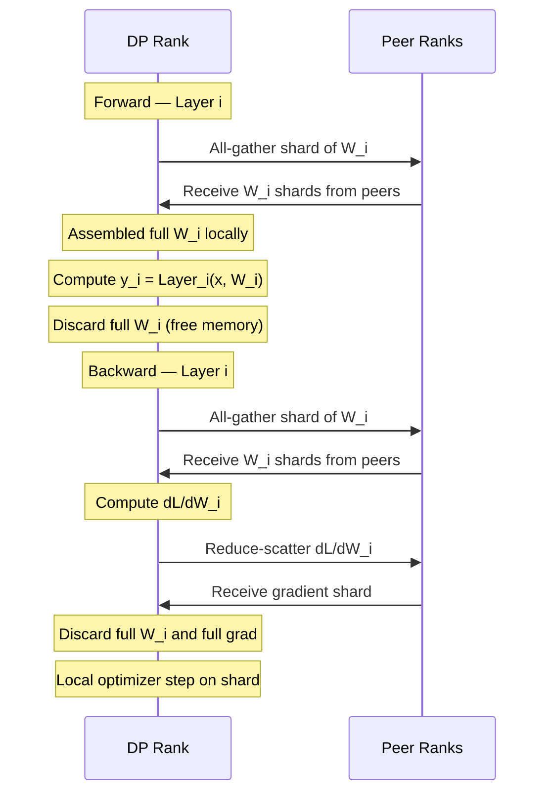
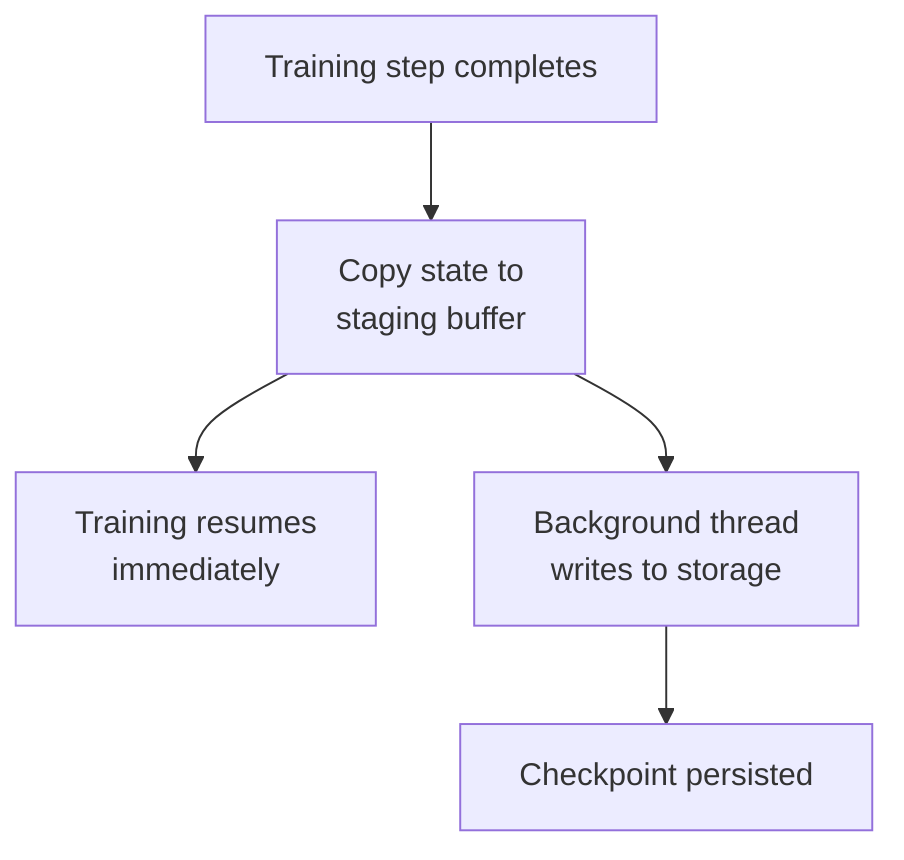
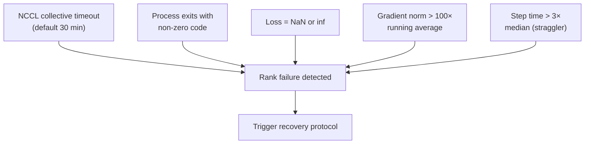
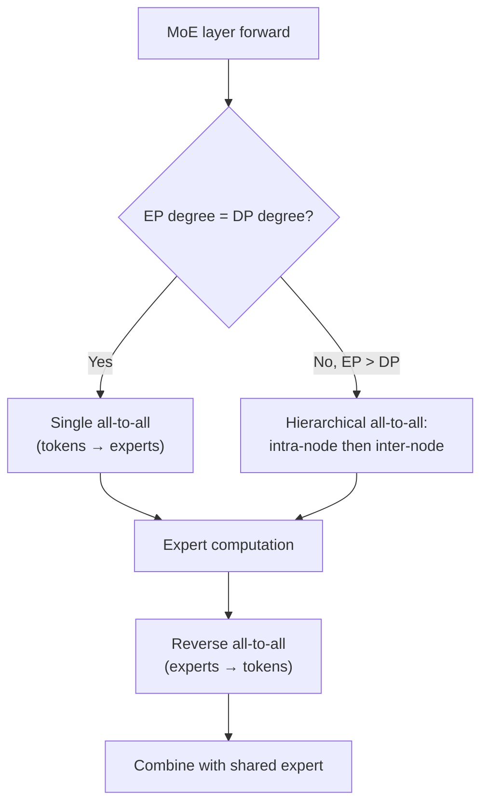
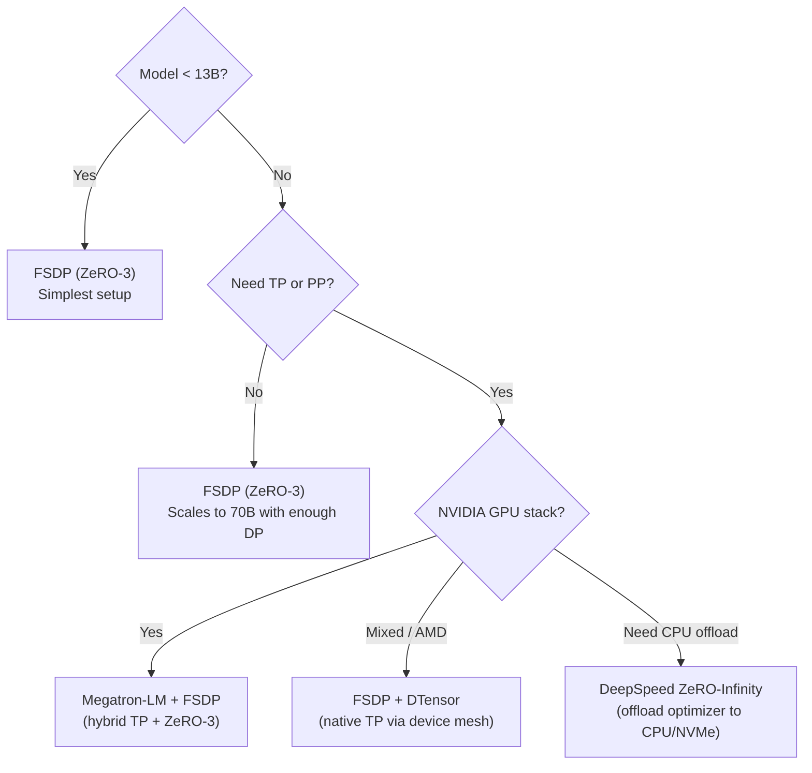
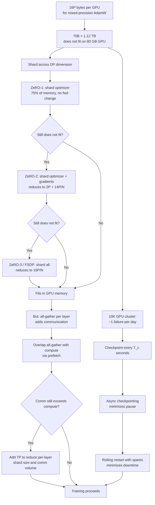

# Distributed Training — FSDP, ZeRO, and Fault Tolerance at Scale

> **Layer:** L7.
> **Prerequisites:** [Parallelism_Strategies](Parallelism_Strategies.md), [Collectives_and_NCCL](Collectives_and_NCCL.md), [Modern_MoE](../L6_Algorithms_and_Models/Modern_MoE.md).
> **Hands off to:** [Training_Optimization](Training_Optimization.md), [Storage_and_Model_Loading](../L4_Systems_and_Interconnects/Storage_and_Model_Loading.md).

---

## 0. Why this page exists

A 70-billion-parameter model trained in mixed-precision BF16 with AdamW requires 16 bytes per parameter of runtime state — 1.12 TB across parameters, gradients, and optimizer moments. A single H100 has 80 GB of HBM. The gap is 14:1, and it grows quadratically with model size. Without sharding, training any model larger than ~4 B parameters is impossible on a single GPU.

ZeRO (Zero Redundancy Optimizer) and its PyTorch-native incarnation FSDP (Fully Sharded Data Parallel) close this gap by partitioning optimizer states, gradients, and parameters across the data-parallel dimension. This page derives the exact memory math for each ZeRO stage, explains FSDP's mechanics, covers checkpointing and fault tolerance at 10K-GPU scale, and addresses the distributed training issues specific to Mixture-of-Experts models.

Four invariants govern this page:

1. **Mixed-precision AdamW consumes 16 bytes per parameter** — 2 (BF16 params) + 2 (BF16 grads) + 4 (FP32 master) + 4 (Adam $m$) + 4 (Adam $v$).
2. **ZeRO-3 memory per GPU is $\frac{16P}{N_{\mathrm{DP}}}$ plus activations** — the divisor is the data-parallel degree, not the total GPU count.
3. **Checkpoint size equals $16P$ bytes** — the same 16 bytes/param, serialized to storage every $T_c$ seconds.
4. **Mean time between failures at 10K GPUs is ~1 day** — fault tolerance is not optional; it is a first-class design constraint.

---

## 1. The optimizer memory wall

### 1.1 Per-parameter cost breakdown

For a transformer with $P$ parameters trained in mixed-precision BF16 with AdamW:

| Tensor | Bytes / param | Dtype | Role |
|---|---|---|---|
| Model parameters | 2 | BF16 | Forward and backward pass |
| Gradients | 2 | BF16 | Backward pass accumulation |
| Master parameters | 4 | FP32 | Optimizer accuracy |
| Adam first moment $m_t$ | 4 | FP32 | Exponential moving average of gradients |
| Adam second moment $v_t$ | 4 | FP32 | Exponential moving average of squared gradients |
| **Total** | **16** | | |

The Adam update rules at step $t$:

$$m_t = \beta_1 \, m_{t-1} + (1 - \beta_1) \, g_t$$

$$v_t = \beta_2 \, v_{t-1} + (1 - \beta_2) \, g_t^2$$

$$\hat{m}_t = \frac{m_t}{1 - \beta_1^t}, \quad \hat{v}_t = \frac{v_t}{1 - \beta_2^t}$$

$$\theta_t = \theta_{t-1} - \eta \left( \frac{\hat{m}_t}{\sqrt{\hat{v}_t} + \epsilon} + \lambda \, \theta_{t-1} \right)$$

Typical values: $\beta_1 = 0.9$, $\beta_2 = 0.95$, $\epsilon = 10^{-8}$, $\lambda = 0.1$.

**Worked problem 1 — minimum GPU count.** How many H100 80 GB GPUs are needed to hold the training state of Llama-3-70B?

$$M_{\text{total}} = 70 \times 10^9 \times 16 \;\text{B} = 1{,}120 \;\text{GB}$$

$$N_{\min} = \left\lceil \frac{1{,}120}{80} \right\rceil = 14 \;\text{GPUs}$$

This is the absolute floor — it ignores activation memory, CUDA context overhead (~2 GB), and temporary buffers. In practice, 14 GPUs cannot train 70B; the real minimum with ZeRO-3 is 16–32 GPUs.

### 1.2 Activation memory

Activation memory dominates when sequence lengths are long. Without recomputation, a single transformer layer stores:

$$M_{\text{act,layer}} = \underbrace{2 \, B \, S \, d}_{\text{hidden activations}} + \underbrace{2 \, B \, H \, S^2}_{\text{attention scores (no FA)}} \;\;\text{bytes (BF16)}$$

With FlashAttention, the $S^2$ term is eliminated (see [FlashAttention_Deep_Dive](../L5_Kernels_and_Programming/FlashAttention_Deep_Dive.md)). The remaining activation memory across $L$ layers:

$$M_{\text{act}} \approx L \cdot 2 \, B \, S \, d \;\;\text{bytes}$$

With full activation recomputation (checkpointing every layer), only layer inputs are stored:

$$M_{\text{act,recomp}} \approx L \cdot 2 \, B \, S \, d \;\;\text{bytes (same formula, but per-checkpoint-region, not per-layer)}$$

The distinction is subtle: full recomputation stores one tensor per layer boundary instead of all intermediate tensors. With $c$ checkpoint segments, activation memory drops to $M_{\text{act}} / c$ at the cost of recomputing forward within each segment during backward.

**Worked problem 2 — activation memory for 70B.** Llama-3-70B has $L = 80$ layers, $d = 8192$, sequence length $S = 8192$, microbatch $B = 1$:

$$M_{\text{act}} \approx 80 \times 2 \times 1 \times 8192 \times 8192 = 10.7 \;\text{GB per microbatch}$$

With activation recomputation ($c = 80$ segments, one per layer):

$$M_{\text{act,recomp}} \approx \frac{10.7}{80} \times 2 \approx 0.27 \;\text{GB (negligible)}$$

The factor of 2 accounts for storing both the segment input and the locally active sub-computation. This is why activation recomputation is always enabled for pretraining.

---

## 2. ZeRO — deriving the memory math

ZeRO eliminates the redundancy of standard data parallelism, where every GPU holds a full copy of all states. It proceeds in three stages, each removing one category of redundancy.

### 2.1 Baseline: standard data parallelism (DDP)

In vanilla `DistributedDataParallel`, each of $N_{\mathrm{DP}}$ ranks holds a complete copy of everything:

$$M_{\mathrm{DDP}} = 16P \;\;\text{bytes per GPU}$$

There is no memory benefit from adding GPUs — the 16$P$ cost is replicated $N_{\mathrm{DP}}$ times. The only benefit is throughput: each rank processes a different microbatch and gradients are all-reduced.

### 2.2 ZeRO stage 1 — partition optimizer states

**Insight:** optimizer states ($m_t$, $v_t$, master FP32 params) account for $\frac{12}{16} = 75\%$ of memory. Each DP rank only needs its own shard to perform the optimizer step.

Partition the $12P$ bytes of optimizer state across $N_{\mathrm{DP}}$ ranks. Each rank owns $\frac{12P}{N_{\mathrm{DP}}}$ bytes of optimizer state plus the full $4P$ bytes of model parameters and gradients:

$$M_{\mathrm{ZeRO\text{-}1}} = 4P + \frac{12P}{N_{\mathrm{DP}}}$$

The factor of $4P$ comes from BF16 parameters ($2P$) plus BF16 gradients ($2P$). The optimizer update is local to each rank's shard; after the step, the updated BF16 parameter shard is communicated if needed.

**Communication:** one reduce-scatter of gradients per step (same total bytes as all-reduce, but each rank receives only $1/N_{\mathrm{DP}}$ of the result). No change to the forward pass.

### 2.3 ZeRO stage 2 — partition optimizer states and gradients

**Insight:** after the backward pass computes gradients, each rank only needs the gradient shard that corresponds to its optimizer state shard.

Use reduce-scatter instead of all-reduce for gradients. Each rank receives and stores only $\frac{2P}{N_{\mathrm{DP}}}$ bytes of gradient:

$$M_{\mathrm{ZeRO\text{-}2}} = 2P + \frac{14P}{N_{\mathrm{DP}}}$$

The $2P$ is the full BF16 parameter copy. The $\frac{14P}{N_{\mathrm{DP}}}$ is $\frac{2P}{N_{\mathrm{DP}}}$ (gradient shard) + $\frac{12P}{N_{\mathrm{DP}}}$ (optimizer shard).

**Communication:** reduce-scatter of gradients during backward (same volume as all-reduce, but each rank stores $1/N_{\mathrm{DP}}$ of the result). Still no change to forward pass.

### 2.4 ZeRO stage 3 / FSDP — partition everything

**Insight:** parameters themselves are redundant across DP ranks. Each rank only needs the full parameter set during the forward and backward passes of its own layers — parameters can be gathered just-in-time.

Partition the $2P$ bytes of BF16 parameters across $N_{\mathrm{DP}}$ ranks. Before each layer's forward, gather the full parameter set via all-gather; after the layer's backward, discard the gathered parameters:

$$M_{\mathrm{ZeRO\text{-}3}} = \frac{16P}{N_{\mathrm{DP}}}$$

This is the ideal: memory scales as $\mathcal{O}(1/N_{\mathrm{DP}})$.

**Communication:** two all-gathers per layer (forward + backward) plus one reduce-scatter per layer (gradient). Total communication volume per step equals the DDP all-reduce volume — but it is spread across the forward and backward passes and overlapped with compute.

### 2.5 Memory comparison table

| Stage | Params | Gradients | Optimizer state | Memory per GPU | Comm per step |
|---|---|---|---|---|---|
| DDP | Full ($2P$) | Full ($2P$) | Full ($12P$) | $16P$ | All-reduce ($2P$) |
| ZeRO-1 | Full ($2P$) | Full ($2P$) | Sharded ($\frac{12P}{N}$) | $4P + \frac{12P}{N}$ | Reduce-scatter ($2P$) |
| ZeRO-2 | Full ($2P$) | Sharded ($\frac{2P}{N}$) | Sharded ($\frac{12P}{N}$) | $2P + \frac{14P}{N}$ | Reduce-scatter ($2P$) |
| ZeRO-3 | Sharded ($\frac{2P}{N}$) | Sharded ($\frac{2P}{N}$) | Sharded ($\frac{12P}{N}$) | $\frac{16P}{N}$ | All-gather + reduce-scatter ($2 \times 2P$) |

Where $N = N_{\mathrm{DP}}$.

### 2.6 Numerical comparison

For a 70B-parameter model on $N_{\mathrm{DP}} = 64$ DP ranks:

| Stage | Memory per GPU |
|---|---|
| DDP | $16 \times 70 = 1{,}120$ GB |
| ZeRO-1 | $4 \times 70 + 12 \times 70 / 64 = 293.1$ GB |
| ZeRO-2 | $2 \times 70 + 14 \times 70 / 64 = 155.3$ GB |
| ZeRO-3 | $16 \times 70 / 64 = 17.5$ GB |

ZeRO-3 at 64 DP ranks brings the per-GPU memory to 17.5 GB — trivially fitting in 80 GB HBM with room for activations, CUDA context, and temporary buffers. Adding activation memory (~10 GB without recomputation, ~0.3 GB with) gives total per-GPU memory of 17.8–27.5 GB, well within the 80 GB budget.

---

## 3. FSDP mechanics — how ZeRO-3 is implemented

### 3.1 Module wrapping and sharding

FSDP wraps PyTorch `nn.Module` instances. When a module is wrapped, its parameters are flattened into a single contiguous tensor and sharded across the DP group:

```python
from torch.distributed.fsdp import FullyShardedDataParallel as FSDP, ShardingStrategy

model = FSDP(
    model,
    sharding_strategy=ShardingStrategy.FULL_SHARD,   # ZeRO-3
    device_id=torch.cuda.current_device(),
)
```

The `sharding_strategy` parameter controls the ZeRO stage:

| Strategy | Equivalent |
|---|---|
| `NO_SHARD` | DDP (no sharding) |
| `SHARD_GRAD_OP` | ZeRO-2 |
| `FULL_SHARD` | ZeRO-3 |

### 3.2 The forward-backward cycle



**Forward pass (layer $i$):**

1. **All-gather:** Each rank contributes its shard of $W_i$. The all-gather reconstructs the full parameter tensor on every rank. This is the only point where the full parameter exists in memory.
2. **Compute:** The forward computation for layer $i$ executes normally, as if the model were unsharded.
3. **Free:** Immediately after the layer completes, the gathered parameters are freed. Only the local shard remains.

**Backward pass (layer $i$, in reverse order):**

1. **All-gather:** Same as forward — reconstruct full $W_i$.
2. **Compute gradients:** $\nabla_{W_i} \mathcal{L}$ is computed against the full parameter set.
3. **Reduce-scatter:** The gradient is reduce-scattered so each rank receives only its shard of $\nabla_{W_i} \mathcal{L}$.
4. **Free:** Discard full parameters and full gradients. The local gradient shard is accumulated.
5. **Optimizer step:** Each rank updates its local shard of optimizer state and master parameters.

### 3.3 Communication-compute overlap

The key performance optimization in FSDP is overlapping the all-gather of layer $i+1$ with the compute of layer $i$. The implementation prefetches parameters during the current layer's computation:

```mermaid
gantt
    title FSDP forward pass — overlapped all-gather
    dateFormat X
    axisFormat %s

    section Layer i
    Compute layer i          : 0, 100
    Prefetch W_{i+1} (all-gather) : 30, 90

    section Layer i+1
    Compute layer i+1        : 100, 200
    Prefetch W_{i+2} (all-gather) : 130, 190
```



Without overlap, all-gather of all layers serializes with compute, roughly doubling the wall-clock time compared to DDP. With overlap, the communication is hidden behind compute as long as:

$$T_{\text{all-gather, layer}} < T_{\text{compute, layer}}$$

For a transformer layer with hidden dimension $d$ and microbatch tokens $T_{\text{tok}} = B \cdot S$:

$$T_{\text{compute}} \approx \frac{24 \, d^2 \, T_{\text{tok}}}{\text{FLOP/s}_{\text{GPU}}}$$

$$T_{\text{all-gather}} \approx \frac{2 \, d \, T_{\text{tok}} \cdot (N_{\mathrm{DP}} - 1) / N_{\mathrm{DP}}}{\text{BW}_{\text{inter-node}}}$$

Overlap succeeds when compute time exceeds all-gather time, which typically holds for $d \geq 4096$ on NVLink-connected nodes.

### 3.4 Hierarchical sharding (Hybrid FSDP)

When TP is used within a node and FSDP across nodes, parameters are already sharded by TP within the NVLink domain. FSDP then shards across the inter-node DP dimension. This two-level hierarchy reduces inter-node communication:

- **Intra-node (TP):** parameters sharded across 8 GPUs via NVLink — fast all-reduce per layer.
- **Inter-node (FSDP):** optimizer states sharded across DP nodes — reduce-scatter across the slower network.

The effective memory per GPU for TP=$T$, FSDP (ZeRO-3) across $N_{\mathrm{DP}}$ ranks:

$$M_{\text{GPU}} = \frac{16P}{T \cdot N_{\mathrm{DP}}} + M_{\text{act}}$$

**Worked problem 3 — 70B on 64 H100s.** Design the parallelism layout with TP=8, FSDP (ZeRO-3) across 8 DP ranks (8 nodes of 8 GPUs each):

$$M_{\text{GPU}} = \frac{16 \times 70 \times 10^9}{8 \times 8} = \frac{1{,}120 \;\text{GB}}{64} = 17.5 \;\text{GB}$$

Adding activation memory (~10 GB without recomputation, ~0.3 GB with) gives total per-GPU memory of 17.8–27.5 GB, well within the 80 GB budget. Pipeline parallelism is unnecessary at this scale.

---

## 4. Checkpointing

### 4.1 What to save

A complete training checkpoint contains:

| Component | Size | Purpose |
|---|---|---|
| BF16 model parameters | $2P$ | Model weights |
| FP32 master parameters | $4P$ | Optimizer base |
| Adam $m_t$ | $4P$ | First moment |
| Adam $v_t$ | $4P$ | Second moment |
| BF16 gradients | $2P$ | Optional (often re-derived) |
| LR scheduler state | $\sim$KB | Step counter, LR value |
| RNG state | $\sim$KB | Reproducibility |
| Data cursor | $\sim$KB | Token count consumed |
| **Total** | $\approx 16P$ | |

For common model sizes:

| Model | $P$ | Checkpoint size |
|---|---|---|
| 7B | $7 \times 10^9$ | 112 GB |
| 70B | $7 \times 10^{10}$ | 1.12 TB |
| 405B | $4.05 \times 10^{11}$ | 6.48 TB |
| 671B MoE | $6.71 \times 10^{11}$ | 10.7 TB |

### 4.2 Synchronous checkpointing

The simplest strategy: stop training, write checkpoint to storage, resume.

**Cost model.** With $N_{\mathrm{DP}}$ ranks writing in parallel at aggregate bandwidth $\text{BW}_{\text{write}}$:

$$T_{\text{sync}} = \frac{16P}{N_{\mathrm{DP}} \cdot \text{BW}_{\text{rank}}}$$

For 405B with 128 DP ranks writing to local NVMe at 5 GB/s per rank:

$$T_{\text{sync}} = \frac{6{,}480 \;\text{GB}}{128 \times 5 \;\text{GB/s}} = 10.1 \;\text{s}$$

At 10 seconds per checkpoint saved hourly, the overhead is 0.28% — acceptable. But if checkpoints go to remote object storage (S3) at 1 GB/s per rank:

$$T_{\text{sync}} = \frac{6{,}480}{128 \times 1} = 50.6 \;\text{s} \quad (1.4\% \text{ overhead})$$

### 4.3 Asynchronous checkpointing

PyTorch Distributed Checkpoint (DCP) decouples the write from training:



The staging buffer requires $16P / N_{\mathrm{DP}}$ bytes of extra GPU or CPU memory. For 70B with 64 DP ranks, that is $1{,}120/64 = 17.5$ GB per rank — manageable in CPU RAM.

The trade-off: if a failure occurs between the staging copy and the storage write, the checkpoint is lost. This creates a window of vulnerability approximately equal to $T_{\text{write}}$. Mitigation: write to local NVMe first (fast), then asynchronously replicate to remote storage.

### 4.4 Distributed checkpointing

In a distributed checkpoint, each rank writes only its local shard. The checkpoint is a directory of per-rank files plus a metadata file recording the world size, TP/PP/DP decomposition, and shard map:

```
checkpoint/
  metadata.json          # world_size, dp_degree, tp_degree, pp_degree
  rank_00000.pt          # shard for rank 0
  rank_00001.pt          # shard for rank 1
  ...
  rank_NNNNN.pt          # shard for rank N-1
```

On restore, each rank reads only its own shard. This eliminates the need for any rank to hold the full model — critical for models that exceed single-node memory.

**Resharding.** If the world size changes between save and restore (elastic training, different cluster), a reshard utility re-partitions the checkpoint. The metadata file contains enough information to reconstruct the full parameter set on a single node and re-shard.

---

## 5. Fault tolerance

### 5.1 Failure modes at scale

At 10K GPUs, failures are not exceptional — they are expected. Empirical failure rates from production training runs:

| Failure type | MTBF (10K GPUs) | Detection mechanism |
|---|---|---|
| GPU hardware (ECC, hang) | ~24 hours | NCCL timeout, CUDA error |
| Network link flap | ~6 hours | NCCL abort, IB counter |
| Node power / cooling | ~72 hours | Job scheduler health check |
| Software OOM | Variable | Process killed (SIGKILL) |
| Silent data corruption | ~1000 hours | Loss NaN, gradient norm spike |

The composite MTBF across all failure types for a 10K-GPU cluster is approximately 4–8 hours. A 30-day pretraining run experiences 90–180 failure events.

### 5.2 Detecting failures



Detection latency matters: a silent hang in NCCL can waste 30 minutes of compute (the default timeout). Production systems reduce this to 60–120 seconds via:

- **NCCL timeout override:** `NCCL_COMM_BLOCKING=1` with custom watchdog threads.
- **Heartbeat monitors:** each rank sends a heartbeat every 10 seconds; missing 3 heartbeats triggers failure.
- **Loss watchdog:** an independent thread monitors loss values and alerts on NaN, inf, or $>10\times$ spike.

### 5.3 Recovery strategies

**Strategy 1: Restart from checkpoint.** The simplest approach. On failure, terminate the entire job and resubmit from the last checkpoint.

$$\text{Wasted compute per failure} = T_{\text{checkpoint\_interval}} \times N_{\text{GPU}}$$

With hourly checkpointing and 10K GPUs: ~5,000 GPU-hours lost per failure. At $3/\text{GPU-hour}$: $15,000 per failure. With 90 failures over 30 days: $1.35M in wasted compute.

**Strategy 2: Rolling restart with spares.** Allocate $N_{\text{GPU}} + N_{\text{spare}}$ GPUs (typically 2–5% spare). On failure:

1. Identify the failed rank and its node.
2. Exclude the node from the job.
3. Map the excluded rank's work to a spare node.
4. Load the most recent checkpoint (or in-memory replica).
5. Resume training with a new world configuration.

This approach requires elastic training support: the ability to reconfigure DP/TP/PP groups at runtime.

**Strategy 3: In-memory replication.** Before each checkpoint, each rank replicates its state to a neighbor rank's CPU RAM via RDMA. On failure, the neighbor restores the failed rank's state to a spare GPU.

Recovery time: state transfer from neighbor RAM to spare GPU via PCIe (~5–10 seconds for 17.5 GB at 32 GB/s). Compare to loading from NVMe (~3.5 seconds) or S3 (~17.5 seconds). In-memory replication is fastest but doubles the per-rank CPU memory requirement.

### 5.4 Elastic training

Elastic training adjusts the parallelism configuration when the number of available GPUs changes. The key challenge is maintaining training correctness when $N_{\mathrm{DP}}$ changes:

- **Optimizer state:** must be re-sharded to the new $N_{\mathrm{DP}}$. Each rank's optimizer shard is split or merged accordingly.
- **Learning rate:** the per-step learning rate depends on the global batch size, which depends on $N_{\mathrm{DP}}$. When $N_{\mathrm{DP}}$ changes, the learning rate schedule must be adjusted.
- **Gradient accumulation:** if $N_{\mathrm{DP}}$ decreases, gradient accumulation steps must increase to maintain the same effective batch size.

PyTorch Elastic (torchrun) provides the infrastructure for dynamic world size management, re-spawning worker processes, and rendezvous on the new configuration.

### 5.5 Cost model for checkpoint interval

The optimal checkpoint interval minimizes the total cost of checkpointing plus recompute. Let $T_c$ be the checkpoint interval, $T_s$ the time to save a checkpoint, $T_f$ the mean time between failures, and $T_r$ the time to restore:

$$\text{Overhead} = \frac{T_s}{T_c} + \frac{T_c / 2}{T_f}$$

The first term is the fraction of time spent saving; the second is the expected wasted compute (on average, half a checkpoint interval is lost per failure). Minimizing over $T_c$:

$$T_c^* = \sqrt{2 \, T_s \, T_f}$$

With $T_s = 10$ s and $T_f = 4$ hours (14,400 s):

$$T_c^* = \sqrt{2 \times 10 \times 14{,}400} = 537 \;\text{s} \approx 9 \;\text{minutes}$$

In practice, checkpoints are saved less frequently (every 30–60 minutes) because the overhead of frequent checkpointing extends total training time. The mathematical optimum assumes checkpoint cost is purely time; in reality, storage wear and I/O contention also factor in.

**Worked problem 4 — checkpoint cost.** For a 70B model trained on 512 H100s for 14 days with hourly checkpointing, compute the expected wasted compute. Assume MTBF = 8 hours at this scale.

Failures expected: $14 \times 24 / 8 = 42$ failures.

Wasted compute per failure: $0.5 \;\text{hours} \times 512 = 256$ GPU-hours.

Total wasted compute: $42 \times 256 = 10{,}752$ GPU-hours.

Total planned compute: $14 \times 24 \times 512 = 172{,}032$ GPU-hours.

Waste fraction: $10{,}752 / 172{,}032 = 6.3\%$.

At $3/GPU-hour: $32,256 in wasted compute. Reducing the checkpoint interval to 30 minutes would halve this to 3.1%.

---

## 6. MoE-specific distributed training

MoE models introduce expert parallelism (EP), which creates unique distributed training challenges beyond dense models. See [Modern_MoE](../L6_Algorithms_and_Models/Modern_MoE.md) for the architectural context.

### 6.1 Expert parallelism communication pattern

In EP, each DP rank holds a subset of experts. During the forward pass through an MoE layer:

1. **Dispatch (all-to-all):** Tokens are sent to the GPUs hosting their assigned experts. Each token carries its hidden state ($d$ elements) to the target expert's GPU.
2. **Expert computation:** Each GPU computes the FFN for the tokens it received.
3. **Combine (all-to-all):** Expert outputs are sent back to the token's original GPU.

$$\text{Comm per MoE layer} = 2 \times \underbrace{B \cdot S \cdot d \cdot \frac{k}{E}}_{\text{tokens dispatched per rank}} \times 2 \;\text{bytes (BF16)}$$

For DeepSeek-V3 ($B \cdot S = 4096$ tokens, $d = 7168$, $k = 8$, $E = 256$, EP = 64):

$$\text{Dispatch volume} = 2 \times 4096 \times 7168 \times \frac{8}{256} \times 2 = 3{,}670 \;\text{MB per MoE layer}$$

With 58 MoE layers in DeepSeek-V3, total all-to-all volume per training step:

$$V_{\text{MoE, total}} = 58 \times 3{,}670 \;\text{MB} \approx 213 \;\text{GB}$$

This dominates communication cost and must stay within high-bandwidth fabric (NVLink or NVL).

### 6.2 Expert balance across nodes

Load imbalance in MoE training has a direct throughput cost: the slowest EP rank determines the step time. If one rank receives $1.5\times$ the average token count, it becomes the bottleneck and all other ranks idle during the expert computation phase.

**Load balancing mechanisms:**

| Mechanism | How it works | Overhead |
|---|---|---|
| Auxiliary loss | Penalize uneven expert utilization in the training loss | Adds bias to routing; harms quality |
| Bias-based (DeepSeek-V3) | Per-expert bias term adjusted online to equalize load | No quality impact; requires tuning of update rate |
| Capacity factor ($C_f$) | Hard cap on tokens per expert; excess tokens are dropped or passed through | $C_f < 1$ drops tokens (quality loss); $C_f > 1$ wastes memory |
| EP-aware batch packing | Pre-sort tokens in a microbatch to equalize per-expert counts | Requires data-loader changes; latency overhead |

DeepSeek-V3's aux-loss-free approach with bias tuning is the current best practice. The bias for expert $i$ is updated as:

$$b_i \leftarrow b_i + \gamma \cdot (\bar{n}_i - N_{\text{target}})$$

where $\bar{n}_i$ is the recent average token count for expert $i$, $N_{\text{target}}$ is the target count, and $\gamma$ is a small update rate (typically 0.01).

### 6.3 EP communication optimization



When EP spans multiple nodes, the all-to-all crosses the inter-node network bottleneck. Optimizations:

- **Expert placement:** co-locate frequently co-activated experts on the same node. This reduces inter-node dispatch volume.
- **Overlap with compute:** begin dispatching tokens for layer $i+1$ while computing layer $i$'s experts — analogous to FSDP's parameter prefetch.
- **Token dropping:** when $C_f < 1$, drop excess tokens rather than blocking. The dropped tokens' hidden states are passed through unchanged. Used in training (with $C_f \approx 0.8\text{–}1.0$); not in inference.

### 6.4 MoE training memory

MoE models have larger total parameter counts but similar per-expert sizes. The memory calculation for ZeRO-3/FSDP applies to the total parameter count $P_{\text{total}}$:

$$M_{\text{GPU, MoE}} = \frac{16 \, P_{\text{total}}}{N_{\mathrm{DP}} \cdot \text{EP}} + M_{\text{act}} + M_{\text{dispatch\_buffer}}$$

The dispatch buffer holds tokens received from other ranks during the all-to-all:

$$M_{\text{dispatch}} = B \cdot S \cdot \frac{k}{E} \cdot d \cdot 2 \;\text{bytes}$$

For DeepSeek-V3: $4096 \times (8/256) \times 7168 \times 2 = 1.84$ MB per MoE layer — negligible compared to the parameter memory.

---

## 7. Framework comparison

### 7.1 Feature matrix

| Feature | FSDP (PyTorch) | DeepSpeed | Megatron-LM |
|---|---|---|---|
| ZeRO-1 / ZeRO-2 / ZeRO-3 | Yes (via sharding_strategy) | Yes (ZeRO origin) | No (uses TP/PP for memory) |
| Tensor parallelism | Via DTensor + DeviceMesh | Via Megatron integration | Native (reference implementation) |
| Pipeline parallelism | Via PiPPy / device mesh | Yes (1F1B, interleaved) | Yes (1F1B, interleaved, V-shape) |
| Sequence parallelism | Via DTensor | No | Yes (ring attention, context parallel) |
| Expert parallelism | Via DTensor + MoE APIs | Yes (DeepSpeed-MoE) | Yes (Megatron-Core MoE) |
| Activation recomputation | Yes (checkpoint_wrapper) | Yes (activation_checkpointing) | Yes (selective, per-layer) |
| Async checkpointing | Yes (DCP — distributed checkpoint) | Yes (DeepSpeed checkpoint) | Manual / external |
| Offload to CPU/NVMe | No (GPU-only) | Yes (ZeRO-Offload, ZeRO-Infinity) | No |
| Mixed precision | Native (AMP) | Native (AMP, BF16, FP8 via TE) | Via Transformer Engine |
| Ecosystem integration | torch.compile, TorchDynamo | HF Accelerate, Deepspeed-MoE | NVIDIA NeMo, Megatron-Core |
| Open source | Yes (PyTorch repo) | Yes (Microsoft) | Yes (NVIDIA) |
| Production users | Meta (Llama), Lightning | Microsoft, academic labs | NVIDIA, MosaicML, Cohere |

### 7.2 Choosing a framework



**Rules of thumb:**

1. **Start with FSDP.** It is PyTorch-native, composable with `torch.compile`, and handles models up to ~100B with sufficient DP.
2. **Add TP (Megatron-LM or DTensor) when FSDP communication becomes the bottleneck.** This happens when the all-gather per layer exceeds the layer's compute time — typically at $d > 8192$ or with slow inter-node networks.
3. **Add PP when the model exceeds one node's memory even with TP.** Each PP stage holds a subset of layers; the pipeline bubble overhead is acceptable when $M \gg P$ (many microbatches per pipeline).
4. **Use DeepSpeed for CPU offloading** when GPU memory is scarce and CPU RAM is abundant (e.g., academic clusters with older GPUs).

### 7.3 Communication volume comparison

For a single training step with a 70B model, $B \cdot S = 4096$ tokens per microbatch, $L = 80$ layers:

| Configuration | Comm per step (GB) | Comm type |
|---|---|---|
| DDP ($N_{\mathrm{DP}} = 64$) | $2 \times 140 = 280$ | All-reduce |
| FSDP / ZeRO-3 ($N_{\mathrm{DP}} = 64$) | $2 \times 2 \times 80 \times \frac{2 \times 70}{64} = 700$ | All-gather + reduce-scatter |
| TP=8 ($N_{\mathrm{DP}} = 1$) | $2 \times 80 \times 2 \times 0.008 \times 8 = 20.5$ | All-reduce per layer |
| TP=8 + FSDP ($N_{\mathrm{DP}} = 8$) | $20.5 + 87.5 = 108$ | Combined |

Note: FSDP total communication is higher than DDP's (two all-gathers + one reduce-scatter per layer vs one all-reduce per step), but FSDP's communication is overlapped with compute. DDP's all-reduce blocks the entire backward pass. Effective throughput with overlap makes FSDP faster despite higher total bytes moved.

---

## 8. Cause / effect — from memory wall to distributed training



---

## 9. Worked problem 5 — end-to-end layout design

**Problem.** Design the distributed training layout for a 405B dense model on 4,096 H100 GPUs (512 nodes of 8 GPUs each). Sequence length $S = 8192$, microbatch $B = 1$.

**Step 1: Memory requirement.**

$$M_{\text{total}} = 16 \times 405 = 6{,}480 \;\text{GB}$$

$$M_{\text{act}} \approx 126 \times 2 \times 1 \times 8192 \times 16384 \approx 33.8 \;\text{GB (no recomputation)}$$

$$M_{\text{act,recomp}} \approx 1 \;\text{GB (with selective recomputation)}$$

**Step 2: Choose TP.** Set TP = 8 (intra-node NVLink). Parameter memory per GPU after TP:

$$M_{\text{params,TP8}} = \frac{6{,}480}{8} = 810 \;\text{GB}$$

Still 10x too large. Need additional sharding.

**Step 3: Choose PP.** With 126 layers, set PP = 8 stages (~16 layers per stage). Memory per GPU after TP + PP:

$$M_{\text{params,TP8\_PP8}} = \frac{6{,}480}{8 \times 8} = 101.3 \;\text{GB}$$

Still exceeds 80 GB when including activations and overhead.

**Step 4: Add ZeRO-1 (FSDP shard optimizer).** Remaining GPUs for DP: $4096 / (8 \times 8) = 64$ DP ranks.

$$M_{\text{ZeRO-1}} = \frac{4 \times 405 \times 10^9}{8 \times 8} + \frac{12 \times 405 \times 10^9}{8 \times 8 \times 64}$$

$$= 31.6 \;\text{GB (params + grads)} + 1.5 \;\text{GB (optimizer shard)} = 33.1 \;\text{GB}$$

Adding activations (~1 GB with recomputation): total ~34 GB. Fits in 80 GB with headroom.

**Step 5: Verify communication.**

- TP: 2 all-reduces per layer per stage, payload $\approx 2 \times B \times S \times d = 2 \times 8192 \times 16384 = 0.25$ GB. At NVLink 900 GB/s: negligible.
- PP: point-to-point activation transfer between stages. Payload per microbatch: $2 \times B \times S \times d = 0.25$ GB. At 400 Gb/s InfiniBand: ~5 ms per transfer.
- ZeRO-1: reduce-scatter of gradients once per step, payload $\approx 2P = 810$ GB (full grad). At 50 GB/s inter-node: ~16 s per step — too slow.

**Step 5 revision: Use ZeRO-3 instead.** With ZeRO-3, communication is all-gather + reduce-scatter per layer (not per step), overlapped with compute:

$$M_{\text{ZeRO-3}} = \frac{6{,}480}{8 \times 8 \times 64} = 1.6 \;\text{GB}$$

Adding activations: ~2.6 GB total. Very comfortable.

Communication per layer per stage: all-gather of $\frac{2 \times 405 \times 10^9}{8 \times 8 \times 64} = 0.2$ GB. At 50 GB/s: 4 ms per all-gather. Compute per layer: ~15 ms. Overlap is feasible.

**Final layout:**

$$\text{TP} = 8, \quad \text{PP} = 8, \quad N_{\mathrm{DP}} = 64, \quad \text{FSDP (ZeRO-3)}$$

$$N_{\text{GPU}} = 8 \times 8 \times 64 = 4{,}096 \checkmark$$

---

## 10. Key numbers

| Quantity | Value | Note |
|---|---|---|
| Memory per param (mixed-precision AdamW) | 16 B | 2+2+4+4+4 |
| ZeRO-3 memory per GPU | $16P / N_{\mathrm{DP}}$ | Plus activations |
| Activation memory (no recomp, per layer) | $2 \cdot B \cdot S \cdot d$ bytes | FlashAttention assumed |
| Activation memory (full recomp) | $\sim 2 \cdot B \cdot S \cdot d / c$ | $c$ = checkpoint segments |
| Checkpoint size | $16P$ bytes | Full training state |
| Optimal checkpoint interval | $\sqrt{2 \, T_s \, T_f}$ | Minimizes waste |
| MTBF at 10K GPUs | ~4–8 hours | All failure types |
| EP all-to-all per MoE layer | $2 \cdot B \cdot S \cdot d \cdot (k/E) \cdot 2$ bytes | Dispatch + combine |
| FSDP all-gather per layer | $2P / N_{\mathrm{DP}}$ bytes | Per rank |

---

## 11. References

**Foundational**

- R. Rajbhandari et al., "ZeRO: Memory Optimizations Toward Training Trillion Parameter Models," *SC*, 2020.
- S. Smith et al., "Using DeepSpeed and Megatron to Train Megatron-Turing NLG 530B," *SC*, 2022.
- V. Korthikanti et al., "Reducing Activation Recomputation in Large Transformer Models," *MLSys*, 2023.
- M. R. Washington et al., "Checkpointing at Scale for Llama-3 Training," *NSDI*, 2025.

**FSDP**

- PyTorch Team, "Getting Started with Fully Sharded Data Parallel (FSDP)," 2023.
- PyTorch Team, "PyTorch Distributed Checkpoint (DCP)," 2024.
- Meta, "Llama 3 Model Card and Training Details," 2024.

**MoE training**

- DeepSeek-AI, "DeepSeek-V3 Technical Report," 2024.
- B. Fedus et al., "Switch Transformers: Scaling to Trillion Parameter Models," *JMLR*, 2022.

**Fault tolerance**

- J. W. Young, "A First Order Approximation to the Optimum Checkpoint Interval," *CACM*, 1974.
- TorchElastic documentation, PyTorch, 2024.

**Cross-references**

- [Parallelism_Strategies](Parallelism_Strategies.md) — DP, TP, PP, EP, CP, SP with communication volume math.
- [Collectives_and_NCCL](Collectives_and_NCCL.md) — all-reduce, reduce-scatter, all-gather algorithms and bandwidth modeling.
- [Modern_MoE](../L6_Algorithms_and_Models/Modern_MoE.md) — MoE architecture, routing, and load balancing.
- [Storage_and_Model_Loading](../L4_Systems_and_Interconnects/Storage_and_Model_Loading.md) — checkpoint formats, I/O paths, and model loading.
- [Training_Optimization](Training_Optimization.md) — mixed precision, gradient accumulation, Transformer Engine.

---

**Up the stack:** [Training_Optimization](Training_Optimization.md), [Modern_Post_Training](Modern_Post_Training.md).
**Down the stack:** [Parallelism_Strategies](Parallelism_Strategies.md), [Collectives_and_NCCL](Collectives_and_NCCL.md), [Modern_MoE](../L6_Algorithms_and_Models/Modern_MoE.md).
