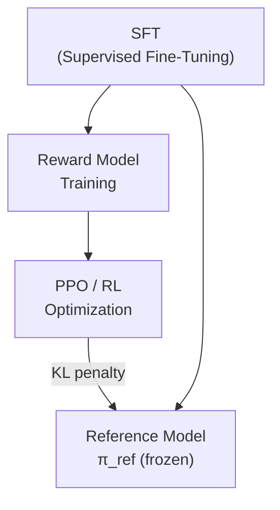
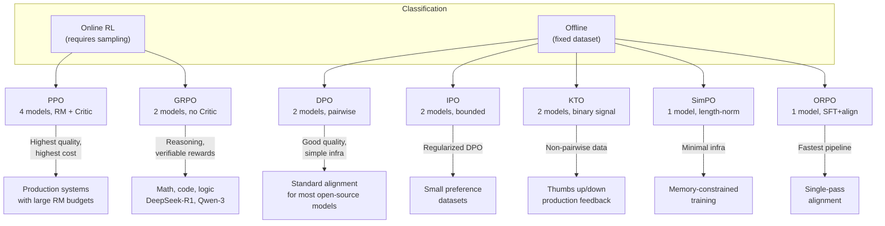
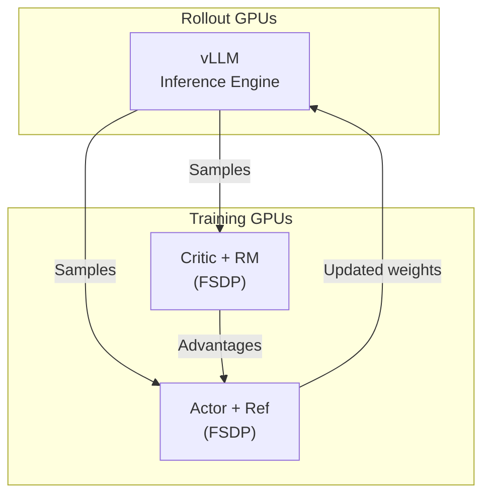
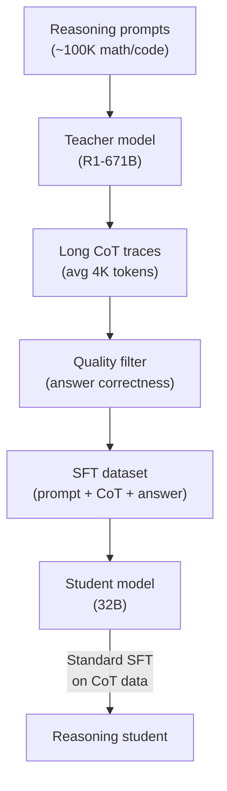

# Modern Post-Training — Alignment, RLHF, and Reasoning

> **Layer:** L7.
> **Prerequisites:** [Training_Optimization](Training_Optimization.md), [Transformer_Internals](../L6_Algorithms_and_Models/Transformer_Internals.md).
> **Hands off to:** [Reasoning_Models](Reasoning_Models.md), [Frontier_Models_2025_2026](../L6_Algorithms_and_Models/Frontier_Models_2025_2026.md).

---

## 0. Why this page exists

A base pretrained model is a raw instrument. It predicts the next token over the internet's entire distribution — fiction, code, conspiracy, and calculus alike. Post-training reshapes this distribution so that the model behaves usefully, safely, and (increasingly) with extended reasoning. Every frontier model released since 2023 undergoes post-training; for models like DeepSeek-R1 and o3, post-training is the dominant story.

This page covers the complete mathematical and engineering landscape of modern post-training:

1. **The RLHF pipeline** — reward model training, PPO with clipped surrogate objective, full derivation.
2. **DPO and its descendants** — IPO, KTO, SimPO, ORPO — each eliminates some component of the RLHF machinery.
3. **GRPO** — group relative policy optimization, the method behind DeepSeek-R1's reasoning capabilities, with full derivation.
4. **Online RL infrastructure** — TRL, OpenRLHF, veRL, NeMo-Aligner.
5. **Distillation from reasoning teachers** — transferring chain-of-thought behavior.

**Four invariants governing post-training:**

1. **The KL constraint is inescapable.** Every alignment method implicitly or explicitly penalizes divergence from the reference policy $\pi_{\text{ref}}$. Without it, the policy collapses to reward hacking.
2. **The reward signal is the bottleneck.** Whether learned (RLHF), implicit (DPO), or rule-based (GRPO for math), reward quality determines alignment quality.
3. **On-policy data dominates.** Methods using current-policy samples (PPO, GRPO, online DPO) consistently outperform offline methods, at higher infrastructure cost.
4. **Compute for post-training is 0.1–5% of pretraining.** But it determines 90% of user-facing quality. The ROI on post-training compute is orders of magnitude higher than on pretraining compute.

---

## 1. The RLHF pipeline — reward model training

### 1.1 Pipeline overview

The classical RLHF pipeline has three stages:

Stage 1 (SFT) produces a reasonable starting policy $\pi_{\text{ref}}$. Stage 2 trains a reward model $r_\theta$ from human preference data. Stage 3 optimizes the policy against $r_\theta$ while staying close to $\pi_{\text{ref}}$.

### 1.2 Preference data format

Given a prompt $x$, a human annotator ranks $K$ responses. For the pairwise case ($K = 2$), each datum is $(x, y_w, y_l)$ where $y_w \succ y_l$ (winner and loser). The Bradley-Terry model assigns:

$$
P(y_w \succ y_l \mid x) = \sigma\!\left(r(x, y_w) - r(x, y_l)\right)
$$

where $\sigma$ is the logistic function and $r(x, y)$ is the scalar reward.

### 1.3 Reward model training

The reward model $r_\theta$ (typically initialized from the SFT model with a scalar head replacing the language model head) is trained by minimizing the negative log-likelihood of the preference data:

$$
\mathcal{L}_{\text{RM}}(\theta) = -\mathbb{E}_{(x, y_w, y_l)}\left[\log \sigma\!\left(r_\theta(x, y_w) - r_\theta(x, y_l)\right)\right]
$$

The gradient with respect to $\theta$ is:

$$
\nabla_\theta \mathcal{L}_{\text{RM}} = -\mathbb{E}\left[\left(1 - \sigma\!\left(r_\theta(x, y_w) - r_\theta(x, y_l)\right)\right) \nabla_\theta\!\left(r_\theta(x, y_w) - r_\theta(x, y_l)\right)\right]
$$

The model pushes $r_\theta(x, y_w)$ above $r_\theta(x, y_l)$ with magnitude proportional to how wrong the current ranking is.

### 1.4 Reward model scaling

| RM Size | Pretrained Base | RM Training Data | Accuracy (Chatbot Arena correlation) |
|---|---|---|---|
| 7B | Llama-3-8B | 100K pairs | ~0.72 |
| 34B | Llama-3-70B | 500K pairs | ~0.81 |
| 70B | Llama-3-70B | 1M pairs | ~0.87 |
| Ensemble (3×70B) | — | — | ~0.91 |

Reward model quality scales with both parameter count and preference data volume. The relationship is approximately power-law: accuracy improves as $N_{\text{RM}}^{0.15} \cdot D_{\text{pref}}^{0.25}$ where $N_{\text{RM}}$ is RM parameters and $D_{\text{pref}}$ is preference pairs.

---

## 2. PPO — Proximal Policy Optimization for LLMs

### 2.1 The PPO objective

PPO optimizes the policy $\pi_\theta$ by maximizing a clipped surrogate objective. Given a prompt $x$, the policy generates response $y \sim \pi_\theta(\cdot \mid x)$. The objective is:

$$
\mathcal{L}_{\text{PPO}}(\theta) = \mathbb{E}_{x \sim \mathcal{D},\; y \sim \pi_{\theta_{\text{old}}}} \left[\min\!\left(\rho_t(\theta) \hat{A}_t,\; \text{clip}(\rho_t(\theta), 1-\epsilon, 1+\epsilon) \hat{A}_t\right)\right]
$$

where the probability ratio is:

$$
\rho_t(\theta) = \frac{\pi_\theta(y_t \mid x, y_{<t})}{\pi_{\theta_{\text{old}}}(y_t \mid x, y_{<t})}
$$

and $\hat{A}_t$ is the estimated advantage at token position $t$.

### 2.2 Full advantage derivation

The reward for the full response is:

$$
R(x, y) = r_\theta(x, y) - \beta \cdot D_{\text{KL}}\!\left(\pi_\theta(\cdot \mid x) \| \pi_{\text{ref}}(\cdot \mid x)\right)
$$

The KL penalty is computed per-token:

$$
D_{\text{KL}, t} = \log \frac{\pi_\theta(y_t \mid x, y_{<t})}{\pi_{\text{ref}}(y_t \mid x, y_{<t})}
$$

For a response of length $T$, the per-token reward is:

$$
r_t = \begin{cases} -\beta \cdot D_{\text{KL}, t} & t < T \\ r_\theta(x, y) - \beta \cdot D_{\text{KL}, t} & t = T \end{cases}
$$

The reward model score is assigned only at the final token; all intermediate tokens receive only the KL penalty. This sparse reward structure is why advantage estimation is critical.

The advantage is computed via Generalized Advantage Estimation (GAE):

$$
\hat{A}_t = \sum_{l=0}^{T-t-1} (\gamma \lambda)^l \delta_{t+l}
$$

where the TD residual is:

$$
\delta_t = r_t + \gamma V(s_{t+1}) - V(s_t)
$$

and $V(s_t)$ is the value function estimate. Standard settings: $\gamma = 1.0$ (no discounting for RLHF), $\lambda = 0.95$.

### 2.3 Why clipping works

The clipping mechanism prevents destructively large policy updates. When $\hat{A}_t > 0$ (good action), the objective is clipped at $1 + \epsilon$, preventing the ratio from growing beyond that. When $\hat{A}_t < 0$ (bad action), the objective is clipped at $1 - \epsilon$, preventing the ratio from shrinking below that. In both cases, the incentive to move the ratio beyond the clip range vanishes — the gradient is zero outside $[1-\epsilon, 1+\epsilon]$.

Typical $\epsilon = 0.2$. This creates a trust region without the computationally expensive KL-constrained optimization of TRPO.

### 2.4 PPO infrastructure requirements

PPO for LLMs requires four models simultaneously in memory:

| Model | Purpose | Parameters | Memory (BF16, 70B) |
|---|---|---|---|
| Actor $\pi_\theta$ | Policy being optimized | 70B | 140 GB |
| Reference $\pi_{\text{ref}}$ | Frozen for KL penalty | 70B | 140 GB |
| Reward $r_\phi$ | Scores responses | 7–70B | 14–140 GB |
| Critic $V_\psi$ | Value function for GAE | 70B | 140 GB |

Total: 434–560 GB for 70B models. This exceeds single-node memory and necessitates multi-node training with tensor parallelism. Colocating the reference and reward models (they are never updated in the inner loop) saves one copy, but the critic and actor must be updated every PPO step.

### 2.5 PPO hyperparameters (typical for 70B)

| Parameter | Value | Notes |
|---|---|---|
| Clip ratio $\epsilon$ | 0.2 | Standard |
| KL penalty $\beta$ | 0.01–0.1 | Adaptive (target KL ~0.1 nats) |
| GAE $\lambda$ | 0.95 | High $\lambda$ → low bias, high variance |
| Discount $\gamma$ | 1.0 | No discounting for RLHF |
| Learning rate | $1 \times 10^{-6}$ | 10× lower than SFT |
| PPO epochs per batch | 2–4 | More epochs → policy degradation |
| Batch size (prompts) | 512–2048 | |
| Rollout length $T$ | 512–1024 tokens | |
| Mini-batch size | 64–128 | For gradient accumulation |

---

## 3. DPO — Direct Preference Optimization

### 3.1 Motivation

PPO requires four models, online sampling, and complex RL infrastructure. DPO (Rafailov et al., 2023) eliminates the reward model and the RL loop entirely by deriving a closed-form solution to the constrained RLHF problem.

### 3.2 Derivation from the KL-constrained reward maximization

The RLHF objective maximizes reward under a KL constraint:

$$
\max_{\pi_\theta} \mathbb{E}_{x \sim \mathcal{D}, y \sim \pi_\theta}\left[r(x, y)\right] - \beta \cdot D_{\text{KL}}\!\left(\pi_\theta(\cdot \mid x) \| \pi_{\text{ref}}(\cdot \mid x)\right)
$$

The closed-form optimal policy (derived via Lagrangian relaxation) is:

$$
\pi^*(y \mid x) = \frac{1}{Z(x)} \pi_{\text{ref}}(y \mid x) \exp\!\left(\frac{1}{\beta} r(x, y)\right)
$$

where $Z(x) = \sum_y \pi_{\text{ref}}(y \mid x) \exp(r(x,y)/\beta)$ is the partition function.

Solving for the reward:

$$
r(x, y) = \beta \log \frac{\pi^*(y \mid x)}{\pi_{\text{ref}}(y \mid x)} + \beta \log Z(x)
$$

The key insight: the implicit reward is the log-ratio of optimal to reference policy, plus a prompt-dependent constant $\beta \log Z(x)$ that cancels in pairwise comparisons.

### 3.3 The DPO loss function

Substituting the implicit reward into the Bradley-Terry likelihood:

$$
\mathcal{L}_{\text{DPO}}(\theta) = -\mathbb{E}_{(x, y_w, y_l)}\left[\log \sigma\!\left(\beta \log \frac{\pi_\theta(y_w \mid x)}{\pi_{\text{ref}}(y_w \mid x)} - \beta \log \frac{\pi_\theta(y_l \mid x)}{\pi_{\text{ref}}(y_l \mid x)}\right)\right]
$$

Equivalently:

$$
\mathcal{L}_{\text{DPO}}(\theta) = -\mathbb{E}_{(x, y_w, y_l)}\left[\log \sigma\!\left(\beta \left[\log \frac{\pi_\theta(y_w \mid x)}{\pi_{\text{ref}}(y_w \mid x)} - \log \frac{\pi_\theta(y_l \mid x)}{\pi_{\text{ref}}(y_l \mid x)}\right]\right)\right]
$$

### 3.4 Why DPO eliminates the reward model

The partition function $Z(x)$ cancels because it appears identically in both $\pi_\theta(y_w \mid x)$ and $\pi_\theta(y_l \mid x)$ when computing the pairwise difference. This is why DPO requires only the policy $\pi_\theta$ and reference $\pi_{\text{ref}}$ — two models instead of four.

The gradient of DPO is:

$$
\nabla_\theta \mathcal{L}_{\text{DPO}} = -\mathbb{E}\left[\hat{r}(x, y_w, y_l; \theta) \cdot \left(\nabla_\theta \log \pi_\theta(y_w \mid x) - \nabla_\theta \log \pi_\theta(y_l \mid x)\right)\right]
$$

where $\hat{r} = \sigma(\cdot)(1 - \sigma(\cdot))$ is the logistic derivative evaluated at the margin. The gradient increases likelihood of $y_w$ and decreases likelihood of $y_l$, weighted by how close the current margin is to the decision boundary — a self-calibrating weighting scheme.

### 3.5 DPO limitations

1. **Offline data only.** DPO uses a fixed preference dataset. If the policy has moved far from the data distribution, the implicit reward is inaccurate (distribution shift).
2. **No adaptive exploration.** PPO explores new responses and learns from reward feedback. DPO cannot discover responses better than those in the dataset.
3. **Length exploitation.** Without a separate reward model, DPO-trained models tend to produce verbose outputs. Length normalization or regularizers are required.
4. **Requires $\pi_{\text{ref}}$.** The reference model must be held in memory during training.

---

## 4. IPO — Identity Preference Optimization

### 4.1 The problem with DPO's implicit reward

DPO's log-ratio reward $r(x,y) = \beta \log(\pi_\theta/\pi_{\text{ref}})$ can grow unbounded, leading to overoptimization on the preference data. IPO (Azar et al., 2024) replaces the logistic Bradley-Terry model with a direct margin objective:

$$
\mathcal{L}_{\text{IPO}}(\theta) = \mathbb{E}_{(x, y_w, y_l)}\left[\left(\log \frac{\pi_\theta(y_w \mid x)}{\pi_{\text{ref}}(y_w \mid x)} - \log \frac{\pi_\theta(y_l \mid x)}{\pi_{\text{ref}}(y_l \mid x)} - \frac{1}{2\beta}\right)^2\right]
$$

The quadratic loss penalizes the margin for deviating from $1/(2\beta)$ rather than pushing it to infinity. This creates a soft constraint: the optimal policy under IPO satisfies $\mathbb{E}[\log(\pi_\theta/\pi_{\text{ref}})] \leq 1/(2\beta)$ for all responses, which is a bounded implicit reward.

### 4.2 Why IPO avoids overfitting

DPO minimizes the logistic loss, which is minimized at $\text{margin} = +\infty$ — the model is incentivized to maximize the win/loss log-probability gap without bound. IPO's squared loss is minimized at $\text{margin} = 1/(2\beta)$, providing a finite target. This regularizes the policy and prevents the reward from growing unbounded, which empirically reduces overfitting on small preference datasets.

---

## 5. KTO — Kahneman-Tversky Optimization

### 5.1 Eliminating pairwise data

DPO, IPO, and RLHF all require paired preference data $(y_w, y_l)$. Collecting pairwise comparisons is expensive. KTO (Ethayarajh et al., 2024) requires only binary signal: whether a response $y$ to prompt $x$ is desirable or undesirable:

$$
\mathcal{L}_{\text{KTO}}(\theta) = \mathbb{E}_{(x, y)}\left[\lambda_w \cdot (1 - v(x, y)) \cdot \sigma(z(x,y) - 1/\beta) + \lambda_l \cdot v(x, y) \cdot \sigma(1/\beta - z(x,y))\right]
$$

where $v(x,y) \in \{0, 1\}$ indicates whether $y$ is undesirable, $z(x,y) = \beta \log(\pi_\theta(y \mid x) / \pi_{\text{ref}}(y \mid x))$ is the implicit reward margin, and $\lambda_w, \lambda_l$ balance the two loss terms (typically set so the total weight of desirable and undesirable examples is equal).

### 5.2 Connection to prospect theory

KTO's loss is grounded in Kahneman-Tversky prospect theory: humans weight losses more heavily than gains ($\lambda_l > \lambda_w$ by default, $\lambda_l/\lambda_w \approx 1.0$–$1.5$). The model is asymmetrically penalized for generating undesirable outputs versus rewarded for desirable ones, matching observed human preference patterns.

### 5.3 Data efficiency advantage

A pairwise comparison dataset with $N$ prompts and $K = 2$ responses per prompt yields $N$ training examples for DPO. The same data with binary labels (thumbs up/down per response) yields $2N$ examples for KTO. More importantly, KTO can leverage the much larger pool of implicit binary feedback signals (thumbs up/down, ratings, task completion) that already exist in production systems, without the annotation overhead of pairwise ranking.

---

## 6. SimPO — Simple Preference Optimization

### 6.1 Eliminating the reference model

SimPO (Meng et al., 2024) removes the reference model $\pi_{\text{ref}}$ entirely by replacing the log-ratio reward with the policy's own sequence-level log-probability, normalized by length:

$$
\tilde{r}(x, y) = \frac{1}{|y|} \log \pi_\theta(y \mid x) + \gamma_{\text{SimPO}}
$$

where $|y|$ is response length and $\gamma_{\text{SimPO}}$ is a target reward margin. The SimPO loss is:

$$
\mathcal{L}_{\text{SimPO}}(\theta) = -\mathbb{E}_{(x, y_w, y_l)}\left[\log \sigma\!\left(\beta \left(\tilde{r}(x, y_w) - \tilde{r}(x, y_l)\right) - \gamma_{\text{SimPO}}\right)\right]
$$

### 6.2 Why length normalization works

Without the reference model, the implicit reward $\log \pi_\theta(y \mid x)$ is biased toward short responses (shorter sequences have higher log-probability under the autoregressive model because they have fewer multiplicative terms). Length normalization by $|y|$ corrects this, making the reward a per-token average log-probability.

The margin $\gamma_{\text{SimPO}} > 0$ ensures that the winner's reward must exceed the loser's by at least $\gamma_{\text{SimPO}}/\beta$, providing a buffer against trivial preference separations.

### 6.3 Memory savings

SimPO requires only one model ($\pi_\theta$) during training, versus two for DPO ($\pi_\theta$ + $\pi_{\text{ref}}$) or four for PPO. For a 70B model in BF16, this saves 140 GB of GPU memory — often an entire node.

---

## 7. ORPO — Odds Ratio Preference Optimization

### 7.1 Combining SFT and alignment

ORPO (Hong et al., 2024) unifies the SFT and preference alignment stages into a single training pass. The loss combines a standard language modeling loss with an odds-ratio penalty:

$$
\mathcal{L}_{\text{ORPO}}(\theta) = \mathcal{L}_{\text{LM}}(\theta) + \lambda \cdot \mathcal{L}_{\text{OR}}(\theta)
$$

where $\mathcal{L}_{\text{LM}} = -\mathbb{E}[\log \pi_\theta(y_w \mid x)]$ is the standard SFT loss on the preferred response, and the odds ratio loss is:

$$
\mathcal{L}_{\text{OR}}(\theta) = -\mathbb{E}_{(x, y_w, y_l)}\left[\log \sigma\!\left(\log \frac{\text{odds}_\theta(y_w \mid x)}{\text{odds}_\theta(y_l \mid x)}\right)\right]
$$

with $\text{odds}_\theta(y \mid x) = \pi_\theta(y \mid x) / (1 - \pi_\theta(y \mid x))$.

### 7.2 Why odds ratio instead of log-probability

The odds ratio transforms the probability into an unbounded scale, avoiding the saturation problem of raw probabilities near 0 or 1. For autoregressive models where $\pi_\theta(y \mid x)$ is a product of per-token probabilities (typically $<0.1$ per token), the odds ratio amplifies differences between preferred and dispreferred responses more effectively than the raw log-probability ratio.

### 7.3 Practical advantage

ORPO uses the same preference data format as DPO but requires no reference model and no separate SFT stage. A single training pass on preference data with the combined loss produces an aligned model. This reduces training cost by approximately 40–50% compared to the standard SFT-then-DPO pipeline.

---

## 8. GRPO — Group Relative Policy Optimization

### 8.1 Motivation: RL for reasoning

DeepSeek-R1 demonstrated that reinforcement learning on reasoning tasks (math, code, logic) with verifiable rewards produces emergent chain-of-thought behavior. PPO is expensive (four models); DPO is offline. GRPO (DeepSeek-AI, 2025) provides a middle ground: on-policy RL with no value function, using group-normalized rewards.

### 8.2 Full GRPO derivation

For each prompt $x$, sample a group of $G$ responses $\{y_1, y_2, \ldots, y_G\}$ from the current policy $\pi_{\theta_{\text{old}}}$. Score each with a reward function $r(x, y_i)$ (verifiable for math/code, or from a reward model). The group advantage is:

$$
\tilde{A}_i = \frac{r(x, y_i) - \text{mean}(r(x, y_1), \ldots, r(x, y_G))}{\text{std}(r(x, y_1), \ldots, r(x, y_G))}
$$

This zero-mean, unit-variance normalization ensures that the advantage reflects relative quality within the group rather than absolute reward magnitude. Responses above the group mean get positive advantage; those below get negative advantage.

The GRPO objective is:

$$
\mathcal{J}_{\text{GRPO}}(\theta) = \mathbb{E}_{x \sim \mathcal{D},\; \{y_i\}_{i=1}^G \sim \pi_{\theta_{\text{old}}}} \left[\frac{1}{G} \sum_{i=1}^G \min\!\left(\rho_i(\theta) \tilde{A}_i,\; \text{clip}(\rho_i(\theta), 1-\epsilon, 1+\epsilon) \tilde{A}_i\right) - \beta D_{\text{KL}}\!\left(\pi_\theta \| \pi_{\text{ref}}\right)\right]
$$

where $\rho_i(\theta) = \pi_\theta(y_i \mid x) / \pi_{\theta_{\text{old}}}(y_i \mid x)$.

### 8.3 Why GRPO eliminates the value function

PPO's value function $V_\psi$ is used to compute advantages via GAE (Section 2.2). GRPO replaces this by using the group statistics directly: the mean of group rewards serves as a baseline (analogous to $V(s)$), and the standard deviation normalizes the scale. This is a REINFORCE-with-baseline estimator where the baseline is the empirical group mean rather than a learned function.

The variance reduction from group normalization is:

$$
\text{Var}(\tilde{A}_i) = \frac{1}{G-1} \cdot \frac{\text{Var}(r)}{\text{Var}(r)} = \frac{1}{G-1}
$$

Wait — more precisely, the raw advantage $r_i - \bar{r}$ has variance $\text{Var}(r) \cdot (1 - 1/G)$. Normalizing by the sample std gives approximately unit variance. As $G$ increases, the group mean $\bar{r}$ converges to $\mathbb{E}[r]$, providing an increasingly accurate baseline.

### 8.4 GRPO for verifiable rewards

For math and code tasks, the reward is binary: $r(x, y) = 1$ if the answer is correct, $0$ otherwise. In a group of $G = 16$ responses, if 4 are correct, the advantages are:

$$
\tilde{A}_i = \begin{cases} \frac{1 - 4/16}{\sigma_G} = \frac{0.75}{\sigma_G} & \text{correct responses} \\ \frac{0 - 4/16}{\sigma_G} = \frac{-0.25}{\sigma_G} & \text{incorrect responses} \end{cases}
$$

where $\sigma_G = \text{std}(\{0,0,\ldots,0,1,\ldots,1\})$ with 12 zeros and 4 ones. This gives $\sigma_G = \sqrt{(12 \cdot 0.0625 + 4 \cdot 0.5625)/16} = \sqrt{0.375/16 \cdot 16} \approx 0.433$. So $\tilde{A}_{\text{correct}} \approx 1.73$, $\tilde{A}_{\text{incorrect}} \approx -0.58$. The policy is reinforced for correct answers and penalized for wrong ones, with magnitudes calibrated by group performance.

### 8.5 GRPO vs PPO comparison

| Property | PPO | GRPO |
|---|---|---|
| Models required | 4 (actor, ref, reward, critic) | 2 (actor, ref) |
| Advantage source | GAE with learned $V_\psi$ | Group statistics (mean/std) |
| Value function | Required | Not needed |
| Sampling | On-policy, single sample per prompt | On-policy, $G$ samples per prompt |
| Compute per step | Lower per prompt (1 sample) | Higher per prompt ($G$ samples) |
| Memory | ~4× policy params | ~2× policy params |
| Reward type | Learned RM or verifiable | Verifiable preferred; RM compatible |
| Best for | General chat alignment | Reasoning, math, code |
| Used by | InstructGPT, Claude, Llama | DeepSeek-R1, Qwen-3 |

### 8.6 DeepSeek-R1's GRPO recipe

DeepSeek-R1 uses GRPO with the following configuration:

| Parameter | Value |
|---|---|
| Base model | DeepSeek-V3-671B (37B active) |
| Group size $G$ | 64 (per DeepSeek-R1 technical report, which uses $K=64$) |
| Clip ratio $\epsilon$ | 0.2 |
| KL penalty $\beta$ | 0.001 (very light) |
| Reward type | Rule-based (math correctness, code pass/fall) |
| Training steps | ~8K GRPO steps |
| Prompts | ~150K math/code reasoning prompts |
| Rollout length | Up to 32K tokens (long CoT) |

The key finding: GRPO on verifiable rewards alone produces the "aha moment" — the model spontaneously learns to verify its own work, backtrack, and explore alternative solution paths. No supervised CoT data is required for this behavior to emerge; it is discovered through RL.

---

## 9. GRPO in production frameworks and new loss functions (2025–2026)

### 9.1 GRPO in production frameworks

GRPO has moved beyond research prototypes into production-grade training frameworks:

**Megatron Core GRPO (0.16–0.17).** NVIDIA's Megatron-Core now ships with production-grade GRPO support:

| Feature | Description |
|---|---|
| **Importance sampling** | Correctly weights samples from old policies during GRPO updates using the probability ratio $\rho_i(\theta) = \pi_\theta(y_i \mid x) / \pi_{\theta_{\text{old}}}(y_i \mid x)$. This is critical for multi-step GRPO where the policy drifts between rollout and update. |
| **Sequence packing** | Packs multiple short RL trajectories into a single training example, maximizing GPU utilization. Typical packing efficiency: 85–95% of token positions are used (vs. 30–50% without packing for variable-length rollouts). |
| **Distributed rollout** | Rollout (inference) and training (gradient update) are decoupled across separate GPU groups, following the OpenRLHF/vLLM pattern but integrated natively with Megatron-Core's TP/PP infrastructure. |
| **Functional tests** | Comprehensive test suite covering convergence on toy problems, gradient correctness via finite differences, and distributed correctness across TP/PP/DP configurations. |

**OpenRLHF and veRL GRPO.** Both frameworks have added GRPO as a first-class training mode alongside PPO. Key features:
- Integrated vLLM rollout engine for high-throughput generation (50K+ tok/s for 70B models).
- Support for verifiable reward functions (math correctness, code pass/fail, format compliance).
- Multi-node training with FSDP/ZeRO-3 for the policy model and vLLM TP for rollouts.

### 9.2 Liger Kernel GRPO loss (v0.7.0)

Liger Kernel (a collection of Triton-based fused kernels for LLM training) added a GRPO loss implementation in v0.7.0:

- **Triton implementation:** The GRPO loss (group advantage normalization, clipped surrogate objective, KL penalty) is implemented as a single fused Triton kernel, avoiding multiple GPU kernel launches and intermediate memory allocations.
- **Memory efficiency:** Fused computation eliminates the need to materialize the full advantage tensor or the per-token probability ratios in GPU memory. Peak memory is reduced by ~40% compared to a naive PyTorch implementation.
- **Integration:** Drop-in replacement for the GRPO loss in TRL, OpenRLHF, and custom training loops. Compatible with FSDP, DeepSpeed, and Megatron-Core.

### 9.3 CISPO and SAPO loss types

Liger Kernel v0.7.0 also introduced two new preference optimization loss functions:

**CISPO (Clipped Importance Sampling Preference Optimization):**
- Extends DPO with importance sampling corrections for off-policy data. When the training data was collected from a different policy than the current reference, standard DPO's implicit reward is biased.
- CISPO clips the importance weight $\pi_\theta(y \mid x) / \pi_{\text{data}}(y \mid x)$ to a range $[1 - \epsilon_{\text{IS}}, 1 + \epsilon_{\text{IS}}]$, analogous to PPO's clipping but applied to the data-policy correction.
- Enables training on mixed-quality preference data (e.g., combining human annotations with AI-generated preferences) without the bias from distribution shift.

**SAPO (Self-Adaptive Preference Optimization):**
- Adapts the DPO margin $\beta$ per-example based on the confidence of the preference signal. Examples where the preferred response is only marginally better get a smaller $\beta$ (softer optimization); examples with clear preference get larger $\beta$.
- The adaptation is based on the implicit reward margin: $\beta_{\text{adapt}} = \beta_{\text{base}} \cdot \sigma(|\hat{r}(y_w) - \hat{r}(y_l)|)$, where $\sigma$ is a monotonic scaling function.
- Reduces overfitting on noisy preference data while maintaining strong signal from clear preferences.

### 9.4 Synthetic data for reasoning model distillation at scale

The distillation paradigm (Section 11) has been dramatically scaled up in 2025–2026:

**Production-scale pipelines.** Leading reasoning model training now uses synthetic data pipelines that generate 10M–100M verified reasoning traces from strong teacher models. This goes beyond the simple SFT-on-CoT approach:

| Stage | Description | Scale |
|---|---|---|
| **Problem generation** | Teacher model generates novel problems across math, code, science domains | 50M+ problems |
| **Solution generation** | Reasoning teacher (e.g., R1-671B) produces long CoT solutions | Avg 4K tokens/solution |
| **Verification** | Rule-based verifiers (symbolic math, code execution, proof checkers) | 60–80% pass rate |
| **Quality filtering** | Remove incorrect, trivial, or duplicated solutions | 50% of verified solutions survive |
| **Curriculum design** | Order problems by difficulty, mixing domains to prevent forgetting | Multi-stage training |
| **Iterative refinement** | After initial distillation, run GRPO on the student to refine reasoning | Additional 5–10K RL steps |

**Key results from scaled distillation:**
- Distillation + GRPO on a 32B model from R1-671B teacher achieves MATH-500 > 89%, comparable to models 10x its size.
- The cost of distillation (SFT on synthetic data) is ~$500–$2,000 for a 32B model, versus $50,000+ for training a 671B teacher from scratch.
- Synthetic data quality is the bottleneck: verified, diverse, and non-trivial reasoning traces are more valuable than raw quantity. 1M high-quality traces outperform 10M low-quality ones.

---

## 10. Comparison of all methods

### 10.1 Method comparison table

| Method | Models | Data Format | Online/Offline | Reward Source | Key Innovation | Typical Use |
|---|---|---|---|---|---|---|
| PPO | 4 | Prompts only | Online | Learned RM | Clipped surrogate, GAE | Production RLHF |
| DPO | 2 | Pairwise prefs | Offline | Implicit (log-ratio) | Closed-form KL-constrained opt | Standard alignment |
| IPO | 2 | Pairwise prefs | Offline | Implicit (bounded) | Quadratic loss prevents overfit | Small datasets |
| KTO | 2 | Binary signal | Offline | Implicit | Non-pairwise, prospect theory | Production feedback |
| SimPO | 1 | Pairwise prefs | Offline | Length-norm log-prob | No reference model | Memory-constrained |
| ORPO | 1 | Pairwise prefs | Offline | Odds ratio | Unified SFT + alignment | Single-pass training |
| GRPO | 2 | Prompts only | Online | Verifiable or RM | Group advantage, no critic | Reasoning RL |
| CISPO | 2 | Pairwise prefs (mixed) | Offline | Implicit (IS-corrected) | Clipped importance sampling for off-policy data | Mixed-quality preference data |
| SAPO | 2 | Pairwise prefs | Offline | Implicit (adaptive) | Per-example margin adaptation | Noisy preference data |

### 10.2 Performance comparison (AlpacaEval 2.0, 70B models)

| Method | Win Rate | Avg. Length | Training GPU-hours | Preference Data |
|---|---|---|---|---|
| SFT only | 22.4 | 185 | 200 | 10K examples |
| PPO (RLHF) | 39.1 | 240 | 4,000 | 100K pairs + RM |
| DPO | 36.7 | 225 | 600 | 100K pairs |
| IPO | 34.2 | 210 | 600 | 100K pairs |
| KTO | 35.8 | 218 | 600 | 200K binary |
| SimPO | 37.3 | 230 | 400 | 100K pairs |
| ORPO | 33.9 | 205 | 350 | 100K pairs |
| GRPO (reasoning) | N/A | 800+ | 3,000 | 150K prompts + rules |

Note: GRPO targets reasoning tasks where AlpacaEval is not the right benchmark. Its evaluation is on math (MATH, AIME) and code (LiveCodeBench), where it achieves state-of-the-art among open models.

---

## 11. Online RL infrastructure

### 11.1 Why infrastructure matters

Online RL methods (PPO, GRPO) require generating samples from the current policy every training step. For a 70B model, generating $B = 2048$ responses of length $T = 512$ at each step requires significant inference throughput. The training loop alternates between:

1. **Rollout phase:** Generate $B \times T$ tokens from $\pi_\theta$ (inference work).
2. **Evaluation phase:** Score responses with RM or verifier.
3. **Update phase:** Compute advantages and update $\pi_\theta$ (training work).

The rollout phase is typically the bottleneck, as it requires the full model for autoregressive generation but does not use gradients.

### 11.2 Framework comparison

| Framework | Developer | PPO | GRPO | DPO | vLLM Rollouts | FSDP/ZeRO | Multi-node | Active (2026) |
|---|---|---|---|---|---|---|---|---|
| TRL | HuggingFace | Yes | Yes | Yes | via HF generate | via Accelerate | Limited | Yes |
| OpenRLHF | OpenRLHF team | Yes | Yes | Yes | Integrated | via DeepSpeed | Yes | Yes |
| veRL | Volcano Engine | Yes | Yes | Yes | Integrated | Ray-based | Yes | Yes |
| NeMo-Aligner | NVIDIA | Yes | Yes | Yes | via TensorRT-LLM | via Megatron | Yes | Yes |

### 11.3 TRL (Transformer Reinforcement Learning)

TRL integrates with HuggingFace Transformers. The PPO trainer manages the four-model setup:

- Actor and critic share the same base model with different heads, reducing memory.
- Rollouts use `model.generate()` — simple but slow compared to vLLM.
- Best for: research, prototyping, models up to ~30B parameters.

### 11.4 OpenRLHF

OpenRLHF decouples rollout and training across separate GPU groups:

Rollout GPUs run vLLM for fast batch generation. Training GPUs run DeepSpeed ZeRO-3 for the model updates. Weight synchronization between rollout and training GPUs occurs every $K$ steps (typically $K = 1$–$4$). This separation allows independent scaling of inference and training resources.

### 11.5 veRL (Volcano Engine Reinforcement Learning)

veRL (by ByteDance/Volcano) uses Ray for orchestration and supports Megatron-style tensor parallelism for both rollout and training. Key innovation: the **weight-reserved rollout** keeps the inference engine warm and patches in updated weights via in-place updates, avoiding the overhead of reloading the full model every step.

### 11.6 NeMo-Aligner

NVIDIA's NeMo-Aligner integrates with Megatron-LM and TensorRT-LLM for maximum throughput on NVIDIA GPUs. Supports FP8 rollouts and FP8 training for the PPO loop. Highest throughput but most hardware-specific.

### 11.7 Throughput comparison (70B PPO, 64×H100)

| Framework | Rollout throughput | Training throughput | Total tokens/sec |
|---|---|---|---|
| TRL + Accelerate | ~2K tok/s | ~5K tok/s | ~2K (bottleneck: rollout) |
| OpenRLHF + vLLM | ~50K tok/s | ~15K tok/s | ~15K (bottleneck: training) |
| veRL + Ray | ~45K tok/s | ~20K tok/s | ~20K |
| NeMo-Aligner + TRT-LLM | ~80K tok/s | ~25K tok/s | ~25K |

---

## 12. Distillation from reasoning teachers

### 12.1 The distillation paradigm

Reasoning models (DeepSeek-R1, o3) produce long chain-of-thought traces. These traces contain valuable reasoning patterns that can be transferred to smaller student models via distillation:

$$
\mathcal{L}_{\text{distill}}(\theta) = \alpha \cdot \text{KL}\!\left(\pi_{\text{teacher}}(\cdot \mid x) \| \pi_\theta(\cdot \mid x)\right) + (1 - \alpha) \cdot \mathcal{L}_{\text{SFT}}(\theta)
$$

The teacher is a large reasoning model (e.g., DeepSeek-R1-671B). The student is a smaller model (e.g., Qwen-2.5-32B). The KL term matches the student's token-level distribution to the teacher's; the SFT term ensures the student can still produce the correct final answer.

### 12.2 Distillation data pipeline

### 12.3 Why distillation works for reasoning

The teacher's CoT traces contain problem-solving strategies that the student could not discover through SFT on answer-only data. By training on the full reasoning trace, the student learns:

1. **Decomposition:** Breaking complex problems into steps.
2. **Verification:** Checking intermediate results.
3. **Backtracking:** Abandoning failed approaches.
4. **Exploration:** Trying multiple solution paths.

These behaviors are difficult to specify as rules but are naturally present in RL-trained teachers' outputs.

### 12.4 Performance of distilled models

| Student | Teacher | MATH-500 | AIME 2025 | LiveCodeBench | Training Cost |
|---|---|---|---|---|---|
| Qwen-2.5-32B | R1-671B | 83.2% | 36.7% | 45.1% | ~$500 (SFT only) |
| Qwen-2.5-7B | R1-671B | 72.4% | 19.2% | 32.8% | ~$150 (SFT only) |
| Qwen-2.5-32B (GRPO after distill) | R1-671B + GRPO | 89.1% | 46.7% | 52.3% | ~$3,000 |
| DeepSeek-R1-Distill-Llama-70B | R1-671B | 89.5% | 48.3% | 53.7% | ~$2,000 |

Distillation followed by GRPO (distill-then-RL) produces the strongest small models, as distillation provides a warm start and GRPO refines the reasoning behavior.

---

## 13. Worked problems

**Q1.** *A 70B policy model is trained with PPO using BF16 precision. The reward model is 7B. Compute the total GPU memory required across all four models, and determine how many H100 (80 GB) GPUs are needed.*

Model memory in BF16: $70\text{B} \times 2\,\text{B} = 140\,\text{GB}$ per 70B model, $7\text{B} \times 2\,\text{B} = 14\,\text{GB}$ for the RM.

- Actor: 140 GB
- Reference: 140 GB
- Critic: 140 GB
- Reward model: 14 GB
- Optimizer states (AdamW, 2× for actor + critic): $2 \times 140 \times 2 = 560$ GB (FP32 master + momentum + variance)

Total: $3 \times 140 + 14 + 560 = 994$ GB. At 80 GB per H100: $\lceil 994/80 \rceil = 13$ GPUs minimum for model states alone. With activation memory and gradients, the practical requirement is 16–24 H100s.

**Q2.** *Derive the gradient of the DPO loss with respect to $\theta$ and show that it has the form of a weighted SFT gradient.*

Starting from:

$$
\mathcal{L}_{\text{DPO}} = -\mathbb{E}\left[\log \sigma\!\left(\beta\left[h_\theta(y_w) - h_\theta(y_l)\right]\right)\right]
$$

where $h_\theta(y) = \log \pi_\theta(y \mid x) - \log \pi_{\text{ref}}(y \mid x)$. The gradient is:

$$
\nabla_\theta \mathcal{L} = -\mathbb{E}\left[\sigma'\!(\cdot) \cdot \beta \left[\nabla_\theta h_\theta(y_w) - \nabla_\theta h_\theta(y_l)\right]\right]
$$

Since $\nabla_\theta h_\theta(y) = \nabla_\theta \log \pi_\theta(y \mid x)$ (the reference term is constant), and $\sigma'(z) = \sigma(z)(1 - \sigma(z))$:

$$
\nabla_\theta \mathcal{L} = -\mathbb{E}\left[\hat{w}\left[\nabla_\theta \log \pi_\theta(y_w \mid x) - \nabla_\theta \log \pi_\theta(y_l \mid x)\right]\right]
$$

where $\hat{w} = \beta \cdot \sigma(\cdot)(1 - \sigma(\cdot))$. This is a weighted combination of SFT-like gradients: it increases $\log \pi_\theta(y_w \mid x)$ and decreases $\log \pi_\theta(y_l \mid x)$, weighted by how uncertain the model is about the preference.

**Q3.** *In GRPO with group size $G = 8$, 3 of 8 responses to a prompt are correct (reward = 1) and 5 are incorrect (reward = 0). Compute the advantage for each response and the effective sample size (number of responses contributing nonzero gradient).*

Group mean: $\bar{r} = (3 \times 1 + 5 \times 0)/8 = 0.375$.

Group std: $\sigma = \sqrt{(3(1 - 0.375)^2 + 5(0 - 0.375)^2)/8} = \sqrt{(3 \times 0.3906 + 5 \times 0.1406)/8} = \sqrt{(1.172 + 0.703)/8} = \sqrt{0.234} = 0.484$.

Advantages:
- Correct: $(1 - 0.375)/0.484 = 1.29$
- Incorrect: $(0 - 0.375)/0.484 = -0.77$

All 8 responses contribute nonzero advantage (none have zero advantage unless $r_i = \bar{r}$). With clipping at $\epsilon = 0.2$, all responses contribute gradient unless the probability ratio has already moved beyond $[0.8, 1.2]$.

**Q4.** *A team wants to align a 70B model and has 10K pairwise preference examples and 64 H100s available for 48 hours. Compare the wall-clock time for (a) SFT + DPO and (b) SFT + PPO. Assume SFT takes 6 hours.*

SFT phase: 6 hours (same for both).

(a) DPO: requires 2 models (policy + reference). Training on 10K pairs for 3 epochs takes approximately 2–4 hours on 64 H100s. Total: ~10 hours.

(b) PPO: requires 4 models and iterative rollout-update cycles. Setup and warmup: 2 hours. PPO training for 1000 steps with 512 rollouts per step: each step takes ~30 seconds (rollout + update). Total PPO: ~8.3 hours. Total: ~16.3 hours.

DPO finishes in 48 hours easily and leaves headroom for multiple runs. PPO fits within 48 hours but with less margin for iteration. For 10K examples, DPO is the better choice — PPO's advantage emerges with much larger prompt pools and multiple RL iterations.

**Q5.** *Explain why GRPO with verifiable rewards can produce emergent reasoning behavior while DPO on the same data cannot.*

GRPO is an on-policy method: at each step, the current policy generates new responses. When the policy discovers a partial solution strategy (e.g., "let me try substituting $n = 1$"), this strategy receives positive advantage if it leads to correct answers. The policy is immediately reinforced to use this strategy more, and subsequent generations explore extensions of it.

DPO operates on fixed data: if the preference dataset does not contain chain-of-thought traces, the model cannot learn to produce them. Even with CoT data, DPO only learns to imitate the reasoning patterns in the dataset — it cannot discover new ones.

The critical difference is **exploration**: GRPO's on-policy sampling explores the policy's current capability frontier, while DPO is bounded by the offline data distribution. For reasoning, where the space of valid solution strategies is vast and the best strategy for a given problem is unknown a priori, exploration is essential.

---

## 14. References

- Ouyang et al., *Training language models to follow instructions with human feedback*, NeurIPS 2022.
- Schulman et al., *Proximal Policy Optimization Algorithms*, arXiv 1707.06347, 2017.
- Rafailov et al., *Direct Preference Optimization: Your Language Model is Secretly a Reward Model*, NeurIPS 2023.
- Azar et al., *A General Theoretical Paradigm to Understand Learning from Human Preferences*, ICML 2024.
- Ethayarajh et al., *KTO: Model Alignment as Prospect Theoretic Optimization*, arXiv 2402.01306, 2024.
- Meng et al., *SimPO: Simple Preference Optimization with a Reference-Free Reward*, arXiv 2405.14734, 2024.
- Hong et al., *ORPO: Monolithic Preference Optimization without Reference Model*, EMNLP 2024.
- DeepSeek-AI, *DeepSeek-R1: Incentivizing Reasoning Capability in LLMs via Reinforcement Learning*, arXiv 2501.12948, 2025.
- von Werra et al., *TRL: Transformer Reinforcement Learning Library*, GitHub, 2020–2026.
- OpenRLHF Team, *OpenRLHF: An Easy-to-use, Scalable and High-performance RLHF Framework*, GitHub, 2024–2026.
- ByteDance, *veRL: Volcano Engine Reinforcement Learning for LLM*, GitHub, 2025.
- NVIDIA, *NeMo-Aligner: Scalable Alignment of LLMs*, GitHub, 2024–2026.

**GRPO infrastructure and new losses**
- Liger Kernel Team, *Liger Kernel: Triton Kernels for LLM Training*, GitHub, 2024–2026.
- Liger Kernel v0.7.0 Release Notes: GRPO loss, CISPO, SAPO, 2025–2026.
- NVIDIA, *Megatron-Core GRPO: Importance Sampling and Sequence Packing*, 2025.

**Synthetic data for reasoning**
- DeepSeek-AI, *DeepSeek-R1: Incentivizing Reasoning Capability in LLMs via Reinforcement Learning*, arXiv 2501.12948, 2025 (synthetic data pipeline discussion).
- Meta, *Llama 3.3 Post-Training Report*, 2025 (distillation from reasoning teachers at scale).

---

**Up the stack:** [Reasoning_Models](Reasoning_Models.md), [Frontier_Models_2025_2026](../L6_Algorithms_and_Models/Frontier_Models_2025_2026.md).
**Down the stack:** [Training_Optimization](Training_Optimization.md), [Transformer_Internals](../L6_Algorithms_and_Models/Transformer_Internals.md), [Distributed_Training](Distributed_Training.md).
