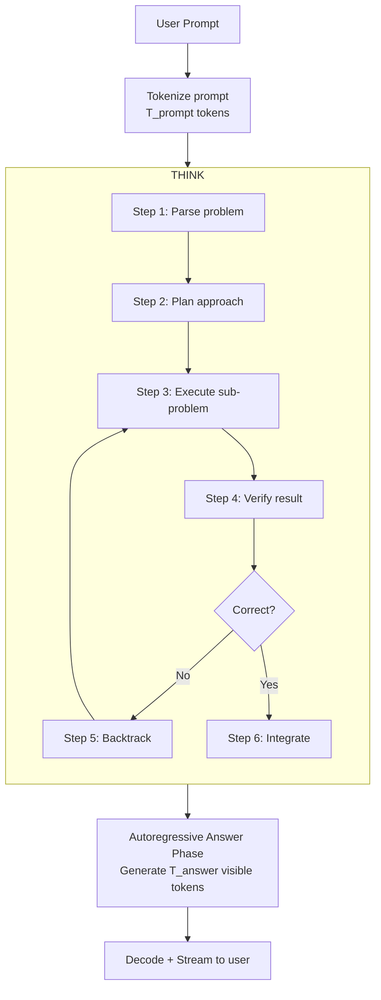
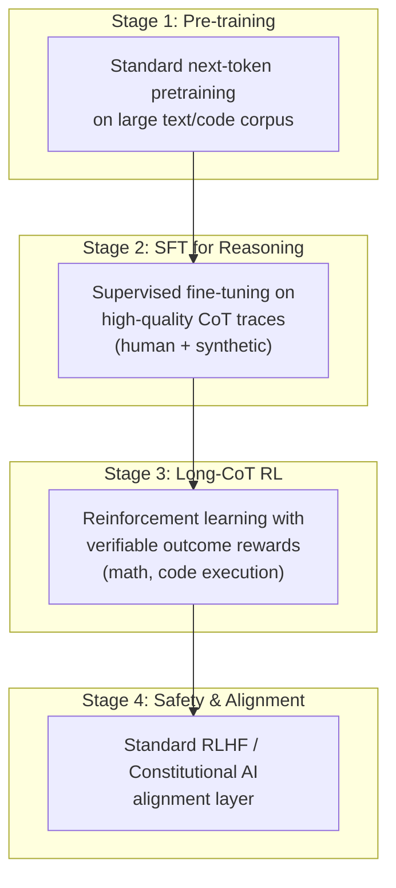
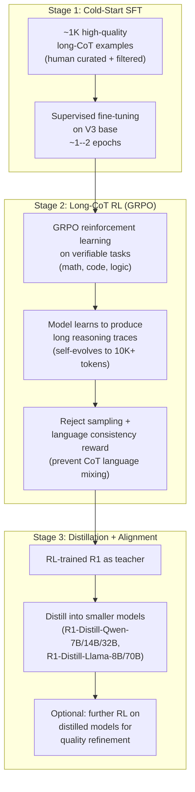
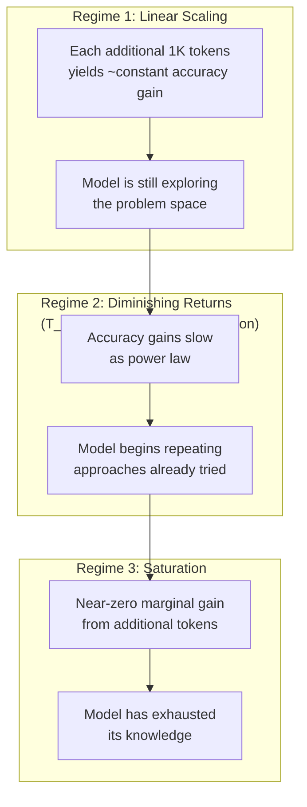
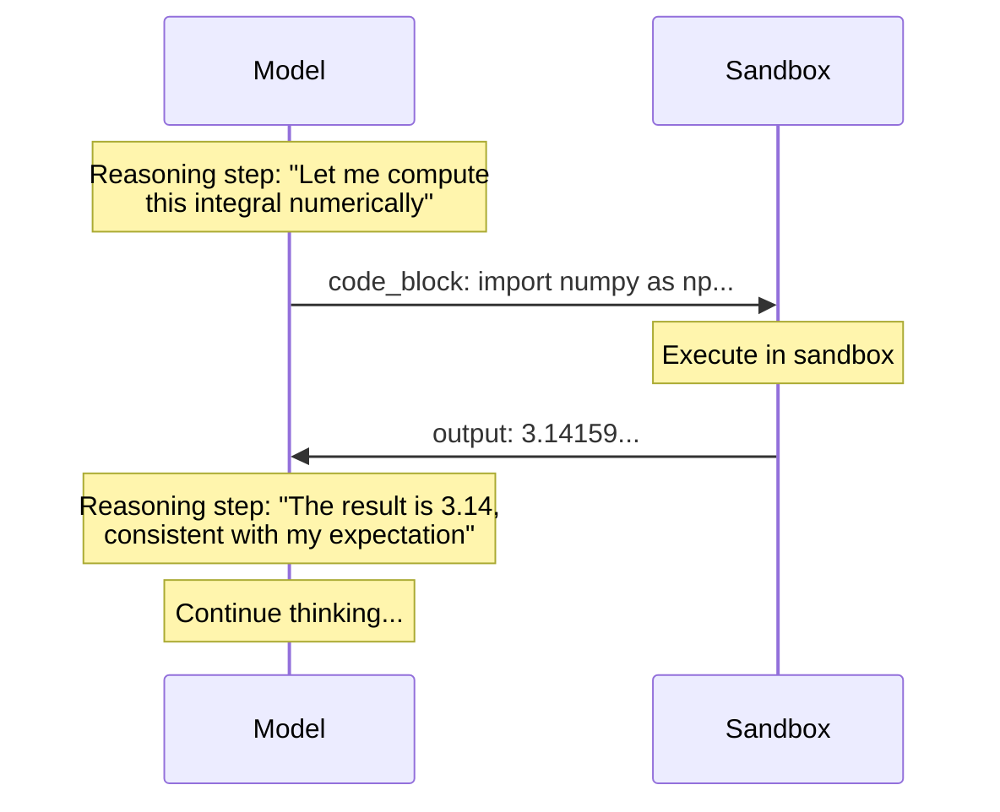
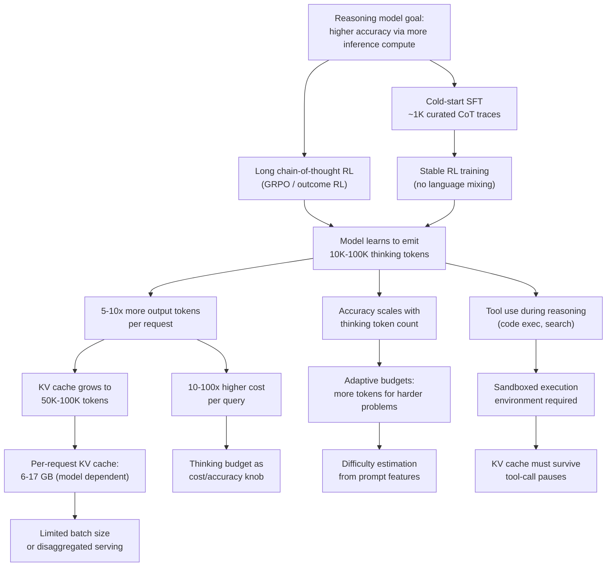

# Reasoning Models — Long Chain-of-Thought and Test-Time Compute

> **Layer:** L7.
> **Prerequisites:** [Modern_Post_Training](Modern_Post_Training.md), [Attention_Mechanisms](../L6_Algorithms_and_Models/Attention_Mechanisms.md), [KV_Cache](../L8_Inference_and_Serving/KV_Cache.md).
> **Hands off to:** [Production_Architecture](../L8_Inference_and_Serving/Production_Architecture.md), [Batching_and_Scheduling](../L8_Inference_and_Serving/Batching_and_Scheduling.md).

---

## 0. Why this page exists

A standard LLM generates one token of output per autoregressive step, using roughly $2P$ FLOPs per token. A reasoning model generates thousands or tens of thousands of *thinking tokens* before producing the user-visible answer. These tokens are the model's internal monologue: planning, backtracking, verifying sub-steps, exploring alternatives. The mechanism is conceptually simple -- train the model to emit long chain-of-thought (CoT) traces via reinforcement learning -- but the systems consequences are enormous:

- **5--10$\times$ more output tokens** per request, meaning 5--10$\times$ the FLOPs and memory bandwidth.
- **KV cache pressure** proportional to thinking length, potentially 50K--100K tokens of reasoning context.
- **Latency--accuracy tradeoff** governed by a new degree of freedom: the thinking budget (how many reasoning tokens to emit before forcing an answer).
- **Inference scheduling** must now treat a single request as a burst of autoregressive decode steps lasting tens of seconds.

This page covers the architecture and training of reasoning models (OpenAI o1/o3/o4-mini, DeepSeek-R1, Qwen-3 thinking mode), the scaling laws governing test-time compute, the inference implications, and the engineering of thinking budgets and tool use during reasoning.

**Three invariants that hold across all reasoning models:**

1. **Hidden reasoning tokens are autoregressive.** Each thinking token conditions on all prior tokens (prompt + prior thoughts). The generation is a single contiguous decode sequence; no parallelism within a single request's reasoning trace.
2. **More thinking tokens yield higher accuracy, with diminishing returns.** Test-time compute scales roughly as $E \propto N_{\text{think}}^{\alpha}$ where $\alpha < 1$, analogous to training-time Chinchilla scaling but applied at inference.
3. **The reasoning trace is never shown to the user in full.** The model produces a summary; the raw trace is discarded. This creates an asymmetry: the trace costs FLOPs but generates no user-facing value beyond its effect on the final answer quality.

---

## 1. The Paradigm Shift: Training-Time vs. Test-Time Compute

### 1.1 The classical scaling paradigm

Pre-reasoning LLM scaling follows the Chinchilla (Hoffmann et al., 2022) relationship: for optimal compute $C$, the model should have $N \propto C^{0.5}$ parameters and be trained on $D \propto C^{0.5}$ tokens. A 70B model trained on 15T tokens is near-optimal for its compute budget. After training, the model is fixed; inference cost is $O(1)$ per token regardless of difficulty.

### 1.2 Test-time compute scaling

Reasoning models introduce a second scaling axis: at inference, the model can expend additional compute proportional to the number of thinking tokens $T_{\text{think}}$. The total inference FLOPs for a reasoning request are:

$$C_{\text{inference}} = 2P \cdot (T_{\text{prompt}} + T_{\text{think}} + T_{\text{answer}})$$

For a 70B model with $T_{\text{prompt}} = 1{,}000$, $T_{\text{think}} = 10{,}000$, $T_{\text{answer}} = 500$:

$$C_{\text{inference}} = 2 \times 70 \times 10^9 \times 11{,}500 = 1.61 \text{ TFLOPs per request}$$

This is 10$\times$ the cost of a non-reasoning model answering the same prompt ($2 \times 70\text{B} \times 1{,}500 = 210$ GFLOPs). The tradeoff is that accuracy on hard problems (math olympiad, coding contests, multi-step logical reasoning) improves dramatically.

### 1.3 Why this works: search at inference time

A non-reasoning model maps prompt $\to$ answer in one forward pass per answer token. A reasoning model maps prompt $\to$ thinking trace $\to$ answer. The thinking trace is a form of heuristic search: the model explores solution paths, discards dead ends (via backtracking in the trace), and verifies intermediate results. The key insight from the "Scaling LLM Test-Time Compute" paper (Snell et al., 2024): for a fixed total compute budget, spending more compute at test time can outperform spending it at training time for sufficiently hard problems.

The scaling law is approximately:

$$\text{Accuracy}(N, T_{\text{train}}, T_{\text{think}}) \approx f\!\left(\frac{C_{\text{train}} + C_{\text{test}}}{C_{\text{total}}}\right)$$

where $C_{\text{train}} = 6 N T_{\text{train}}$ (standard training compute) and $C_{\text{test}} = 2 P \cdot T_{\text{think}} \cdot N_{\text{requests}}$. The frontier models distribute compute across both axes.

---

## 2. OpenAI o1/o3/o4-mini Architecture

### 2.1 What is known

OpenAI has not published architectural details of o1, o3, or o4-mini. What can be inferred from public demos, API behavior, and disclosures:

- **Hidden reasoning tokens.** The API returns a `reasoning_tokens` count alongside `completion_tokens`. The reasoning content is not exposed to the user. For o3 on difficult problems, reasoning tokens can exceed 100K.
- **Reinforcement learning from verifiable outcomes.** o1 was trained with RL on tasks with ground-truth answers (math, code, science). The reward signal is binary: correct or incorrect. No human preference data is needed for the reasoning RL phase.
- **Chain-of-thought is native, not prompted.** The model was trained to produce long reasoning traces organically. Prompting a base model with "think step by step" is a weak approximation; o-series models have internalized multi-step verification and backtracking.
- **Process reward models (PRM) likely used during training.** A PRM scores each intermediate step of the reasoning trace, providing denser reward signal than outcome-based RL alone.
- **o4-mini** is a smaller, faster variant optimized for cost-efficient reasoning. It uses fewer parameters but compensates with more aggressive test-time search (beam-like behavior inferred from latency patterns).

### 2.2 The hidden reasoning token mechanism



The thinking phase is pure autoregressive decoding. There is no beam search, no external verifier, no tree-of-thought data structure in production. The model has learned to simulate search within a flat token sequence. Backtracking is encoded linguistically: the model writes "Wait, that approach won't work because..." and then tries an alternative.

### 2.3 Training pipeline (inferred)

The o-series training pipeline is believed to follow this structure:



**Stage 2** produces a model that emits structured reasoning traces. **Stage 3** scales the traces to extreme lengths (10K--100K tokens) by rewarding correct outcomes regardless of trace length. The model learns to allocate more tokens to harder problems.

### 2.4 Token usage patterns

| Model | Typical T_think (easy) | Typical T_think (hard) | Max observed T_think | T_answer (typical) |
|---|---|---|---|---|
| o1-preview | 500--2K | 5K--30K | ~100K | 200--1K |
| o1 | 200--1K | 2K--20K | ~80K | 200--2K |
| o3 | 100--1K | 5K--50K | ~100K+ | 200--5K |
| o4-mini | 300--2K | 3K--30K | ~60K | 100--1K |

The critical observation: T_think spans 2--3 orders of magnitude depending on problem difficulty. This makes capacity planning for reasoning model serving fundamentally harder than standard LLM serving.

---

## 3. DeepSeek-R1: The Open-Source Reasoning Pipeline

### 3.1 Architecture

DeepSeek-R1 uses the same base architecture as DeepSeek-V3: 671B total parameters, 37B active, 61 layers, 256 routed MoE experts with top-8 gating, MLA attention. The reasoning capability is entirely a product of post-training.

### 3.2 The three-stage pipeline

DeepSeek-R1 is the most thoroughly documented reasoning model. Its training has three stages:



**Stage 1: Cold-start SFT.** Without any reasoning examples, the base model cannot produce coherent long CoT traces. DeepSeek found that starting RL from scratch on a non-reasoning model leads to unstable training and language mixing (the model switches between languages mid-trace). The cold-start SFT uses approximately 1,000 carefully curated examples, each containing a long, structured reasoning trace. This is tiny compared to the full training corpus but essential for bootstrapping.

**Stage 2: Long-CoT RL via GRPO.** The core reasoning capability emerges here. GRPO (Group Relative Policy Optimization -- see [Modern_Post_Training](Modern_Post_Training.md)) samples a group of completions for each prompt, scores them against ground-truth outcomes, and updates the policy to favor higher-scoring traces. The key insight: with enough RL steps, the model *self-evolves* longer and more sophisticated reasoning traces. No human data is needed beyond the cold-start. The model discovers backtracking, verification, and alternative exploration on its own.

**Stage 3: Distillation.** The full 671B R1 model serves as a teacher for smaller models. Distillation uses standard next-token prediction: the student model trains on R1's reasoning traces as supervised data. Remarkably, distilled 32B models outperform the 671B V3 base on reasoning benchmarks -- the reasoning capability transfers efficiently through distillation.

### 3.3 Key technical details

| Parameter | Value |
|---|---|
| Base model | DeepSeek-V3 (671B / 37B active) |
| Cold-start SFT examples | ~1,000 |
| RL algorithm | GRPO (group size 64) |
| RL training tasks | Math (MATH, AIME), Code (LiveCodeBench), Logic puzzles |
| Reward signal | Binary (correct/incorrect) + format compliance |
| Language consistency reward | Prevents language mixing in CoT |
| Distillation targets | Qwen-2.5 (7B, 14B, 32B, 72B), Llama-3 (8B, 70B) |
| Distilled model performance | R1-Distill-32B matches o1-preview on MATH |

### 3.4 Ablation: R1-Zero (no cold start)

DeepSeek also trained R1-Zero: V3 base model with GRPO RL and *no* cold-start SFT. R1-Zero achieves competitive accuracy but produces less readable traces with frequent language mixing and formatting inconsistencies. This ablation proves that the cold-start SFT is not required for capability, only for coherence and usability.

---

## 4. Test-Time Compute Scaling Laws

### 4.1 The scaling relationship

Empirical measurements across o1, o3, DeepSeek-R1, and Qwen-3 show a consistent power-law relationship between thinking token count and accuracy:

$$\text{Accuracy}(T_{\text{think}}) = A - B \cdot T_{\text{think}}^{-\beta}$$

where $A$ is the asymptotic accuracy ceiling, $B$ is a problem-difficulty constant, and $\beta \in [0.3, 0.7]$ depending on the task domain. The diminishing returns are clear: doubling thinking tokens from 1K to 2K yields a larger accuracy gain than doubling from 10K to 20K.

### 4.2 Scaling regimes



$T_{\text{critical}}$ and $T_{\text{saturation}}$ depend on problem difficulty. For simple arithmetic, $T_{\text{critical}} \approx 100$ tokens. For competition-level mathematics, $T_{\text{critical}} \approx 5{,}000$ tokens and $T_{\text{saturation}} \approx 50{,}000$.

### 4.3 Compute-optimal allocation

Given a total compute budget $C$ that can be split between training ($C_{\text{train}}$) and test-time ($C_{\text{test}}$), the optimal split depends on the distribution of query difficulty:

$$C_{\text{test}}^* = \arg\max_{c} \sum_{q \in \text{queries}} \text{Accuracy}_q(C_{\text{train}}, c \cdot T_q)$$

subject to $C_{\text{train}} + c \cdot \sum_q T_q \leq C$.

The practical conclusion: for easy queries (majority of production traffic), minimal thinking tokens are optimal. For hard queries (the long tail), substantial thinking tokens yield large accuracy gains. This motivates **adaptive thinking budgets** (Section 6).

### 4.4 Comparison with other test-time strategies

Test-time compute is not limited to long CoT. Other strategies include:

| Strategy | Mechanism | Compute multiplier | Accuracy effect |
|---|---|---|---|
| Long CoT (reasoning models) | More thinking tokens | 5--10$\times$ | Highest for reasoning tasks |
| Best-of-N sampling | Generate N answers, pick best | N$\times$ | Good for verifiable tasks |
| Majority voting | Generate N answers, pick consensus | N$\times$ | Robust but compute-heavy |
| Self-consistency | Sample multiple CoTs, vote | N$\times$ | Combines CoT + voting |
| Tree-of-thought | Branching search with backtracking | Variable | Promising but complex |
| Process reward guided search | PRM scores each step, prune branches | Variable | High accuracy, high overhead |

Long CoT is the dominant strategy because it requires no external verifier, no multi-sample orchestration, and no custom search infrastructure. The model internalizes the search.

---

## 5. Thinking Budgets

### 5.1 The thinking budget as a control knob

A thinking budget $B_{\text{think}}$ is the maximum number of reasoning tokens the model is allowed to emit before being forced to produce an answer. It is set by the API user or by the serving system.

$$B_{\text{think}} = \min(T_{\text{max}}, \text{Budget}(q))$$

where $T_{\text{max}}$ is the model's maximum context window and $\text{Budget}(q)$ is the allocated budget for query $q$.

### 5.2 Budget allocation strategies

**Fixed budget.** Every request gets the same thinking budget. Simple but wasteful: easy problems over-spend, hard problems under-spend.

**User-specified budget.** The API caller sets `max_reasoning_tokens`. Provides flexibility but pushes the optimization burden to the user.

**Adaptive budget.** The serving system estimates problem difficulty (from prompt length, topic classification, or early-reasoning-token perplexity) and allocates budget accordingly:

$$B_{\text{think}}(q) = B_{\min} + (B_{\max} - B_{\min}) \cdot \sigma(\text{difficulty}(q))$$

where $\sigma$ maps difficulty to $[0, 1]$. Early stopping monitors the model's confidence during reasoning and terminates thinking when the model has converged on an answer.

**Budget as a function of SLO.** For latency-sensitive applications:

$$B_{\text{think}}(q) = \frac{\text{SLO}_{\text{latency}}(q) - t_{\text{overhead}}}{t_{\text{per-token}}}$$

where $t_{\text{per-token}}$ is the decode latency per thinking token (model-dependent, typically 20--50 ms for 70B-class models on H100). If the SLO is 10 seconds and per-token latency is 30 ms: $B_{\text{think}} = (10{,}000 - 500) / 30 \approx 316$ tokens -- insufficient for hard problems.

### 5.3 Budget enforcement

The model is trained with a special `<end-of-thinking>` token that signals the transition from reasoning to answer generation. Budget enforcement works by:

1. If the model emits `<end-of-thinking>` naturally, stop reasoning.
2. If the budget $B_{\text{think}}$ is reached before `<end-of-thinking>`, inject the token forcibly and begin answer generation.

Forced termination degrades accuracy by 5--15% compared to natural termination at the same thinking length, because the model may be mid-backtrack when cut off. Models trained with variable budgets during RL learn to respect the budget more gracefully.

---

## 6. Tool Use During Reasoning

### 6.1 Code execution

The most impactful form of tool use during reasoning is code execution. The model writes code (typically Python) as part of its thinking trace, executes it, and incorporates the output back into reasoning.



**System requirements:**
- Sandboxed execution environment (Docker container, gVisor, or Firecracker microVM).
- Timeout enforcement (typically 10--120 seconds per code block).
- Network isolation (no internet access to prevent data exfiltration).
- Resource limits (memory cap, no filesystem writes beyond /tmp).

**Inference cost impact:** Each code execution round-trip adds 50--500 ms of wall-clock time (sandbox startup + execution). For a reasoning trace with 5 code executions, this adds 0.25--2.5 seconds -- modest compared to the 10--30 seconds of autoregressive thinking.

### 6.2 Search and browsing

Some reasoning models can invoke web search or browse documents during reasoning. The model generates search queries, retrieves results, and uses the retrieved information to continue reasoning.

**Cost structure:** Each search query adds 100--500 ms (embedding + retrieval + context injection). The retrieved documents consume additional KV cache slots. A 10-document retrieval at 512 tokens each adds 5,120 tokens to the context.

### 6.3 Multi-tool orchestration

The model may interleave multiple tool calls within a single reasoning trace:

```
[Think] Let me approach this physics problem...
[Think] First, I'll look up the gravitational constant.
[Search] "gravitational constant G value"
[Result] G = 6.674 × 10^-11 N⋅m²/kg²
[Think] Now let me compute the orbital velocity...
[Code] import math; v = math.sqrt(G * M / r)
[Output] 7714.2 m/s
[Think] This matches the expected range for LEO...
[Answer] The orbital velocity is approximately 7.7 km/s.
```

Each tool invocation introduces a non-autoregressive pause in the reasoning trace. The serving system must support these pauses without releasing GPU resources (the KV cache for the partial reasoning trace must be retained).

---

## 7. Inference Implications

### 7.1 Output token multiplier

The defining characteristic of reasoning model inference is the large output token count:

$$T_{\text{total}} = T_{\text{prompt}} + T_{\text{think}} + T_{\text{answer}} \approx (1 + \lambda) \cdot T_{\text{non-reasoning}}$$

where $\lambda = T_{\text{think}} / (T_{\text{prompt}} + T_{\text{answer}})$ is the reasoning multiplier, typically 5--20$\times$ for production workloads.

**FLOP impact:**

$$C_{\text{reasoning}} = 2P \cdot T_{\text{total}} = 2P \cdot (T_{\text{prompt}} + T_{\text{think}} + T_{\text{answer}})$$

For a 70B model at FP16:

| Scenario | $T_{\text{prompt}}$ | $T_{\text{think}}$ | $T_{\text{answer}}$ | Total FLOPs | vs Non-Reasoning |
|---|---|---|---|---|---|
| Easy query | 500 | 500 | 200 | 84 GFLOPs | 1.7$\times$ |
| Medium query | 1,000 | 5,000 | 500 | 910 GFLOPs | 6.1$\times$ |
| Hard query | 2,000 | 30,000 | 1,000 | 4.62 TFLOPs | 15.4$\times$ |
| Extreme query | 5,000 | 100,000 | 2,000 | 15.0 TFLOPs | 21.4$\times$ |

### 7.2 KV cache pressure

During reasoning, the KV cache grows with every thinking token. For a model with $L$ layers, $H_{\text{KV}}$ KV heads, head dimension $d_h$, and thinking length $T_{\text{think}}$:

$$\text{KV}_{\text{think}} = 2 \cdot L \cdot H_{\text{KV}} \cdot d_h \cdot (T_{\text{prompt}} + T_{\text{think}}) \cdot \text{sizeof(dtype)}$$

For DeepSeek-R1 (671B / 37B active) using MLA with latent KV dimension $d_c = 512$:

$$\text{KV}_{\text{think}} = 2 \cdot 61 \cdot 512 \cdot T_{\text{total}} \cdot 2\,\text{B} = 124{,}928 \cdot T_{\text{total}} \text{ bytes}$$

At $T_{\text{think}} = 50{,}000$ with $T_{\text{prompt}} = 2{,}000$: $\text{KV} \approx 6.5$ GB per request. This is manageable on a single B200 with 192 GB HBM, but at batch size 32: $32 \times 6.5 = 208$ GB -- exceeding a single GPU's capacity. This motivates KV cache compression (see [Modern_KV_Compression](../L8_Inference_and_Serving/Modern_KV_Compression.md)) and disaggregated serving.

For a standard GQA model like Llama-3-70B ($L=80$, $H_{\text{KV}}=8$, $d_h=128$):

$$\text{KV}_{\text{think}} = 2 \cdot 80 \cdot 8 \cdot 128 \cdot T_{\text{total}} \cdot 2\,\text{B} = 327{,}680 \cdot T_{\text{total}} \text{ bytes}$$

At $T_{\text{think}} = 50{,}000$: $\text{KV} \approx 17.0$ GB per request. Batch size 8 already exceeds a single H100's 80 GB.

### 7.3 Latency decomposition

The end-to-end latency for a reasoning request has three components:

$$t_{\text{total}} = t_{\text{prefill}} + t_{\text{think}} + t_{\text{answer}}$$

$$t_{\text{think}} = \frac{T_{\text{think}}}{\text{throughput}_{\text{decode}}}$$

For a 70B model on H100 at 30 tok/s (batch=1, decode):

| Component | Easy | Medium | Hard |
|---|---|---|---|
| Prefill ($T_{\text{prompt}}$) | 50 ms | 100 ms | 200 ms |
| Thinking ($T_{\text{think}}$) | 17 s | 167 s | 1,000 s |
| Answer ($T_{\text{answer}}$) | 6.7 s | 17 s | 33 s |
| **Total** | **23.7 s** | **184 s** | **1,033 s** |

The thinking phase dominates. At 30 tok/s, 10,000 thinking tokens take 333 seconds (5.5 minutes). This is why reasoning model serving requires aggressive batching and high-throughput decode configurations (see [Batching_and_Scheduling](../L8_Inference_and_Serving/Batching_and_Scheduling.md)).

### 7.4 Throughput and cost

The cost per query for a reasoning model on H100 (assuming $3/GPU-hr):

$$\text{Cost} = \frac{t_{\text{total}}}{3600} \cdot \text{GPU\_count} \cdot \$\text{per\_GPU\_hr}$$

For a 70B model on 4xH100 ($12/GPU-hr total):

| Scenario | Wall time | Cost/query | Cost/1K tokens (thinking) |
|---|---|---|---|
| Easy (500 think tokens) | 24 s | $0.080 | $0.160 |
| Medium (5K think tokens) | 184 s | $0.613 | $0.123 |
| Hard (30K think tokens) | 1,033 s | $3.44 | $0.115 |

For comparison, a non-reasoning 70B model answering the same prompt (no thinking): cost/query $\approx$ $0.005--0.05$. Reasoning models are 10--100$\times$ more expensive per query.

---

## 8. Reasoning Model Comparison

| Feature | o1 | o3 | o4-mini | DeepSeek-R1 | Qwen-3 (thinking) | Claude-4 (extended thinking) |
|---|---|---|---|---|---|---|
| Base model size | ~200B (est.) | ~200B (est.) | ~70B (est.) | 671B / 37B active | Various (8B--72B) | ~200B (est.) |
| Open weights | No | No | No | Yes | Yes | No |
| Reasoning RL method | Outcome RL | Outcome RL | Outcome RL | GRPO | GRPO (est.) | Outcome RL (est.) |
| Cold-start SFT | Yes (est.) | Yes | Yes | Yes (~1K examples) | Yes | Yes (est.) |
| Max thinking tokens (observed) | ~100K | ~100K+ | ~60K | ~32K | ~16K | ~128K |
| Thinking token visibility | Not exposed | Not exposed | Not exposed | User can request | User can toggle | Summary shown |
| Tool use during reasoning | Limited (est.) | Code execution | Code + search | Code execution | Code execution | Code + search |
| Distillation variants | No | No | No | Yes (7B--70B) | Yes | No |
| Key benchmark (MATH) | ~85% | ~96% (est.) | ~90% (est.) | ~79% | ~85% (72B) | ~92% (est.) |
| Key benchmark (SWE-bench) | ~48% | ~72% (est.) | ~55% (est.) | ~57% | ~62% (72B) | ~70% (est.) |
| Inference cost vs non-reasoning | 5--10$\times$ | 5--15$\times$ | 3--8$\times$ | 5--10$\times$ | 3--8$\times$ | 5--10$\times$ |

---

## 9. End-to-End Cause/Effect Flow



---

## 10. Numbers to Memorize

| # | Fact | Value |
|---|---|---|
| 1 | Reasoning token multiplier (typical) | 5--10$\times$ vs non-reasoning |
| 2 | DeepSeek-R1 total / active params | 671B / 37B (same as V3) |
| 3 | R1 cold-start SFT examples | ~1,000 |
| 4 | R1 RL algorithm | GRPO (group size 64) |
| 5 | R1 max observed thinking tokens | ~32K |
| 6 | o3 max observed thinking tokens | ~100K+ |
| 7 | Test-time scaling exponent $\beta$ | 0.3--0.7 (domain dependent) |
| 8 | KV cache per request at 50K think (Llama-3-70B) | ~17 GB |
| 9 | KV cache per request at 50K think (DeepSeek-R1, MLA) | ~6.5 GB |
| 10 | Reasoning decode latency (70B, H100, batch=1) | ~30 ms/token |
| 11 | Wall time for 10K thinking tokens (70B, H100) | ~333 s |
| 12 | Cost multiplier for reasoning vs non-reasoning | 10--100$\times$ |
| 13 | R1-Distill-32B MATH accuracy | ~79% (matches o1-preview) |
| 14 | Reasoning model training compute overhead | ~20--50% over base RLHF |
| 15 | Code execution sandbox overhead per call | 50--500 ms |
| 16 | Typical batch size reduction (reasoning vs standard) | 4--8$\times$ fewer concurrent requests |
| 17 | Thinking budget enforcement accuracy drop | 5--15% for forced termination |
| 18 | Accuracy gain: 1K vs 10K thinking tokens (hard math) | ~15--25 percentage points |

---

## 11. Worked Problems

### Problem 1: KV Cache Capacity Planning for Reasoning

**Question.** You serve DeepSeek-R1 on 8xH100 (80 GB HBM each) with tensor parallelism TP=8. Each GPU holds an equal share of weights (~84 GB FP8 weights + non-weight state = ~90 GB used). How many concurrent reasoning requests can you support at a thinking length of 20,000 tokens (with $T_{\text{prompt}} = 2{,}000$)?

**Solution.** Available HBM per GPU for KV cache:

$$\text{HBM}_{\text{available}} = 80 - 90/8 = 80 - 11.25 \approx 68.75 \text{ GB}$$

Wait -- with TP=8, the weights are sharded across 8 GPUs. Each GPU holds $671\text{B} \times 1\text{B (FP8)} / 8 \approx 84$ GB of weights. That exceeds the 80 GB HBM. We need FP8 quantization plus some offloading, or use B200 (192 GB). Let us recalculate for B200:

Each B200 GPU holds $\approx 84$ GB of FP8 weights. Available for KV cache: $192 - 84 = 108$ GB.

KV cache per request (MLA, $d_c = 512$, $L = 61$):

$$\text{KV}_{\text{per-req}} = 2 \cdot 61 \cdot 512 \cdot (2{,}000 + 20{,}000) \cdot 2\,\text{B} = 2.75 \text{ GB}$$

With TP=8, the KV cache is replicated (each GPU needs the full KV for its shard of attention heads). Actually, with MLA, the KV cache is the latent $c_{\text{KV}}$, and each attention head reconstructs its K/V locally. The latent KV cache is shared across heads, so it is stored once per layer, not per head.

Maximum concurrent requests:

$$N_{\text{max}} = \frac{108 \text{ GB}}{2.75 \text{ GB/req}} \approx 39 \text{ requests}$$

**Reality check.** With overhead (activation memory, fragmentation), practical capacity is ~25--30 concurrent reasoning requests at 22K total tokens. This is 4--6$\times$ fewer than the same hardware serving non-reasoning requests at 4K context (~150+ concurrent).

---

### Problem 2: Cost-Optimal Thinking Budget

**Question.** You run a reasoning API where queries are classified as easy (60%), medium (30%), or hard (10%). Accuracy as a function of thinking tokens follows $\text{Acc}(T) = A - B \cdot T^{-0.5}$ with parameters:

| Difficulty | $A$ | $B$ |
|---|---|---|
| Easy | 0.95 | 2.0 |
| Medium | 0.90 | 5.0 |
| Hard | 0.85 | 10.0 |

Each thinking token costs $c = \$10^{-5}$. You have a per-query budget of \$0.10. How should you allocate thinking tokens across difficulty levels to maximize average accuracy?

**Solution.** Total budget constraint: $0.6 \cdot T_{\text{easy}} + 0.3 \cdot T_{\text{med}} + 0.1 \cdot T_{\text{hard}} \leq \$0.10 / c = 10{,}000$ tokens (weighted average).

We want to maximize: $0.6 \cdot \text{Acc}(T_e) + 0.3 \cdot \text{Acc}(T_m) + 0.1 \cdot \text{Acc}(T_h)$.

Marginal accuracy per token:

$$\frac{d\,\text{Acc}}{dT} = 0.5 \cdot B \cdot T^{-1.5}$$

At the optimum, marginal accuracy per token is equal across all difficulty levels (Lagrange multiplier condition):

$$0.6 \cdot 0.5 \cdot B_e \cdot T_e^{-1.5} = 0.3 \cdot 0.5 \cdot B_m \cdot T_m^{-1.5} = 0.1 \cdot 0.5 \cdot B_h \cdot T_h^{-1.5}$$

Simplifying: the marginal accuracy must be equal:

$$\frac{B_e}{T_e^{1.5}} = \frac{B_m}{T_m^{1.5}} = \frac{B_h}{T_h^{1.5}}$$

From $B_e / T_e^{1.5} = B_m / T_m^{1.5}$: $T_m = T_e \cdot (B_m/B_e)^{2/3} = T_e \cdot (5/2)^{2/3} = T_e \cdot 1.51$.

From $B_e / T_e^{1.5} = B_h / T_h^{1.5}$: $T_h = T_e \cdot (B_h/B_e)^{2/3} = T_e \cdot (10/2)^{2/3} = T_e \cdot 2.92$.

Budget constraint: $0.6 \cdot T_e + 0.3 \cdot 1.51 T_e + 0.1 \cdot 2.92 T_e = 10{,}000$.

$T_e (0.6 + 0.453 + 0.292) = 10{,}000 \Rightarrow T_e \cdot 1.345 = 10{,}000$.

$$T_e \approx 7{,}435, \quad T_m \approx 11{,}227, \quad T_h \approx 21{,}710$$

**Resulting accuracies:**

- Easy: $0.95 - 2.0 / \sqrt{7435} = 0.95 - 0.023 = 92.7\%$
- Medium: $0.90 - 5.0 / \sqrt{11227} = 0.90 - 0.047 = 85.3\%$
- Hard: $0.85 - 10.0 / \sqrt{21710} = 0.85 - 0.068 = 78.2\%$

**Weighted average: $0.6 \times 92.7 + 0.3 \times 85.3 + 0.1 \times 78.2 = 88.6\%$.**

For comparison, a uniform allocation of 10,000 tokens to all gives: $0.6 \times 93.7 + 0.3 \times 85.0 + 0.1 \times 75.0 = 88.0\%$. The optimal allocation gains 0.6 percentage points -- modest for this parameterization, but the gap widens when difficulty variance is larger.

---

### Problem 3: Throughput Comparison — Reasoning vs Non-Reasoning

**Question.** A serving cluster of 16xH100 runs a 70B model. Non-reasoning requests average $T_{\text{prompt}} = 1{,}000$, $T_{\text{output}} = 300$. Reasoning requests average $T_{\text{prompt}} = 1{,}000$, $T_{\text{think}} = 8{,}000$, $T_{\text{output}} = 500$. Decode throughput is 30 tok/s per request at batch=1, and scales linearly with batch up to the memory-bound limit. KV cache per request at full context: 0.13 KB/token $\times$ context length. Each H100 has 80 GB HBM, with 50 GB available for KV cache. Compute the maximum aggregate throughput (output tokens/s) for non-reasoning and reasoning workloads.

**Solution.** Non-reasoning: total context per request = $1{,}000 + 300 = 1{,}300$ tokens. KV cache = $0.13 \times 1{,}300 = 169$ KB. Max concurrent requests per GPU: $50 \times 10^9 / (169 \times 10^3) \approx 295{,}858$. This is absurdly high; the real limit is compute, not memory. At batch 256: throughput $\approx 256 \times 30 / 256 = 30$ tok/s per request, aggregate $= 7{,}680$ tok/s per GPU. Across 16 GPUs: **122{,}880 tok/s aggregate.**

Reasoning: total context per request = $1{,}000 + 8{,}000 + 500 = 9{,}500$ tokens. KV cache = $0.13 \times 9{,}500 = 1{,}235$ KB $\approx 1.2$ MB. Max concurrent per GPU: $50 \times 10^9 / (1.2 \times 10^6) \approx 41{,}666$. Still memory-rich. At batch 128 (reduced because each request runs 8.5$\times$ longer): throughput per request $\approx 30 \times 128 / 128 = 30$ tok/s (memory-bound decode doesn't change with batch). Aggregate per GPU: $128 \times 30 = 3{,}840$ tok/s. But wait -- the output includes thinking tokens. **User-visible** output tokens: $500 / 9{,}500 = 5.3\%$ of total. So user-visible throughput: $3{,}840 \times 0.053 = 203$ tok/s per GPU. Across 16 GPUs: **3{,}248 user-visible tok/s.**

**Ratio: $122{,}880 / 3{,}248 \approx 38\times$ fewer user-visible output tokens/s for reasoning.**

This dramatically illustrates why reasoning models are so much more expensive: the GPU is spending 94.7% of its output capacity on tokens the user never sees.

---

### Problem 4: Reasoning Trace FLOP Accounting

**Question.** DeepSeek-R1 (37B active params) processes a request with $T_{\text{prompt}} = 3{,}000$, $T_{\text{think}} = 15{,}000$, $T_{\text{answer}} = 800$. Compute: (a) total FLOPs for this request, (b) FLOPs breakdown by phase, (c) energy consumed on H100 (H100 TDP = 700W, MFU = 40%).

**Solution.** (a) Total FLOPs:

$$C_{\text{total}} = 2 \times 37 \times 10^9 \times (3{,}000 + 15{,}000 + 800) = 74 \times 10^9 \times 18{,}800 = 1.391 \text{ TFLOPs}$$

(b) Breakdown:

| Phase | Tokens | FLOPs | Fraction |
|---|---|---|---|
| Prefill | 3,000 | 222 GFLOPs | 16.0% |
| Thinking | 15,000 | 1,110 GFLOPs | 79.8% |
| Answer | 800 | 59.2 GFLOPs | 4.3% |

Note: prefill is compute-bound (many tokens processed simultaneously in a single forward pass), while thinking and answer are memory-bound decode steps. The FLOP accounting here treats each decode token as $2P$ FLOPs, which is accurate for the matmul portion. The actual wall-clock time for prefill is much shorter than the FLOP fraction suggests.

(c) Compute time at 40% MFU on H100 (990 TFLOPS FP16):

$$t = \frac{1{,}391 \text{ GFLOPs}}{990 \times 0.40 \text{ TFLOPS}} = \frac{1.391}{396} \approx 3.51 \text{ ms}$$

This is only the compute time for the prefill matmuls. The decode steps are memory-bound. Actual wall-clock time for the 15,800 decode tokens at $\sim$30 tok/s (batch=1): $15{,}800 / 30 \approx 527$ seconds.

Energy for decode: $527 \text{ s} \times 700 \text{ W} = 369 \text{ kJ} = 0.103$ kWh. At \$0.10/kWh electricity: \$0.010. The GPU cost (\$3/hr H100) dominates: $527/3600 \times \$3 = \$0.44$.

---

### Problem 5: Distillation Efficiency Analysis

**Question.** DeepSeek-R1 is distilled into R1-Distill-Qwen-32B. The teacher (671B/37B active) achieves 79% on MATH. The distilled 32B achieves 78% on MATH. The teacher's training required 2.788M H800 GPU-hours. Estimate the distillation cost and compare the training+distillation cost per unit of reasoning capability for teacher vs student.

**Solution.** Distillation training: the student (32B dense) trains on teacher-generated reasoning traces. Assuming 100B tokens of distilled data (from R1 traces) at Chinchilla-optimal compute:

$$C_{\text{distill}} = 6 \times 32 \times 10^9 \times 100 \times 10^9 = 1.92 \times 10^{22} \text{ FLOPs}$$

On H100 at 40% MFU (396 TFLOPS):

$$t_{\text{distill}} = \frac{1.92 \times 10^{22}}{396 \times 10^{12}} \approx 48{,}500 \text{ GPU-hours}$$

**Cost comparison:**

| Model | GPU-hours | MATH accuracy | GPU-hrs per % point |
|---|---|---|---|
| R1 (671B/37B) | 2,788,000 | 79% | 35,300 |
| R1-Distill-32B | 48,500 | 78% | 622 |

The student achieves 98.7% of the teacher's accuracy at 1.7% of the training cost. Per percentage point of MATH accuracy, the student is **56.8$\times$ more efficient**. This is the economic argument for distillation: train one large teacher, distill into many small students for deployment.

If you serve 10M queries/day requiring reasoning, the 32B student on 4xH100 uses ~4$\times$ fewer GPUs than the 37B-active MoE teacher (due to MoE overhead in serving), at ~99% of the accuracy. Annual savings: millions of dollars in GPU time.

---

## 12. References

1. OpenAI. "Learning to Reason with LLMs." *OpenAI Blog*, September 2024.
2. OpenAI. "o3 and o4-mini System Card." *OpenAI Documentation*, 2025.
3. DeepSeek-AI. "DeepSeek-R1: Incentivizing Reasoning Capability in LLMs via Reinforcement Learning." *arXiv:2501.12948*, January 2025.
4. Snell, C., Lee, J., Xu, K., and Kumar, A. "Scaling LLM Test-Time Compute Optimally Can be More Effective than Scaling Model Parameters." *ICLR 2025*.
5. Hoffmann, J. et al. "Training Compute-Optimal Large Language Models." *NeurIPS 2022* (Chinchilla).
6. Shao, Z. et al. "DeepSeekMath: Pushing the Limits of Mathematical Reasoning in Open Language Models." *arXiv:2402.03300*, 2024.
7. Lightman, H. et al. "Let's Verify Step by Step." *ICLR 2024* (Process Reward Models).
8. Qwen Team. "Qwen3 Technical Report." *arXiv*, 2025.
9. Anthropic. "Claude Extended Thinking." *Anthropic Documentation*, 2025.
10. Yao, S. et al. "Tree of Thoughts: Deliberate Problem Solving with Large Language Models." *NeurIPS 2023*.
11. Wang, X. and Zhou, D. "Self-Consistency: Chain-of-Thought with Self-Ensembling." *Findings of EMNLP 2023*.
12. DeepSeek-AI. "DeepSeek-V3 Technical Report." *arXiv:2412.19437*, 2024.

---

## 13. Navigation

- **Up:** [L7 Index](Index.md) -- Training Stack overview.
- **Previous:** [Modern_Post_Training](Modern_Post_Training.md) -- DPO, GRPO, RLHF, distillation (the techniques underlying reasoning RL).
- **Down:** [Production_Architecture](../L8_Inference_and_Serving/Production_Architecture.md) -- serving system design, must accommodate reasoning models' 5--10$\times$ token multiplier.
- **Down:** [Batching_and_Scheduling](../L8_Inference_and_Serving/Batching_and_Scheduling.md) -- prefill/decode scheduling for long-thinking-trace requests.
- **Cross:** [KV_Cache](../L8_Inference_and_Serving/KV_Cache.md) -- KV cache sizing for reasoning-length contexts.
- **Cross:** [Modern_KV_Compression](../L8_Inference_and_Serving/Modern_KV_Compression.md) -- essential for fitting reasoning-length KV caches.
- **Cross:** [Attention_Mechanisms](../L6_Algorithms_and_Models/Attention_Mechanisms.md) -- MLA and GQA reduce KV cache pressure during reasoning.
- **Cross:** [Frontier_Models_2025_2026](../L6_Algorithms_and_Models/Frontier_Models_2025_2026.md) -- architectural specs for reasoning-capable base models.
