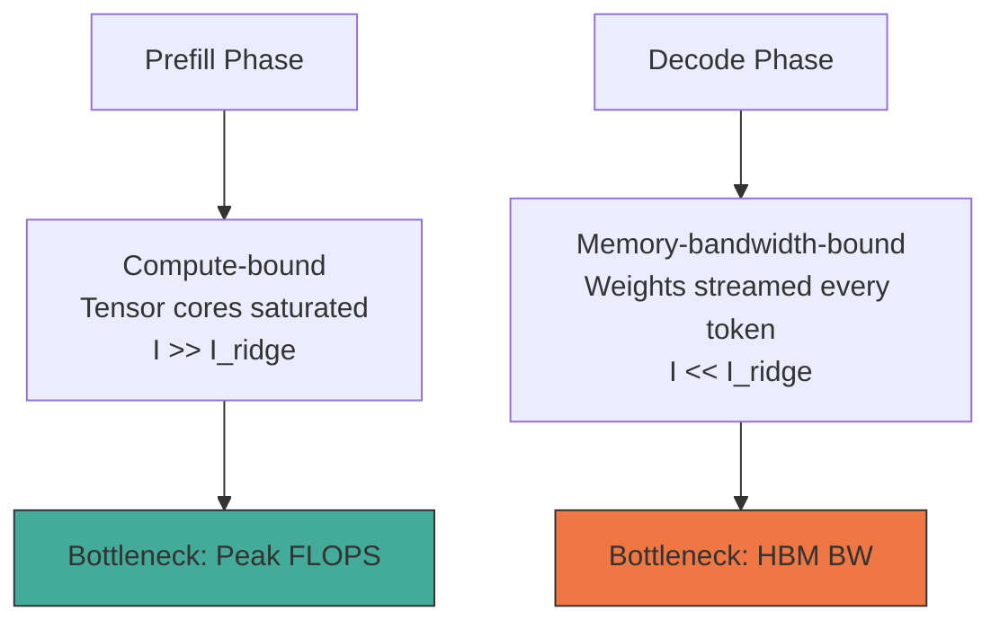
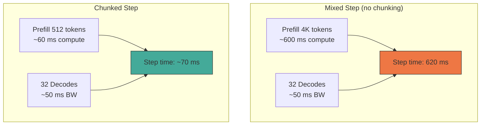

# Batching and Scheduling — Continuous Batching, Chunked Prefill, and Admission Control

> **Layer:** L8. **Prerequisites:** [KV_Cache](KV_Cache.md), [Memory_Hierarchy_and_Roofline](../L3_Microarchitecture/Memory_Hierarchy_and_Roofline.md). **Hands off to:** [Speculative_Decoding](Speculative_Decoding.md), [vLLM_Internals](vLLM_Internals.md), [Production_Architecture](Production_Architecture.md).

---

## 0. Why this page exists

Every inference server sits between a stream of user requests and a fixed pool of GPU hardware. How it packs concurrent requests onto that hardware determines almost every user-visible metric: time-to-first-token (TTFT), time-per-output-token (TPOT), aggregate throughput, tail latency, and fairness across tenants. The scheduler is the brain of the serving stack; every other optimization (kernel tuning, quantization, prefix caching) operates within the constraints it imposes.

This page develops batching and scheduling from first principles. We begin with the fundamental asymmetry between prefill and decode, derive why static batching fails in production, and then build up the full machinery of continuous (iteration-level) batching, chunked prefill, admission control, preemption, priority scheduling, and fair queuing. Every design choice is grounded in the roofline model from [Memory_Hierarchy_and_Roofline](../L3_Microarchitecture/Memory_Hierarchy_and_Roofline.md) and the memory-budget math from [KV_Cache](KV_Cache.md).

---

## 1. The Two Phases: Prefill vs Decode

Autoregressive inference splits into two phases with fundamentally different compute profiles.

### 1.1 Prefill

The entire prompt is processed in a single forward pass (or in chunks, see §5). For a prompt of $S$ tokens through a model with $N$ parameters:

$$W_{\text{prefill}} = 2 N S \;\text{FLOPs}$$

This is a dense matmul workload: the activation matrix has shape $(S, d)$, and every GEMM has an $S$-row dimension. For $S \ge 512$ on modern GPUs, arithmetic intensity $I \gg I_{\text{ridge}}$, placing prefill firmly in the **compute-bound regime**. Tensor cores saturate; the bottleneck is peak FLOPS.

### 1.2 Decode

Each decode step generates exactly one new token per sequence. The activation is now a $(1, d)$ vector multiplied against $(d, d)$ weight matrices:

$$W_{\text{decode}} = 2 N \;\text{FLOPs per step per sequence}$$

The arithmetic intensity of a single decode step is catastrophically low:

$$I_{\text{decode}} = \frac{2 N}{N \cdot \text{bytes}_{\text{weight}} + S \cdot \text{bytes}_{\text{KV}}} \approx \frac{2}{\text{bytes}_{\text{weight}}}$$

For FP16 weights, $I \approx 1$ FLOP/byte. The H100 ridge point is 295 FLOP/byte. Decode sits at **0.3% of peak compute**. The bottleneck is HBM bandwidth: weights (and KV cache entries) must be re-read every single token.

### 1.3 Numerical example: Llama-3-70B on H100 SXM5

| Parameter | Value |
|---|---|
| Weights (FP16) | 140 GB |
| HBM bandwidth $\beta$ | 3.35 TB/s |
| Peak FP16 FLOPS $\pi$ | 990 TFLOPS |

**Prefill, $S = 4096$:**

$$W = 2 \times 70 \times 10^9 \times 4096 = 573 \;\text{TFLOP}$$

At 70% of peak: $573 / 693 \approx 826\;\text{ms}$ if compute-bound. Actual tensor-core utilization for prefill is typically 50--70%, giving ~800--1100 ms for a single-sequence prefill. When batched with multiple prefills, tensor cores approach saturation.

**Decode, batch $B = 1$:**

$$\text{Bytes per step} = 140\;\text{GB (weights)} + S \cdot \text{KV\_bytes\_per\_token}$$

At $S = 4096$, KV per token = 320 KB (from [KV_Cache](KV_Cache.md) §2):

$$Q = 140 + 4096 \times 320 \times 10^{-6} \approx 140 + 1.31 = 141.3\;\text{GB}$$

$$\text{Step time} = 141.3 / 3350 \approx 42\;\text{ms} \implies 24\;\text{tok/s}$$

**Decode, batch $B = 64$:**

Weights are read once. KV is per-sequence. The step reads $140 + 64 \times 1.31 = 224\;\text{GB}$:

$$\text{Step time} = 224 / 3350 \approx 67\;\text{ms} \implies 64 / 0.067 = 955\;\text{tok/s aggregate}$$

The 67 ms step produces 64 tokens. Individual TPOT = 67 ms. Throughput scales nearly linearly because we are still bandwidth-bound and KV additions are small relative to weights. **Batching is nearly free in the bandwidth-bound regime** until KV reads dominate.



This asymmetry is the foundational fact from which every scheduling decision follows.

---

## 2. Static Batching

### 2.1 Mechanism

The original approach, still used in offline batch processing: collect $B$ requests, pad all sequences to the maximum length in the batch, execute the full batch, and return all results together. The GPU executes a fixed-shape computation:

$$\text{input\_ids}: (B, S_{\max}), \quad \text{KV}: (B, S_{\max}, L, 2, H_{kv}, d)$$

### 2.2 Why it fails for online serving

```mermaid
gantt
    title Static Batch: 4 requests, varying output lengths
    dateFormat X
    axisFormat %L ms
    section Request A (50 tokens)
    Prefill + Decode :done, a1, 0, 200
    Idle (waiting)   :a2, 200, 500
    section Request B (200 tokens)
    Prefill + Decode :active, b1, 0, 500
    section Request C (80 tokens)
    Prefill + Decode :done, c1, 0, 300
    Idle (waiting)   :c2, 300, 500
    section Request D (150 tokens)
    Prefill + Decode :active, d1, 0, 450
    Idle (waiting)   :d2, 450, 500
```



1. **Padding waste.** Sequences shorter than $S_{\max}$ consume compute and memory for padding tokens. At realistic length variance (50--500 output tokens), waste is 40--80% of total FLOPs.

2. **Head-of-line blocking.** The batch cannot return any result until the slowest sequence finishes. A single 500-token generation holds three 50-token generations hostage.

3. **Fill-time latency.** The system must wait until $B$ requests arrive (or a timeout fires) before starting. Under low load, TTFT degrades to the timeout value.

4. **KV fragmentation.** Pre-allocating $(B, S_{\max})$ wastes HBM. A batch of 32 requests with $S_{\max} = 8192$ reserves 32 $\times$ 8192 token slots even if 30 of those requests generate 50 tokens.

5. **No partial occupancy.** While waiting for Request D to finish at $t = 450$, the GPU sits idle on slots A and C that finished at $t = 200$ and $t = 300$.

**Throughput gap.** Under realistic request-length distributions (log-normal with coefficient of variation $\ge 1$), static batching achieves 10--40% of the hardware's theoretical throughput. The remaining 60--90% is lost to padding, idle slots, and waiting.

Static batching is acceptable for offline batch inference (eval, synthetic data generation) where latency does not matter and jobs can be sorted by length. It should never be used for online serving.

---

## 3. Continuous (In-Flight) Batching

### 3.1 Origin

Introduced by Orca (Yu et al., OSDI 2022), now the standard in every production serving engine: vLLM, TRT-LLM, TGI, SGLang, Dynamo, LMDeploy.

**Key idea:** each *step* (one forward pass of the GPU) independently decides which sequences participate. Sequences enter when admitted, emit tokens each step, and leave when they produce EOS or hit max-tokens -- without disturbing other in-flight sequences.

### 3.2 The step loop

```
loop forever:
    1. ADMISSION: admit new requests from waiting queue if budget allows
    2. SCHEDULING: select which sequences run this step
       - All active decode sequences (1 token each)
       - Some prefill chunks if token budget remains
    3. BUILD INPUTS: pack tokens, position ids, KV block tables, slot mappings
    4. FORWARD: model(inputs) -> logits
    5. SAMPLING: per-sequence sampling (temperature, top-p, grammar, etc.)
    6. UPDATE: append sampled tokens, check for EOS / max_tokens
    7. CLEANUP: release KV blocks for finished sequences
```

Each iteration of this loop is one GPU forward pass. The set of participating sequences changes across iterations; no two consecutive steps necessarily have the same batch.

### 3.3 Enabling mechanisms

| Mechanism | Role |
|---|---|
| Paged KV cache | Sequences have independent, variable-length storage without contiguous allocation. See [KV_Cache §4](KV_Cache.md). |
| Variable-length attention kernels | FlashAttention with packed sequences, per-sequence offsets, and block-table indirection. |
| Per-sequence sampling state | Temperature, top-p, repetition penalty, grammar masks differ across requests; dispatched as parameter arrays of length $B$. |
| Streaming response delivery | Partial tokens stream to clients before the request finishes. |
| Prefix caching | Shared prompt prefixes reuse KV blocks, reducing admission cost. |

### 3.4 Throughput improvement: worked example

Consider 8 concurrent requests with output lengths {30, 50, 80, 100, 120, 200, 300, 500} tokens. Assume 5 ms per decode step, 50 ms per prefill.

**Static batching:** all 8 requests start together. The batch finishes when the longest request (500 tokens) finishes:

$$T_{\text{static}} = 50 + 500 \times 5 = 2550\;\text{ms}$$

GPU utilization during steps 51--500: only the surviving sequences use compute. Average occupancy over the full run: $\frac{\sum \text{lens}}{8 \times 500} = \frac{1380}{4000} = 34.5\%$.

**Continuous batching:** each request joins when admitted and leaves when finished. After the longest request at 500 steps, the GPU has been running shorter requests in the freed slots. With a steady arrival stream, utilization approaches 90--100% because finished slots are immediately backfilled.

$$\text{Throughput ratio} \approx \frac{90\%}{34.5\%} \approx 2.6\times$$

Real-world measurements across production workloads report 2--10$\times$ improvement depending on length variance.

---

## 4. Prefill--Decode Interference

### 4.1 The problem

Continuous batching naturally mixes prefill and decode in the same step. But their roofline profiles are diametrically opposed:

| | Prefill | Decode |
|---|---|---|
| Bottleneck | Compute (FLOPS) | Memory bandwidth |
| Step time driver | Number of prompt tokens | Weight + KV bytes |
| Saturates | Tensor cores | HBM bandwidth |

When a long prefill runs alongside $N$ decodes in a single step, the step takes the **prefill's compute-bound time** because the GPU cannot simultaneously run at peak FLOPS and peak bandwidth. The decode sequences experience a TPOT spike.

**Concrete example:** 4096-token prefill + 32 decodes on H100:

- Prefill alone: ~600 ms (compute-bound, tensor cores busy).
- 32 decodes alone: ~50 ms (bandwidth-bound, HBM streaming).
- Combined: ~620 ms. Every decode token in this step waited 620 ms instead of 50 ms.

Users experience this as **TPOT stuttering**: latency-sensitive chat applications see periodic pauses whenever a long prompt arrives.

### 4.2 Quantifying the interference

For a step containing $P$ prefill tokens and $D$ decode sequences:

$$T_{\text{step}} \approx \max\!\left(\frac{2 N P}{\pi},\; \frac{N \cdot b_w + D \cdot S \cdot b_{kv}}{\beta}\right)$$

where $b_w$ = bytes per weight element, $b_{kv}$ = bytes per KV token, $S$ = average sequence length.

When $P$ is large, the compute term dominates and decode TPOT spikes. The interference is proportional to the prefill length in the step.



---

## 5. Chunked Prefill

### 5.1 Mechanism

Instead of running the entire prompt prefill in one step, split it into chunks of $C$ tokens. Each chunk is a small prefill that interleaves with ongoing decodes.

For a prompt of length $S$ split into $K = \lceil S / C \rceil$ chunks:

- **Chunk $i$** (1-indexed) processes tokens at positions $[(i-1)C + 1,\; iC]$.
- It attends over all positions seen so far: $[1, \; iC]$. (The KV cache accumulates across chunks.)
- Compute per chunk: $\propto C \times (i \cdot C)$ for the attention portion, plus $C \times d$ per linear layer.

### 5.2 Total FLOPs are unchanged

The sum across all chunks:

$$\sum_{i=1}^{K} 2 \cdot C \cdot (i \cdot C) \cdot d = 2 C^2 d \sum_{i=1}^{K} i = 2 C^2 d \cdot \frac{K(K+1)}{2} = C^2 d \cdot K(K+1)$$

For $K = S/C$, and noting that the exact prefill FLOPs for attention are $2 S^2 d$:

$$\text{Total} \approx 2 S^2 d \quad\text{(same as unchunked prefill)}$$

Chunking does not add work. It spreads the work into pieces small enough that each piece's compute time is comparable to a decode step.

### 5.3 Choosing the chunk size $C$

The optimal $C$ balances two constraints:

1. **Small enough** that one prefill chunk + $D$ decodes fits within the step's TPOT budget. If the TPOT SLO is $T_{\text{SLO}} = 50$ ms and $D$ decodes alone take 40 ms, the chunk's compute must finish in $\le 10$ ms of additional time.

2. **Large enough** to keep tensor cores loaded. Below $C \approx 256$, the GEMM dimensions become too small for efficient tensor-core utilization, and the kernel falls further down the roofline.

**Derivation.** The compute time for a chunk of size $C$ on a model of $N$ parameters:

$$T_{\text{chunk}}(C) \approx \frac{2 N C}{\pi \cdot \eta_{\text{TC}}}$$

where $\eta_{\text{TC}}$ is tensor-core utilization (typically 0.4--0.7 for moderate $C$). Setting $T_{\text{chunk}} \le T_{\text{SLO}} - T_{\text{decode}}(D)$:

$$C \le \frac{(T_{\text{SLO}} - T_{\text{decode}}(D)) \cdot \pi \cdot \eta_{\text{TC}}}{2 N}$$

For Llama-3-70B on H100 ($N = 70 \times 10^9$, $\pi = 990$ TFLOPS, $\eta_{\text{TC}} = 0.5$, budget = 10 ms):

$$C \le \frac{0.01 \times 990 \times 10^{12} \times 0.5}{2 \times 70 \times 10^9} = \frac{4.95 \times 10^9}{1.4 \times 10^{11}} \approx 35$$

This is below the efficient-tensor-core threshold of 256. In practice, the system allows the chunk to dominate the step time somewhat, accepting a small TPOT bump. Typical production values: $C = 512$--$2048$, producing per-chunk times of 20--80 ms on a 70B model. The key insight is that **spread across many steps, each step's bump is small**, and the overall TPOT distribution tightens dramatically.

### 5.4 TTFT penalty

Chunked prefill increases TTFT because the prompt is processed across $K$ steps instead of 1:

$$\text{TTFT}_{\text{chunked}} = K \cdot T_{\text{step}} = \frac{S}{C} \cdot T_{\text{step}}$$

versus

$$\text{TTFT}_{\text{single}} \approx \frac{2 N S}{\pi \cdot \eta}$$

When decode sequences occupy part of each step, the chunked path is slower because each step includes non-prefill work. The tradeoff is TTFT vs TPOT smoothness. Production systems tune $C$ and the per-step token budget to find the Pareto frontier.

---

## 6. The Scheduling Problem

### 6.1 Formal statement

At each step $t$, the scheduler must decide:

1. **Which waiting requests to admit.** Constrained by KV pool capacity, token budget, and SLO requirements.
2. **Which active sequences to schedule.** A subset of runnable sequences (decodes + prefill chunks), constrained by the per-step token budget.
3. **Which active sequences to preempt.** When memory is exhausted, which victims to evict.

The scheduler optimizes a multi-objective function:

$$\max \; \text{throughput}(t) \quad\text{subject to}\quad \text{TPOT}_i \le T_{\text{SLO}},\; \text{TTFT}_j \le T_{\text{SLO, TTFT}} \;\;\forall\; i \in \text{active}, j \in \text{waiting}$$

This is NP-hard in general (related to bin packing and job-shop scheduling). Real schedulers use greedy heuristics.

### 6.2 Budgets and constraints

| Budget | Symbol | Definition |
|---|---|---|
| Token budget per step | $B_{\text{tok}}$ | Maximum total tokens (prefill + decode) in one forward pass. Controls step time. |
| Sequence budget | $B_{\text{seq}}$ | Maximum concurrent sequences. Caps batch dimension. |
| KV pool capacity | $M_{\text{KV}}$ | Total KV cache memory available. Limits $\sum_i S_i$ across active sequences. |
| Per-request SLO | $(T_{\text{TTFT}}, T_{\text{TPOT}})$ | Deadline for first token and per-token latency. |

At each step, the scheduler checks:

$$\sum_{\text{prefill chunks}} C_i + \sum_{\text{decodes}} 1 \le B_{\text{tok}}$$
$$|\text{active sequences}| \le B_{\text{seq}}$$
$$\sum_{i \in \text{active}} S_i \cdot \text{KV\_bytes\_per\_token} \le M_{\text{KV}}$$

---

## 7. Scheduling Policies

### 7.1 First-Come-First-Served (FCFS)

The default in most engines. Requests are admitted in arrival order; within a step, all active sequences participate.

**Pros:** Simple, predictable, fair by arrival time. No starvation.

**Cons:** No awareness of request cost or urgency. A 32K-token prompt admitted before a 100-token prompt delays the short request's TTFT.

### 7.2 Shortest Remaining Job First (SRJF)

Prioritize sequences with the fewest remaining output tokens. Improves average latency because short requests complete quickly and free KV slots.

**Remaining tokens estimate.** The scheduler does not know the true remaining length. Proxies:

- $\min(\text{tokens\_generated},\; \text{max\_tokens})$ -- crude but free.
- A small classifier that predicts output length from the prompt.
- User-provided `max_tokens` as a proxy for expected length.

**Pros:** Minimizes average latency (proven optimal for mean flow time in the offline setting).

**Cons:** Starvation of long requests. Requires length estimates. Unfair in multi-tenant settings.

### 7.3 Earliest Deadline First (EDF)

Each request carries an SLO deadline. The scheduler tracks slack:

$$\text{slack}_i = \text{deadline}_i - t_{\text{now}}$$

Lower slack $\implies$ higher scheduling priority. If a request's slack falls below zero, it has already missed its SLO.

**Pros:** Minimizes deadline misses. Adapts to load spikes (requests that arrived during a spike get tighter deadlines and higher priority).

**Cons:** Requires per-request SLO specification. Can cause starvation under sustained overload (always scheduling the most urgent request means new requests accumulate indefinitely).

### 7.4 Priority tiers + fair queuing

Requests are assigned to priority tiers (e.g., free / pro / enterprise). Within each tier, FCFS or EDF applies. Across tiers, strict priority (enterprise always preempts free) or weighted fair queuing:

$$\text{share}_k = \frac{w_k}{\sum_j w_j}$$

where $w_k$ is the weight of tier $k$. This guarantees that each tier receives at least its weighted share of GPU time over any sufficiently long window.

**Multi-level feedback queue (MLFQ)** variant: requests that have consumed many tokens are demoted to a lower priority. This naturally limits the impact of long-running requests.

### 7.5 Policy comparison

| Policy | Avg latency | Tail latency | Starvation risk | Implementation complexity |
|---|---|---|---|---|
| FCFS | Baseline | Moderate | None | Low |
| SRJF | Best | High (long jobs) | Yes | Medium |
| EDF | Good | Best | Under overload | Medium |
| Priority + Fair | Moderate | Controllable | By design | High |

Production systems typically combine: priority tiers for multi-tenancy, EDF within each tier for SLO compliance, and preemption to enforce both.

---

## 8. Admission Control

### 8.1 When to accept new requests

Admission control decides whether a waiting request should enter the active set. A request is **admissible** when:

1. **KV budget available.** The request's prompt length $S_{\text{prompt}}$ plus expected output length (up to `max_tokens`) must fit within the remaining KV pool:

$$S_{\text{prompt}} + \text{max\_tokens}_i \le M_{\text{KV}} - \sum_{j \in \text{active}} S_j$$

2. **Token budget allows.** Even one prefill chunk consumes $C$ tokens from the step budget. If the step is already full of decodes, prefill is deferred to the next step.

3. **SLO is achievable.** The request's TTFT deadline must be reachable given the current queue depth and step timing:

$$t_{\text{now}} + (\text{queue\_position}) \times T_{\text{step}} + T_{\text{prefill}} \le \text{TTFT\_deadline}_i$$

### 8.2 Rejection strategies

When a request is not admissible:

| Strategy | Behavior |
|---|---|
| **Reject (HTTP 429)** | Return immediately. Client retries after `Retry-After` header. Simplest, most common. |
| **Queue with backpressure** | Hold in waiting queue. No response until admitted. Risks timeout at the client. |
| **Accept-and-degrade** | Admit but cap `max_tokens`, reduce context window, or force shorter output. Transparent to user but changes behavior. |

### 8.3 Admission control window

Sophisticated controllers maintain a sliding window of accepted requests and predict when capacity will free up:

$$\text{free\_at}(t) = \sum_{i \in \text{active}} \mathbf{1}[\text{expected\_finish}_i \le t] \cdot S_i \cdot \text{KV\_bytes\_per\_token}$$

This allows the system to accept a request with a delayed admission time rather than rejecting outright: "you will start processing in ~3 seconds." This is critical for maintaining high utilization under bursty load.

---

## 9. Preemption

### 9.1 When and why

When the KV pool is exhausted and a higher-priority request arrives (or an SLO is about to be violated), the scheduler must **preempt** an active sequence: evict its KV blocks from HBM to free space.

### 9.2 Preemption mechanisms

**Recomputation (swap-off).** Drop the victim's KV blocks entirely. When the sequence is rescheduled, its prompt is re-prefilled from scratch (or from the prefix cache).

$$\text{Cost} = T_{\text{prefill}}(S_{\text{saved}})$$

Where $S_{\text{saved}}$ is the number of KV tokens that cannot be recovered from the prefix cache. Best for sequences that have generated few tokens (low recompute cost) or whose prefix is fully cached.

**Swap to CPU.** Copy the victim's KV blocks from GPU HBM to host RAM via PCIe. When the sequence is rescheduled, copy the blocks back.

$$\text{Swap-out cost} = \frac{S_{\text{victim}} \cdot \text{KV\_bytes\_per\_token}}{\beta_{\text{PCIe}}}$$
$$\text{Swap-in cost} = \text{same}$$

On PCIe Gen5 x16: $\beta_{\text{PCIe}} \approx 64\;\text{GB/s}$. For a sequence with $S = 4096$ tokens of Llama-3-70B FP16:

$$\text{KV bytes} = 4096 \times 320\;\text{KB} = 1.25\;\text{GB}$$
$$\text{Swap time} = 2 \times 1.25 / 64 \approx 39\;\text{ms (out + in)}$$

Recompute vs swap tradeoff:

| | Recompute | Swap |
|---|---|---|
| Memory cost | Zero | Host RAM proportional to swapped sequences |
| Bandwidth cost | GPU compute + HBM BW | PCIe BW (out and in) |
| Latency on resume | Full prefill of $S_{\text{saved}}$ tokens | PCIe transfer time |
| Best for | Short sequences, high prefix cache hit | Long sequences with valuable KV |

vLLM's default: recompute for newly admitted requests that haven't started decoding, swap for in-flight decode sequences.

### 9.3 Victim selection

| Policy | Rationale |
|---|---|
| Lowest priority | Enforce tier guarantees |
| Largest KV footprint | Maximize freed memory per eviction |
| Longest remaining time | Evict requests that won't finish soon anyway |
| LRU (least recently active) | Evict sequences whose last step was longest ago |
| Highest slack | Evict the request furthest from its SLO deadline |

In practice: priority first, then largest KV among equal-priority candidates. This maximizes the probability that the higher-priority request can be admitted.

---

## 10. The SLO Math: TTFT, TPOT, and Throughput

### 10.1 Definitions

| Metric | Formula | User-visible meaning |
|---|---|---|
| TTFT | $T_{\text{queue}} + T_{\text{prefill}}$ | Time from request submission to first streamed token |
| TPOT | $T_{\text{step}}$ (for the user's slot) | Time between consecutive output tokens |
| End-to-end | TTFT + TPOT $\times$ (output\_tokens $- 1$) | Total request latency |

### 10.2 TPOT as a function of batch size

For decode steps, TPOT is dominated by HBM reads:

$$\text{TPOT}(B) \approx \frac{N \cdot b_w + B \cdot \bar{S} \cdot b_{kv}}{\beta_{\text{HBM}}}$$

where $\bar{S}$ is the average sequence length in the batch. This is **affine in $B$**:

$$\text{TPOT}(B) \approx T_0 + B \cdot k$$

$$T_0 = \frac{N \cdot b_w}{\beta_{\text{HBM}}}, \quad k = \frac{\bar{S} \cdot b_{kv}}{\beta_{\text{HBM}}}$$

**Aggregate throughput:**

$$\text{Throughput}(B) = \frac{B}{\text{TPOT}(B)} = \frac{B}{T_0 + B \cdot k}$$

As $B \to \infty$, throughput approaches $1/k$ -- the point where every additional sequence adds exactly one more KV-read's worth of bandwidth demand.

### 10.3 The Goldilocks batch size $B^*$

Define $B^*$ as the batch size where TPOT reaches the SLO threshold:

$$B^* = \frac{T_{\text{SLO}} - T_0}{k}$$

Operating at $B > B^*$ violates the TPOT SLO. Operating at $B \ll B^*$ wastes throughput. The scheduling target is $B \approx 0.8 \cdot B^*$ to leave headroom for variance.

**Worked example: Llama-3-70B FP16 on 2$\times$ H100 (TP=2, aggregate $\beta = 6.7$ TB/s NVLink)**

$$T_0 = \frac{140\;\text{GB}}{6700\;\text{GB/s}} = 20.9\;\text{ms}$$

KV per token: 320 KB. At $\bar{S} = 4096$: $k = 4096 \times 320 \times 10^{-6} / 6700 = 0.196\;\text{ms/sequence}$.

$$\text{TPOT}(B) = 20.9 + 0.196 \cdot B \;\text{ms}$$

For $T_{\text{SLO}} = 50\;\text{ms}$:

$$B^* = \frac{50 - 20.9}{0.196} \approx 148$$

Operating target: $B \approx 120$ sequences concurrent. At this batch:

$$\text{TPOT}(120) = 20.9 + 0.196 \times 120 = 44.4\;\text{ms}$$
$$\text{Throughput} = 120 / 0.0444 = 2703\;\text{tok/s}$$

### 10.4 KV pool capacity constraint

The above assumes infinite KV memory. In reality:

$$B_{\max} = \frac{M_{\text{KV}}}{\bar{S} \cdot b_{kv}}$$

For 2$\times$ H100 with 15 GB KV pool each (30 GB total), $\bar{S} = 4096$, $b_{kv} = 320$ KB:

$$B_{\max} = \frac{30 \times 10^9}{4096 \times 327\,680} \approx 22\;\text{sequences}$$

The capacity constraint ($B_{\max} = 22$) binds long before the TPOT constraint ($B^* = 148$). This is typical for large models at long contexts. **The system is KV-capacity-limited, not bandwidth-limited.** This motivates KV compression (FP8 KV, GQA, MLA), weight quantization (to free HBM for KV), and prefix caching.

---

## 11. Fair Queuing and Multi-Tenant Isolation

### 11.1 The noisy neighbor problem

A single request with a 32K-token prompt consumes:

$$32{,}768 \times 320\;\text{KB} = 10\;\text{GB of KV cache}$$

That is one-third of the 30 GB KV pool in the example above. When this request is admitted, it may force preemption of other tenants' sequences. Worse, its prefill (even chunked) degrades TPOT for everyone sharing the step.

### 11.2 Per-tenant quotas

Assign each tenant (API key, team, tier) a maximum share of:

- **KV pool**: tenant $k$ gets at most $M_k = w_k \cdot M_{\text{KV}}$ KV bytes.
- **Token budget**: tenant $k$ gets at most $B_{\text{tok}, k} = w_k \cdot B_{\text{tok}}$ tokens per step.
- **Admission rate**: tenant $k$ admits at most $R_k$ requests per second.

At admission, the scheduler checks the tenant's current usage against their quota. If exceeded, the request is queued or rejected (429) regardless of global availability.

### 11.3 Weighted fair queuing (WFQ)

Over a window of $W$ steps, tenant $k$ receives at least:

$$\text{tokens}_k \ge \frac{w_k}{\sum_j w_j} \cdot W \cdot B_{\text{tok}}$$

Implementation: maintain a virtual time per tenant. Each step, schedule from the tenant with the smallest virtual time (most "behind" their fair share). This generalizes to unbounded tenants with different weights.

### 11.4 Isolation mechanisms

| Mechanism | Scope | Cost |
|---|---|---|
| Per-tenant KV quota | Capacity isolation | Free (bookkeeping only) |
| Per-tenant token budget | Compute isolation | Minor (scheduler checks) |
| Rate limiting (req/s) | Admission isolation | Free |
| Dedicated prefill/decode GPUs | Full isolation | Hardware cost |
| Separate model instances | Complete isolation | Hardware + memory cost |

---

## 12. Speculative Decoding Inside the Batch

When speculative decoding (see [Speculative_Decoding](Speculative_Decoding.md)) is active, the scheduler's step loop changes:

1. The draft model (or Medusa/EAGLE head) proposes $K$ tokens for each participating decode sequence.
2. The target model verifies all $K$ proposals in one forward pass.
3. Each sequence accepts between 1 and $K+1$ tokens.

The batch becomes **ragged**: sequence A accepts 4 tokens, sequence B accepts 1, sequence C accepts 3. The scheduler must handle variable token counts per sequence in a single step, complicating the input builder and the KV cache write pattern.

Impact on scheduling:

- **Effective batch size varies.** A sequence that accepted 4 tokens consumed 4$\times$ the KV write slots of one that accepted 1.
- **Token budget accounting** must count accepted tokens, not just draft tokens.
- **Prefill interleaving** is unchanged (prefill sequences do not speculate).

vLLM, SGLang, and TRT-LLM all fold speculation into the step loop. The scheduler treats the spec-step as producing a variable number of tokens per sequence and adjusts the budget accordingly.

---

## 13. Complete Worked Example: End-to-End Scheduling Trace

Consider a server running Llama-3-70B on 2$\times$ H100 with:

- $B_{\text{tok}} = 4096$ tokens/step
- $B_{\text{seq}} = 64$ sequences
- $M_{\text{KV}} = 30$ GB
- Chunk size $C = 1024$
- TPOT SLO = 50 ms, TTFT SLO = 2000 ms

**Timeline:**

```
t=0ms   Request R1 arrives. Prompt=2048 tokens.
        KV needed: 2048×320KB = 640 MB. Pool has 30 GB. Admit.
        Prefill chunk 1: 1024 tokens. Step time ≈ 30ms.
        KV allocated: 1024 slots.

t=30ms  Prefill chunk 2: remaining 1024 tokens. Step time ≈ 30ms.
        R1 produces first output token. TTFT = 60ms.
        R1 enters decode phase. KV: 2049 slots.

t=60ms  Request R2 arrives. Prompt=512 tokens.
        Prefill in one chunk (512 < 1024). Step contains R1 decode + R2 prefill.
        Step time ≈ 22ms + 15ms = 37ms.

t=97ms  R1 decode + R2 decode. Step time ≈ 22ms + 2-seq overhead ≈ 23ms.

t=120ms Request R3 arrives. Prompt=8192 tokens.
        KV needed for full context: 8192×320KB = 2.5 GB. Pool has ~29 GB free. Admit.
        Chunk 1: 1024 tokens. Step: R1+R2 decode + R3 chunk. Time ≈ 42ms.

t=162ms R3 chunk 2: 1024 tokens. Step: R1+R2 decode + R3 chunk. Time ≈ 42ms.

...

t=540ms R3 chunk 8: final 0 tokens (8192/1024=8 chunks).
        R3 produces first token. TTFT = 540-120 = 420ms. Well within 2000ms SLO.
        R3 enters decode. Now 3 active decode sequences.

t=560ms Request R4 arrives. Prompt=16384 tokens.
        KV needed: 16384×320KB = 5 GB.
        But wait: R1 has generated 12 tokens (KV=2060), R2 has generated 11 (KV=523),
        R3 has generated 1 (KV=8193). Total KV in use: ~3.6 GB. Pool has 26.4 GB free.
        Admit R4. Chunk prefill begins (16 chunks of 1024).

...R4 spreads its prefill across 16 steps, each interleaved with 3 ongoing decodes.

t=1200ms R4 finishes prefill. TTFT = 1200-560 = 640ms. Under SLO.
         4 concurrent decode sequences. TPOT ≈ 22ms (well under 50ms SLO).
```

**Key observations:**

- Chunked prefill kept each step's TPOT under 45ms even while processing R3's 8K-prompt and R4's 16K-prompt.
- R1 and R2 experienced no TPOT spikes above 42ms during R3/R4 admission.
- Without chunking, R4's 16K prefill would take ~400ms in one step, producing a 400ms TPOT spike for all active sequences -- violating the 50ms SLO.

---

## 14. Scheduling Policies Summary Table

| Technique | Target metric | Mechanism | Overhead |
|---|---|---|---|
| Continuous batching | Throughput | Per-step batch recomposition | Per-step scheduling logic |
| Chunked prefill | TPOT smoothness | Split long prefills into $C$-token chunks | Slightly higher TTFT |
| FCFS admission | Fairness | Queue order | None |
| EDF / SLO-aware | Deadline compliance | Priority by slack | Deadline tracking |
| SRJF | Mean latency | Prioritize short remaining jobs | Length estimation |
| Priority tiers | Multi-tenant | Tier-based preemption priority | Tier management |
| Fair queuing (WFQ) | Tenant isolation | Virtual time scheduling | Per-tenant bookkeeping |
| KV quota | Capacity isolation | Per-tenant KV caps | Quota checks at admission |
| Preemption (recompute) | Memory recovery | Drop KV, re-prefill on resume | Re-prefill compute |
| Preemption (swap) | Memory recovery | Copy KV to CPU, restore later | PCIe bandwidth |
| Rate limiting | Overload protection | Max req/s per tenant | Token bucket |

---

## 15. Common Pitfalls

1. **Mixing prefills and decodes without chunking.** A single 8K prefill in a decode-heavy step produces a TPOT spike visible to every active user. Always enable chunked prefill in production.

2. **Unbounded `max_tokens`.** A single request generating 8K output tokens holds KV blocks for its entire lifetime. When the KV pool is small, this starves new admissions. Cap `max_tokens` per tier and enforce via admission control.

3. **Optimizing for throughput alone.** High throughput at the cost of p99 TPOT > 200ms is unusable for chat. Track p50/p95/p99 of both TTFT and TPOT; optimize the tail, not the mean.

4. **Ignoring prefix cache in scheduling decisions.** A request that hits prefix cache for 90% of its prompt has near-zero prefill cost. Scheduling it ahead of a similar-priority cold request improves both TTFT and utilization.

5. **Treating `max_num_seqs` as the batch size.** In continuous batching, the active batch changes every step. The binding constraint is KV pool capacity, not a fixed batch dimension. Tune based on KV occupancy, not sequence count.

6. **Swapping without PCIe headroom.** If the system is already bandwidth-bound on HBM, adding swap traffic on PCIe creates a second bottleneck. Measure PCIe utilization before enabling swap at scale.

7. **Preempting the wrong victim.** Evicting a sequence with a 7K-token prefix that has no cache hit forces a full 7K re-prefill on resume. A smarter policy evicts the sequence with the highest recompute cost savings (most prefix-cache hits).

---

## 16. Common Interview Questions

**Q: Static vs continuous batching -- what is the difference and why does it matter?**
A: Static batching forms a fixed cohort of requests, pads to max length, runs until the slowest finishes, then returns all results together. Continuous batching re-selects participants every step: sequences join when admitted and leave when finished without disrupting others. Under realistic length variance, continuous batching achieves 2--10$\times$ higher throughput by eliminating padding waste and head-of-line blocking.

**Q: What is prefill--decode interference?**
A: Prefill is compute-bound (tensor cores saturated); decode is bandwidth-bound (HBM streaming). Mixing a large prefill with decodes in one step makes the step take the prefill's compute time, causing a TPOT spike for every active decode sequence. Mitigated by chunked prefill, disaggregation, or prefill budget caps.

**Q: How does chunked prefill work and what does it cost?**
A: A prompt of length $S$ is split into chunks of $C$ tokens (typically 512--2048). Each chunk is a small prefill processed in its own step, interleaved with ongoing decodes. Total FLOPs are identical to a single-pass prefill (chunking spreads but does not add work). The cost is increased TTFT (the prompt is processed across $\lceil S/C \rceil$ steps instead of one) traded for dramatically smoother TPOT.

**Q: How would you determine max-batch for a 70B model on 8$\times$ H100?**
A: Compute TPOT$(B)$ from the decode-step HBM-read model: $(N \cdot b_w + B \cdot \bar{S} \cdot b_{kv}) / (\text{aggregate } \beta)$. Solve for $B$ where TPOT = TPOT\_SLO. Then check KV capacity: $B_{\max} = M_{\text{KV}} / (\bar{S} \cdot b_{kv})$. The binding constraint is the smaller of the two. With 8$\times$ H100, aggregate bandwidth is ~27 TB/s; for TPOT SLO of 50ms, the TPOT constraint gives $B \approx 600$, but KV capacity at $\bar{S} = 4K$ gives $B \approx 90$ on 80 GB GPUs. KV capacity binds.

**Q: What is preemption and when do you choose recompute vs swap?**
A: Preemption evicts an active sequence's KV blocks to free memory for higher-priority requests. Recompute drops the blocks; on resume, the prompt is re-prefilled (cheap if prefix cache hits). Swap copies blocks to host RAM via PCIe and restores them on resume (cheaper for long sequences with valuable KV). Default heuristic: recompute for new requests that haven't started decoding; swap for in-flight decode sequences.

**Q: How does admission control work?**
A: At each step, the scheduler evaluates whether a waiting request can be admitted by checking: (1) sufficient KV pool capacity for the prompt + expected output, (2) room in the per-step token budget for at least one prefill chunk, and (3) the TTFT deadline is achievable given current queue depth. If any check fails, the request is rejected (429), queued, or degraded.

**Q: Why is TPOT nearly flat as batch grows in the bandwidth-bound regime?**
A: Decode reads model weights once per step (fixed cost $\propto N$) plus per-sequence KV (grows linearly with $B$). At small $B$, weights dominate the read. Adding sequences adds KV bytes that are small relative to weights, so step time grows slowly. Batching is "nearly free" until KV reads approach the weight read volume.

**Q: What metrics belong on a serving dashboard?**
A: TTFT p50/p95/p99, TPOT p50/p95/p99, end-to-end latency by output-length bucket, throughput (req/s and tok/s), KV cache occupancy %, prefix cache hit rate, queue depth, admission rate, preemption rate, per-step token budget utilization, GPU SM utilization, HBM bandwidth utilization.

**Q: How would you handle a noisy neighbor sending 32K-prompt requests?**
A: (1) Cap per-step prefill budget so the prompt spreads across many steps. (2) Assign lower priority tier. (3) Apply per-tenant KV quota so one tenant cannot consume more than their share. (4) Isolate prefill to dedicated GPUs (disaggregation). (5) Rate-limit the tenant.

**Q: How does speculative decoding interact with scheduling?**
A: Each sequence in a spec-step produces 1--$K+1$ accepted tokens, creating a ragged batch. The scheduler must account for variable token counts in the per-step budget and handle variable KV write sizes. Prefill sequences are unaffected. Production schedulers fold speculation into the same step loop with dynamic budget adjustment.

---

## 17. Further Reading

- Yu et al., "Orca: A Distributed Serving System for Transformer-Based Generative Models" (OSDI 2022) -- origin of continuous batching.
- Kwon et al., "Efficient Memory Management for Large Language Model Serving with PagedAttention" (SOSP 2023) -- vLLM, paging, and iteration-level scheduling.
- Holmes et al., "Sarathi-Serve: Taming Compute-Utilization and Memory-Bottlenecks in LLM Serving" (OSDI 2024) -- chunked prefill analysis and optimal chunk sizing.
- Patel et al., "Splitwise: Efficient generative LLM inference using phase splitting" (ISCA 2024) -- prefill--decode disaggregation.
- Wu et al., "Fast Distributed Inference Serving for Large Language Models" (MLSys 2024) -- SLO-aware scheduling.
- Zhong et al., "SGLang: Efficient Execution of Structured Language Model Programs" (NeurIPS 2024) -- RadixAttention and scheduling with prefix caching.

---

**Next:** [Speculative_Decoding](Speculative_Decoding.md).
**See also:** [KV_Cache](KV_Cache.md), [vLLM_Internals](vLLM_Internals.md), [Prefill_Decode_Disaggregation](Prefill_Decode_Disaggregation.md), [Production_Architecture](Production_Architecture.md).
