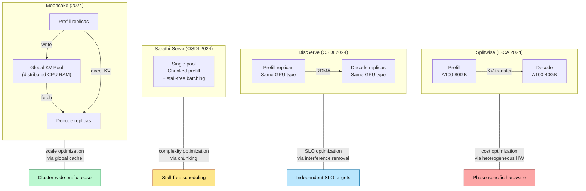
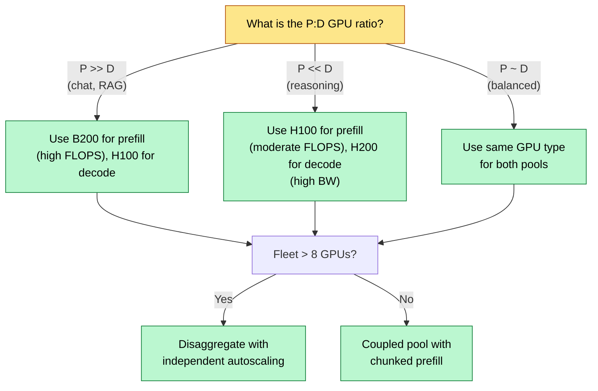
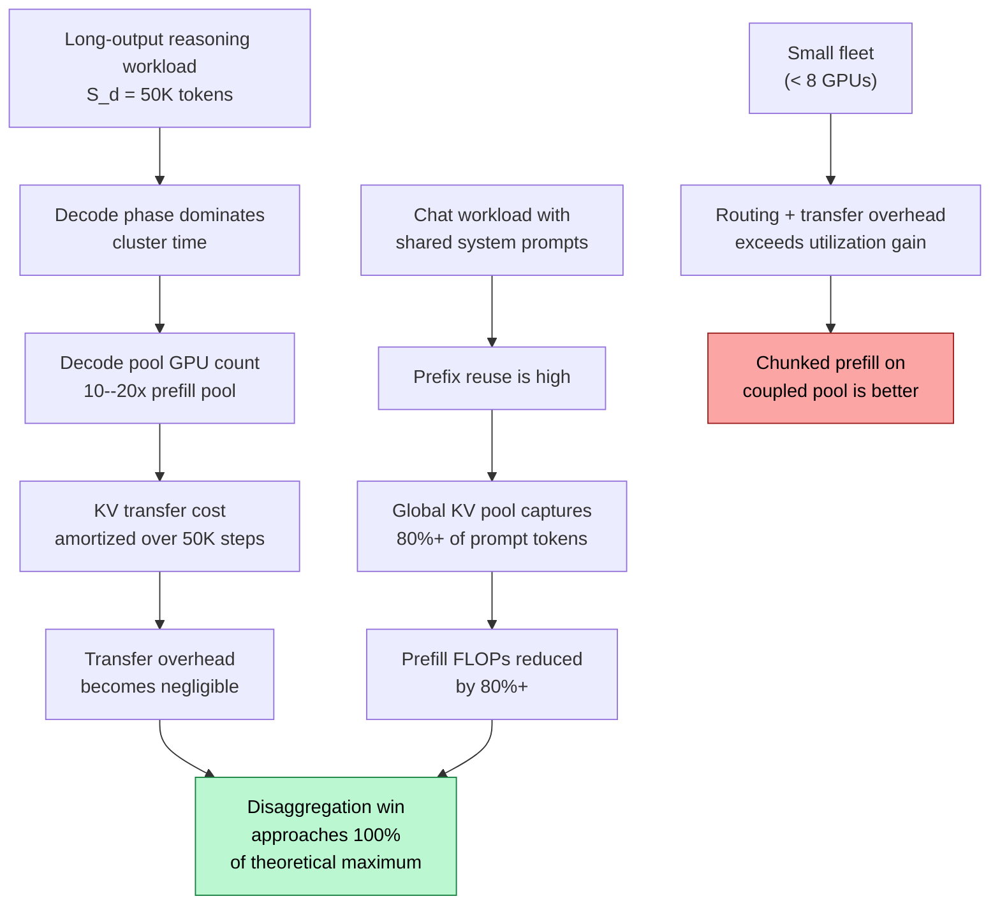

# Disaggregated Serving 2025 — Mooncake, Dynamo, and the Future of LLM Serving

> **Layer:** L8. **Prerequisites:** [Prefill_Decode_Disaggregation](Prefill_Decode_Disaggregation.md), [KV_Cache](KV_Cache.md), [Networking_and_Interconnect](../L4_Systems_and_Interconnects/Networking_and_Interconnect.md). **Hands off to:** [Production_Architecture](Production_Architecture.md), [Kubernetes_and_Orchestration](Kubernetes_and_Orchestration.md).

---

## 0. Why This Page Exists

[Prefill_Decode_Disaggregation](Prefill_Decode_Disaggregation.md) established the roofline argument: prefill is compute-bound, decode is memory-bound, and mixing them on one pool wastes both resources. That page covered the mechanism — separate GPU pools, KV transfer, pool sizing math. This page covers what happened next: an explosion of systems research and production deployments that took disaggregation from a thesis to the default serving architecture at every major lab.

Four research systems defined the design space. Splitwise (Microsoft, ISCA 2024) proved that heterogeneous hardware assignment saves money. DistServe (OSDI 2024) proved that interference elimination alone justifies disaggregation even on identical hardware. Sarathi-Serve (OSDI 2024) asked whether chunked prefill could substitute for disaggregation at lower complexity. Mooncake (Moonshot AI, 2024) extended disaggregation across the cluster with a global KV pool, achieving prefix-cache hit rates of 80%+ at fleet scale versus 30--50% per replica.

By 2025, the ideas landed in production. NVIDIA Dynamo ships disaggregated prefill/decode as a first-class feature with NIXL transport and global KV pooling. Meta's llm-d provides a vendor-neutral open-source counterpart. SGLang and vLLM both support disaggregated modes natively.

This page covers all six systems, the engineering patterns they share, the economics that drive adoption, and the regime where disaggregation wins versus where simpler alternatives suffice.

---

## 1. The Canonical Research Systems

### 1.1 Splitwise — Heterogeneous Hardware for Each Phase

Splitwise (Patel et al., ISCA 2024) observed that prefill and decode have not just different bottlenecks but different hardware optima. Prefill wants maximum FLOPS; decode wants maximum HBM bandwidth. A cost-minimizing deployment can therefore assign different GPU tiers to each phase.

**Key results on Llama-2-70B:**

| Configuration | Throughput (tok/s/GPU) | TTFT SLO < 500 ms | TPOT SLO < 50 ms |
|---------------|----------------------|-------------------|------------------|
| Coupled baseline | 210 | 87% | 78% |
| Disaggregated, homogeneous (A100-80GB both pools) | 320 (+52%) | 99% | 98% |
| Disaggregated, heterogeneous (A100-80GB prefill, A100-40GB decode) | 380 (+81%) | 99% | 98% |

The heterogeneous configuration uses cheaper A100-40GB GPUs for decode because decode does not require 80 GB of HBM at moderate batch sizes. The savings are not just in hardware cost but in power and rack density.

**Limitation:** Splitwise assumes static pool sizes and does not address dynamic workload shifts where the prefill-to-decode ratio changes over time.

### 1.2 DistServe — Interference Elimination as Justification

DistServe (Zhong et al., OSDI 2024) made a sharper claim: even on identical hardware, disaggregation wins because it eliminates SLO violations caused by phase interference. A single long-prefill request stalls every decode in the same batch; disaggregation prevents this entirely.

**Key results on ShareGPT traces, Llama-2-70B, 8xA100 node:**

| Metric | Coupled (vLLM) | DistServe |
|--------|---------------|-----------|
| Goodput (req/s at SLO) | 1.8 | 4.4 (+144%) |
| TTFT p99 | 2,100 ms | 480 ms |
| TPOT p99 | 180 ms | 42 ms |
| KV transfer overhead | 0 ms | 8--15 ms |

The 8--15 ms KV transfer overhead is small relative to the 200--500 ms prefill time and eliminates the interference that causes the coupled system's high tail latency. The "DistServe formulation" — independent SLO satisfaction per phase with pool sizes derived accordingly — became the standard capacity-planning approach.

### 1.3 Sarathi-Serve — Chunked Prefill as an Alternative

Sarathi-Serve (Holmes et al., OSDI 2024) took a different path. Instead of disaggregating, it eliminates interference within a single pool via **chunked prefill**: each scheduling step processes a small chunk of prompt tokens alongside ongoing decode sequences. Long prompts are spread across many steps, preventing any single prefill from monopolizing compute.

**Stall-free scheduling.** Sarathi-Serve's key innovation is the stall-free batch: the number of decode tokens in each step is fixed, and prefill chunks are admitted only in the remaining compute budget. This guarantees that decode TPOT is bounded by the step time of a pure-decode batch, regardless of prompt length.

**Production impact.** Chunked prefill is now the default in vLLM, SGLang, and TensorRT-LLM. The technique is complementary to disaggregation: even in a disaggregated system, the prefill pool uses chunked prefill to batch multiple requests' prompt chunks together.

### 1.4 Mooncake — Cluster-Scale KV Pool

Mooncake (Qin et al., 2024) extended disaggregation from a per-node or per-rack concern to a cluster-wide architecture. The key innovation is a **global KV pool** — a distributed tier of KV cache blocks stored across the CPU RAM of all nodes in the cluster.

**Architecture.** Three tiers: prefill replicas, decode replicas, and a global KV pool. Prefill replicas compute prompt KV and write it to local HBM plus the global pool (CPU RAM tier). Decode replicas pull cached blocks from the pool when starting a new sequence. A distributed hash table (DHT) indexes every KV block by content hash.

**Prefix-cache hit rate.** At cluster scale, the effective cache is the union of all replicas' KV pools. Mooncake reports 80%+ prefix-cache hit rates on chat workloads, versus 30--50% on single-replica caches. The throughput improvement comes primarily from avoiding redundant prefill computation on shared prefixes (system prompts, conversation history, RAG documents).

**Transfer mechanism.** Remote KV blocks are fetched via RDMA from the host node's CPU RAM. For chat workloads where hits are frequent and prompts average 10K tokens, the 10--50 ms fetch is dramatically faster than recomputing the full prefill.

---

## 2. Comparison of Approaches

| Dimension | Splitwise | DistServe | Sarathi-Serve | Mooncake |
|-----------|-----------|-----------|---------------|----------|
| Core insight | Heterogeneous HW per phase | Interference elimination | Chunked prefill avoids stalls | Global KV pool for prefix reuse |
| Minimum scale | 2 GPU types | 2+ replicas | 1 GPU | Cluster (10+ nodes) |
| KV transfer | Required | Required (RDMA) | None | Required (RDMA to/from pool) |
| Prefix caching | Per-replica | Per-replica | Per-replica | Cluster-wide DHT |
| Hardware specialization | Yes | Optional | No | Optional |
| Complexity | Moderate | Moderate | Low | High |
| Throughput gain vs coupled | 52--81% | 144% goodput | 30--60% | 1.5--2x |
| Best for | Cost-sensitive fleet | SLO-strict production | Small/medium scale | Large chat/agentic fleet |

---

## 3. Mooncake Deep Dive

### 3.1 Block Hashing and the Distributed Hash Table

Each KV block is hashed by a chain that encodes both content and position:

$$h_i = \text{Hash}(h_{i-1},\ \text{token\_ids}[i \cdot B_s : (i+1) \cdot B_s])$$

where $B_s$ is the block size (typically 16 tokens) and $h_{-1} = 0$. The hash is registered in a distributed hash table (DHT) keyed by $h_i$, valued by the physical location (node ID + block address).

When a new request arrives:

1. Tokenize the prompt and compute block hashes greedily from position 0.
2. Query the DHT for each block hash in sequence.
3. On first miss, stop. All preceding hits are reusable; the suffix must be prefilled.
4. During prefill, skip matched blocks. Transfer cached blocks from their host nodes via RDMA.

### 3.2 The Bandwidth Tradeoff

Cluster-wide pooling trades local access speed for effective cache size. A local HBM prefix cache delivers at 3+ TB/s bandwidth. A remote fetch from another node's CPU RAM via RDMA delivers at 50--100 GB/s. For a chat workload where hits avoid recomputing thousands of tokens of prefill, the 10--50 ms fetch delay is a net win:

$$\text{Prefill time for } K \text{ tokens} = \frac{2 \cdot N \cdot K}{\eta_p \cdot \pi} \gg \frac{K \cdot c_{\text{token}} \cdot B_s}{\beta_{\text{RDMA}}} = \text{fetch time}$$

For Llama-3-70B at $K = 2000$ tokens, prefill takes ~200 ms. Fetching the same KV from a remote node at 100 GB/s takes $2000 \times 320\text{ KB} / 100\text{ GB/s} \approx 6.4$ ms. The fetch is 30x faster.

### 3.3 Hit-Rate Economics

| Scale | Effective cache size | Prefix hit rate (chat) | Prefill FLOPs saved |
|-------|---------------------|----------------------|-------------------|
| 1 replica | 80 GB HBM | 30--50% | 30--50% of prompt tokens |
| 4 replicas, shared index | 320 GB HBM | 50--65% | Moderate |
| 10+ nodes, global CPU pool | 5+ TB CPU RAM | 80%+ | Majority of shared prefixes |

The hit rate improves because system prompts, RAG documents, and conversation history are shared across users. At fleet scale, a small number of hot prefixes account for a large fraction of all prompt tokens. The global pool captures these; per-replica caches cannot.

### 3.4 Eviction and Consistency

The global pool uses LRU eviction per node. A KV block is evicted only when the host node's CPU RAM is full and the block has zero references from any active sequence. Consistency is eventual: stale blocks (from a model update) are detected by including the model version in the block hash input. A version mismatch forces a cache miss and fresh prefill.

---

## 4. Production Stacks

### 4.1 NVIDIA Dynamo

NVIDIA's flagship multi-node inference fabric, generally available in 2024--2025. Dynamo integrates disaggregated serving with KV transport, prefix caching, and autoscaling.

**Components:**

| Component | Role |
|-----------|------|
| Frontend / Router | Prefix-aware, multi-tenant, OpenAI-compatible API |
| Engine backend | TensorRT-LLM or vLLM as per-replica engines |
| NIXL | KV transfer transport, GPU-to-GPU/CPU/storage |
| Global KV pool | Optional Mooncake-style tier across node CPU RAM |
| Disaggregated PD | Native configurable prefill/decode pool sizing |
| Autoscaling | Hooks into Kubernetes HPA and NIM operators |

Dynamo is NVL72-aware: when prefill and decode instances share an NVL72 rack, it routes KV transfer over the NVLink fabric at 1.8 TB/s aggregate per GPU, eliminating the InfiniBand hop entirely.

### 4.2 llm-d (Meta)

Meta's open-source disaggregated serving stack. Conceptually similar to Dynamo but vendor-agnostic:

- vLLM-based engines for both prefill and decode pools.
- Distributed KV pool with locality-aware routing.
- Kubernetes-native deployment via custom controllers.
- Open-sourced in 2024; production-hardened at Meta scale.

llm-d targets deployments that want disaggregation without NVIDIA-specific transport. It uses NCCL for intra-node transfer and NCCL-over-IB or Gloo for inter-node.

### 4.3 SGLang Disaggregated Mode

SGLang has built-in disaggregated prefill/decode since v0.4. Combined with RadixAttention (token-level prefix sharing via radix tree), SGLang is particularly effective for chat and agentic workloads with high prefix reuse. The radix tree serves as both the prefix cache index and the routing hint.

### 4.4 vLLM V1 Disaggregated Mode

vLLM V1 integrates with NIXL for KV transfer. Supports disaggregated prefill/decode with configurable pool sizes and prefix-aware routing. Production-ready in 2025.

### 4.5 Production Stack Comparison

| Feature | NVIDIA Dynamo | llm-d | SGLang | vLLM V1 |
|---------|--------------|-------|--------|---------|
| Engine | TRT-LLM / vLLM | vLLM | Custom | Custom |
| KV transport | NIXL | NCCL / Gloo | Custom | NIXL |
| Global KV pool | Yes | Yes | RadixAttention | Per-replica APC |
| Heterogeneous pools | Yes | Yes | Yes | Yes |
| K8s integration | NIM operator | Custom controller | Manual | Manual |
| Vendor lock-in | NVIDIA transport | None | None | NIXL optional |
| Best for | NVIDIA fleet | Multi-vendor fleet | Chat/agentic | General-purpose |

---

## 5. Engineering Patterns

### 5.1 KV Transfer Transport Selection

| Transport | Bandwidth | Scope | When used |
|-----------|-----------|-------|-----------|
| NVLink P2P | 900 GB/s | Intra-node | P and D on same server |
| NVL72 fabric | 1.8 TB/s aggregate per GPU | Intra-rack | P and D in same NVL72 |
| InfiniBand XDR | 100 GB/s per port | Inter-node | Modern clusters |
| InfiniBand NDR | 50 GB/s per port | Inter-node | Prior-gen clusters |
| RoCE v2 (Ethernet) | 50--100 GB/s | Inter-node | Spectrum-X clusters |
| TCP (fallback) | 5--12 GB/s | Anywhere | Development only |

NIXL selects the optimal transport at runtime based on source/destination topology. Verify correct selection via `NCCL_DEBUG=INFO` logs; a fallback to TCP indicates a misconfigured fabric.

### 5.2 Layer-Pipelined Transfer

Naive transfer waits for all layers to complete prefill before beginning the transfer. Layer pipelining overlaps transfer with compute:

```mermaid
gantt
    title Layer-pipelined KV transfer (4-layer example)
    dateFormat X
    axisFormat %L

    section Prefill GPU
    Prefill Layer 0           :p0, 0, 10
    Prefill Layer 1           :p1, 10, 20
    Prefill Layer 2           :p2, 20, 30
    Prefill Layer 3           :p3, 30, 40

    section Fabric
    Transfer KV Layer 0       :x0, 10, 12
    Transfer KV Layer 1       :x1, 20, 22
    Transfer KV Layer 2       :x2, 30, 32
    Transfer KV Layer 3       :x3, 40, 42

    section Decode GPU
    Decode forward pass       :d0, 42, 47
```

Each layer's KV is transferred as soon as its prefill completes. Transfer of layer $l$ is hidden behind prefill compute of layer $l+1$. The visible transfer latency is:

$$t_{\text{visible}} = \max\!\left(0,\; \frac{\text{KV}_{\text{bytes}} / L}{\beta_{\text{fabric}}} - \frac{t_{\text{prefill}}}{L}\right)$$

On NVLink where per-layer transfer ($\sim 0.5$ ms) is much faster than per-layer prefill ($\sim 5$ ms), visible latency is zero. Even on InfiniBand NDR, transfer is hidden for prompts longer than ~256 tokens on a 70B model.

### 5.3 Tensor-Parallelism Layout Translation

When prefill uses $\text{TP}_p$ and decode uses $\text{TP}_d \neq \text{TP}_p$, the KV is sharded differently across GPUs. A **manifest** maps (layer, head) from source shard layout to destination shard layout. The transfer kernel performs scatter-gather based on this manifest without staging through a full all-gather.

Production systems (Dynamo, llm-d) build the manifest once when pool topology changes and reuse it for all transfers. The manifest is small: $L \times H_{kv}$ entries, a few KB.

### 5.4 Locality-Aware Routing

The frontend router maintains a prefix-cache index across all prefill replicas:

1. Hash the incoming prompt's prefix blocks.
2. Query the index for each hash — which replicas hold these blocks?
3. Score each candidate replica by: (prefix hit count) $\times w_{\text{locality}}$ + (available capacity) $\times w_{\text{load}}$.
4. Route to the highest-scoring replica.

Data structures for the index: radix tree (SGLang), Bloom filter with per-replica bitmaps (vLLM APC), or DHT (Mooncake). The index refreshes as caches evolve; stale entries cause unnecessary misses but never correctness errors.

### 5.5 Failure Modes and Recovery

| Failure | Impact | Recovery |
|---------|--------|----------|
| Prefill replica fails mid-prefill | No output tokens produced; client retries transparently | Route to different replica; prefix cache warm-up on new replica |
| Decode replica fails mid-stream | Active sequences lose KV; client sees truncated response | Client retries; re-prefill on new replica. Buddy replication doubles cost, rarely justified |
| Network partition between pools | In-flight transfers lost; new admissions paused | Drain each side independently; re-admit after partition heals |
| Global KV pool node fails | Blocks on that node become unavailable | Hit rate drops; requests fall back to full prefill; DHT removes stale entries |

Most production systems accept a small failure-rate budget ($< 0.1\%$ of requests) rather than pay for KV replication. The cost of a re-prefill is amortized across the thousands of successful requests between failures.

---

## 6. Pool Sizing and the Reasoning Shift

### 6.1 Sizing Formulas

For request rate $\lambda$, average prompt length $S_p$, average output length $S_d$, model parameter count $N$:

**Prefill pool GPUs:**

$$N_p = \frac{\lambda \cdot 2 \cdot N \cdot S_p}{\eta_p \cdot \pi_{\text{GPU}}}$$

**Decode pool GPUs:**

$$N_d = \frac{\lambda \cdot S_d \cdot \left(W_{\text{bytes}} + c_{\text{token}} \cdot \left(S_p + \frac{S_d}{2}\right)\right)}{\eta_d \cdot \beta_{\text{GPU}}}$$

where $c_{\text{token}}$ is the per-token KV cost in bytes, $W_{\text{bytes}}$ is the weight footprint, $\eta_p \approx 0.4$--$0.6$, and $\eta_d \approx 0.7$--$0.85$.

### 6.2 The Reasoning Workload Shift

In 2023--2024, standard chat models had $S_p \approx 1000$, $S_d \approx 200$. Prefill dominated; typical $N_p : N_d$ ratios were 5:1 to 30:1. Reasoning models (OpenAI o1/o3, DeepSeek-R1) changed this fundamentally:

- Output lengths explode to $S_d = 10{,}000$--$100{,}000$+ tokens due to latent chain-of-thought.
- The decode phase now dominates cluster time. A single request occupies a decode slot for minutes.
- $N_p : N_d$ ratios flip to 1:10 to 1:20 in 2026 deployments.
- The KV transfer cost is amortized over tens of thousands of decode steps, becoming negligible.
- FP4 KV quantization reduces the transfer payload by 4x, further trivializing the network hop.

### 6.3 Worked Example: Chat Workload

Parameters: $\lambda = 200$ req/s, $S_p = 2000$, $S_d = 300$, Llama-3-70B FP16 ($W = 140$ GB, $c_{\text{token}} = 320$ KB), H100 ($\pi = 990$ TFLOPS, $\beta = 3.35$ TB/s).

**Prefill:**

$$\Phi_p = 200 \times 2 \times 70 \times 10^9 \times 2000 = 5.6 \times 10^{16} \text{ FLOP/s}$$

$$N_p = \frac{56{,}000 \text{ TFLOP/s}}{0.5 \times 990 \text{ TFLOP/s}} \approx 113 \text{ GPUs}$$

**Decode:**

$$\bar{Q}_d = 140 + 0.000320 \times (2000 + 150) = 140.7 \text{ GB}$$

$$N_d = \frac{200 \times 300 \times 140.7 \text{ GB}}{0.75 \times 3350 \text{ GB/s}} \approx 3.4 \approx 4 \text{ GPUs}$$

**Ratio:** $N_p : N_d \approx 28:1$. Chat is overwhelmingly prefill-heavy.

### 6.4 Worked Example: Reasoning Workload

Parameters: $\lambda = 50$ req/s, $S_p = 500$, $S_d = 8000$, same model.

**Prefill:**

$$N_p = \frac{50 \times 2 \times 70 \times 10^9 \times 500}{0.5 \times 990 \times 10^{12}} = \frac{3{,}500}{495} \approx 7 \text{ GPUs}$$

**Decode:**

$$\bar{Q}_d = 140 + 0.000320 \times (500 + 4000) = 141.4 \text{ GB}$$

$$N_d = \frac{50 \times 8000 \times 141.4}{0.75 \times 3350} \approx 22.5 \approx 23 \text{ GPUs}$$

**Ratio:** $N_p : N_d \approx 1:3$. Decode dominates. This is the regime where H200 (4.8 TB/s HBM BW) or B200 (8.0 TB/s) justifies the premium for decode GPUs.

**The point:** the ratio $N_p / N_d$ varies by over 80x between workload types. A coupled system provisions for the maximum of both; disaggregation lets each pool scale independently.

---

## 7. Economics of Disaggregation

### 7.1 Cost-per-Token Model

For a coupled system, the cost per token is dominated by the underutilized resource:

$$C_{\text{coupled}} = \frac{N_{\text{total}} \cdot P_{\text{GPU}}}{\text{throughput}_{\text{coupled}}}$$

where $N_{\text{total}}$ is sized for peak demand of both phases and $P_{\text{GPU}}$ is the GPU price per hour.

For a disaggregated system:

$$C_{\text{disagg}} = \frac{N_p \cdot P_{\text{prefill\_GPU}} + N_d \cdot P_{\text{decode\_GPU}}}{\text{throughput}_{\text{disagg}}}$$

The disaggregated system saves in three ways:

1. **Right-sized pools:** no wasted capacity on the non-bottleneck phase.
2. **Heterogeneous hardware:** assign cheaper GPUs to decode (or more expensive, higher-bandwidth GPUs depending on the ratio).
3. **Higher per-GPU utilization:** each GPU operates near its roofline optimum (80--95% vs 50--65% in coupled mode).

### 7.2 Break-Even Analysis

| Fleet size | Coupled cost/token (relative) | Disaggregated cost/token (relative) | Winner |
|------------|------------------------------|------------------------------------|--------|
| 2 GPUs | 1.0 | 1.3 (routing overhead dominates) | Coupled |
| 8 GPUs | 1.0 | 0.85 | Disaggregated |
| 32 GPUs | 1.0 | 0.70 | Disaggregated |
| 128 GPUs | 1.0 | 0.55 | Disaggregated |
| 128 GPUs + global KV pool | 1.0 | 0.45 | Disaggregated + Mooncake |

Below ~8 GPUs, the operational overhead (routing, monitoring, pool management) exceeds the utilization gain. Above ~32 GPUs, the benefit is unambiguous.

### 7.3 Hardware Assignment Decision

---

## 8. Multi-Tenant and Multi-Model Disaggregation

### 8.1 Per-Tenant Pool Isolation

In a multi-tenant SaaS deployment, segregate prefill/decode pools per tenant for isolation. This eliminates noisy-neighbor effects but is expensive: each tenant requires a minimum viable deployment (at least 1 prefill instance + 1 decode instance). Cost-effective only for premium tenants with guaranteed SLAs.

### 8.2 Shared Pools with Priority

More common in practice. Shared pools with priority queues: high-priority tenants preempt; low-priority tenants tolerate longer queues. Per-tenant KV-cache quotas prevent runaway sequences from starving others. This is the approach used by Dynamo and llm-d.

### 8.3 Multi-Model Hosting

Hosting multiple model families in disaggregated mode:

- Per-model prefill replicas (model weights are large; prefill replicas are pinned per model).
- Per-model decode replicas.
- Or: model-server pooling where one replica swaps models in/out for cold-start-sensitive, low-traffic models.

Routing decisions cascade: select model $\to$ select prefill replica with best prefix locality $\to$ select decode replica with available KV space.

### 8.4 LoRA in Disaggregated Mode

Per-LoRA traffic can have its own decode pool to avoid adapter-loading thrashing. Alternatively, a shared pool with hot-LoRA replication across decode instances. SGLang and vLLM both support multi-LoRA in disaggregated mode. The key constraint: LoRA weights must be available on both the prefill replica (for the prompt) and the decode replica (for generation).

---

## 9. SLO Accounting with Disaggregation

TTFT in a disaggregated system decomposes as:

$$\text{TTFT} = t_{\text{queue}} + t_{\text{prefill}} + t_{\text{transfer}} + t_{\text{first\_decode}}$$

With layer pipelining, $t_{\text{transfer}}$ is approximately:

$$t_{\text{transfer}} \approx \max\!\left(0,\; \frac{\text{KV}_{\text{bytes}}}{\beta_{\text{fabric}}} - t_{\text{prefill}} \cdot \frac{L - 1}{L}\right)$$

For Llama-3-70B with $S_p = 4096$, $L = 80$, KV = 1.25 GB on NVLink ($\beta = 900$ GB/s):

$$t_{\text{transfer}} = \max\!\left(0,\; 1.4\text{ ms} - 200\text{ ms} \times \frac{79}{80}\right) = 0 \text{ ms}$$

Fully hidden. On IB NDR ($\beta = 50$ GB/s): $t_{\text{transfer}} = \max(0, 25\text{ ms} - 197.5\text{ ms}) = 0$. Still fully hidden.

TPOT is determined purely by the decode pool: $t_d = \bar{Q}_d / (\eta_d \cdot \beta_{\text{HBM}})$. There is no interference from prefill bursts.

**SLO budget example** (TTFT < 500 ms):

| Component | Time |
|-----------|------|
| Queue + admission | 50 ms |
| Prefill (S=2K, 70B) | 200 ms |
| KV transfer (NVL72) | 0 ms (hidden) |
| First decode step | 5 ms |
| **Total TTFT** | **255 ms** |

254 ms of headroom. Even if the transfer is not fully hidden (e.g., IB at 25 ms), the budget is met at 280 ms.

---

## 10. End-to-End Cause and Effect

---

## 11. Numbers to Memorize

| # | Quantity | Value | Context |
|---|----------|-------|---------|
| 1 | Mooncake prefix-cache hit rate (cluster) | 80%+ | Chat workloads, vs 30--50% per replica |
| 2 | DistServe goodput improvement | 2.4x (144%) | vs coupled vLLM at same SLO |
| 3 | Splitwise throughput gain (heterogeneous) | 81% | A100-80GB prefill, A100-40GB decode |
| 4 | Sarathi-Serve throughput gain | 30--60% | Single pool, no disaggregation |
| 5 | Chat workload P:D GPU ratio | 28:1 | $S_p=2000$, $S_d=300$, 70B model |
| 6 | Reasoning workload P:D GPU ratio | 1:3 to 1:20 | $S_d=8K$--$100K$ tokens |
| 7 | KV payload, Llama-3-70B, S=4K, FP16 | 1.25 GB | Transfer between pools |
| 8 | KV transfer via NVLink P2P | ~1.4 ms | Fully hidden by layer pipelining |
| 9 | KV transfer via IB NDR | ~25 ms | Hidden for prompts > 256 tokens |
| 10 | KV transfer via TCP | 100--250 ms | Exceeds TTFT budget; do not use |
| 11 | Layer-pipelined transfer, visible latency | ~0 ms | On NVLink for prompts > 128 tokens |
| 12 | Prefill pool utilization ($\eta_p$) | 0.4--0.6 | Non-GEMM overhead reduces peak |
| 13 | Decode pool utilization ($\eta_d$) | 0.7--0.85 | Attention softmax overhead |
| 14 | Disaggregation break-even fleet size | ~8 GPUs | Below this, coupled is cheaper |
| 15 | Cost-per-token reduction at 128 GPUs | 45--55% | vs coupled baseline |
| 16 | H200 HBM bandwidth advantage | +43% vs H100 | 4.8 TB/s vs 3.35 TB/s |
| 17 | B200 FP16 FLOPS advantage | +127% vs H100 | 2,250 vs 990 TFLOPS |
| 18 | FP8 KV compression, transfer reduction | 2x | Halves payload and decode BW |
| 19 | FP4 KV compression, transfer reduction | 4x | Reasoning model deployments |
| 20 | Minimum viable disaggregated deployment | 4 GPUs | 1 prefill + 1 decode instance (TP=2) |
| 21 | Global KV pool effective cache size | 5+ TB | 10 nodes x 512 GB CPU RAM each |
| 22 | Decode failure re-prefill cost | 1 request | Acceptable at < 0.1% failure rate |
| 23 | Chunked prefill step time (Sarathi) | Equal to pure-decode step | Stall-free guarantee |
| 24 | NVL72 aggregate BW per GPU | 1.8 TB/s | Full NVLink to any peer in rack |
| 25 | DHT lookup latency | < 1 ms | Negligible vs prefill time |

---

## 12. Worked Problems

### Problem 1: Pool Sizing for a Mixed Workload

**Q:** A deployment serves two workload classes: (a) chat: $\lambda_c = 150$ req/s, $S_p = 1500$, $S_d = 250$; (b) reasoning: $\lambda_r = 20$ req/s, $S_p = 800$, $S_d = 12000$. Model: Llama-3-70B FP16 on H100. How many GPUs for each pool?

**A:**

Total $\lambda = 170$ req/s. Aggregate prefill and decode demand separately.

**Prefill pool:**

$$\Phi_p = (150 \times 1500 + 20 \times 800) \times 2 \times 70 \times 10^9 = (225{,}000 + 16{,}000) \times 140 \times 10^9 = 33.74 \times 10^{15} \text{ FLOP/s}$$

$$N_p = \frac{33{,}740 \text{ TFLOP/s}}{0.5 \times 990 \text{ TFLOP/s}} \approx 68 \text{ GPUs}$$

**Decode pool:**

Chat average KV: $c_{\text{token}} \times (S_p + S_d/2) = 320\text{ KB} \times (1500 + 125) = 0.52$ GB per seq. $\bar{Q}_{d,c} = 140 + 0.52 = 140.5$ GB.

Reasoning average KV: $320\text{ KB} \times (800 + 6000) = 2.18$ GB per seq. $\bar{Q}_{d,r} = 140 + 2.18 = 142.2$ GB.

$$\Phi_d = 150 \times 250 \times 140.5 + 20 \times 12000 \times 142.2 = 5.27 + 34.1 = 39.4 \text{ TB/s}$$

$$N_d = \frac{39.4 \text{ TB/s}}{0.75 \times 3.35 \text{ TB/s}} \approx 15.7 \approx 16 \text{ GPUs}$$

**Ratio:** $N_p : N_d \approx 4.3 : 1$. Despite the reasoning workload's long outputs, the chat volume keeps prefill dominant.

### Problem 2: Transfer Time Budget

**Q:** A disaggregated deployment uses IB NDR (50 GB/s per port, 4 ports per node) between prefill and decode pools. Llama-3-70B, $S_p = 8192$, FP16 KV. What is the KV transfer time without pipelining? With layer pipelining, how much is hidden behind prefill?

**A:**

KV payload: $8192 \times 320\text{ KB} = 2.5$ GB. Fabric BW: $4 \times 50 = 200$ GB/s.

Without pipelining: $t_{\text{transfer}} = 2.5 / 200 = 12.5$ ms.

With pipelining, prefill time for $S = 8192$: $t_{\text{prefill}} \approx 2 \times 70 \times 10^9 \times 8192 / (0.5 \times 990 \times 10^{12}) \approx 2313$ ms.

Hidden portion: $t_{\text{prefill}} \times (L-1)/L = 2313 \times 79/80 = 2284$ ms. Since per-layer transfer (12.5/80 = 0.16 ms) is much less than per-layer prefill (2313/80 = 28.9 ms), all 79 layers of transfer are hidden.

Visible transfer: $\max(0, 0.16 - 28.9) \times 80 + 0.16 = 0.16$ ms. Negligible.

### Problem 3: Global KV Pool Hit-Rate Savings

**Q:** A chat service with 1000 concurrent users shares a 2048-token system prompt. Average user message is 400 tokens. Without prefix caching, each request prefills 2448 tokens. With Mooncake's global KV pool (80% prefix hit rate on the system prompt), how many prefill GPUs are saved? Model: Llama-3-70B on H100, $\lambda = 500$ req/s.

**A:**

Without caching: $\Phi_p = 500 \times 2 \times 70 \times 10^9 \times 2448 = 1.714 \times 10^{17}$ FLOP/s. $N_p = 171{,}400 / 495 \approx 346$ GPUs.

With 80% hit rate: 80% of requests skip the 2048-token system prompt, prefilling only 400 tokens. 20% must prefill the full 2448.

Average tokens prefilled: $0.8 \times 400 + 0.2 \times 2448 = 320 + 490 = 810$.

$\Phi_p' = 500 \times 2 \times 70 \times 10^9 \times 810 = 5.67 \times 10^{16}$ FLOP/s. $N_p' = 56{,}700 / 495 \approx 115$ GPUs.

**Savings:** $346 - 115 = 231$ GPUs, a 67% reduction in prefill capacity.

### Problem 4: Heterogeneous Hardware Cost

**Q:** A fleet needs 100 H100-equivalent GPUs for prefill and 20 H100-equivalent GPUs for decode. Option A: 120 H100s ($3/GPU-hr). Option B: 100 B200s for prefill ($4.50/GPU-hr, 2.27x FLOPS) + 20 H200s for decode ($3.50/GPU-hr, 1.43x BW). Which is cheaper?

**A:**

Option A: $120 \times \$3 = \$360$/hr. Provides 120 H100s worth of both FLOPS and BW.

Option B: Prefill: 100 B200s provide $100 \times 2.27 = 227$ H100-FLOPS-equivalents (exceeds the 100 needed, so 44 B200s suffice: $100/2.27 \approx 44$). Decode: 20 H200s provide $20 \times 1.43 = 28.6$ H100-BW-equivalents (exceeds the 20 needed, so 14 H200s suffice: $20/1.43 \approx 14$).

Cost: $44 \times \$4.50 + 14 \times \$3.50 = \$198 + \$49 = \$247$/hr.

Option B saves $\$360 - \$247 = \$113$/hr (31%), using 58 total GPUs instead of 120.

### Problem 5: Failure Budget

**Q:** A decode pool of 30 H200 GPUs serves 2000 concurrent sequences. Mean time between decode-GPU failures is 6 months. Average sequence duration is 30 seconds. What fraction of requests are lost to failures?

**A:**

Per-GPU failure rate: $\lambda_f = 1 / (6 \times 30 \times 24 \times 3600) = 6.3 \times 10^{-8}$ failures/second.

Cluster failure rate: $30 \times 6.3 \times 10^{-8} = 1.9 \times 10^{-6}$ failures/second.

Expected failures per year: $1.9 \times 10^{-6} \times 3.15 \times 10^7 \approx 60$ failures/year.

Per failure, sequences on that GPU are lost. Sequences per GPU: $2000 / 30 \approx 67$. Each lost sequence represents one failed request.

Total requests per year: $2000 \times (3.15 \times 10^7 / 30) = 2.1 \times 10^9$.

Lost requests per year: $60 \times 67 = 4020$.

Failure rate: $4020 / 2.1 \times 10^9 = 1.9 \times 10^{-6}$, or 0.00019%. Well within any reasonable failure budget.

---

## 13. Common Pitfalls

**Aggressive disaggregation at small scale.** Below ~8 GPUs, routing overhead, transfer latency, and the minimum viable deployment cost (separate prefill and decode instances) exceed the utilization gain. Use chunked prefill instead.

**Forgetting transfer in the TTFT budget.** The KV transfer consumes 0--25 ms depending on fabric. On InfiniBand, this is a significant fraction of a 500 ms SLO. Always budget for it; verify with load tests.

**Mismatched TP without resharding.** If prefill uses TP=8 and decode uses TP=2, the KV is split across 8 source GPUs but needs to land on 2 destination GPUs. Without manifest-based scatter-gather, the transfer silently falls back to all-gather-then-scatter, wasting bandwidth and memory.

**Static pool sizes.** Traffic patterns shift between prompt-heavy (morning chat) and decode-heavy (overnight batch reasoning). Static $N_p / N_d$ ratios waste one pool during off-peak. Autoscale each pool independently based on per-pool SLO attainment.

**No global cache at cluster scale.** Per-replica prefix caches plateau at 30--50% hit rate. At fleet scale, the marginal return of adding more replicas without a shared cache is zero. A DHT-style global pool (Mooncake, Dynamo, llm-d) is necessary to scale further.

**TCP between pools.** Disaggregation eliminates interference that costs 20--50 ms per prefill burst. If the KV transfer itself takes 100+ ms over TCP, the trade is negative. Disaggregation requires NVLink or RDMA.

**NIXL falling back to TCP.** A misconfigured fabric causes NIXL to silently select TCP transport. The system still functions but performance degrades catastrophically. Verify transport selection in logs under load.

**Orphaned KV blocks.** Failed decode replicas leave KV blocks in the global pool with no active references but no eviction trigger. Garbage collection must scan for blocks with zero references and stale timestamps. Without it, the pool slowly fills with dead entries.

---

## 14. References

1. Patel et al., "Splitwise: Efficient Generative LLM Inference Using Phase Splitting" (ISCA 2024).
2. Zhong et al., "DistServe: Disaggregating Prefill and Decoding for Goodput-Optimized LLM Serving" (OSDI 2024).
3. Holmes et al., "Sarathi-Serve: Taming Compute-End Memory Utilization Imbalance for LLM Serving" (OSDI 2024).
4. Qin et al., "Mooncake: A KVCache-centric Disaggregated Architecture for LLM Serving" (arXiv 2407.00079, 2024).
5. NVIDIA Dynamo product documentation and GTC 2024--2025 technical sessions.
6. llm-d open-source project, Meta (GitHub, 2024--2025).
7. Zheng et al., "SGLang: Efficient Execution of Structured Language Model Programs" (NeurIPS 2024) -- RadixAttention.
8. Kwon et al., "Efficient Memory Management for Large Language Model Serving with PagedAttention" (SOSP 2023).

---

## 15. Stack Links

**Up (deeper):**
- [Prefill_Decode_Disaggregation](Prefill_Decode_Disaggregation.md) -- roofline derivation, KV transfer mechanics, pool sizing formulas
- [KV_Cache](KV_Cache.md) -- per-token cost, PagedAttention, prefix caching, offloading
- [Networking_and_Interconnect](../L4_Systems_and_Interconnects/Networking_and_Interconnect.md) -- NVLink, InfiniBand, RoCE, GPUDirect RDMA
- [Batching_and_Scheduling](Batching_and_Scheduling.md) -- continuous batching, chunked prefill, admission control

**Down (higher level):**
- [Production_Architecture](Production_Architecture.md) -- end-to-end reference stack, capacity planning, cost modeling
- [Kubernetes_and_Orchestration](Kubernetes_and_Orchestration.md) -- GPU operator, MIG, topology-aware scheduling, HPA/KEDA

**Lateral:**
- [Modern_KV_Compression](Modern_KV_Compression.md) -- FP8/INT4 KV, MLA, Quest, MoBA
- [Speculative_Decoding](Speculative_Decoding.md) -- draft/verify, acceptance rate, composition with disaggregation
- [Inference_Frameworks](Inference_Frameworks.md) -- vLLM, SGLang, TRT-LLM feature comparison
