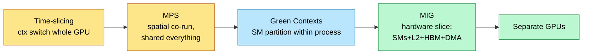

# GPU Multi-Tenancy — MIG, MPS, Time-Slicing, and Fractional GPUs

> **Position in the stack:** the resource-sharing layer between hardware ([GPU_Architecture](../L3_Microarchitecture/GPU_Architecture.md)) and orchestration ([Kubernetes_and_Orchestration](Kubernetes_and_Orchestration.md)). Decides how many workloads share one die and what "isolation" actually means.

---

## 0. Why this page exists

A B200 costs ~$30–40K and most inference workloads cannot saturate it alone: a 8B model at moderate traffic uses a fraction of its compute and a sliver of 192 GB. Fleets therefore pack multiple models, tenants, and job classes per GPU — but a GPU is not a CPU: there is no per-process page protection by default, no preemptive fair scheduler, and one tenant's memory-bandwidth storm degrades everyone. Every production serving platform must choose a point on the sharing-vs-isolation spectrum, and "how would you run 30 small models on 4 GPUs?" is now a standard infra interview question. This page gives the mechanisms (MIG, MPS, time-slicing, green contexts, vGPU), the real isolation properties of each, and the capacity math.

---

## 1. The sharing spectrum

| Mechanism | Granularity | Compute isolation | Memory isolation | BW/L2 isolation | Fault isolation | Use case |
|---|---|---|---|---|---|---|
| **Time-slicing** | whole GPU, alternating | none (serial) | none (oversubscribe → OOM) | n/a | none — one ctx can wedge GPU | dev/test, bursty batch |
| **MPS** | concurrent kernels, % SM hint | soft (`ACTIVE_THREAD_PERCENTAGE`) | none (shared VA space pre-Volta; per-client post-Volta but shared HBM pool) | none | poor — client fatal fault can take peers | many small same-team jobs |
| **Green contexts** (CUDA 12.4+) | SM groups within one process | yes, SM-set partition | same process | shared L2/HBM | same process | latency+batch co-run in one server (e.g., prefill/decode pools) |
| **MIG** | 1/7 … 7/7 of GPU | hard (dedicated SMs) | hard (dedicated HBM slice + L2 slice + DMA engines) | **yes — guaranteed slice BW** | strong (per-instance reset) | multi-tenant prod, clouds |
| **vGPU (SR-IOV)** | VM-attached slice | MIG- or time-sliced backed | VM-level | per backing mode | VM-level | VDI, regulated multi-tenant |

**The one-liner:** MPS shares everything and isolates nothing; MIG partitions the die into N smaller GPUs; time-slicing is concurrency theater (serialized); green contexts are MIG-lite inside one process.

---

## 2. MIG mechanics

Multi-Instance GPU (A100 onward; H100/H200/B200 current) partitions a GPU into up to **7 GPU instances (GIs)**. Each GI owns:

- A set of **GPC/SM groups** (compute slices, 1/7 units),
- A **dedicated HBM address range** with its **own memory controllers' slice → guaranteed bandwidth share**,
- A **carved L2 portion**,
- Dedicated **copy engines / decoders**, and its own fault domain (per-GI reset works).

H100 80GB profiles (memorize the shape, not every row): `1g.10gb` ×7, `2g.20gb` ×3, `3g.40gb` ×2, `4g.40gb` + `3g.40gb`, `7g.80gb` ×1. Compute instances (CIs) can subdivide a GI's SMs while sharing its memory slice. Reconfiguration requires the GI to be idle (drain → repartition — minutes, so fleets pre-declare shapes per node pool rather than re-slicing dynamically).

**What MIG guarantees that nothing else does:** a `3g.40gb` tenant gets ~3/7 of SMs, ~3/8 of bandwidth, its own L2 slice — a noisy neighbor on the other slice **cannot** degrade its tokens/s beyond single-digit %. That QoS guarantee is why clouds bill MIG slices as instance types.

**Costs:** no NVLink between instances' workloads as one job (a MIG slice can't do TP with another slice as if local); aggregate peak FLOPS slightly below whole-GPU (partition overheads); coarse granularity (1/7 steps); per-profile memory sizes may not match your model zoo.

---

## 3. MPS and green contexts

**MPS (Multi-Process Service)** funnels kernels from many processes through one shared GPU context so they **run concurrently on shared SMs** (true spatial sharing, no context-switch serialization). Volta+ gives per-client address spaces and `CUDA_MPS_ACTIVE_THREAD_PERCENTAGE` as a *soft* SM cap. But: HBM is one pool (a leaking client OOMs the GPU), there is no bandwidth or L2 partitioning, and severe client faults can kill sibling clients. Right usage: trusted, homogeneous, small jobs from one team — classic for packing many tiny models or RL env workers.

**Green contexts** (CUDA 12.4+) partition SMs *within* a process into named groups with kernels launched into a specific group. The serving use case: one engine process runs latency-critical decode on a guaranteed SM subset while opportunistic work (prefill backlog, embedding batch, drafting model) consumes the rest — SM-level interference control without MIG's process/memory split. L2/HBM remain shared, so it bounds *compute* interference only.

---

## 4. Kubernetes integration

- **Device plugin (classic):** GPUs advertised as `nvidia.com/gpu: N` — integer allocation only. MIG: each slice appears as its own resource (`nvidia.com/mig-3g.40gb`). Time-slicing/MPS via GPU Operator config exposes *virtual* replicas (`nvidia.com/gpu: 4` on one card) — **scheduling-level fractioning with zero hardware isolation**; know that distinction.
- **DRA (Dynamic Resource Allocation, GA-track since K8s 1.32, standard by 2026):** structured parameters replace the integer model — claims can request "a slice with ≥20 GB and compute class X," enabling on-demand MIG-shape selection, sharing one device among pods explicitly, and topology constraints (same NVLink domain) as first-class scheduling inputs. This is the mechanism modern GPU schedulers (and rack-scale NVL72 scheduling) build on.
- **Fractional-GPU platforms** (Run:ai, Volcano, vendor schedulers): quota + oversubscription + preemption policy layered on the above primitives; the hardware story underneath is still exactly one of: time-slice, MPS, or MIG.

Topology awareness matters more than fractioning at the high end: for TP/EP jobs the scheduler must allocate **whole NVLink domains** ([Rack_Scale_Design](../L4_Systems_and_Interconnects/Rack_Scale_Design.md)); a 16-GPU job spanning two NVL72 racks at 800 Gb/s instead of one rack at NVLink speeds changes collective time by ~5–10×.

---

## 5. Interference — what actually leaks between co-tenants

Measured-scale numbers to reason with (Hopper-class, co-running aggressive neighbor):

| Shared resource | Mechanism | Degradation seen by victim |
|---|---|---|
| HBM bandwidth | neighbor streams memory | **10–40%** on memory-bound victim (MPS/time-slice; ~0 under MIG) |
| L2 cache | working-set eviction | 5–25% on cache-friendly kernels (MPS; bounded by slice under MIG) |
| SM occupancy (MPS no caps) | kernel co-residency | unbounded without `ACTIVE_THREAD_PERCENTAGE` |
| Power/thermal | shared TDP budget | clocks throttle both — even MIG shares the power envelope |
| PCIe/NVLink | H2D copies, KV offload traffic | TTFT jitter; isolate copy engines (MIG gives dedicated CEs) |
| Host CPU/dispatch | shared driver, IRQ | launch-latency jitter — pin cores per tenant |

Decode is memory-bandwidth-bound ([Memory_Hierarchy_and_Roofline](../L3_Microarchitecture/Memory_Hierarchy_and_Roofline.md)), so **bandwidth interference translates ~1:1 into inter-token latency** — the reason latency-SLO inference on shared GPUs without MIG is fragile, and the reason "why is p99 ITL bad only on multi-model nodes?" is a classic debugging interview.

---

## 6. Multi-model serving economics

Packing decision for a fleet of models $i$ with demand $\lambda_i$ (tok/s), per-replica throughput $\mu$, memory footprint $m_i$ (weights + KV at target concurrency):

1. **Big models** (≥ 70B class): whole GPUs / TP groups; multi-tenancy = multi-*tenant traffic* on one engine, isolation via scheduler priorities inside the engine (separate running queues per SLO class).
2. **Mid models** (7–30B): MIG slices matched to $m_i$ — e.g., 8B FP8 ≈ 9 GB weights + KV → `2g.20gb`; 3 such tenants per H100 with hard QoS each.
3. **Small models** (≤ 3B, embedders, rerankers): MPS-pack or in-process multi-model engines (single context hosting many models, e.g., Triton Inference Server ensembles) — isolation sacrificed for density.
4. **Batch/offline** (eval, embedding backfills): time-slice into leftover capacity with preemption, never co-resident with latency SLOs without MIG/green-context fencing.

Utilization math that justifies the complexity: small-model endpoints at low traffic often run GPUs at **5–15% utilization**; packing 4–6 tenants via MIG/MPS lifts revenue per GPU 3–5× at bounded p99 cost — typically the single largest TCO lever in a heterogeneous inference fleet.

---

## 7. Virtualization and confidential computing

- **vGPU / SR-IOV:** the PCIe device exposes virtual functions; a VM gets a slice backed by either time-slicing or MIG. The cloud-provider mechanism for selling fractions with VM-grade boundaries.
- **Confidential computing (Hopper+):** GPU TEE mode — encrypted PCIe traffic (bounce-buffered DMA), attestation of firmware/driver, HBM protected from host inspection. Cost: encrypted-copy overhead on H2D/D2H (single-digit % for compute-bound, more for transfer-heavy). Required by some regulated/multi-party inference deployments; pairs with CPU TEEs (SEV-SNP/TDX).

---

## 8. Numbers to memorize

| Quantity | Value | Why |
|---|---|---|
| MIG max instances | 7 per GPU | slicing granularity |
| H100 MIG smallest slice | 1g.10gb (~1/7 SMs, 10 GB) | unit of hard isolation |
| MIG reconfig | requires idle GI; minutes | pre-declare node-pool shapes |
| MPS SM control | `ACTIVE_THREAD_PERCENTAGE`, soft | no memory/BW isolation |
| Green contexts | CUDA 12.4+, SM groups in-process | decode/prefill fencing |
| BW interference (no MIG) | 10–40% on memory-bound victim | decode ITL degradation |
| Time-sliced K8s "replicas" | scheduling fiction, zero isolation | exam trap |
| DRA | K8s structured device claims (≥1.32) | modern fractional scheduling |
| Low-traffic small-model GPU util | 5–15% | why packing pays 3–5× |
| TEE overhead | ~1–10% (transfer-heavy worst) | confidential inference cost |

---

## 9. Worked problems

**Problem 1 — slice plan.** Fleet: model A (8B FP8, 30K tok/s demand), B (13B FP8, 12K tok/s), C (1B embedder, bursty). Per-H100 throughputs: A 25K tok/s full-GPU, scaling ~linearly with compute slice; B 14K; C trivial. Design a 4×H100 layout with hard SLOs for A and B.

*Solution.* A needs 30K/25K = 1.2 full-GPU-equivalents; B needs 12/14 ≈ 0.86. Layout: GPU1 = A whole (25K). GPU2 = MIG 4g.40gb→B (≈ 4/7×14 ≈ 8K) + 3g.40gb→A (≈ 3/7×25 ≈ 10.7K, total A ≈ 35.7K ✓ headroom). GPU3 = MIG 3g.40gb→B (≈ 6K; B total 14K ✓) + 2g.20gb→C (isolated bursts) + 1g.10gb canary/spares. GPU4 = unsliced for failover/peaks + offline batch under preemption. Hard QoS for A and B via dedicated slices; C cannot hurt them.

**Problem 2 — why p99 broke.** A latency-critical 7B decode (ITL 18 ms p50) shares a GPU via MPS with an embedding batch job. p99 ITL jumps to 31 ms only when the batch runs. Diagnose + fix ladder.

*Solution.* Decode is BW-bound; embedder streams HBM → 10–40% bandwidth theft lines up with 18→31 ms (+72% includes L2 eviction + occasional SM contention). Fix ladder: (1) cap embedder `ACTIVE_THREAD_PERCENTAGE` (helps SM, not BW), (2) green contexts if same process (still not BW), (3) **MIG split** — decode on 4g, embedder on 2g/1g → bandwidth slice guaranteed, p99 returns near baseline, (4) move embedder off-node. MPS knobs cannot fix bandwidth interference — the expected punchline.

**Problem 3 — packing ROI.** 20 small models, each needing 6 GB and peaking at 5% of an H100's compute, currently 20 dedicated GPUs. Consolidate with isolation "good enough" for internal tenants.

*Solution.* Memory: 20×6 = 120 GB → 2×H100-80GB by memory (7 per GPU at 10 GB MIG slices = 14 slices max with 1g.10gb… memory-bound). Options: 3 GPUs with 7×1g.10gb slices (21 hard-isolated slots, ~14% compute each ≥ 5% need ✓) → **20 → 3 GPUs (85% saving)** with per-tenant QoS; or 2 GPUs with MPS packing 10 each (memory fits, soft isolation, blast-radius risk). Recommend MIG-3-GPU for prod, MPS-2-GPU for staging.

---

## 10. Interview snap answers

- **"MIG vs MPS?"** → MIG: hardware partition (SMs+L2+HBM BW+faults), 7 slices max, true QoS, coarse and static. MPS: concurrent kernels in shared context, soft SM caps, no memory/BW/fault isolation, maximal density.
- **"Can two MIG slices serve one model with TP?"** → effectively no — slices are isolated devices without NVLink peering as one domain; TP wants whole GPUs in one NVLink domain.
- **"Fractional GPUs on K8s?"** → three real backings: time-slice (fiction), MPS (soft), MIG (hard); DRA makes the claims expressive but the isolation is whatever the backing gives.
- **"Latency SLO + batch on one GPU?"** → MIG fence (or green contexts within one engine), batch under preemption, never naked MPS — bandwidth interference hits ITL directly.

---

## Cross-references

- Up: [Kubernetes_and_Orchestration](Kubernetes_and_Orchestration.md), [Production_Architecture](Production_Architecture.md), [Observability_and_Debugging](Observability_and_Debugging.md) (interference debugging).
- Down: [GPU_Architecture](../L3_Microarchitecture/GPU_Architecture.md) (SM/L2/HBM structure), [Memory_Hierarchy_and_Roofline](../L3_Microarchitecture/Memory_Hierarchy_and_Roofline.md) (why decode is BW-bound).
- Siblings: [Batching_and_Scheduling](Batching_and_Scheduling.md) (intra-engine sharing), [Agentic_Inference](Agentic_Inference.md) (session workloads on shared fleets).
