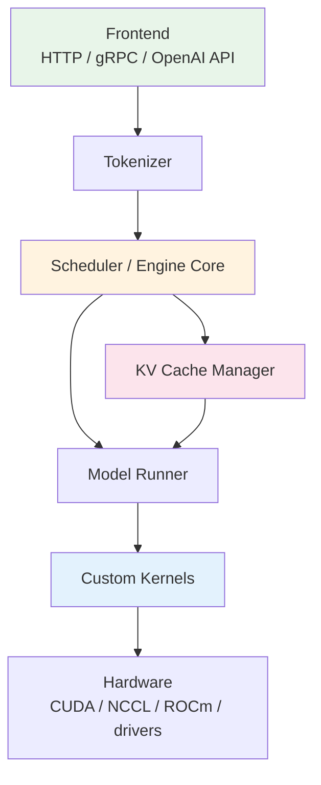
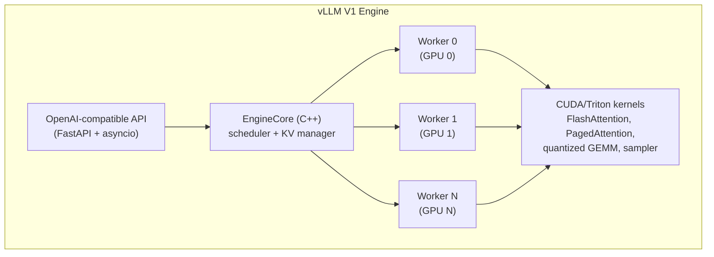
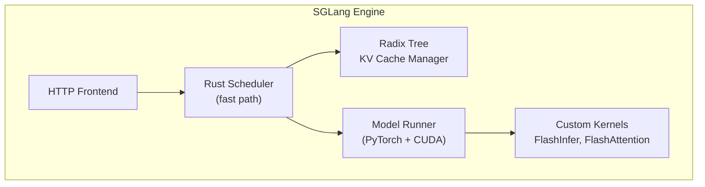
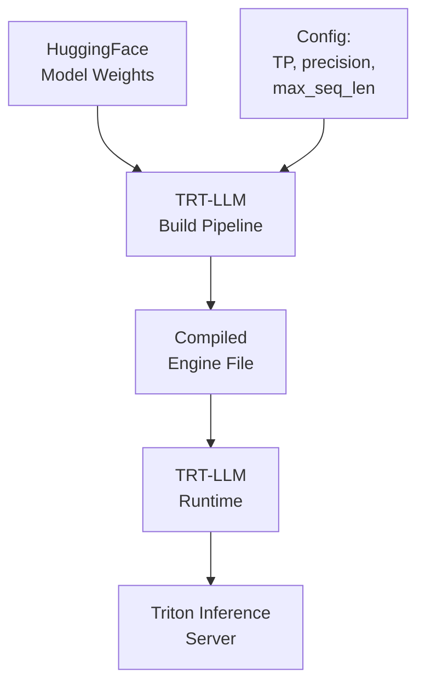
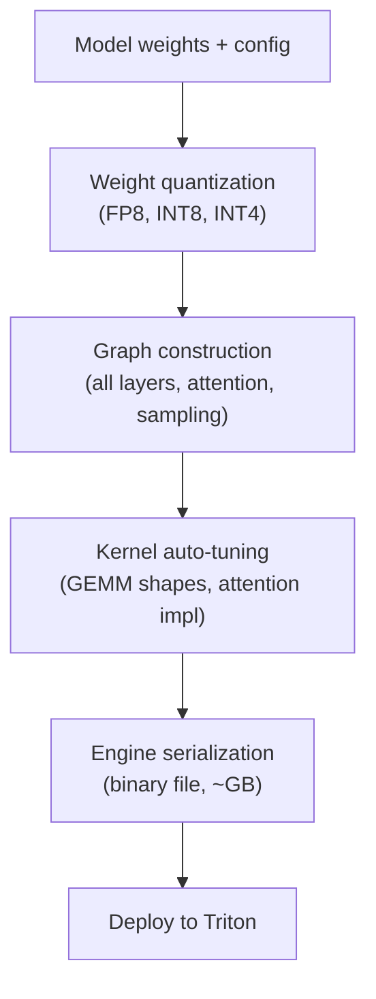
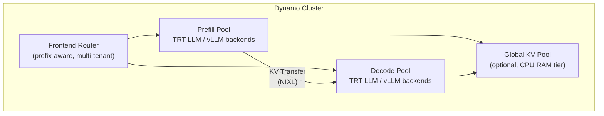
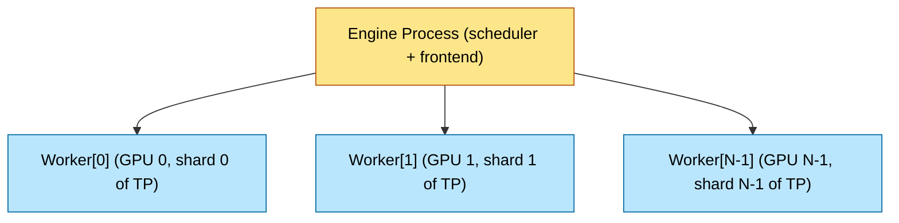

# Inference Frameworks — vLLM, SGLang, TensorRT-LLM, and Beyond
> **Layer:** L8. **Prerequisites:** [Batching_and_Scheduling](Batching_and_Scheduling.md), [KV_Cache](KV_Cache.md), [Speculative_Decoding](Speculative_Decoding.md). **Hands off to:** [vLLM_Internals](vLLM_Internals.md), [Production_Architecture](Production_Architecture.md).

---

## 1. Why Frameworks Matter

A trained LLM is a directory of safetensors on disk. Turning it into a service that handles thousands of concurrent requests at predictable latency requires an **inference framework** — software that orchestrates tokenization, scheduling, KV cache management, parallel execution, sampling, and streaming. The framework is where every systems concept from L0 through L7 converges into running code.

The choice of framework affects:

- **Throughput** — tokens per second per GPU, driven by batching efficiency and kernel quality.
- **Latency** — TTFT and TPOT distributions, driven by scheduling policy and prefill strategy.
- **Model coverage** — which architectures, quantization formats, and multimodal encoders work out of the box.
- **Operational complexity** — build pipelines, deployment models, observability hooks.
- **Vendor lock-in** — NVIDIA-only vs. cross-vendor, open-source vs. proprietary kernels.

This page covers seven production-grade frameworks and the architectural patterns they share. The goal is not to crown a winner — the best choice depends on workload, hardware, team expertise, and operational constraints — but to build a mental model precise enough that you can reason about the tradeoffs for any deployment.

---

## 2. Anatomy of an Inference Engine

Every serious framework has the same layered architecture, differing only in implementation language, kernel provenance, and scheduling sophistication.



### Layer-by-layer

| Layer | Responsibility | Variation across frameworks |
|-------|---------------|-----------------------------|
| Frontend | OpenAI-compatible API, streaming SSE, request parsing | FastAPI (vLLM), FastHTTP (SGLang), Triton Inference Server (TRT-LLM), Rust HTTP (TGI) |
| Tokenizer | Prompt $\to$ token IDs; detokenize output bytes | HuggingFace tokenizers universally; minor differences in special-token handling |
| Scheduler | Admission control, continuous batching, chunked prefill, preemption, prefix-cache lookup | Python (vLLM V0), C++ (vLLM V1, TRT-LLM), Rust (SGLang) |
| KV Cache Manager | Block allocation, prefix sharing, eviction, swap | Hash-based paging (vLLM), radix tree (SGLang), compiled layout (TRT-LLM) |
| Model Runner | Layer-by-layer forward, TP/PP/EP dispatch, activation offloading | PyTorch eager / compile (vLLM, SGLang), TensorRT compiled graph (TRT-LLM) |
| Custom Kernels | FlashAttention, quantized GEMM, paged attention, sampler | CUDA/Triton (vLLM), CUDA (SGLang), TensorRT closed-source (TRT-LLM) |

Frameworks differ in (a) which kernels they ship versus import, (b) how the scheduler is implemented, (c) what model architectures are supported, (d) how operationally mature they are. These four axes explain most of the performance and usability differences.

---

## 3. The Step Loop

All frameworks execute the same logical loop, one GPU forward pass at a time:

```
while running:
    runnable  = scheduler.next_step()
    inputs    = build_packed_inputs(runnable)
    logits    = model.forward(inputs)
    samples   = sampler(logits, per_seq_params)
    scheduler.update(runnable, samples)
    emit_streaming_tokens(samples)
```

**`scheduler.next_step()`** decides which sequences run this iteration: admit new requests from the waiting queue, continue in-flight decodes, schedule prefill chunks. It respects the KV block budget, max-batch tokens, and SLO deadlines.

**`build_packed_inputs`** assembles the ragged batch — tokens, position IDs, block tables — into GPU tensors. No padding (paged layout).

**`model.forward`** runs the transformer layers across all TP/PP shards via NCCL collectives.

**`sampler`** applies per-sequence temperature, top-$k$, top-$p$, repetition penalty, and grammar masks, then samples token IDs.

The step loop runs 20–100 times per second depending on batch size and context length. Scheduler overhead at this cadence matters — this is why vLLM V1 moved the hot path to C++ and SGLang used Rust.

---

## 4. vLLM

### 4.1 Overview

vLLM originated PagedAttention (SOSP 2023) and has become the de facto open-source inference standard. The engine is Python with C++/CUDA kernels for hot paths. It ships the broadest model coverage of any framework — virtually any HuggingFace model works with `vllm serve <model>`.

### 4.2 Architecture



The V1 engine (default since late 2024) decouples the scheduler from the workers via shared-memory queues. The scheduler runs in its own process, dispatching step inputs to worker sub-processes. This eliminates Python GIL contention on the scheduling critical path.

### 4.3 Key Features

- **PagedAttention** — block-based KV cache with per-sequence block tables. The original implementation; every other framework adopted the paging concept.
- **Hash-based prefix caching** — each block hashed by `(parent_hash, token_ids)`. Shared via refcounting. Effective for system prompts and multi-turn chat.
- **Chunked prefill** — long prompts split into configurable chunks (default 512–4096 tokens) that interleave with decode steps, avoiding TPOT spikes.
- **Speculative decoding** — supports draft-model, Medusa, EAGLE, and MLA-based speculation. Integrated into the step loop with variable acceptance lengths.
- **Quantization** — FP8 weights and KV, INT8 (AWQ, GPTQ, SmoothQuant), INT4, GGUF. FP8 on Hopper is essentially free and the default for production.
- **Parallelism** — TP, PP, EP, and combinations. TP is the most common; PP used for models exceeding single-node memory. EP for MoE models.
- **Multi-LoRA** — fused batched LoRA kernels (Punica/S-LoRA). Each request specifies an adapter; the matmul kernel routes rows by LoRA ID.
- **Structured output** — via Outlines and xgrammar backends. JSON schema, regex, context-free grammar.
- **Multimodal** — major VLMs (LLaVA, Qwen-VL, InternVL, Pixtral) supported with image/audio encoders pipelined through the same KV cache.

### 4.4 Performance Characteristics

vLLM sits in the high-throughput, good-latency tier. It typically achieves 85–95% of TRT-LLM's throughput on the same hardware, with significantly lower operational overhead. Its prefix caching and chunked prefill make it particularly strong on chat and RAG workloads where prompt reuse is high.

The V1 rewrite closed most of the scheduler-overhead gap. On H100 with Llama-3-70B FP8, 8K context, production chat mix:
- TTFT p50: 50–100 ms
- TPOT p50: 15–25 ms
- Throughput: 3000–5000 tok/s per 8-GPU node

### 4.5 When to Choose vLLM

- General-purpose production serving where model coverage matters.
- Teams that value fast iteration — new model architectures supported within days.
- RAG and chat workloads where prefix caching is critical.
- Multi-tenant serving with diverse model/LoRA/quantization requirements.
- Any deployment that needs open-source, auditable, modifiable engine code.

---

## 5. SGLang

### 5.1 Overview

SGLang (NeurIPS 2024) originated from the RadixAttention idea — a token-granularity prefix-sharing scheme that generalizes block-hash caching. The engine is optimized for chat, agentic, and structured-generation workloads where prompt reuse patterns are complex.

### 5.2 Architecture

The scheduler is implemented in Rust for low overhead. The model runner uses PyTorch with custom CUDA kernels. The KV cache manager maintains a **radix tree** over token sequences rather than a flat hash table.



### 5.3 RadixAttention

The radix tree indexes KV blocks by their token prefix. When a new request arrives, the tree is traversed to find the longest matching prefix. Matched KV blocks are shared via refcounting; only the unmatched suffix requires prefill.

This is strictly more expressive than hash-based prefix caching:

| Scheme | Granularity | Sub-block sharing | Multi-branch prefixes |
|--------|-------------|-------------------|-----------------------|
| Hash (vLLM) | Block-aligned (16 tokens) | No | No |
| Radix (SGLang) | Token-granular | Yes | Yes |

In multi-turn chat, where each turn extends the previous conversation, the radix tree naturally captures the growing prefix. In agentic workflows, where multiple branches share a common system prompt plus divergent tool calls, the tree captures the branching structure. Reported prefix-cache hit rates are 10–30 percentage points higher than hash schemes on these workloads.

### 5.4 Key Features

- **RadixAttention** — token-granularity prefix sharing via radix tree.
- **Fast scheduler** — Rust implementation reduces per-step overhead to microseconds.
- **First-class structured output** — xgrammar integration with GPU-accelerated grammar masking. JSON, regex, context-free grammar, and custom constraints.
- **FlashInfer integration** — uses the FlashInfer attention library for variable-length packed attention, which provides excellent performance on heterogeneous batch shapes.
- **Speculative decoding** — draft-model and Eagle-style speculation.
- **Quantization** — FP8, INT8 (AWQ, GPTQ), similar breadth to vLLM.
- **Disaggregated PD** — built-in prefill-decode disaggregation since v0.4.

### 5.5 Performance Characteristics

SGLang frequently matches or exceeds vLLM on chat and agentic workloads where prefix reuse is high. The Rust scheduler provides a measurable edge at high request rates. On pure throughput benchmarks with no prefix reuse, the two frameworks are roughly tied.

On H100 with Llama-3-70B FP8, chat workload with high prefix reuse:
- TTFT p50: 40–80 ms (better when prefix cache hits)
- TPOT p50: 15–25 ms
- Throughput: competitive with or ahead of vLLM on chat workloads

### 5.6 When to Choose SGLang

- Chat and agentic workloads with heavy prompt reuse and branching.
- Applications requiring structured output (JSON API servers, tool-use pipelines).
- Deployments where the scheduler is the bottleneck at high RPS.
- Teams comfortable with a smaller ecosystem and fewer learning resources.

---

## 6. TensorRT-LLM

### 6.1 Overview

TensorRT-LLM is NVIDIA's hand-tuned C++ inference engine, built on the TensorRT compiler stack. It produces the lowest single-stream latency and highest peak throughput on NVIDIA GPUs by compiling the entire model graph into optimized CUDA kernels.

### 6.2 Architecture

TRT-LLM does not interpret a model — it **compiles** it. Each combination of model architecture, tensor parallelism degree, precision, and maximum sequence length is built into a binary "engine" file. This engine is a fused, kernel-scheduled computation graph.



### 6.3 Key Features

- **Compiled execution graph** — operator fusion, memory planning, kernel auto-tuning at build time. No runtime Python overhead.
- **Best-in-class quantization** — FP8 weights and KV, INT8 weights + KV (SmoothQuant), INT4 (AWQ, GPTQ), FP4 (Blackwell). The most comprehensive quantization menu.
- **Tensor parallelism, pipeline parallelism, expert parallelism** — all supported with NCCL-optimized collectives.
- **Inflight batching** — NVIDIA's term for continuous batching. Implemented in C++ with zero Python on the critical path.
- **KV cache management** — paged KV with block reuse. Prefix caching supported.
- **Speculative decoding** — draft-model and Medusa-style.
- **Triton Inference Server integration** — TRT-LLM is the default backend for NVIDIA's production model server. Multi-model hosting, versioning, A/B testing, dynamic batching at the server level.
- **Multi-LoRA** — fused batched LoRA via UniServe-style kernels.

### 6.4 The Build Pipeline (and Its Cost)

The compile step is TRT-LLM's greatest strength and its greatest operational burden:



Build time: minutes to hours depending on model size and auto-tuning budget. Each configuration (TP=2 FP8 vs TP=4 INT8) is a separate engine. Production deployments need a build CI pipeline that produces and validates engines for every supported configuration.

### 6.5 Performance Characteristics

TRT-LLM delivers the best peak performance on NVIDIA hardware, especially for:
- **Single-stream latency** — 10–30% lower TTFT and TPOT than vLLM at low batch.
- **Quantized throughput** — the most mature FP8 and INT8 paths; fewer accuracy surprises.
- **MoE models** — optimized EP with custom all-to-all kernels.

On H100 with Llama-3-70B FP8, 8K context, production mix:
- TTFT p50: 40–70 ms (best-in-class)
- TPOT p50: 12–20 ms (best-in-class)
- Throughput: highest among all frameworks at matched batch size

### 6.6 When to Choose TensorRT-LLM

- Latency-critical deployments where 10–20% matters (real-time voice, interactive editing).
- NVIDIA-only GPU fleets where maximum hardware utilization is the priority.
- Teams with engineering bandwidth to maintain a build CI pipeline.
- Deployments already using Triton Inference Server for multi-model serving.
- MoE models where TRT-LLM's expert-parallel kernels provide a clear edge.

---

## 7. NVIDIA Dynamo

### 7.1 Overview

Dynamo is NVIDIA's multi-node inference fabric (GA 2024–2025). It is not a per-GPU engine but an orchestration layer that manages fleets of engines. Dynamo disaggregates prefill and decode across nodes, handles KV transfer, and routes requests with prefix-locality awareness.

### 7.2 Architecture



Dynamo treats the inference engine as a pluggable backend. TRT-LLM is the primary backend; vLLM is also supported. The orchestrator adds:

- **NIXL transport** — unified API for GPU-to-GPU (NVLink), GPU-to-CPU, GPU-to-storage transfers. Chooses the fastest available path automatically.
- **Prefix-aware routing** — incoming requests routed to the engine replica with the highest prefix-cache overlap.
- **Disaggregated prefill-decode** — prefill and decode pools sized independently, scaled to their respective bottlenecks.
- **Autoscaling hooks** — integrates with Kubernetes HPA and NVIDIA NIM operators.

### 7.3 When to Choose Dynamo

- Multi-node deployments exceeding the capacity of a single engine instance.
- Disaggregated serving where prefill and decode scale independently.
- NVIDIA-centric fleets already invested in the Triton/NIM ecosystem.
- Production deployments needing a vendor-supported orchestration layer.

---

## 8. llm-d

### 8.1 Overview

llm-d is Meta's open-source disaggregated serving stack. Conceptually similar to Dynamo but vendor-agnostic: it runs on NVIDIA, AMD, and any accelerator with a supported PyTorch backend. The engine layer is vLLM.

### 8.2 Architecture

- **vLLM-based engine backends** for both prefill and decode pools.
- **Distributed KV pool** across nodes, inspired by Mooncake's global-prefix-cache design.
- **Locality-aware router** — prefix-hash based routing across the cluster.
- **Kubernetes-native** — Custom Resource Definitions (CRDs) for pool sizing, autoscaling, rolling updates.
- **Vendor-agnostic** — runs on mixed GPU fleets (NVIDIA + AMD) within the same cluster.

### 8.3 When to Choose llm-d

- Multi-node disaggregated serving on heterogeneous hardware.
- Teams committed to open-source and vendor independence.
- Deployments already running vLLM that need cluster-scale orchestration.
- Meta-scale throughput requirements (billions of tokens per day).

---

## 9. Hugging Face TGI (Text Generation Inference)

### 9.1 Overview

TGI is HuggingFace's production serving stack. The frontend is Rust (for HTTP performance); the model runner is Python with custom CUDA kernels. It provides the best out-of-the-box experience for models hosted on HuggingFace Hub.

### 9.2 Key Features

- **Rust frontend** — low-overhead HTTP handling, streaming SSE.
- **Continuous batching** — implemented natively (not via vLLM).
- **Quantization** — bitsandbytes, GPTQ, AWQ, EETQ. FP8 support added in 2024.
- **FlashAttention** — supported on all compatible models.
- **Watermarking** — built-in watermarking via the T5/GPT watermarking scheme.
- **HuggingFace Hub integration** — one-command deployment of any Hub model.

### 9.3 Strengths and Weaknesses

TGI trades peak performance for operational simplicity. Throughput is typically 10–30% below vLLM at matched hardware, but the deployment experience is the smoothest in the ecosystem. Best for teams that want to serve HF models with minimal configuration.

### 9.4 When to Choose TGI

- Rapid prototyping with HuggingFace Hub models.
- Teams without kernel-level inference expertise.
- Deployments where operational simplicity outweighs raw throughput.
- HuggingFace Enterprise customers already in the HF ecosystem.

---

## 10. LMDeploy

### 10.1 Overview

LMDeploy (Shanghai AI Lab) serves Chinese open-source models (InternLM, Qwen, Yi) with competitive performance. Its TurboMind engine is a C++ inference backend with custom CUDA kernels.

### 10.2 Key Features

- **TurboMind engine** — C++ runtime with persistent batch, paged KV cache.
- **Quantization** — W4A16 (AWQ), W8A8, FP8. Strong INT4 performance.
- **Turbomind attention** — custom attention kernel optimized for the supported model set.
- **Model coverage** — first-class support for Qwen, InternLM, Yi, and other Chinese open-source models. Broader HF model support improving.

### 10.3 When to Choose LMDeploy

- Serving Qwen, InternLM, or other Chinese open-source models at scale.
- Deployments in regions or organizations aligned with the Chinese AI ecosystem.
- INT4 inference where TurboMind's kernels are well-tuned.

---

## 11. Feature Comparison Matrix

### 11.1 Core Serving Features

| Feature | vLLM | SGLang | TRT-LLM | Dynamo | llm-d | TGI | LMDeploy |
|---------|------|--------|---------|--------|-------|-----|----------|
| Continuous batching | Yes | Yes | Yes | Via backend | Via vLLM | Yes | Yes |
| Paged KV cache | Yes | Yes | Yes | Via backend | Via vLLM | Yes | Yes |
| Prefix caching | Hash-based | Radix tree | Hash-based | Via backend | Hash-based | Hash-based | Hash-based |
| Chunked prefill | Yes | Yes | Yes | Via backend | Via vLLM | Yes | Yes |
| Disaggregated PD | Yes (V1) | Yes | Via Dynamo | Native | Native | No | No |
| Streaming output | SSE | SSE | Via Triton | SSE | SSE | SSE | SSE |

### 11.2 Optimization and Quantization

| Feature | vLLM | SGLang | TRT-LLM | Dynamo | llm-d | TGI | LMDeploy |
|---------|------|--------|---------|--------|-------|-----|----------|
| FlashAttention v2/v3 | Yes | Yes | Yes | Via backend | Via vLLM | Yes | Yes |
| FP8 weights | Yes | Yes | Yes | Via backend | Via vLLM | Yes | Yes |
| FP8 KV cache | Yes | Yes | Yes | Via backend | Via vLLM | Partial | Partial |
| INT8 (AWQ/GPTQ) | Yes | Yes | Yes | Via backend | Via vLLM | Yes | Yes |
| INT4 quantization | Yes | Yes | Yes | Via backend | Via vLLM | Yes | Yes |
| Speculative decoding | Yes | Yes | Yes | Via backend | Via vLLM | Yes | Partial |

### 11.3 Model and Architecture Support

| Feature | vLLM | SGLang | TRT-LLM | Dynamo | llm-d | TGI | LMDeploy |
|---------|------|--------|---------|--------|-------|-----|----------|
| MoE models | Yes | Yes | Yes | Via backend | Via vLLM | Yes | Partial |
| Multimodal (VLM) | Yes | Yes | Yes | Via backend | Via vLLM | Yes | Partial |
| Multi-LoRA | Yes | Yes | Yes | Via backend | Via vLLM | Yes | Partial |
| Structured output | Outlines, xgrammar | xgrammar | xgrammar | Via backend | Via vLLM | Outlines | Partial |
| HuggingFace models | Broadest | Broad | Limited | Via backend | Broad | Broadest | Focused |

### 11.4 Parallelism and Deployment

| Feature | vLLM | SGLang | TRT-LLM | Dynamo | llm-d | TGI | LMDeploy |
|---------|------|--------|---------|--------|-------|-----|----------|
| Tensor parallelism | Yes | Yes | Yes | Via backend | Via vLLM | Yes | Yes |
| Pipeline parallelism | Yes | Yes | Yes | Via backend | Via vLLM | No | Partial |
| Expert parallelism | Yes | Yes | Yes | Via backend | Via vLLM | Partial | No |
| Multi-node | Yes | Yes | Yes | Native | Native | Partial | No |
| OpenAI-compatible API | Yes | Yes | Via Triton | Yes | Yes | Yes | Yes |
| NVIDIA GPUs | Yes | Yes | Yes | Yes | Yes | Yes | Yes |
| AMD GPUs | Yes | Partial | No | No | Yes | Partial | No |
| CPU-only | Partial | No | No | No | No | Partial | No |
| Open source | Yes | Yes | Weights only | Yes | Yes | Yes | Yes |

---

## 12. Performance Comparison

### 12.1 Latency and Throughput

Approximate performance on H100 8-GPU node, Llama-3-70B FP8, 8K context, production chat workload. These numbers shift with releases — always benchmark on your workload.

| Framework | TTFT p50 | TPOT p50 | Throughput (tok/s/node) | Prefix cache benefit |
|-----------|----------|----------|--------------------------|---------------------|
| TRT-LLM | 40–70 ms | 12–20 ms | Highest | Moderate |
| vLLM | 50–100 ms | 15–25 ms | High | High |
| SGLang | 40–80 ms | 15–25 ms | High (best with prefix hits) | Highest |
| TGI | 70–140 ms | 20–35 ms | Medium | Moderate |
| LMDeploy | 50–90 ms | 15–25 ms | High (on supported models) | Moderate |

### 12.2 Where Performance Differences Come From

The same model on the same hardware produces different throughput across frameworks. The sources of the gap:

$$\text{Throughput} = \frac{\text{Effective tokens per step}}{\text{Step latency}}$$

1. **Kernel quality** — TRT-LLM's compiled kernels fuse more operations and have tighter memory access patterns. The gap is largest on quantized GEMM and attention kernels.
2. **Scheduler overhead** — at high RPS, the time spent in `scheduler.next_step()` matters. TRT-LLM's C++ scheduler and SGLang's Rust scheduler have lower overhead than vLLM's V0 Python scheduler (largely fixed in V1).
3. **Prefix cache effectiveness** — SGLang's radix tree achieves higher hit rates on chat workloads, reducing effective prefill cost per request.
4. **Memory efficiency** — framework overhead (Python runtime, temporary buffers, framework-managed tensors) reduces the KV cache budget. TRT-LLM's compiled runtime has the smallest overhead.
5. **Sampling path** — structured-output grammar masking adds per-step cost. Implementations vary in how much they GPU-accelerate the constraint application.

### 12.3 Benchmarking Methodology

When comparing frameworks, control for:

- **Identical hardware** — same GPU type, same NVLink topology, same HBM capacity.
- **Identical model and precision** — same checkpoint, same quantization scheme, same KV dtype.
- **Realistic workload** — use your actual request distribution (prompt lengths, output lengths, prefix overlap). Synthetic uniform-random prompts understate prefix-cache benefits.
- **Warm cache** — run for enough iterations that prefix caches are populated before measuring.
- **Same parallelism config** — TP degree, PP degree, max-batch-tokens, chunked-prefill budget.

---

## 13. Choosing a Framework: Decision Framework

### 13.1 Production GPU Fleet, OpenAI-Style API

| Priority | Recommended | Rationale |
|----------|-------------|-----------|
| General-purpose, broad model coverage | vLLM | Largest model support, fastest feature uptake, massive community |
| Lowest latency on NVIDIA | TRT-LLM | Compiled kernels, C++ scheduler, best peak perf |
| Chat/agentic with prompt reuse | SGLang | RadixAttention, best prefix-cache hit rates |
| Quickest time-to-production | TGI | One-command HF Hub deployment |

### 13.2 Multi-Node Disaggregated Serving

| Stack | When |
|-------|------|
| NVIDIA Dynamo | NVIDIA-only fleet, already using Triton, want vendor support |
| llm-d | Heterogeneous fleet, open-source preference, vLLM-based |
| SGLang disaggregated mode | Chat/agentic workloads with heavy prefix sharing at cluster scale |

### 13.3 Edge and Heterogeneous

| Framework | When |
|-----------|------|
| MLC-LLM | Cross-vendor compile-once (NVIDIA, AMD, Apple Silicon, Intel, mobile) |
| llama.cpp | CPU-only, Apple Silicon, local development, GGUF quantized models |
| vLLM (CPU mode) | CPU inference with PyTorch-based flexibility |

### 13.4 Research and Quick Iteration

| Framework | When |
|-----------|------|
| vLLM offline (`LLM(...).generate(...)`) | Batch generation, evaluation, quick experiments |
| SGLang offline | Structured generation in research (constrained decoding, programmatic prompts) |
| Raw PyTorch | Full control over execution, custom kernels, research into scheduling algorithms |

---

## 14. Common Architectural Patterns

### 14.1 Engine Process Model

Most engines run as a single process per inference replica with a worker per GPU shard:



Workers communicate via NCCL collectives (all-reduce for TP, point-to-point for PP). The scheduler dispatches step inputs to all workers; they execute in lockstep.

### 14.2 KV Cache Manager

Pages = fixed-size blocks of $B$ tokens (typically $B = 16$). Per-sequence block table. Allocation: pop from free list. Sharing: refcount increment on prefix match. Eviction: LRU on cached prefixes; recompute or swap on preemption.

$$\text{Num blocks} = \frac{\text{HBM allocated to KV}}{2 \cdot L \cdot H_{kv} \cdot d \cdot b \cdot B}$$

### 14.3 Sampling

Per-sequence parameters: temperature, top-$k$, top-$p$, repetition penalty, frequency/presence penalty, logit bias, grammar mask. Implementation: GPU kernels (Triton or CUDA) with per-row parameter arrays. Output: token IDs plus optional logprobs and top-logprobs.

### 14.4 Streaming

Each token emitted by the sampler goes through a response queue to the client via Server-Sent Events (SSE) or chunked HTTP streaming. The tokenizer detokenizes on-the-fly with byte-pair fallback for incomplete UTF-8 sequences at chunk boundaries.

### 14.5 Multi-LoRA Serving

Each request specifies a LoRA adapter ID. The engine:
1. Groups requests by adapter, or
2. Uses fused kernels that handle mixed-adapter batches in a single matmul (Punica, S-LoRA).

Adapter weights are small ($< 1$ GB typically), so they can be cached in GPU memory or loaded on demand from CPU/NVMe. The scheduler must account for adapter placement when forming batches.

---

## 15. The Build vs. Interpret Tradeoff

TRT-LLM's compiled approach and vLLM/SGLang's interpreted approach represent a fundamental design axis.

| Dimension | Compiled (TRT-LLM) | Interpreted (vLLM, SGLang) |
|-----------|--------------------|-----------------------------|
| Peak performance | Highest (fused kernels, auto-tuned) | 85–95% of compiled |
| Time to deploy new model | Hours to days (rebuild engine) | Minutes (load weights) |
| Configuration flexibility | Per-engine (fixed TP, precision, max_seq) | Per-request (dynamic batch, variable params) |
| Debugging | Hard (binary engine, limited introspection) | Easier (Python stack traces, PyTorch profiler) |
| Operational complexity | High (build CI, engine versioning) | Low (single binary, dynamic config) |
| Community velocity | Slower (NVIDIA release cycle) | Faster (open-source, community patches) |

Most production deployments land on a hybrid: TRT-LLM for the latency-critical flagship model, vLLM for the long tail of models that need rapid iteration.

---

## 16. Multimodal Inference

Vision, audio, and image-generation extensions follow the same framework pattern but add complexity:

1. **Modality encoder** — a separate ViT, CLIP, Whisper, or audio encoder forward pass produces token embeddings.
2. **Modality projection** — a learned linear layer maps encoder outputs to the LLM's embedding space.
3. **Token injection** — modality tokens are prepended or interleaved with text tokens in the input sequence.
4. **KV cache** — covers both multimodal and subsequent text tokens.

vLLM, SGLang, and TRT-LLM all support major VLMs. The encoder forward pass is typically a separate model execution that produces embeddings; these are then treated as additional "tokens" by the LLM's prefill step. Framework differences are in which encoder architectures are supported and how efficiently the encoder weights are managed (loaded/unloaded, shared across requests).

---

## 17. Common Pitfalls

1. **Picking TRT-LLM without a build pipeline.** Each model + TP + precision + max_seq_len combination is its own compiled engine. Without automated build and validation CI, deployment becomes manual and error-prone.

2. **Underestimating scheduler overhead.** At high RPS (hundreds of concurrent requests), the scheduler can become CPU-bound. vLLM V1's C++ scheduler and SGLang's Rust scheduler address this; older Python schedulers bottleneck at $\sim$50–100 concurrent requests.

3. **No prefix caching.** For chat, RAG, and agentic workloads, prefix caching is a 2–5$\times$ throughput improvement that costs almost nothing to enable. Leaving it off is the single most common misconfiguration.

4. **Wrong attention implementation.** Forgetting to enable FlashAttention v2/v3, or using a paged-attention kernel that doesn't support the current block size. Always verify the kernel in use via logs or profiling.

5. **Ignoring quantization accuracy.** FP8 is nearly free on Hopper but INT4 AWQ can degrade quality on sensitive tasks. Always validate perplexity and downstream benchmarks after quantization, not just throughput.

6. **Mismatched parallelism.** Using TP=8 on a 2-node system where PP=2 + TP=4 would be faster (TP across NVLink is fast; TP across NICs is slow). Understand the NVLink topology before choosing parallelism.

7. **No observability.** Deploying without per-request TTFT/TPOT histograms, KV occupancy metrics, and prefix-cache hit rates means flying blind. SLO violations are invisible until users complain.

---

## 18. Common Interview Questions

**Q: Compare vLLM and TensorRT-LLM. When would you pick each?**

A: vLLM is open-source Python+CUDA with the broadest model coverage, fast community-driven feature uptake, and simple deployment. TRT-LLM is NVIDIA's compiled C++ engine with the best peak latency and throughput on NVIDIA GPUs but requires per-configuration build pipelines and lags on new architectures. Pick vLLM for general-purpose serving and rapid iteration; TRT-LLM for latency-critical NVIDIA-only deployments where you can amortize the build cost.

**Q: What is RadixAttention and why does it matter?**

A: A token-granularity prefix-sharing scheme implemented as a radix tree over KV cache blocks. Unlike hash-based prefix caching (block-aligned, no sub-block sharing), RadixAttention matches arbitrary-length prefixes and supports branching (multiple requests sharing a common prefix then diverging). It produces 10–30 percentage-point higher cache hit rates on chat and agentic workloads.

**Q: How does PagedAttention enable continuous batching?**

A: Each sequence has an independent block table over a global block pool. Sequences of different lengths grow independently without padding. The scheduler admits and evicts sequences without reshaping tensors. Without paging, ragged batching requires expensive padding or per-request memory regions.

**Q: What is NVIDIA Dynamo's role in the inference stack?**

A: Dynamo is a multi-node orchestration layer, not a per-GPU engine. It disaggregates prefill and decode across separate GPU pools, manages KV transfer via NIXL, routes requests with prefix-locality awareness, and uses TRT-LLM or vLLM as pluggable engine backends. It sits above the engine in the stack hierarchy.

**Q: What does "structured output" mean and how is it implemented?**

A: Constraining generation to match a JSON schema, regex, or grammar. Implementation: at each decode step, a logit mask sets the probability of tokens that would violate the constraint to $-\infty$. Libraries: Outlines, xgrammar, lm-format-enforcer. The per-step masking cost is amortized by GPU-parallel constraint evaluation.

**Q: Why is multi-LoRA serving non-trivial?**

A: Each LoRA adapter modifies projection weights differently. Naive per-request weight loading is slow. Fused multi-LoRA kernels (Punica, S-LoRA) handle a batch with mixed adapter IDs in one matmul by routing rows to the correct adapter weights. The engine must track adapter IDs per row and manage adapter caching.

**Q: How does the inference engine handle EOS?**

A: The sampler outputs the EOS token ID; the scheduler marks the sequence finished, emits the final output to the client, decrements refcounts on shared prefix blocks, frees the sequence's exclusive blocks, and opens the slot for a new request from the waiting queue.

**Q: What is the build-vs-interpret tradeoff in inference engines?**

A: Compiled engines (TRT-LLM) fuse operators and auto-tune kernels at build time, yielding 5–15% better peak performance. The cost is per-configuration build time (minutes to hours), operational complexity (engine versioning, CI), and slower support for new models. Interpreted engines (vLLM, SGLang) load weights dynamically, deploy in seconds, and iterate faster at the cost of slightly lower peak performance.

**Q: How would you debug a sudden TPOT regression in production?**

A: (1) Check if input distribution changed (longer prompts, bigger batch). (2) Inspect KV occupancy and prefix-cache hit rate. (3) GPU utilization from DCGM or Nsight — is the GPU compute-bound or memory-bound? (4) Compare engine version against the known-good baseline. (5) Check NCCL bus bandwidth (inter-node degradation). (6) Look for failure-mode regressions (NaN handling, synchronization barriers, sampling-path changes).

**Q: When would you NOT use a data-center inference framework?**

A: Single-user local chat (llama.cpp, MLC). Edge or mobile deployment (MLC-LLM compiled for the target). Research requiring full execution control (raw PyTorch with custom kernels). CPU-only inference where the overhead of GPU-oriented frameworks is wasted.

---

## 19. Further Reading

- Kwon et al., "Efficient Memory Management for Large Language Model Serving with PagedAttention" (SOSP 2023) — the vLLM paper.
- Zheng et al., "SGLang: Efficient Execution of Structured Language Model Programs" (NeurIPS 2024) — RadixAttention and the SGLang engine.
- TensorRT-LLM documentation, NVIDIA Developer — build pipeline, kernel details, deployment guides.
- NVIDIA Dynamo documentation and GTC 2025 talks — disaggregated serving architecture.
- llm-d project repository (Meta) — open-source disaggregated serving stack.
- Triton Inference Server documentation — model hosting, dynamic batching, multi-framework backends.
- "Deep Dive into LLM Inference Acceleration" — Anyscale, Mosaic AI, and NVIDIA technical blogs.

---

**Next:** [vLLM_Internals](vLLM_Internals.md).
**See also:** [KV_Cache](KV_Cache.md), [Batching_and_Scheduling](Batching_and_Scheduling.md), [Speculative_Decoding](Speculative_Decoding.md), [Production_Architecture](Production_Architecture.md), [Disaggregated_Serving_2025](Disaggregated_Serving_2025.md).
