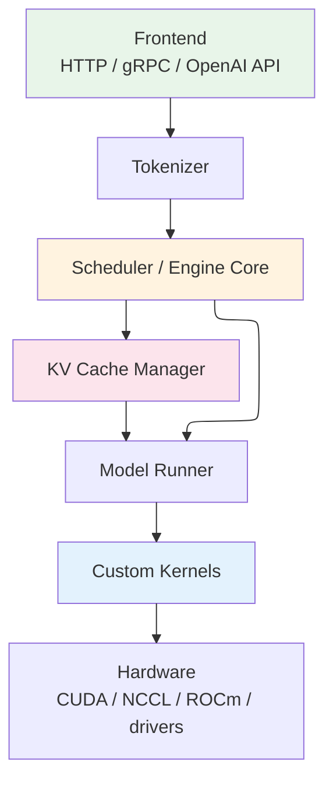
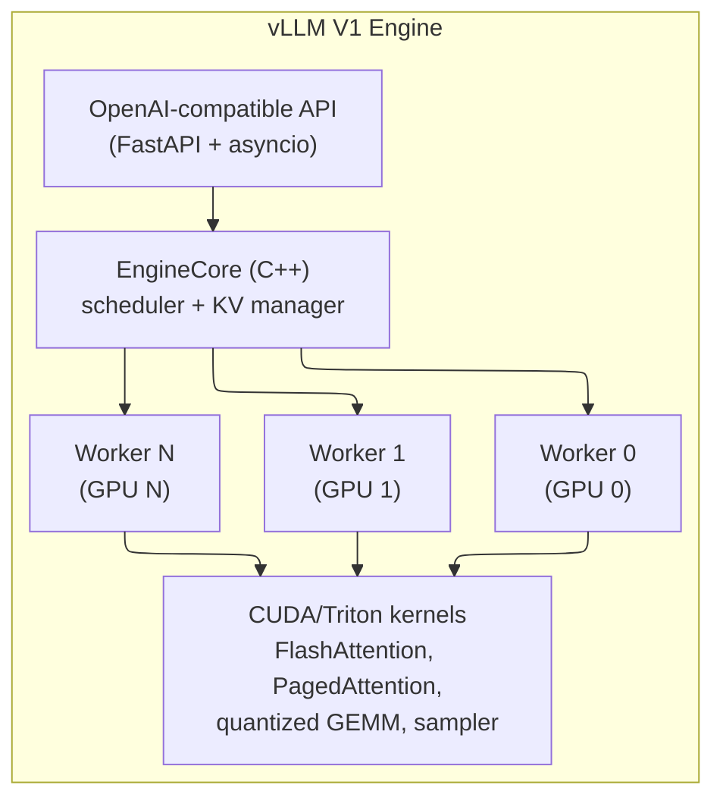
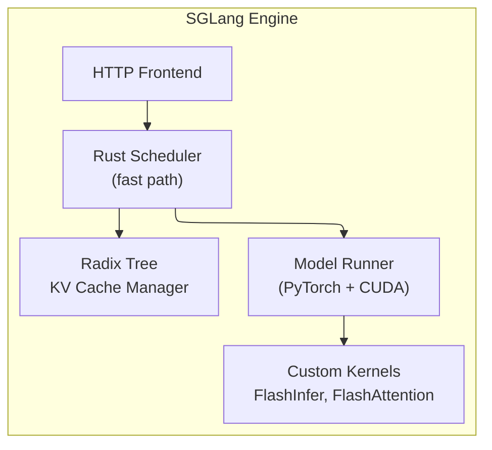
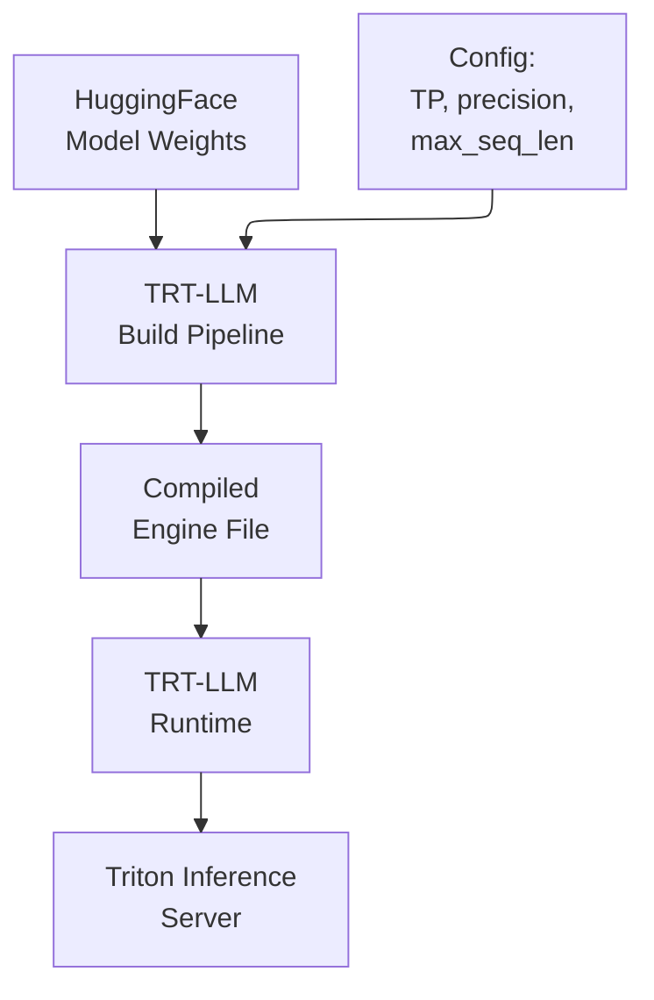
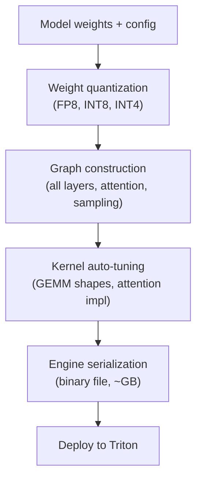
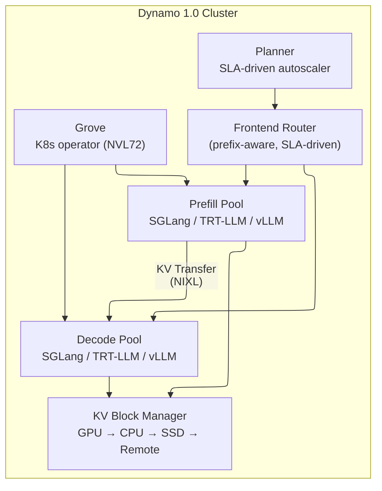
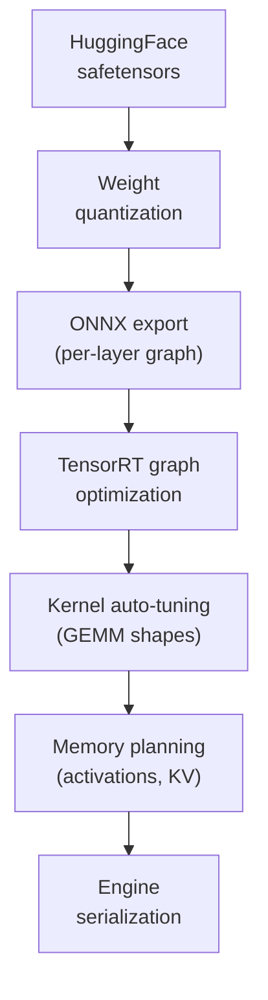
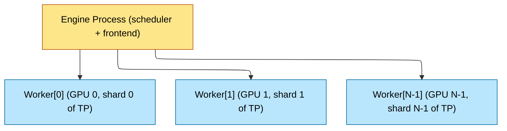

# Inference Frameworks — vLLM, SGLang, TensorRT-LLM, and Beyond
> **Layer:** L8. **Prerequisites:** [Batching_and_Scheduling](Batching_and_Scheduling.md), [KV_Cache](KV_Cache.md), [Speculative_Decoding](Speculative_Decoding.md). **Hands off to:** [vLLM_Internals](vLLM_Internals.md), [Production_Architecture](Production_Architecture.md). **Last updated:** 2026-05.

---

## 1. Why Frameworks Matter

A trained LLM is a directory of safetensors on disk. Turning it into a service that handles thousands of concurrent requests at predictable latency requires an **inference framework** — software that orchestrates tokenization, scheduling, KV cache management, parallel execution, sampling, and streaming. The framework is where every systems concept from L0 through L7 converges into running code.

The choice of framework affects:

- **Throughput** — tokens per second per GPU, driven by batching efficiency and kernel quality.
- **Latency** — TTFT and TPOT distributions, driven by scheduling policy and prefill strategy.
- **Model coverage** — which architectures, quantization formats, and multimodal encoders work out of the box.
- **Operational complexity** — build pipelines, deployment models, observability hooks.
- **Vendor lock-in** — NVIDIA-only vs. cross-vendor, open-source vs. proprietary kernels.

This page covers eight production-grade frameworks and the architectural patterns they share. The goal is not to crown a winner — the best choice depends on workload, hardware, team expertise, and operational constraints — but to build a mental model precise enough that you can reason about the tradeoffs for any deployment.

> **Note (May 2026):** The inference landscape shifted significantly in late 2025 through early 2026. TGI was archived (March 2026). NVIDIA Dynamo 1.0 superseded Triton Inference Server. vLLM, SGLang, and TRT-LLM all shipped major releases. llm-d entered CNCF Sandbox. And an entirely new category emerged — 1-bit LLM inference via BitNet. This page has been updated to reflect all of these developments.

---

## 2. Anatomy of an Inference Engine

Every serious framework has the same layered architecture, differing only in implementation language, kernel provenance, and scheduling sophistication.



### Layer-by-layer

| Layer | Responsibility | Variation across frameworks |
|-------|---------------|-----------------------------|
| Frontend | OpenAI-compatible API, streaming SSE, request parsing | FastAPI (vLLM), FastHTTP (SGLang), NVIDIA Dynamo (TRT-LLM), Rust+Python (Dynamo) |
| Tokenizer | Prompt $\to$ token IDs; detokenize output bytes | HuggingFace tokenizers universally; minor differences in special-token handling |
| Scheduler | Admission control, continuous batching, chunked prefill, preemption, prefix-cache lookup | Python (vLLM V0), C++ (vLLM V1, TRT-LLM), Rust (SGLang) |
| KV Cache Manager | Block allocation, prefix sharing, eviction, swap | Hash-based paging (vLLM), radix tree (SGLang), compiled layout (TRT-LLM) |
| Model Runner | Layer-by-layer forward, TP/PP/EP dispatch, activation offloading | PyTorch eager / compile (vLLM, SGLang), TensorRT compiled graph (TRT-LLM) |
| Custom Kernels | FlashAttention, quantized GEMM, paged attention, sampler | CUDA/Triton (vLLM), CUDA (SGLang), TensorRT closed-source (TRT-LLM) |

Frameworks differ in (a) which kernels they ship versus import, (b) how the scheduler is implemented, (c) what model architectures are supported, (d) how operationally mature they are. These four axes explain most of the performance and usability differences.

---

## 3. The Step Loop

All frameworks execute the same logical loop, one GPU forward pass at a time:

```text
WHILE running:
    runnable = scheduler.next_step()
    inputs   = build_packed_inputs(runnable)
    logits   = model.forward(inputs)
    samples  = sampler(logits, per_seq_params)
    
    scheduler.update(runnable, samples)
    emit_streaming_tokens(samples)
```

**`scheduler.next_step()`** decides which sequences run this iteration: admit new requests from the waiting queue, continue in-flight decodes, schedule prefill chunks. It respects the KV block budget, max-batch tokens, and SLO deadlines.

**`build_packed_inputs`** assembles the ragged batch — tokens, position IDs, block tables — into GPU tensors. No padding (paged layout).

**`model.forward`** runs the transformer layers across all TP/PP shards via NCCL collectives.

**`sampler`** applies per-sequence temperature, top-$k$, top-$p$, repetition penalty, and grammar masks, then samples token IDs.

The step loop runs 20–100 times per second depending on batch size and context length. Scheduler overhead at this cadence matters — this is why vLLM V1 moved the hot path to C++ and SGLang used Rust.

---

## 4. vLLM

### 4.1 Overview

vLLM originated PagedAttention (SOSP 2023) and has become the de facto open-source inference standard. The engine is Python with C++/CUDA kernels for hot paths. It ships the broadest model coverage of any framework — virtually any HuggingFace model works with `vllm serve <model>`. The latest major release is **v0.21.0** (2025–2026), which introduced heterogeneous memory management, compiler-style IR, and disaggregated KV transfer.

### 4.2 Architecture



The V1 engine (default since late 2024) decouples the scheduler from the workers via shared-memory queues. The scheduler runs in its own process, dispatching step inputs to worker sub-processes. This eliminates Python GIL contention on the scheduling critical path.

### 4.3 Key Features

- **PagedAttention** — block-based KV cache with per-sequence block tables. The original implementation; every other framework adopted the paging concept.
- **Hash-based prefix caching** — each block hashed by `(parent_hash, token_ids)`. Shared via refcounting. Effective for system prompts and multi-turn chat.
- **Chunked prefill** — long prompts split into configurable chunks (default 512–4096 tokens) that interleave with decode steps, avoiding TPOT spikes.
- **Speculative decoding** — supports draft-model, Medusa, EAGLE, and MLA-based speculation. Integrated into the step loop with variable acceptance lengths.
- **Quantization** — FP8 weights and KV, INT8 (AWQ, GPTQ, SmoothQuant), INT4, GGUF, and **NVFP4 KV cache** (new in v0.21). FP8 on Hopper is essentially free and the default for production.
- **Parallelism** — TP, PP, EP, and combinations. TP is the most common; PP used for models exceeding single-node memory. EP for MoE models.
- **Multi-LoRA** — fused batched LoRA kernels (Punica/S-LoRA). Each request specifies an adapter; the matmul kernel routes rows by LoRA ID.
- **Structured output** — via Outlines and xgrammar backends. JSON schema, regex, context-free grammar.
- **Multimodal** — major VLMs (LLaVA, Qwen-VL, InternVL, Pixtral) supported with image/audio encoders pipelined through the same KV cache.

### 4.3.1 What's New in v0.21.0

v0.21.0 is the most significant vLLM release since the V1 rewrite, introducing infrastructure for next-generation memory management and compiler-style optimization:

- **HMA (Heterogeneous Memory Architecture)** — a unified KV Offload layer spanning GPU HBM, CPU DRAM, and NVMe. The scheduler transparently migrates KV blocks between tiers based on access recency and available budget. This effectively triples or quadruples the usable KV cache capacity without additional GPUs.
- **NVFP4 KV cache** — support for NVIDIA's FP4 format for KV storage, halving memory per block with minimal quality loss on supported hardware (Blackwell+).
- **TurboQuant 2-bit KV compression** — aggressive KV cache compression achieving 4x capacity increase. Enables serving much longer contexts or larger batches within the same HBM budget.
- **FlashAttention 4 as default MLA backend** — the latest FlashAttention generation replaces v3 for multi-head latent attention models, providing improved throughput on architectures like DeepSeek-V3.
- **vLLM IR skeleton** — a compiler-style intermediate representation for the execution graph. This is the foundation for future graph-level optimizations (operator fusion, memory planning) that were previously only possible in compiled engines like TRT-LLM.
- **Model Runner V2** — refactored model execution layer with cleaner separation between model logic, kernel dispatch, and memory management. Improves extensibility for new architectures.
- **Bi-directional KV transfers** — KV blocks can flow in both directions between prefill and decode instances, enabling more flexible disaggregated serving topologies.
- **NIXL connector + MooncakeStoreConnector** — native integration with NIXL (NVIDIA's unified transfer library) and Mooncake's distributed KV store for cross-node KV transfer in disaggregated deployments.

### 4.4 Performance Characteristics

vLLM sits in the high-throughput, good-latency tier. It typically achieves 85–95% of TRT-LLM's throughput on the same hardware, with significantly lower operational overhead. Its prefix caching and chunked prefill make it particularly strong on chat and RAG workloads where prompt reuse is high.

The V1 rewrite closed most of the scheduler-overhead gap. On H100 with Llama-3-70B FP8, 8K context, production chat mix:
- TTFT p50: 50–100 ms
- TPOT p50: 15–25 ms
- Throughput: 3000–5000 tok/s per 8-GPU node

### 4.5 When to Choose vLLM

- General-purpose production serving where model coverage matters.
- Teams that value fast iteration — new model architectures supported within days.
- RAG and chat workloads where prefix caching is critical.
- Multi-tenant serving with diverse model/LoRA/quantization requirements.
- Any deployment that needs open-source, auditable, modifiable engine code.

---

## 5. SGLang

### 5.1 Overview

SGLang (NeurIPS 2024) originated from the RadixAttention idea — a token-granularity prefix-sharing scheme that generalizes block-hash caching. The engine is optimized for chat, agentic, and structured-generation workloads where prompt reuse patterns are complex. The latest major release is **v0.5.12** (2025–2026), which brought speculative decoding V2, elastic MoE parallelism, and image/video generation support.

### 5.2 Architecture

The scheduler is implemented in Rust for low overhead. The model runner uses PyTorch with custom CUDA kernels. The KV cache manager maintains a **radix tree** over token sequences rather than a flat hash table.



### 5.3 RadixAttention

The radix tree indexes KV blocks by their token prefix. When a new request arrives, the tree is traversed to find the longest matching prefix. Matched KV blocks are shared via refcounting; only the unmatched suffix requires prefill.

This is strictly more expressive than hash-based prefix caching:

| Scheme | Granularity | Sub-block sharing | Multi-branch prefixes |
|--------|-------------|-------------------|-----------------------|
| Hash (vLLM) | Block-aligned (16 tokens) | No | No |
| Radix (SGLang) | Token-granular | Yes | Yes |

In multi-turn chat, where each turn extends the previous conversation, the radix tree naturally captures the growing prefix. In agentic workflows, where multiple branches share a common system prompt plus divergent tool calls, the tree captures the branching structure. Reported prefix-cache hit rates are 10–30 percentage points higher than hash schemes on these workloads.

### 5.4 Key Features

- **RadixAttention** — token-granularity prefix sharing via radix tree.
- **Fast scheduler** — Rust implementation reduces per-step overhead to microseconds.
- **First-class structured output** — xgrammar integration with GPU-accelerated grammar masking. JSON, regex, context-free grammar, and custom constraints.
- **FlashInfer integration** — uses the FlashInfer attention library for variable-length packed attention, which provides excellent performance on heterogeneous batch shapes.
- **Speculative decoding** — draft-model and Eagle-style speculation.
- **Quantization** — FP8, INT8 (AWQ, GPTQ), similar breadth to vLLM.
- **Disaggregated PD** — built-in prefill-decode disaggregation since v0.4.

### 5.4.1 What's New in v0.5.12

- **Speculative Decoding V2 (default)** — a redesigned speculative decoding pipeline that is now enabled by default. Improves acceptance rates and integrates more tightly with the radix tree for prefix-aware draft generation.
- **Piecewise CUDA graph capture** — instead of capturing the entire model execution as one monolithic CUDA graph, v0.5.12 captures pieces independently. This dramatically reduces graph capture time (especially for large models) and enables more flexible dynamic shapes without re-capture overhead.
- **Elastic EP via NIXL-EP** — elastic expert parallelism for MoE models using NVIDIA's NIXL transport. Expert counts can be adjusted dynamically across nodes, enabling better resource utilization when serving heterogeneous MoE workloads.
- **Native MLX backend for Apple Silicon** — first-class support for Apple's MLX framework, enabling efficient inference on M-series chips (M1 through M4 Ultra). This makes SGLang the only major inference framework with native backends for both NVIDIA and Apple Silicon.
- **SGLang-Diffusion** — built-in support for image and video generation models (Stable Diffusion, Flux, DiT-based video models). This extends SGLang beyond text inference into the generative media space, using the same radix tree for prompt caching on diffusion pipelines.

### 5.5 Performance Characteristics

SGLang frequently matches or exceeds vLLM on chat and agentic workloads where prefix reuse is high. The Rust scheduler provides a measurable edge at high request rates. On pure throughput benchmarks with no prefix reuse, the two frameworks are roughly tied.

On H100 with Llama-3-70B FP8, chat workload with high prefix reuse:
- TTFT p50: 40–80 ms (better when prefix cache hits)
- TPOT p50: 15–25 ms
- Throughput: competitive with or ahead of vLLM on chat workloads

### 5.6 When to Choose SGLang

- Chat and agentic workloads with heavy prompt reuse and branching.
- Applications requiring structured output (JSON API servers, tool-use pipelines).
- Deployments where the scheduler is the bottleneck at high RPS.
- Teams comfortable with a smaller ecosystem and fewer learning resources.

---

## 6. TensorRT-LLM

### 6.1 Overview

TensorRT-LLM is NVIDIA's hand-tuned C++ inference engine, built on the TensorRT compiler stack. It produces the lowest single-stream latency and highest peak throughput on NVIDIA GPUs by compiling the entire model graph into optimized CUDA kernels. The latest major release is **v1.3.0** (2025–2026), which added EAGLE-3 speculative decoding, flexible KV management, and production observability.

### 6.2 Architecture

TRT-LLM does not interpret a model — it **compiles** it. Each combination of model architecture, tensor parallelism degree, precision, and maximum sequence length is built into a binary "engine" file. This engine is a fused, kernel-scheduled computation graph.



### 6.3 Key Features

- **Compiled execution graph** — operator fusion, memory planning, kernel auto-tuning at build time. No runtime Python overhead.
- **Best-in-class quantization** — FP8 weights and KV, INT8 weights + KV (SmoothQuant), INT4 (AWQ, GPTQ), FP4 (Blackwell). The most comprehensive quantization menu.
- **Tensor parallelism, pipeline parallelism, expert parallelism** — all supported with NCCL-optimized collectives.
- **Inflight batching** — NVIDIA's term for continuous batching. Implemented in C++ with zero Python on the critical path.
- **KV cache management** — paged KV with block reuse. Prefix caching supported.
- **Speculative decoding** — draft-model and Medusa-style.
- **Triton Inference Server integration** — TRT-LLM is the default backend for NVIDIA's production model server (now superseded by NVIDIA Dynamo 1.0 for new deployments). Multi-model hosting, versioning, A/B testing, dynamic batching at the server level.
- **Multi-LoRA** — fused batched LoRA via UniServe-style kernels.

### 6.3.1 What's New in v1.3.0

- **EAGLE-3 dynamic tree speculative decoding** — the third generation of EAGLE speculation with a dynamic tree structure that adapts the draft tree shape based on acceptance probabilities observed at runtime. This outperforms static draft trees by 15–25% on diverse workloads.
- **FlexKV** — flexible KV cache management that decouples the KV allocation strategy from the compiled engine. Supports paged, contiguous, and hybrid layouts, and can switch strategies without recompiling the engine. This significantly reduces the operational burden of the traditional per-configuration build pipeline.
- **Conversation-affinity routing** — built-in request routing that directs multi-turn conversations to the same engine replica, maximizing prefix cache hits without external routing infrastructure.
- **Production Prometheus metrics** — comprehensive out-of-the-box metrics endpoint exposing TTFT/TPOT histograms, KV occupancy, batch utilization, prefix cache hit rates, and queue depths. Previously required custom instrumentation.
- **Prefix caching for Mamba hybrids** — extends prefix caching to hybrid architectures that combine attention and Mamba (state-space) layers, enabling efficient caching for the next generation of non-transformer models.

### 6.4 The Build Pipeline (and Its Cost)

The compile step is TRT-LLM's greatest strength and its greatest operational burden:



Build time: minutes to hours depending on model size and auto-tuning budget. Each configuration (TP=2 FP8 vs TP=4 INT8) is a separate engine. Production deployments need a build CI pipeline that produces and validates engines for every supported configuration.

### 6.5 Performance Characteristics

TRT-LLM delivers the best peak performance on NVIDIA hardware, especially for:
- **Single-stream latency** — 10–30% lower TTFT and TPOT than vLLM at low batch.
- **Quantized throughput** — the most mature FP8 and INT8 paths; fewer accuracy surprises.
- **MoE models** — optimized EP with custom all-to-all kernels.

On H100 with Llama-3-70B FP8, 8K context, production mix:
- TTFT p50: 40–70 ms (best-in-class)
- TPOT p50: 12–20 ms (best-in-class)
- Throughput: highest among all frameworks at matched batch size

### 6.6 When to Choose TensorRT-LLM

- Latency-critical deployments where 10–20% matters (real-time voice, interactive editing).
- NVIDIA-only GPU fleets where maximum hardware utilization is the priority.
- Teams with engineering bandwidth to maintain a build CI pipeline.
- Deployments already using Triton Inference Server for multi-model serving.
- MoE models where TRT-LLM's expert-parallel kernels provide a clear edge.

---

## 7. NVIDIA Dynamo

### 7.1 Overview

NVIDIA Dynamo 1.0 (released March 15, 2026) is the **successor to Triton Inference Server** for LLM serving. Built in Rust + Python, it is not a per-GPU engine but an orchestration layer that manages fleets of engines. Dynamo disaggregates prefill and decode across nodes, handles KV transfer with tiered eviction, and routes requests with prefix-locality awareness. It orchestrates **SGLang, TensorRT-LLM, and vLLM as pluggable backends**.

> **Important:** Triton Inference Server remains supported for legacy model types (non-LLM), but NVIDIA's LLM serving roadmap is now exclusively through Dynamo. New LLM deployments should use Dynamo 1.0.

### 7.2 Architecture



Dynamo treats the inference engine as a pluggable backend. SGLang, TRT-LLM, and vLLM are all first-class backends. The orchestrator adds:

- **NIXL transport** — unified API for GPU-to-GPU (NVLink), GPU-to-CPU, GPU-to-storage transfers. Chooses the fastest available path automatically.
- **Prefix-aware routing** — incoming requests routed to the engine replica with the highest prefix-cache overlap.
- **Disaggregated prefill-decode** — prefill and decode pools sized independently, scaled to their respective bottlenecks.
- **Autoscaling hooks** — integrates with Kubernetes HPA and NVIDIA NIM operators.

### 7.3 What's New in Dynamo 1.0

- **Built in Rust + Python** — the orchestrator core is Rust for performance; Python for configuration and extension. This replaces the C++ Triton codebase with a more maintainable and extensible foundation.
- **KV Block Manager with tiered eviction** — a four-tier KV cache hierarchy: GPU HBM → CPU DRAM → local SSD → remote object storage (S3/Azure Blob). KV blocks are automatically evicted to lower tiers under memory pressure and recalled when needed. This effectively provides unlimited KV cache capacity bounded by storage, not GPU memory.
- **ModelExpress** — weight streaming from storage to GPU with 7x faster cold-start times compared to loading full checkpoints. Models begin serving while weights are still streaming in; the critical layers are loaded first.
- **Planner** — an SLA-driven autoscaler that simulates deployment configurations to determine optimal replica counts for prefill and decode pools. Given target TTFT/TPOT SLOs and expected QPS, Planner recommends the right number and type of GPU instances.
- **Grove** — a Kubernetes operator for topology-aware gang scheduling on NVIDIA NVL72 racks. Ensures that all replicas in a deployment are scheduled on the same NVL72 rack to maximize NVLink bandwidth and minimize cross-rack traffic.
- **AIConfigurator** — simulates 10,000+ deployment configurations (model, hardware, parallelism, batch size, KV budget) and ranks them by cost-performance ratio. Reduces the manual tuning that previously took weeks of benchmarking to an automated process.
- **Multimodal E/P/D** — disaggregated encode, prefill, and decode for multimodal models. Image/video encoders run on dedicated GPUs; the encoded representations are transferred to prefill GPUs; decode happens on a third pool. Achieves 30% faster TTFT on image inputs compared to collocated serving.
- **Benchmarks** — NVIDIA reports 7x higher throughput on DeepSeek R1 GB200 compared to previous-generation serving stacks, and 750x throughput on GB300 NVL72 (multi-node). These are peak synthetic benchmarks; real-world gains will vary.

### 7.4 When to Choose Dynamo

- Multi-node deployments exceeding the capacity of a single engine instance.
- Disaggregated serving where prefill and decode scale independently.
- NVIDIA-centric fleets invested in the NIM ecosystem (Dynamo 1.0 is the successor to Triton).
- Deployments on NVL72 racks that can benefit from Grove's topology-aware scheduling.
- Production deployments needing vendor-supported orchestration with SLA-driven autoscaling.
- Any deployment that wants to mix-and-match SGLang, TRT-LLM, and vLLM backends in the same cluster.

---

## 8. llm-d

### 8.1 Overview

llm-d is an open-source disaggregated serving stack that entered **CNCF Sandbox** in March 2026. Founded by **Red Hat, Google Cloud, IBM Research, CoreWeave, and NVIDIA**, it is conceptually similar to Dynamo but vendor-agnostic: it runs on NVIDIA, AMD, and any accelerator with a supported PyTorch backend. The engine layer is vLLM. The latest release is **v0.6** (2026).

### 8.2 Architecture

- **vLLM-based engine backends** for both prefill and decode pools.
- **Distributed KV pool** across nodes, inspired by Mooncake's global-prefix-cache design.
- **Locality-aware router** — prefix-hash based routing across the cluster.
- **Kubernetes-native** — Custom Resource Definitions (CRDs) for pool sizing, autoscaling, rolling updates.
- **Vendor-agnostic** — runs on mixed GPU fleets (NVIDIA + AMD) within the same cluster.

### 8.3 Performance

llm-d v0.6 achieves approximately **3,100 tok/s per B200 decode GPU** in isolated benchmarks. On a 16x16 B200 cluster (256 GPUs), it sustains up to **50,000 output tok/s** aggregate throughput. These numbers represent near-linear scaling efficiency on the B200 platform.

### 8.4 When to Choose llm-d

- Multi-node disaggregated serving on heterogeneous hardware.
- Teams committed to open-source and vendor independence (CNCF-governed project).
- Deployments already running vLLM that need cluster-scale orchestration.
- Large-scale throughput requirements where linear scaling across many nodes matters.
- Organizations that want a vendor-neutral alternative to NVIDIA Dynamo.

---

## 9. Hugging Face TGI (Text Generation Inference) — ARCHIVED

> **Status: Archived on March 21, 2026.** The last release was **v3.3.7** (December 2025). TGI is no longer actively maintained. HuggingFace now recommends vLLM for production LLM serving. The information below is preserved for historical reference and for teams still running TGI deployments.

### 9.1 Overview

TGI was HuggingFace's production serving stack. The frontend was Rust (for HTTP performance); the model runner was Python with custom CUDA kernels. It provided the best out-of-the-box experience for models hosted on HuggingFace Hub.

### 9.2 Key Features

- **Rust frontend** — low-overhead HTTP handling, streaming SSE.
- **Continuous batching** — implemented natively (not via vLLM).
- **Quantization** — bitsandbytes, GPTQ, AWQ, EETQ. FP8 support added in 2024.
- **FlashAttention** — supported on all compatible models.
- **Watermarking** — built-in watermarking via the T5/GPT watermarking scheme.
- **HuggingFace Hub integration** — one-command deployment of any Hub model.

### 9.3 Strengths and Weaknesses

TGI trades peak performance for operational simplicity. Throughput is typically 10–30% below vLLM at matched hardware, but the deployment experience is the smoothest in the ecosystem. Best for teams that want to serve HF models with minimal configuration.

### 9.4 When to Choose TGI

> **Deprecated.** New deployments should use vLLM (HuggingFace's official recommendation) or SGLang.

Previously, TGI was chosen for:
- Rapid prototyping with HuggingFace Hub models.
- Teams without kernel-level inference expertise.
- Deployments where operational simplicity outweighed raw throughput.
- HuggingFace Enterprise customers already in the HF ecosystem.

Existing TGI deployments should plan migration to vLLM. The model coverage and operational simplicity that distinguished TGI are now available in vLLM with higher throughput.

---

## 10. LMDeploy

### 10.1 Overview

LMDeploy (Shanghai AI Lab) serves Chinese open-source models (InternLM, Qwen, Yi) with competitive performance. Its TurboMind engine is a C++ inference backend with custom CUDA kernels.

### 10.2 Key Features

- **TurboMind engine** — C++ runtime with persistent batch, paged KV cache.
- **Quantization** — W4A16 (AWQ), W8A8, FP8. Strong INT4 performance.
- **Turbomind attention** — custom attention kernel optimized for the supported model set.
- **Model coverage** — first-class support for Qwen, InternLM, Yi, and other Chinese open-source models. Broader HF model support improving.

### 10.3 When to Choose LMDeploy

- Serving Qwen, InternLM, or other Chinese open-source models at scale.
- Deployments in regions or organizations aligned with the Chinese AI ecosystem.
- INT4 inference where TurboMind's kernels are well-tuned.

---

## 11. BitNet / bitnet.cpp

### 11.1 Overview

BitNet is Microsoft's official 1-bit LLM inference framework, representing an entirely different paradigm from the other frameworks on this page. Instead of running models in FP16/FP8/INT4, BitNet models use **ternary weights** ($\{-1, 0, +1\}$) that eliminate most floating-point multiplications. The framework ships CPU-optimized kernels (bitnet.cpp) and GPU kernels released in May 2025.

### 11.2 Architecture

BitNet inverts the standard inference optimization approach. Rather than starting with a floating-point model and quantizing it, BitNet models are trained natively in 1-bit from scratch (or produced by BitNet-aware distillation). The inference kernels then exploit the ternary representation:

- **CPU kernels** — weight values of $\{-1, 0, +1\}$ allow matmul to be implemented as conditional addition/subtraction (no multiplication). This is dramatically faster on CPUs where floating-point multiply is expensive.
- **GPU kernels** — custom CUDA kernels that pack ternary weights into 2-bit representation and use lookup-table-based accumulation, achieving throughput that scales with the extreme compression.

### 11.3 Key Features

- **CPU-only inference at scale** — runs 100B-parameter models on a single CPU at 5–7 tok/s. This is impossible with any other framework at any quantization level.
- **CPU performance** — 1.37x–5.07x speedup on ARM CPUs, 2.37x–6.17x on x86 CPUs compared to equivalent-accuracy FP16 baseline.
- **Energy efficiency** — 55–82% energy reduction on CPU inference. Critical for edge, mobile, and power-constrained deployments.
- **GPU kernels** — released May 2025, providing CUDA-accelerated inference for BitNet models on NVIDIA GPUs.
- **Model ecosystem** — Microsoft has released BitNet-trained variants of popular architectures. The ecosystem is smaller than FP-based models but growing.

### 11.4 Performance Characteristics

BitNet's performance profile is fundamentally different from GPU-centric frameworks:

| Platform | Model Size | Throughput | Energy |
|----------|-----------|------------|--------|
| ARM CPU | 7B–70B | 1.37x–5.07x vs FP16 | 55–82% less energy |
| x86 CPU | 7B–70B | 2.37x–6.17x vs FP16 | 55–82% less energy |
| Single CPU | 100B | 5–7 tok/s | N/A |
| NVIDIA GPU | 70B | Competitive with INT4 | Lower memory footprint |

### 11.5 When to Choose BitNet

- CPU-only or edge deployments where no GPU is available.
- Power-constrained environments (mobile, IoT, embedded).
- Scenarios where model quality at 1-bit is acceptable (BitNet models achieve reasonable perplexity but trail FP16 by a measurable gap).
- Cost-sensitive deployments running on commodity CPU hardware.
- Research into 1-bit architectures and training methods.

### 11.6 Limitations

- **Model availability** — only BitNet-trained models work. You cannot run standard Llama, Qwen, or Mistral models with bitnet.cpp.
- **Quality gap** — ternary weights inherently lose information compared to FP8/INT4. The gap narrows with scale but does not disappear.
- **Ecosystem immaturity** — smaller community, fewer tools, less production battle-testing than vLLM/SGLang.
- **No serving infrastructure** — bitnet.cpp is a library, not a serving framework. You need to build HTTP serving, batching, and streaming yourself.

---

## 12. Feature Comparison Matrix

### 12.1 Core Serving Features

| Feature | vLLM (v0.21) | SGLang (v0.5.12) | TRT-LLM (v1.3) | Dynamo (1.0) | llm-d (v0.6) | TGI (archived) | LMDeploy | BitNet |
|---------|------|--------|---------|--------|-------|-----|----------|---------|
| Continuous batching | Yes | Yes | Yes | Via backend | Via vLLM | Yes | Yes | No (library) |
| Paged KV cache | Yes | Yes | Yes | Via backend | Via vLLM | Yes | Yes | No |
| Prefix caching | Hash-based | Radix tree | FlexKV (v1.3) | Via backend | Hash-based | Hash-based | Hash-based | N/A |
| Chunked prefill | Yes | Yes | Yes | Via backend | Via vLLM | Yes | Yes | N/A |
| Disaggregated PD | Yes (bi-dir KV) | Yes | Via Dynamo | Native (4-tier) | Native | No | No | N/A |
| Streaming output | SSE | SSE | Via Dynamo | SSE | SSE | SSE | SSE | No (library) |
| Speculative decoding | Yes | V2 (default) | EAGLE-3 | Via backend | Via vLLM | Yes | Partial | No |
| KV tiering (GPU→CPU→SSD) | HMA (v0.21) | No | FlexKV | Native (4-tier) | Via vLLM | No | No | N/A |
| Kubernetes operator | Via llm-d | No | No | Grove | Native CRDs | No | No | No |
| CPU inference | Partial | MLX (Apple) | No | No | No | Partial | No | Primary target |

### 12.2 Optimization and Quantization

| Feature | vLLM (v0.21) | SGLang (v0.5.12) | TRT-LLM (v1.3) | Dynamo (1.0) | llm-d (v0.6) | TGI (archived) | LMDeploy | BitNet |
|---------|------|--------|---------|--------|-------|-----|----------|---------|
| FlashAttention v2/v3/v4 | FA4 (MLA) | FA v2/v3 | FA v2/v3 | Via backend | Via vLLM | FA v2/v3 | FA v2/v3 | N/A |
| FP8 weights | Yes | Yes | Yes | Via backend | Via vLLM | Yes | Yes | N/A |
| FP8 KV cache | Yes | Yes | Yes | Via backend | Via vLLM | Partial | Partial | N/A |
| NVFP4 KV cache | Yes (v0.21) | No | Yes (Blackwell) | Via backend | Via vLLM | No | No | N/A |
| 2-bit KV compression | TurboQuant | No | No | No | No | No | No | N/A |
| INT8 (AWQ/GPTQ) | Yes | Yes | Yes | Via backend | Via vLLM | Yes | Yes | N/A |
| INT4 quantization | Yes | Yes | Yes | Via backend | Via vLLM | Yes | Yes | N/A |
| 1-bit (ternary) weights | No | No | No | No | No | No | No | Native |
| Speculative decoding | Yes | V2 (default) | EAGLE-3 | Via backend | Via vLLM | Yes | Partial | No |

### 12.3 Model and Architecture Support

| Feature | vLLM (v0.21) | SGLang (v0.5.12) | TRT-LLM (v1.3) | Dynamo (1.0) | llm-d (v0.6) | TGI (archived) | LMDeploy | BitNet |
|---------|------|--------|---------|--------|-------|-----|----------|---------|
| MoE models | Yes | Elastic EP (v0.5) | Yes | Via backend | Via vLLM | Yes | Partial | No |
| Multimodal (VLM) | Yes | Yes | Yes | E/P/D disaggr. | Via vLLM | Yes | Partial | No |
| Image/video generation | No | SGLang-Diffusion | No | Via backend | No | No | No | No |
| Mamba hybrids | Yes | Yes | Prefix cache (v1.3) | Via backend | Via vLLM | No | No | No |
| Multi-LoRA | Yes | Yes | Yes | Via backend | Via vLLM | Yes | Partial | No |
| Structured output | Outlines, xgrammar | xgrammar | xgrammar | Via backend | Via vLLM | Outlines | Partial | No |
| HuggingFace models | Broadest | Broad | Limited | Via backend | Broad | Broadest | Focused | BitNet only |
| Apple Silicon | No | MLX (v0.5) | No | No | No | No | No | ARM CPU |

### 12.4 Parallelism and Deployment

| Feature | vLLM (v0.21) | SGLang (v0.5.12) | TRT-LLM (v1.3) | Dynamo (1.0) | llm-d (v0.6) | TGI (archived) | LMDeploy | BitNet |
|---------|------|--------|---------|--------|-------|-----|----------|---------|
| Tensor parallelism | Yes | Yes | Yes | Via backend | Via vLLM | Yes | Yes | No |
| Pipeline parallelism | Yes | Yes | Yes | Via backend | Via vLLM | No | Partial | No |
| Expert parallelism | Yes | Elastic EP | Yes | Via backend | Via vLLM | Partial | No | No |
| Multi-node | Yes | Yes | Yes | Native (Grove) | Native | Partial | No | No |
| OpenAI-compatible API | Yes | Yes | Via Dynamo | Yes | Yes | Yes | Yes | No |
| NVIDIA GPUs | Yes | Yes | Yes | Yes | Yes | Yes | Yes | Yes |
| AMD GPUs | Yes | Partial | No | No | Yes | Partial | No | No |
| Apple Silicon | No | MLX (v0.5) | No | No | No | No | No | ARM CPU |
| CPU-only | Partial | Partial (MLX) | No | No | No | Partial | No | Primary |
| Open source | Yes | Yes | Weights only | Yes | Yes (CNCF) | Yes | Yes | Yes |

---

## 13. Deep Dive: SGLang vs vLLM Architecture Comparison

The two most popular open-source engines share the same logical architecture (scheduler, block manager, model runner) but differ in three critical design choices: KV cache indexing, scheduler implementation language, and attention kernel library.

### 13.1 RadixAttention vs PagedAttention prefix caching

| Dimension | vLLM (hash-chain APC) | SGLang (RadixAttention) |
|-----------|------------------------|-------------------------|
| Indexing structure | Flat hash table: `Dict[block_hash, block_id]` | Radix tree (compact trie) over token sequences |
| Matching granularity | Block-aligned ($B_s = 16$ tokens) | Token-granular (any prefix length) |
| Matching algorithm | Sequential hash probing from block 0; first miss terminates | Tree traversal from root; partial node match triggers node split |
| Sub-block sharing | Not possible: tokens 0--95 match but token 96 differs = miss at block 6 | Possible: tree splits the node at the divergence point, sharing tokens 0--95 |
| Multi-branch support | No: each hash key maps to exactly one block | Yes: tree branches naturally model divergent suffixes from shared prefixes |
| Insertion cost | Hash computation + table probe per block: $O(S/B_s)$ | Tree traversal + optional node split: $O(S)$ worst case, $O(S/B_s)$ amortized |
| Eviction | LRU on unreferenced hash entries, $O(1)$ via linked list | LRU on tree leaf nodes + tree compaction (merge single-child chains) |

**Concrete example.** Three requests share a 100-token system prompt, then diverge:

- Request A: 100 shared + 50 unique = 150 tokens
- Request B: 100 shared + 80 unique = 180 tokens
- Request C: 100 shared + 30 unique = 180 tokens (different suffix from B)

vLLM hash-chain: blocks 0--5 (tokens 0--95) match. Block 6 (tokens 96--111) differs between A, B, and C because the unique suffix starts at token 100. Cache hit = 96/150 = 64% for A.

SGLang radix tree: tree has a node for tokens 0--99 (the shared prefix). Three child branches for the three suffixes. Cache hit = 100/150 = 67% for A. The 4-token improvement (100 vs 96) comes from sub-block matching.

The difference grows with shorter shared prefixes and longer block sizes. With $B_s = 16$ and a 17-token shared prefix, hash-chain matches 0 tokens (the entire block differs) while the radix tree matches all 17.

### 13.2 Scheduler implementation

| Dimension | vLLM V1 | SGLang |
|-----------|---------|--------|
| Language | C++ core with Python wrapper | Rust |
| Scheduling overhead per step | ~50 $\mu$s | ~10--30 $\mu$s |
| GIL involvement | None on hot path (separate process) | None (Rust has no GIL) |
| Communication | Shared-memory queues (zmq) | Shared-memory channels |
| Policy | FCFS with priority tiers | FCFS with prefix-locality awareness |

Both eliminate Python from the scheduling critical path. SGLang's Rust scheduler has slightly lower overhead at very high request rates (>500 concurrent sequences), but the difference is small enough (tens of microseconds) to be negligible compared to GPU step times (20--80 ms).

### 13.3 Attention kernel choice

| Kernel | vLLM | SGLang |
|--------|------|--------|
| Decode | Custom PagedAttention v1/v2 (CUDA) or FlashAttention v3 (Hopper) | FlashInfer (variable-length packed attention) |
| Prefill | FlashAttention v2/v3 with block-table indirection | FlashInfer |
| Tree attention (spec decode) | Custom tree-masked FlashAttention | FlashInfer tree attention variant |

FlashInfer provides better performance on heterogeneous batch shapes (mixed prefill + decode with varying sequence lengths) because it compiles attention kernels JIT for the specific batch shape. vLLM's custom kernels are more portable across GPU architectures but may have higher launch overhead for ragged batches.

### 13.4 Benchmark comparison

Approximate performance on H100 8-GPU node, Llama-3-70B FP8:

| Workload | vLLM V1 TTFT p50 | vLLM V1 TPOT p50 | SGLang TTFT p50 | SGLang TPOT p50 | Notes |
|----------|-------------------|-------------------|------------------|------------------|-------|
| Synthetic, no prefix reuse | 50--100 ms | 15--25 ms | 55--110 ms | 15--25 ms | Roughly tied |
| Chat with system prompt (2K shared) | 50--100 ms | 15--25 ms | 30--60 ms | 15--25 ms | SGLang faster TTFT (higher prefix hit) |
| Multi-turn chat (5 turns) | 40--80 ms | 15--25 ms | 25--50 ms | 15--25 ms | SGLang advantage grows with turns |
| Agentic (branching tool calls) | 50--100 ms | 15--25 ms | 35--65 ms | 15--25 ms | Radix tree captures branch structure |
| Pure throughput (offline) | ~4500 tok/s | -- | ~4500 tok/s | -- | Tied when prefix reuse is absent |

The SGLang advantage concentrates in workloads with complex prefix reuse patterns. On workloads with no reuse, the frameworks are within measurement noise.

---

## 14. Deep Dive: TensorRT-LLM Internals

### 14.1 The compilation pipeline

TRT-LLM does not interpret a model at runtime. It compiles the full inference graph into an optimized binary engine before deployment. The pipeline:



**Step 1: Weight quantization.** Weights are quantized offline (FP8, INT8 SmoothQuant, INT4 AWQ/GPTQ). Quantization happens before graph optimization so that the compiler can fuse quantize-dequantize (QDQ) nodes with adjacent operations, eliminating unnecessary casts.

**Step 2: ONNX export.** Each transformer layer is exported to an ONNX subgraph. TRT-LLM's model definitions (`models/` directory) contain both a PyTorch reference implementation and an ONNX export path. Not all HuggingFace models are supported -- only those with explicit TRT-LLM model definitions.

**Step 3: Graph optimization.** TensorRT applies compiler passes:
- **Operator fusion**: combine QKV projection + bias + activation into a single GEMM. Fuse layer normalization with the subsequent linear projection. Fuse MLP gate + up projections with SwiGLU activation.
- **Kernel selection**: for each fused subgraph, select the best kernel from TRT's kernel library (hundreds of pre-tuned CUDA kernels for different GEMM shapes, attention implementations, and precisions).
- **Precision casting**: insert FP8/INT8 casts at layer boundaries, keeping intermediate computations in the highest precision that fits the kernel's requirements.
- **Memory planning**: pre-compute the exact activation tensor sizes and lifetimes. Allocate a single contiguous buffer reused across layers (activation memory pool), eliminating dynamic allocation at runtime.

**Step 4: Kernel auto-tuning.** For each GEMM in the graph, TRT benchmarks multiple kernel implementations (cuBLAS, cuDNN, custom TRT kernels) across a range of batch sizes and sequence lengths. The fastest kernel for the target GPU is selected. This step takes minutes to hours and is the main reason engine builds are slow. The auto-tuning results are specific to the GPU architecture -- an engine built for H100 will not run optimally on A100.

**Step 5: Engine serialization.** The optimized graph, selected kernels, quantized weights, and memory plan are serialized into a single binary file (the "engine"). This file is typically several GB and is loaded at deployment time with zero additional compilation.

### 14.2 Kernel fusion

TRT-LLM achieves its performance advantage primarily through aggressive kernel fusion that Python-based frameworks cannot replicate:

| Fused operation | Separate kernels (vLLM/SGLang) | Fused kernel (TRT-LLM) | Savings |
|-----------------|-------------------------------|------------------------|---------|
| QKV projection + bias + RoPE | 3 GEMM + bias add + RoPE kernel | Single fused kernel | 4 kernel launches + 3 global memory round-trips |
| LayerNorm + linear projection | 2 kernels | 1 fused kernel (norm output fed directly to GEMM input) | 1 kernel launch + 1 global memory read/write |
| MLP gate + up + SwiGLU + down | 4 kernels | 2 fused kernels (gate+up fused, activation+down fused) | 2 kernel launches + 2 global memory round-trips |
| Attention (QKV + softmax + V) | 1 kernel (FlashAttention) | 1 kernel (custom fused paged attention) | Similar; TRT advantage is in surrounding ops |
| Sampling (top-k + top-p + multinomial) | 3--4 kernels | 1 fused sampling kernel | 2--3 kernel launches |

Each eliminated kernel launch saves 5--20 $\mu$s of overhead. Each eliminated global memory round-trip saves a read and write of the activation tensor ($B \times d$ elements). Across 80 layers, these savings compound to 10--30% lower latency.

### 14.3 Plugin architecture

Not all operations can be expressed as standard TensorRT layers. TRT-LLM uses a **plugin** system for custom operations:

- **CustomGemmPlugin**: dispatches to architecture-specific GEMM kernels (FP8 tensor-core GEMM on Hopper, INT8 HMMA on Ampere).
- **LlamaAttentionPlugin**: implements paged attention with block-table indirection, integrating FlashAttention-style tiling with TRT's memory planning.
- **QuantizePlugin / DequantizePlugin**: handle weight and activation quantization with hardware-native instructions.
- **RmsNormPlugin**: fused RMS normalization kernel.
- **NCCL plugins**: optimized all-reduce and all-to-all for TP and EP.

Plugins are compiled CUDA code loaded at engine build time. They are not open source -- they ship as precompiled `.so` files in the TRT-LLM package. This is the primary source of vendor lock-in: the best kernels are NVIDIA-proprietary and cannot be inspected, modified, or ported to other hardware.

**Adding a new model** requires: (1) writing a model definition in TRT-LLM's Python API that constructs the ONNX-compatible graph, (2) ensuring all operations have either a TRT native implementation or a plugin, (3) running the build pipeline for each target configuration. This typically takes days to weeks per model, compared to hours for vLLM (which just needs a PyTorch model definition).

### 14.4 Batched inference handling

TRT-LLM handles batching differently from vLLM/SGLang:

- **Inflight batching** (TRT-LLM's term for continuous batching) is implemented in C++ with zero Python on the critical path.
- The scheduler maintains the same three-queue structure (waiting, running, swap) but operates on fixed-shape tensor slots. TRT-LLM pre-allocates tensor buffers for the maximum batch size and max sequence length at engine build time.
- **Padded sequences**: unlike vLLM's fully paged approach, TRT-LLM historically used padded sequences within the batch, with custom kernels that skip padding tokens. Newer versions support paged KV cache, but the scheduler still works with slot-based allocation rather than fully dynamic block allocation.
- The advantage of slot-based allocation: kernel launch overhead is lower because tensor shapes are known at engine build time. The disadvantage: less flexible memory utilization, especially at highly variable sequence lengths.

---

## 15. Performance Comparison

### 15.1 Latency and Throughput

Approximate performance on H100 8-GPU node, Llama-3-70B FP8, 8K context, production chat workload. These numbers shift with releases — always benchmark on your workload.

| Framework | TTFT p50 | TPOT p50 | Throughput (tok/s/node) | Prefix cache benefit |
|-----------|----------|----------|--------------------------|---------------------|
| TRT-LLM v1.3 | 35–65 ms | 10–18 ms | Highest | High (FlexKV + EAGLE-3) |
| vLLM v0.21 | 45–90 ms | 14–22 ms | High (HMA extends capacity) | High |
| SGLang v0.5.12 | 35–70 ms | 14–22 ms | High (best with prefix hits) | Highest (RadixAttention) |
| TGI (archived) | 70–140 ms | 20–35 ms | Medium | Moderate |
| LMDeploy | 50–90 ms | 15–25 ms | High (on supported models) | Moderate |
| BitNet (CPU) | 200–500 ms | 100–300 ms | 5–7 tok/s (100B on 1 CPU) | N/A |

### 15.2 Multi-Node / Cluster Performance (2026)

For large-scale disaggregated deployments, the orchestration-layer frameworks report:

| Stack | Hardware | Throughput | Notes |
|-------|----------|------------|-------|
| Dynamo 1.0 | DeepSeek R1 GB200 | 7x vs prev-gen | NVIDIA benchmark |
| Dynamo 1.0 | GB300 NVL72 (multi-node) | 750x throughput | Peak synthetic |
| llm-d v0.6 | Single B200 decode GPU | ~3,100 tok/s | Isolated decode |
| llm-d v0.6 | 16x16 B200 cluster (256 GPU) | ~50,000 tok/s | Near-linear scaling |

### 15.3 Where Performance Differences Come From

The same model on the same hardware produces different throughput across frameworks. The sources of the gap:

$$\text{Throughput} = \frac{\text{Effective tokens per step}}{\text{Step latency}}$$

1. **Kernel quality** — TRT-LLM's compiled kernels fuse more operations and have tighter memory access patterns. The gap is largest on quantized GEMM and attention kernels.
2. **Scheduler overhead** — at high RPS, the time spent in `scheduler.next_step()` matters. TRT-LLM's C++ scheduler, SGLang's Rust scheduler, and Dynamo's Rust orchestrator have lower overhead than vLLM's V0 Python scheduler (largely fixed in V1 C++).
3. **Prefix cache effectiveness** — SGLang's radix tree achieves higher hit rates on chat workloads, reducing effective prefill cost per request.
4. **Memory efficiency** — framework overhead (Python runtime, temporary buffers, framework-managed tensors) reduces the KV cache budget. TRT-LLM's compiled runtime has the smallest overhead.
5. **Sampling path** — structured-output grammar masking adds per-step cost. Implementations vary in how much they GPU-accelerate the constraint application.

### 15.4 Benchmarking Methodology

When comparing frameworks, control for:

- **Identical hardware** — same GPU type, same NVLink topology, same HBM capacity.
- **Identical model and precision** — same checkpoint, same quantization scheme, same KV dtype.
- **Realistic workload** — use your actual request distribution (prompt lengths, output lengths, prefix overlap). Synthetic uniform-random prompts understate prefix-cache benefits.
- **Warm cache** — run for enough iterations that prefix caches are populated before measuring.
- **Same parallelism config** — TP degree, PP degree, max-batch-tokens, chunked-prefill budget.

---

## 16. Choosing a Framework: Decision Framework

### 16.1 Production GPU Fleet, OpenAI-Style API

| Priority | Recommended | Rationale |
|----------|-------------|-----------|
| General-purpose, broad model coverage | vLLM v0.21 | Largest model support, HMA for extended KV capacity, fastest feature uptake, massive community |
| Lowest latency on NVIDIA | TRT-LLM v1.3 | EAGLE-3 speculation, compiled kernels, C++ scheduler, best peak perf |
| Chat/agentic with prompt reuse | SGLang v0.5.12 | RadixAttention, Spec Decoding V2, best prefix-cache hit rates |
| Quickest time-to-production | vLLM | TGI was the previous recommendation but is now archived; vLLM fills this role |

### 16.2 Multi-Node Disaggregated Serving

| Stack | When |
|-------|------|
| NVIDIA Dynamo 1.0 | NVIDIA-only fleet, NVL72 racks, want vendor support, tiered KV eviction to S3/blob |
| llm-d v0.6 | Heterogeneous fleet, open-source/CNCF preference, vLLM-based, B200 clusters |
| SGLang disaggregated mode | Chat/agentic workloads with heavy prefix sharing at cluster scale |

### 16.3 Edge, CPU, and Heterogeneous

| Framework | When |
|-----------|------|
| BitNet / bitnet.cpp | CPU-only, edge, power-constrained; 1-bit models acceptable for quality |
| llama.cpp | CPU-only, Apple Silicon, local development, GGUF quantized models |
| SGLang (MLX backend) | Apple Silicon with vLLM-equivalent serving features |
| vLLM (CPU mode) | CPU inference with PyTorch-based flexibility |
| MLC-LLM | Cross-vendor compile-once (NVIDIA, AMD, Apple Silicon, Intel, mobile) |

### 16.4 Research and Quick Iteration

| Framework | When |
|-----------|------|
| vLLM offline (`LLM(...).generate(...)`) | Batch generation, evaluation, quick experiments |
| SGLang offline | Structured generation in research (constrained decoding, programmatic prompts) |
| Raw PyTorch | Full control over execution, custom kernels, research into scheduling algorithms |

---

## 17. Common Architectural Patterns

### 17.1 Engine Process Model

Most engines run as a single process per inference replica with a worker per GPU shard:



Workers communicate via NCCL collectives (all-reduce for TP, point-to-point for PP). The scheduler dispatches step inputs to all workers; they execute in lockstep.

### 17.2 KV Cache Manager

Pages = fixed-size blocks of $B$ tokens (typically $B = 16$). Per-sequence block table. Allocation: pop from free list. Sharing: refcount increment on prefix match. Eviction: LRU on cached prefixes; recompute or swap on preemption.

$$\text{Num blocks} = \frac{\text{HBM allocated to KV}}{2 \cdot L \cdot H_{kv} \cdot d \cdot b \cdot B}$$

### 17.3 Sampling

Per-sequence parameters: temperature, top-$k$, top-$p$, repetition penalty, frequency/presence penalty, logit bias, grammar mask. Implementation: GPU kernels (Triton or CUDA) with per-row parameter arrays. Output: token IDs plus optional logprobs and top-logprobs.

### 17.4 Streaming

Each token emitted by the sampler goes through a response queue to the client via Server-Sent Events (SSE) or chunked HTTP streaming. The tokenizer detokenizes on-the-fly with byte-pair fallback for incomplete UTF-8 sequences at chunk boundaries.

### 17.5 Multi-LoRA Serving

Each request specifies a LoRA adapter ID. The engine:
1. Groups requests by adapter, or
2. Uses fused kernels that handle mixed-adapter batches in a single matmul (Punica, S-LoRA).

Adapter weights are small ($< 1$ GB typically), so they can be cached in GPU memory or loaded on demand from CPU/NVMe. The scheduler must account for adapter placement when forming batches.

---

## 18. The Build vs. Interpret Tradeoff

TRT-LLM's compiled approach and vLLM/SGLang's interpreted approach represent a fundamental design axis.

| Dimension | Compiled (TRT-LLM) | Interpreted (vLLM, SGLang) |
|-----------|--------------------|-----------------------------|
| Peak performance | Highest (fused kernels, auto-tuned) | 85–95% of compiled |
| Time to deploy new model | Hours to days (rebuild engine) | Minutes (load weights) |
| Configuration flexibility | Per-engine (fixed TP, precision, max_seq) | Per-request (dynamic batch, variable params) |
| Debugging | Hard (binary engine, limited introspection) | Easier (Python stack traces, PyTorch profiler) |
| Operational complexity | High (build CI, engine versioning) | Low (single binary, dynamic config) |
| Community velocity | Slower (NVIDIA release cycle) | Faster (open-source, community patches) |

Most production deployments land on a hybrid: TRT-LLM for the latency-critical flagship model, vLLM for the long tail of models that need rapid iteration.

---

## 19. Multimodal Inference

Vision, audio, and image-generation extensions follow the same framework pattern but add complexity:

1. **Modality encoder** — a separate ViT, CLIP, Whisper, or audio encoder forward pass produces token embeddings.
2. **Modality projection** — a learned linear layer maps encoder outputs to the LLM's embedding space.
3. **Token injection** — modality tokens are prepended or interleaved with text tokens in the input sequence.
4. **KV cache** — covers both multimodal and subsequent text tokens.

vLLM, SGLang, and TRT-LLM all support major VLMs. The encoder forward pass is typically a separate model execution that produces embeddings; these are then treated as additional "tokens" by the LLM's prefill step. Framework differences are in which encoder architectures are supported and how efficiently the encoder weights are managed (loaded/unloaded, shared across requests).

Dynamo 1.0's Multimodal E/P/D (encode/prefill/decode disaggregation) takes this further by running each stage on dedicated GPU pools, achieving 30% faster TTFT on image inputs. SGLang v0.5.12's SGLang-Diffusion extends the framework into image and video generation, using the same radix tree for prompt caching on diffusion pipelines.

---

## 20. Common Pitfalls

1. **Picking TRT-LLM without a build pipeline.** Each model + TP + precision + max_seq_len combination is its own compiled engine. Without automated build and validation CI, deployment becomes manual and error-prone. (FlexKV in v1.3 reduces but does not eliminate this burden.)

2. **Underestimating scheduler overhead.** At high RPS (hundreds of concurrent requests), the scheduler can become CPU-bound. vLLM V1's C++ scheduler, SGLang's Rust scheduler, and Dynamo's Rust orchestrator address this; older Python schedulers bottleneck at $\sim$50–100 concurrent requests.

3. **No prefix caching.** For chat, RAG, and agentic workloads, prefix caching is a 2–5$\times$ throughput improvement that costs almost nothing to enable. Leaving it off is the single most common misconfiguration.

4. **Wrong attention implementation.** Forgetting to enable FlashAttention (v2/v3/v4), or using a paged-attention kernel that doesn't support the current block size. Always verify the kernel in use via logs or profiling.

5. **Ignoring quantization accuracy.** FP8 is nearly free on Hopper but INT4 AWQ can degrade quality on sensitive tasks. Always validate perplexity and downstream benchmarks after quantization, not just throughput. BitNet's 1-bit weights have a larger quality gap — validate carefully for your use case.

6. **Mismatched parallelism.** Using TP=8 on a 2-node system where PP=2 + TP=4 would be faster (TP across NVLink is fast; TP across NICs is slow). Understand the NVLink topology before choosing parallelism.

7. **No observability.** Deploying without per-request TTFT/TPOT histograms, KV occupancy metrics, and prefix-cache hit rates means flying blind. SLO violations are invisible until users complain. TRT-LLM v1.3 now ships production Prometheus metrics out of the box.

8. **Using TGI for new deployments.** TGI was archived in March 2026. New deployments should use vLLM (HuggingFace's recommendation) or SGLang. Existing TGI deployments should plan migration.

9. **Ignoring heterogeneous memory.** vLLM's HMA and Dynamo's tiered KV eviction mean that GPU HBM is no longer the hard limit on KV cache capacity. Not using these features leaves significant throughput on the table for long-context workloads.

---

## 21. Common Interview Questions

**Q: Compare vLLM and TensorRT-LLM. When would you pick each?**

A: vLLM is open-source Python+CUDA with the broadest model coverage, fast community-driven feature uptake, and simple deployment. TRT-LLM is NVIDIA's compiled C++ engine with the best peak latency and throughput on NVIDIA GPUs but requires per-configuration build pipelines and lags on new architectures. Pick vLLM for general-purpose serving and rapid iteration; TRT-LLM for latency-critical NVIDIA-only deployments where you can amortize the build cost.

**Q: What is RadixAttention and why does it matter?**

A: A token-granularity prefix-sharing scheme implemented as a radix tree over KV cache blocks. Unlike hash-based prefix caching (block-aligned, no sub-block sharing), RadixAttention matches arbitrary-length prefixes and supports branching (multiple requests sharing a common prefix then diverging). It produces 10–30 percentage-point higher cache hit rates on chat and agentic workloads.

**Q: How does PagedAttention enable continuous batching?**

A: Each sequence has an independent block table over a global block pool. Sequences of different lengths grow independently without padding. The scheduler admits and evicts sequences without reshaping tensors. Without paging, ragged batching requires expensive padding or per-request memory regions.

**Q: What is NVIDIA Dynamo's role in the inference stack?**

A: Dynamo 1.0 (successor to Triton Inference Server for LLM serving) is a multi-node orchestration layer built in Rust + Python, not a per-GPU engine. It disaggregates prefill and decode across separate GPU pools, manages KV transfer with tiered eviction (GPU → CPU → SSD → remote storage) via NIXL, routes requests with prefix-locality awareness, and uses SGLang, TRT-LLM, or vLLM as pluggable engine backends. Key additions in 1.0 include the Planner (SLA-driven autoscaler), Grove (K8s operator for NVL72 topology-aware scheduling), ModelExpress (7x faster cold starts), and AIConfigurator (automated deployment configuration). It sits above the engine in the stack hierarchy.

**Q: What does "structured output" mean and how is it implemented?**

A: Constraining generation to match a JSON schema, regex, or grammar. Implementation: at each decode step, a logit mask sets the probability of tokens that would violate the constraint to $-\infty$. Libraries: Outlines, xgrammar, lm-format-enforcer. The per-step masking cost is amortized by GPU-parallel constraint evaluation.

**Q: Why is multi-LoRA serving non-trivial?**

A: Each LoRA adapter modifies projection weights differently. Naive per-request weight loading is slow. Fused multi-LoRA kernels (Punica, S-LoRA) handle a batch with mixed adapter IDs in one matmul by routing rows to the correct adapter weights. The engine must track adapter IDs per row and manage adapter caching.

**Q: How does the inference engine handle EOS?**

A: The sampler outputs the EOS token ID; the scheduler marks the sequence finished, emits the final output to the client, decrements refcounts on shared prefix blocks, frees the sequence's exclusive blocks, and opens the slot for a new request from the waiting queue.

**Q: What is the build-vs-interpret tradeoff in inference engines?**

A: Compiled engines (TRT-LLM) fuse operators and auto-tune kernels at build time, yielding 5–15% better peak performance. The cost is per-configuration build time (minutes to hours), operational complexity (engine versioning, CI), and slower support for new models. Interpreted engines (vLLM, SGLang) load weights dynamically, deploy in seconds, and iterate faster at the cost of slightly lower peak performance.

**Q: How would you debug a sudden TPOT regression in production?**

A: (1) Check if input distribution changed (longer prompts, bigger batch). (2) Inspect KV occupancy and prefix-cache hit rate. (3) GPU utilization from DCGM or Nsight — is the GPU compute-bound or memory-bound? (4) Compare engine version against the known-good baseline. (5) Check NCCL bus bandwidth (inter-node degradation). (6) Look for failure-mode regressions (NaN handling, synchronization barriers, sampling-path changes).

**Q: What is BitNet and how does it differ from quantization-based approaches?**

A: BitNet uses ternary weights ($\{-1, 0, +1\}$) trained natively from scratch rather than post-training quantization of a floating-point model. This eliminates almost all floating-point multiplications — matmul becomes conditional addition/subtraction. The result is 1.37x–6.17x CPU speedup and 55–82% energy reduction versus FP16. However, only BitNet-trained models work; you cannot run standard Llama or Qwen models. The quality gap with FP16 is measurable but narrows at scale. BitNet is best for CPU-only, edge, or power-constrained deployments where GPU inference is not feasible.

**Q: When would you NOT use a data-center inference framework?**

A: Single-user local chat (llama.cpp, MLC). Edge or mobile deployment (MLC-LLM compiled for the target). CPU-only or power-constrained deployment (BitNet/bitnet.cpp runs 100B models on a single CPU at 5–7 tok/s with 55–82% energy reduction). Apple Silicon (SGLang's MLX backend). Research requiring full execution control (raw PyTorch with custom kernels). CPU-only inference where the overhead of GPU-oriented frameworks is wasted.

---

## 22. Numbers to Memorize

| Quantity | Value | Why it matters |
|---|---|---|
| vLLM latency (typical) | TTFT p50 50–100 ms · TPOT p50 15–25 ms | the high-throughput baseline |
| vLLM throughput | 3000–5000 tok/s per 8-GPU node | ~85–95% of TRT-LLM on same HW |
| SGLang | TTFT p50 40–80 ms (RadixAttention prefix reuse) | wins when prompt reuse is high |
| TensorRT-LLM | TTFT p50 40–70 ms (best-in-class), 10–30% lower at low batch | compiled engine, peak single-stream |
| Chunked-prefill chunk size | default 512–4096 tokens | interleaves long prompts with decode |
| Throughput vs latency tiers | TRT-LLM ≳ vLLM ≳ SGLang (latency) | the build-vs-interpret tradeoff |
| Engine anatomy | scheduler + block manager + model runner + workers | the shape every framework shares |

---

## 23. Further Reading

- Kwon et al., "Efficient Memory Management for Large Language Model Serving with PagedAttention" (SOSP 2023) — the vLLM paper.
- Zheng et al., "SGLang: Efficient Execution of Structured Language Model Programs" (NeurIPS 2024) — RadixAttention and the SGLang engine.
- TensorRT-LLM v1.3 documentation, NVIDIA Developer — EAGLE-3, FlexKV, build pipeline, deployment guides.
- NVIDIA Dynamo 1.0 documentation and GTC 2026 talks — disaggregated serving, KV Block Manager, Grove, Planner, AIConfigurator.
- llm-d project repository (CNCF Sandbox) — open-source disaggregated serving stack, v0.6 performance data.
- BitNet / bitnet.cpp (Microsoft) — 1-bit LLM inference framework, CPU and GPU kernels.
- vLLM v0.21 release notes — HMA, TurboQuant, FlashAttention 4, vLLM IR, bi-directional KV transfer.
- SGLang v0.5.12 release notes — Spec Decoding V2, piecewise CUDA graphs, NIXL-EP, MLX backend, SGLang-Diffusion.
- "Deep Dive into LLM Inference Acceleration" — Anyscale, Mosaic AI, and NVIDIA technical blogs.

---

**Next:** [vLLM_Internals](vLLM_Internals.md).
**See also:** [KV_Cache](KV_Cache.md), [Batching_and_Scheduling](Batching_and_Scheduling.md), [Speculative_Decoding](Speculative_Decoding.md), [Production_Architecture](Production_Architecture.md), [Disaggregated_Serving_2025](Disaggregated_Serving_2025.md).
