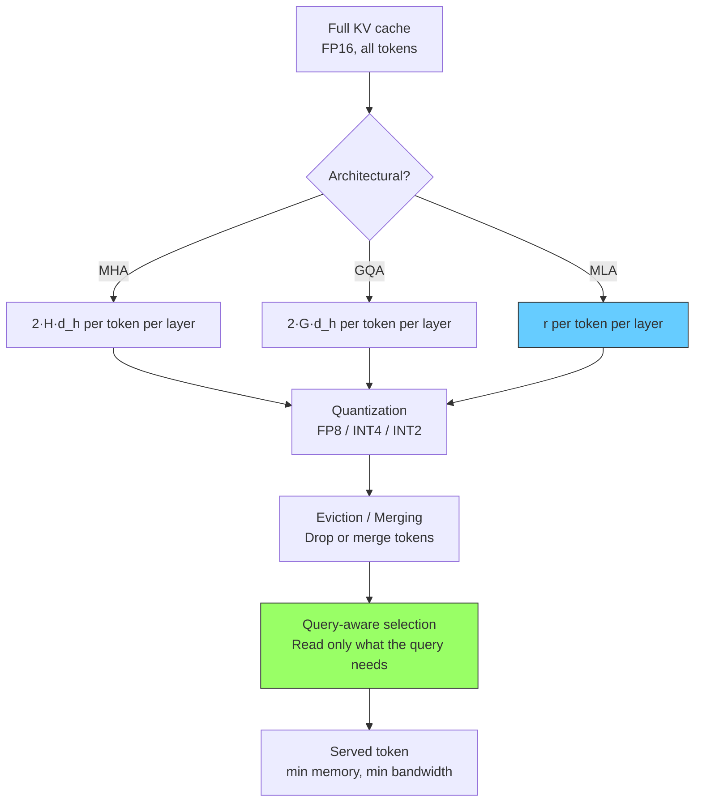
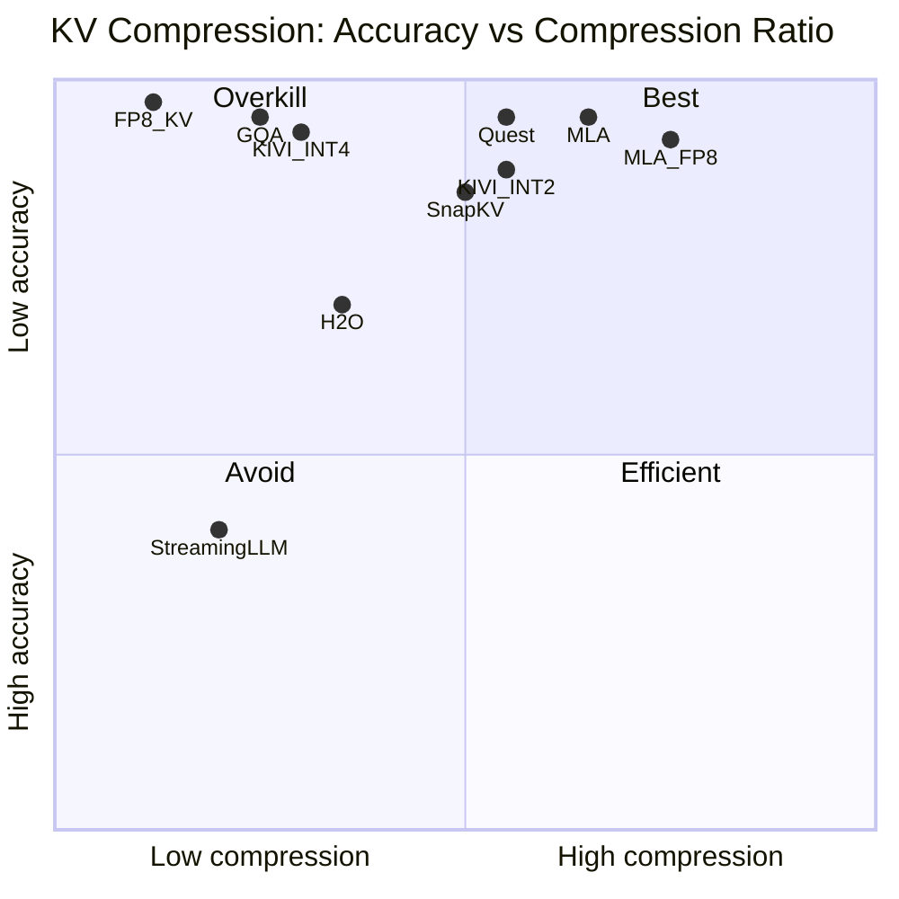
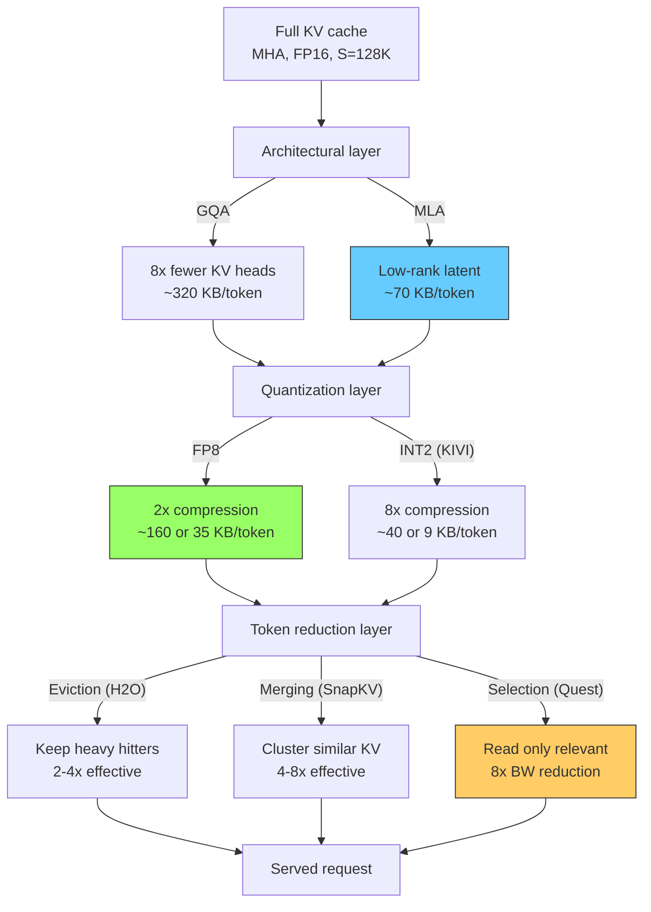

# Modern KV Compression — From StreamingLLM to MLA at Serving Time

> **Layer:** L8. **Prerequisites:** [KV_Cache](KV_Cache.md), [Attention_Mechanisms](../L6_Algorithms_and_Models/Attention_Mechanisms.md). **Hands off to:** [Batching_and_Scheduling](Batching_and_Scheduling.md), [Long_Context_Engineering](Long_Context_Engineering.md).

---

## 0. Why This Page Exists

The KV cache is the dominant memory consumer at inference time. A single Llama-3-70B request at 128K context occupies 40 GB of HBM just for KV state -- half an H100. At 1M context the number balloons past 300 GB, exceeding any single node. Compression is not an optimization; it is a prerequisite for serving.

This page covers the five families of KV compression that a serving engineer must know:

1. **Eviction** -- drop tokens from the cache (StreamingLLM, H2O).
2. **Quantization** -- use fewer bits per element (KIVI, FP8).
3. **Merging** -- collapse similar tokens into representatives (SnapKV).
4. **Selection** -- attend to a sparse subset per query (Quest).
5. **Architectural** -- compress at the model design level (MLA, DeepSeek-V2/V3).

Each family operates at a different point in the accuracy--compression tradeoff, and they stack multiplicatively. A production system typically combines two or three.

### Notation

| Symbol | Meaning | Typical value |
|--------|---------|---------------|
| $S$ | Sequence length (tokens in KV cache) | 4K -- 1M |
| $n_l$ | Transformer layers | 32 -- 126 |
| $H$ | Query heads | 32 -- 128 |
| $n_{\text{kv}}$ | KV heads (GQA) | 1 -- 8 |
| $d_h$ | Head dimension | 64 -- 256 |
| $r$ | MLA latent dimension | 256 -- 512 |
| $b$ | Bytes per element | 2 (FP16), 1 (FP8/INT8), 0.5 (INT4) |

Baseline KV cache per token (GQA, FP16):

$$C_{\text{GQA}} = 2 \cdot n_l \cdot n_{\text{kv}} \cdot d_h \cdot b$$

For Llama-3-70B: $2 \times 80 \times 8 \times 128 \times 2 = 327{,}680$ bytes $\approx 320$ KB/token.

---

## 1. The Compression Stack

KV compression methods compose in layers. Each layer multiplies the compression ratio of the ones below it.

**Rule of thumb:** architectural compression gives the largest single win (10--100x). Quantization gives 2--8x at the cost of a format conversion. Eviction and selection give 2--16x but sacrifice mid-context recall. Stacking all three can exceed 1000x effective compression.

---

## 2. Eviction-Based Compression

Eviction methods permanently remove tokens from the KV cache. The memory savings are immediate and large. The risk is that removed tokens cannot be recovered.

### 2.1 StreamingLLM -- Attention Sinks + Sliding Window

**Paper:** Xiao et al., 2023. "Efficient Streaming Language Models with Attention Sinks."

#### Observation

When visualizing attention weight matrices across layers and heads, a consistent pattern emerges: the first few tokens receive disproportionately high attention mass regardless of semantic relevance. These "attention sinks" act as default aggregation points when the model has no strong preference. Removing them causes catastrophic quality collapse -- the attention distribution shifts unpredictably, and the model produces incoherent output.

#### Algorithm

StreamingLLM maintains two fixed-size partitions:

$$\text{KV}_{\text{cache}} = \underbrace{\text{KV}_{\text{sink}}}_{\text{first } N \text{ tokens}} \cup \underbrace{\text{KV}_{\text{window}}}_{\text{last } W \text{ tokens}}$$

All tokens between position $N$ and position $S - W$ are evicted. The cache size is bounded at $(N + W) \cdot C_{\text{per\_token}}$.

**Parameters:**
- $N$ (sink size): typically 4. Can be determined empirically by identifying positions where attention mass exceeds a threshold (e.g., $> 5\%$) in the majority of heads.
- $W$ (window size): 1024--4096 for chat workloads; up to 8192 for longer-context tasks.

**Position ID handling.** When the sliding window advances, the relative positions of retained tokens must remain consistent. StreamingLLM re-bases position indices so that the most recent token always has position $S$ and the oldest retained token in the window has position $S - W + 1$. The sink tokens keep their original positions (0 through $N-1$). This preserves the positional encoding that the model was trained with.

#### Memory Analysis

For a model with $C_{\text{GQA}} = 320$ KB/token:

| $N$ | $W$ | Cache size | Equivalent context |
|----|------|------------|--------------------|
| 4 | 1024 | 328 KB | 1K tokens |
| 4 | 2048 | 657 KB | 2K tokens |
| 4 | 4096 | 1.3 MB | 4K tokens |

The cache is bounded regardless of actual generation length. A conversation that runs to 100K tokens still uses only $(N + W) \times 320$ KB.

#### Quality Impact

StreamingLLM works well for open-ended generation (chat, summarization of recent content) because those tasks primarily attend to recent context. It fails on tasks requiring mid-context retrieval:

- **Passage QA** with the answer in the middle of the prompt: accuracy drops to near zero once the relevant passage is evicted.
- **Multi-step reasoning** that references earlier conclusions: the model loses access to its own chain of thought.
- **Agentic workflows** that loop back to plans or tool outputs stored in early turns: the sink tokens capture none of the semantic content.

#### Implementation

In a paged KV cache system (vLLM, SGLang), eviction requires a block-level policy. Each block holds $B_s$ tokens (typically 16). StreamingLLM maps to: "mark blocks 0 through $\lceil N / B_s \rceil - 1$ as protected (sink); mark the most recent $\lceil W / B_s \rceil$ blocks as active; free everything else." The implementation is straightforward once the block manager supports an explicit protection bit.

### 2.2 H2O -- Heavy-Hitter Oracle

**Paper:** Zhang et al., 2023. "H2O: Heavy-Hitter Oracle for Efficient Generative Inference of Large Language Models."

#### Core Idea

Not all tokens are equally important. H2O maintains a running importance score for each token in the KV cache. When the cache exceeds a budget, the lowest-scoring tokens are evicted. The importance score approximates how much attention mass a token receives across all query positions and all heads.

#### Scoring Function

For token at position $j$, the cumulative attention score is:

$$\text{score}(j) = \sum_{t=1}^{T} \sum_{h=1}^{H} \alpha_{t,h,j}$$

where $\alpha_{t,h,j}$ is the attention weight from query position $t$ to key position $j$ in head $h$, and $T$ is the current generation step.

In practice, maintaining the full attention matrix is infeasible. H2O uses an approximation: at each generation step, accumulate the attention weights into a per-token running sum. This costs $O(S)$ per step (one addition per KV position per head), which is negligible compared to the attention compute itself.

#### Eviction Policy

At generation step $t$:

1. **Budget check:** If $|\text{KV}_{\text{cache}}| > B$ (the budget), evict.
2. **Protect:** Never evict the most recent $W_{\text{recent}}$ tokens (sliding window, analogous to StreamingLLM's window).
3. **Score and rank:** Sort the remaining tokens by accumulated score.
4. **Evict:** Remove the $|\text{KV}| - B$ lowest-scoring tokens.

The budget $B$ is typically set to 20--50% of the full sequence length.

#### Comparison with StreamingLLM

| Property | StreamingLLM | H2O |
|----------|-------------|-----|
| Keeps first tokens | Yes (sink) | No (unless high score) |
| Keeps recent tokens | Yes (window) | Yes (window) |
| Keeps mid-context | No | Yes (if high score) |
| Scoring cost | None | $O(S)$ per step |
| Mid-context QA quality | Poor | Moderate |
| Implementation complexity | Trivial | Moderate |

H2O strictly dominates StreamingLLM on quality at the same budget because it retains semantically important mid-context tokens. The cost is maintaining the score accumulator and periodically sorting it.

#### Failure Modes

H2O's scoring is backward-looking: it measures how much attention a token *has received*, not how much it *will receive*. Tokens that become relevant later (e.g., a pronoun whose referent appears early) may have been evicted before the model needs them. This is the fundamental limitation of all eviction methods.

---

## 3. Quantization-Based Compression

Quantization reduces the number of bits per KV element. Unlike eviction, no tokens are lost -- all positions remain available, just at lower precision.

### 3.1 FP8 KV Cache

The simplest quantization: cast K and V from FP16 to FP8 E4M3. Each element goes from 2 bytes to 1 byte, giving a 2x compression. Hopper (H100) tensor cores natively support FP8 attention: the MMA unit reads FP8 K and V, accumulates in FP32, and outputs FP16.

**Quality:** Typically $< 1\%$ MMLU drop. Long-context benchmarks (RULER, NIAH) are more sensitive but usually see $< 2\%$ degradation. The E4M3 format's dynamic range ($\pm 448$) is sufficient for most KV distributions when per-tensor or per-token scaling is applied.

**Production status:** Standard in vLLM (`--kv-cache-dtype fp8_e4m3`), TensorRT-LLM, and SGLang on Hopper+ hardware.

### 3.2 KIVI -- Asymmetric Per-Channel Key + Per-Token Value Quantization

**Paper:** Liu et al., 2024. "KIVI: A Tuning-Free Asymmetric 2bit Quantization for KV Cache."

#### Motivating Analysis

KIVI begins with an empirical analysis of KV distributions across layers and heads:

- **Key distributions** exhibit strong channel-wise outliers. Certain channels (dimensions of $d_h$) have magnitudes 10--100x larger than others. This is because key projection matrices develop high-norm columns that amplify specific features.
- **Value distributions** are relatively uniform across channels but vary more token-to-token.

This asymmetry means that a single quantization strategy for both K and V is suboptimal.

#### Algorithm

**Key quantization (per-channel):**

For each channel $c \in \{1, \ldots, d_h\}$ across all tokens in the cache:

$$\text{scale}_K^c = \frac{\max_t |K_{t,c}|}{2^{b_K - 1} - 1}$$

$$\hat{K}_{t,c} = \text{round}\!\left(\frac{K_{t,c}}{\text{scale}_K^c}\right) \quad \text{(clip to } [-2^{b_K-1}, 2^{b_K-1}-1]\text{)}$$

Quantizing per-channel ensures that outlier channels get their own scale and do not crush the precision of normal channels.

**Value quantization (per-token):**

For each token $t$ across all channels:

$$\text{scale}_V^t = \frac{\max_c |V_{t,c}|}{2^{b_V - 1} - 1}$$

$$\hat{V}_{t,c} = \text{round}\!\left(\frac{V_{t,c}}{\text{scale}_V^t}\right)$$

Quantizing per-token captures the token-level variance in value magnitudes.

**Bit widths:** KIVI evaluates at $b_K = b_V = 2$ (INT2) and $b_K = b_V = 4$ (INT4). The headline result is INT2, achieving 8x compression over FP16.

**Dequantization at attention time:**

$$K_{t,c}^{\text{dequant}} = \hat{K}_{t,c} \cdot \text{scale}_K^c$$

$$V_{t,c}^{\text{dequant}} = \hat{V}_{t,c} \cdot \text{scale}_V^t$$

The dequantization is fused into the attention kernel: scales are loaded once per channel (for K) or per token (for V) and applied during the dot product.

#### Compression Ratio

At INT2 ($b_K = b_V = 2$, i.e., 0.25 bytes per element):

$$C_{\text{KIVI-INT2}} = 2 \cdot n_l \cdot n_{\text{kv}} \cdot d_h \cdot 0.25 + \text{overhead}$$

The overhead includes per-channel scales for K ($d_h$ floats per layer) and per-token scales for V ($S$ floats per layer). For $S \gg d_h$, the overhead is negligible:

$$\text{Compression ratio} \approx \frac{b_{\text{FP16}}}{b_{\text{KIVI}}} = \frac{2}{0.25} = 8\times$$

At INT4: $2 / 0.5 = 4\times$.

#### Quality

| Config | MMLU drop | Long-context (RULER) drop |
|--------|-----------|--------------------------|
| FP8 KV | $< 1\%$ | $< 2\%$ |
| KIVI INT4 | $\sim 1\%$ | $\sim 2\%$ |
| KIVI INT2 | $\sim 2\%$ | $\sim 4\%$ |
| Naive INT2 (symmetric) | $> 10\%$ | $> 20\%$ |

KIVI's asymmetric per-channel/per-token strategy recovers 5--10 percentage points versus naive symmetric quantization at the same bit width.

### 3.3 FP4 KV on Blackwell (NVFP4 / MXFP4)

Blackwell introduces hardware-native FP4 support. Blocks of 16 or 32 elements share an 8-bit shared exponent, with each element storing a 2-bit sign + mantissa pair (E2M1). The tensor core's MMA unit fetches packed FP4 blocks from TMEM, applies the shared exponent natively in the datapath, and multiplies against FP8 or FP16 query vectors.

**Why this matters for reasoning models:** Models like DeepSeek-R1 generate 30K+ tokens of chain-of-thought before producing an answer. The KV cache for a single reasoning request can exceed 100 GB in FP16. FP4 compression brings this down to $\sim 25$ GB, making concurrent reasoning requests feasible.

---

## 4. Merging-Based Compression

Merging methods identify groups of KV entries that contribute similar attention patterns and replace them with a single representative. The number of tokens in the cache decreases, but the representative preserves the aggregate information.

### 4.1 SnapKV -- Cluster-Based Attention Pattern Compression

**Paper:** Li et al., 2024. "SnapKV: Snaphot KV Cache Compression for Inference Acceleration."

#### Key Insight

The last few query tokens at the end of the prefill phase reveal which historical tokens the model will attend to during generation. SnapKV uses an "observation window" of the last $W_o$ queries to score all historical tokens, then prunes the cache before decode begins.

#### Algorithm

**Phase 1: Observation (at prefill end).**

After prefilling the prompt of length $S$, extract the attention weights from the last $W_o$ query tokens (typically $W_o = 32$ or $64$):

$$\text{importance}(j) = \sum_{i=S-W_o+1}^{S} \sum_{h=1}^{H} \alpha_{i,h,j}$$

This produces an importance score for every token position $j \in \{1, \ldots, S\}$.

**Phase 2: Clustering.**

Within each attention head, cluster the top-scoring KV entries by their key vector similarity using a lightweight clustering algorithm (typically k-means or greedy merging with a cosine-similarity threshold $\tau$). Merge each cluster into a single representative KV pair:

$$\tilde{k}_{\text{cluster}} = \frac{1}{|C|} \sum_{j \in C} k_j, \quad \tilde{v}_{\text{cluster}} = \frac{1}{|C|} \sum_{j \in C} v_j$$

where $C$ is the set of token positions in the cluster.

**Phase 3: Pruned cache for decode.**

Replace the original KV entries with the cluster representatives plus a recent sliding window of $W_r$ unmerged tokens. The decode phase attends to the compressed cache.

#### Compression and Quality

SnapKV achieves 4--8x compression on long prompts with minimal quality impact on QA tasks. The observation window accurately identifies salient tokens because attention patterns during prefill are highly correlated with patterns during subsequent generation.

**Limitation:** SnapKV is a one-shot operation at prefill end. It cannot adapt if the generation phase shifts its attention to previously unimportant tokens. For chat workloads where the user's follow-up question references a different part of the context, the compressed cache may lack the necessary tokens.

---

## 5. Query-Aware Selection

Selection methods keep the full KV cache in memory but read only a subset per decode step. The savings are in HBM bandwidth, not capacity. Since decode is bandwidth-bound (reading the full KV cache for each token), bandwidth reduction directly translates to throughput improvement.

### 5.1 Quest -- Query-Aware Sparse KV Selection

**Paper:** Tang et al., 2024. "Quest: Query-Aware Sparsity for Efficient Long-Context LLM Inference."

#### Observation

At long context lengths, attention probability mass concentrates on a small fraction of tokens. For a 128K context, typically $< 5\%$ of tokens receive $> 95\%$ of the attention weight. The remaining 95% contribute negligible signal. If we could identify the important 5% before loading the KV data, we could skip 95% of the memory reads.

#### Algorithm

**Offline preparation (per block):**

Divide the KV cache into blocks of $B_q$ tokens (typically $B_q = 16$ or $64$). For each block $b$ and each head $h$, precompute summary statistics of the key vectors:

$$\text{Kmax}_{b,h,p} = \max_{j \in b} K_{j,h,p}, \quad \text{Kmin}_{b,h,p} = \min_{j \in b} K_{j,h,p}$$

for each dimension $p \in \{1, \ldots, d_h\}$. Store $\text{Kmax}$ and $\text{Kmin}$ alongside the block (negligible overhead: $2 d_h$ floats per block).

**Online selection (per decode step):**

1. **Compute query:** $q = x^T W^Q \in \mathbb{R}^{1 \times d_h}$.
2. **Estimate block relevance:** For each block $b$, compute an upper bound on the maximum attention score:

$$\hat{s}_{b} = \sum_{p=1}^{d_h} \max\!\left(q_p \cdot \text{Kmax}_{b,h,p},\; q_p \cdot \text{Kmin}_{b,h,p}\right)$$

This is a dot-product upper bound: it estimates the best possible score any token in the block could achieve.

3. **Select top-K blocks:** Sort blocks by $\hat{s}_b$ descending; keep the top $K$ blocks (e.g., $K = 16$ out of 2048 blocks = 0.8% of tokens).
4. **Full attention on selected blocks:** Load only the KV data for the selected $K$ blocks and compute standard scaled dot-product attention. Apply a recent-window fallback to ensure the last $W_r$ tokens are always attended.

#### Bandwidth Savings

If the full KV cache occupies $M_{\text{KV}}$ bytes and $K / N_{\text{blocks}} = \rho$ (selection ratio):

$$\text{Bandwidth per decode step} = \rho \cdot M_{\text{KV}}$$

For $\rho = 1/8$ (selecting 12.5% of blocks): 8x bandwidth reduction. At 128K context on Llama-3-70B (FP16), the full KV read per step is $\sim 40$ GB; Quest reduces this to $\sim 5$ GB.

**Quality:** $< 1\%$ accuracy loss on standard benchmarks. The upper-bound estimator is conservative enough that relevant tokens are rarely missed, and the recent-window fallback handles positional recency.

#### Kernel Integration

Naive top-K selection breaks FlashAttention's tiled processing model. Production implementations modify the kernel to:
1. Load only selected blocks (gated by a bitmask).
2. Compute online softmax over the union of selected blocks and the recent window.
3. Maintain a uniform row in the attention matrix for unselected blocks (approximated as zero attention weight).

This preserves tile parallelism for the selected subset while avoiding wasted computation on unselected blocks.

---

## 6. MLA at Serving Time

Multi-Head Latent Attention (MLA) from DeepSeek-V2/V3 is covered in detail in [Attention_Mechanisms](../L6_Algorithms_and_Models/Attention_Mechanisms.md). This section focuses on the serving implications: what changes in the inference stack when the model uses MLA instead of MHA/GQA.

### 6.1 What MLA Stores in the KV Cache

Standard MHA/GQA stores K and V tensors directly. MLA stores a single compressed latent vector per token per layer:

$$\mathbf{c}_{KV} = x^T W_{DKV} \in \mathbb{R}^{r}$$

where $W_{DKV} \in \mathbb{R}^{D \times r}$ is the down-projection matrix and $r \ll D$. The full K and V for each head are reconstructed on-the-fly during attention:

$$K_h = \mathbf{c}_{KV} \, W_{UK}^h, \quad V_h = \mathbf{c}_{KV} \, W_{UV}^h$$

For DeepSeek-V3: $r = 512$, $D = 7168$, yielding $7168 / 512 = 14\times$ compression in the projection dimension alone.

### 6.2 KV Cache Size Comparison

$$C_{\text{MLA}} = n_l \cdot (r + d_{\text{rope}}) \cdot b$$

where $d_{\text{rope}}$ is the decoupled rotary dimension (small, typically $d_h/2$).

| Model | Attention | $n_l$ | KV params | $b$ | Bytes/token |
|-------|-----------|-------|-----------|-----|-------------|
| Llama-2 70B | MHA | 80 | $2 \times 64 \times 128$ | 2 | 2,621 KB |
| Llama-3 70B | GQA | 80 | $2 \times 8 \times 128$ | 2 | 320 KB |
| DeepSeek-V3 | MLA | 61 | $512 + 64$ | 2 | 70 KB |

MLA is **4.6x smaller** than GQA and **37x smaller** than MHA.

### 6.3 Serving Implications

**Memory capacity:** At 128K context, DeepSeek-V3's MLA cache is $\sim 8.6$ GB per request. Llama-3-70B's GQA cache is $\sim 40$ GB. On an 80 GB H100 with 40 GB for weights, MLA serves $\lfloor 40 / 8.6 \rfloor = 4$ concurrent 128K requests; GQA serves $\lfloor 40 / 40 \rfloor = 1$.

**Decode bandwidth:** MLA reads $r = 512$ elements per token per layer from the cache, then reconstructs K and V via matrix multiply. The reconstruction FLOPs per token per layer:

$$\text{FLOPs}_{\text{reconstruct}} = 2 \times 2 \times H \times r \times d_h = 4 H r d_h$$

For DeepSeek-V3 ($H = 128$, $r = 512$, $d_h = 128$): $4 \times 128 \times 512 \times 128 = 33.6$ MFLOP per layer. This is small but non-zero. The net effect is that MLA shifts the decode bottleneck slightly toward compute and away from memory bandwidth, improving utilization on bandwidth-saturating hardware.

**Paged attention compatibility:** MLA's latent vector $\mathbf{c}_{KV}$ is a contiguous $r$-dimensional vector. It maps directly to paged KV cache blocks: each block holds $B_s$ latent vectors, each of size $r$. No per-head indexing is needed. This is actually simpler than GQA's paged attention, which must handle $n_{\text{kv}}$ separate head slots per block.

**Quantization of latent vectors:** The latent $\mathbf{c}_{KV}$ can be quantized just like standard K/V. FP8 MLA latent gives 2x compression on top of the architectural compression. INT4 latent (4x over FP16) is also viable because the latent space is lower-dimensional and less outlier-prone than the original K/V space.

### 6.4 MLA + Quantization Combined

| Config | Bytes/token | Compression vs MHA FP16 |
|--------|-------------|------------------------|
| MHA FP16 (Llama-2 70B) | 2,621 KB | 1x |
| GQA FP16 (Llama-3 70B) | 320 KB | 8.2x |
| MLA FP16 (DeepSeek-V3) | 70 KB | 37x |
| MLA FP8 | 35 KB | 75x |
| MLA INT4 | 18 KB | 146x |

At INT4, DeepSeek-V3 at 128K context uses $\sim 2.2$ GB per request. Ten concurrent 128K requests fit in 22 GB, leaving ample room for weights and activations on a single H100.

---

## 7. Comprehensive Comparison

### 7.1 Method Comparison Table

| Method | Family | Comp. ratio | Quality cost | When to apply | Training needed? |
|--------|--------|-------------|-------------|---------------|------------------|
| GQA | Architectural | 4--8x | $< 0.5$ pp MMLU | Model design | Yes (retrain) |
| MLA | Architectural | 30--60x | $< 0.5$ pp MMLU | Model design | Yes (retrain) |
| FP8 KV | Quantization | 2x | $< 1\%$ MMLU | Always (Hopper+) | No |
| KIVI INT4 | Quantization | 4x | $\sim 1\%$ MMLU | Capacity-constrained | No |
| KIVI INT2 | Quantization | 8x | $\sim 2\%$ MMLU | Extreme capacity | No |
| StreamingLLM | Eviction | Bounded | Poor mid-context | Streaming generation | No |
| H2O | Eviction | 2--4x | Moderate | Chat with limited recall | No |
| SnapKV | Merging | 4--8x | Low (QA tasks) | Long-prompt chat | No |
| Quest | Selection | 8x BW | $< 1\%$ | Long-context decode | No |
| NSA / MoBA | Sparse routing | 4--16x | Low (trained) | Architecture choice | Yes (retrain) |

### 7.2 Accuracy vs Compression Pareto Front

### 7.3 Workload-Specific Recommendations

| Workload | Recommended stack | Effective compression | Notes |
|----------|-------------------|----------------------|-------|
| Chat (4K context) | GQA + FP8 | $\sim 16\times$ | Standard baseline |
| RAG (32K context) | GQA + FP8 + SnapKV | $\sim 64\times$ | Prune documents at prefill |
| Long-context QA (128K) | MLA + FP8 + Quest | $\sim 600\times$ BW | Quest critical for decode speed |
| Reasoning (30K CoT) | MLA + FP4 | $\sim 150\times$ | Reasoning models need large CoT |
| 1M context | MLA + FP8 + Quest | $\sim 1200\times$ BW | Extreme; NSA/MoBA may be needed |
| Streaming agent | StreamingLLM + FP8 | Bounded | Mid-context recall not needed |

---

## 8. Worked Examples

### Problem 1: Concurrent Request Capacity

**Q:** An 8xH100 node (80 GB each, 640 GB total) serves DeepSeek-V3 (MLA, $n_l = 61$, $r = 512$, $b_{\text{weights}} = 140$ GB total). Average context is 64K tokens. How many concurrent requests at FP16? At FP8?

**A:**

MLA KV per token (FP16): $61 \times 512 \times 2 = 62{,}464$ bytes $\approx 61$ KB.

Per request (64K context): $61{,}464 \times 65{,}536 \approx 3.9$ GB.

Available for KV: $640 - 140 = 500$ GB.

Concurrent requests (FP16): $\lfloor 500 / 3.9 \rfloor = 128$.

At FP8: KV per token = $61 \times 512 \times 1 = 31{,}232$ bytes. Per request $\approx 2.0$ GB.

Concurrent (FP8): $\lfloor 500 / 2.0 \rfloor = 250$.

FP8 doubles concurrency for free.

### Problem 2: Quest Bandwidth Savings

**Q:** Llama-3-70B (GQA, $n_{\text{kv}} = 8$, $d_h = 128$, $n_l = 80$) serves a 128K context at FP16. Quest selects top-10% of KV blocks per decode step. How much bandwidth is saved per token?

**A:**

Full KV per token: $2 \times 80 \times 8 \times 128 \times 2 = 327{,}680$ bytes $\approx 320$ KB.

Full KV read per decode step (128K tokens): $327{,}680 \times 131{,}072 \approx 40.4$ GB.

With Quest (10% selected): $40.4 \times 0.10 = 4.04$ GB per step.

Bandwidth saved: $40.4 - 4.04 = 36.4$ GB per step.

At H100's HBM bandwidth of 3.35 TB/s, this reduces the attention kernel's runtime from $\sim 12.1\mu s$ to $\sim 1.2\mu s$ per layer (memory-bound regime). Across 80 layers, decode time drops from $\sim 970\mu s$ to $\sim 100\mu s$ per token -- roughly 10x throughput improvement.

### Problem 3: KIVI Quantization Overhead

**Q:** A model has $n_l = 80$, $n_{\text{kv}} = 8$, $d_h = 128$, $S = 32{,}768$. Compute the storage overhead of KIVI's quantization scales at INT2 versus the compressed KV data.

**A:**

**KV data:** $2 \times 80 \times 8 \times 128 \times 32{,}768 \times 0.25 = 2 \times 80 \times 8 \times 128 \times 8{,}192 = 1{,}342{,}177{,}280$ bytes $\approx 1.25$ GB.

**K scales (per-channel):** $80 \times 8 \times 128 \times 4$ (FP32 scale) $= 327{,}680$ bytes $\approx 0.31$ MB.

**V scales (per-token):** $80 \times 8 \times 32{,}768 \times 4 = 83{,}886{,}080$ bytes $\approx 80$ MB.

**Total overhead:** $\approx 80$ MB, which is $80 / 1250 \approx 6.4\%$ of the compressed data. Negligible relative to the 8x compression gain.

---

## 9. System Integration

### 9.1 vLLM

| Feature | Support level |
|---------|---------------|
| FP8 KV | Native (`--kv-cache-dtype fp8_e4m3`) |
| INT8 KV | Native |
| Prefix caching | On by default |
| Eviction (StreamingLLM/H2O) | Not built-in; requires custom block manager |
| Quest / SnapKV | Research kernels; not in mainline |

### 9.2 SGLang

| Feature | Support level |
|---------|---------------|
| FP8 KV | Native |
| RadixAttention | Native (excellent for prefix sharing) |
| Quantized KV | Experimental |

### 9.3 TensorRT-LLM

| Feature | Support level |
|---------|---------------|
| FP8 / INT8 KV | Native |
| Custom attention plugins | Supported |
| KV cache reuse / paging | Supported |

### 9.4 Integration Challenges

**Paged attention + eviction.** Paged KV caches (vLLM, SGLang) manage KV state in fixed-size blocks. Eviction requires freeing specific blocks mid-generation. Standard implementations assume a request's block count only grows. Supporting eviction requires a block manager that can mark blocks as freed and return them to the pool without corrupting adjacent requests.

**Quantization + radix tree.** Prefix caching hashes KV blocks to detect sharing. If two requests share a prefix but use different KV dtypes (e.g., one FP16, one FP8), their blocks must not be shared. The hash must include the dtype.

**Quest + FlashAttention.** FlashAttention processes KV in sequential tiles. Quest needs to skip non-selected tiles. This requires modifying the kernel's tile iteration to be conditional on a selection bitmask, which breaks the uniform memory access pattern that FlashAttention relies on for throughput. Production implementations (e.g., Quest's Triton kernel) handle this via sparse block loading.

---

## 10. Common Pitfalls

1. **Eviction in agentic workflows.** Agents reference earlier plans, tool outputs, and observations. StreamingLLM-style mid-context eviction destroys this information. Use full-context methods (Quest, MLA) or keep a protected "agent memory" partition that eviction cannot touch.

2. **Quantization without recalibration.** After fine-tuning, KV distributions shift. Scales calibrated on the base model may be wrong for the fine-tuned model, especially in domain-specific heads. Always recalibrate quantization scales on a representative dataset from the target workload.

3. **SnapKV on multi-turn conversations.** SnapKV prunes at prefill end based on the observation window. In a multi-turn chat, the observation window sees only the current turn's queries. Tokens from earlier turns may be pruned even though the next user turn will reference them. Mitigation: recompute the importance score at each turn boundary.

4. **Quest false negatives.** The upper-bound estimator can miss blocks where the average attention is low but a single token is critical. The recent-window fallback mitigates this for positional recency but not for semantic recency. For tasks where a single mid-context token is essential (e.g., a key fact in a long document), Quest may degrade.

5. **MLA reconstruction latency.** The $4Hrd_h$ FLOPs per layer for K/V reconstruction are small in absolute terms but not zero. On bandwidth-saturated hardware, this compute can add 5--10% to per-token latency. Profile before assuming MLA is free.

6. **KIVI on outlier-heavy distributions.** Some models develop extreme channel-wise outliers in later layers. KIVI's per-channel scaling handles moderate outliers but can fail when the outlier magnitude exceeds $100\times$ the median. In such cases, a residual stream (GEAR-style) for the top outlier channels recovers accuracy.

7. **Tiered KV swap latency.** Offloading cold KV blocks to CPU RAM and loading them back on demand adds 10--100$\mu s$ per block (PCIe bandwidth). If a decode step triggers a large reload (e.g., Quest selects blocks that were evicted to CPU), the step stalls. Prefetch anticipated blocks during the previous step.

---

## 11. Numbers to Memorize

| # | Quantity | Value | Context |
|---|----------|-------|---------|
| 1 | GQA KV per token (Llama-3 70B, FP16) | 320 KB | $2 \times 80 \times 8 \times 128 \times 2$ |
| 2 | MLA KV per token (DeepSeek-V3, FP16) | 70 KB | $61 \times (512 + 64) \times 2$ |
| 3 | MLA compression vs MHA | 37--64x | DeepSeek-V3 dimensions |
| 4 | FP8 KV compression | 2x | Drop-in on Hopper |
| 5 | KIVI INT2 compression | 8x | Asymmetric per-ch / per-tok |
| 6 | StreamingLLM typical budget | $N + W \approx 2K$ | 4 sink + 2048 window |
| 7 | H2O budget fraction | 20--50% of full seq | Retain heavy hitters |
| 8 | SnapKV compression | 4--8x | Cluster + prune at prefill |
| 9 | Quest bandwidth reduction | 8--10x | Top-10% block selection |
| 10 | MLA FP8 KV per token (DeepSeek-V3) | 35 KB | 2x on top of MLA |
| 11 | MLA INT4 KV per token (DeepSeek-V3) | 18 KB | 4x on top of MLA |
| 12 | MLA reconstruction FLOPs | $4Hrd_h$ / layer / token | 33.6 MFLOP for DS-V3 |
| 13 | DeepSeek-V3 at 128K (FP16) | 8.6 GB / request | Fits $\sim$4 on H100 |
| 14 | KIVI scale overhead | $\sim$6% of compressed data | Dominated by V per-token scales |
| 15 | Quest selection ratio (typical) | 5--12.5% | 8--20x bandwidth reduction |

---

## 12. End-to-End Cause and Effect

---

## 13. References

1. Xiao, G. et al. (2023). "Efficient Streaming Language Models with Attention Sinks." *ICLR 2024*. [arXiv:2309.17453](https://arxiv.org/abs/2309.17453)
2. Zhang, Z. et al. (2023). "H2O: Heavy-Hitter Oracle for Efficient Generative Inference of Large Language Models." *NeurIPS 2023*. [arXiv:2306.14898](https://arxiv.org/abs/2306.14898)
3. Liu, Z. et al. (2024). "KIVI: A Tuning-Free Asymmetric 2bit Quantization for KV Cache." *ICML 2024*. [arXiv:2402.02750](https://arxiv.org/abs/2402.02750)
4. Li, Y. et al. (2024). "SnapKV: Snapshot KV Cache Compression for Inference Acceleration." [arXiv:2404.14469](https://arxiv.org/abs/2404.14469)
5. Tang, J. et al. (2024). "Quest: Query-Aware Sparsity for Efficient Long-Context LLM Inference." [arXiv:2406.09284](https://arxiv.org/abs/2406.09284)
6. DeepSeek-AI (2024). "DeepSeek-V2: A Strong, Economical, and Efficient Mixture-of-Experts Language Model." [arXiv:2405.04434](https://arxiv.org/abs/2405.04434)
7. DeepSeek-AI (2024). "DeepSeek-V3 Technical Report." [arXiv:2412.19437](https://arxiv.org/abs/2412.19437)
8. Ainslie, J. et al. (2023). "GQA: Training Generalized Multi-Query Transformer Models from Multi-Head Checkpoints." [arXiv:2305.13245](https://arxiv.org/abs/2305.13245)

---

## 14. Stack Links

**Up (deeper):**
- [KV_Cache](KV_Cache.md) -- paged KV layout, PagedAttention, prefix caching, radix tree
- [Attention_Mechanisms](../L6_Algorithms_and_Models/Attention_Mechanisms.md) -- MHA, GQA, MLA architecture definitions
- [Quantization](../L6_Algorithms_and_Models/Quantization.md) -- FP8, FP4, INT8 quantization fundamentals

**Down (higher level):**
- [Batching_and_Scheduling](Batching_and_Scheduling.md) -- how KV cache size determines batch size and scheduling
- [Long_Context_Engineering](Long_Context_Engineering.md) -- ring attention, NSA, MoBA, context parallelism

**Lateral:**
- [Speculative_Decoding](Speculative_Decoding.md) -- speculative decoding benefits from smaller KV caches
- [Inference_Frameworks](Inference_Frameworks.md) -- framework support for KV compression
- [Prefill_Decode_Disaggregation](Prefill_Decode_Disaggregation.md) -- KV transfer between prefill and decode pools
