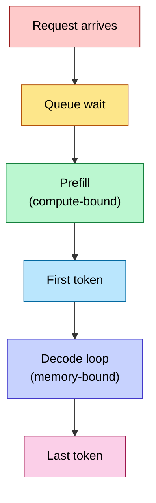
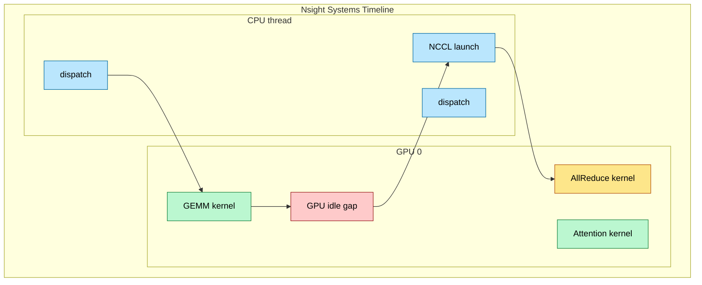
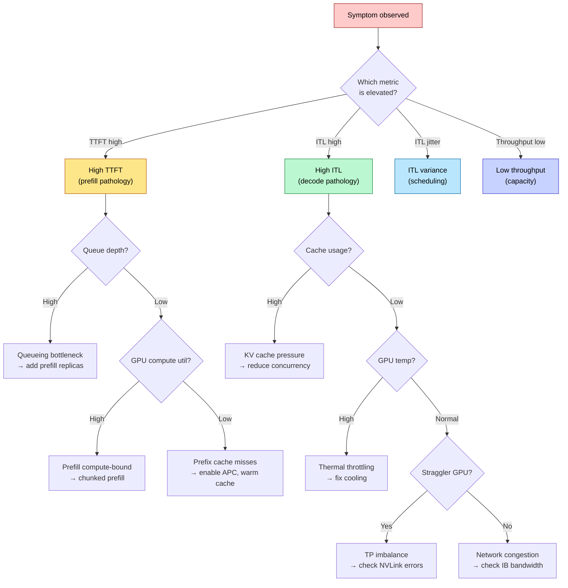
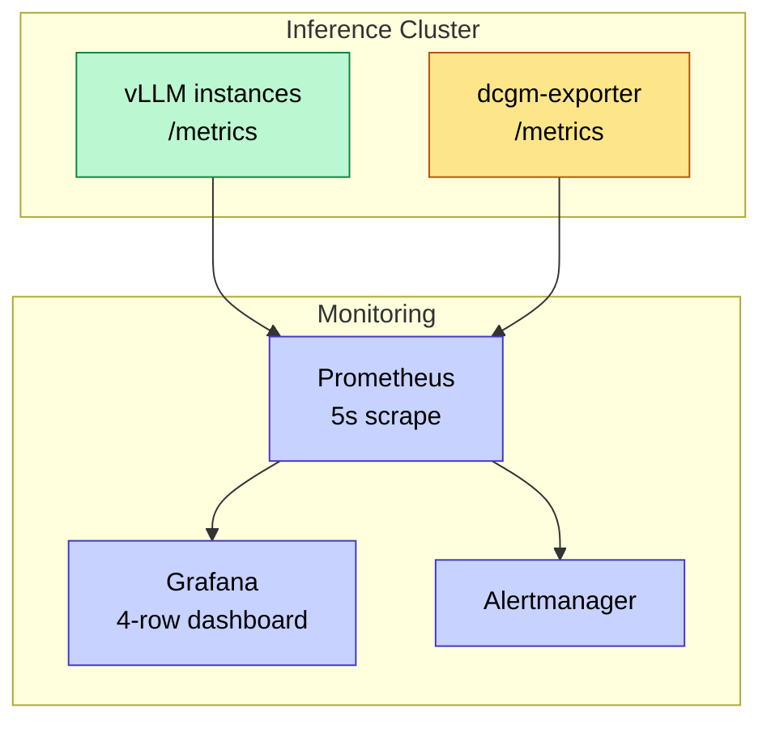
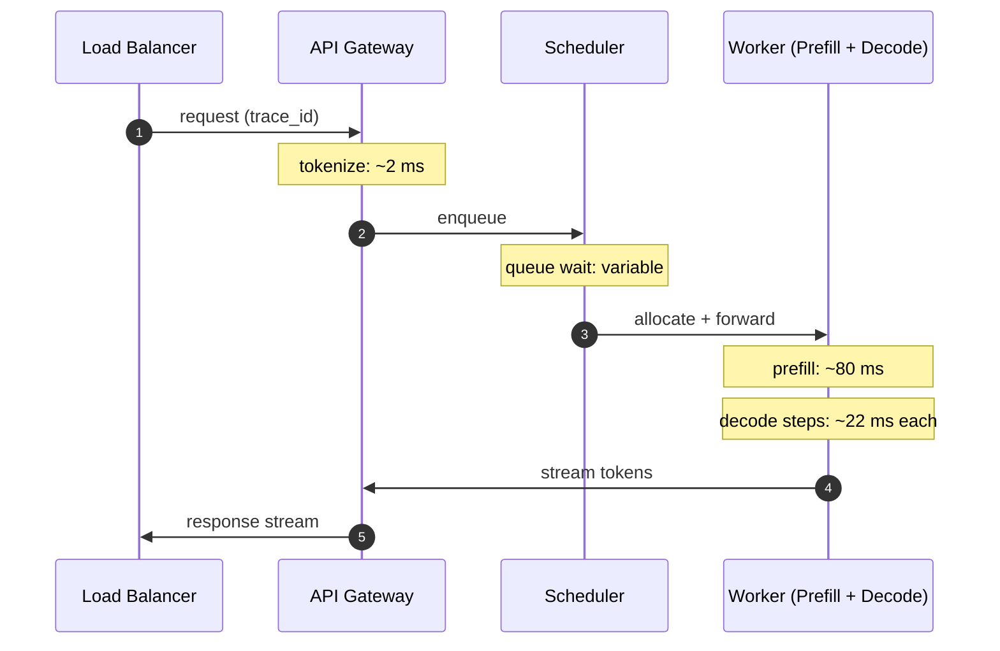
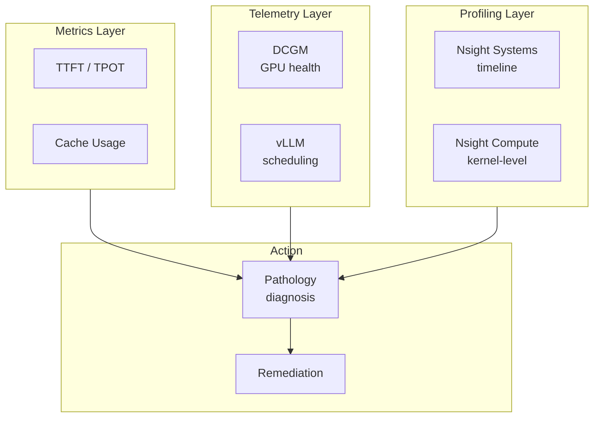

# Observability and Debugging — Metrics, Profiling, and Pathology Diagnosis

> **Layer:** L8. **Prerequisites:** [Production_Architecture](Production_Architecture.md), [vLLM_Internals](vLLM_Internals.md), [Batching_and_Scheduling](Batching_and_Scheduling.md). **Hands off to:** [Production_Architecture](Production_Architecture.md).

---

## 0. Why This Page Exists

An LLM serving cluster is a stochastic pipeline with failure modes absent from traditional web serving. A single straggler GPU in a tensor-parallel group stalls every request in the batch. A KV cache eviction storm can spike TTFT by 10x without any change in request rate. A prefix cache miss forces redundant prefills that saturate compute. None of these pathologies are visible from HTTP error codes or CPU metrics alone.

This page covers the complete observability and debugging stack for production LLM inference: latency metrics (TTFT, ITL, TPOT, prefill/decode breakdown), GPU telemetry (DCGM), profiling (Nsight Systems, Nsight Compute), a structured debugging flow for nine common pathologies, and the Prometheus + Grafana observability stack with alerting rules.

### The four invariants

1. **TTFT is dominated by prefill; ITL is dominated by decode** — independently tunable, must be monitored separately.
2. **GPU utilization $\neq$ inference efficiency** — 98% SM occupancy during an AllReduce stall means 98% of the GPU is doing no useful work.
3. **Every latency spike has a bottleneck signature** — the combination of TTFT, ITL, DCGM, and scheduling metrics uniquely identifies the root cause.
4. **P95/P99 latency is the metric that matters** — mean latency hides tail pathologies that degrade user experience.

---

## 1. Core Latency Metrics

### 1.1 Definitions

| Metric | Abbreviation | Definition | Units |
|--------|-------------|------------|-------|
| Time To First Token | TTFT | Wall-clock from request arrival to first token emitted | ms |
| Inter-Token Latency | ITL | Wall-clock between consecutive token emissions | ms |
| Time Per Output Token | TPOT | $\text{ITL}$ averaged over the full output sequence | ms/token |
| End-to-End Latency | E2E | Wall-clock from request arrival to last token emitted | ms |
| Prefill Time | $T_p$ | Time computing the prefill forward pass | ms |
| Decode Time | $T_d$ | Time in autoregressive decode steps | ms |
| Throughput | $\Phi$ | Total output tokens/sec across all requests | tok/s |

### 1.2 Relationships

$$\text{E2E} = \text{TTFT} + T_d = T_p + T_{queue} + T_d$$

$$\text{TPOT} = \frac{T_d}{N_{out}}$$

where $N_{out}$ is the number of output tokens and $T_{queue}$ is the admission-queue wait. Under load, $T_{queue}$ can dominate TTFT.

### 1.3 Prefill vs Decode Breakdown



| Phase | Regime | Bottleneck | Scales with |
|-------|--------|------------|-------------|
| Prefill | Compute-bound | FLOPS (tensor cores) | Prompt length, batch size |
| Decode | Memory-bound | HBM bandwidth | Model size, KV cache size |
| Queue | I/O-bound | Scheduler capacity | Request rate, concurrency limit |
| KV transfer | Network-bound | NVLink / IB bandwidth | Sequence length, TP degree |

### 1.4 Worked example

Llama-3-70B FP16 on 4x H100 SXM (TP=4), prompt = 2048 tokens, output = 256 tokens:

$$T_p = \frac{2 \times 70 \times 10^9 \times 2048}{989 \times 10^{12} \times 4} \approx 72 \text{ ms}$$

$$T_d = \frac{2 \times 70 \times 10^9 \times 2 \times 256}{3{,}350 \times 10^9 \times 4} \approx 5{,}350 \text{ ms}$$

$$\text{TTFT} \approx 72 \text{ ms}, \quad \text{TPOT} \approx \frac{5350}{256} \approx 21 \text{ ms/token}, \quad \text{E2E} \approx 5{,}422 \text{ ms}$$

Decode dominates E2E by 74x. Output-heavy workloads spend 95--99% of wall-clock time in decode.

---

## 2. GPU Telemetry with DCGM

### 2.1 Critical DCGM Fields

NVIDIA's `dcgm-exporter` provides Prometheus-compatible GPU telemetry:

| Metric | DCGM field | Units | Normal (H100 SXM) | Alert threshold |
|--------|-----------|-------|--------------------|-----------------|
| GPU utilization | `DCGM_FI_DEV_GPU_UTIL` | % | 70--98% | < 50% sustained |
| Memory utilization | `DCGM_FI_DEV_MEM_COPY_UTIL` | % | 60--95% | < 40% sustained |
| FB memory used | `DCGM_FI_DEV_FB_USED` | MB | Varies | > 95% of total |
| Power usage | `DCGM_FI_DEV_POWER_USAGE` | W | 300--700 W | > 680 W sustained |
| GPU temperature | `DCGM_FI_DEV_GPU_TEMP` | C | 45--75 C | > 80 C |
| SM clock | `DCGM_FI_DEV_SM_CLOCK` | MHz | 1,830--1,980 | < 1,500 (throttling) |
| ECC single-bit | `DCGM_FI_DEV_ECC_SBE_VOL_TOTAL` | count | 0 | > 0 (investigate) |
| ECC double-bit | `DCGM_FI_DEV_ECC_DBE_VOL_TOTAL` | count | 0 | > 0 (immediate action) |
| NVLink CRC errors | `DCGM_FI_DEV_NVLINK_CRC_FLIT_ERROR_COUNT_L` | count | 0 | > 0 |

### 2.2 Utilization Caveat

`DCGM_FI_DEV_GPU_UTIL` reports the fraction of time at least one SM was active. During an AllReduce, all SMs wait at barriers — utilization reads 98% but useful throughput is near zero. DCGM cannot distinguish "SM active doing math" from "SM active doing barriers." Tensor-core utilization requires Nsight profiling (Section 4).

### 2.3 Thermal Throttling

When GPU temperature exceeds 80 C, the driver reduces SM clock:

$$\text{Throughput loss} = 1 - \frac{f_{\text{clock}}}{f_{\text{base}}} \approx 1 - \frac{1500}{1830} \approx 18\% \text{ on H100}$$

### 2.4 ECC Errors

Single-bit ECC errors are corrected in hardware; a few per day is normal for HBM. Double-bit ECC errors are uncorrectable and corrupt inference outputs. A DBE means: drain the GPU, restart, and schedule hardware replacement if persistent.

---

## 3. Application-Level Metrics

### 3.1 vLLM Prometheus Metrics

vLLM exposes `/metrics` with these key signals:

| Metric | Type | Meaning |
|--------|------|---------|
| `vllm:num_requests_running` | Gauge | Active decode-phase requests |
| `vllm:num_requests_waiting` | Gauge | Requests queued for prefill |
| `vllm:num_requests_swapped` | Gauge | Requests swapped to CPU |
| `vllm:gpu_cache_usage_perc` | Gauge | KV cache block usage fraction |
| `vllm:e2e_request_latency_seconds` | Histogram | Full E2E latency distribution |
| `vllm:time_to_first_token_seconds` | Histogram | TTFT distribution |
| `vllm:time_per_output_token_seconds` | Histogram | TPOT distribution |
| `vllm:num_preemption` | Counter | KV cache eviction count |
| `vllm:avg_generation_throughput` | Gauge | Output tokens/sec |
| `vllm:prefix_cache_hit_rate` | Gauge | Fraction of prompt tokens from prefix cache |

### 3.2 Histogram Quantile Queries

```promql
# P99 TTFT over 5 minutes
histogram_quantile(0.99,
  sum(rate(vllm:time_to_first_token_seconds_bucket[5m])) by (le, instance))

# P95 TPOT
histogram_quantile(0.95,
  sum(rate(vllm:time_per_output_token_seconds_bucket[5m])) by (le, instance))
```

### 3.3 KV Cache Utilization

$$\text{Cache usage} = \frac{B_{active} \cdot S_{avg} \cdot c_{token}}{C_{KV}}$$

When cache usage exceeds 90%, preemptions begin. Monitor `vllm:gpu_cache_usage_perc` and `vllm:num_preemption` together: rising cache usage with zero preemptions is safe; rising preemptions means the system is beyond its comfortable concurrency limit.

---

## 4. Nsight Profiling

### 4.1 Nsight Systems — Timeline Analysis

Nsight Systems (`nsys`) provides a system-wide timeline showing kernel launches, memory copies, and API calls. It answers: *where does the time go?*



**Key analysis steps:**

1. **Measure GPU idle gaps.** Gaps between kernels indicate CPU-side overhead. Gaps > 10 us per step accumulate to 10 ms over 1,000 decode steps.
2. **Identify kernel duration distribution:**

| Kernel | Fraction of step time | Notes |
|--------|----------------------|-------|
| GEMM (QKV, MLP) | 30--50% | Memory-bound |
| Attention (decode) | 20--40% | Memory-bound, reads KV cache |
| AllReduce (TP) | 10--30% | Network-bound, scales with TP |
| Activation / misc | 5--10% | SiLU, residual, layernorm |

3. **Quantify AllReduce overhead.** In TP=8, each step includes two AllReduce ops. If AllReduce exceeds 30% of step time, consider reducing TP degree.

**Profiling command:**

```bash
nsys profile --trace=cuda,nvtx,osrt,nvml \
  --output=vllm_inference --duration=30 --pid=$(pgrep -f "vllm")
```

### 4.2 Nsight Compute — Kernel-Level Analysis

Nsight Compute (`ncu`) profiles individual kernels with hardware counters. It answers: *why is this kernel slow?*

Key metrics from the roofline section:

| Metric | Meaning | Target |
|--------|---------|--------|
| SM occupancy | Active warps / max warps per SM | > 50% |
| Achieved FLOPs | Actual FLOP throughput | Compare to roofline |
| Memory throughput | Actual HBM bandwidth utilization | > 80% of spec |
| Stall reasons | Long scoreboard, barrier, not selected | Quantifies bottleneck |

### 4.3 Roofline Check

For decode-step GEMM on H100 SXM with Llama-3-70B FP16, arithmetic intensity = 1 FLOP/byte vs the ridge point of 295 FLOP/byte. The roofline peak is 3.35 TFLOPS (0.3% of peak compute). If `ncu` reports significantly below this, the kernel has a secondary bottleneck (low occupancy, bank conflicts, or launch overhead).

---

## 5. Pathology Diagnosis

### 5.1 Debugging Flow



### 5.2 Pathology Catalog

#### Pathology 1: High TTFT — Prefill Bottleneck

**Symptoms:** P99 TTFT > 2x P50, `vllm:num_requests_waiting` consistently > 0.

**Root cause:** Prefill compute saturated. Each request requires $2P \times S_p$ FLOPs; high request rate with long prompts exhausts tensor cores.

**Diagnosis:** `DCGM_FI_DEV_GPU_UTIL` > 90% during spike, rising queue depth, high TTFT only on long-prompt requests.

**Remediation:** Enable chunked prefill, add dedicated prefill replicas, or increase concurrent prefill limit.

#### Pathology 2: High ITL — Decode Bottleneck

**Symptoms:** P95 ITL > 1.5x P50, sustained high TPOT.

**Root cause:** Decode is HBM-bandwidth-bound. Over-large KV cache or excess batch size drops throughput.

**Diagnosis:** `vllm:gpu_cache_usage_perc` > 85%, `DCGM_FI_DEV_FB_USED` near total, concurrent requests exceed memory-optimal batch size.

**Remediation:** Reduce `max_num_seqs`, enable KV cache compression ([Modern_KV_Compression](Modern_KV_Compression.md)), or use quantized model (FP8/INT4) to free HBM.

#### Pathology 3: KV Cache Eviction Storms

**Symptoms:** Sudden ITL + TTFT spikes, `vllm:num_preemption` bursts.

**Root cause:** Long-context request burst exhausts KV cache. Scheduler preempts running requests to CPU; resumption requires PCIe swap-in that stalls decode.

**Diagnosis:** Non-zero bursty preemptions, `vllm:num_requests_swapped` > 0, rising CPU cache usage.

**Remediation:** Reduce `max_num_seqs`, enable request prioritization, use FP8 KV cache.

#### Pathology 4: Prefix Cache Misses

**Symptoms:** TTFT higher than expected for shared-prefix requests, low `vllm:prefix_cache_hit_rate`.

**Root cause:** APC evicts shared prefix blocks before reuse, forcing redundant prefills.

**Diagnosis:** Hit rate < 80% for workloads with shared prefixes, identical TTFT regardless of prefix reuse.

**Remediation:** Less aggressive eviction policy (LRU to LFU), warm cache with dummy request at startup, pin system prompt blocks.

#### Pathology 5: Straggler GPUs

**Symptoms:** ITL 2--5x higher than expected for TP config, inconsistent per-step latency.

**Root cause:** One GPU in the TP group is slower (thermal throttle, hardware defect, NVLink degradation). AllReduce waits for the slowest.

**Diagnosis:** `DCGM_FI_DEV_SM_CLOCK` 20%+ lower on one GPU, `DCGM_FI_DEV_GPU_TEMP` 10+ C higher, asymmetric `nccl-test` latency, NVLink CRC errors on the straggler.

**Remediation:** Fix cooling, RMA if NVLink errors persist, temporarily reduce TP degree to isolate.

#### Pathology 6: Network Congestion (Multi-Node TP)

**Symptoms:** Correlated ITL spikes across all requests, NCCL timeout errors, high AllReduce duration in Nsight.

**Root cause:** IB fabric shared with training/storage traffic inflates AllReduce latency.

**Diagnosis:** `ibqueryerrors` shows errors, `ibwritebw` below 80% line rate, AllReduce > 5 ms in Nsight.

**Remediation:** Dedicate IB links to inference, prefer single-node TP with pipeline parallelism across nodes, enable adaptive routing.

---

## 6. Observability Stack

### 6.1 Architecture



The 5-second scrape interval is critical: LLM scheduling operates at sub-second timescales, and the default 15-second Prometheus interval aliases fast preemption spikes.

### 6.2 Grafana Dashboard Layout

**Row 1 — Request Latency (SLA):** TTFT P50/P95/P99, TPOT P50/P95/P99, E2E P50/P95/P99, request rate. All from `histogram_quantile` over vLLM histogram metrics.

**Row 2 — KV Cache and Scheduling:** `gpu_cache_usage_perc` gauge, running/waiting/swapped stacked area, preemption rate bar gauge, prefix cache hit rate gauge.

**Row 3 — GPU Health:** Per-GPU utilization heatmap, FB memory bar chart, temperature gauge, power draw line chart.

**Row 4 — Throughput:** Output tok/s line, tokens per iteration, goodput ratio (output tokens / total tokens).

### 6.3 Distributed Tracing



Each span records timing for its stage. vLLM supports OpenTelemetry export via `--otlp-endpoint` to Jaeger or Tempo backends.

### 6.4 Alerting Rules

| Alert | Condition | Severity | Runbook |
|-------|-----------|----------|---------|
| `HighTTFTP99` | P99 TTFT > 5s for 2 min | warning | Check prefill saturation, queue depth |
| `HighITLP95` | P95 ITL > 100 ms for 2 min | warning | Check KV cache, throttling, TP imbalance |
| `KVCachePressure` | Cache usage > 90% for 1 min | warning | Reduce concurrency or increase capacity |
| `PreemptionStorm` | Preemption rate > 10/min for 1 min | critical | Reduce `max_num_seqs` immediately |
| `GPUThermalThrottle` | SM clock < 1.5 GHz for 2 min | critical | Check cooling, fan speed |
| `ECCDoubleBitError` | Any DBE in 5 min | critical | Drain GPU, schedule replacement |
| `NVLinkErrors` | Any CRC error in 5 min | critical | Check cable seating, schedule replacement |
| `LowPrefixCacheHitRate` | Hit rate < 30% for 10 min | info | Check APC config, prefix diversity |

---

## 7. Log-Based Diagnostics

vLLM logs contain structured patterns for debugging:

| Log pattern | Meaning | Action |
|-------------|---------|--------|
| `Preemption forced` | KV cache eviction | Check cache pressure |
| `Swapping out request` | KV moved to CPU | Reduce concurrency |
| `prefix cache miss` | Shared prefix not found | Check APC config |
| `NCCL timeout` | AllReduce failed | Check network, straggler |
| `OOM during graph capture` | CUDA graph alloc failed | Reduce `gpu_memory_utilization` |
| `Scheduler output: 0 running` | No active requests | Check request routing |

---

## 8. Summary



The observability hierarchy operates in layers:

1. **Metrics first** — TTFT, ITL, E2E, cache usage tell you *what* is wrong.
2. **Telemetry second** — DCGM, vLLM scheduling state tell you *where*.
3. **Profiling third** — Nsight and tracing tell you *why*.
4. **Remediation last** — config changes, hardware fixes, scaling adjustments.

Every latency spike falls into one of the six pathology categories above. The diagnosis is deterministic: measure TTFT, ITL, cache usage, GPU health, and network health; the combination of anomalies maps to a unique root cause and remediation.

---

## References

1. NVIDIA DCGM Documentation — <https://docs.nvidia.com/datacenter/dcgm/latest/>
2. NVIDIA Nsight Systems — <https://docs.nvidia.com/nsight-systems/>
3. NVIDIA Nsight Compute — <https://docs.nvidia.com/nsight-compute/>
4. vLLM Prometheus Metrics — <https://docs.vllm.ai/en/latest/serving/metrics.html>
5. NCCL Tests — <https://github.com/NVIDIA/nccl-tests>
6. Prometheus Histogram Quantiles — <https://prometheus.io/docs/practices/histograms/>
7. OpenTelemetry Protocol — <https://opentelemetry.io/docs/specs/otlp/>
