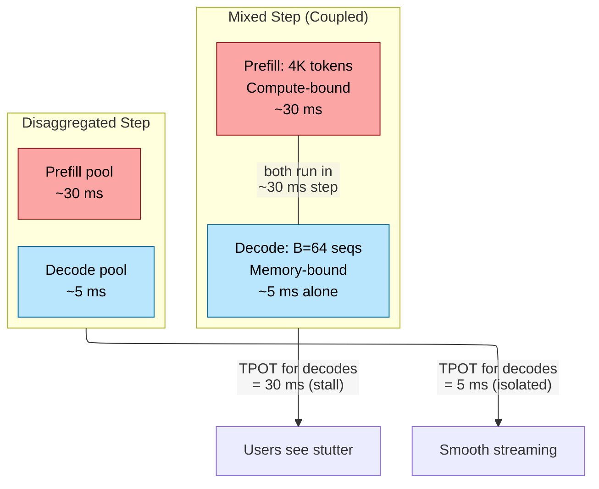
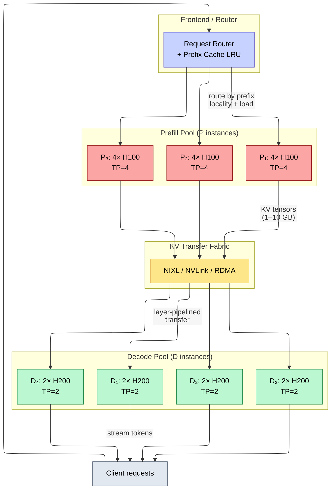
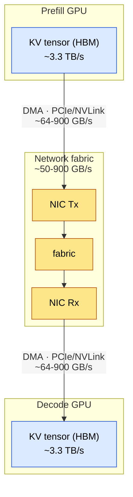
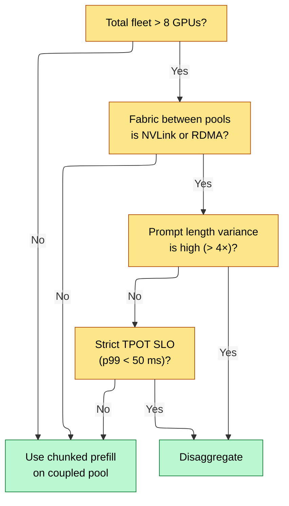

# Prefill/Decode Disaggregation — Different Rooflines, Different Hardware

> **Layer:** L8.
> **Prerequisites:** [Batching_and_Scheduling](Batching_and_Scheduling.md), [Rack_Scale_Design](../L4_Systems_and_Interconnects/Rack_Scale_Design.md).
> **Hands off to:** [Disaggregated_Serving_2025](Disaggregated_Serving_2025.md), [Production_Architecture](Production_Architecture.md).

---

## 0. Why this page exists

Every autoregressive inference request passes through two phases that sit on opposite sides of the roofline ridge point. Prefill is **compute-bound**: it processes hundreds or thousands of tokens in parallel, saturating tensor cores. Decode is **memory-bandwidth-bound**: it generates one token per step, re-reading the full model weights and the growing KV cache from HBM each time. A single GPU pool serving both phases cannot simultaneously keep tensor cores busy during decode-heavy periods *and* keep HBM bandwidth busy during prefill-heavy periods. The result is chronic underutilization of one resource or the other.

Prefill/decode disaggregation splits the two phases across **separate GPU pools**, each sized and configured for its own bottleneck. This page derives the roofline argument from first principles, describes the disaggregated architecture and KV transfer mechanics, presents sizing math with worked examples, benchmarks the throughput wins from the literature, and identifies the regimes where disaggregation helps versus where it hurts.

---

## 1. The roofline argument

### 1.1 Arithmetic intensity of each phase

Recall from [Memory_Hierarchy_and_Roofline](../L3_Microarchitecture/Memory_Hierarchy_and_Roofline.md) the roofline model: achievable performance $P = \min(\pi,\; I \cdot \beta)$, where $\pi$ is peak FLOPS, $\beta$ is peak memory bandwidth, and $I$ is arithmetic intensity (FLOP/byte).

**Prefill** processes $S$ prompt tokens through all layers in one forward pass. The dominant operation is the GEMM for each linear layer:

$$W_{\text{prefill}} = 2 \cdot N_{\text{params}} \cdot S$$

$$Q_{\text{prefill}} \approx 2 \cdot N_{\text{params}} \cdot b \quad \text{(read weights once)}$$

$$I_{\text{prefill}} = \frac{W}{Q} = \frac{S}{b}$$

For $S = 2048$ tokens, FP16 ($b = 2$): $I_{\text{prefill}} = 1024$ FLOP/byte. On an H100 with $I_{\text{ridge}} = 295$ FLOP/byte (FP16), this is well above the ridge point. Prefill is **firmly compute-bound**.

**Decode** processes exactly one new token per step, but must re-read all weights and the full KV cache:

$$W_{\text{decode}} = 2 \cdot N_{\text{params}} \cdot 1$$

$$Q_{\text{decode}} = 2 \cdot N_{\text{params}} \cdot b + \text{KV}_{\text{bytes}}(S)$$

$$I_{\text{decode}} = \frac{2 \cdot N_{\text{params}}}{2 \cdot N_{\text{params}} \cdot b + \text{KV}(S)}$$

For Llama-3-70B FP16 at $S = 4096$: $W = 140$ GFLOP, $Q \approx 141.3$ GB, $I \approx 1$ FLOP/byte. This is *two orders of magnitude* below the ridge point. Decode is **firmly memory-bandwidth-bound**.

### 1.2 The interference problem

When both phases share one GPU pool under continuous batching (see [Batching_and_Scheduling](Batching_and_Scheduling.md) section 4), a mixed step containing $K$ prefill tokens and $B$ ongoing decode sequences takes:

$$t_{\text{step}} = \max\!\left(\frac{W_{\text{prefill}}(K)}{\pi},\; \frac{Q_{\text{prefill}}(K) + Q_{\text{decode}}(B)}{\beta}\right)$$

Because prefill is compute-bound, it dominates the step time. Every decode sequence in that batch waits the full prefill duration. Users observe **TPOT spikes** when long prompts arrive — the telltale "stutter" in streaming output.



### 1.3 The disaggregation thesis

If prefill and decode have different bottleneck resources, and mixing them causes interference, then **dedicating separate hardware to each phase** lets each pool operate at its own optimal point:

- **Prefill pool**: maximize $\pi$ utilization. Use GPUs with high tensor-core throughput. Run large batches of prompt tokens. No decode sequences to stall.
- **Decode pool**: maximize $\beta$ utilization. Use GPUs with high HBM bandwidth (or more GPUs sharing the bandwidth load). No prefill bursts to interfere.

The cost is a **KV transfer** between pools after prefill completes. The entire question is whether the transfer overhead is smaller than the interference overhead it eliminates.

---

## 2. Disaggregated architecture

### 2.1 System overview



### 2.2 Request lifecycle

Every request follows five stages:

1. **Admit.** The frontend router receives the request. It consults a prefix-cache index (radix tree or LSH) to find the prefill instance $P_i$ that holds the longest matching prefix. If no match, load-balance across $P$ instances.

2. **Prefill.** $P_i$ processes the prompt (or the non-cached suffix), builds the KV cache for all layers, and produces the first output token. Prefill time $t_p \approx W_{\text{prefill}} / (\eta_p \cdot \pi)$ where $\eta_p$ is the fraction of peak FLOPS achieved (typically 0.4–0.6 on H100).

3. **Transfer KV.** The KV tensors are shipped from $P_i$ to a decode instance $D_j$. Transfer time $t_x = \text{KV\_bytes} / \beta_{\text{fabric}}$. With layer pipelining (section 4.2), much of this is hidden behind prefill compute.

4. **Decode.** $D_j$ generates tokens one at a time, streaming them to the client. Per-token time $t_d \approx (W_{\text{bytes}} + \text{KV}(S)) / (\eta_d \cdot \beta_{\text{HBM}})$ where $\eta_d \approx 0.7$–$0.85$.

5. **Release.** On EOS or max-tokens, $D_j$ frees the KV cache slot.

### 2.3 Heterogeneous hardware assignment

A key insight from Splitwise (ISCA 2024): the two pools need not use the same GPU. Prefill wants high $\pi$; decode wants high $\beta$. On the current hardware landscape:

| GPU | $\pi$ FP16 (TFLOPS) | $\beta$ HBM (TB/s) | Best role |
|-----|---------------------|---------------------|-----------|
| H100 SXM5 | 990 | 3.35 | Prefill or decode |
| H200 | 990 | 4.8 | Decode (43% more BW) |
| B200 | 2,250 | 8.0 | Prefill (2.3× more FLOPS) |
| B300 | 2,700 | 8.0 | Prefill |

A cost-optimal deployment might use B200s for prefill (maximizing throughput per dollar of compute) and H200s for decode (maximizing throughput per dollar of bandwidth). The H200 has the same FLOPS as the H100 but 43% more HBM bandwidth at similar cost, making it a better decode GPU.

---

## 3. KV transfer payload

### 3.1 Size calculation

The transfer payload is the entire prefill KV cache. For a model with $L$ layers, $H_{kv}$ KV heads, head dimension $d$, prompt length $S$, and dtype size $b$:

$$\text{KV\_bytes} = 2 \cdot S \cdot L \cdot H_{kv} \cdot d \cdot b$$

| Model | $L$ | $H_{kv}$ | $d$ | KV/tok (FP16) | $S=2K$ | $S=8K$ | $S=32K$ |
|-------|-----|-----------|-----|---------------|--------|--------|---------|
| Llama-3-8B | 32 | 8 | 128 | 128 KB | 256 MB | 1 GB | 4 GB |
| Llama-3-70B | 80 | 8 | 128 | 320 KB | 640 MB | 2.5 GB | 10 GB |
| Llama-3-405B | 126 | 8 | 128 | 504 KB | 1 GB | 4 GB | 16 GB |
| DeepSeek-V3 (MLA) | 61 | latent 512 | — | ~70 KB | 140 MB | 560 MB | 2.2 GB |

DeepSeek-V3 with Multi-head Latent Attention (MLA) compresses the KV cache by ~5–7×, reducing the transfer payload proportionally. This is one reason MLA architectures are particularly attractive for disaggregated serving.

### 3.2 Transport options and bandwidth

| Transport | Bandwidth | Latency | Scope | Use case |
|-----------|-----------|---------|-------|----------|
| NVLink P2P (intra-node) | 900 GB/s bidirectional | $< 1\;\mu\text{s}$ | Same node | P and D on same server |
| NVLink fabric (NVL72) | 1.8 TB/s aggregate per GPU | $< 5\;\mu\text{s}$ | Same rack | P and D in NVL72 rack |
| InfiniBand NDR (400G) | ~50 GB/s per port | ~5 $\mu\text{s}$ | Cross-node | Multi-node disaggregation |
| InfiniBand XDR (800G) | ~100 GB/s per port | ~5 $\mu\text{s}$ | Cross-node | Newer clusters |
| RoCE v2 (Ethernet) | 25–50 GB/s | ~10 $\mu\text{s}$ | Cross-node | Cost-sensitive |
| TCP (fallback) | 5–12 GB/s | 50–200 $\mu\text{s}$ | Anywhere | Development only |

### 3.3 Transfer time budget

For a Llama-3-70B request with $S = 4096$ prompt tokens, KV payload $\approx 1.25$ GB:

| Transport | Transfer time | As fraction of TTFT (200 ms) |
|-----------|---------------|-------------------------------|
| NVLink P2P | 1.4 ms | 0.7% |
| NVL72 fabric | 0.7 ms | 0.4% |
| IB NDR | 25 ms | 12.5% |
| IB XDR | 12.5 ms | 6.3% |
| TCP | 100–250 ms | 50–125% (exceeds budget) |

NVLink intra-node and NVL72 transfers are nearly free relative to TTFT. InfiniBand NDR is manageable but consumes a significant fraction of the TTFT budget. TCP-based transfer is a non-starter for disaggregation.

---

## 4. KV transfer engineering

### 4.1 The transfer path: GPU to GPU

The end-to-end KV transfer path traverses: **GPU $\to$ NIC $\to$ network $\to$ NIC $\to$ GPU**. Each segment has distinct bandwidth and latency characteristics:

**Step-by-step data flow (RDMA path):**



1. **GPU HBM $\to$ NIC DMA**: the KV tensor data is read from GPU HBM via PCIe (64 GB/s) or NVLink (900 GB/s) to the NIC's transmit buffer. With GPUDirect RDMA, the NIC reads directly from GPU-registered memory -- no CPU involvement.
2. **Fabric traversal**: the NIC transmits the data across InfiniBand or RoCE fabric. Bandwidth is determined by the link speed (50--400 GB/s per NIC port).
3. **NIC $\to$ GPU HBM DMA**: the receiving NIC writes the data directly into the decode GPU's HBM via GPUDirect RDMA.

**Without GPUDirect RDMA (fallback path):**
```ascii-graph
GPU_P --PCIe--> CPU_P --socket/network--> CPU_D --PCIe--> GPU_D
```
This adds two CPU memory copies and doubles the latency. Only used when GPUDirect is not available (older GPUs, misconfigured drivers).

**Overlapping transfer with compute.** The key optimization is to pipeline KV transfer with prefill computation so the transfer is not on the critical path:

- While the prefill GPU computes layer $l+1$, the NIC simultaneously transfers layer $l$'s KV.
- The NIC transfer uses a separate DMA engine that does not consume GPU compute units.
- On the decode side, the GPU begins processing layer $l$ as soon as its KV arrives, without waiting for later layers.
- This creates a three-stage pipeline per layer: **compute prefill $l+1$** $\parallel$ **transfer KV $l$** $\parallel$ **decode layer $l-k$** (for some lag $k$).

Effective transfer overhead is the **unhidden tail**: the last layer's KV cannot be overlapped with any subsequent prefill compute because prefill is done. This tail is $t_{\text{xfer, one layer}}$, which for 70B is $\sim 0.02$ ms on NVLink -- negligible.

**Bandwidth calculation for real-time transfer.** For the transfer to not dominate TTFT, the transfer time must be a small fraction of the prefill time:

$$\frac{\text{KV\_bytes}}{\beta_{\text{fabric}}} \le f \cdot t_{\text{prefill}}$$

where $f$ is the acceptable fraction (typically 0.1--0.2). For 70B at $S = 4096$:

| Fabric | $\beta$ | KV transfer time | Prefill time | Fraction | Feasible? |
|--------|---------|------------------|--------------|----------|-----------|
| NVLink P2P | 900 GB/s | 1.4 ms | 200 ms | 0.7% | Yes |
| IB NDR (400G) | 50 GB/s | 25 ms | 200 ms | 12.5% | Yes (with pipelining, nearly zero) |
| RoCE 200G | 25 GB/s | 50 ms | 200 ms | 25% | Marginal (pipelining helps) |
| TCP 100G | 10 GB/s | 125 ms | 200 ms | 62.5% | No |

### 4.2 NIXL (NVIDIA Inference Xfer Library)

NIXL provides a unified API for GPU-to-GPU, GPU-to-CPU, and GPU-to-storage data movement. It selects the optimal transport at runtime (NVLink, GPUDirect RDMA, PCIe bounce-buffer) based on source/destination topology. Used by NVIDIA Dynamo and increasingly adopted by other frameworks. Key benefits:

- **Topology-aware routing**: detects whether source and destination share an NVLink domain, are on the same node via PCIe, or require fabric traversal.
- **Zero-copy path**: when GPUDirect RDMA is available, data stays in GPU memory end-to-end: $\text{GPU}_P \to \text{NIC}_P \to \text{fabric} \to \text{NIC}_D \to \text{GPU}_D$.
- **Fallback path**: when GPUDirect is not configured, stages through pinned host memory with minimal copies.

### 4.3 Layer-pipelined transfer

Naive transfer waits for all $L$ layers to complete prefill, then transfers the entire KV in one shot. Layer pipelining overlaps transfer with compute:

```mermaid
%%{init: {"flowchart": {"defaultRenderer": "elk", "nodeSpacing": 60, "rankSpacing": 60, "htmlLabels": false}}}%%
gantt
    title Layer-pipelined KV transfer (4-layer example)
    dateFormat X
    axisFormat %L

    section Prefill GPU
    Prefill Layer 0           :p0, 0, 10
    Prefill Layer 1           :p1, 10, 20
    Prefill Layer 2           :p2, 20, 30
    Prefill Layer 3           :p3, 30, 40

    section Fabric
    Transfer KV Layer 0       :x0, 10, 12
    Transfer KV Layer 1       :x1, 20, 22
    Transfer KV Layer 2       :x2, 30, 32
    Transfer KV Layer 3       :x3, 40, 42

    section Decode GPU
    Decode Layer 0            :d0, 12, 14
    Decode Layer 1            :d1, 22, 24
    Decode Layer 2            :d2, 32, 34
    Decode Layer 3            :d3, 42, 44
```



Each layer's KV is transferred as soon as the prefill of that layer completes. The decode side begins its forward pass on layer $l$ as soon as the KV for layer $l$ arrives. The transfer of layer $l$ is fully hidden behind the prefill compute of layer $l+1$. The **visible transfer latency** reduces to:

$$t_{\text{visible}} \approx \max(0,\; t_{\text{xfer, per layer}} - t_{\text{prefill, per layer}})$$

On NVLink where per-layer transfer ($\sim 0.5$ ms) is much faster than per-layer prefill ($\sim 5$ ms), visible latency is zero. On InfiniBand, some tail layers may not be fully hidden.

**Memory management at the decode side.** When KV blocks arrive at the decode worker:

1. The decode worker's block manager **pre-allocates** physical blocks from its local free list to match the incoming KV. The number of blocks needed is $\lceil S / B_s \rceil$, communicated via the transfer metadata.
2. Incoming KV data is **DMA'd directly** into the pre-allocated physical block slots in the decode GPU's KV tensor. No intermediate buffering on the decode GPU.
3. The decode worker builds a **local block table** mapping the sequence's logical blocks to its own physical block IDs. These IDs differ from the prefill worker's IDs because each worker has an independent block pool.
4. Once all layers for a block are received, that block is marked as **valid** in the block table. The decode forward pass can begin using blocks as soon as all layers for that block are populated.
5. If the decode worker's free list is exhausted, it signals backpressure to the router, which stops routing new requests to this worker until blocks free up.

### 4.4 Tensor-parallel layout translation

Prefill and decode pools may use different tensor-parallelism (TP) degrees. If $P$ uses $\text{TP}=4$ and $D$ uses $\text{TP}=2$, the KV is sharded differently:

- Each prefill GPU holds $H_{kv}/4$ heads.
- Each decode GPU needs $H_{kv}/2$ heads.

The transfer must **reshape** the KV from the source TP layout to the destination. Two approaches:

1. **Gather-then-scatter**: prefill side runs an all-gather to reconstruct full KV per layer, then each decode GPU pulls its shard. Simple but temporarily uses more memory on the prefill side.
2. **Manifest-based scatter-gather**: build a logical map from (layer, head) to (source GPU, destination GPU). Each destination GPU pulls its needed shards directly from the relevant source GPUs. No all-gather, optimal bandwidth, but more complex routing.

Production systems (Dynamo, llm-d) use approach 2. The manifest is a small data structure (a few KB) exchanged out-of-band before the transfer begins.

### 4.5 GPUDirect RDMA path

When the KV transfer crosses node boundaries, the ideal path avoids CPU involvement entirely:

$$\text{GPU}_P \to \text{NIC}_P \xrightarrow{\text{fabric}} \text{NIC}_D \to \text{GPU}_D$$

This requires:
- GPUs with BAR1 memory registered for RDMA (all modern data-center GPUs).
- NICs supporting GPUDirect RDMA (ConnectX-7, BlueField-3, Skyway).
- NIXL or equivalent to register GPU memory regions with the NIC.

Without GPUDirect, the path stages through host memory:

$$\text{GPU}_P \xrightarrow{\text{PCIe}} \text{CPU RAM}_P \xrightarrow{\text{socket/fabric}} \text{CPU RAM}_D \xrightarrow{\text{PCIe}} \text{GPU}_D$$

This doubles the latency and consumes host memory bandwidth, which is a scarce resource when many transfers run concurrently.

---

## 5. Pool sizing math

### 5.1 Prefill pool

Let the aggregate request rate be $\lambda$ requests/second, average prompt length $S_p$ tokens, model parameter count $N$.

Total prefill FLOPS per second:

$$\Phi_p = \lambda \cdot 2 \cdot N \cdot S_p$$

Number of prefill GPUs:

$$N_p = \frac{\Phi_p}{\eta_p \cdot \pi_{\text{GPU}}}$$

where $\eta_p$ is the achieved fraction of peak (typically 0.4–0.6 due to attention softmax, layernorm, and other non-GEMM overhead).

### 5.2 Decode pool

Total decode tokens per second: $\lambda \cdot S_d$ (where $S_d$ is average output length).

Bytes moved per decode step per sequence: $W_{\text{bytes}} + \text{KV}(S)$, where $S$ grows from $S_p$ to $S_p + S_d$.

Average bytes per decode token across the sequence lifetime:

$$\bar{Q}_d = W_{\text{bytes}} + \text{KV}_{\text{per\_tok}} \cdot \left(S_p + \frac{S_d}{2}\right)$$

Aggregate bytes per second: $\Phi_d = \lambda \cdot S_d \cdot \bar{Q}_d$.

Number of decode GPUs:

$$N_d = \frac{\Phi_d}{\eta_d \cdot \beta_{\text{GPU}}}$$

where $\eta_d$ is the achieved fraction of peak HBM bandwidth (typically 0.70–0.85).

### 5.3 Worked example: Llama-3-70B on H100

Parameters: $\lambda = 200$ req/s, $S_p = 2000$, $S_d = 300$, $W = 140$ GB, $\text{KV}_{\text{per\_tok}} = 320$ KB, $b = 2$ (FP16).

**Prefill pool:**

$$\Phi_p = 200 \times 2 \times 70 \times 10^9 \times 2000 = 5.6 \times 10^{16} \text{ FLOPS}$$

Per H100 FP16 peak: $\pi = 990$ TFLOPS. At $\eta_p = 0.5$:

$$N_p = \frac{5.6 \times 10^{16}}{0.5 \times 990 \times 10^{12}} = \frac{56{,}000}{495} \approx 113 \text{ GPUs}$$

**Decode pool:**

$$\bar{Q}_d = 140 + 0.000320 \times \left(2000 + 150\right) = 140 + 0.688 \approx 140.7 \text{ GB}$$

$$\Phi_d = 200 \times 300 \times 140.7 = 8.44 \times 10^{12} \text{ B/s} = 8.44 \text{ TB/s}$$

Per H100 HBM BW: $\beta = 3.35$ TB/s. At $\eta_d = 0.75$:

$$N_d = \frac{8.44}{0.75 \times 3.35} = \frac{8.44}{2.51} \approx 3.4 \text{ GPUs} \approx 4 \text{ GPUs}$$

**Ratio:** $N_p : N_d \approx 28 : 1$. This workload is overwhelmingly prefill-heavy. Short-prompt, long-output workloads (e.g., coding assistants, reasoning models with long chain-of-thought) flip this ratio dramatically.

### 5.4 Worked example: reasoning workload, same model

Parameters: $\lambda = 50$ req/s, $S_p = 500$, $S_d = 8000$ (reasoning model).

**Prefill pool:**

$$\Phi_p = 50 \times 2 \times 70 \times 10^9 \times 500 = 3.5 \times 10^{15} \text{ FLOPS}$$

$$N_p = \frac{3{,}500}{495} \approx 7 \text{ GPUs}$$

**Decode pool:**

$$\bar{Q}_d = 140 + 0.000320 \times (500 + 4000) = 140 + 1.44 = 141.4 \text{ GB}$$

$$\Phi_d = 50 \times 8000 \times 141.4 = 5.66 \times 10^{13} \text{ B/s} = 56.6 \text{ TB/s}$$

$$N_d = \frac{56.6}{2.51} \approx 22.5 \approx 23 \text{ GPUs}$$

**Ratio:** $N_p : N_d \approx 1 : 3$. Decode dominates. This is the regime where H200 (or B200 with its 8 TB/s) shines for the decode pool.

**The point**: the ratio $N_p / N_d$ varies by over 80× between workload types. A coupled system must provision for the max of both, wasting resources. Disaggregation lets each pool scale independently.

---

## 6. Benchmarks and throughput results

### 6.1 Splitwise (ISCA 2024)

Microsoft Research compared disaggregated serving against a coupled baseline on Llama-2-70B:

| Metric | Coupled | Disaggregated (homogeneous) | Disaggregated (heterogeneous) |
|--------|---------|---------------------------|-------------------------------|
| Throughput (tok/s/GPU) | 210 | 320 (+52%) | 380 (+81%) |
| SLO attainment (TTFT < 500ms) | 87% | 99% | 99% |
| SLO attainment (TPOT < 50ms) | 78% | 98% | 98% |
| GPUs for same throughput | 64 | 44 | 36 |

The heterogeneous config used A100-80GB for prefill and cheaper A100-40GB for decode, exploiting the fact that decode does not need high tensor-core throughput.

### 6.2 DistServe (OSDI 2024)

DistServe evaluated on ShareGPT and LMSYS workload traces with Llama-2-70B on 8×A100 nodes:

| Metric | Coupled (vLLM) | DistServe |
|--------|----------------|-----------|
| Goodput (req/s at SLO) | 1.8 | 4.4 (+144%) |
| TTFT p99 | 2,100 ms | 480 ms |
| TPOT p99 | 180 ms | 42 ms |
| KV transfer overhead | 0 ms (none) | 8–15 ms |

The 8–15 ms KV transfer overhead is small relative to the 200–500 ms prefill time and eliminates the interference that causes the coupled system's high tail latency.

### 6.3 Mooncake (Moonshot AI, 2024)

Production deployment serving a large-scale chat product:

- **Cluster**: hundreds of GPUs across prefill and decode pools, connected via InfiniBand.
- **Prefix cache hit rate**: 80%+ at cluster scale (global KV pool with radix-tree indexing).
- **Effective throughput**: 1.5–2× improvement vs per-node isolated serving, primarily from prefix-cache reuse and interference elimination.
- **KV transfer**: predominantly IB NDR, with layer pipelining hiding ~70% of transfer latency.

### 6.4 Summary of tradeoffs

| Aspect | Coupled + chunked prefill | Disaggregated |
|--------|--------------------------|---------------|
| Hardware cost | Minimum GPUs | More total GPUs but higher utilization per GPU |
| TTFT | Good (chunking adds slight overhead) | Good (dedicated prefill resources) |
| TPOT | Degrades under prefill bursts | Stable (isolated decode pool) |
| Throughput per GPU | Moderate (interference losses) | High (specialized utilization) |
| Complexity | Low | High (routing, transfer, pool management) |
| Minimum viable scale | 1 GPU | 4+ GPUs (need at least 1 prefill + 1 decode instance) |
| SLO predictability | Moderate | High |

---

## 7. When disaggregation helps and when it hurts

### 7.1 Disaggregation wins

- **Bursty prompt-length distributions**: when some requests have 32K-token prompts and others have 100-token prompts, the interference is severe. Disaggregation isolates the damage.
- **Strict SLO requirements**: production serving with p99 TPOT < 50 ms benefits from eliminating interference.
- **Scale**: above ~8 GPUs total, the overhead of disaggregation (routing, transfer) is amortized.
- **Heterogeneous hardware**: when you can match GPUs to phase bottlenecks (high-$\pi$ for prefill, high-$\beta$ for decode), the cost-per-token drops.
- **Long-context prompts (128K+)**: prefill takes seconds. Interleaving with decode in a coupled system is devastating.

### 7.2 Disaggregation hurts (or does not help)

- **Small fleets (< 4 GPUs)**: the routing and transfer overhead exceeds the utilization gain. Chunked prefill on a single pool is better.
- **Uniform, short prompts**: when all prompts are < 512 tokens, chunked prefill handles interference well. The disaggregation overhead (extra routing hop, KV transfer) is pure cost.
- **Poor network fabric**: if the only transport between pools is TCP over Ethernet, the transfer time destroys TTFT. Disaggregation requires RDMA or NVLink.
- **Frequent model swaps**: if you serve many different models and swap frequently, maintaining separate prefill and decode pools per model is operationally complex. A coupled pool with chunked prefill is simpler.
- **Extremely low latency (sub-20ms TTFT)**: the KV transfer adds a fixed overhead of 0.5–5 ms that may be unacceptable for real-time applications with very short prompts where prefill itself takes < 10 ms.

### 7.3 Decision flowchart



---

## 8. Routing and locality

### 8.1 Prefill-side prefix caching

The frontend router maintains an index mapping prompt prefixes to prefill instance IDs. When a request arrives, the router:

1. Hashes the prompt prefix (or traverses a radix tree).
2. Finds the longest cached prefix and the instance holding it.
3. Routes to that instance, which skips prefill for the cached portion.

Cache data structures:
- **Radix tree**: maps variable-length token sequences to instance IDs. Supports incremental matching. Used in vLLM's APC (Automatic Prefix Caching).
- **Locality-sensitive hashing (LSH)**: hash the prompt to a bucket, route all requests in that bucket to the same instance. Simpler but less precise.

Cache hit rates: 30–50% on single-instance caches for chat workloads; 80%+ at cluster scale with a shared global index (Mooncake approach).

### 8.2 Decode-side binding

Each sequence is bound to a decode instance for its entire lifetime. Binding is static after the initial KV transfer because:

- KV migration between decode instances is expensive (full re-transfer).
- The decode pool is homogeneous, so any instance is equally capable.
- Load imbalance is handled by the router assigning new sequences to the least-loaded decode instance.

### 8.3 Load balancing

The router tracks per-instance metrics:

- **Prefill instances**: queue depth, prefix-cache occupancy, estimated prefill time for the current request.
- **Decode instances**: active sequences, KV memory utilization, current TPOT.

Routing policy: weighted least-loaded, where the weight combines queue depth with prefix-cache affinity. A request that hits a 3K-token prefix cache on instance $P_i$ is routed there even if $P_i$ has a slightly longer queue, because skipping 3K tokens of prefill saves more time than waiting in a shorter queue elsewhere.

**How many prefill workers vs decode workers.** The ratio $N_p : N_d$ is determined by the workload's compute-to-bandwidth ratio:

$$\frac{N_p}{N_d} = \frac{\lambda \cdot 2 N \cdot S_p / (\eta_p \cdot \pi)}{\lambda \cdot S_d \cdot \bar{Q}_d / (\eta_d \cdot \beta)} = \frac{2 N \cdot S_p \cdot \eta_d \cdot \beta}{S_d \cdot \bar{Q}_d \cdot \eta_p \cdot \pi}$$

Worked for Llama-3-70B chat ($S_p=2000$, $S_d=300$) on H100: $N_p/N_d \approx 28/1$ (prefill-heavy). For reasoning ($S_p=500$, $S_d=8000$): $N_p/N_d \approx 1/3$ (decode-heavy). This ratio can shift by 80$\times$ between workloads, which is precisely why disaggregation helps -- a coupled system must provision for the max of both phases.

**Independent scaling triggers.** Each pool scales based on its own SLO metric:

| Pool | Scaling metric | Scale-up trigger | Scale-down trigger |
|------|---------------|-----------------|-------------------|
| Prefill | TTFT p99 | TTFT p99 > 80% of SLO for > 60s | TTFT p99 < 40% of SLO for > 5 min |
| Decode | TPOT p99 + KV occupancy | TPOT p99 > 80% of SLO or KV occupancy > 90% | TPOT p99 < 40% of SLO and KV occupancy < 50% for > 5 min |

The pools scale independently because their bottlenecks are independent. A burst of long prompts triggers prefill scale-up without affecting decode pool sizing. A burst of long outputs (reasoning chain-of-thought) triggers decode scale-up without affecting prefill.

**Routing logic.** The router applies a two-stage decision:

1. **Prefill routing**: compute prefix-cache affinity score for each prefill instance. Score = (cached\_tokens / prompt\_tokens) $\times$ weight\_affinity + (1 - queue\_depth / max\_queue) $\times$ weight\_load. Route to the highest-scoring instance. Typical weights: `weight_affinity = 0.7`, `weight_load = 0.3`. The high affinity weight ensures that prefix-cache hits are prioritized over load balancing.

2. **Decode binding**: after prefill completes and KV is transferred, the sequence is bound to a decode instance for its lifetime. Selection: least-loaded decode instance (fewest active sequences). Binding is static because KV migration between decode instances is expensive.

**What triggers adding/removing workers.** Production systems use horizontal pod autoscaling (HPA) with custom metrics:

- **Add prefill worker**: when the average prefill queue depth across all instances exceeds a threshold (e.g., 5 queued requests) for more than 60 seconds, a new prefill pod is scheduled. The pod loads model weights (~30--120 seconds), warms its prefix cache, and begins accepting requests.
- **Remove prefill worker**: when an instance has been idle (zero requests in queue, no active prefills) for more than 5 minutes. The instance drains in-flight requests, then terminates.
- **Add decode worker**: when aggregate decode KV occupancy exceeds 85% or TPOT p99 exceeds 80% of SLO for > 60 seconds. A new decode pod is scheduled, loaded, and begins accepting KV transfers.
- **Remove decode worker**: when a decode instance's active sequence count drops below a minimum (e.g., 5) for > 5 minutes, and aggregate decode KV occupancy is below 40%. The instance finishes in-flight sequences (no new bindings), then terminates.

### 8.4 Batch size implications for each phase

Disaggregation allows each phase to operate at its optimal batch size, which differ by an order of magnitude.

**Prefill: compute-bound, small batch of large prompts.** Prefill saturates tensor cores. A single 4K-token prompt at 50% tensor-core utilization uses:

$$\frac{2 \times 70 \times 10^9 \times 4096}{0.5 \times 990 \times 10^{12}} \approx 1.16 \text{ seconds of compute}$$

The GPU is fully utilized during this time. Batching multiple prefills helps only when individual prompts are short (< 512 tokens). For long prompts, a batch of 1--4 large requests is sufficient to saturate compute. The optimal prefill batch size $B_p^*$ is the smallest $B$ where tensor-core utilization exceeds 70%:

$$B_p^* \approx \max\left(1,\; \left\lceil \frac{0.7 \cdot \pi}{2 N \cdot \bar{S}_p}\right\rceil \right)$$

For 70B on H100 with $\bar{S}_p = 2000$: $B_p^* = \lceil 0.7 \times 990 \times 10^{12} / (2 \times 70 \times 10^9 \times 2000) \rceil = \lceil 2.5 \rceil = 3$ requests. Three 2K-token prompts saturate the GPU.

**Decode: memory-bandwidth-bound, large batch to amortize weight reads.** Each decode step reads 140 GB of weights regardless of batch size. Adding sequences costs only KV read bandwidth. The optimal decode batch size $B_d^*$ maximizes throughput subject to the TPOT SLO:

$$B_d^* = \frac{T_{\text{SLO}} - W_{\text{bytes}} / \beta}{\bar{S} \cdot c_{\text{token}} / \beta}$$

For 70B on H100 ($T_{\text{SLO}} = 50$ ms, $W = 140$ GB, $\beta = 3.35$ TB/s, $\bar{S} = 4096$, $c = 320$ KB):

$$B_d^* = \frac{0.050 - 140/3350}{4096 \times 0.000320 / 3350} = \frac{0.050 - 0.0418}{0.000391} \approx 21$$

But this is bandwidth-limited. The actual binding constraint is KV capacity: $B_{\max} = M_{\text{KV}} / (\bar{S} \cdot c_{\text{token}})$. With 85 GB KV pool: $B_{\max} = 85 \times 10^9 / (4096 \times 327680) \approx 63$.

The key point: **prefill wants batch 1--4; decode wants batch 20--60+**. In a coupled system, the batch must accommodate both simultaneously, resulting in either under-utilized tensor cores (small batch) or KV capacity exhaustion (large batch). Disaggregation lets prefill run at $B_p^* = 3$ while decode runs at $B_d^* = 60$, each at its own optimum.

---

## 9. Failure modes and recovery

### 9.1 Prefill instance failure

If a prefill instance $P_i$ fails during prefill of request $R$:

- The request has not produced any output tokens yet. No state is lost from the client's perspective.
- The frontend detects the failure (health check timeout) and retries $R$ on a different prefill instance.
- If $P_i$ held prefix-cache entries, those are lost. Hit rate temporarily drops until the cache warms up on surviving instances.

This is the **cleanest failure mode** — idempotent retry, no client-visible impact beyond TTFT.

### 9.2 Decode instance failure

If a decode instance $D_j$ fails mid-generation:

- All active sequences on $D_j$ lose their KV caches. The client sees a truncated response.
- Recovery requires re-prefilling from the original prompt plus all previously emitted tokens.
- Options:
  - **Accept the loss**: report an error to the client, let it retry. Most production systems do this.
  - **Buddy replication**: each decode instance replicates its KV to a buddy. Doubles decode capacity cost. Almost never worth it.
  - **Checkpoint KV to CPU/NVMe**: periodically snapshot KV to cheaper storage. Recovery time = restore + recompute delta. Feasible for long-running sequences (e.g., multi-turn sessions).

### 9.3 Network partition

If the fabric between prefill and decode pools fails:

- In-flight transfers are lost. Sequences that completed prefill but haven't transferred KV must be re-prefilled.
- The frontend marks unreachable instances as unhealthy and stops routing to them.
- If one pool is partitioned but the other is healthy, the healthy pool can serve its phase only (e.g., prefill pool processes prompts but cannot hand off; decode pool finishes in-flight sequences but cannot accept new ones).

### 9.4 Backpressure and flow control

When decode instances are saturated (KV memory full, TPOT approaching SLO), the transfer fabric must apply backpressure:

- Decode instances advertise available KV slots to the router.
- The router stops admitting new requests when aggregate available decode slots reach zero.
- In-flight KV transfers that arrive at a saturated decode instance are queued in a small buffer (typically 2–4 requests worth of KV in GPU memory). If the buffer overflows, the prefill instance is notified and the request is re-queued.

---

## 10. Interaction with other serving techniques

### 10.1 Speculative decoding

Speculative decoding (see [Speculative_Decoding](Speculative_Decoding.md)) runs a cheap draft model to predict K future tokens, then verifies in a single decode step. In a disaggregated system:

- The decode pool hosts both the draft model and the verifier model.
- Disaggregation does not change speculative decoding mechanics — it simply removes the interference that would otherwise disrupt decode timing.
- The draft model's small size means it fits comfortably on the decode GPU alongside the main model's KV cache.

### 10.2 Chunked prefill

Chunked prefill (Sarathi-Serve) and disaggregation are complementary, not competing:

- In a coupled system, chunked prefill mitigates interference by breaking long prompts into small pieces.
- In a disaggregated system, the prefill pool may still use chunked prefill to improve batching efficiency — multiple requests' prompt chunks can be batched together in the prefill pool.
- The decode pool never sees prefill chunks; it only receives complete KV caches.

Most production systems combine both: disaggregated architecture with chunked prefill inside the prefill pool.

### 10.3 Quantization

Weight quantization (FP16 $\to$ FP8 $\to$ INT4) affects the two pools differently:

- **Prefill pool**: quantization reduces the weight-read traffic and may speed up GEMM via FP8 tensor cores. The benefit is moderate (prefill was already compute-bound).
- **Decode pool**: quantization reduces $W_{\text{bytes}}$ in the decode bandwidth equation, directly increasing tokens/second. This is a major win: FP8 weights cut decode per-step bytes nearly in half, nearly doubling throughput.

KV cache quantization (KV cache in FP8 instead of FP16) reduces both the transfer payload and the decode bandwidth consumption. The transfer payload drops 2×, and decode bytes per step drop proportionally.

### 10.4 Expert parallelism (MoE models)

For mixture-of-experts models (see [Modern_MoE](../L6_Algorithms_and_Models/Modern_MoE.md)), disaggregation interacts with expert parallelism (EP):

- Prefill pool: runs all experts (or the activated subset) for the prompt. EP all-to-all communication is internal to the prefill pool.
- Decode pool: runs the activated experts per token. EP all-to-all is internal to the decode pool.
- KV transfer is unchanged — it is the attention KV, not the expert weights.

DeepSeek-V3 (671B parameters, 256 routed experts, MLA) is a prime candidate for disaggregation: MLA keeps KV transfer small, and the compute-heavy expert dispatch in prefill benefits from a dedicated high-$\pi$ pool.

---

## 11. SLO accounting with transfer overhead

TTFT in a disaggregated system decomposes as:

$$\text{TTFT} = t_{\text{queue}} + t_{\text{prefill}} + t_{\text{transfer}} + t_{\text{first\_decode}}$$

where $t_{\text{transfer}}$ with layer pipelining is approximately:

$$t_{\text{transfer}} \approx \max\!\left(0,\; \frac{\text{KV}_{\text{bytes}}}{\beta_{\text{fabric}}} - t_{\text{prefill}} \cdot \frac{L - 1}{L}\right)$$

The $(L-1)/L$ factor accounts for the overlap: $L-1$ layers' worth of transfer is hidden behind prefill of subsequent layers. Only the last layer's transfer adds to the critical path (plus any fabric contention).

For the Llama-3-70B example with $S_p = 4096$, $L = 80$, KV = 1.25 GB, on NVLink ($\beta = 900$ GB/s):

$$t_{\text{transfer}} = \max\!\left(0,\; \frac{1.25 \times 10^9}{900 \times 10^9} - 200\text{ms} \times \frac{79}{80}\right) = \max(0,\; 1.4\text{ms} - 197.5\text{ms}) = 0$$

Fully hidden. On IB NDR ($\beta = 50$ GB/s):

$$t_{\text{transfer}} = \max\!\left(0,\; 25\text{ms} - 197.5\text{ms}\right) = 0$$

Still fully hidden at this prompt length. For shorter prompts ($S_p = 256$, $t_{\text{prefill}} \approx 15$ ms):

$$t_{\text{transfer, IB}} = \max\!\left(0,\; 1.25\text{ms} \times \frac{256}{4096} - 15\text{ms} \times \frac{79}{80}\right) = \max(0,\; 0.08\text{ms} - 14.8\text{ms}) = 0$$

Even with short prompts on IB, the layer-pipelined transfer is hidden. The only scenario where transfer adds meaningfully to TTFT is very short prompts on slow fabrics without pipelining.

---

## 12. Common pitfalls

**Ignoring transfer time in SLO budgets.** The KV transfer steals from the TTFT budget. Always account for it, especially on InfiniBand. Layer pipelining hides most of it, but tail layers and fabric contention can add 5–15 ms.

**Mismatched TP without resharding.** If prefill uses TP=8 and decode uses TP=2, the KV is split across 8 source GPUs but needs to land on 2 destination GPUs. Without explicit resharding logic (manifest-based scatter-gather), the transfer silently falls back to all-gather-then-scatter, wasting bandwidth and memory.

**Static pool sizing.** Traffic patterns shift between prompt-heavy (morning chat) and decode-heavy (overnight batch reasoning). Static $N_p / N_d$ ratios waste one pool during off-peak. Use autoscaling tied to per-pool SLO attainment.

**TCP between pools.** Disaggregation's win comes from eliminating interference that costs 20–50 ms per prefill burst. If the KV transfer itself takes 100+ ms over TCP, you've traded one source of latency for a worse one.

**Prefix cache fragmentation.** If prefill instances do not share prefix-cache state, a request that hits on one instance is routed there even when it is overloaded, while other instances sit idle. Either replicate hot prefixes across instances or use a global index.

**Neglecting decode-pool backpressure.** If prefill instances pump KV into the fabric faster than decode instances can absorb it, the fabric buffers overflow and requests are dropped. Always advertise decode capacity upstream.

**Overlooking KV cache quantization opportunity.** FP8 KV cache halves the transfer payload and decode bandwidth consumption. Not using it in a disaggregated system leaves 2× decode throughput on the table.

---

## 13. Comparison: coupled vs. chunked-prefill vs. disaggregated

| Dimension | Coupled | Coupled + chunked prefill | Disaggregated |
|-----------|---------|---------------------------|---------------|
| GPU count (fixed throughput) | Highest (oversized for both phases) | Moderate | Lowest (right-sized per phase) |
| TTFT | Baseline | Slightly worse (chunk overhead) | Same or better (dedicated resources) |
| TPOT stability | Poor (spikes on long prompts) | Good | Best (no interference) |
| Throughput per GPU | Low (50–65% utilization) | Moderate (65–80%) | High (80–95%) |
| Operational complexity | Minimal | Low | High (2 pool types, routing, transfer) |
| Minimum viable deployment | 1 GPU | 1 GPU | 4+ GPUs |
| Cost per token (large fleet) | Baseline | −20 to −30% | −30 to −50% |
| Failure domains | 1 (GPU failure) | 1 | 3+ (prefill pool, decode pool, fabric) |
| Suitable workloads | Uniform, short prompts | Mixed-length, moderate burst | Bursty, long prompts, strict SLOs |

---

## 14. Common interview questions

**Q: Why does prefill/decode disaggregation improve throughput?**
A: Prefill is compute-bound (arithmetic intensity above the roofline ridge point), decode is memory-bandwidth-bound (arithmetic intensity far below). On a single pool, mixing them wastes tensor cores during decode and stalls decodes during prefill. Separate pools let each operate at its own optimum.

**Q: What is the cost of disaggregation?**
A: KV transfer latency (0.5–25 ms depending on fabric), routing complexity, two capacity-planning problems instead of one, more failure domains, and a minimum viable scale of ~4 GPUs. The benefit must exceed these costs, which it does at scale with bursty workloads.

**Q: How do you size the prefill and decode pools?**
A: Prefill: $\lambda \cdot 2N \cdot S_p / (\eta_p \cdot \pi)$. Decode: $\lambda \cdot S_d \cdot \bar{Q}_d / (\eta_d \cdot \beta)$. The ratio depends entirely on the workload: short-prompt long-output (reasoning) is decode-heavy; long-prompt short-output (RAG) is prefill-heavy.

**Q: What is NIXL?**
A: NVIDIA Inference Xfer Library. A unified API for GPU-to-GPU/CPU/storage data movement that selects the optimal transport (NVLink, GPUDirect RDMA, PCIe) at runtime. Used to ship KV between pools without per-transport code.

**Q: How does layer-pipelined KV transfer work?**
A: Transfer each layer's KV to the decode side as soon as prefill of that layer completes, overlapping transfer of layer $l$ with compute of layer $l+1$. The decoder starts its forward pass as each layer's KV arrives, hiding nearly all transfer latency behind prefill compute.

**Q: When would you NOT disaggregate?**
A: Small fleets (< 4 GPUs), uniform short prompts (chunked prefill suffices), poor network fabric (TCP only), or applications requiring sub-10ms TTFT where even 1 ms of transfer overhead is unacceptable.

**Q: How does disaggregation interact with speculative decoding?**
A: Orthogonally. The decode pool runs both draft and verifier models. Disaggregation removes prefill interference from the decode pool but does not change speculative decoding mechanics. They compose well.

**Q: What happens when a decode instance fails mid-generation?**
A: KV is lost. The client sees a truncated response. Recovery requires re-prefilling from the original prompt. Most production systems accept this loss rate and rely on client retries. Buddy replication doubles cost and is rarely justified.

**Q: How do you maintain prefix cache hit rate across a prefill pool?**
A: Affinity routing (hash the prefix to a fixed instance), replicate hot prefixes across instances, or use a global KV pool (Mooncake approach). Tradeoff: simplicity vs. hit rate vs. memory overhead.

**Q: What does Splitwise propose?**
A: A research design (ISCA 2024) showing that disaggregated prefill/decode across heterogeneous GPUs (high-$\pi$ for prefill, high-$\beta$ or cheaper for decode) reduces cost-per-token by 1.4–1.8×. The key insight is matching GPU capabilities to phase bottlenecks.

---

## 15. Numbers to Memorize

| Quantity | Value | Why it matters |
|---|---|---|
| Decode arithmetic intensity | ~1 FLOP/byte — ~2 orders below ridge | decode is memory-bound; prefill is compute-bound |
| Coupled step (4K prefill + B=64 decode) | prefill ~30 ms vs decode ~5 ms alone | the prefill stalls every decode in the step |
| Disaggregated decode TPOT | ~5 ms (isolated) vs ~30 ms coupled | ~**6×** smoother streaming — the core win |
| Pool hardware split | prefill on compute-rich (H100), decode on BW-rich (H200) | match silicon to each phase's bottleneck |
| Example pool ratio | 3 prefill (4×H100, TP4) : 3 decode (2×H200, TP2) | sized to traffic, not 1:1 |
| KV transfer payload | full per-layer K,V for the prompt, prefill→decode | the price of disaggregation |
| KV transfer medium | NVLink (intra-node) / IB or RDMA (cross-node) | transfer time must hide under first decode |
| When it helps | high prefill:decode ratio, bursty/long-prompt traffic, strict TTFT *and* TPOT SLOs together | the regime where a coupled pool forces a compromise on one or the other |
