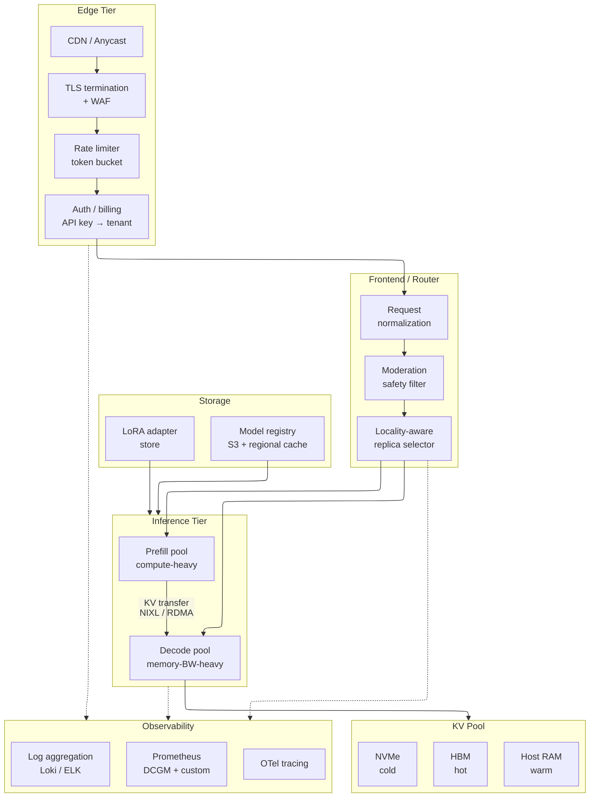
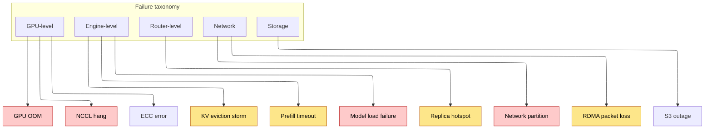
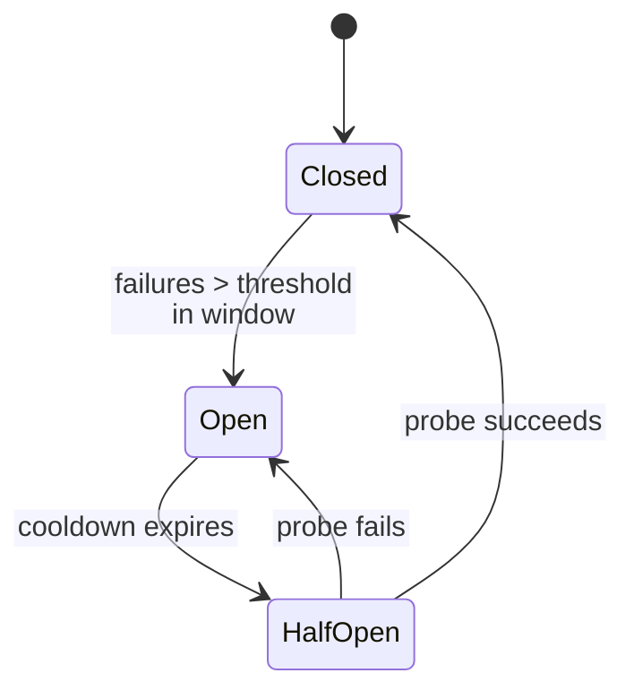
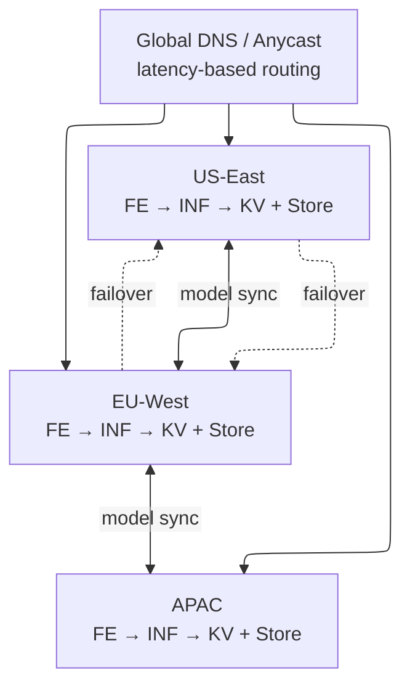
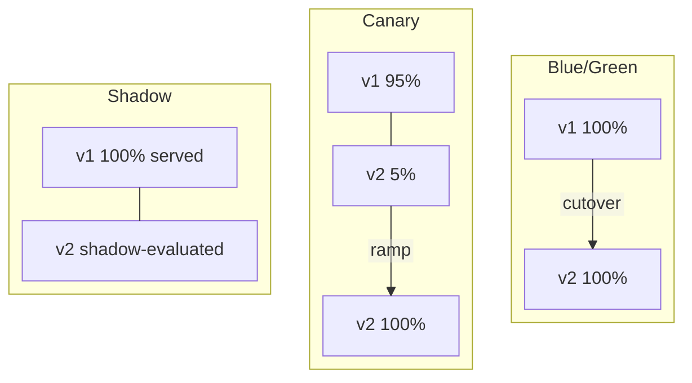
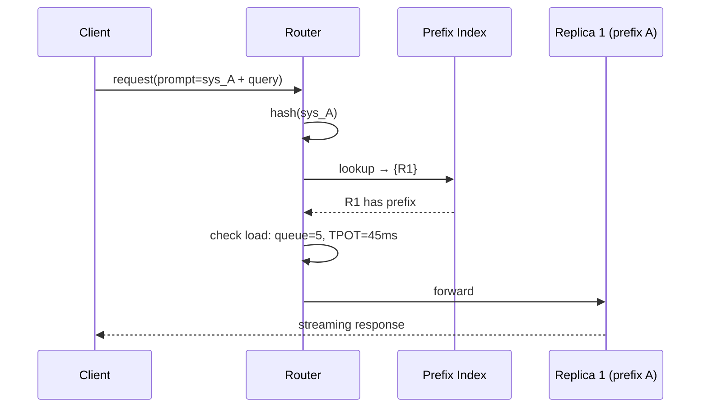
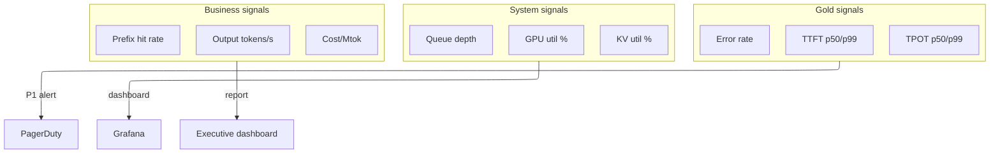

# Production Architecture — Reference Stack, Capacity Planning, and Failure Modes

> **Layer:** L8.
> **Prerequisites:** [KV_Cache](KV_Cache.md), [Batching_and_Scheduling](Batching_and_Scheduling.md), [Speculative_Decoding](Speculative_Decoding.md), [Inference_Frameworks](Inference_Frameworks.md), [Kubernetes_and_Orchestration](Kubernetes_and_Orchestration.md), [Observability_and_Debugging](Observability_and_Debugging.md), [Disaggregated_Serving_2025](Disaggregated_Serving_2025.md).
> **Hands off to:** [Index](../Index.md).

---

## 0. What this page delivers

Every other L8 page isolates a mechanism: KV cache layout, scheduling policy, speculative decoding, disaggregation. This page stitches them into the **complete production system** an engineer designs, deploys, and operates. Three questions frame the material:

1. **Reference stack** — what are the components, how do they interconnect, and what data flows between them?
2. **Capacity planning and cost** — given a target workload (tokens/s, RPS, latency SLO), how many GPUs, how much memory, and what does it cost per million tokens?
3. **Failure modes and resilience** — what breaks, how it manifests in metrics, and what mitigations keep the system within SLO?

The page is prescriptive: concrete numbers, formulas, and configurations, not just abstractions.

---

## 1. Reference Production Stack

### 1.1 End-to-end data path



### 1.2 Component responsibilities

| Component | Key responsibility | Sizing rule |
|---|---|---|
| Edge (CDN + TLS + WAF) | TLS termination, DDoS protection, geographic routing | Stateless; autoscale on RPS |
| Rate limiter | Per-tenant tokens/min, requests/min, concurrent connections | Stateless; in-memory counters |
| Frontend router | Parse, tokenize, moderate, select replica, apply SLO | CPU-bound; ~1 core / 500 RPS |
| Prefill pool | Compute-heavy prompt processing | GPU-bound; sized by prompt tokens/s |
| Decode pool | Memory-BW-heavy token generation | HBM-BW-bound; sized by output tokens/s |
| KV pool | Prefix cache spillover across tiers | HBM → RAM → NVMe; sized by hit-rate target |
| Model registry | Authoritative weight storage with cache hierarchy | S3 + regional + local NVMe |

### 1.3 Request lifecycle (latency budget)

For target TTFT $< 1\,\text{s}$, TPOT $< 50\,\text{ms}$:

| Stage | Latency | Notes |
|---|---|---|
| Network (client → edge) | 20–80 ms | Regional; speed-of-light dominated |
| TLS + WAF + auth | 5–10 ms | Hardware TLS + in-memory lookup |
| Router (parse + tokenize + moderate) | 25–50 ms | CPU-bound for long prompts |
| Engine queue + admit | 20–80 ms | Batch-fullness dependent |
| Prefill (1–2K tokens) | 100–300 ms | Compute-bound on H100-class GPU |
| First decode step | 30–60 ms | Memory-BW-bound |
| **TTFT subtotal** | **200–580 ms** | **Under 1 s target** |

For a 200-token output: E2E $\approx 400 + 200 \times 50 = 10.4\,\text{s}$. Sub-5 s requires TPOT improvement via spec decoding, quantization, or disaggregation.

---

## 2. Capacity Planning

### 2.1 Fundamental throughput equations

**Decode throughput** (memory-BW-bound):

$$
\text{tokens/s/GPU} \;=\; \frac{\beta_{\text{HBM}}}{2 \cdot d_{\text{model}} \cdot n_{\text{layers}} \cdot b}
$$

where $\beta_{\text{HBM}}$ is achievable HBM BW (~70–80% of peak), $d_{\text{model}}$ is hidden dim, and $b$ is bytes per param (2 for BF16, 1 for FP8, 0.5 for FP4). For 70B FP8 on H100 ($\beta = 2.7\,\text{TB/s}$, $d = 8192$, $n = 80$):

$$
\text{tokens/s/GPU} \;\approx\; \frac{2.7 \times 10^{12}}{2 \times 8192 \times 80 \times 1} \;\approx\; 2\,058\;\text{(batch=1)}
$$

With continuous batching at batch 32–128, real throughput is 1 200–1 800 tokens/s/GPU due to KV pressure and scheduling overhead.

**Prefill throughput** (compute-bound):

$$
\text{prefill\_tokens/s/GPU} \;\approx\; \frac{0.5\,\pi}{6\,n_{\text{params}}}
$$

For H100 FP8 ($\pi = 1980\,\text{TFLOPS}$) on 70B: ~2 357 tokens/s at TP=1; ~18K tokens/s at TP=8.

### 2.2 RPS per replica

$$
\text{RPS}_{\text{replica}} \;=\; \frac{\text{output\_tokens/s/replica}}{\bar{L}_{\text{output}}}
$$

Example: 70B FP8 at TP=8, throughput = 12 000 tokens/s, $\bar{L}_{\text{output}} = 200$: $\text{RPS}_{\text{replica}} = 60$. For 10K target RPS: 167 replicas = 1 336 H100s.

### 2.3 GPU-hours per million tokens

$$
\text{GPU-hours/Mtok} \;=\; \frac{10^6}{\text{tokens/s/GPU} \times 3600}
$$

| Model | Precision | TP | tok/s/GPU | GPU-hrs/Mtok |
|---|---|---|---|---|
| 8B | FP8 | 1 | 6 000 | 0.046 |
| 70B | FP8 | 8 | 1 500 | 0.185 |
| 70B | BF16 | 8 | 750 | 0.370 |
| 405B | FP8 | 16 | 530 | 0.524 |
| 405B | FP4 (B200) | 16 | 1 060 | 0.262 |
| 1.8T MoE (8 active) | FP8 | 64 | 1 200 | 0.231 |

### 2.4 KV cache sizing

Per-token KV memory:

$$
\text{KV\_bytes/token} \;=\; 2 \cdot n_{\text{layers}} \cdot n_{\text{kv\_heads}} \cdot d_{\text{head}} \cdot b
$$

For 70B FP8 ($n = 80$, $n_{\text{kv}} = 8$, $d_{\text{head}} = 128$): $\approx 160\,\text{KB/token}$. At TP=8 with 640 GB HBM (90% util): ~3.5M tokens fit. Batch=128 at 2K context each needs 256K tokens. This gap is why PagedAttention, KV compression, and disaggregation are mandatory.

### 2.5 Autoscaling

**HPA on queue depth:**

$$
N_{\text{desired}} = \left\lceil \frac{Q_{\text{observed}}}{Q_{\text{target\_per\_replica}}} \right\rceil, \quad N_{\min} \le N_{\text{desired}} \le N_{\max}
$$

Scale-up immediate; scale-down after 5 min cool-down (hysteresis prevents flapping).

**Warm pool** for bursty traffic: $N_{\text{warm}} = \max(2,\;\lceil (\text{peak} - \text{steady}) / \text{RPS}_{\text{replica}} \rceil)$.

---

## 3. Cost Modeling

### 3.1 GPU cost per million tokens

$\text{cost/Mtok} = \text{GPU-hours/Mtok} \times \text{\$/GPU-hr}$

| Hardware | \$/GPU-hr | Model | Prec. | \$/Mtok out |
|---|---|---|---|---|
| H100 SXM5 | $3.50 | 8B | FP8 | $0.16 |
| H100 SXM5 | $3.50 | 70B | FP8 | $0.65 |
| H100 SXM5 | $3.50 | 70B | BF16 | $1.30 |
| H100 SXM5 | $3.50 | 405B | FP8 | $1.83 |
| H200 | $4.00 | 70B | FP8 | $0.60 |
| B200 | $6.00 | 70B | FP8 | $0.72 |
| B200 | $6.00 | 70B | FP4 | $0.36 |
| B200 | $6.00 | 405B | FP4 | $1.05 |
| MI300X | $3.00 | 70B | FP8 | $0.51 |
| MI355X | $5.00 | 70B | FP4 | $0.25 |

On-demand pricing from 2025-2026 rates. Spot is 50-70% lower. Throughput assumes continuous batching + prefix caching.

### 3.2 Cost optimization levers

| Lever | Speedup | Complexity | When to apply |
|---|---|---|---|
| FP8 quantization | 1.8-2.2x | Low | Always (if quality acceptable) |
| Speculative decoding | 1.5-3.0x | Medium | Output tokens dominate; draft model available |
| PD disaggregation | 1.2-1.5x, 30% less HW | High | Bursty, RPS > 1000 |
| Prefix caching | Up to 2x on chat | Low | Shared system prompts |
| FP4 (B200) | 2x over FP8 | Medium | Blackwell fleet |
| KV compression (MLA) | 2-8x KV reduction | High | New model training |
| Spot GPUs | 50-70% cost cut | Medium | Non-SLO-critical tiers |

### 3.3 TCO breakdown

$$
\text{TCO} = C_{\text{GPU}} + C_{\text{network}} + C_{\text{storage}} + C_{\text{ops}} + C_{\text{software}}
$$

GPU compute: 65-75%. Network: 8-12%. Storage: 3-5%. Operations: 5-8%. Software: 3-5%.

---

## 4. Failure Modes

### 4.1 Failure taxonomy



### 4.2 Detailed failure analysis

**GPU OOM.** Symptom: HTTP 500, `CUDA out of memory`. Cause: aggregate KV exceeds `gpu_memory_utilization` fraction. Mitigation: cap `max_model_len` per tenant; reduce `max_num_seqs`; enable KV compression; disaggregate prefill; alert on `kv_cache_utilization > 85%`.

**KV eviction storm.** Symptom: prefix-cache hit rate drops from 80% to 10%. Cause: working set exceeds HBM KV capacity; new feature launch or A/B test evicts hot prefixes. Mitigation: weighted eviction (prefer system prompts); tiered KV pool; pre-warm hot prefixes on startup; router-level prefix concentration.

**Prefill timeout.** Symptom: TPOT spikes for all in-flight requests. Cause: a 128K-token prompt monopolizes prefill budget. Mitigation: chunked prefill with per-step budget; PD disaggregation; admission control rejecting prompts above a length threshold.

**NCCL hang.** Symptom: replica unresponsive; health checks timeout. Cause: NCCL all-reduce enters infinite wait (ECC error, thermal throttle, NVLink flap). Mitigation: `NCCL_ASYNC_ERROR_HANDLING=1`; liveness probe killing pod after N seconds; DCGM NVLink monitoring.

**Model load failure.** Symptom: CrashLoopBackOff; checksum mismatch. Cause: corrupt weight file, network partition during download, NVMe full. Mitigation: SHA256 verification; pre-stage weights on NVMe; fallback to previous version; immutable registry artifacts.

**Network partition (disaggregated).** Symptom: prefill completes but KV cannot transfer; decode pool starves. Cause: RDMA link failure. Mitigation: redundant RDMA paths; fallback to coupled mode; frontend backpressure on KV transfer queue.

---

## 5. Resilience Patterns

### 5.1 Circuit breakers

Per-replica circuit state machine:



**Closed**: healthy; route normally. **Open**: N failures in T seconds; stop routing; drain in-flight. **Half-Open**: send one probe after cooldown; close or re-open.

Defaults: `failure_threshold=5`, `window=30s`, `cooldown=60s`.

### 5.2 Fallback models

When primary replicas are all open or overloaded:

1. **Tier-1**: same model, lower precision or smaller batch.
2. **Tier-2**: smaller model (70B → 8B) with `model_downgraded` response header.
3. **Tier-3**: cached response for deterministic/FAQ queries.
4. **Tier-4**: HTTP 503 with `Retry-After`.

### 5.3 Graceful degradation

| Condition | Action | User-visible effect |
|---|---|---|
| GPU util > 95% | Reduce `max_num_seqs` 25% | Longer queue waits |
| KV util > 90% | Evict coldest 50% of prefix cache | TTFT increases for long prompts |
| TPOT p99 > 2x SLO | Disable speculative decoding | Throughput drops; latency recovers |
| All replicas overloaded | Switch to fallback model | Lower quality; maintained latency |
| S3 unavailable | Serve from NVMe cache | Cannot deploy new models |

Automatic, metrics-triggered, logged for post-incident review.

### 5.4 Retry and timeout budget

$$
T_{\text{total}} = T_{\text{router}} + T_{\text{queue}} + T_{\text{prefill}} + T_{\text{decode}} + T_{\text{network}}
$$

Per-stage defaults: prefill timeout $\min(5\,\text{s},\; 2 \times \text{expected})$; decode per-token $\min(2\,\text{s},\; 5 \times \text{TPOT\_SLO})$; total request $\min(120\,\text{s},\; \text{ctx\_tokens}/100 + 30\,\text{s})$. Retries: max 2, exponential backoff (100 ms, 500 ms), idempotent requests only.

---

## 6. Multi-Region Deployment

### 6.1 Architecture



### 6.2 Region sizing

$$
N_{\text{region}} = \left\lceil \frac{\text{local\_peak} + f \cdot \text{partner\_peak}}{\text{RPS}_{\text{replica}}} \right\rceil
$$

Failover fraction $f \in [0.3, 0.5]$ (not 1.0; some degradation is acceptable during rare full-region outages).

### 6.3 Data residency

- EU user data stays in EU (GDPR, EU AI Act). KV cache is region-local.
- Model weights replicate cross-region (not user data).
- Audit logs tagged with residency zone; per-regulation purge tooling.

---

## 7. A/B Testing and Model Rollout

### 7.1 Rollout strategies



- **Blue/Green**: instant cutover and rollback; doubles cost during migration. For incompatible model swaps.
- **Canary**: 5% → 25% → 50% → 100% ramp with quality gates at each step. Standard for engine upgrades.
- **Shadow**: new version processes all requests but output is not served; quality compared offline. For model validation before canary.

### 7.2 Feature flags and per-tenant rollout

Per-tenant flags control model version, engine version, sampling defaults, quantization level, and speculative decoding. Flags enable gradual per-customer rollout, fast individual-tenant rollback, and A/B comparison with statistical significance.

### 7.3 Quality gates

Before canary → full promotion, all must pass:

1. TTFT p99 and TPOT p99 within 10% of baseline.
2. Tokens/s/GPU within 5% of baseline.
3. Automated eval suite (MMLU, HumanEval, custom) within tolerance.
4. Moderation FP/FN rates within bounds.
5. HTTP 5xx rate below 0.1%.

Automated promotion if all pass; manual review if any fail. Rollback is instant (flip feature flag).

---

## 8. Router Design

### 8.1 Locality-aware routing

The router maintains a **prefix cache index**: prefix hash → set of replicas holding that prefix.



If the locality replica is overloaded (queue > threshold), fall back to least-loaded replica (cost: full prefill instead of prefix hit).

### 8.2 Routing algorithms

| Algorithm | Locality | Load-aware | Use case |
|---|---|---|---|
| Hash(prefix) → replica | Perfect | None | Uniform traffic, few hot prefixes |
| Power-of-two-choices | None | Yes | Heterogeneous request sizes |
| Affinity + load hybrid | Good | Yes | Production default |

The **affinity + load hybrid** prefers the locality replica unless its queue exceeds a threshold, then picks least-loaded among remaining candidates.

Multi-LoRA: router maps tenant → adapter → replica set with adapter loaded. Cold adapters loaded lazily on least-loaded replica; LRU eviction when adapter memory exceeds quota.

---

## 9. Storage Hierarchy

### 9.1 Model weight distribution

$$
T_{\text{load}} = M_{\text{model}} / \beta_{\text{tier}}
$$

| Tier | Bandwidth | 70B FP8 (70 GB) load time |
|---|---|---|
| S3 (cross-region) | 10 Gbps | ~56 s |
| Regional cache | 25 Gbps | ~22 s |
| NVMe (local) | 14 GB/s | ~5 s |
| HBM (GPU) | 3.35 TB/s | ~0.02 s |

Pre-warm all active models on NVMe during off-peak hours; reduces cold-start from 56 s to 5 s.

### 9.2 KV cache tiering

| Tier | Latency | Capacity | Use case |
|---|---|---|---|
| HBM | ~100 ns | 640 GB (TP=8) | Active decode KV |
| Host RAM | ~1 us | 512 GB–2 TB | Swapped-out, preempted sequences |
| NVMe | ~10 us | 4–30 TB | Cold prefix pool (Mooncake-style) |
| Object store | ~50 ms | Unlimited | Frozen canonical prefixes |

Each tier is order-of-magnitude slower but larger. The KV pool manager migrates blocks based on recency and reuse probability.

---

## 10. Security and Multi-Tenancy

### 10.1 Threat model

| Threat | Vector | Mitigation |
|---|---|---|
| Prompt injection | User input overrides system prompt | System prompt hardening, classifier |
| Resource exhaustion | Very long prompts | Per-tenant length caps |
| Data exfiltration | Crafted prompts | Output filtering, guardrails |
| Noisy neighbor | One tenant hogs GPU | Per-tenant priority, WFQ |
| Side-channel timing | Infer activity from latency | Dedicated replicas for sensitive tenants |

### 10.2 Isolation levels

| Level | Isolation | Cost multiplier | When |
|---|---|---|---|
| Shared + priority queueing | Soft | 1x | Standard tier |
| Dedicated replicas | Hard | 2-5x | Enterprise, compliance |
| Dedicated node | Physical | 8x | Regulated data |
| Dedicated region | Geographic | Full region | Sovereign data |

### 10.3 Compliance

SOC 2 Type II (audit logs, access controls, encryption). GDPR (EU residency, deletion rights, DPAs). HIPAA (BAA, no raw PHI in logs). EU AI Act (risk classification, transparency).

---

## 11. LLM / AI Gateway Patterns

### 11.1 Definition

An LLM / AI Gateway is a dedicated proxy layer between applications and LLM providers or inference backends. It decouples application logic from model-specific API details, providing a unified control plane for routing, cost management, observability, and resilience across all LLM interactions.

### 11.2 Core functions

| Function | Description |
|---|---|
| Unified API | Single OpenAI-compatible (or custom) API surface across all providers (OpenAI, Anthropic, Google, Azure, self-hosted). Applications call one endpoint; the gateway translates to each provider's format. |
| Rate limiting | Per-team and per-app token-rate and request-rate limits. Prevents a single consumer from monopolizing inference capacity or exceeding budget. |
| Prompt routing | Classify incoming prompts and route to the cheapest model that satisfies quality requirements. Simple queries go to small/cheap models; complex reasoning goes to frontier models. |
| Automatic retries | Exponential backoff with jitter on transient provider failures (rate-limit 429s, timeouts, 500s). Configurable retry budgets per request. |
| Fallback chains | Ordered list of providers/models for each route. If primary fails (error, latency SLO breach), traffic shifts to fallback automatically. |
| Observability hooks | Structured logging of latency (TTFT, TPOT), cost per request, error rate per model/provider, token usage. Exported to Prometheus, OTel, or custom dashboards. |
| Cost tracking and budgeting | Per-team, per-app, per-model cost accumulation with budget caps and alerts. Enables chargeback and spend governance. |

### 11.3 Semantic caching

Exact-string caching (as in prefix caching) misses semantically equivalent rephrasings. Semantic caching addresses this:

1. Embed the prompt using a small embedding model (e.g., text-embedding-3-small).
2. Hash the embedding and check a vector store (FAISS, Qdrant, or in-memory ANN index) for nearby embeddings within a similarity threshold (typically cosine similarity > 0.92--0.95).
3. On a cache hit, return the cached response directly -- no LLM call.
4. On a miss, call the LLM, store the prompt embedding and response in the cache.

Production hit rates of 30--50% are achievable for FAQ-style workloads, customer support, and knowledge-base queries where users ask the same question in varied phrasing. Each cache hit eliminates both cost (no LLM tokens consumed) and latency (no inference wait).

Cache invalidation strategies: TTL-based expiry (short for factual content, longer for stable knowledge), LRU eviction by cache size, and semantic drift detection (re-embed and compare if cached response age exceeds a threshold).

### 11.4 Model cascading

Model cascading routes requests to the smallest model first and escalates only when needed:

1. Send the prompt to a small, cheap model (e.g., 7B).
2. If the model's confidence score (from logprob analysis, self-assessment, or a separate classifier) is above a threshold, return the response.
3. If confidence is below the threshold, escalate to a larger model (e.g., 70B), optionally passing the small model's output as a hint.
4. If still insufficient, escalate to a frontier model.

Typical cascade: 7B -> 70B -> frontier. For workloads with a mix of easy and hard queries (e.g., customer support where 80% are simple FAQs), cascading reduces average cost by 3--10x compared to always using the largest model.

The confidence threshold is tuned per workload: too low and quality suffers (bad answers accepted from the small model), too high and cost savings evaporate (too many escalations). Production deployments typically set the threshold at the 85th--95th percentile of the small model's confidence distribution on a held-out eval set.

### 11.5 Implementation options

| Implementation | Type | Key features |
|---|---|---|
| Portkey | Open-source gateway | 1,600+ model support via unified API, semantic caching, retry/fallback, guardrails, sub-1ms p99 overhead. Deploy as sidecar or standalone service. |
| LiteLLM | Open-source proxy | OpenAI-compatible unified API for 100+ providers, load balancing, fallbacks, spend tracking. Python-based; integrates with existing inference servers. |
| AWS Bedrock Gateway | Managed service | Native integration with AWS IAM, CloudWatch, and multi-provider routing. No infrastructure to manage. |
| Custom (Envoy/Nginx + logic) | Build-your-own | Maximum flexibility; requires implementing routing, caching, and fallback logic. Suitable when existing gateways lack domain-specific features. |

Typical deployment: sidecar container co-located with the application, or a shared gateway service in the inference tier.

### 11.6 Architecture

```verilog
Client Request
      |
      v
[ Gateway ]             -- Rate limiting, auth, cost tracking
      |
      v
[ Router ]              -- Model selection (routing rules, cascade logic)
      |
      v
[ Load Balancer ]       -- Replica selection (locality-aware, least-loaded)
      |
      v
[ Inference Backend ]   -- vLLM, TensorRT-LLM, TGI, or provider API
      |
      v
[ Response ]
      |
      v
[ Guardrail Check ]     -- Output moderation, PII detection, schema validation
      |
      v
Response to Client
```

The router consults the semantic cache before model selection. The load balancer is the same locality-aware component described in Section 8. The guardrail check runs in parallel with response streaming for latency-sensitive paths.

### 11.7 Production considerations

- **Single point of failure.** The gateway sits on every request path. HA deployment is mandatory: multiple replicas behind a load balancer, with health checks and automatic failover. Gateway state (rate-limit counters, cache) must be replicated or stored externally (Redis for counters, vector DB for semantic cache).
- **Streaming responses.** LLM responses are typically streamed (SSE or WebSocket). The gateway must proxy streaming data without buffering the entire output -- otherwise TTFT increases and memory usage grows unbounded. Implementation: chunked transfer encoding with backpressure.
- **Token-aware rate limiting.** Request-level rate limiting (e.g., 100 req/min) is insufficient because a single request with a 128K-token prompt consumes far more resources than a 100-token prompt. Rate limiting must be token-aware: track tokens/min per tenant, not just requests/min. This requires either prompt-length estimation (from tokenization) or token counting at the gateway level.
- **Cold-start latency.** If the gateway itself needs to load a model or establish a connection to a provider, the first request may be slow. Mitigate with connection pooling, warm-up probes, and pre-established sessions.

---

## 12. Agentic Inference Architecture

### 12.1 Definition

Agentic inference refers to infrastructure for serving LLM agentic workloads where each "request" is a multi-turn agent loop: think -> tool call -> observe -> think again. Unlike traditional request-response serving (one prompt in, one completion out), an agentic request may involve 5--50+ sequential LLM calls, interleaved with tool executions, over seconds to minutes.

### 12.2 Key differences from request-response serving

| Dimension | Request-response serving | Agentic inference |
|---|---|---|
| Session duration | Milliseconds to seconds | Seconds to minutes |
| LLM calls per request | 1 | 5--50+ (planning, tool selection, output parsing, verification) |
| KV cache lifetime | Evictable after response | Must persist across turns within a session |
| GPU utilization pattern | Continuous (always decoding or prefilling) | Bursty: GPU active during LLM calls, idle during tool execution |
| Context growth | Fixed at request time | Grows monotonically as agent accumulates observations |
| Output structure | Free-form text or single JSON | Structured function calls + reasoning traces |

The KV cache requirement is critical: between agent turns (while a tool executes), the KV cache for that session must not be evicted, or the next turn pays the full prefill cost again. This breaks the assumption of traditional continuous batching that KV blocks can be reclaimed as soon as a sequence completes.

### 12.3 Scheduling implications

Traditional continuous batching assumes short, independent requests. Agent sessions need different scheduling policies:

- **Session-aware scheduling.** The scheduler knows which sequences belong to the same agent session and keeps their KV cache warm. This may mean reserving KV blocks for paused agents even when other requests could use them.
- **GPU sharing during tool pauses.** While an agent waits for a tool result (which may take milliseconds for a calculator or seconds for a web search), its KV cache occupies memory but the GPU is idle. The scheduler should serve other requests during these pauses. However, the agent's KV cache must be preserved (either in HBM or swapped to host memory).
- **Priority queuing.** Agents paused on tool execution have lower scheduling priority than actively decoding agents or fresh single-turn requests. This prevents idle agents from occupying GPU memory that could serve active work.
- **Disaggregated KV storage.** During tool pauses, the agent's KV cache can be offloaded from GPU HBM to host RAM or SSD (as described in Section 9.2). When the agent resumes, the KV cache is reloaded. The swap latency (~1--10 ms for RAM, ~10--100 ms for NVMe) is acceptable given tool execution times.

### 12.4 Context management

Agent context grows monotonically as the agent accumulates tool outputs, reasoning traces, and observations. Unmanaged, a 10-turn agent session can easily exceed 50K tokens, straining both memory and attention quality.

Techniques:

- **Context compression between turns.** After receiving a tool output, compress it before appending to the agent's context. A smaller model (or the agent itself) can summarize verbose tool outputs. Typical compression: 5--10x reduction for structured data (JSON API responses, web page contents).
- **Sliding window with retrieval.** Keep only the most recent N tokens in the active context. Older context is stored in a vector store and retrieved via RAG when relevant. Trades full-history awareness for memory efficiency.
- **Disaggregated KV storage.** Keep the full KV cache but store older layers on CPU/SSD during tool pauses. Only the most recent layers (which are most likely to be attended) remain in HBM. The Mooncake-style tiered KV pool (Section 9.2) applies directly.

### 12.5 Structured output

Agents require reliable structured output (JSON function calls, tool-use schemas, argument parsing). This is implemented via **constrained decoding**: grammar masking in the sampler that restricts the vocabulary at each position to only tokens valid under the target schema.

Implementation approaches:

- **JSON grammar masking.** Construct a CFG or regex for the expected JSON schema. At each decode step, compute the set of valid next tokens and mask the logit distribution to zero out invalid tokens. This guarantees syntactically valid output.
- **Tool-call formatting.** For models with native tool-call support (function calling), the framework applies a grammar specific to the tool-call format. The model generates structured tool invocations instead of free-form text.

Overhead: constrained decoding adds ~5--15% overhead on decode throughput due to the grammar masking computation per step. This is acceptable given that structured output eliminates the need for brittle regex-based parsing of free-form responses.

### 12.6 NVIDIA Dynamo agentic inference hints

NVIDIA Dynamo (the inference framework succeeding TensorRT-LLM and Triton) includes explicit optimizations for agentic workloads:

- **Session affinity.** Requests from the same agent session are routed to the same inference replica, keeping the KV cache local and avoiding cross-node transfers.
- **KV cache persistence.** Dynamo supports pinning KV cache blocks to specific sessions, preventing eviction during tool execution pauses. The pinned blocks are marked as "reserved" and excluded from the normal eviction policy.
- **Tool-call streaming.** When an agent emits a tool call, Dynamo can stream the structured output incrementally, allowing tool execution to begin before the full call is generated (e.g., start an HTTP request as soon as the URL parameter is complete).
- **Disaggregated agent scheduling.** Dynamo's scheduler is aware of agent session states (active decoding, tool-waiting, tool-executing) and adjusts batch composition accordingly, prioritizing active agents and sharing GPU among waiting agents.

These optimizations are early but indicate the direction: inference frameworks are evolving from single-request optimization to session-aware, agent-optimized serving.

---

## 13. Observability and Configuration

### 13.1 Metric hierarchy



### 13.2 Alerting

| Alert | Condition | Severity | Action |
|---|---|---|---|
| TTFT SLO violation | p99 > 1 s for 5 min | P1 | Page; scale up |
| TPOT SLO violation | p99 > 100 ms for 5 min | P1 | Page; reduce batch |
| GPU OOM | any replica in 5 min | P2 | Reduce max_num_seqs |
| KV util > 90% | fleet avg 10 min | P2 | Enable offloading |
| Error rate > 1% | 5xx per model 5 min | P1 | Page; circuit break |
| Cache hit < 30% | hourly avg | P3 | Investigate churn |

### 13.3 Engine configuration

| Parameter | Default | Guidance |
|---|---|---|
| `max_num_batched_tokens` | 4096 | Prefill chunk; raise for long prompts |
| `max_num_seqs` | 256 | Raise until KV pressure threshold |
| `gpu_memory_utilization` | 0.90 | Leave headroom for weight updates |
| `enable_prefix_caching` | True | Always on for chat |
| `block_size` | 16 | PagedAttention block; 16 is near-optimal |
| `swap_space` (GB) | 4 | Host RAM swap; raise for high preemption |
| `locality_affinity_weight` | 0.7 | Router: prefix-locality vs load weight |
| `max_queue_depth_override` | 64 | Router: per-replica limit before circuit break |

---

## 14. Common Interview Questions

**Q: Design an inference platform for 100K RPS serving 70B.**

A: 70B FP8 at TP=8 = ~60 RPS/replica. Need ~1 700 replicas = 13 600 H100s across 3 regions (~5 700 each). Disaggregated PD for top-traffic region. Edge: anycast TLS, per-tenant rate limiting. Frontend routers: ~200 instances. KV pool: HBM + RAM + NVMe tiering. Autoscaling with 20% warm buffer. Cost at $3.50/GPU-hr: ~$47K/hr (~$1.1M/day).

**Q: GPU OOM just fired. Walk through your response.**

A: (1) Identify replica from alert. (2) Check `kv_cache_utilization` — if > 95%, KV is the cause. (3) Immediate: reduce `max_num_seqs` 25%. (4) Check for tenant sending unusually long prompts. (5) Apply per-tenant `max_model_len` cap if needed. (6) Medium-term: enable KV offloading or add replicas. (7) Post-incident: update capacity model.

**Q: Rollback with zero downtime?**

A: Blue/green with feature flags. New version deploys to green pool while blue serves. Flip flag 0% → 5% (canary) → 100%. Regression at any step: flip back to 0% (instant). No downtime.

**Q: Most cost-efficient 405B serving?**

A: FP8 (2x over BF16), speculative decoding with 70B draft (~2x), PD disaggregation (30% less HW), prefix caching. Combined ~4x throughput: ~$3.60/Mtok → ~$0.90/Mtok on B200.

**Q: Prevent noisy tenant from degrading SLO for others?**

A: (1) Edge rate limiting: per-tenant tokens/min cap, 429 on excess. (2) Router: weighted fair queueing proportional to tier. (3) Engine: priority preemption — low-priority sequences evicted for high-priority arrivals.

---

## 15. Numbers to Memorize

| Quantity | Value | Why it matters |
|---|---|---|
| TTFT budget breakdown | net 20–80 + TLS/auth 5–10 + router 25–50 + queue 20–80 + prefill 100–300 + 1st decode 30–60 | sums to **200–580 ms** (<1 s target) |
| Decode throughput (70B FP8, H100) | ~2.4K tok/s TP=1 → ~18K TP=8 (theoretical) | real 1.2–1.8K/GPU with KV pressure |
| Achievable HBM bandwidth | 70–80% of peak | derate every roofline estimate |
| KV size (70B FP8) | ~160 KB/token; TP=8 (640 GB) → ~3.5M tokens | why paging/compression/disagg are mandatory |
| RPS per replica | 70B FP8 TP=8, 12K tok/s, 200-tok output → **60 RPS** | the capacity-planning unit |
| Fleet sizing example | 10K RPS → 167 replicas → **1,336 H100s** | translate demand to hardware |
| Bytes/param by format | FP32 4 B, FP16/BF16 2 B, FP8/INT8 1 B, INT4/NF4 0.5 B; MXFP4 ~4.25 bit, NVFP4 ~4.5 bit incl. block-scale overhead | the multiplier behind every VRAM/KV estimate above |
