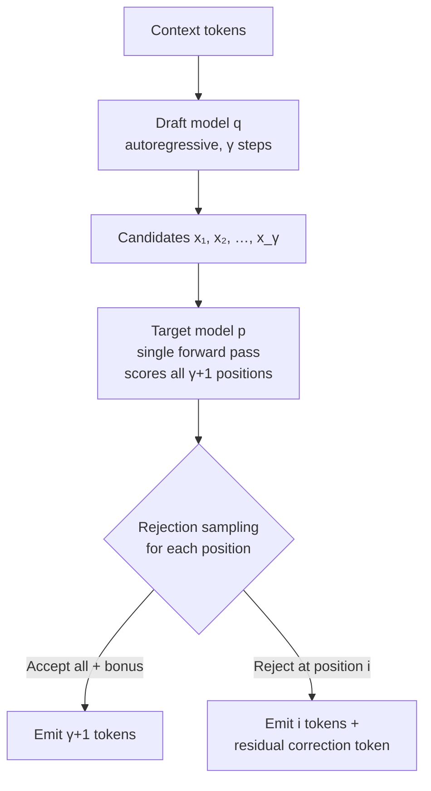
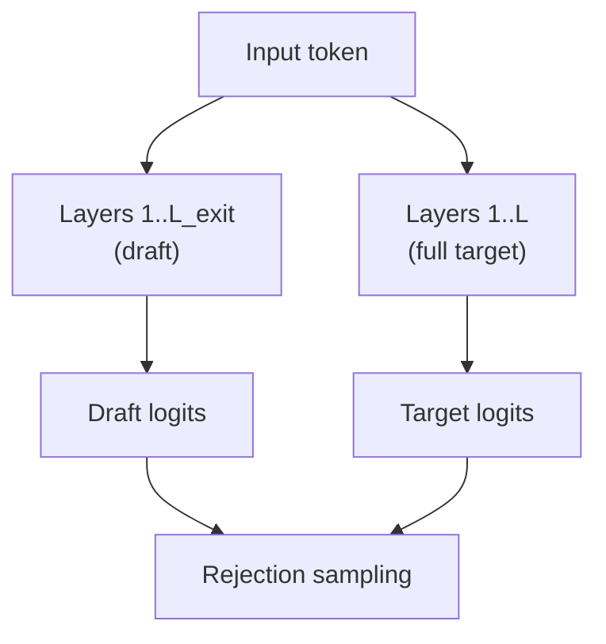
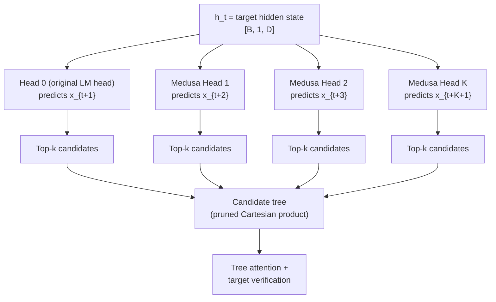
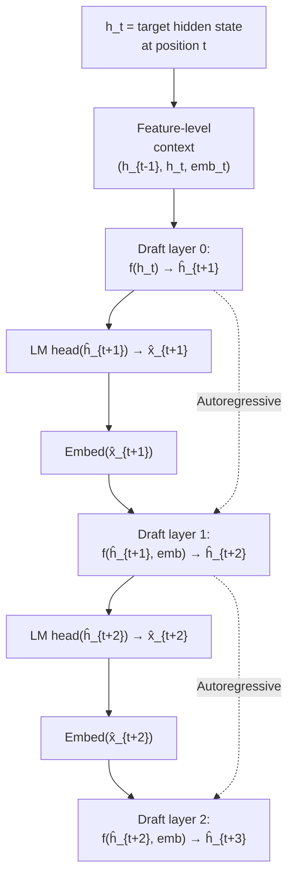

# Speculative Decoding — Draft-then-Verify for Faster Inference

> **Layer:** L8. **Prerequisites:** [Batching_and_Scheduling](Batching_and_Scheduling.md), [Transformer_Internals](../L6_Algorithms_and_Models/Transformer_Internals.md). **Hands off to:** [Inference_Frameworks](Inference_Frameworks.md), [Production_Architecture](Production_Architecture.md).

---

## 0. Why This Page Exists

Decode-phase inference for large language models is memory-bandwidth-bound: every step reads the full weight matrix from HBM whether the model emits one token or scores ten. Speculative decoding exploits this slack by guessing several future tokens cheaply, then verifying them in a single target-model forward pass that costs essentially the same as a normal decode step. Every accepted token is pure throughput gain. The method delivers $1.5$--$4\times$ wall-clock speedup with no retraining, no hardware changes, and --- when implemented correctly --- no change to the output distribution.

This page derives the algorithm from scratch, proves distributional equivalence, works through the acceptance-rate and speedup math, and covers every major variant in production use as of 2025--2026: vanilla speculative decoding, self-speculation via early exit, Medusa multi-token heads, EAGLE feature-level drafting, and n-gram/lookahead methods. A comparison table at the end summarizes the tradeoffs.

---

## 1. The Bandwidth Bottleneck

### 1.1 Decode Is Memory-Bound

During autoregressive decode, each step processes one token per sequence. The arithmetic intensity of a single-token decode step for a model with $P$ parameters in FP16 is:

$$\text{AI} = \frac{2P \;\text{FLOPs}}{2P \;\text{bytes}} = 1 \;\text{FLOP/byte}$$

Each parameter is read once (2 bytes in FP16) and participates in one multiply-accumulate (2 FLOPs). On an H100 SXM the roofline ridge point is approximately 295 FLOP/byte ($989$ TFLOPS $\div$ $3.35$ TB/s). Decode sits at $1/295 \approx 0.3\%$ of ridge --- deep in the memory-bound regime.

### 1.2 Free Verification

Adding $K$ candidate tokens to the verification batch increases FLOPs by $\sim K\times$ but does **not** increase the dominant cost: reading the weight matrix from HBM. Those extra tokens are scored with arithmetic intensity $\approx K$ FLOP/byte, still far below ridge. The bandwidth cost is essentially unchanged, so $K$ verified tokens cost roughly the same wall-clock time as one baseline token.

**Worked example.** Llama-3-70B FP16 on H100 SXM:

| Quantity | Value |
|----------|-------|
| Weight bytes | $140$ GB |
| HBM bandwidth | $3.35$ TB/s |
| Time to read weights (dominant cost) | $140 / 3350 \approx 42$ ms |
| FLOPs for 1 token | $2 \times 70 \times 10^9 = 140$ GFLOP |
| FLOPs for $K=5$ tokens | $700$ GFLOP |
| H100 FP16 throughput | $989$ TFLOPS |
| Compute time for 5 tokens | $700 / 989{,}000 \approx 0.7$ ms |
| Compute time for 1 token | $0.14$ ms |

Both are dwarfed by the 42 ms memory read. The five-token batch finishes in $\approx 42.7$ ms vs $\approx 42.1$ ms for one token --- a $<2\%$ increase in wall-clock time for a potential $5\times$ increase in tokens emitted.

---

## 2. Vanilla Speculative Decoding

### 2.1 Algorithm

Two models: a **draft model** $q$ (small, fast) and a **target model** $p$ (large, accurate). The draft proposes $\gamma$ tokens autoregressively; the target verifies them all in one forward pass.



**Pseudocode:**

```
Input: context, draft model q, target model p, draft length γ

# Phase 1: Draft
for i = 1 to γ:
    x_i ~ q(· | context, x_1, ..., x_{i-1})

# Phase 2: Verify (single target forward pass)
p_1, ..., p_γ, p_{γ+1} = target_forward(context, x_1, ..., x_γ)
# p_i is the target distribution at position i
# p_{γ+1} is the distribution conditioned on all γ candidates

# Phase 3: Rejection sampling
n = 0
for i = 1 to γ:
    r ~ Uniform(0, 1)
    if r < min(1, p_i(x_i) / q_i(x_i)):
        accept x_i; n = i
    else:
        # Rejection: sample correction from residual distribution
        x' ~ Normalize(max(0, p_i - q_i))
        emit (x_1, ..., x_{i-1}, x')
        return

# All accepted: emit bonus token from p_{γ+1}
x_{γ+1} ~ p_{γ+1}
emit (x_1, ..., x_γ, x_{γ+1})
```

Key invariant: the output is always at least 1 token (the correction or bonus) and at most $\gamma + 1$ tokens per verifier step.

### 2.2 Proof of Distributional Equivalence

**Theorem (Leviathan et al., 2023).** The tokens emitted by the above algorithm are distributed exactly according to $p$.

*Proof.* Consider a single position. Token $x$ is drawn from the draft $q(x)$ and accepted with probability $\min(1, p(x)/q(x))$.

**Acceptance branch.** The probability of outputting $x$ via acceptance:

$$\Pr[\text{output } x \mid \text{accept}] = q(x) \cdot \min\!\left(1,\; \frac{p(x)}{q(x)}\right) = \min\bigl(q(x),\; p(x)\bigr)$$

**Total acceptance rate.** Summing over all tokens:

$$\alpha = \sum_{x} \min\bigl(q(x),\; p(x)\bigr) = 1 - \frac{1}{2}\|p - q\|_1$$

**Rejection branch.** On rejection (probability $1 - \alpha$), the correction distribution is:

$$r(x) = \frac{(p(x) - q(x))_{+}}{\sum_{v}(p(v) - q(v))_{+}} = \frac{(p(x) - q(x))_{+}}{1 - \alpha}$$

**Marginal output distribution.** Combining both branches:

$$\Pr[\text{output } x] = \min(q(x), p(x)) + (p(x) - q(x))_{+} = p(x) \quad\checkmark$$

The output distribution is exactly $p$. Distributional equivalence is preserved position-by-position, hence across the full sequence. $\square$

### 2.3 Acceptance Rate Derivation

Define the single-position acceptance rate:

$$\alpha = \mathbb{E}_{x \sim q}\!\left[\min\!\left(1,\; \frac{p(x)}{q(x)}\right)\right] = 1 - \frac{1}{2}\|p - q\|_1$$

For a draft of length $\gamma$, the expected number of tokens emitted per step is:

$$\mathbb{E}[\text{tokens}] = \sum_{i=0}^{\gamma} \Pr[\text{first } i \text{ tokens accepted}] = \sum_{i=0}^{\gamma} \prod_{j=1}^{i} \alpha_j$$

When all positions share a common acceptance rate $\alpha$ (identical draft quality at every position):

$$\boxed{\mathbb{E}[\text{tokens}] = \frac{1 - \alpha^{\gamma+1}}{1 - \alpha}}$$

**Worked examples:**

| $\alpha$ | $\gamma$ | $\mathbb{E}[\text{tokens}]$ | Effective speedup (ignoring draft cost) |
|----------|----------|------------------------------|----------------------------------------|
| 0.90 | 4 | $\frac{1 - 0.9^5}{0.1} = 4.10$ | $4.10\times$ |
| 0.80 | 5 | $\frac{1 - 0.8^6}{0.2} = 3.69$ | $3.69\times$ |
| 0.60 | 5 | $\frac{1 - 0.6^6}{0.4} = 2.31$ | $2.31\times$ |

### 2.4 Speedup Formula

Let $T_p$ = target forward pass time, $T_q$ = draft model single-step time, and $\gamma$ = draft length. The expected time per emitted token is:

$$T_{\text{per token}} = \frac{T_p + \gamma \cdot T_q}{\mathbb{E}[\text{tokens}]}$$

The speedup over vanilla decode is:

$$\boxed{S = \frac{T_p}{T_{\text{per token}}} = \frac{T_p \cdot \mathbb{E}[\text{tokens}]}{T_p + \gamma \cdot T_q} = \frac{(1 - \alpha^{\gamma+1}) / (1 - \alpha)}{1 + \gamma \cdot T_q / T_p}}$$

When $T_q \ll T_p$ (the typical regime), this simplifies to $S \approx \mathbb{E}[\text{tokens}]$.

**Break-even condition.** Speculative decoding helps when $T_{\text{per token}} < T_p$:

$$\mathbb{E}[\text{tokens}] > 1 + \frac{\gamma \cdot T_q}{T_p}$$

For $T_q / T_p = 0.1$ and $\gamma = 5$: need $\mathbb{E}[\text{tokens}] > 1.5$, which requires $\alpha > 0.37$. Even moderately aligned draft models pay off.

**Optimal draft length.** The value of $\gamma$ that maximizes throughput:

$$\gamma^{*} = \arg\max_{\gamma} \frac{(1 - \alpha^{\gamma+1})/(1-\alpha)}{T_p + \gamma \cdot T_q}$$

In practice the sweet spot is $\gamma \in [3, 7]$. Longer drafts waste time when $\alpha$ is moderate because the later positions are almost always rejected.

---

## 3. Self-Speculation: Early Exit

Rather than maintaining a separate draft model, **early-exit speculation** uses the target model itself at intermediate layers. The target model has $L$ layers; the draft "model" is layers $1$ through $L_{\text{exit}} < L$, followed by a lightweight classifier head.



**How it works:**

1. Run the target model forward to layer $L_{\text{exit}}$. Apply the exit head to produce draft logits $q$.
2. Continue the forward pass through the remaining layers to produce target logits $p$.
3. Apply standard rejection sampling with $p$ and $q$.

**Determining the exit layer.** The exit layer $L_{\text{exit}}$ can be fixed or adaptive:

- **Fixed exit**: set $L_{\text{exit}}$ at deployment time (e.g., layer 8 of 32). Simple but suboptimal across different input distributions. The fixed point is chosen by sweeping exit layers on a validation set and picking the one with the best acceptance rate $\times$ speedup product.
- **Confidence-based adaptive exit**: at each step, compute the draft's confidence $c = \max_x q(x)$ after the exit head. If $c > \tau_{\text{high}}$, accept the draft token from this early layer. If $c < \tau_{\text{low}}$, reject and continue to the full model. If $\tau_{\text{low}} \le c \le \tau_{\text{high}}$, try the next exit layer (e.g., $L_{\text{exit}} + 4$).
- **Entropy-based adaptive exit**: compute the entropy $H(q) = -\sum_x q(x) \log q(x)$. Low entropy ($H < \tau_H$) indicates high confidence; high entropy suggests the intermediate layer lacks enough information. Exit early when entropy is low.

**Tradeoff in exit layer selection:**

| $L_{\text{exit}}$ | Draft quality ($\alpha$) | Draft cost | Net speedup |
|-----|-----|-----|-----|
| Too low (e.g., 4 of 32) | Low ($\alpha \approx 0.3$) | Very low | Minimal (frequent rejections) |
| Optimal (e.g., 8--12 of 32) | Moderate ($\alpha \approx 0.5$--$0.7$) | Low | $1.3$--$1.8\times$ |
| Too high (e.g., 24 of 32) | High ($\alpha \approx 0.8$) | Nearly full model | Minimal (draft costs too much) |

**Advantages:**
- No separate model to load or manage.
- Draft representation is an intermediate state of the target, so distributional alignment is often good.

**Disadvantages:**
- The "draft" is not free --- it still reads all weights up to layer $L_{\text{exit}}$.
- Exit heads need training (or calibration) to align with the target distribution. Training the exit head requires running the base model to layer $L_{\text{exit}}$, applying the head, and computing cross-entropy loss against the correct next token. This is a lightweight fine-tuning step (100--1000 steps) on representative data.
- Intermediate layer representations may not contain enough information for reliable multi-step drafting.

Early exit works best when $\alpha$ is high and $L_{\text{exit}}$ can be set low (e.g., exiting at layer 8 of a 32-layer model). Typical speedups: $1.3$--$1.8\times$.

---

## 4. Medusa: Multi-Token Prediction Heads

Medusa replaces the separate draft model with $K$ lightweight prediction heads attached to the target model's final hidden state. Each head $k$ predicts the token at position $t + k$ directly, without autoregressive conditioning. The candidates form a tree that is verified in one forward pass.

### 4.1 Architecture



Each Medusa head is a single-layer MLP (or a small residual block) with output dimension $V$ (vocabulary size). Training uses the standard cross-entropy loss on the target token at the corresponding offset:

$$\mathcal{L}_k = -\log p_k(x_{t+k+1} \mid h_t)$$

The total auxiliary loss is $\mathcal{L}_{\text{Medusa}} = \sum_{k=1}^{K} \lambda_k \mathcal{L}_k$ with $\lambda_k$ typically $0.1$--$0.5$, added to the base LM loss during fine-tuning.

**Joint training procedure:**

1. **Initialize heads**: each Medusa head is initialized as a random linear layer from hidden dimension $D$ to vocabulary size $V$. Head 0 is the base model's existing LM head (already trained).
2. **Fine-tuning data**: use the same corpus used to train the base model, or a representative dataset for the target domain (e.g., chat data for a chat model). No specialized data is needed.
3. **Training loop**: for each training example, run the base model forward to produce hidden state $h_t$ at each position. Compute all $K$ Medusa head losses simultaneously. Backpropagate through the heads but **freeze the base model** (or use a low learning rate for the base to avoid catastrophic forgetting).
4. **Loss weighting**: $\lambda_k$ decreases with $k$ because predictions further in the future are inherently harder and noisier. Typical: $\lambda_1 = 0.5$, $\lambda_2 = 0.3$, $\lambda_3 = 0.1$, etc. The base model's next-token loss has weight 1.0.
5. **Training steps**: 1K--5K steps is typically sufficient because the heads are small ($\sim 5\%$ additional parameters) and the base model provides strong features.

**Why heads are independent.** Each head $k$ predicts $x_{t+k+1}$ conditioned on $h_t$ alone, without seeing the predictions of other heads. This is a design choice for training simplicity and inference parallelism (all heads run in parallel on the same $h_t$). The cost: heads cannot model inter-token dependencies (Head 2 does not know what Head 1 predicted), which limits acceptance rate for multi-word phrases.

### 4.2 Tree Attention

With $K$ heads and top-$k$ candidates per head, the naive Cartesian product yields $k^{K}$ paths --- far too many. Pruning keeps only the $T$ highest-confidence paths, forming a tree. Verification uses a **tree-attention mask**: each candidate position attends only to its ancestors in the tree plus the original context.

**Tree construction from Medusa heads:**

1. Head 0 (base LM head) produces top-$k$ candidates: $a_1, a_2, \ldots, a_k$ (for position $t+1$).
2. Head 1 produces top-$k$ candidates: $b_1, b_2, \ldots, b_k$ (for position $t+2$).
3. Head 2 produces top-$k$ candidates: $c_1, c_2, \ldots, c_k$ (for position $t+3$).
4. Build paths greedily: take the top-$k$ from Head 0, then for each, append the top-$k$ from Head 1, etc. The raw tree has $k^K$ leaves.
5. **Pruning**: assign each path a score = $\prod_{i} p_i(x_i)$ (product of head probabilities along the path). Keep only the top-$T$ paths (typical $T = 40$--$80$). Discard low-score branches.
6. The pruned tree has at most $T$ leaf nodes, with shared prefixes where different paths agree on earlier tokens.

For a tree with $T$ nodes, construct a $T \times T$ boolean mask:

$$M[i, j] = \begin{cases} 1 & \text{if node } j \text{ is an ancestor of node } i \text{ (or } i = j\text{)} \\ 0 & \text{otherwise} \end{cases}$$

This mask replaces the standard causal mask in the attention kernel. The KV cache stores entries for all $T$ tree positions during verification; after acceptance, only the accepted prefix is retained.

**Tree attention kernel implementation.** The mask is passed as a block-sparse pattern to a modified FlashAttention kernel. Each tree node attends to (1) the original context tokens (shared by all nodes) and (2) its ancestor nodes in the tree (a variable-length set specific to each node). The kernel loads the shared context once and reuses it across all tree nodes, then loads ancestor KV per-node. The per-node ancestor set is typically 1--5 entries, so the additional attention cost per tree node is minimal.

### 4.3 Properties

| Property | Value |
|----------|-------|
| Extra parameters | $\sim 5\%$ of base model (small MLP heads) |
| Draft cost | Nearly zero (one forward pass through the heads) |
| Acceptance rate | $0.70$--$0.85$ (heads are independent, no inter-token conditioning) |
| Distributional exactness | No --- without modified rejection sampling, output diverges from $p$ |
| Training overhead | Fine-tuning heads for 1K--5K steps on representative data |
| Typical speedup | $2.0$--$2.8\times$ on chat benchmarks |

The fundamental limitation is that independent heads cannot model inter-token dependencies. Head 2 predicts $x_{t+3}$ without seeing $x_{t+1}$ or $x_{t+2}$, which limits accuracy for multi-word phrases.

---

## 5. EAGLE: Feature-Level Drafting

EAGLE (Extrapolation Algorithm for Greater Language-model Efficiency) drafts at the **feature level** rather than the token level. Instead of predicting tokens directly, it predicts the target model's hidden states autoregressively, then decodes them into tokens using the shared LM head.

### 5.1 Architecture



The draft head is a lightweight transformer block (1--2 layers, hidden dimension $D$) that takes as input:

1. The target model's last-layer hidden state $h_t$.
2. The token embedding of the most recent draft token.
3. (EAGLE-2/3) Confidence scores or multi-layer features.

It autoregressively predicts hidden states $\hat{h}_{t+1}, \hat{h}_{t+2}, \ldots$, each decoded into a token via the target's existing unembedding matrix $W_{\text{emb}}^T$. Sharing the LM head is critical: the draft and target use the same final projection, so draft logits are naturally calibrated.

### 5.2 Why Feature-Level Drafting Is Better

Token-level drafters (including Medusa) suffer from **cascading error**: a wrong draft token feeds into the next step, compounding the mistake. Feature-level drafting mitigates this because:

1. **Hidden states carry richer information** than discrete tokens. Two different tokens can have similar hidden states if they are semantically close; the draft head can exploit this continuity. A hidden state $\hat{h}_{t+1}$ that is "close" to the true $h_{t+1}$ in $L_2$ distance can still produce a correct or near-correct token via the shared LM head.
2. **The autoregressive draft head conditions on features, not tokens.** Even if token $\hat{x}_{t+1}$ is wrong, $\hat{h}_{t+1}$ may still be close to the true hidden state, so subsequent predictions stay on track. The error does not compound as severely because the feature space is continuous -- a small perturbation in $\hat{h}$ produces a small perturbation in the output distribution, unlike a wrong discrete token which completely misroutes the next step.
3. **Shared LM head provides exact calibration.** The draft logits come from the same projection the target uses, reducing the $p/q$ distribution gap. The KL divergence $D_{\text{KL}}(p \| q)$ is inherently lower when both distributions are produced by the same unembedding matrix.
4. **Error recovery in feature space.** The draft head is trained to predict $\hat{h}_{t+1}$ given $(\hat{h}_t, \text{embed}(\hat{x}_{t+1}))$. If $\hat{x}_{t+1}$ is wrong, the embedding $\text{embed}(\hat{x}_{t+1})$ is still a valid input to the draft head (it is a real token embedding), and the draft head has been trained on noisy inputs during training. This makes the draft head robust to occasional token-level mistakes.

**Quantitative advantage.** The acceptance rate for EAGLE is typically $0.85$--$0.92$ vs. $0.70$--$0.85$ for Medusa, because the feature-level draft distribution $q$ is closer to the target $p$ in total variation distance. The reduction in $\|p - q\|_1$ directly translates to higher acceptance per position:

$$\alpha_{\text{EAGLE}} - \alpha_{\text{Medusa}} \approx 0.10\text{--}0.15$$

Over $\gamma = 5$ draft tokens, this yields $\mathbb{E}[\text{tokens}]_{\text{EAGLE}} \approx 4.5$ vs. $\mathbb{E}[\text{tokens}]_{\text{Medusa}} \approx 3.5$, a $28\%$ improvement in tokens per step.

### 5.3 EAGLE training

The draft head is a lightweight transformer (1--2 layers, hidden dimension $D$) trained jointly with the base model:

1. **Input features**: at each training step, collect $(h_t, \text{embed}(x_{t+1}))$ from the target model's forward pass. The draft head takes the concatenation $[h_t; \text{embed}(x_{t+1})]$ as input.
2. **Target**: the target model's hidden state at position $t+1$: $h_{t+1}$.
3. **Loss**: MSE loss on the predicted hidden state: $\mathcal{L} = \|f(h_t, \text{embed}(x_{t+1})) - h_{t+1}\|_2^2$.
4. **Autoregressive rollout during training**: to simulate inference conditions, the draft head's own predictions are used as input during a fraction of training steps (scheduled sampling). This trains the head to be robust to its own prediction errors.
5. **Training cost**: 1K--3K steps on representative data, using the base model as a frozen feature extractor. The draft head has $\sim 2\%$ additional parameters.

### 5.4 EAGLE-2: Dynamic Tree Drafting

EAGLE-2 adds **adaptive tree expansion**. Instead of drafting a fixed-length sequence, the draft head produces a tree whose shape depends on per-position confidence:

1. Score each draft token's confidence: $c_i = \max_{x} q_i(x)$.
2. High-confidence branches ($c_i > \tau_{\text{high}}$) are expanded further.
3. Low-confidence branches ($c_i < \tau_{\text{low}}$) are pruned.
4. The resulting tree is verified in one forward pass using tree attention.

The dynamic tree hedges against uncertainty: it allocates verification budget where the draft is confident (likely to accept long prefixes) and avoids wasting compute on unlikely paths. The tree-building strategy uses a priority queue: start with the top-$k$ candidates at position $t+1$, expand the highest-confidence leaf node, repeat until the tree reaches a maximum size $T$ (typically 40--80 nodes). This is a best-first search in confidence space.

### 5.5 EAGLE-3: Multi-Layer Feature Fusion

EAGLE-3 fuses hidden states from multiple target model layers via a cross-layer attention mechanism. The intuition is that lower layers capture syntactic patterns while higher layers capture semantic content; combining them produces richer draft features. Reported acceptance rates: $0.88$--$0.95$.

### 5.6 Properties

| Property | Value |
|----------|-------|
| Extra parameters | $\sim 2\%$ of base model (1--2 layer draft transformer) |
| Draft cost | Low (1--2 layer forward pass, autoregressive for $\gamma$ steps) |
| Acceptance rate | $0.85$--$0.95$ (feature-level + shared LM head) |
| Distributional exactness | Yes, when combined with rejection sampling |
| Training overhead | Fine-tuning draft head for 1K--3K steps |
| Typical speedup | $3.0$--$4.0\times$ on chat benchmarks |

---

## 6. N-Gram and Lookahead Decoding

### 6.1 Prompt-Lookup Decoding (PLD)

No model-based draft at all. Instead, maintain a sliding window over the generated text and use $n$-gram matching to propose continuations:

1. Extract the most recent $n$-gram from the output.
2. Search for matches in the prompt or previously generated text.
3. If a match is found, propose the continuation as draft tokens.
4. Verify with the target model via standard rejection sampling.

Draft cost is essentially zero (hash-table lookup). Acceptance rates are modest ($0.3$--$0.6$) but every accepted token is pure gain since $T_q \approx 0$.

### 6.2 Lookahead Decoding

Lookahead decoding generalizes PLD by maintaining a pool of candidate $n$-gram completions extracted from the generated text. At each step, multiple $n$-gram matches are batched into a tree of candidates and verified in parallel.

**Strengths:** Works extremely well on code and repetitive text (acceptance $\alpha > 0.5$ common). Zero additional model parameters. Zero GPU compute for drafting.

**Weaknesses:** Fails on creative or diverse text where the recent context is novel. No mechanism to handle distributions the model has never seen.

---

## 7. Acceptance Rate Math: Unified Framework

All speculative decoding methods share the same mathematical skeleton. The difference is how the draft distribution $q$ is produced.

### 7.1 Per-Position Acceptance

$$\alpha = 1 - \frac{1}{2}\|p - q\|_1 = \sum_{x} \min\bigl(p(x),\; q(x)\bigr)$$

This connects acceptance rate to the **total variation distance** between draft and target: $\text{TV}(p, q) = \frac{1}{2}\|p - q\|_1 = 1 - \alpha$.

### 7.2 Expected Tokens per Step

For a sequential draft of length $\gamma$ with uniform acceptance $\alpha$:

$$\mathbb{E}[\text{tokens}] = \frac{1 - \alpha^{\gamma+1}}{1 - \alpha}$$

For a tree-based draft with $B$ branches per node, depth $d$, and per-node acceptance $\alpha$:

$$\mathbb{E}[\text{tokens}]_{\text{tree}} \approx 1 + \sum_{i=1}^{d} \bigl(1 - (1 - \alpha)^{B}\bigr)^i$$

The tree wins when $\alpha$ is moderate (branching hedges against rejection). Sequential wins when $\alpha$ is high (branching wastes compute on paths that would have been accepted anyway).

### 7.3 Temperature Dependence

At temperature $\tau$, the distributions become $p_\tau(x) \propto p(x)^{1/\tau}$ and $q_\tau(x) \propto q(x)^{1/\tau}$.

- **Greedy** ($\tau \to 0$): $\alpha \to \mathbf{1}[\arg\max p = \arg\max q]$. Either perfect acceptance or total rejection.
- **Moderate** ($\tau \sim 1$): $\alpha$ reflects the true distributional overlap. This is the design point.
- **High temperature** ($\tau > 1$): Both distributions flatten, but they flatten **differently**, so $\text{TV}(p_\tau, q_\tau)$ can increase. Empirically, $\alpha$ often drops for $\tau > 1$.
- **Uniform** ($\tau \to \infty$): Both approach uniform, $\alpha \to 1$, but the output is meaningless (pure random).

**Practical implication:** Many serving systems disable speculative decoding when $\tau > 1.0$ because the acceptance rate drops enough to make the overhead unrewarding.

---

## 8. Engineering Integration

### 8.1 Integration with Continuous Batching

Inside a continuous-batching loop (see [Batching_and_Scheduling](Batching_and_Scheduling.md)), each step becomes:

```
for each step:
    1. For each in-flight sequence:
       a. Produce draft tokens (via draft model, Medusa heads, or n-gram).
       b. Build candidate tree or sequence.
    2. Pack all sequences' (context + candidates) into one batch.
    3. Run target model forward → logits at every candidate position.
    4. For each sequence, run rejection sampling → accepted prefix.
    5. Emit accepted tokens to client.
    6. Truncate KV cache to accepted prefix length.
    7. Update per-sequence progress counters.
    8. Admit new requests into freed batch slots.
```

### 8.2 KV Cache Rollback

During verification, the target model writes KV cache entries for all $\gamma + 1$ candidate positions. If only $n < \gamma$ tokens are accepted, the rejected entries must be discarded. With paged KV cache (see [KV_Cache](KV_Cache.md)), this is a metadata operation:

- Update the per-sequence `valid_length` counter to $n$.
- Mark the rejected blocks as free (adjust reference counts).
- Future steps overwrite the freed slots.

No data copying is required. The key invariant: after rollback, the KV cache contains entries for exactly the tokens that were accepted, in order.

### 8.3 Tree Attention Kernels

For Medusa and EAGLE tree verification, the attention kernel must respect tree structure. Standard causal attention allows position $i$ to attend to all positions $j \leq i$. Tree attention restricts this: position $i$ attends only to its ancestors in the tree plus itself.

Implementation options:
- **Mask-based:** Construct a $T \times T$ boolean tree mask and pass it to FlashAttention. Works but wastes compute on zero entries.
- **Custom kernel:** `flash-attn-tree` or equivalent, which directly encodes parent--child relationships into the attention loop, avoiding the explicit mask.

Tree attention adds approximately $T / (\gamma + 1) \times$ verifier compute compared to sequential speculative decoding, where $T$ is the number of tree nodes. The tradeoff is worth it when the tree's branching compensates with higher expected acceptance.

### 8.4 Interaction with Constrained Decoding

When serving structured output (JSON schema, grammar constraints), the constraint mask must be applied to **both** the draft and the verifier:

1. **Draft phase:** Constrain the draft distribution $q$ to the grammar-legal tokens at each position. This requires advancing the grammar FSM state speculatively along the draft tokens.
2. **Verify phase:** Constrain the target distribution $p$ to the grammar-legal tokens at each position.
3. **Rollback on rejection:** Reset the grammar FSM to the last-accepted position.

If the draft proposes grammar-illegal tokens, the verifier will reject them, but this kills acceptance rate. The solution is to share the grammar FSM between draft and verify, advancing it in lockstep.

---

## 9. Failure Modes and Mitigations

| Failure mode | Cause | Detection | Mitigation |
|---|---|---|---|
| Low acceptance ($\alpha < 0.4$) | Draft--target distribution mismatch | Track `mean_accepted_per_step` | Swap draft model; fall back to vanilla decode |
| High-temperature collapse | Divergent flattening of $p_\tau$ vs $q_\tau$ | $\alpha$ drops when $\tau > 1$ | Disable spec decode at high temperature |
| Tree explosion | Too many candidate paths verified | Verifier latency spikes | Cap tree size (max 40--80 nodes typical) |
| Grammar mask desync | Draft proposes invalid tokens under grammar | Acceptance near 0% on structured tasks | Share grammar FSM between draft and verify |
| KV cache pressure | Storing tree nodes uses extra cache slots | OOM or eviction spikes | Limit $T$ per sequence; pre-allocate tree budget |

**Adaptive disabling.** Production systems track a rolling average of $\alpha$. If $\alpha$ drops below a threshold (typically 0.3--0.4) for more than a few consecutive steps, spec decode is disabled for that sequence and re-enabled after a cooldown period.

---

## 10. Comparison of Methods

| Method | Draft mechanism | Draft cost | $\alpha$ (typical) | Exact $p$? | Extra params | Speedup (chat) | Speedup (code) | Training needed |
|--------|----------------|------------|---------------------|------------|--------------|----------------|----------------|-----------------|
| **Vanilla (separate draft)** | Smaller model from same family | Low ($T_q \approx 0.1 T_p$) | $0.60$--$0.80$ | Yes | 0 (separate weights) | $1.8$--$2.5\times$ | $2.0$--$2.8\times$ | None |
| **Early exit** | Intermediate target layers | Medium ($\sim L_{\text{exit}}/L$ of $T_p$) | $0.50$--$0.70$ | Yes | Tiny (exit classifier) | $1.3$--$1.8\times$ | $1.4$--$2.0\times$ | Exit head calibration |
| **Medusa** | Parallel prediction heads | Very low | $0.70$--$0.85$ | Approximate | $\sim 5\%$ | $2.0$--$2.8\times$ | $2.2$--$3.0\times$ | 1K--5K steps |
| **EAGLE / EAGLE-2** | Feature-level autoregressive draft | Low (1--2 layers) | $0.85$--$0.92$ | Yes (w/ rejection) | $\sim 2\%$ | $2.8$--$3.5\times$ | $3.0$--$3.8\times$ | 1K--3K steps |
| **EAGLE-3** | Multi-layer feature fusion | Low--medium | $0.88$--$0.95$ | Yes (w/ rejection) | $\sim 3\%$ | $3.2$--$4.0\times$ | $3.5$--$4.2\times$ | 2K--5K steps |
| **N-gram / Lookahead** | Hash-table lookup | $\approx 0$ | $0.30$--$0.60$ | Yes | 0 | $1.3$--$2.0\times$ | $1.8$--$2.8\times$ | None |
| **Multi-token pred (DeepSeek-V3)** | Co-trained auxiliary heads | Very low | $0.70$--$0.85$ | Approximate | $\sim 8\%$ | $1.6$--$1.9\times$ | $1.8$--$2.2\times$ | During pretraining |

**Selection guide:**

- **Maximum speedup, willing to fine-tune:** EAGLE-2 or EAGLE-3.
- **No fine-tuning, same-family model available:** Vanilla with a smaller sibling.
- **Repetitive workloads (code, templated output):** N-gram / Lookahead decoding.
- **Constrained deployment (one model, no extra weights):** Early exit or Medusa.
- **Training from scratch:** Multi-token prediction heads baked into the model.

---

## 11. When (Not) To Use Speculative Decoding

**Use it when:**
- Decode is the bottleneck (memory-bound regime, which is almost always for models $\geq 7$B).
- The workload is chat, code, or any domain with predictable token distributions.
- The serving infrastructure supports variable tokens-per-step (continuous batching with paged KV).
- You can afford the small additional GPU memory for draft model weights or extra heads.

**Do not use it when:**
- Prefill dominates (prefill is compute-bound; speculation adds nothing).
- Temperature $> 1$ and diversity is critical (acceptance drops, overhead dominates).
- The GPU is already fully utilized on tensor cores in decode (rare but possible at very high batch sizes).
- Strict per-request latency jitter requirements exist (variable acceptance causes variable step times).

---

## 12. Production Monitoring

Key metrics to track:

| Metric | Formula | Target |
|--------|---------|--------|
| Mean accepted tokens per step | $\overline{n} = \text{total\_accepted} / \text{total\_steps}$ | $> 2.0$ |
| Effective acceptance rate | $\alpha_{\text{eff}} = (\overline{n} - 1) / \gamma$ | $> 0.5$ |
| Effective TPOT | $T_{\text{step}} / \overline{n}$ | $< T_p$ (baseline TPOT) |
| Draft overhead ratio | $\gamma \cdot T_q / T_p$ | $< 0.3$ |
| Spec-decode utilization | fraction of steps where spec is active | $> 0.8$ |

Alert if effective TPOT exceeds baseline for more than a few minutes. This indicates $\alpha$ has dropped and spec decode should be temporarily disabled.

---

## 13. Further Reading

- Leviathan et al., "Fast Inference from Transformers via Speculative Decoding" (ICML 2023).
- Chen et al., "Accelerating Large Language Model Decoding with Speculative Sampling" (arXiv 2023).
- Cai et al., "Medusa: Simple LLM Inference Acceleration Framework with Multiple Decoding Heads" (ICML 2024).
- Li et al., "EAGLE: Speculative Sampling Requires Rethinking Feature Uncertainty" (ICML 2024).
- Li et al., "EAGLE-2: Faster Inference of Language Models with Dynamic Draft Trees" (arXiv 2024).
- Fu et al., "Break the Sequential Dependency of LLM Inference Using Lookahead Decoding" (arXiv 2024).
- DeepSeek-AI, "DeepSeek-V3 Technical Report" (arXiv 2024) --- multi-token prediction.
- Spectral et al., "Prompt Lookup Decoding" (blog, 2024).

---

**Next:** [Inference_Frameworks](Inference_Frameworks.md).
**See also:** [Batching_and_Scheduling](Batching_and_Scheduling.md), [KV_Cache](KV_Cache.md), [Production_Architecture](Production_Architecture.md).
