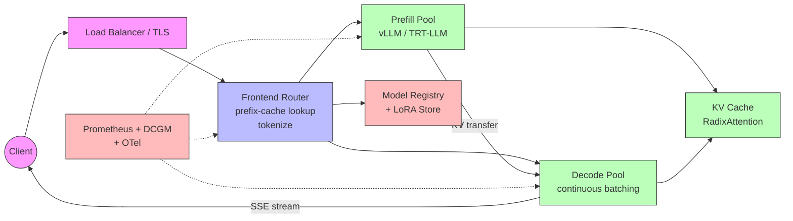
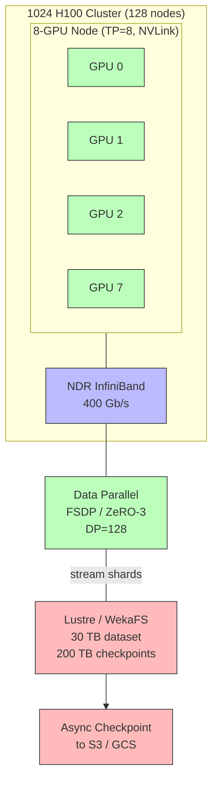
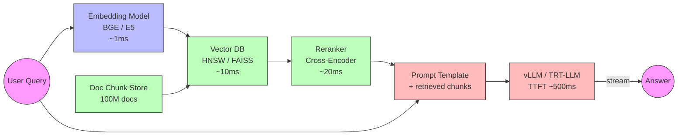
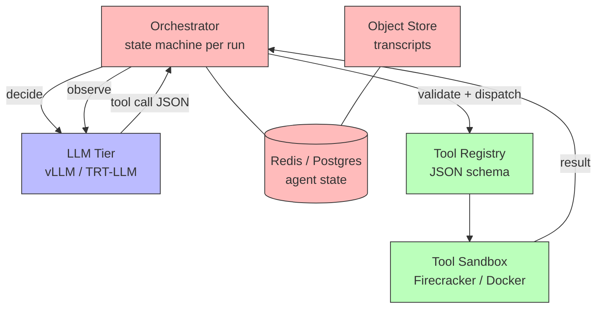
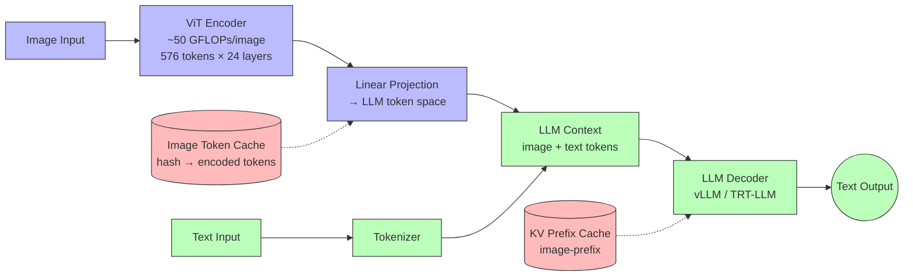
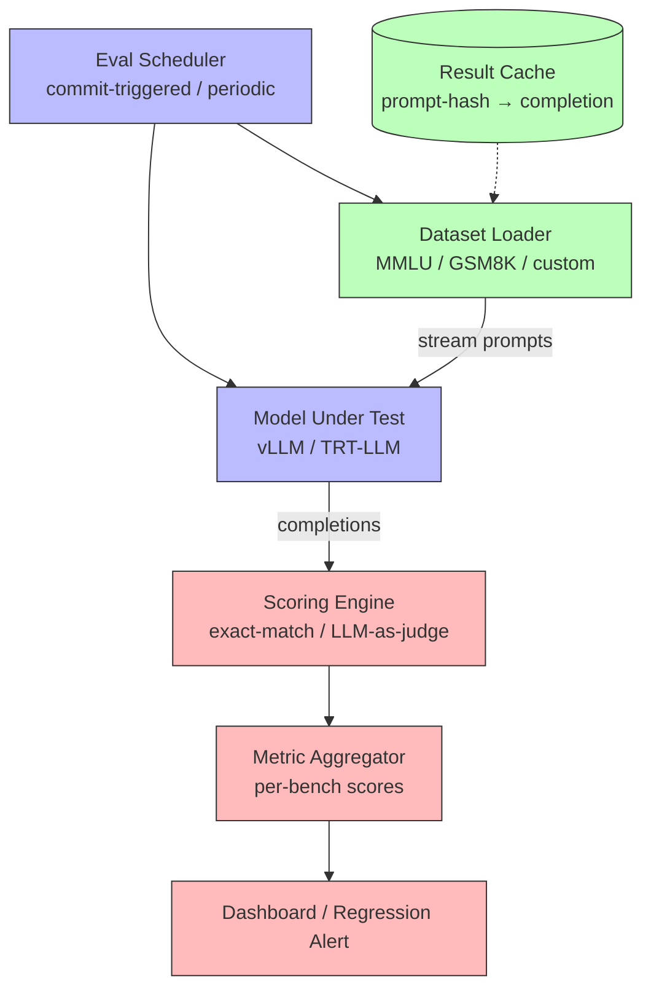
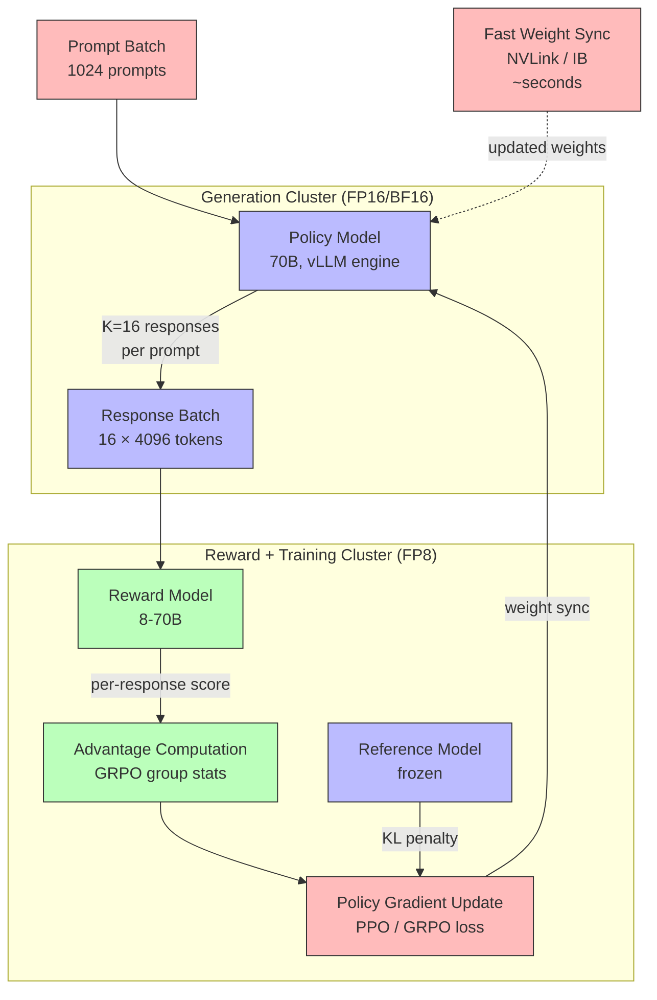

# System Design Interview

How to approach AI-infra system design questions. Covers the framework you should run for any prompt, seven fully worked example designs (LLM serving, training cluster, RAG, agent orchestrator, multi-modal pipeline, eval harness, RLHF/GRPO training), the numbers you must memorize, and the failure modes that kill candidates.

**Prerequisites**: All preceding pages, especially [Production_Architecture](../L8_Inference_and_Serving/Production_Architecture.md), [Inference_Frameworks](../L8_Inference_and_Serving/Inference_Frameworks.md), [Distributed_Training](../L7_Training_Stack/Distributed_Training.md).

---

## 1. The 7-Step Framework

When a system design question lands, run these steps out loud.

1. **Clarify the problem.** Scope, scale, SLOs, must-haves vs nice-to-haves, multi-tenant or single, data residency. Don't skip — the actual problem is rarely what the prompt says.
2. **Estimate the load.** RPS, tokens/sec, peak vs steady, prompt/output length distributions, growth.
3. **Pick the model & hardware.** Size, precision, target tokens/sec per GPU, fleet size from capacity math.
4. **Lay out the architecture.** Edge / router / engine / storage / observability tiers. Draw it.
5. **Walk a request through.** End-to-end. Forces you to surface gaps in step 4.
6. **Discuss tradeoffs.** Why this disaggregation choice? Why this batch size? Why not the alternative?
7. **Talk about failures, scaling, and ops.** What breaks? How do you detect? How do you recover? What's the on-call life?

Most candidates rush to step 4. Strong candidates spend ~30% of the interview on 1–3.

---

## 2. Numbers You Must Have Memorized

| Quantity | Value |
|----------|-------|
| H100 FP16 peak | ~989 TFLOPS dense |
| H100 FP8 peak | ~1979 TFLOPS dense |
| H100 HBM3 BW | 3.35 TB/s |
| H100 HBM capacity | 80 GB (HBM3) / 96 GB (HBM3e) |
| H100 ridge (FP16) | ~295 FLOP/B |
| B200 HBM | 192 GB @ 8 TB/s |
| B200 FP8 | ~5 PFLOPS dense |
| NVLink 4 (Hopper) per-GPU BW | ~900 GB/s aggregate |
| NVL72 NVLink fabric | ~1.8 TB/s per GPU |
| NDR InfiniBand | 400 Gb/s = 50 GB/s |
| XDR InfiniBand | 800 Gb/s = 100 GB/s |
| PCIe Gen5 x16 | 64 GB/s |
| Llama-3-70B params | 70B → 140 GB FP16, 70 GB FP8 |
| Llama-3-70B KV/token | 320 KB (GQA H_kv=8) |
| Llama-3-8B KV/token | 128 KB |
| MFU target dense BF16 | 45–55% |
| Decode TPOT (70B FP16, batch 1) | ~42 ms (BW-bound) |
| Tokens/sec/H100 (70B FP8 decent batch) | ~1500 |
| Cost (cloud H100/hour) | $20-30/8-GPU node |

For full derivations see [Memory_Hierarchy_and_Roofline](../L3_Microarchitecture/Memory_Hierarchy_and_Roofline.md), [GPU_Architecture](../L3_Microarchitecture/GPU_Architecture.md), [Networking_and_Interconnect](../L4_Systems_and_Interconnects/Networking_and_Interconnect.md).

---

## 3. Worked Design 1: "Design an LLM API Service"



### Clarify

- Models: Llama-3 family + a few finetunes? Confirm one model or many.
- SLO: chat tier (TTFT 500ms, TPOT 50ms) and batch tier (high throughput, lax latency).
- Scale: target peak RPS, e.g., 10K.
- Multi-tenant. Per-tenant rate limits.
- Streaming responses required.
- Geographic: US + EU regions for residency.

### Estimate

- 10K RPS peak, average 200 input + 200 output tokens → 4M tokens/sec.
- Per-replica throughput: 70B FP8 ≈ 1500 tok/s → ~2700 replicas. Each replica is one 8× H100 node.
- 2700 nodes is huge → push for optimization first: prefix caching, spec decoding, smaller model variants.
- Realistic: chat workload has 60% prefix-cache hit, spec decode 2× → effective ~5000 nodes worth of work spread, ~1000 nodes is plausible.

### Hardware

- H100 8× nodes, NVL72 if available. NDR IB cross-node.
- Storage: S3 for cold weights, NVMe per node for hot, regional CDN for downloads.

### Architecture

(Cribbed from [Production_Architecture](../L8_Inference_and_Serving/Production_Architecture.md).)

- Edge: TLS, WAF, auth, rate limit, anycast routing to nearest region.
- Frontend / Router: tokenize, choose model, locality-aware backend selection.
- Inference: vLLM or TRT-LLM replicas; disaggregated PD pools above ~1000 RPS per region.
- Storage: model registry, LoRA store, log/audit pipeline.
- Observability: Prometheus + DCGM + OTel.

### Walk a request

User → TLS → auth → rate limit → router (prefix-cache lookup, choose replica) → tokenize → engine admit (chunked prefill if long) → step loop streams tokens back via SSE.

### Tradeoffs

- vLLM (broad coverage, fast features) vs TRT-LLM (lower latency, harder ops).
- Disaggregation (~30% fewer GPUs but more complex) vs coupled (simpler but higher GPU count).
- Spec decoding (2-3× throughput, requires draft model) vs none.

### Failures

- Replica crash → liveness probe restart, requests rerouted. Client sees retry.
- Hot LoRA causes thrashing → pin, replicate, or warm-pool.
- Region failover → secondary region absorbs; dataloader replication ensures no data loss.

---

## 4. Worked Design 2: "Train a 70B Model on 1024 GPUs"



### Clarify

- Goal: pretrain or fine-tune?
- Data scale: 15T tokens for full pretrain.
- Hardware: 1024 H100 across 128 nodes? Yes.
- Time budget: 30 days.
- Checkpoint cadence + storage.

### Capacity & Time

- 70B params; FLOPs/token ≈ 6 · 70e9 = 4.2e11.
- 15T tokens × 4.2e11 = 6.3e24 total FLOPs.
- 1024 H100 × 989 TFLOPS × 50% MFU = 5e17 FLOPs/sec.
- 6.3e24 / 5e17 = 1.26e7 sec ≈ 146 days. Too long.
- Either reduce tokens (7T, ~70 days), reduce model, or add hardware.
- Move to FP8 → ~30 days achievable on 1024 H100.

### Parallelism

- TP=8 within each 8-GPU node (NVLink).
- DP=128 across nodes (FSDP / ZeRO-3).
- PP=1 (model fits with TP=8 + ZeRO-3).
- Sequence parallel + selective recomputation.

### Network

- NDR IB across nodes; rail-optimized topology.
- 2 NICs per node, NCCL channels = 4-8.

### Storage

- Dataset: 15T tokens × 2 bytes ≈ 30 TB (on Lustre / WekaFS).
- Checkpoints: 1.1 TB each, hourly + on-demand. 24/day. Async DCP. 200 TB checkpoint store.

### Failures

- Per-day GPU failure rate ~1 in 1000 = 1/day expected on 1024.
- Spare nodes; restart from last checkpoint.
- Watchdog on step time to detect hangs / stragglers.

### Hyperparameters

- BF16 + FP8 forward (Transformer Engine). FP32 master weights.
- AdamW; LR cosine schedule, 4K warmup, peak 3e-4.
- Global batch 4M tokens (microbatch=2, accum=16, DP=128, seq=8192 → matches).
- Gradient clip 1.0.

---

## 5. Worked Design 3: "Build a RAG System"



### Clarify

- Corpus size: 100M docs.
- QPS target.
- Freshness: real-time or daily refresh?
- Multi-tenant per-corpus or unified?
- Latency budget for retrieval vs generation.

### Architecture

```
query → embed (1ms) → vector search (10ms) → rerank (20ms) →
        retrieve docs → prompt template → LLM (TTFT 500ms) → stream
```

- Embedding model: BGE / E5 / OpenAI text-embedding-3, on a smaller GPU pool (one A10/L4 per replica).
- Vector DB: FAISS / Pinecone / Weaviate / Milvus. HNSW for ANN.
- Reranker: cross-encoder on smaller GPU pool.
- LLM: vLLM/TRT-LLM as before.

### Capacity

- 100M docs × 1024-dim FP16 embedding = 200 GB. Sharded across vector DB nodes.
- Index update path: nightly batch reindex + incremental updates via streaming.

### Tradeoffs

- HNSW (fast, RAM-bound) vs IVF-PQ (compressed, slightly slower).
- Reranker (better quality, +20ms TTFT) vs no rerank.
- Long context (drop chunks into prompt) vs many short retrievals (cheaper).
- Generate before retrieve ("fusion-in-decoder") for some workloads.

### Caching

- Query → embedding cache (hash-based).
- Query + retrieved → answer cache (TTL).
- Document chunks → KV prefix cache in inference engine for hot docs.

### Failures

- Embedding model down → answer without retrieval (fallback prompt) or 503.
- Vector DB shard down → query other replicas; rebuild from snapshot.
- LLM slow → degrade to smaller model.

---

## 6. Worked Design 4: "Agent Orchestration Platform"



### Clarify

- Agents: tool-calling LLM loops? Multi-agent communication?
- Tool latency: ms to seconds.
- Streaming UX or batch?
- Persistence: agent state must survive restarts.

### Architecture

- LLM tier (as before).
- Tool execution tier: sandboxed runtime per call (Firecracker / Docker / V8 isolate).
- Agent state: Redis / Postgres for short term; object store for transcripts.
- Orchestrator: schedules each step in the agent loop (decide → call tool → observe → decide …).
- Concurrency: each agent run is its own state machine; many concurrent.

### Latency Budget per Step

- LLM call (500ms TTFT + 50 ms·N decode tokens).
- Tool call (10 ms to 30 s — bounded by timeout).
- Total step: 1–5s typical.

### Tool Calling Engine

- LLM emits structured tool calls (JSON schema, grammar-constrained).
- Orchestrator validates against tool registry, dispatches to tool tier, returns result to LLM context.

### Persistence

- Each agent run has a persistent context (transcript). Token-bounded; summarize old steps when context blows.
- Resumable across restarts via state checkpoint.

### Tradeoffs

- ReAct-style loop (LLM-driven control) vs rigid DAG (predictable, less flexible).
- Single-LLM agents vs multi-agent (more capable, harder to debug, ratelimit risk).
- Synchronous tool calls vs async (parallelize independent ones).

### Failures

- Tool timeout → return error to LLM, let it decide next step.
- LLM safety classifier blocks → ask user / abort.
- Infinite loop (LLM keeps calling same tool) → step counter + human-in-loop escalation.

---

## 7. Worked Design 5: "Multi-Modal Inference Pipeline"



### Clarify

- Input modalities: image, audio, video?
- Output: text only or also audio/image?
- Model: VLM (single model) or pipeline (encoder + LLM)?
- Latency budget.

### Architecture

```
Input image → ViT encoder → image tokens →
                                          --> LLM context --> text out
Input text → tokenizer → text tokens   →
```

For VLM (Llava-style): vision encoder runs on the image, projects into LLM token space, prepended to text.

### Capacity

- **Image encoding FLOPs**: ViT-L processes 576 patches (224×224 image, 16×16 patch) through 24 transformer layers. Per-layer cost: 2 × 1024² × 576 ≈ 1.2 GFLOPs → 24 layers ≈ 29 GFLOPs. With projection head and MLP overhead: ~50 GFLOPs/image. On a single L4 (60 TFLOPS FP16): ~1ms/image — negligible.
- **Text-image fusion attention**: LLM cross-attention over image tokens is dense. For 576 image tokens in a 70B model: attention cost = 2 × d × L × 576 per layer. At 80 layers: ~10× more expensive than 576 text tokens due to larger hidden dim. Budget ~20-30% extra context FLOPs vs text-only.
- **LLM**: same as before, but context is longer (image tokens inflate prompt by 576-2048 tokens per image).
- **KV cache**: larger because of image tokens. 70B model: 320 KB/token × 576 image tokens = 184 MB per image in KV. With 100 concurrent image requests: 18.4 GB just for image prefixes — plan GPU memory accordingly.

### GPU Allocation

- Single-node split: on 8×H100, dedicate 1 GPU to ViT encoder (FP16, low utilization, handles many concurrent encodes), 7 GPUs to LLM decoder with TP=7 (or TP=8 with encoder time-sliced). Alternative: separate encoder pool on cheaper GPUs (L4/A10) and forward image tokens over NVLink/IB.
- Latency budget: image encode 1ms + prefill 100ms + decode as usual. Image encoding never the bottleneck.

### Caching

- **Image token cache**: hash image bytes → encoded token tensor. For user-generated content: ~5-10% hit rate (re-uploads, thumbnails). For product/stock images: 40-60% hit rate. Saves the 50 GFLOPs encode cost on hits.
- **KV prefix cache**: cache the image-prefix KV entries. Same image + same system prompt = shared prefix across requests. RadixAttention handles this automatically. Expected savings: 30-50% of prefill compute for cached image+system prefixes.
- **Multi-modal KV sizing**: with 576 image tokens per request and 320 KB/token: 184 MB prefix per unique image. A 10K-entry image prefix cache needs ~1.8 TB — distributed across the decode pool's GPU HBM, or offloaded to CPU RAM with tiered caching.

### Streaming

- Image arrives → encode → kick off LLM with image prefix while still uploading? Possible if streaming upload is supported.

---

## 8. Worked Design 6: "Eval Harness for LLM Quality"



### Clarify

- Benchmarks: MMLU, GSM8K, HumanEval, MT-Bench, custom.
- Continuous (per commit) or periodic.
- Scale: thousands to millions of eval examples.
- Reproducibility requirements.

### Architecture

```
Eval runner →
   - Loads model under test (vLLM/TRT-LLM).
   - For each benchmark dataset:
        - Streams prompts.
        - Records completions.
        - Scores via reference / judge.
   - Aggregates scores; logs to dashboard.
```

### Capacity

- **MMLU walkthrough**: 14K questions × 4 choices × ~100 output tokens = 5.6M tokens to generate. On 8×H100 at 1500 tok/s per GPU: ~47 minutes wall time. With 2 nodes (16 GPUs): ~23 minutes. This is the "fast CI gate" scenario.
- **1M prompts**: × 200 output tokens × 50ms TPOT = 10K hours serial = 1.4M GPU-hours? No — parallelize across replicas. 64 replicas × 1500 tok/s = 96K tok/s; 1M·200 / 96K ≈ 35 min. Feasible.
- **Parallel run budget**: On a dedicated 4-node (32 H100) eval cluster, you can run ~4 eval jobs in parallel (8 GPUs each for a 70B model). MMLU + GSM8K + HumanEval + MT-Bench run in ~1 hour total. Budget this into CI: block merge on regression, allow ~2 hour eval window.

### Tradeoffs

- **Batch size vs latency vs throughput for eval workloads**: eval is offline — maximize throughput with large batch sizes (256+). TPOT is irrelevant; only total wall time matters. But: very large batches spike GPU memory (KV cache). For a 70B model on 8 H100: batch 256 uses ~256 × 200 tokens × 320 KB/token = 16.4 GB KV — fits easily. Batch 1024: 65.6 GB — tight. Sweet spot: 512 with chunked prefill.
- **Greedy (temp=0) vs sample-N**: greedy is deterministic and 1× cost. Sample-N (N=5-10) catches stochastic failures but multiplies cost N×. Pragmatic: greedy for CI, sample-N for nightly full regression.
- **Judge model size**: LLM-as-judge with 70B is reliable but expensive (eval-on-eval). Use 8B judge for CI, 70B judge for release gates. Human spot-check 1-2% of borderline cases.

### Determinism

- Fix sampling: temperature=0 or seed-pinned.
- Pin model checkpoint, tokenizer, engine version.
- Per-eval cache results so re-runs are cheap.

### Judge

- For open-ended outputs: LLM-as-judge with another model. Risks (judge bias) → use multiple judges, human spot-check.
- For closed-ended: exact match, F1, BLEU, pass@k.

### Failures

- Eval engine OOM on long prompts → cap input length.
- Judge LLM disagreement on borderline answers → human review pipeline.
- Score drift after engine upgrade → bisect.

---

## 9. Worked Design 7: "RLHF/GRPO Training Infrastructure"



### Clarify

- Algorithm: GRPO (Group Relative Policy Optimization) — no separate critic model. PPO variant with group-based advantage estimation.
- Policy model size: 70B. Reward model: 8B or same-size.
- Generation parameters: K=16 responses per prompt, max output 4096 tokens.
- Training hardware: 16×H100 nodes or more. Time budget: continuous training for days/weeks.

### The Inference-Inside-Training Problem

GRPO's generation step is the dominant cost. Each training step requires a full inference pass (KV cache, continuous batching, sampling) to produce K completions per prompt. This is not standard training — it needs an inference engine (vLLM, TensorRT-LLM) embedded inside the training loop.

**Why it matters**: The generation step produces orders of magnitude more tokens than the training step consumes. A single GRPO step with batch 1024 and K=16 produces 16 × 4096 × 1024 = 67M tokens. On 16×H100 at 1500 tok/s each: 67M / 24K = ~46 minutes of generation per training step. The actual gradient computation is ~2 minutes. Generation is 95%+ of step time.

### Capacity Math

- **Tokens per step**: batch_size × K × max_output = 1024 × 16 × 4096 = 67.1M tokens.
- **Generation throughput**: 16×H100 at 1500 tok/s = 24K tok/s aggregate. Wall time: 67.1M / 24K ≈ 46 min/step.
- **Training throughput**: 70B model, 6 × 70e9 = 420 GFLOPs/token. With 16×H100 FP8 at 50% MFU: 16 × 1979 × 0.5 = 15.8 PFLOPS. Per-step FLOPs: 1024 × 16 × 4096 × 420e9 ≈ 2.8e19. Time: 2.8e19 / 15.8e15 ≈ 30 min.
- **Total step time**: ~46 min generation + ~30 min training + ~2 min overhead ≈ 78 min/step. At 500 steps to convergence: ~27 days.
- **Scaling**: doubling GPUs halves both phases. 32×H100 → ~14 days. 64×H100 → ~7 days.

### Infrastructure Design

- **Generation cluster**: runs vLLM in BF16/FP16 for generation quality (FP8 quantization can degrade sample diversity). Continuous batching, prefix caching for shared prompts. This cluster is sized for token throughput.
- **Training cluster**: runs FP8 for throughput via Transformer Engine. FSDP/ZeRO-3 sharding across nodes. This cluster is sized for FLOPs.
- **Weight sync**: after each gradient update, updated policy weights must be transferred to the generation cluster. 70B BF16 = 140 GB. Over NVLink (900 GB/s intra-node): ~160ms. Over IB (50 GB/s inter-node): ~3s. Tolerable once per step.
- **vLLM-inside-training pattern**: frameworks like OpenRLHF and TRL wrap vLLM as the generation backend. The training framework (PyTorch FSDP) owns the weight update loop; vLLM serves as a black-box token generator, receiving weight updates via shared memory or parameter broadcast.

### Tradeoffs

- **GRPO vs PPO**: GRPO eliminates the critic model (saves 50% of training compute) but needs K responses per prompt (higher generation cost). Net: GRPO wins at K=8-16 for most workloads.
- **Shared vs separate generation/training cluster**: shared (same GPUs do both) maximizes utilization but requires mode-switching (inference engine teardown → training setup). Separate clusters are simpler to operate but leave generation GPUs idle during training phase. At scale (>64 GPUs), separate is standard.
- **Online vs offline generation**: online (generate fresh each step) is standard for RLHF. Offline (pre-generate, reuse) saves compute but stale data hurts policy quality.

### Failures

- **Generation OOM**: large K × batch × max_output inflates KV cache. Mitigation: chunk generation into micro-batches, cap max_output per response.
- **Weight sync stalls**: network hiccup delays update propagation → stale policy generates lower-quality samples. Timeout + skip generation with stale weights + alert.
- **Reward model collapse**: if reward model is trained alongside policy, it can overfit to current policy behavior. Mitigation: freeze reward model checkpoints, periodic human evaluation.
- **NaN loss from advantage explosion**: group advantage computation can spike. Gradient clip (max_norm=1.0) + advantage normalization per group.

---

## 10. Common Tradeoff Axes

These appear in every design.

| Axis | Sketch |
|------|--------|
| Latency vs throughput | Smaller batch → lower latency; bigger batch → higher throughput. Disaggregation breaks the conflict. |
| Quality vs cost | Bigger model = better answers + 5× more $. Quantization + distillation reduce gap. |
| Generality vs efficiency | One model for all vs specialized models per task. Most products land on a small palette of tier-sized models. |
| Build vs buy | Run vLLM yourself vs pay for managed (Bedrock, Together, Anyscale). Buy until hitting scale or compliance pain. |
| Open-source vs closed | Llama-3 / Qwen / DeepSeek vs GPT/Claude. Open gives control + cost; closed gives quality + ops simplicity. |
| Sync vs async | Streaming is sync (kept connection); batch/agent flows async. Streams are state-heavy. |
| Stateless vs stateful | Engines are stateful (KV). Frontends/routers should be stateless for HA. |

---

## 11. Failure Modes That Kill Candidates

- **Jumping to the architecture** without clarifying scale, SLO, multi-tenancy.
- **Vague capacity numbers** ("a lot of GPUs") instead of math.
- **Ignoring failures** — assuming everything works, no replication, no checkpoint.
- **Forgetting observability** — "how would you know if it's broken?"
- **Hand-waving tradeoffs** — "we'd use vLLM" without saying why over TRT-LLM.
- **Designing for max scale on day one** — over-engineering. Mention "start with X, evolve to Y at Z scale."
- **Mixing layers** — putting load balancing inside the engine, putting model logic in the router.
- **Not computing SLO budget** — answering "TPOT 50ms" without checking if your batch size + KV math allows it.

---

## 12. Strong Closing Habits

- Restate the SLOs you're hitting.
- Sketch the next 3–6 month roadmap (autoscaling improvements, FP4 rollout, regional expansion).
- Acknowledge unknowns ("if traffic is spikier than estimated we'd need …").
- Ask the interviewer about a specific area you want to deepen.

---

## 13. Practice Prompts

Try these in 45 minutes each:

1. Design a system to serve a 405B MoE model with 10K concurrent users and TTFT < 1s.
2. Train a 13B model on 64 H100s in a research lab; design the cluster.
3. Build a real-time voice agent (audio-in, audio-out, < 500ms turn latency).
4. Design a structured-output JSON-extraction service over a 70B model with strict schema.
5. Design a fine-tuning service that lets users upload data, kicks off LoRA training, deploys for inference.
6. Multi-region deployment with sub-200ms TTFT for users in NA/EU/Asia.
7. RAG over 10B documents, refreshed hourly.
8. RLHF training pipeline with online sampling for GRPO at the scale of DeepSeek.

For each: run the 7-step framework, write down the numbers, draw the boxes, talk through failures.

---

## 14. Common Interview Questions

**Q: An interviewer asks "how would you design ChatGPT-style serving?" — what do you do first?**
A: Clarify scope: what scale? Single model or family? SLO targets? Multi-tenant? Then estimate load (RPS, tokens/sec). Only then start drawing components.

**Q: How do you decide between vLLM, TRT-LLM, and a custom engine?**
A: Off the shelf wins until proven otherwise. vLLM for general purpose and rapid feature uptake. TRT-LLM when you need NVIDIA peak performance and have a build pipeline. Custom only when you have a very specific bottleneck the OSS engines don't address. Mention you'd benchmark before committing.

**Q: Walk me through the math: 1000 RPS of 70B FP8 inference on H100.**
A: Average 200 input + 200 output tokens. Throughput per H100 ~1500 tok/s. 1000 RPS × 400 = 400K tok/s. 400K / 1500 = 267 H100s. Round up for headroom (~300, ~38 nodes of 8 GPUs).

**Q: How would you make this 50% cheaper?**
A: (1) Spec decoding 2-3× → halve. (2) FP4 / MXFP weights → another 30% if available. (3) Prefix caching at scale (~30% if chat-heavy). (4) Use lower-tier hardware for non-SLO traffic. (5) Disaggregated PD for utilization.

**Q: How do you pick a model parallelism layout?**
A: Start with constraints: model size, NVLink domain, network. Try TP up to NVLink size first. Add ZeRO-3 (FSDP) for DP-shardable memory. PP only if the above don't fit. EP only for MoE. Verify with capacity math before committing.

**Q: How do you decide chunked prefill chunk size?**
A: Start at 2048; if TPOT during long-prompt admission spikes, lower to 512–1024. If TTFT inflated, raise. Workload-dependent — measure on realistic traces.

**Q: How would you migrate from FP16 to FP8 in production?**
A: Stage: (1) Calibrate on a representative dataset; (2) shadow deploy FP8 alongside FP16, compare outputs and metrics on canary traffic; (3) ramp gradually with feature flag; (4) full cutover; (5) keep FP16 fallback for one rollback window.

**Q: How do you prevent one tenant from starving others?**
A: Per-tenant rate limits at the edge; weighted fair queueing in the router; priority classes per SLO tier; dedicated replicas for top tiers. At engine layer, admission control respects these signals.

**Q: How do you handle a sudden 10× traffic spike?**
A: Warm pool absorbs the immediate burst; HPA scales out; rate-limit excess back to clients with 429 + retry-after; degrade non-critical paths (turn off spec decode if it doesn't help; use smaller model for batch tier). Post-incident: increase warm pool baseline and HPA aggressiveness.

**Q: What's the biggest reliability risk in an LLM service?**
A: A few candidates: cascading failures from a hot LoRA / hot prompt; silent quality regressions after upgrades; KV pool exhaustion under burst; cross-tenant noisy neighbor. Defenses: rate limits, shadow tests, observability, isolation.

**Q: How do you balance prefill and decode pool sizes?**
A: Compute per-second prefill FLOPs vs per-second decode bytes for the workload mix. Size each pool to its bottleneck. Re-tune monthly as traffic shape evolves; autoscaling smooths short-term fluctuation.

**Q: How does the design change for batch (offline) vs online inference?**
A: Batch: maximize throughput, longer chunks, no SLO, reuse GPU 100%. Online: respect TTFT/TPOT, smaller chunks, autoscale on latency. They can share hardware via mixed pools with priority preemption.

---

## 15. Further Reading

- "Designing Data-Intensive Applications" (Kleppmann) — system thinking applies broadly.
- Production Engineering blogs from Meta, OpenAI, Anthropic, Anyscale, Mosaic.
- USENIX OSDI / NSDI papers — Mooncake, Splitwise, Sarathi, Orca, vLLM, RadixAttention.
- "AI Infrastructure for Anyone" — MosaicML.
- Various GTC and AI Engineer Summit talks.

---

**Next:** [Common_Interview_Questions](Common_Interview_Questions.md).
**See also:** [Production_Architecture](../L8_Inference_and_Serving/Production_Architecture.md), [Inference_Frameworks](../L8_Inference_and_Serving/Inference_Frameworks.md), [Distributed_Training](../L7_Training_Stack/Distributed_Training.md).
